按照 GAMES104 介绍的架构，一般按照这样的层次来构建：

```plaintext
工具层

功能层

资源层

核心层

平台层
```

**功能调用基本上是自上而下(上层调用下层)**

:::note

"如同所有软件系统，游戏引擎也是以软件层(software layer）构建的。通常上层依赖下层，下层不依赖上层。当下层依赖上层时，称为循环依赖(circular dependency)。在任何软件系统中，循环依赖都要极力避免，不然会导致系统间复杂的耦合（coupling)，也会使软件难以测试，并妨碍代码重用。对于大型软件系统，如游戏引擎，此问题尤其重要。"

:::

## **平台层**

上层的架构庞大而复杂, 而用户的使用环境/设备多种多样(PC/MAC...   键鼠/手柄/体感...)

因此平台层需要保证**可移植性**

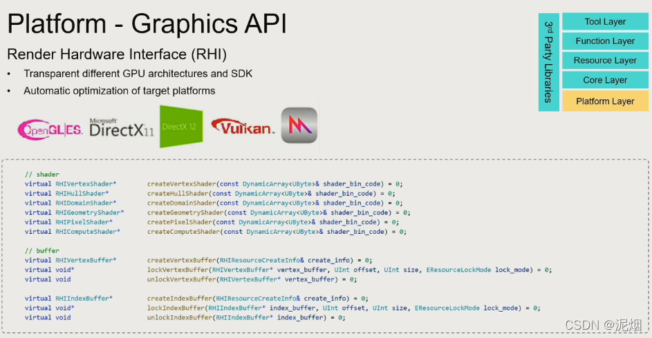

Game Engine Architecture by Jason Gregory节选：

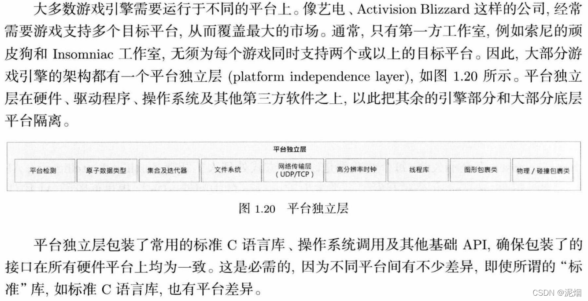

这一层要考虑的地方只多不少，一些细节问题是非常折磨人的。

以文件系统为例，如果我们要同时支持从MacOS，Linux，Windows下获取当前可执行文件的路径，我们必须这样写：

```cpp
std::filesystem::path PlateForm::getExecutablePath() noexcept
    {
#ifdef __linux__
        char    buffer[PATH_MAX];
        ssize_t len = readlink("/proc/self/exe", buffer, sizeof(buffer) - 1);
        if (len != -1)
        {
            buffer[len] = '\0';
            return std::filesystem::path(buffer);
        }
#elif _WIN32
        char buffer[MAX_PATH];
        GetModuleFileNameA(NULL, buffer, MAX_PATH);
        return std::filesystem::path(buffer);
#elif __APPLE__
        char     buffer[PATH_MAX];
        uint32_t size = sizeof(buffer);
        if (_NSGetExecutablePath(buffer, &size) == 0)
        {
            return std::filesystem::path(buffer);
        }
#endif
        return std::filesystem::current_path() / "RealmEngine";
    }
```

类似这段代码，如果是网络传输等其他模块，或者是Switch这类非常规的操作系统，这部分要考虑的细节应该会更多。

除此之外，我们有时候也会把图形API列入平台层，毕竟不同平台对图形API的支持也不同，我们不可能在Linux上用DX12来渲染。

Piccolo引擎的做法是引入RHI（Rendering Hardware Interface），利用虚函数对Vulkan API进行封装。尽管RHI似乎并不是业界所推崇的做法，因为许多图形API的概念差别太大，强行适配同一套RHI，很容易就会陷入过度设计的陷阱。

现在更加推荐的是在图形API这一块再进行一次分层。

例如类似这样（此部分由 AI 生成）

1. **平台抽象层 (Platform Abstraction Layer, PAL):**

   * **职责:**  隐藏操作系统和硬件平台的差异。
   * **内容:**  窗口创建、线程管理、内存分配、文件操作等。
   * **目的:**  让RHI代码可以跨平台运行。
2. **设备抽象层 (Device Abstraction Layer, DAL):**

   * **职责:**  管理物理渲染设备（例如：GPU）。
   * **内容:**  设备创建、设备选择、驱动程序管理、设备信息查询等。
   * **目的:**  允许RHI在不同的GPU硬件上运行，并提供对GPU硬件能力的查询接口。
3. **上下文管理层 (Context Management Layer):**

   * **职责:**  管理渲染上下文（例如：Direct3D 的 Device Context 或 Vulkan 的 Command Buffer）。
   * **内容:**  上下文创建、上下文切换、资源绑定、命令记录等。
   * **目的:**  提供一个统一的接口来控制渲染命令的执行。
4. **资源管理层 (Resource Management Layer):**

   * **职责:**  管理渲染资源（例如：纹理、缓冲区、着色器等）。
   * **内容:**  资源创建、资源销毁、资源更新、资源绑定等。
   * **目的:**  提供一个高效的资源管理机制，例如资源池、引用计数等。
5. **命令列表层 (Command List Layer):**

   * **职责:**  管理渲染命令列表 (Render command list)。
   * **内容:**  记录渲染命令、优化命令列表、执行命令列表等。
   * **目的:**  允许将渲染命令批量提交到 GPU，提高渲染效率。
6. **着色器抽象层 (Shader Abstraction Layer):**

   * **职责:**  管理着色器程序。
   * **内容:**  着色器加载、着色器编译、着色器变量绑定等。
   * **目的:**  提供一个统一的着色器管理接口，例如支持不同的着色器语言（HLSL、GLSL 等）。

## **核心层**

游戏引擎以及其他大规模复杂C++应用软件,都需要一些有用的实用软件, 这类软件称为核心系统(core system)，也就是调库。

**常见功能:**

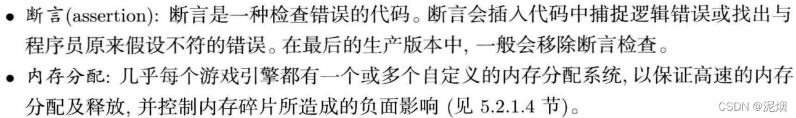

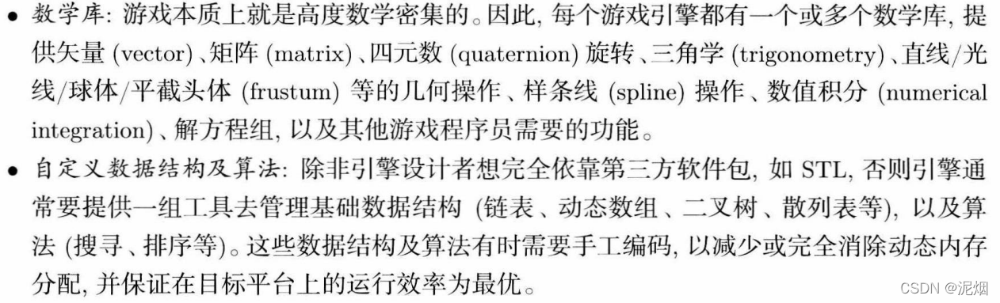

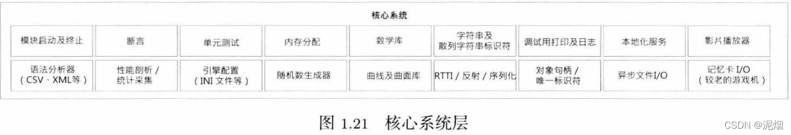

游戏引擎对于底层的效率非常高, STL并不足以满足, 设计者往往会写一套适配的数据结构。

除此之外，内存管理（Memory Management）很重要，游戏引擎的开发与操作系统开发有些类似。

提升CPU、内存效率的三个要点：1.把数据集中存放；2.按照顺序结构排列；3.输入输出以批处理的形式进行。

core层是引擎的核心，对代码质量要求极高（安全、效率），所以我这样的萌新也就只会到处调库了...

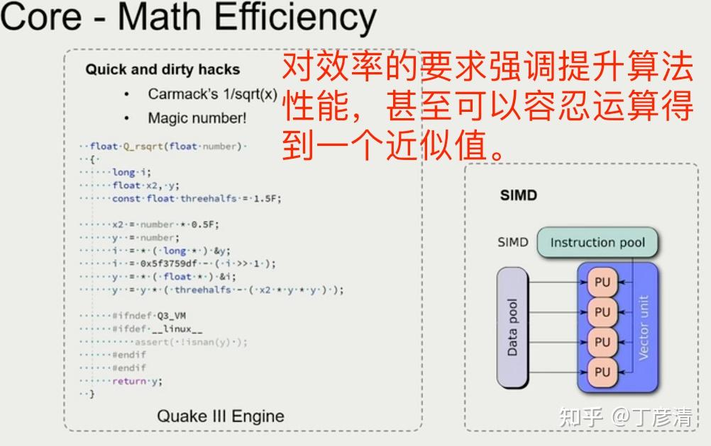

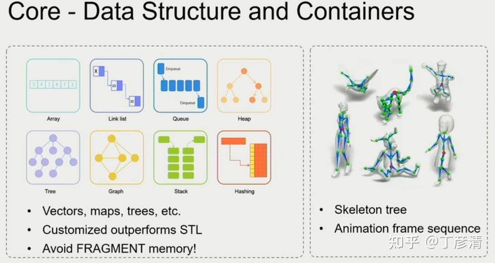

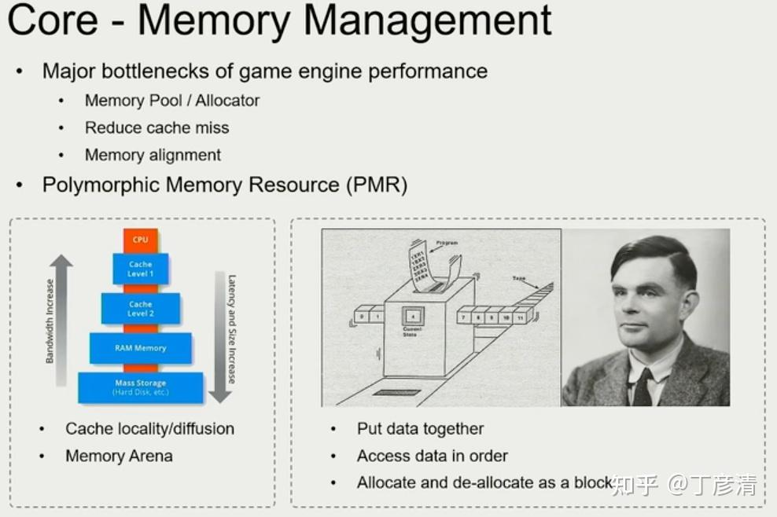

## **资源层**

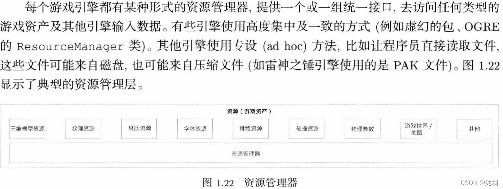

这里我们要区分两个关键的概念：资源（Resource）和 资产（Asset）。

### 资源导入

**这一部分不是资源层，是工具层！**

一般认为，资源是类似PNG，JPG图片，FBX模型，WAV音频等等，这些直接下载到我们磁盘中的资源。

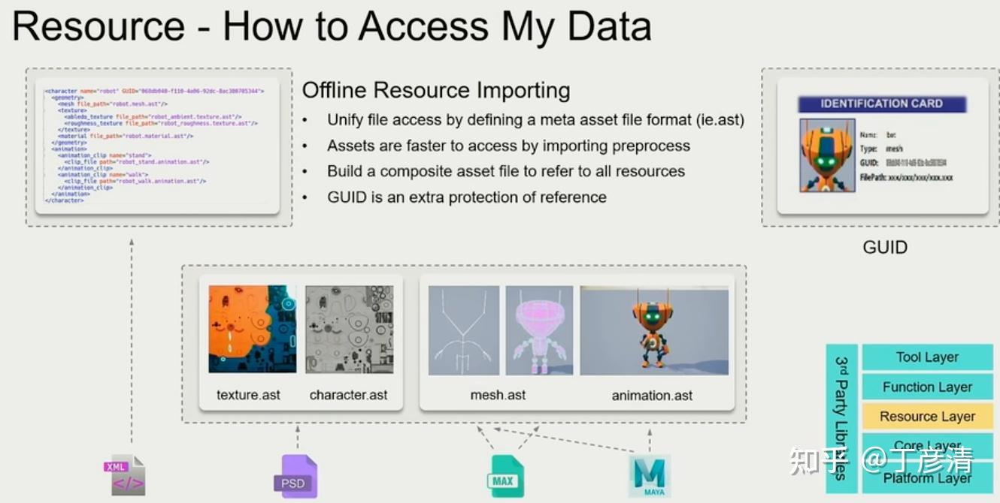

把资源转变成资产的过程，我们称为导入（Import），这个过程经历了：

磁盘资源（二进制/文本，由操作系统的文件系统管理） - >

内存资源（存储在我们编写的导入工具程序所管理的内存块中，由于数据结构的问题，只适合读写和整理，并不适合用于渲染和配置）- >

已管理的磁盘资源（内存资源序列化后的文件 + 一个可选的meta文件，如果内存资源的元数据已经被记录在序列化文件的某一段中，这个meta文件就可有可无了）

打个比方，我们不会每次都去读取一个臃肿的FBX文件的全部内容，一个FBX文件是非常臃肿的，我们需要加载模型作为一个静态物体来渲染的时候，根本就不用加载FBX文件的动画资源，也就是说**导入**的过程就是在对原始资源（Raw Resource）进行整理和分块，变成我们引擎自己管理的**资产**。

然后实际应用时，例如我们要渲染我们的FBX模型，只需要加载（Load）资产（Asset）就可以了。

### 资产加载

游戏引擎最核心的功能就是数据之间的关联。游戏工程文件中会给每一个asset配置一个全局的独一的文件识别号（global unique identify，可以不依据文件的位置查找它），与通过路径查找文件不同。

这样做的原因，一方面是出于对资源再整理的考虑，另一方面是处于对数据关联的考虑，毕竟有了一个GUID，设计编译时的反射序列化就得心应手了。

那么咋管理呢？使用资产管理器（Runtime Asset Manager），其中handle system 在资产查找中起重要作用。

资源层的核心功能之一是管理资产（asset）的生命周期，资产会随着玩家游戏进度不断的加载和卸载，处理不好会对游戏运行造成问题。

在设计上我们可以分离实际的资产加载（使用资产池，保证重复加载时有一个强大的缓存）和资产管理（使用资产池暴露的句柄handle或者描述符Description）

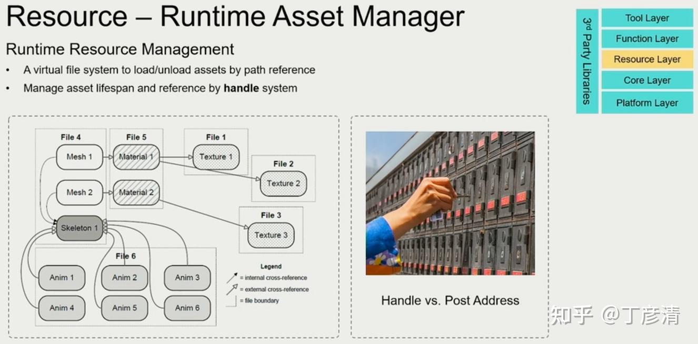

当然，这个部分就属于是运行时的概念了，所以还需要合理地管理它的生命周期。

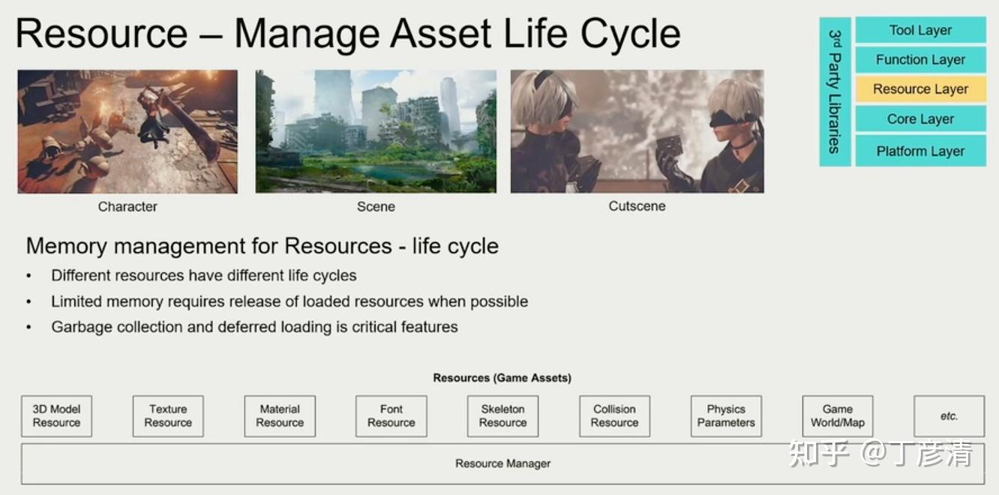

## **功能层**

到这一部分，我们就需要编写数量庞大的应用代码了。

Piccolo引擎把近乎全部的（除了资源管理和场景编辑器）的实际内容全部放在了这个部分，包括一个庞大的Vulkan渲染器。

这一层是游戏引擎实际在Runtime的部分，你可以理解成一个有很多辅助方法的main函数，它管理着众多的Tick，例如游戏逻辑的Tick，渲染器的Tick，输入系统的Tick。但是这个假想的main函数是不存在的，因为游戏引擎最后的运行逻辑应该有被设计的游戏本身来负责，引擎只负责提供API，它是不会实际运行起来的。

:::tip

Unity和Unreal这种商业引擎运行的部分是Editor，也就是场景编辑器，并不是游戏引擎在运行，你可以认为场景编辑器是一个用游戏引擎API编写的程序，它有一个叫做**打包**的方法，可以把自己不需要的内容全部剔除（比如拖拽编辑功能），留下实际让游戏运行的代码+一些meta文件，指导编译器重新对自己编译，得到一个最小化的游戏程序。

:::

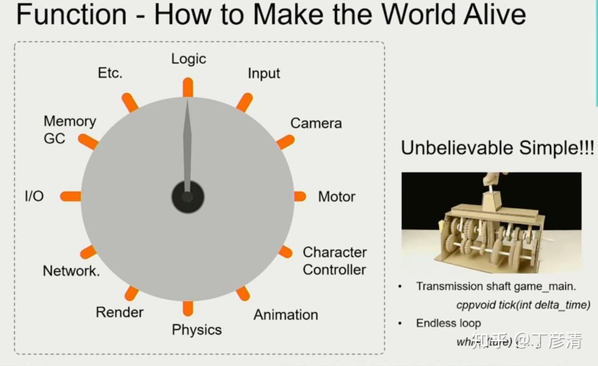

我的个人引擎设计上，沿用了最简的设计方案：LogicalTick+RenderTick。

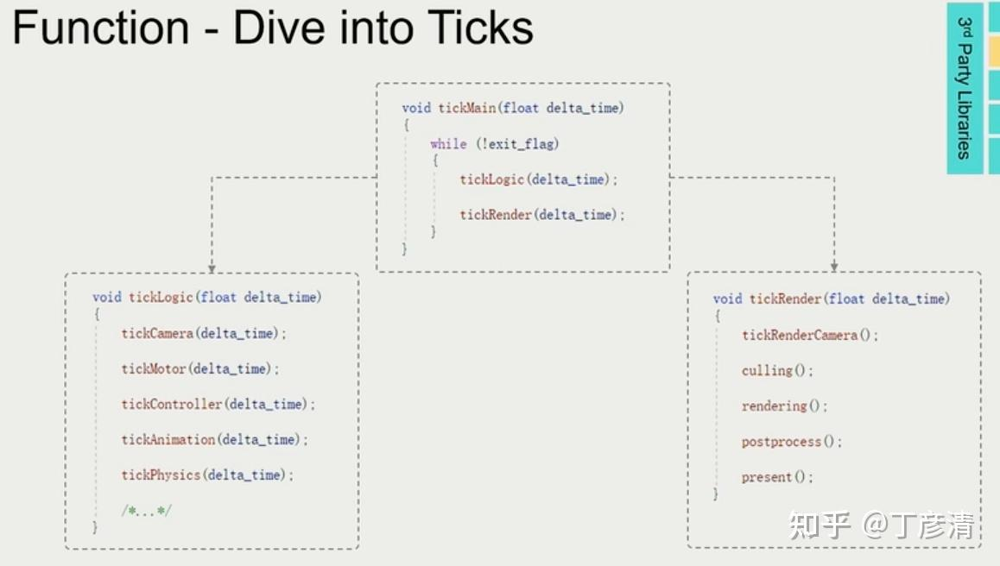

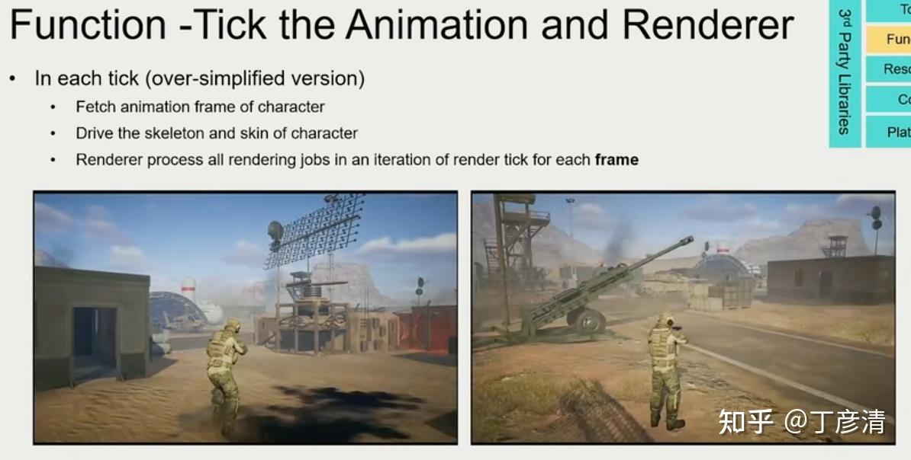

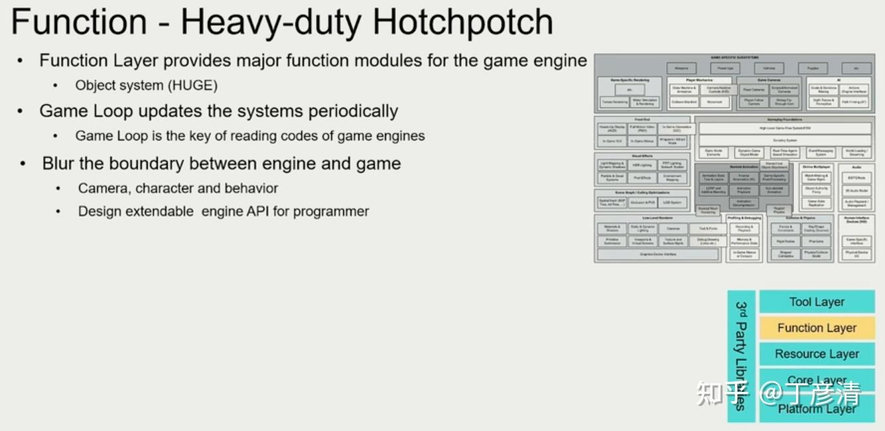

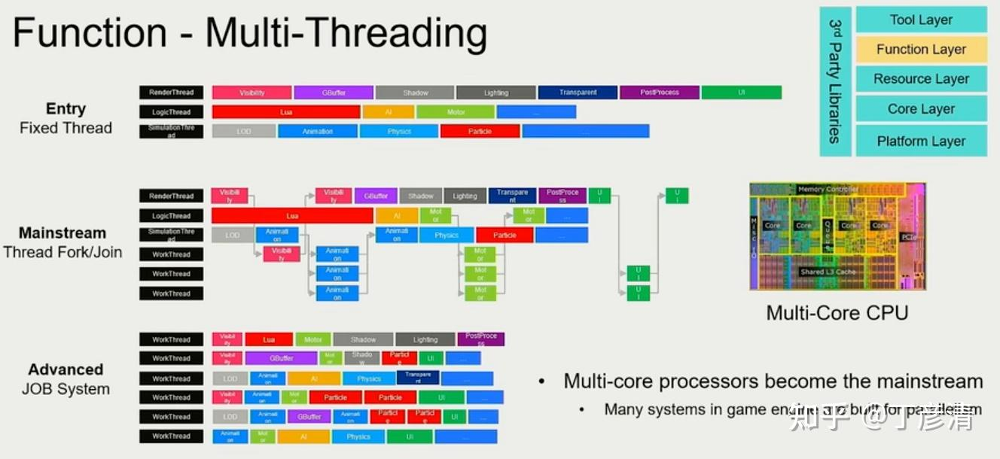

这一部分还会涉及到CPU和GPU的多处理，能把这个部分写得明明白白，在我看来，应该算是这个行业的大佬了吧。

很多引擎在这个层次的大量代码，是非常值得游戏开发者阅读的，例如动画、AI、物理模拟、渲染、粒子系统等等很多非常经典的游戏系统，都是在这个层面上开发的。

## **工具层**

游戏引擎中的最大的一个工具层，就是Editor，我们的游戏编辑器。当然，很多DCC工具也可以算作工具层。

最常用的工具：

Editor编辑器，DCC工具（Blender等），资源导入管线（也就是我们在资源层介绍的）。

这一层基本与Runtime是离线的，也就是说假如我们只有Runtime的代码，也可以做一个游戏，只不过写起来很累。一些meta数据搞不好还要自己手敲，听起来就不现实。

如果想要实际看看没有Editor的游戏引擎长啥样，可以看看Panda3D。当然，没有Editor不等于没有工具层，Panda3D实际上还是暴露了很多用来优化开发流程的工具。

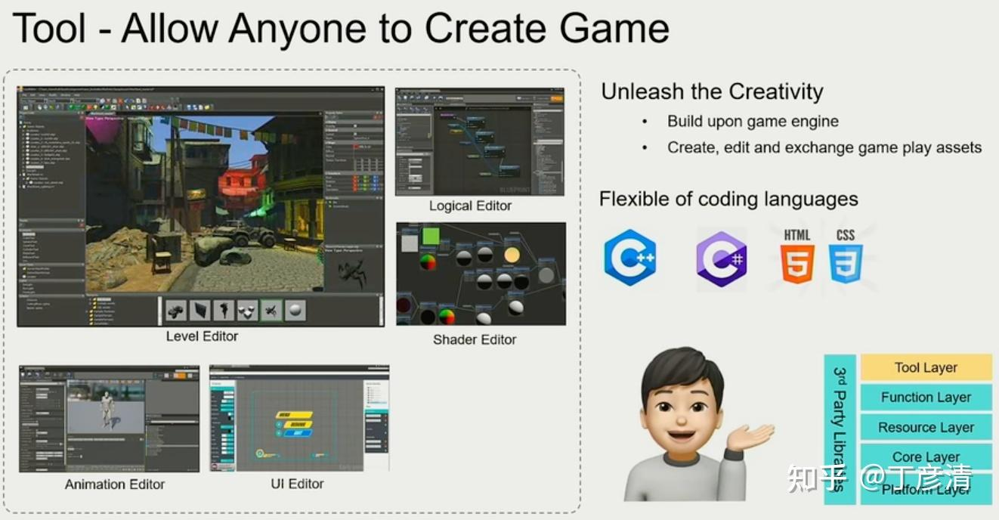

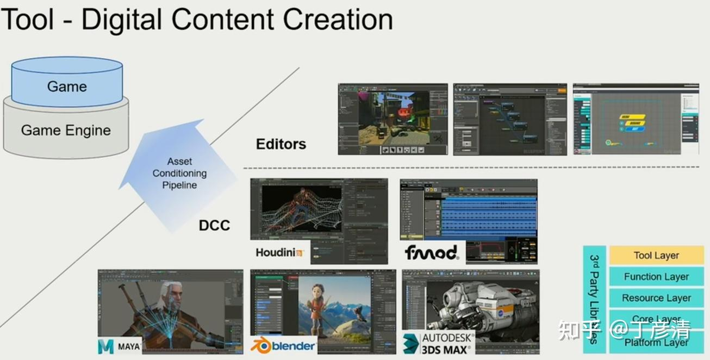

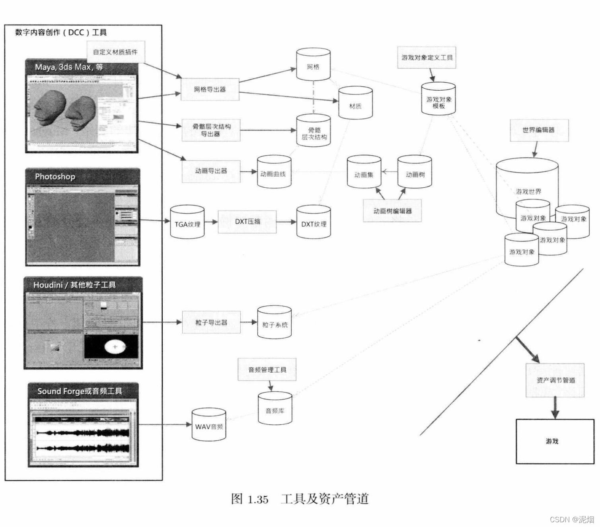

## 为什么要分层？

这一部分我就不多赘述，直接看图吧。

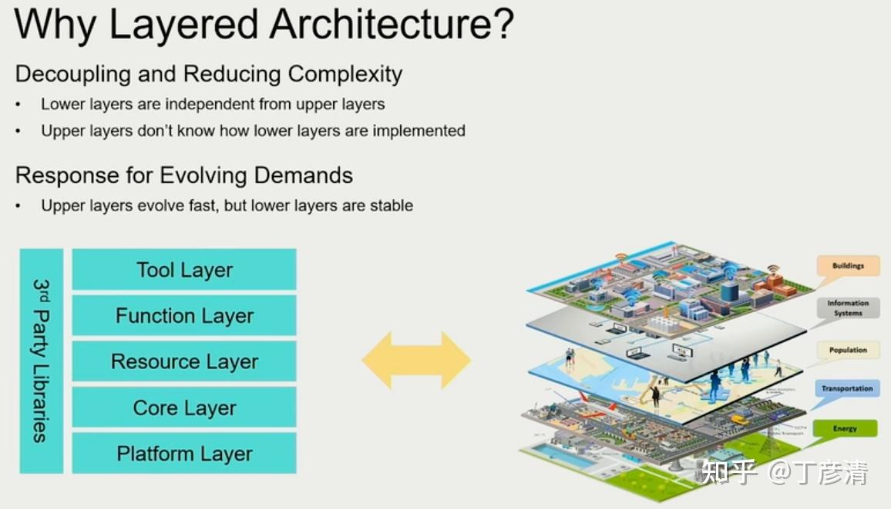
