# 2D帧动画

最传统的2D帧动画肯定是日本的动漫Anime，由于本人比较外行，这里结合看过的文章架空地说说。

先来看看知乎上的一篇[文章](https://zhuanlan.zhihu.com/p/396584125)。

在3维制作技术兴起前，引领了动画行业几十年的就是2D动画技术，时至今日，2D动画制作已经不只局限于传统的flash制作和纯手绘制作，现在的2D制作软件比如Harmony、Storyboard，实现了手绘的数字化，从而极大减少了美术师的工作量，节约了时间和成本。

## 与3D动画的区别

相比3D动画众多而复杂的动画流程，2D动画流程就简单了许多，在制片管理上四大阶段和两大行为的基本内容3D与2D制作都是一样的，最主要的区别在于执行阶段。这里我们把3D动画与2D动画执行阶段进行下比较：

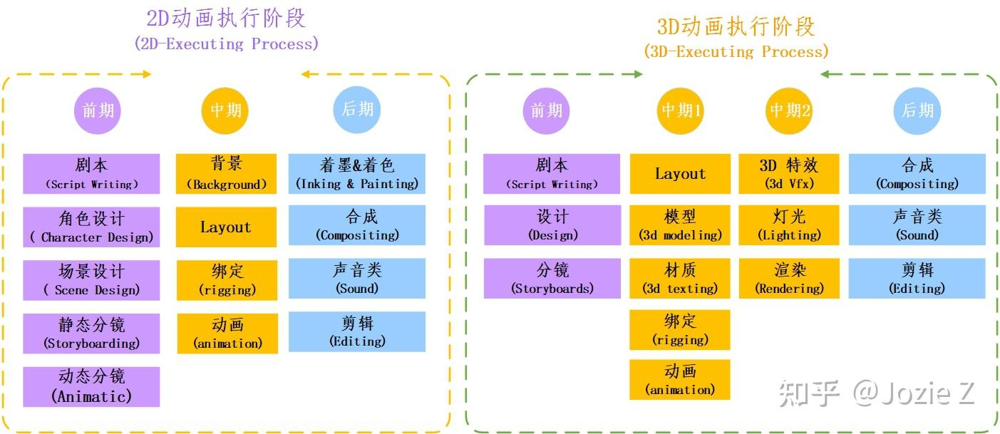

可以看到，2D动画，不需要3D建模、3D材质、3D特效、3D渲染。2D动画最关键的就是画，所以前期的设计（尤其是角色设计）和分镜都占了很大的分量。而3D环节中，中期制作则占据了项目较大的比重。

执行阶段是四大过程中耗时最多、最复杂的一个阶段。而动画的制作流程，并不是这个环节全部做完了，下个环节才开始，往往是多环节同步进行，只是后面的环节进入到项目组要相对的比前面的环节晚些。所以制作到中期的时候，就已经是多个环节并行了。这个时候是最考验动画制片的统筹和管理能力。因此弄清楚所有环节之间的联系与顺序，对于动画制片来说是必不可少的。

## 2D动画的流程 

我们先看下2D动画的详细流程图：

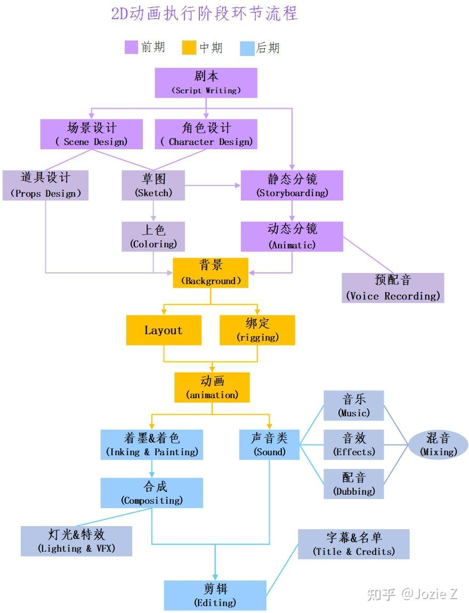

# 2D骨骼动画

主要说说Spine和Unity的合作。

## 时间与空间的概念

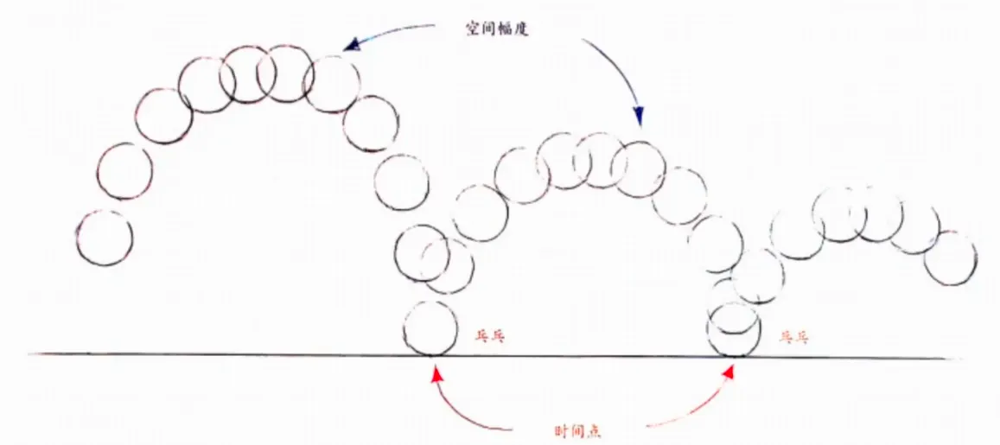

在一定活动的时间内所进行的一个空间幅度的一个变化

空间幅度：每一帧的变化距离

## 2d骨骼动画

创建人物骨骼：

构建一个人物骨骼，把切片的权重分配到每个骨骼上，然后再有骨骼或者是控制器来控制整个人的走向

绑定身体进行蒙皮：

把每个骨骼绑定在他也有的mesh上

绘制权重（利用骨骼控制身体的各个顶点)

分配每个骨骼需要控制的mash的点

制作动画关键帧

案例：

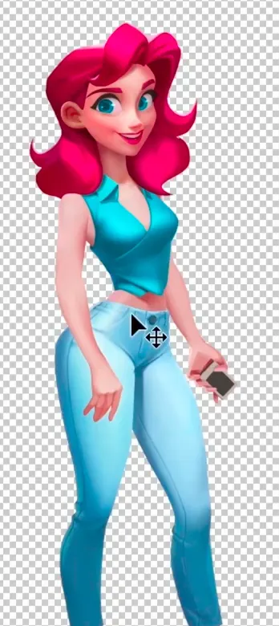

把需要动作的地方切出来（眼睛，手臂，嘴巴......），被遮挡的地方需要画笔补全

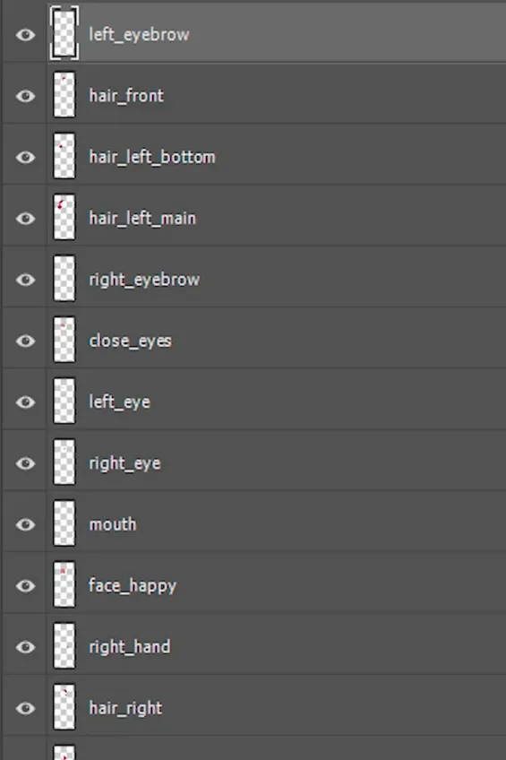

导出：

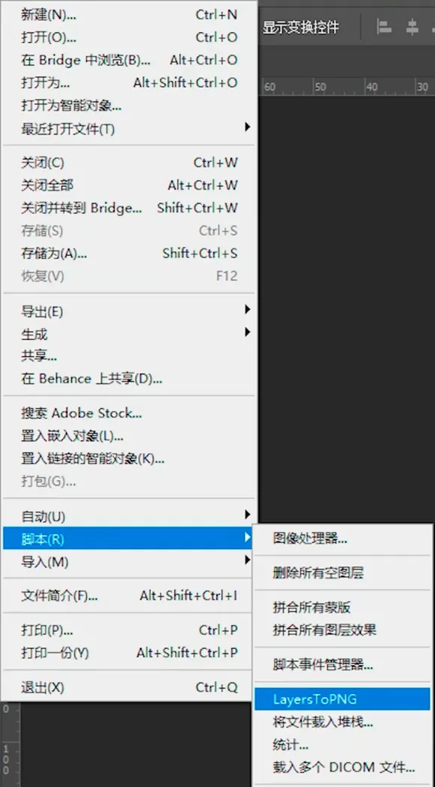

## Spine2D动画的制作及规范

IK约束与FK约束

骨骼父子级之间的绑定

脸部转面如何制作

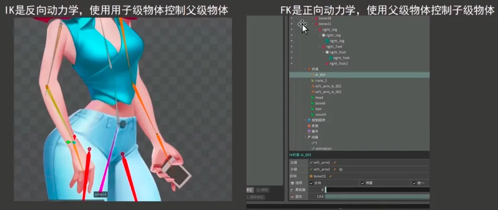

导出为JSON

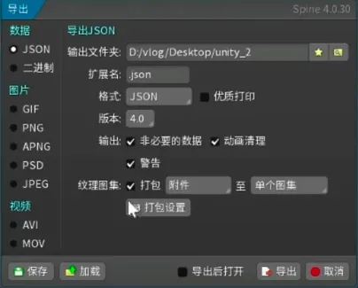

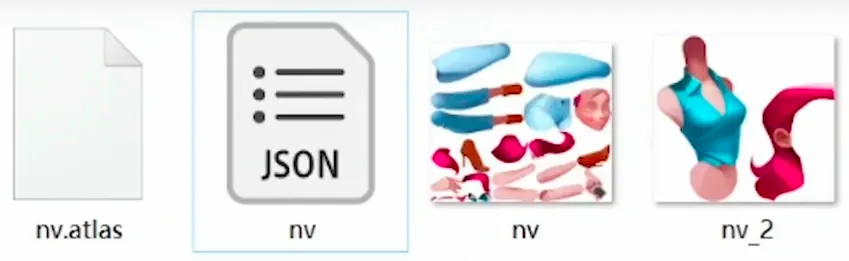

atlas:图集，也就是分割之后的图片坐标数据

nv：动画数据

## Spine骨骼动画Unity中的应用

需要安装Unity运行库，然后直接把Spine

导入：

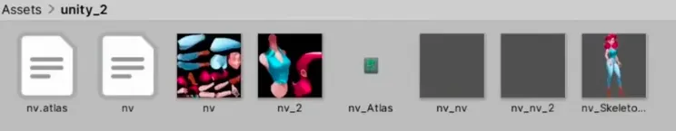

新建一个spineAnimation，选择骨骼

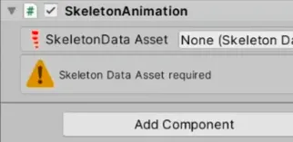

选择动画，点击循环，点击播放

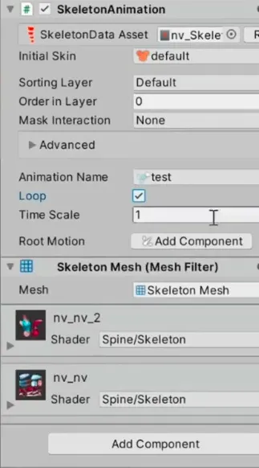
