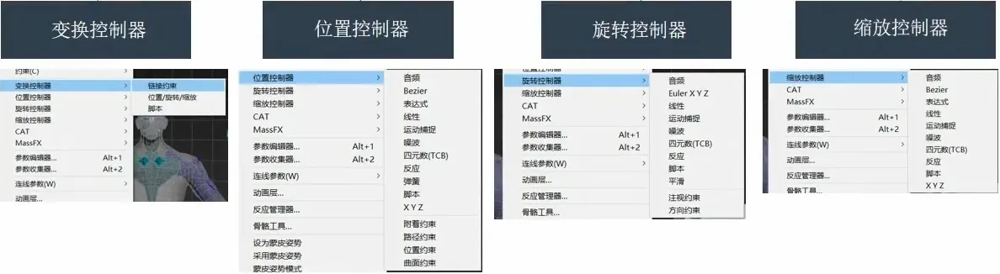
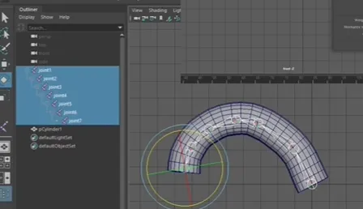
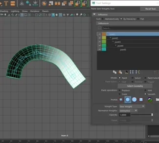

# 3DMAX绑定基础

## 常用的骨骼类型

Bone

Bone是3dsmax提供的基础骨骼工作，可以满足所有的模

型的骨骼建立。

CS对象

character studio 功能集提供设置3D角色动画的专业工具。这是能够快速而轻松地构建骨骼，然后设置其动画，从而创建运动序列的一种环境。

CAT对象

CAT (Character AnimationToolkit)是3ds Max的角色动画插件。CAT有助于角色装备、非线性动画、动画分层、运动捕捉导入和肌肉模拟。

## 蒙皮

3DMAX：

详细见视频：[https://www.bilibili.com/video/BV1gr4y1D78M?p=2](https://www.bilibili.com/video/BV1gr4y1D78M?p=2)  00:45

注意膝关节，髋关节等蒙皮，不要出现运动凹槽

## IK与FK

这部分后续会出一期纯理论的博客。

### IK：

反向动力学

先确定子骨骼的位置，然后反求推导出其所在骨骼链上n级父骨骼位置，从而确定整条骨骼链的方法

3ds maxHI IK系统允许在同一场景中对同一骨骼链(或其他对象）同时使用IK和 FK

### FK：

正向动力学

完全遵循父子关系的层级,用父层级带动子层级的运动

匹配帧:用于IK/FK 动画,匹配帧是使IK和 FK控制之间(或反之)可以无缝混合的关键帧集合

一般应用在腿的部分，但是一般会将IK和FK一起运用

## 控制器绑定

# maya绑定基础

## 基础概念：

### 绑定是什么？

绑定是一套通过模拟生物运动去让模型动起来的系统

绑定是一套提供给动画师的工具，能够解放动画师，

让他们能更方便快速的制作出更好的动画

## CG制作流程：

既然是工具，那么就需要遵循一定的设计原则

简单！让使用者能够轻易上手使用，明白每个控制器是做什么用的

快速！让使用者能快速的完成需要的动画效果

有效！设计出来的控制器的控制能够有效达到预期的变形效果

## 用什么去搭建绑定系统？

Maya为我们提供了以下几类工具

1．层级

2．蒙皮

3．约束

4．变形器

### 层级：

父子层级关系，子物体会跟随父物体的运动而运动，并且也可以自己独立的运动，这个关系是可以被打断的。

### 骨骼：

**骨骼链**

Fk （正向动力学）& IK（反向动力学）控制

**蒙皮**

骨骼与被蒙皮物体的链接关系，并且可以通过权重图实现对物体的局部操控

### 约束

可以跨越层级关系，对物体起到相应轴向上的完全控制

约束类型

a.父子约束，点约束，方向约束，缩放约束。。。

b.矩阵

### 变形：

deform -----直接对模型进行变形

应用:

a.身体修型+表情制作，blendshape(可导入引擎的变形器)

b.其他变形器,簇，晶格，线变形，包裹。。。。

## 绑定的规范：

对一些进行约定，方便整个项目的统一操作以及程序化处理:

1.模型规范.

a.A-Pose & T-Pose

b.面数，关键部位布线要求

2.绑定流程规范

根据项目流程来定，例如:LayRig SkinRig FaceRig DynRig

3.绑定文件层级命名规范

这点很重要，在约定俗成下，方便与其他模块的人的合作

4.绑定效果规范

5.其他规范

## 表情制作：

在绑定中是最为复杂的一个模块

表情是一个无论在控制系统搭建还是权重处理上都更为复杂的绑定，现在评判一个绑定熟手都是看他的表情制作如何，在此只做简单的介绍。

如果有兴趣推荐去观看邓正刚的表情绑定教程，从基础的卡通表情制作入手参考地址: [视频链接](https://www.bilibili.com/video/BV1EW411q7zw)

1.动画的卡通表情，多通过搭建骨骼系统加上修型去达到变形效果。

参考地址: [视频链接](httos://www.bilibili.com/video/BV1ks411E7tB)

2.游戏中，更多的是直接使用面部表情动作捕捉+blendshape的绑定系统。

参考地址:[视频链接](https://www.bilibili.com/video/BV1rW411g74J)
