## 啥是Blendshapes?

当已有一个Mesh A,我们在A的基础上修改得到Mesh B **(注意应当保持顶点数不变)** ，这时候我们说B是A的一个Blendshape。通过建立一定的规则，我们可以使mesh A变形为mesh B。

需要注意的是，Blendshape实际上可以视作一种变形器，因此此时只有mesh A上存在这个Blendshape。如果要从B变形为A则需要重新建立一次

(但是其实权重从0- 1就是从B变形到A，重做-次没有任何意义)。

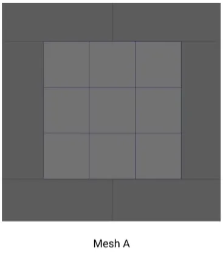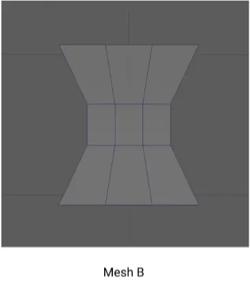

使A变形为B，顶点数面数不变,2个模型拥有一致的顶点数和边数

BlendShape的工作原理

每个顶点的变化就是最简单的线性插值

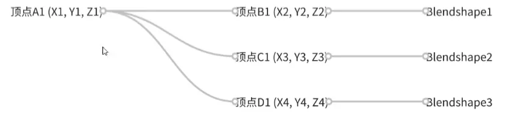

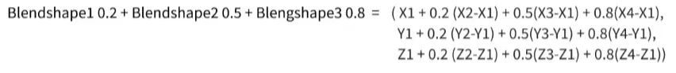

最开始的坐标 + 他们各自的权重 * 新的坐标和原始坐标的差值 的所有和

## 如何制作Blendshapes?

MAYA:

在基础模型上进行顶点编辑得到新的模型

打开窗口——动画编辑器——形变编辑器

选中新模型和基础模型，点击创建混合模型

点击添加目标可以复制出一个基本模型并进行修改

创建——添加当前选择作为目标可以将新的模型添加到混合变形

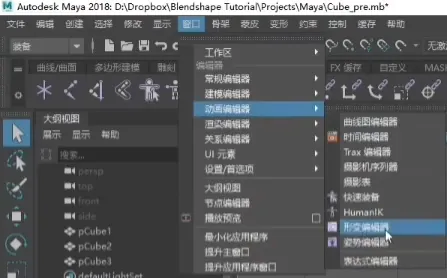

依次点击要变形的对象，点击创建混合变形

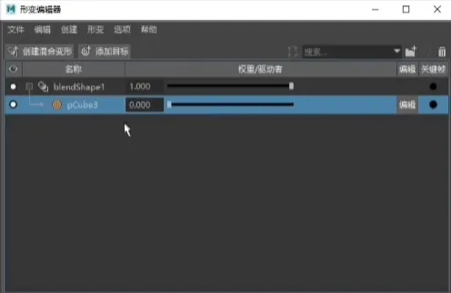

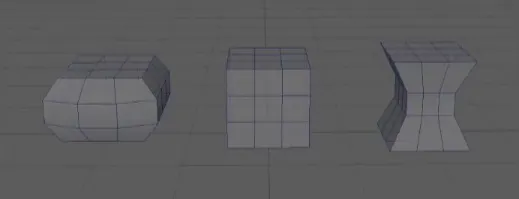

3DMax：

在基础模型上进行顶点编辑得到新的模型

选择原始模型，在修改器列表中选择变形器添加修改器

选择从场景中拾取对象，选择新的模型即可

导出时记得勾选动画选项中的变形

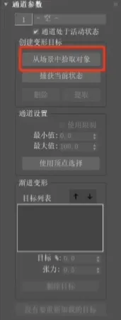

## 如何使用Blendshapes?

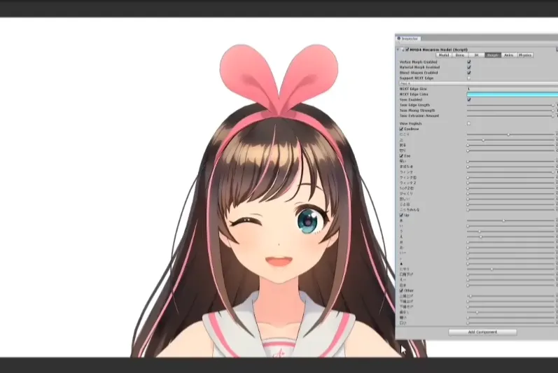

最重要的用途:制作表情

使用Blendshapes制作表情动画可以弥补传统骨骼和控制器绑定在表情制作上的不足，让美术以一种以结果为导向的方式，直接去控制表情的结果，通过将五官拆开制作和控制，可以达成多种多样不同的组合。

而如果使用绑定的方式来制作表情,需要美术遵循面部肌肉的规律来绑定，自然模型也需要遵循写实的方式来制作。因而对于面部模型并不按照写实制作的二次元类游戏来说，使用绑定方式制作的难度是较大的。

但是Blendshape的方式也有自己的劣势，首先因为需要将不同的部件拆开制作，需要美术制作的Blendshapes的数量就会变成五官数*表情数之多，增加了美术的工作量。同时由于需要载入的模型数量变多，对于 内存的消耗会变大 。因此在实际的工作过程中需要平衡表情的表现力和性能问题。

### Unity Api

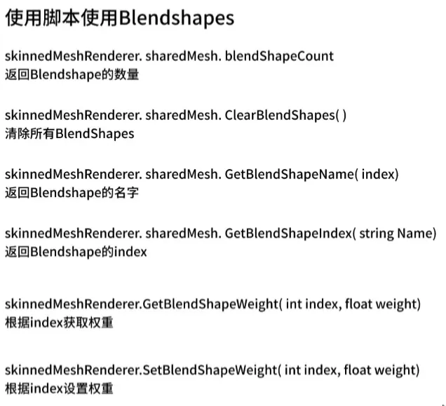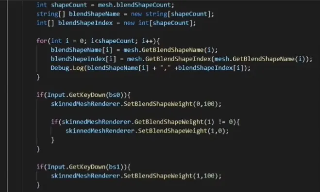

### 在Unity中制作BlendShape

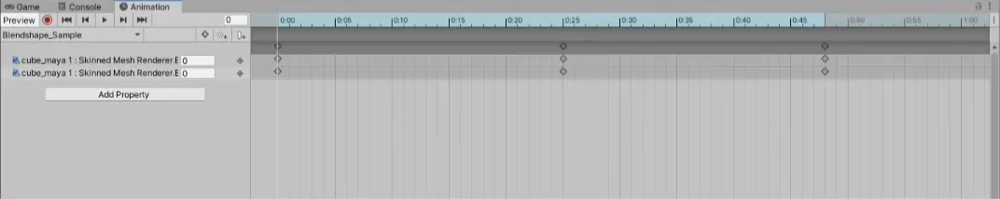

点击Add Property添加blendshape关键帧之后按照正常的动画制作就可以也可以点击录制按钮之后直接在属性面板修改

MAX和MAYA的动画互通命名顺序必须一致，才能触发驱动

## 示例:

**MAYA：**

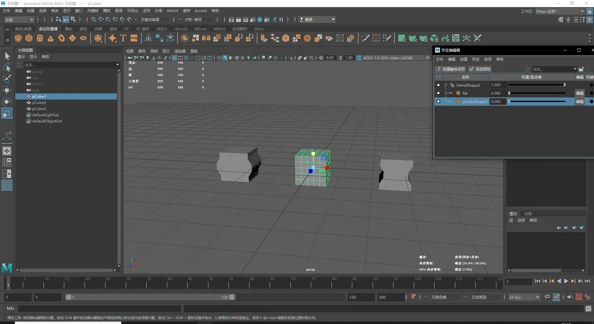

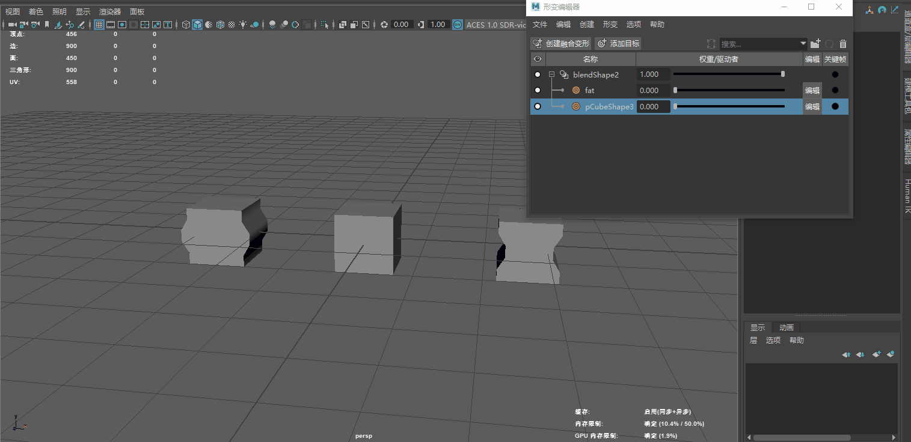

**导入到Unity后**

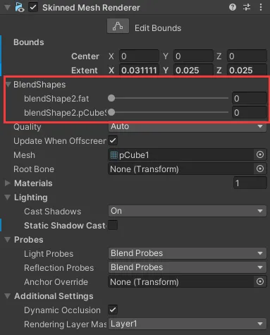

**Unity动画：**

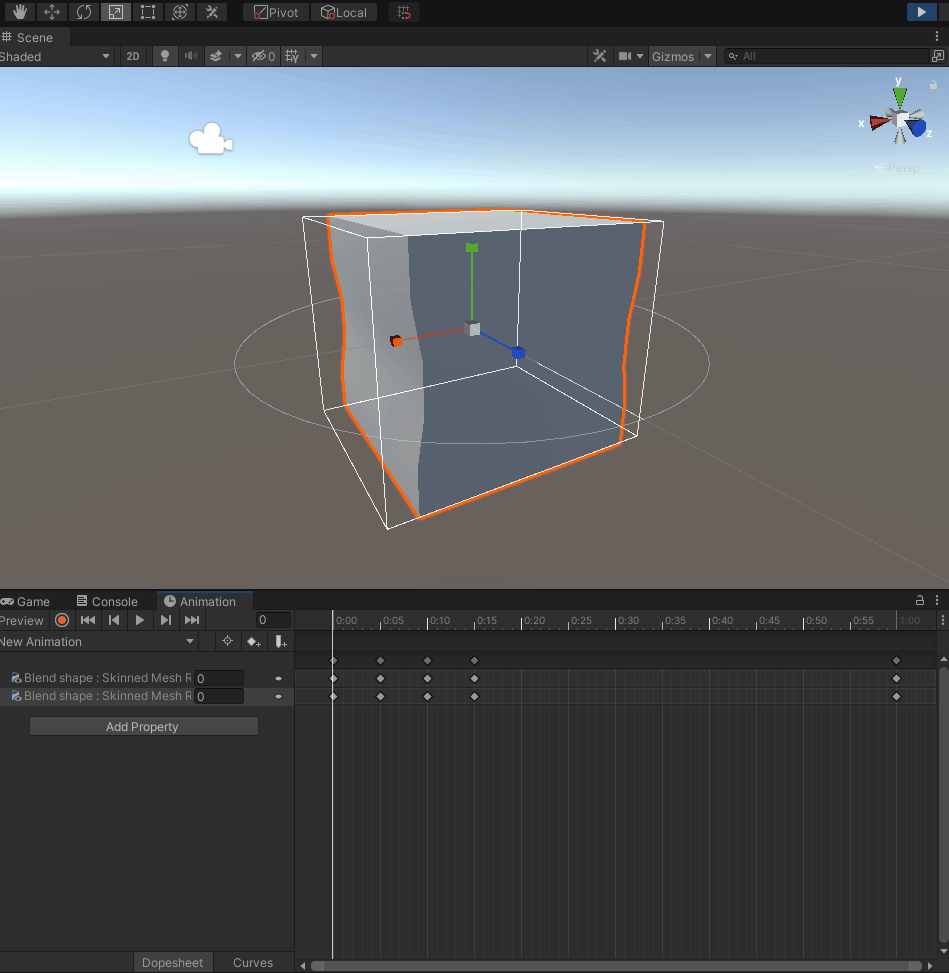
