## Animation Clip

Unity中的动画切片（Animation Clip）主要来自于3种：

1. 引擎内部制作动画
2. 外部软件制作动画（FBX包含动画，Obj不包含）
3. 使用代码制作动画（复杂高级的）

## Animator组件

控制动画播放以及切换规则的组件

属性：

- Controller：核心熟悉用来设置Animator Controller
- Avatar：蒙皮动画文件
- Apply Root Motion：应用根节点运动，如果不启用则物体需要用脚本进行控制运动方向。
- Update Mode：使用Update更新模式

## Animatior Controller（动画控制器）

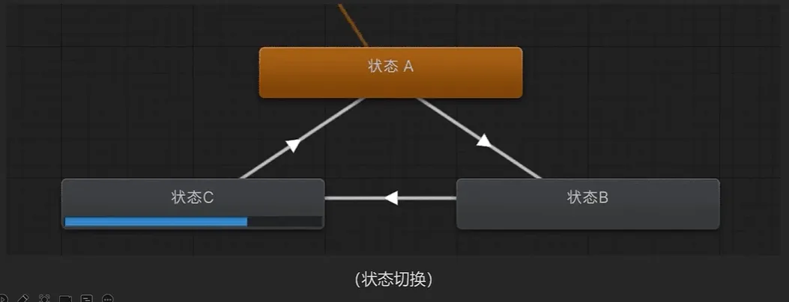

Parameter：

控制动画切换的参数：

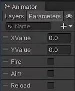

Bool：通过true或者false判断逻辑

Trigger：特殊的布尔性参数，作为触发条件触发过渡后会被设置为false

Any State：

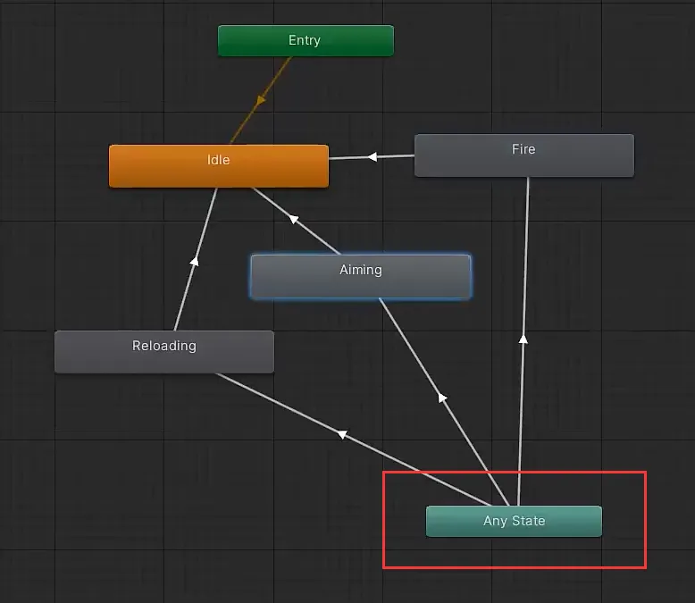

任何状态下满足条件均可以切换到下一个指定状态。譬如图中从Aiming切换到Fire

参数的使用：

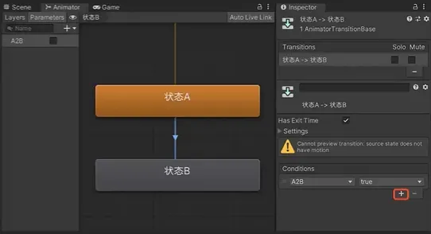

如图在选中状态相互切换的过度线后，红框内就可以添加创建后的参数,并且设置相应的参数值。

图中在“A2B”为true的情况下，状态A就会切换至状态B。

当然条件可以不止一条，可以多次添加几条规则，成“并且”关系。

### Parameters的API：

Animator.SetBool(string name, bool value)name:动画参数名

value: true或者false

Animator.SetFloat(string name,float value, float dampTime, float deltaTimename:动画参数名

value: float浮点函数

dampTime:类似阻尼的概念

deltaTlme: dampTime的增量时间

Animator.SetTrigger(string name)name:动画参数名

### State Flow基础操作：

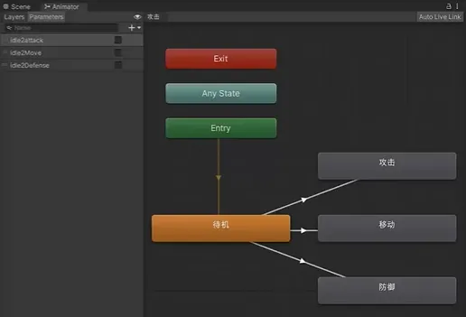

1. 先设定一个进入Animator后的一个默认State(待机)。(与Entry相连接的State，默认状态下进入待机状态)
2. 然后相应的添加“攻击”“移动”“防御”这几个State。
3. 以想设定的逻辑，用MakeTransition连接起来。
4. 需要添加几个条件属性,用于设定条件，如例图创建了三个Bool类型的值。
5. “idle2attack, idle2Move, idle2Defense"并且每条过渡线均设置好相应条件。

脚本举例：

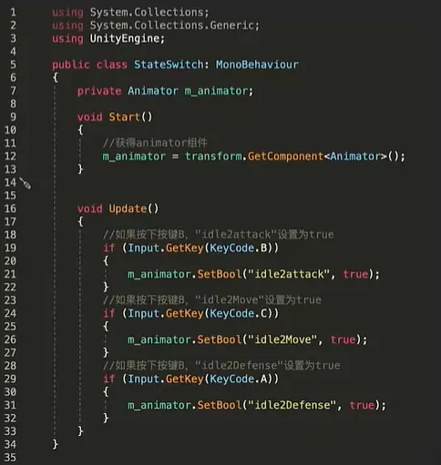

按下切换状态，放开则返回默认状态：

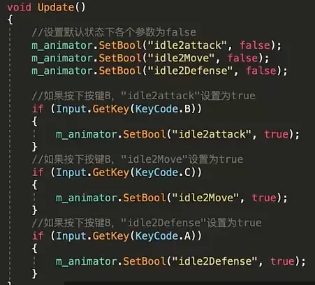

### BlendTree：

BlendTree是用于将多个动画通过改变动画参数进行不同程度的合并并且融合。分为1D,2D，Direct

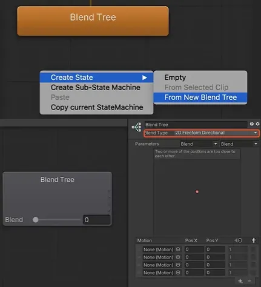

#### 1D混合

通常一维混合,，都是制作动画某一个属性差异变化时使用(例如奔跑速度不同动画的变化，或者转身角度不同所发生的变化)

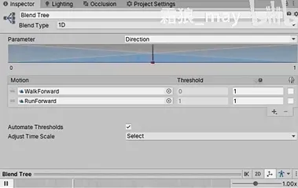

#### Direct混合：

使用直接混合树使您可以将动画参数直接映射到动画的权重,用于精确控制要混合的各种动画，而不是使用一个或两个参数。

#### 2D混合：

根据需求，在移动中融合两个方向得到一个新的斜方向所以我们需要用到2D混合。

而在2D混合中一共有三种子模式

2D Simple Directional

2D Freeform Directional

2D Freeform Cartesian

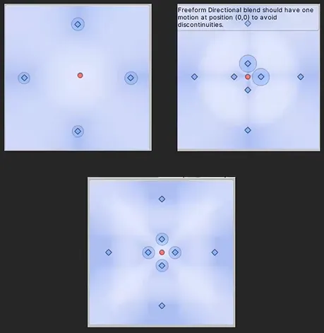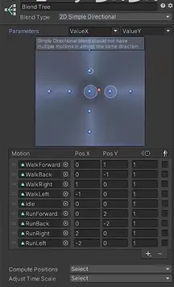

#### Blend：

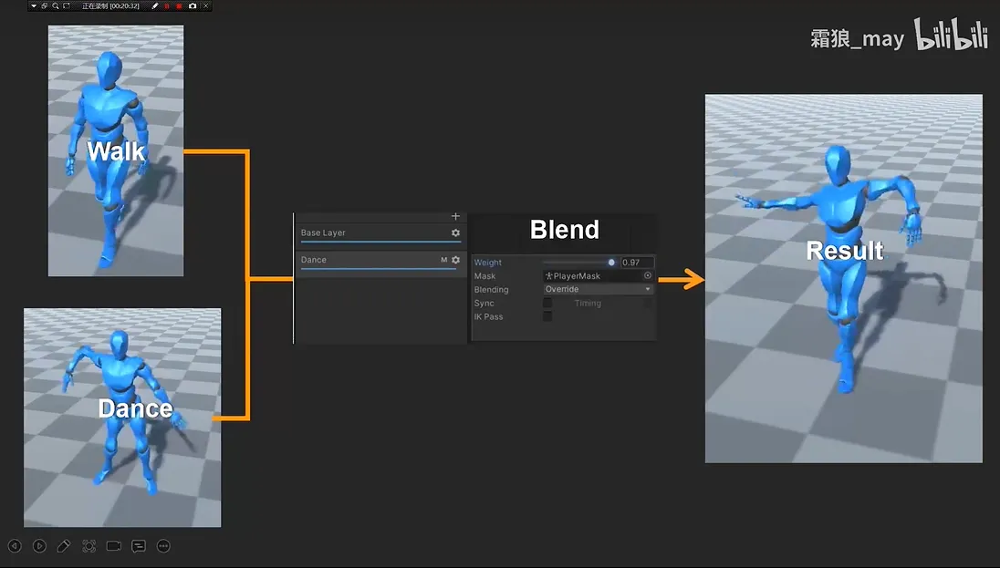

## 示例：

### 用动画机完成一个角色的走跑跳动

状态机：

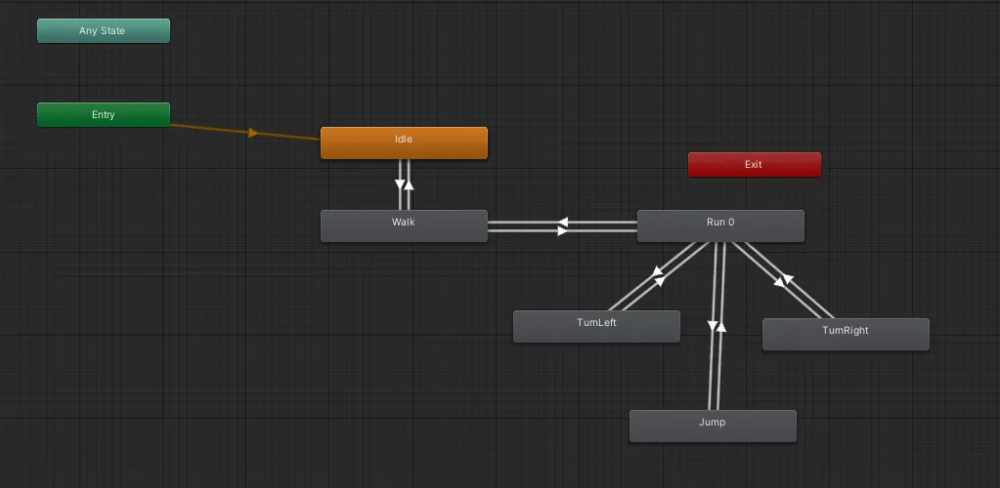

脚本：

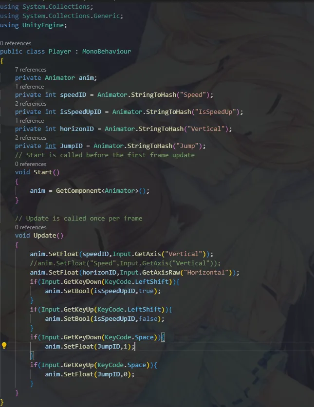

**动画：**

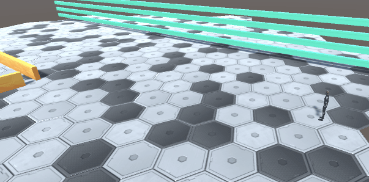

#### BlendTree：

**状态机：**

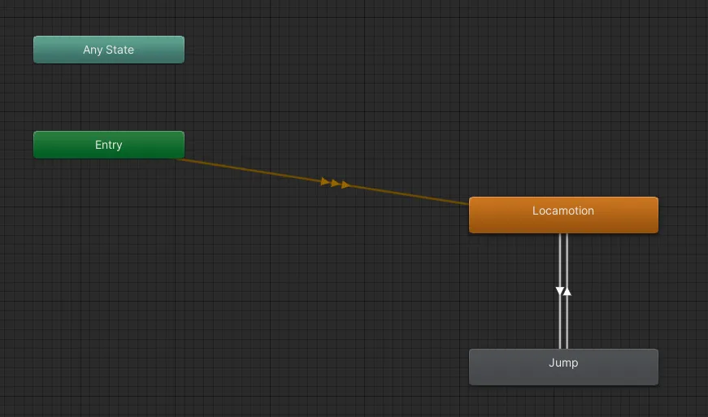

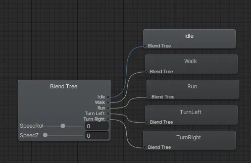

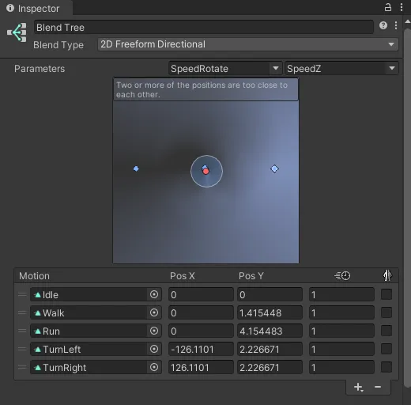

**脚本：**

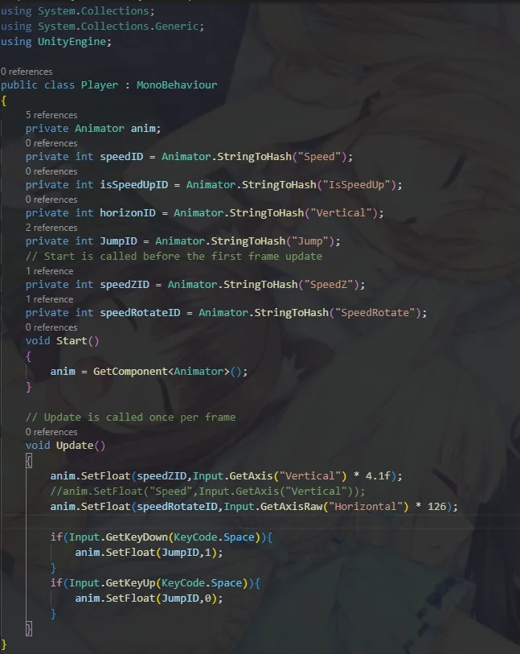

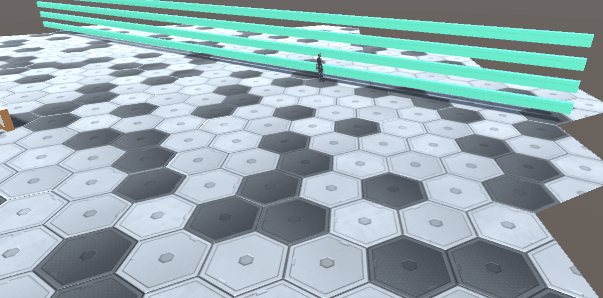
