**什么是次时代模型：**

次世代源自日语，指的是下一个时代。次世代建模是对下一代游戏建模标准的统称。我们今天玩到的3A游戏，基本上都采用了次世代建模。

次世代建模要求增加模型面数，从简单粗糙的低模升级为精细复杂的高模，并在贴图上普遍运用基于物理渲染的PBR材质，追求更写实的效果。

**PBR模型：**

使用基于物理渲染的贴图的模型

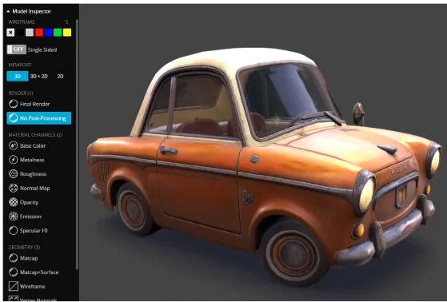

制作贴图流程

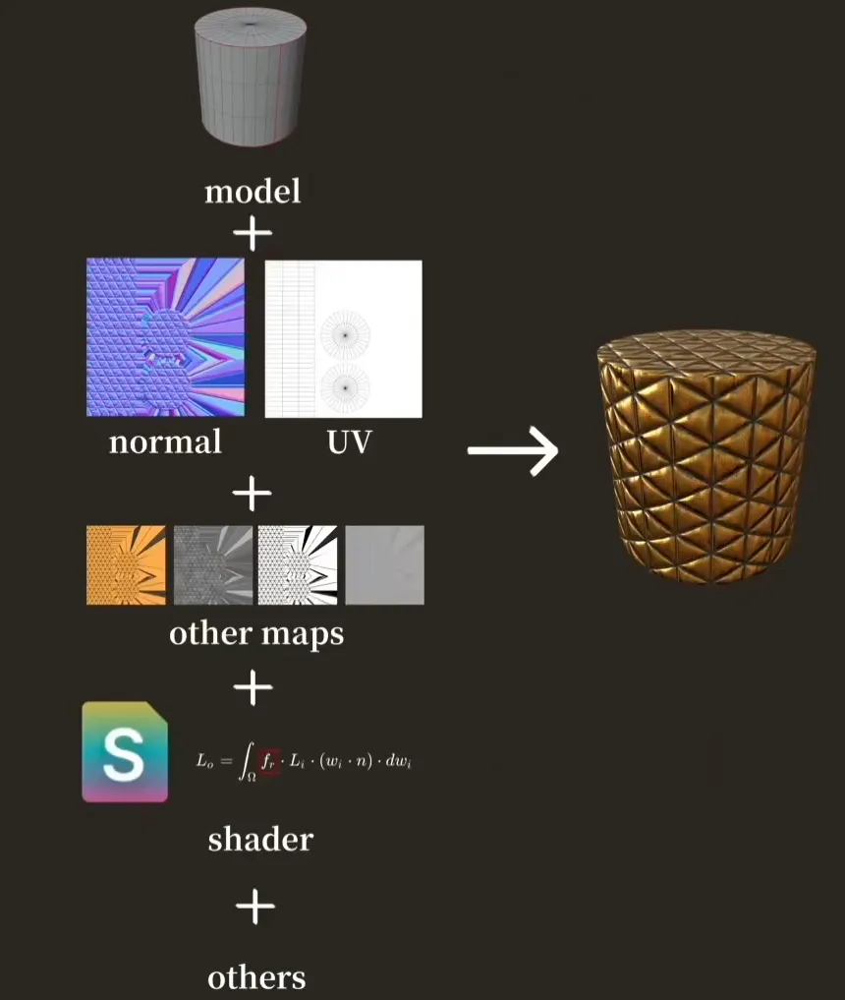

## 2种流程：

常用的工作流:

**金属/粗糙度工作流**(Metal/Roughness)

**镜面/光泽度工作流**(Specular/Glossiness)

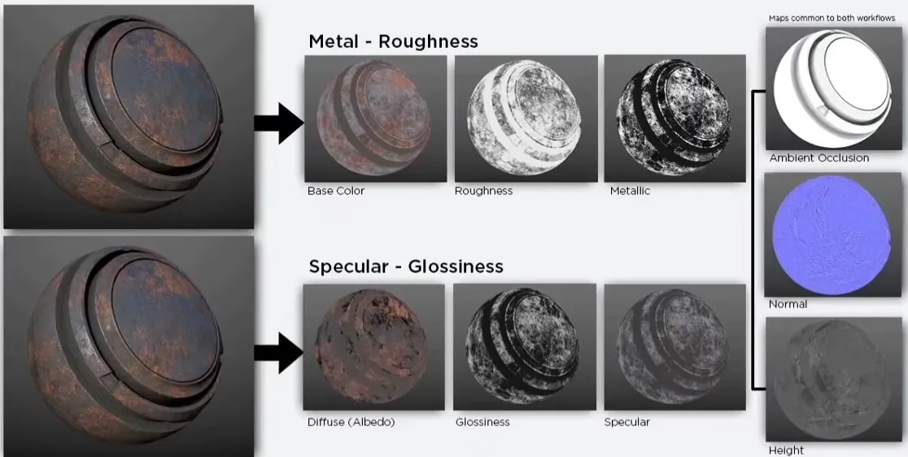

金属工作流程比较符合工作流程，应用比较广泛，但是没有办法调节非导体的F0值（菲涅尔）

镜面方式：可以方便的调节F0值，但是错误的贴图会打破能量守恒

通用贴图:

法线贴图(normal map)

AO贴图(ambient occlusion map)

高度贴图(height map)

## 金属/粗糙度工作流：

### Base Color

储存数据: 非导体 （电介质)的漫反射色/反照率颜色(Diffuse Reflected Color/Albedo)和金属导体的镜面反射的F0值。

非导体使用4%(0.04）的FO反射值。

混合材质即非导体和金属导体混合材质）则可以认为同时储存了这两种数据。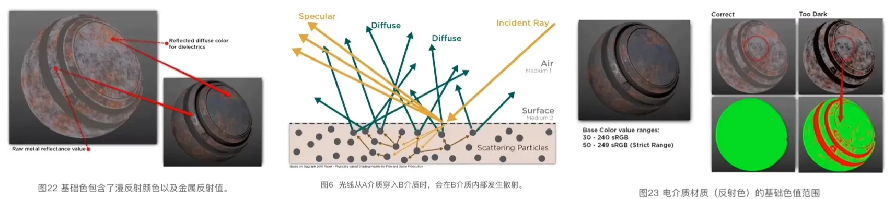

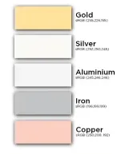

非导体(即电解质，非金属):暗色值，尽量不要低于30-50 sRGB，严格控制下应不低于50 sRGB。对于亮色值，贴图中不应高于240 sRGB.

导体(金属)的反射值︰金属一般会有70-100%的镜面反射，映射到sRGB大概为180-255,如左图所示。

在Substance Designer软件中，你可以通过PBR BaseColor / Metallic Validate节点来验证是否在合适的范围内。

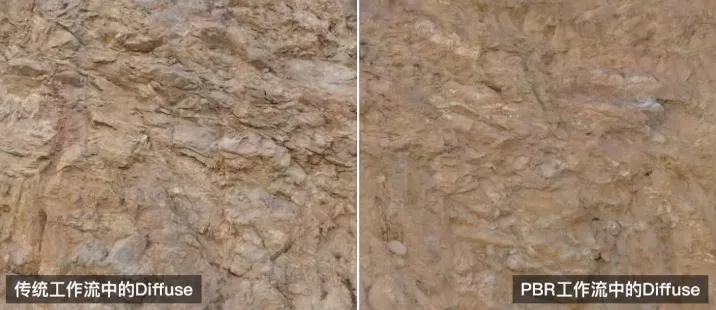

过于微小的AO细节可以存储在Base Color贴图中

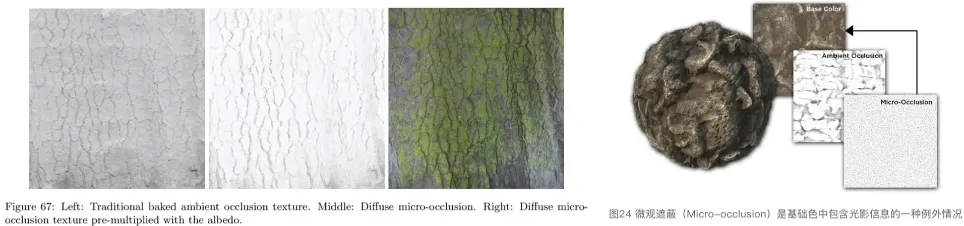

Base Color的几个要点

1. 贴图中的颜色对于非金属材质来说是它的漫反射颜色，对于金属材质来说则是它的镜面反射的FO值(Reflectance value，所带色相与其反射的波长有关）。
2. Base Color除了微观遮蔽信息（Micro-occlusion）以外，不应该含有任何光照信息。
3. 暗色值在宽松条件下不应该低于30 sRGB，严格来说不应该低于50 sRGB。.
4. 亮色值不应该高于240 sRGB。
5. 原始金属的反射值一般都非常高，大概能达到70-100%的镜面反射，映射到sRGB范围大概是180-255,

### Metallic贴图

储存数据:对应区域的金属度。作用类似于图层遮罩，告诉着色器应该如何去解读Base Color贴图中的RGB数据。0.0纯黑代表非金属，1.0纯白代表纯金属。

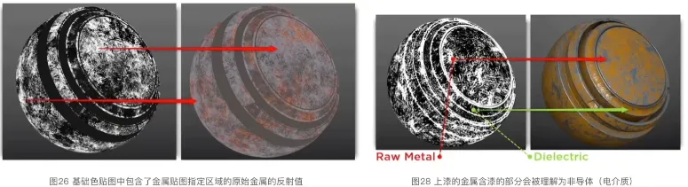

回顾一下metallic贴图的几个要点:

1. 金属被氧化、腐蚀、上漆、覆尘后，这些区域需要被当做非导体（电介质)材质来看待。
2. 在Metallic贴图中，纯黑(0.0）代表了非金属，纯白(1.0)代表了金属，我们可以用过渡的灰阶来表示不同程度氧化和污垢。
3. 如果Metallic贴图中有值低于235 sRGB,那么在Base Color中对应区域的反射值也应该降低。

### Roughness 粗糙度贴图：

在粗糙度贴图中，纯黑（0.0）代表了平滑表面，而纯白(1.0)代表了粗糙表面。

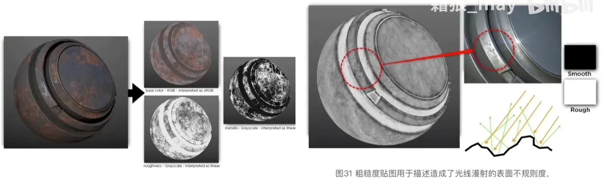

粗糙度贴图用于描述造成一个表面的不规则度，这种不规则度会造成表面的漫反射，光会基于表面的粗糙度，进行光线的随机的反射。

虽然这个现象中光的方向被改变但是光的强度是恒定的，越粗糙的表面拥有越大越暗的高光而越光滑的表面就越能将镜面反射聚拢让高光看上去更亮更强。

## 镜面反射/光泽度流程

### Diffuse RGB贴图-sRGB

储存数据:漫反射颜色(Albedo)

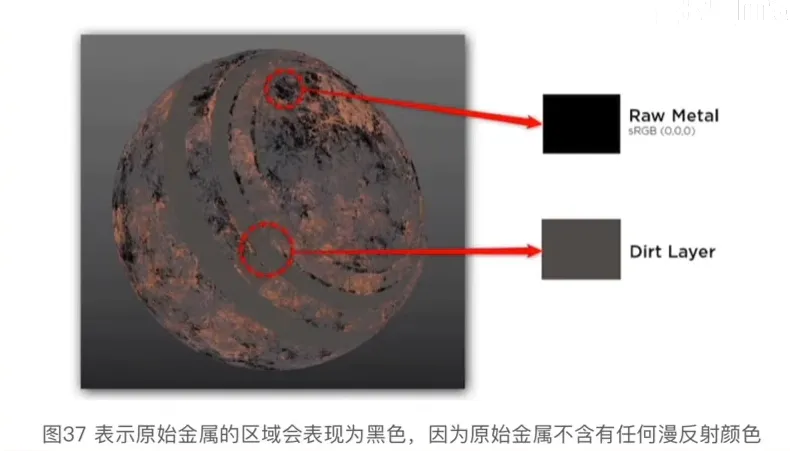

1. Diffuse贴图中的颜色表示的是漫反射颜色，原始金属由于没有漫反射，颜色应该为纯黑（0.0)。
2. Diffuse贴图除了微观遮蔽(Micro-occlusion）外不应该带有其他光照信息。
3. 除了表示金属的纯黑（0.0)外，暗色值最多不应该低于30 sRGB，严格上说，不应该低于50 sRGB.
4. 亮色值不应该亮过240 SRGB。

Specular

储存数据:F0(0度菲涅尔反射值)

F0值都是基于真实世界测量的，没有需要，尽量不要使用反常规的数值。严谨一些的话，你甚至可以查表。别忘了线性空间和sRGB的转换。

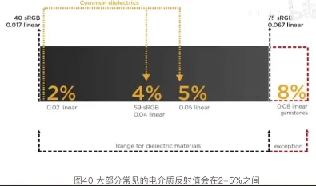

要点：

1. 镜面反射贴图包含F0值。
2. 普遍非导体的反射值为2-5%，在sRGB中，这个值大概在40-75之间。
3. 普通宝石的反射值范围在0.05-0.17(线性空间)。
4. 普通液体的反射值范围在0.02-0.04(线性空间）。
5. 而原始金属的反射值则可以高达70-100%的镜面反射,sRGB约为180-255
6. 如果你无法找到某个材质的折射率(IOR)，可以先假设FO为4%，也就是塑料的FO。

### Glossiness贴图

光泽度贴图适用于描述表面不平整度的贴图，表面不平整会造成光的散射。在这个贴图中，纯黑(0.0)代表的是粗糙表面，而纯白(1.0)代表了平滑表面。这和M/R工作流里的粗糙度贴图是完全相反的，但是在设计侧却有着类似的制图原则。

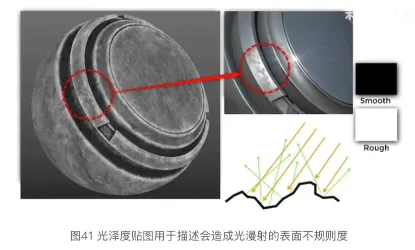

## 总结：

当贴图分辨率与纹素密度过小时，在金属导体和非导体交界会产生白边/黑边。所以要有一张良好大小和布局的UV。

### Metallic/Roughness流程

优势：

1. 在M/R工作流中，由于非导体（电介质)的FO都是规定好的,所以设计师在对非导体FO赋值时不易出错。
2. 纹理的缓存压力更小，因为金属贴图和粗糙度贴图都是灰度贴图。
3. 目前来说是兼容性最广的工作流。

劣势：

1. 非导体（电介质）FO的值固定为4%，无法调整。然而，在大多是实现流程中都有控制器可以直接复写这个值，所以也不能算硬伤。
2. 白色边缘问题较明显，尤其在低分辨率的情况下问题突出。

### Specular/Glossiness流程

优势：

1. 边缘效应不会那么明显。
2. 可以在镜面反射贴图中对非导体（电介质)材质的FO值自由调整。

劣势：

1. 由于在S/G工作流的镜面反射贴图中，非导体（电介质)材质的FO值是可以自由调整的，所以也会导致设计师容易输入错误的值。而这些错误的值被着色器误读后可能会打破能量守恒定律，从而造成不正确的渲染效果。
2. 由于新增了一张RGB通道的镜面反射贴图，所以对性能消耗会更大。
3. S/G工作流有些名词和传统的工作流太相似，但是实质所对应的数据可能是不一样的，因此会导致设计师容易误解或误操作。这种情况下就要求设计师有更好的PBR理论知识，例如了解非导体（电介质)的正确FO值，金属在漫反射色下表现为纯黑，以及在着色器没有自动校正情况下，能量守恒相关的基础知识。

## 2种流程的转换：

本质上来说，贴图储存的是数据，两种流程储存的数据是部分一致的，我们要做的就是改变这些数据的位置和储存方式。这里我们参考八猴的教程和SD中的转换节点进行讲解。如果你安装了substance designer，可以查看它内部节点的实现方法(右键,open reference)。这里为了讲解我们选用PS完成，将下图的贴图数据进行转换。

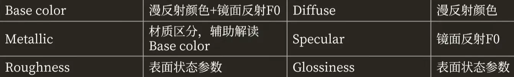

### Metallic🡪Specular

#### Base color + Metallic🡪 Diffuse

方法:去掉base color中的金属和混合材质的F0数据

1. 打开base color和metallic，RGB模式。新建Diffuse图层，纯黑填充。
2. 单独显示metallic，在通道里ctrl+左键点选任意通道，选中选区。Diffuse图层添加蒙版，
3. 自动将选区粘贴进蒙版。
4. 不需要改变图层类型。

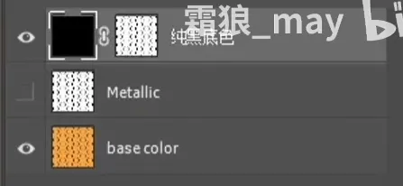

#### Base color+ Metallic→ Specular

方法:去掉base color中的漫反射数据，并加上非导体和混合材质的FO(默认0.04)

1. 打开base color和metallic，RGB模式。
2. 新建Specular图层，填充#383838。(0.04的linear对应约22的灰度，对应约56的RGB
3. 对应代码#383838)(如果有specular level贴图，转换成对应的RGB颜色)
4. 选中metailic,ctrl +i反相。单独显示，在通道里ctrl+左键点选任意通道，选中选区。
5. Specular图层添加蒙版，自动将选区粘贴进蒙版。

#### Roughness🡪 Glossiness

方法:反相

实操:ctrl +i，反相

### Specular🡪Metallic

#### Diffuse + Specular → Base color + Metallic

方法:找出金属区域对应的数据，金属的特性是FO在0.7-1之间，而非金属一般都不超过0.04,宝石最高可达0.17，差异明显。第二，金属没有漫反射，Diffuse中为黑色。所以我们可以从Specular或者Diffuse贴图中生成Metallic贴图。你可能需要多次尝试才能得到与转换前较为一致的效果。

实操:

1. Specular，菜单选择，色彩范围，选择阴影，灰度预览，调整参数。（也可以使用Diffuse图层)(效果不好的话可以将阴影换为取样颜色，选择纯黑，调整容差)shift + ctrl+i 反选，创建蒙版。

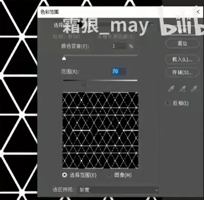

2. alt+左键拖动蒙版到Diffuse图层，选择蒙版，ctrl+i反相。Base color完成。

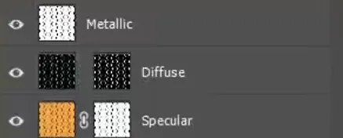

3. 新建Metallic图层，填充黑色，ctrl+左键点击Specular蒙版进行选区，填充白色。Metallic完成。

#### Glossiness→ Roughness

方法:反相

实操:ctrl+i，反相

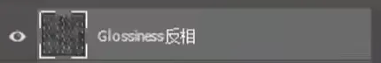
