## UV介绍

### UVW是什么

UVW展开是将三维模型从XYZ坐标映射到UVW坐标系的过程。

UVW”命名取自字母表XYZ旁边一组字母，与XYz坐标相似，UVW坐标中U代表水平方向，V代表垂直方向，W表示平面垂直方向。UV坐标被我们用来表示2D纹理的轴,取值范围[0,1]。

后面我们也主要介绍UV坐标下的相关知识。

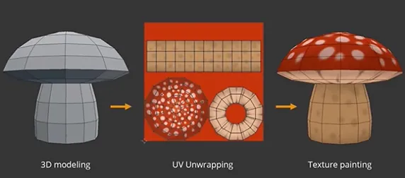

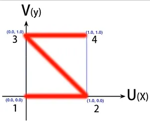

非破坏性：

在这一步展开的操作中,您不会破坏3D模型建模部分的工作。

但会为模型网格的每个顶点与面,提供第二组UVW坐标。

2D纹理转换回3D空间将纹理图案应用于3D模型，就是通过查找每个网格模型面的UV坐标完成。

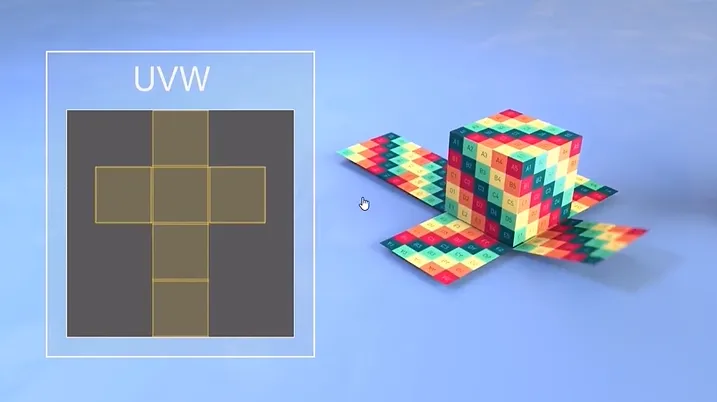

### UV展开的优势

虽然多增加了UV展开的步骤

但UV展开是一种将纹理灵活应用于模型的非常可靠灵活方式

大部分3D应用程序都可以读取与使用UV信息

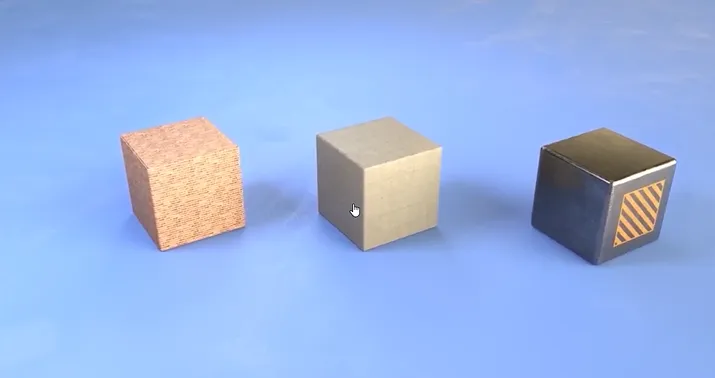

模型是一样的，但是可以灵活更换纹理，达到指定效果

## UV展开方式

### 快速投影

不需要真正的了解UV。

主要用于简单的几何形状,建筑的地板、墙壁将图案与纹理投影到几何形状上去

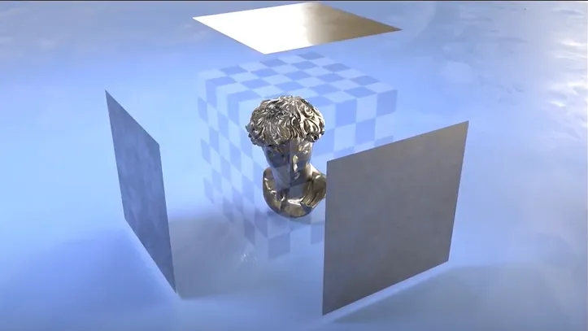

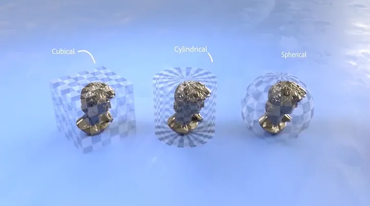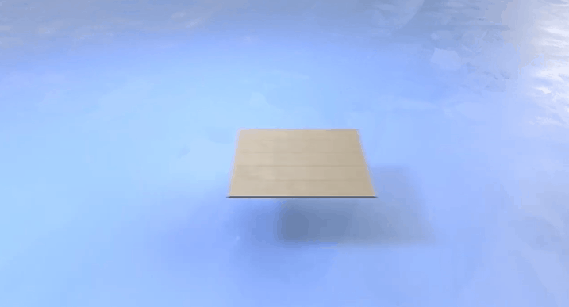

缺点

作用有限、缩放与调整需要重复图像时才有用。

投影映射的UV会导致大量重叠

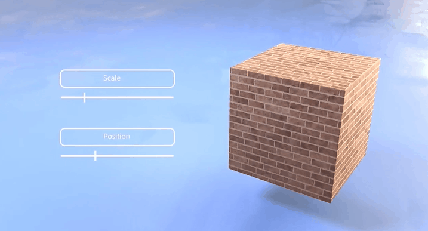

### 映射手动展开

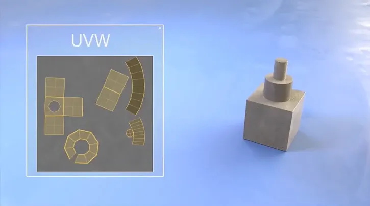

网格中的每个组成部分都要经过谨慎思考后布局，类似于拼图游戏，在裁剪和排布各个面的时候要尽量利用UV空间，要尽量利用空间创建优质合理uv展开需要格外的小心与一定的技巧

UV展开分割的要求：

UV展开分割数量的要求分割越多单独的uv元素也越多，形成UV接缝也越多，在应用纹理图案纹理时就会看到越多的不连续情况。同时没有足够的UV分割线，模型将无法展开，同样也会使纹理失真

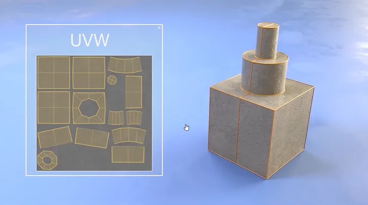

UV展开的空间要求：

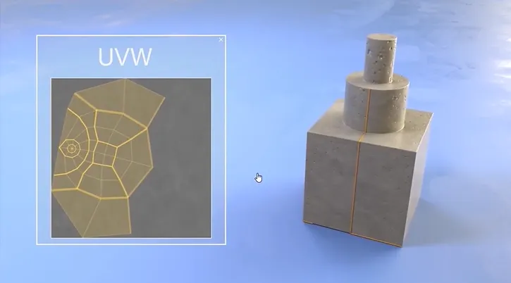

所以良好的uv展开都会仔细平衡uv壳的接缝变形与比例排列，uv壳的数量，利用率，均匀性，

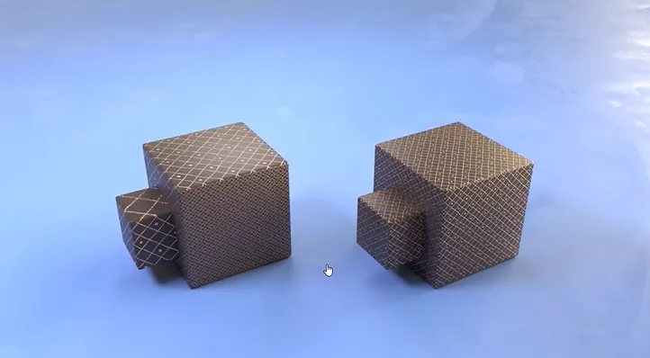

左边没有均匀展开

如果模型的uv壳比例与3D几何形状相差很大,则通过棋盘格可以看到,在使用重复纹理时候会非常明显的区别

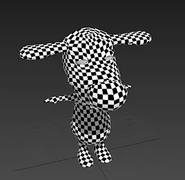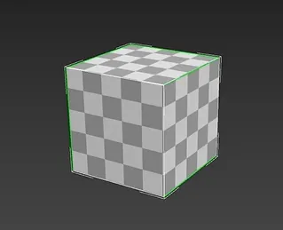

### 自动展开UV

一些应用程序可以为我们自动生成UV

但不能保证自动生成UV的质量。

目前,很多模型展开是将自动生成与少量手工操作想结合。

### 重叠UV展开

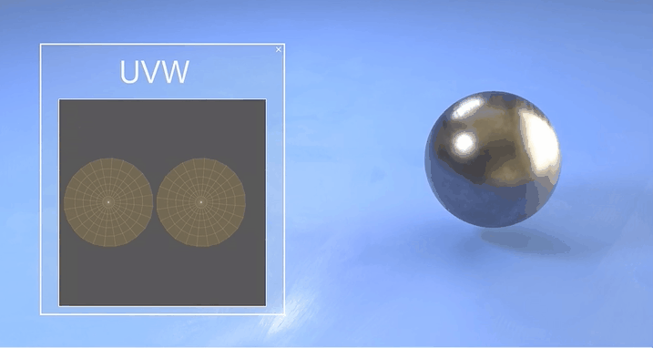

**重复复制的模型使用系统的UV**

### UV的规范和要求

1. 扩边值（溢边值):512-2个像素、1024-4个像素、2048-6至8像素〈减少溢色的可能，这个要求会根据不同的项目会有不同的要求规范)

2. uv 该打直的必须得打直 （这个概念在场景贴图绘制中尤为重要)

3. uv之间一定 要有间隔 ，间隔像素为4-8个之间(这个要求会根据不同的项目会有不同的要求规范)

4. uv除非在能够很大程度上提高利用率的情况下，不允许uv倒着放的情况

5. 同材质uv要尽量的放在相邻位置

6. 相邻uv断开一定要放相邻的位置,并且焊接接线要保持一致

7. 2通道光影v不允许翻转,叠放。但是在一定程度上允许拉伸

## UV通道和光照UV

1. 模型导出会有几套UV?

如果在三维软件中只做了一套uv，将模型导入unity的时候，在导入设置中勾选Generate Lightmap UVs,unity会自动为我们生成用于光照贴图的uv1，和用于动态光照的uv2

比如Unity自带的物体box,sphere就自带两套uv第一套是正常的，比如方块可以每个面是同一个uv，

但是第二套需要烘焙光照信息，所以默认是全展开,纹理看出来要小些。也有一些材质会用到四套UV，比如Unity的speedtree。

2. 模型多UV有什么作用

做很多效果时，使用多UV可以避免使用多材质，或者多贴图，性能更好。其实额外的UV可以替代很多mask贴图实现的效果。

3. 如何自己在模型中添加第二套UV

3DMax和maya等软件都能对模型加多套uv

注意模型在fbx里可以保留多套uv，但是obj里只能保留默认的第一套另外unity里至多可以在显示八套UV(2020版),用连连看（Shader Graph）只可以使用4套

## 总结

模型WV展开作为资产制作中间一步,是网格模型制作的末位环节,纹理制作的开始环节

好的UV展开,可以帮助我们的项目更好的使用纹理与材质,提升整个项目的质量
