## 动画基础知识

### 什么是运动？

运动:平移、旋转（缩放)

动画数据:顶点的位置变化信息

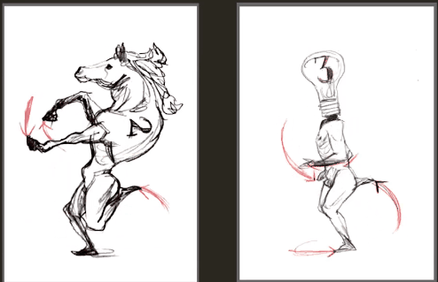

### 蒙皮Skinning

给骨骼蒙上一层皮肤

蒙皮像是个黑箱，以某一方式去驱动哪些顶点去到哪里

LBS ( Linear Blending Skinning)线性混合蒙皮： 大部分蒙皮 ，添加辅助骨可保持关节形状

DQS (Dual Quaternion Skinning)双四元数蒙皮：游戏引擎不支持，如DAZ的模型

JCM(JlointControlled Morphs)骨骼驱动变形：等于PSD(Pose space deformations)，用骨骼驱动morphs变形，如Metahuman

RBF (Radial Basis Function)：辅助骨骼驱动，除了关节还可以做一些肌肉的驱动

RTSS (Real-time Skeletal Skinning）实时骨骼蒙皮：基于优化旋转中心的实时骨骼蒙皮，比较新的概念，游戏引擎可用。

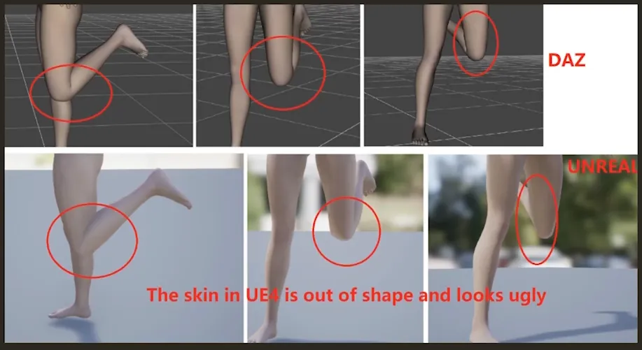

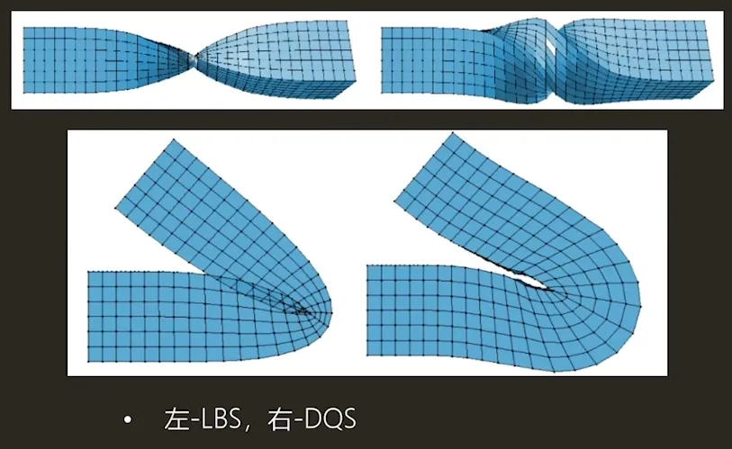

JCM：

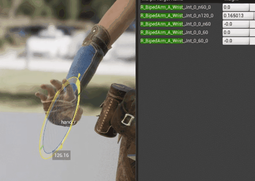

RBF：

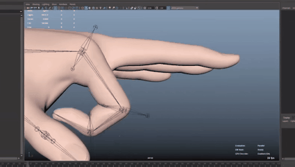

### 动画类型

**逐帧动画:** 

sprite（精灵)动画

以手绘为主，多张2D动画连续播放

**骨骼动画:**

3D动画、spine动画（2D骨骼)

相比精灵动画更加流畅

**顶点动画:**

物理模拟后的动画数据，不便于用骨骼驱动，如布料，流体、破碎等

VAT：将每一帧的顶点记录在贴图上，贴图尺寸：帧数 x 顶点数

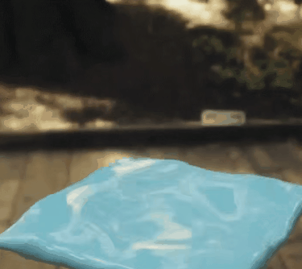

**shader顶点动画:** 

适用于比较规律的扭曲摆动效果，vs控制顶点按照一定规律和公式做偏移动画，草、树叶摆动，海浪等

**FK (Forward Kinematics)**

正向运动，旋转或移动父节点，带动子节点的运动

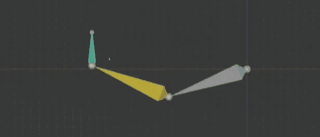

**lK(Inverse Kinematics)**

反向运动，移动子节点时，反向推算父节点会如何被牵动及旋转的

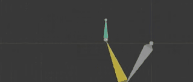

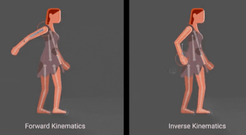

手部，脚步的IK

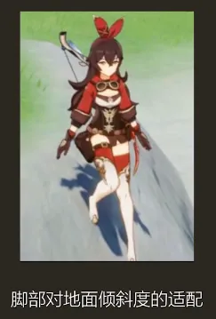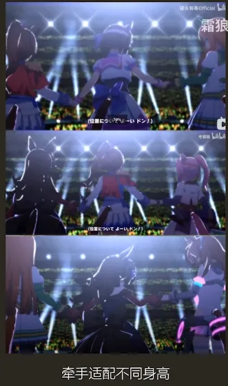

## 动画质量和流畅度

### 流畅

好的动画看起来流畅——符合运动规律，运动轨迹是弧线

日本动画张数都比较少，但好的原画师能理解动画轨迹，画出厉害的动作动作的流畅度和帧数不是必然的关系，有些看似用了3d的动作反而是画的

### 打击感

打击感:结合视觉,听觉,特效等方面的综合表现营造的

合理的打击反馈，被打击方在受到攻击时一般会做出相应的受击反馈

打击抽帧/顿帧

攻击节奏和按键反馈

硬直和打断

比如：

受击、击退、击飞、浮空等受击反馈，浮空怪物下落的加速度、被击飞呈抛物线飞出

击打命中后整体动作带点停顿或放慢，表现出重量和力量感

抽帧：击打后动作停顿

钝帧：击打后震动

预备和缓冲（前摇后摇）

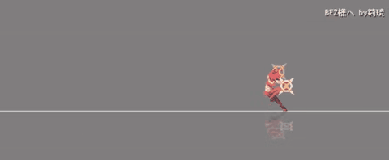

### 夸张：

挤压和拉伸

拖尾和变形

不正确的透视

时间操控

挤压和拉伸

体现物体的速度、动量、重量和质量。

物体不同的材质。拉伸和挤压越多越柔软，越少物体越硬。

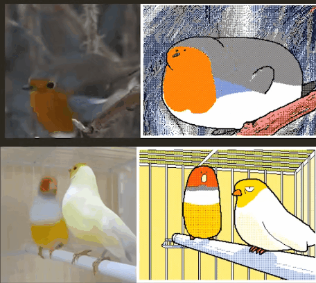

跳跃：先蹲下挤压，跳起拉升

拖尾和变形(跟随运动)

视觉残留，模仿运动模糊的变形

卡通：拖尾变形

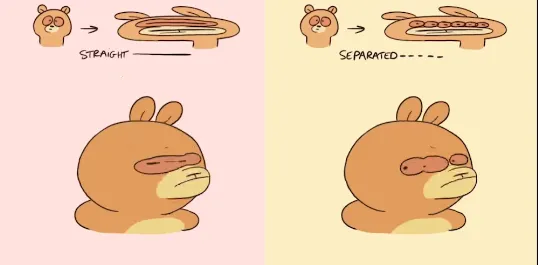

写实类：运动模糊

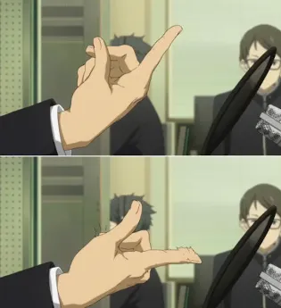

三渲二动画模仿二维动画的技巧：

三维动画实现上比较麻烦，美式卡通更倾向于做模型上的挤压拉伸，但日式更多会做像速度线，色块残留的OBAKE (OBAKE:日式作画中表现高速运动的作画技巧)

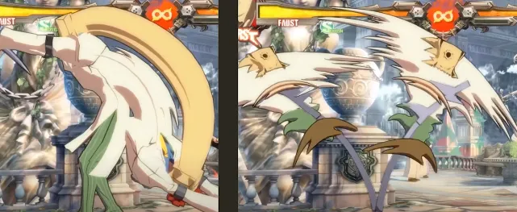

### 不正确的透视：

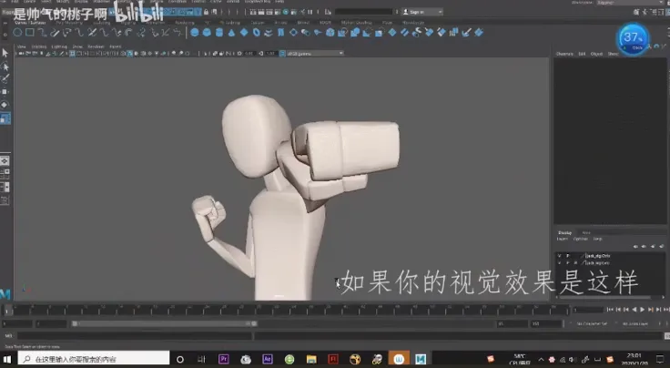

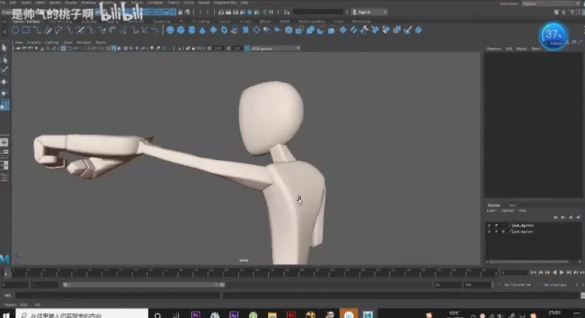

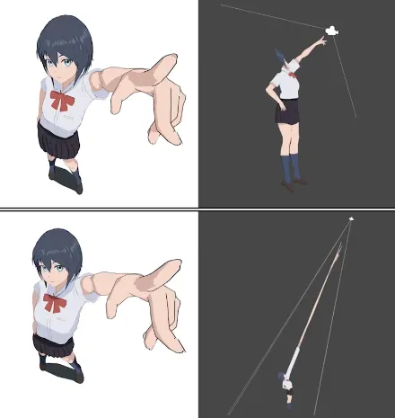

时间操控：

模拟放慢动作，时间停止的效果，一般由程序控制，放慢时间强调POSE

## 动画表现提升点

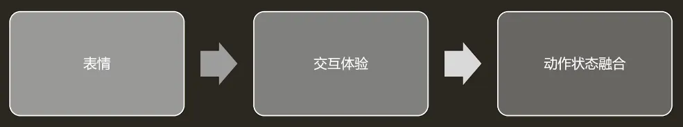

### 表情

写实

欧美式卡通

日式卡通

写实得动捕，欧美卡通的特点是明显的挤压拉伸，日式卡通的表情则需要保持五官完美的形状，并且要保证不同动画师制作的表情和设定一样

视线变换

人在对话时不会一直盯着某处，偶尔会转移视线，

瞳孔变化基本都是忽略的地方，但做好了很惊艳

瞳孔缩放：

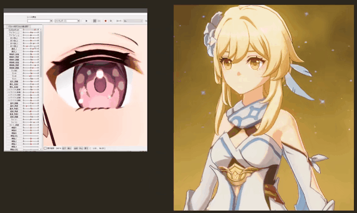

闭眼过程,

眼睛的高光不会消失，紧贴上眼皮

半合状态,眼神就死了

1.如图，制作高光跟随效果

2.减少半合状态的帧数

3.忽视，正常速度播放，根本看不出来

### 交互体验：

替换角色但是共用动画

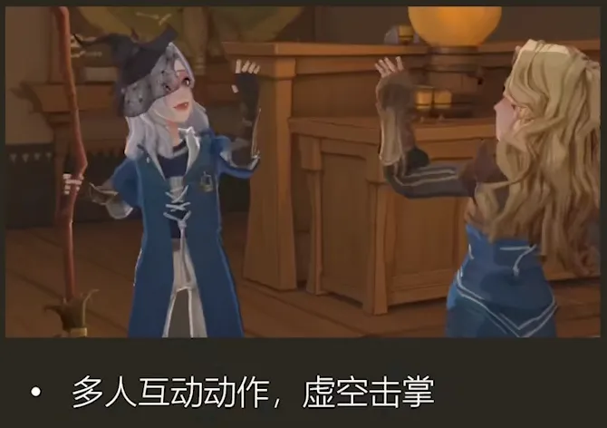

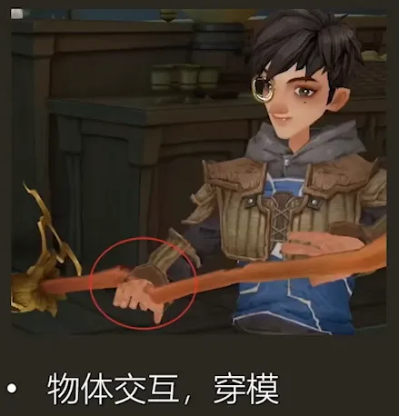

通过镜头和动作设计避免一些穿模

使用IK（手部、注视等)

需要动作兼用的情况，角色身高体型不同，在做接触身体的动作时会穿模如不同的时装，蓬松的裙子和贴身的泳衣;同身高但胸部大小不同的角色

### 动作融合状态：

高级运动系统:动作叠加、分层融合

1个基础动画+n个pose=n个动画

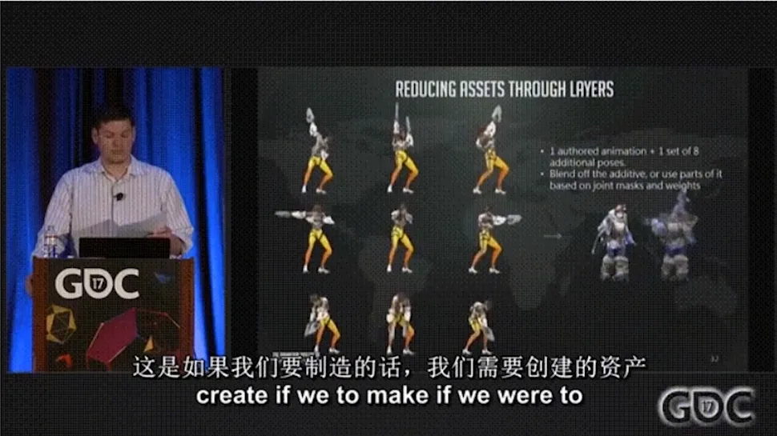

需要注意的一些状态切换

停止:走停、跑停、急停

判断左右脚的状态，拆解走路动画

连招:每一级连招都需要一段回到待机的动画

统一走跑第一帧是左脚先还是右脚先

给走跑动画设置动画事件/通知，判断左右脚的情况
