## 检查模型：

### 1.单位

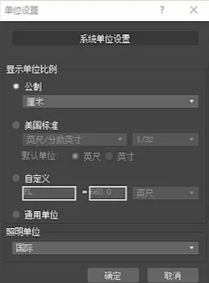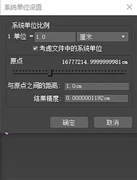

### 2.模型中线与Max中轴重合

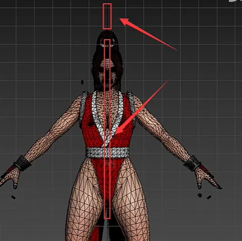

### 3.布线合理

各关节处原则上遵循凸三凹二的规则，具体也要看项目需求

**凸面3，凹面2**

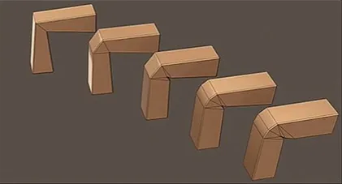

### 4.Xform模型、检查坐标归零

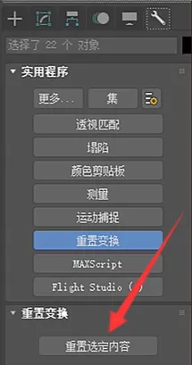

### 5.检查隐藏内容：

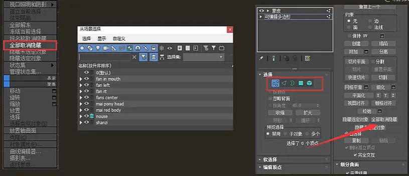

右键显示全部大纲视图查看索引,模型点，线，面，元素级别显隐。

### 6.检查法线、光滑组、合并点

#### 1. 检查法线方向是否正确，在对象属性(或显示面板）勾选背面消隐可以直观查看模型有没有反向法线;

控制器面板编辑法线命令可以检查法线方向，正确的法线会垂直模型表面，方向向外;有些特殊情况，前面的方法不起作用，可以新建一个box，用模型拾取box，这样会重制模型属性有助于检查模型错误。拾取box方法对检查法线和光滑组都有作用

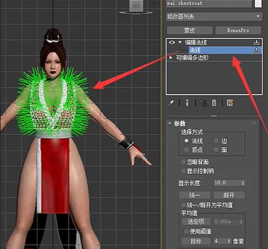

#### 2. 检查光滑组是否正确

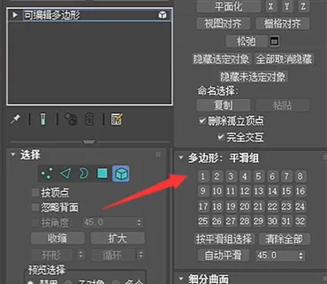

#### 3. 检查顶点是否合并

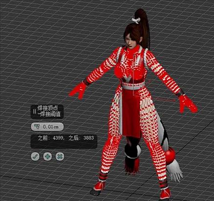

## 搭建骨骼：

1. 肩膀与骨盆大腿的父级是骨盆肩膀的父级是胸骨这样的结构unity支持的更好需要在体格编辑模式下勾选三角形颈部，取消三角形盆骨的勾选

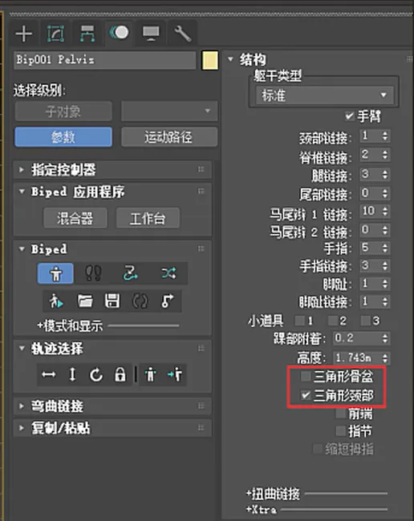

2. dummy不可以做根骨骼，可能会被unity忽略。

3. IK类动画导出时需勾选烘焙动画塌陷bone动画后，隐藏虚拟体后导出

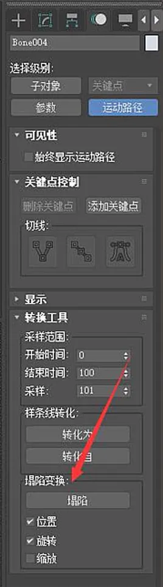

4. 武器换手动画有三种做法。

(1)用缩放控制，在每个需要出现武器的位置都复制出一份武器，父子链接给父级。平时缩放为0.001，需要出现是放大至100。不需要其他操作，引擎可以直接识别，容错率最高，资源消耗根据武器数增多而增多,通常会连接到左手、右手、世界、剑鞘四种。

(2)用prop骨骼控制，不需烘焙导出（大幅度动作可能需要烘焙)，unity中三种动画模式都支持（legacy，generic，humanoid)，容错率较高，缺点是只能认质心、左右手、世界这几种固定父级，灵活性稍差。

注:需把prop骨骼父级关系进行修改，如在初始帧武器被左手握持，则prop父级为左手，或在unity当中要把根骨骼指定为质心，而不是骨盆。

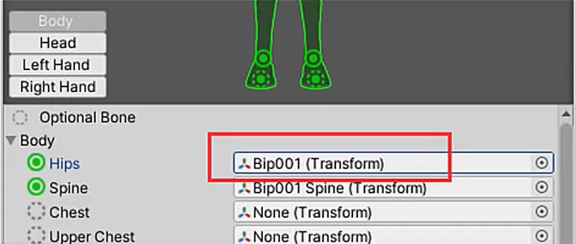

(3) link链接控制。导出时需要烘焙，三种动画模式都支持，不易修改，出错率高，灵活性好，可以任意指定父级。Unity不一定会认，需要多导出几次

5. 扭曲连接：

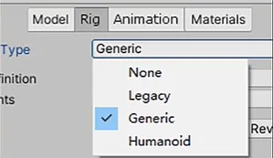

6. 挂点

(1)各类挂点常规位置如下，坐标轴对齐父级骨骼坐标

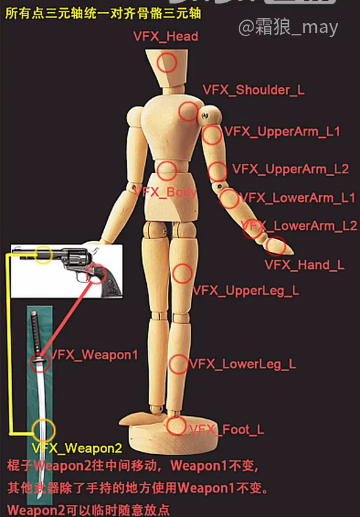

(2)坐骑挂点先把角色放置在坐骑.上摆好位置，新建一个dummy对 齐角色质心，将dummy父子链接到坐骑

骨骼，之后在unity中将角色挂在dummy下，坐标归零即可

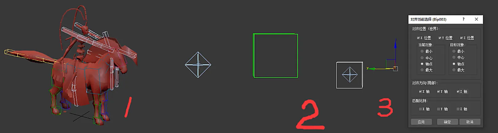

7. 坐标轴对齐

需要手动创建根骨骼而不是使用质心做根骨骼时，需要把根骨骼Y轴朝上z轴朝前，这样才能跟unity坐标轴保持对应，X轴一般情况可以不予理会。

8. 镜像问题

创建bone骨骼，遇到类似翅膀这种左右对称的结构，很多人喜欢使用镜像工具。但是镜像工具其实是，将对称轴的缩放参数改为负数实现的，负数的缩放一旦进了 引擎很大概率出错，所以这里不建议使用镜像工具，有相应的脚本插件可以使用

9. 保存蒙皮姿势

如果骨架中使用了bone和dummy,那么设置蒙皮姿势是必不可少的一步，他

可以让你随时回到骨骼的初始状态调整骨架或者蒙皮，类似CS骨骼的体格编

辑状态。(选 中骨骼alt+右键或动画下拉菜单)

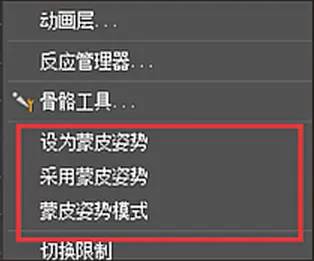

## 蒙皮设置：

### 1.权重受控数

即一个顶点的权重最多

受多少根骨骼影响，unity中只有自动、1根、2根、

四根四种选项，超过四根骨骼影响权重则进入引擎必出错，使用auto也经常出现错误，建议全部设置为4 bone或以下

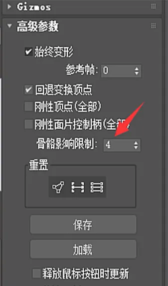

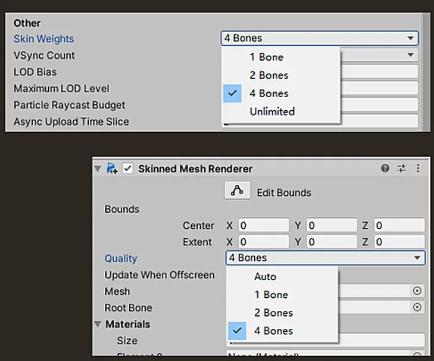

### 2.换装蒙皮接缝处理

接缝处重合顶点权重必须完全一样，如果能设置权重为1更好，便于维护。

### 3. root bone 问题

有些项目需要使用sk inned mesh renderer下的root bone节点，这里解释下这个节点的逻辑。

这里出现的是参与蒙皮的骨骼当中最根部的骨骼，参与蒙皮是指承担权重值，而非仅仅是放在蒙皮骨骼列表，如果你需bip01出现在root bone节点，那可以给bip01很小的权重值，香则fbx在导出时会过滤掉那些完全不承担权重的骨骼。

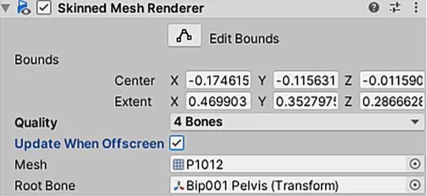

## 动画制作：

### 1. bone on效果

父子级都是bone骨骼时，子级无法做移动动画，此时可以关闭动画工具中的bone on属 性，unity 对此是可以识别的。

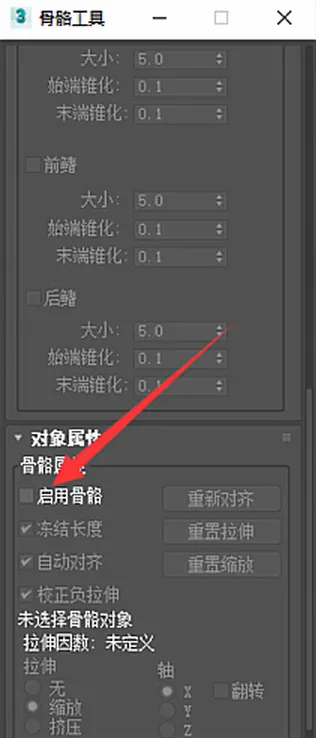

### 2. CS骨骼缩放及缩放继承

CS骨骼是可以缩放的，只要更改骨骼属性为缩放XYZ,并开启启用自动化开关。如果CS骨骼有附属的bone或dummy,可以控制bone和dummy是否继承CS骨骼的缩放。(仅在等比缩放时有效， 单轴缩放不支持)在层次链接信息-继承节点下。

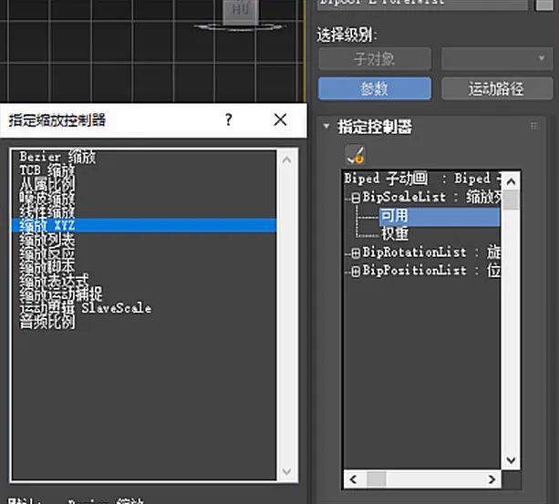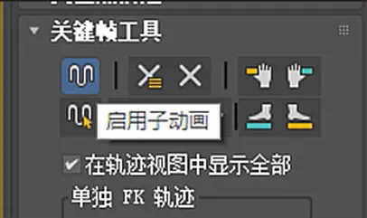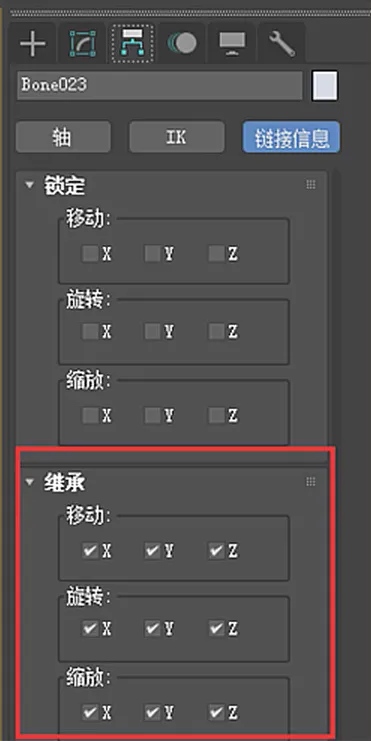

使用的情况较少

## 导出相关：

### 1.何时烘焙

有IK时、有lnik时、有路径动画时、.....总之， 如果有非常规的动画，你都可以考虑烘焙，在unity内发现动画异常，你也可以烘焙一下看看。

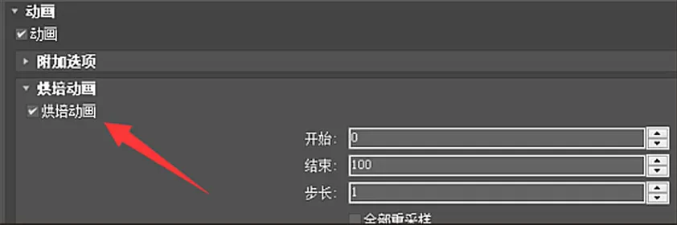

### 2.曲线过滤

max导出时是可以选开启曲线过滤的，很多人说，开了曲线过滤后fbx会变小，但测试下来对最终动画文件并没有什么影响。曲线过滤跟unity当中的动画压缩是同一原理，都是根据阈值删减关键帧，反正在unity当中都是要压缩的，所以开不开曲线过滤对最终.ani格式的动画文件没有影响。

### 3.层动画塌陷

有时我们在unity中查看动画，会发现角色似乎丢失了一部分动画，只有某几个部位在动，这其实是因为在导出fbx前，忘了塌陷层动画。unity是无法识别底层的动画的，他只认最上层的动画信息，所以就会显示出只有一部分部位在动的效果。(在动作资源规划那块会讲)

### 4.导出与导出所选

直接导出会导出场景当中的所有内容，包括隐藏的和冻结的;导出所选只会导出你选中的内容。如果你对他们的特性很熟悉，并且知道自已想要导出那些内容那就使用导出所选，否则最好还是使用直接导出。使用导出所选，可以尽可能的精简骨骼数、过滤不必要的内容，但是很容易犯错，维护成本也比较高。

### 5.导出命名检查

导出的时候一定要再次检查骨骼的命名以及模型文件的命名还有贴图的命名，虽然这些有些是模型童鞋负责的，但是动作这边是到引擎前的最后一步交接给程序以及特效，所以最后定要检查一遍相关的命名规范

## 其他：

### 1.粒子视图

不小心按到数字键6就会生成一个粒子视图，在大纲视图看不到，也没办法点选删除。解决办法是按F11输入 delete $’particle view ‘

### 2.命名与路径

要检查模型mesh命名、材质名、贴图名，skin文件的骨骼命名和骨骼结构必须和动画文件的一致，命名要特别注意空格符号，出现在文件名首尾的空格符很难被发现。具体的命名规范视项目情况而定

### 3.引擎中路径文件夹和文件名

**以unity引擎举例**

在Assets下会有很多文件夹，根据不同项目的分类方法各有不同，问程序大佬们要到动作文件的路径，记住他，以后就是你的了，通常都是Animation和Animators两个文件夹，Animation是存放动作的文件，

Animators是状态机(这个后续unity动作资源会讲)

文件名的话采用模型名@动作名字因为用@的话会自动化动作名称。至于状态机的命名的话一般没什么特别的要求。尽量兼顾所有用到的人都能很明白一眼就看懂是什么就行

这里只是简单提一下unity中的动作这一块具体的在unity资源规范中会讲，上述的情况需要根据项目的实际情况来做，要和策划大佬以及程序大佬们]沟通好

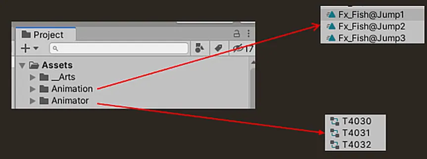
