# 一、主题设定

* 设计游戏场景之前，要先确定游戏的背景、时间等因素，进而来明确游戏风格。和角色设计思路类似
* 通过对玩家动线的设计，功能模型的合理布局构建出场景的基础骨架。
* 通过光影效果、色彩变化来烘托场景氛围
* 用人话说就是：不同主题的游戏，有着不同的画风
* 市场常见游戏注意类型：剑侠、科幻、废墟、魔幻......

# 二、场景风格确定

* 按照大类分化为：写实风、非写实风
* *细分常见风格：赛博朋克（*注：对于赛博朋克这个词的理解，可以去看一下Gamaker发过的一期视频，讲的蛮好的）、写实、卡通、像素风.....**

# 三、场景设计构图

场景构图是场景设计中非常重要的一部分

## Part1 常见构图法：

### 1.三分法

* 画面从水平方向和垂直方向分别分成三部分时，线条交叉的地方就是黄金分割点，是焦点的最佳位置
  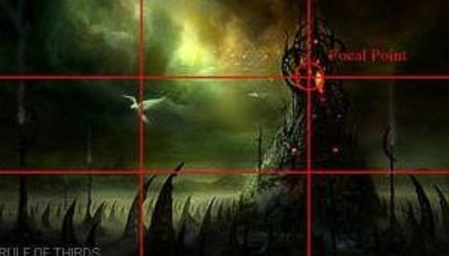

### 2.环形

* 环形是由连续的曲线组成，其环形的运动轨迹将视线牢牢地吸引在画面上。
* 动态性的环形，让人感觉不太稳定，会稍微自然一些。
* 它们像轨道一样的外观通常擅长创造独特的道路感和行进距离感，以及将焦点吸引到场景中间。
* 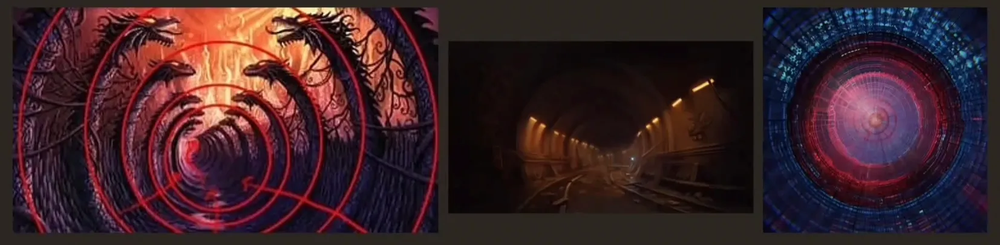
* 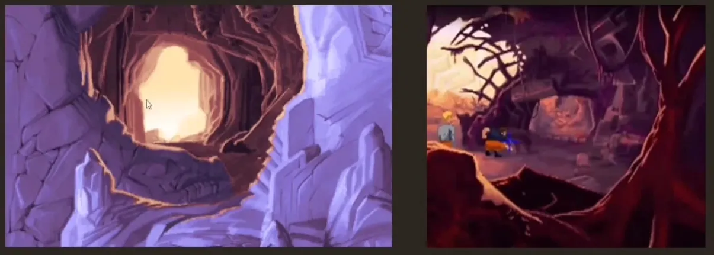
* 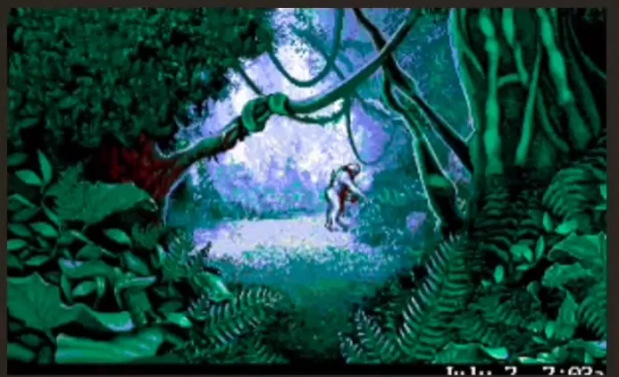
* 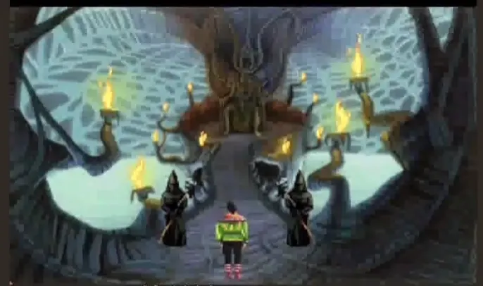

### 3.对称式构图

* 对称式构图具有平静，稳定，重量等特点
* 常用于水面、平川、草原；或重要的人物出场
* 缺点：构图太过单一，画面缺少生动性
* 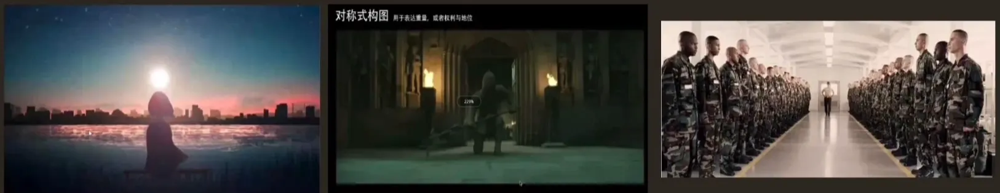

### 4.垂直线构图

* 通常以树、电线杆等垂直的东西作为垂直线，突出重点，画树的时候需要把节奏感表现出来。
* 画面以垂直线条为主
* 运用长度、粗度不用的垂直线，来让画面产生一种动态的节奏感。
* 常见的：垂直线分割手法：让垂直线沿着一个方向逐渐变短，从而产生距离感，为画面增加深度
* 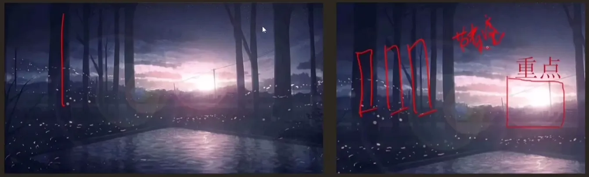
* 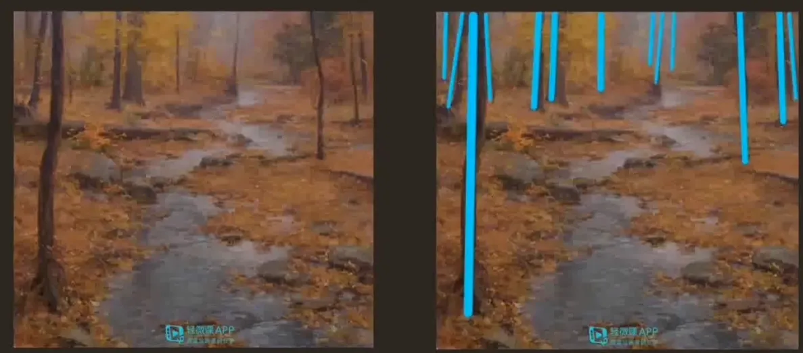
* 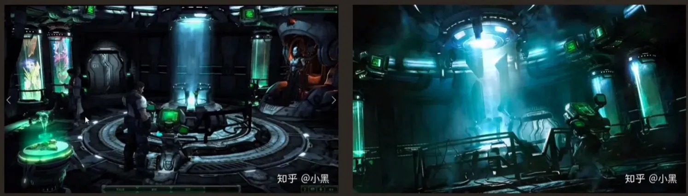

### 5.水平线分割构图

* 常用于表现辽阔的场景，比如风景画
* 在画面中添加水平线可以增强画面的稳定感，给人平稳、舒展的感觉。
* 但是过多的水平线会破坏画面的紧凑感，要注意控制水平线的数量和疏密程度
* 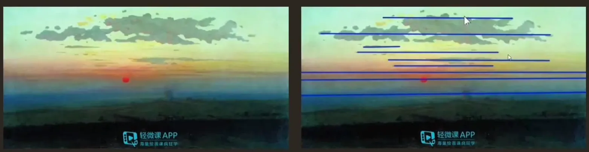

### 6.十字分割构图（**水平线和垂直线组合**）

* 十字型的垂直线和水平线的交叉状态，是一种特殊的交叉线，它具有交叉线的所有特征，比如：视觉聚焦、主体突出、制造出视觉中心。
* 是画手引导观众按照他的想法欣赏画作的一种方式
* 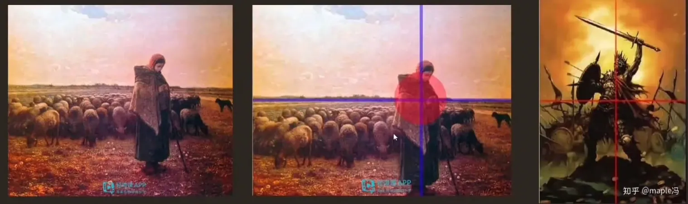

### 7.视觉引导线

* 引导线会把玩家的视线吸引到画面的主体上，道路和墙壁都可以作为画面的引导线。
  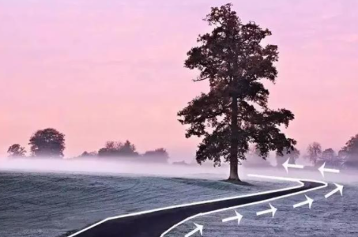

## Part2 速涂场景剪影

构图构思好后，就可以开始场景速涂剪影了

### 1.剪影：

* 原画中，剪影设计是一张好的场景设计的前奏，是一种较为概括外观的设计，
* 看一张图，是从整体看起的，剪影的设计就对应了这个

### 2.剪影练习：

* 剪影需要大量练习，要主动打破单一的结构关系，突出重点，找出变化趋势，顺势调整变化的组织关系。做到疏密得当、突出重点
* 注意点：
  * 即使是简单的形状，也要遵循统一中求变变化的原则，这样结构才会好看
  * 剪影的辨识度，简单来说就是一个就知道这是个什么东西
  * 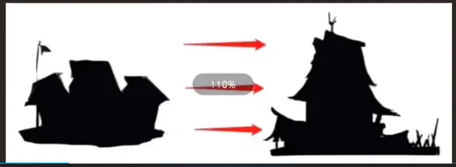

### 3.可能遇到的问题：

* 杂乱无章 ：
* 问题是变化过多，缺乏统一，找不到视觉中心
* 改善：外部的条状物进行删改，突出核心
* 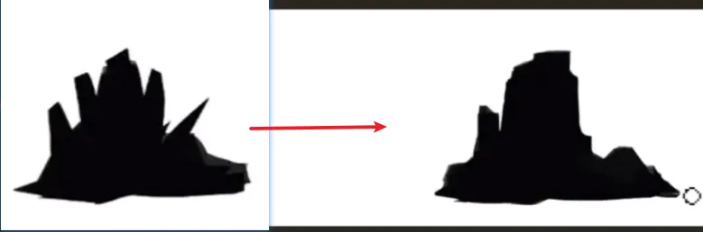
* 变化单一 ：
* 问题： 没有节奏、没有疏密关系
* 分析方法1：把剪影用时钟标出来，整点的位置必有设计
* 可以看出问题：

  * 物体之间大小相同，无重点
  * 物体朝向平均往周围发散、视觉中心不集中
  * 剪影过于简单
* 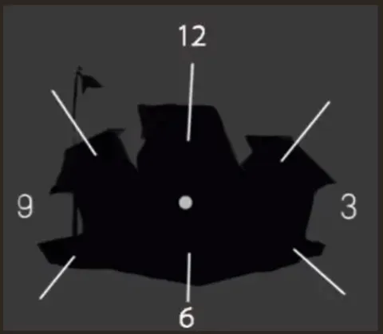
* 分析方法2：把剪影中物体的位置均等间隔放置
* 可以看出问题：

  * 布局朝向过于均等
  * 朝向单一、图形太简单
  * 没有主次关系
  * 剪影不明确（看不出这是个啥东西）
* 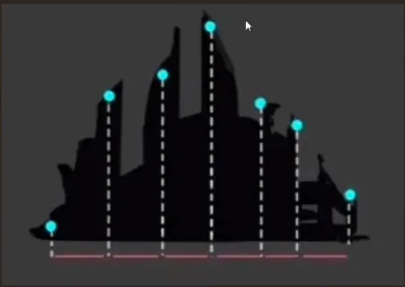

### 4.如何用剪影激发创作灵感

* 可以通过不断变换剪影来激发灵感，把灵感具象化
* 方法：
  * 利用同一个剪影模板的基础上，不断添加设计元素给场景新设定
  * 利用剪影模板，通过变形、局部夸张、局部替换等手段，重新设计一个新的场景

## Part3 剪影内切

剪影速涂后，要进行剪影内切，把剪影内部的初步结构通过内切来整理清新，挑出线稿的框架来练习

**方法**

* 1：切出剪影内部的具体结构，把重要的部分先切出来
* 2：明确基本结构之后，把物体亮暗面，通过二分初步分出亮暗灰三大面，使作品立体化
* 3：进一步优化物体的“五大调子”（高光、明暗交界线、亮面、灰面、暗面。概念见前几章。），疏密关系。如：投影、空间关系。
* 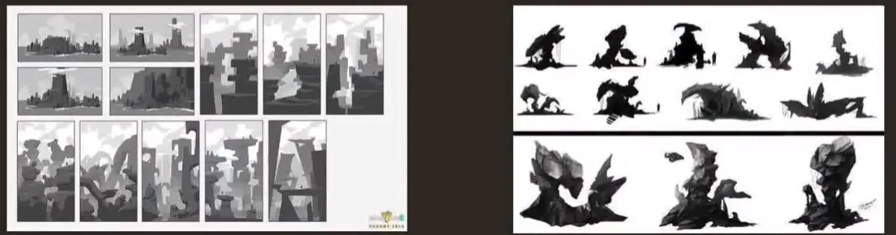

用三分法构图举例剪影流程

* 三分法剪影：用20分钟左右的时间速涂起稿，重点在：概括地形、视觉中心在画面中的位置
  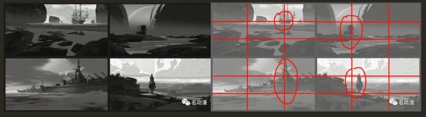
* 剪影的空间处理：重点在突出空间关系，画面中的视觉中心呈现“突出部”的结构
  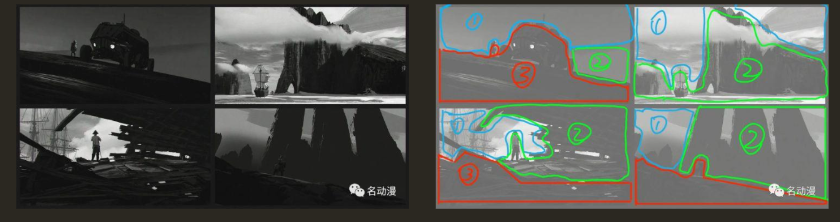

三分法构图流程：

* 草稿
* 上基础色
* 增加元素
* 处理地形、整体细化
  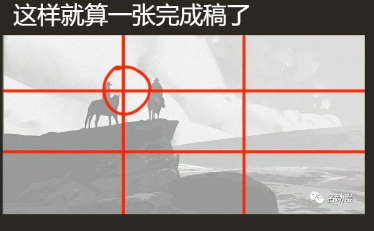

# 四、前景场景和纵深感（空间关系）

## 1.前景

* 指位于注意前边的部分
* 合理运用不仅可以突出主体，还能给画面营造出纵深感，提高视觉冲击力
* 注意：

  * 前景是用来烘托注意的，而不是阻挡看向主体的视线
  * 前景的定位就是绿叶、配角型的，所以表现力弱于主体，所以要让人能分出主次。
  * 运用准确，构图唯美，要保证前景符合整个画面注意，也就是前边所说的统一性
* 透视感在前景场景与纵深感起到了很大的作用，后景可以让画面看起来有纵深感
* 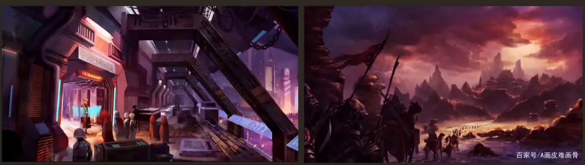

# 五、场景色彩分类

* 色彩是一张原画的关键，可以传达很多信息
* 色彩搭配是比较需要经验和学习的部分，多看多练
* *三原色：红黄蓝、色彩的特征：色相、纯度/饱和度、明度（*具体概念前几章）**
* 色性 ：
* 包括暖色调、冷色调、中性色
* 冷色调：
* 色彩中没有绝对的冷色调，冷色调是相对的，环境和比例是影响颜色冷暖的两个因素
* 常见的：蓝、蓝紫、蓝绿，给人寒冷、平静、理智的感觉
* 暖色调：
* 常见的：红、红橙、黄橙、和红紫，给人温暖、热烈、激情、危险的感觉
* 中性色：
* 常见：黑、白、灰
* 离橙色越近颜色偏暖，离蓝色越近颜色偏冷。
* 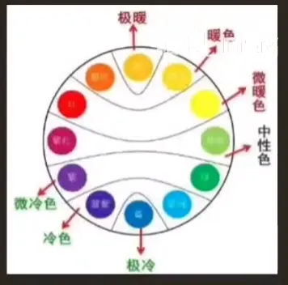

## 1.配色比例

* 日本设计师提出过的配色黄金比例：70：25：5，其中70%大面积的主色，25%为辅助色，5%为点缀色。一般情况下建议画面色彩不超过三种
  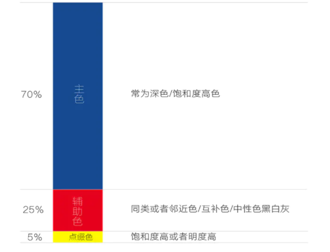

## 2.色彩关系

* 色彩之间的关系取决于在色环上的位置
* 色相之间的角度越近，对比越弱；角度越远，对比越强
  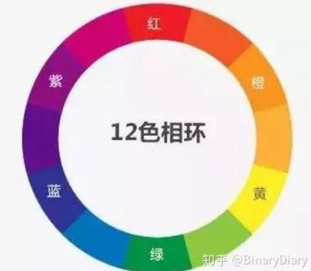

## 3.色彩搭配的例子

* 相邻色：eg：红+橙
* 间隔色：eg：红+黄
* 互补色：eg：红+绿，紫+黄

## 4.叠色

* 先用黑白灰，再叠色，体积感会更强，直接上色出来的色彩感也不错
* 三大步：起稿、铺调子、设计和塑造
  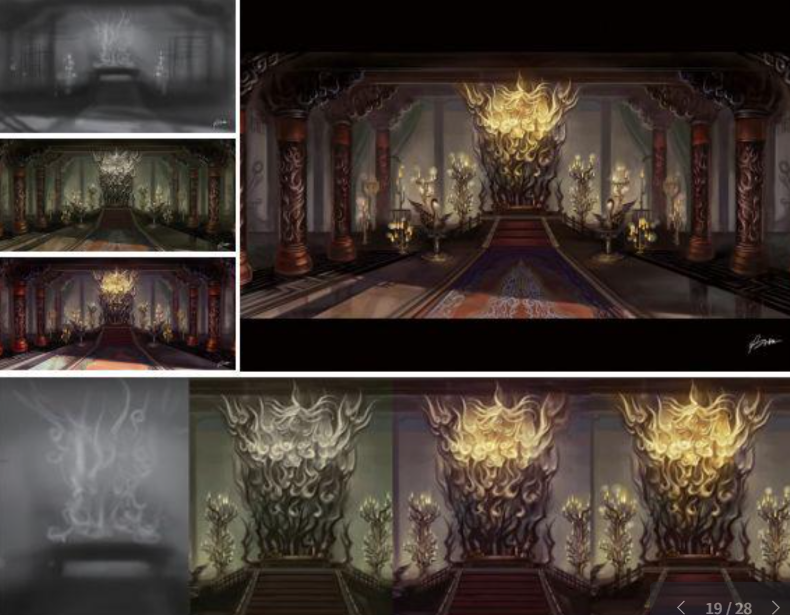

## 不同游戏中不同色彩的例子

* 色彩的首要宏能是帮助我们便是物体，eg：红色的苹果，因为现实中就是红色的，方便我们更容易的辨识
* 画面分为很大一部分是由颜色决定的，比如一些经典游戏主题的配色
* 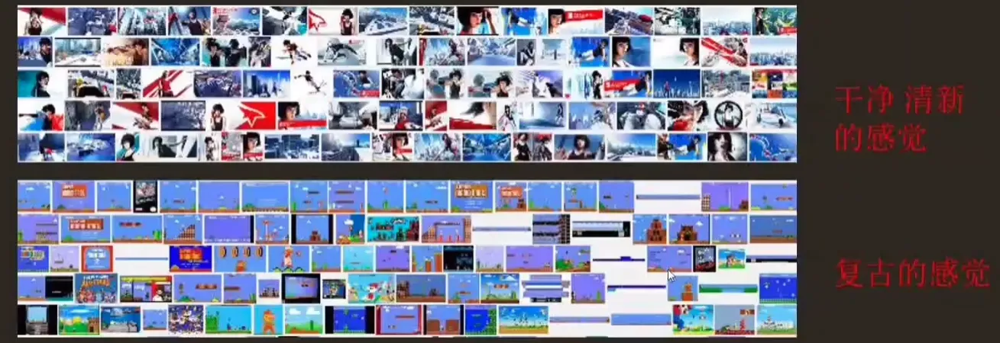
* 休闲游戏和核心游戏色彩的区别
* 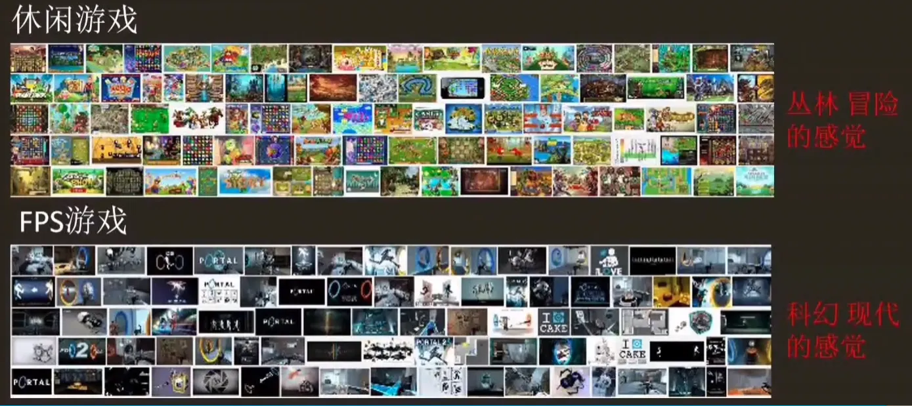

# 六、场景光影氛围

* 光影中重要的亮点：

  * 打光
  * 光影的分割
* 不同的光会给人不同的情绪影响
* 光影的分割 ：
* 就算内容一样，不同的打光情况下，会有不同的氛围和情绪，它所代表的东西也是不一样的。
* 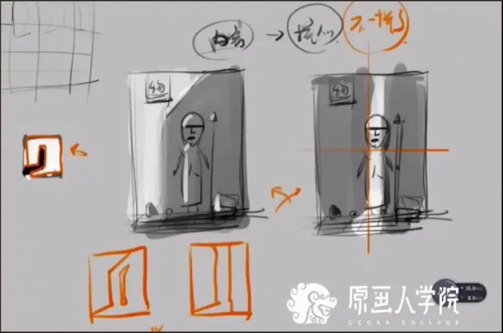
* 不同的光影氛围

  * 具体可以参考补充资料，包括：正面、侧面、顶光、逆光、底光、等等一些

# 七、场景细节添加

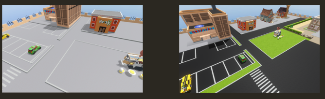

个人理解：不要让场景太空（除非专门要空的感觉），可以给场景添加一些小细节，但是这个细节是作为衬托的存在，目的是让场景氛围、主题统一，并且做到不空洞。
