## 认识游戏特效

**什么是游戏特效？**

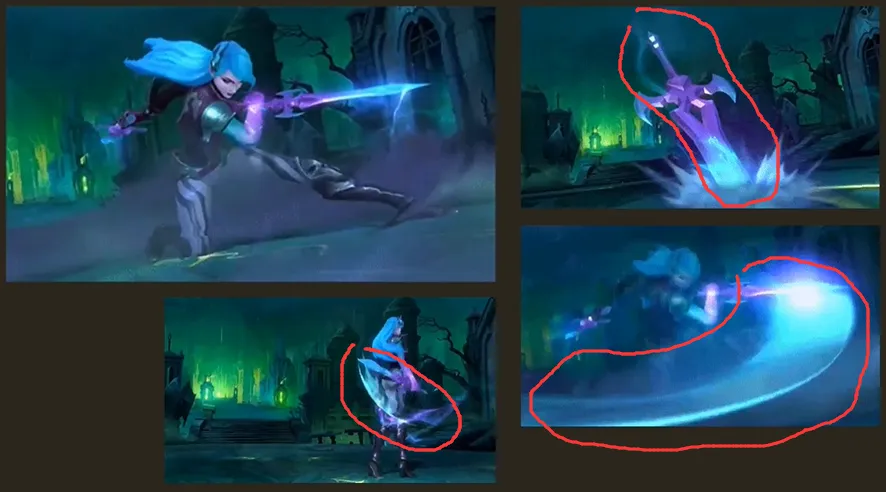明确了技能形状，技能范围->攻击判定，施法范围，表现范围

特效：提供给玩家一种视觉上的引导，攻击防御等等做出一些反应

## 特效与游戏玩法

技能范围判断指引：

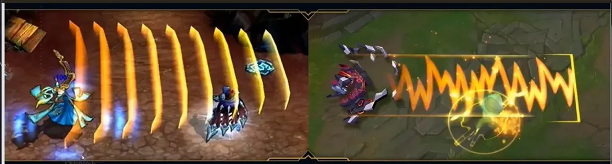

打击感：

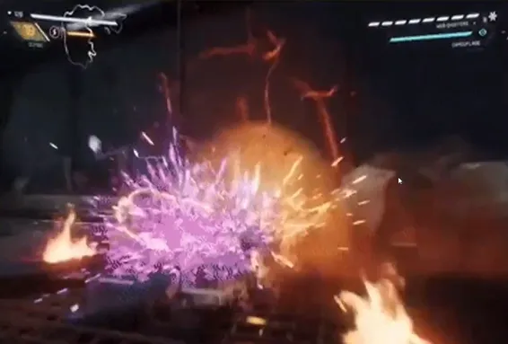

## 形状的表达

依旧是：

点

线

面

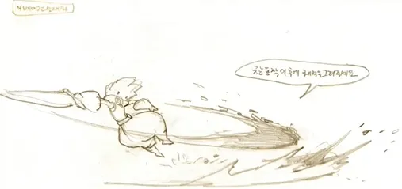

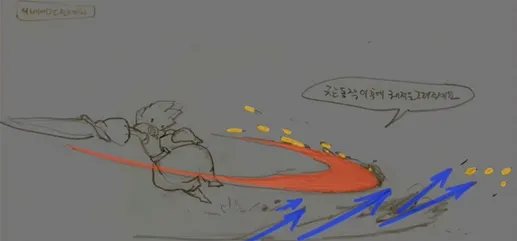

面展示特效主体部分，点展示力度的方向，粒子点缀

### 点：

作用：定位视点，增加细节

1.视点定位

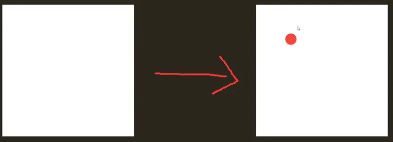

2.增加细节

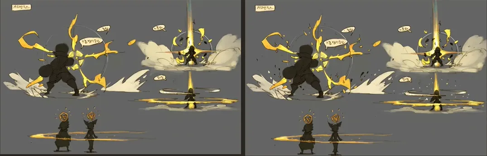

### 线：

线条主要有直线和曲线两种直线和曲线，不同的线有不同的性格描述。

一、直线

简单表现为直接、果断。

二、曲线

可以简单理解为生动、活泼。

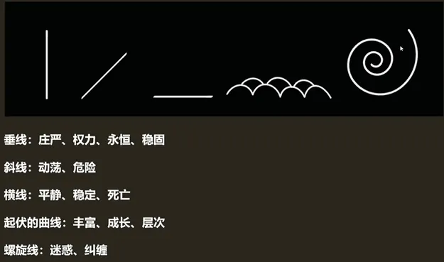

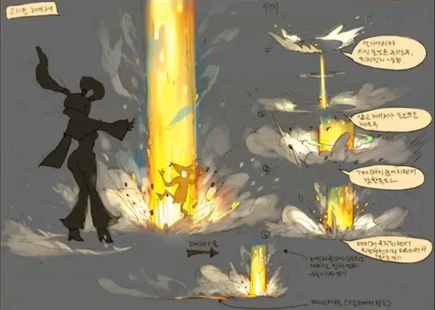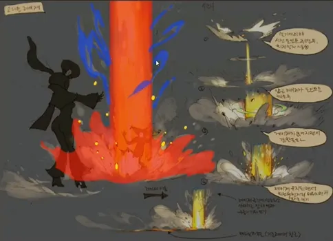

面占画面的60%-70%，面太多会导致画面呆板

线占面的10%-20%，线太多会导致画面乱

点太多会导致画面很碎

线的疏密关系

线的疏密对于整体画面来说控制十分重要

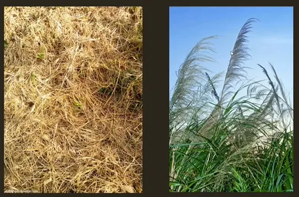

右图看起来比左边的整齐

线的疏密

疏密为构图提供了更多的可能性,需要牢记的是多不等于好，一味堆特效很可能会达到反效果。

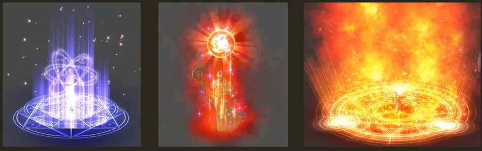

图一效果太碎了，图二太整齐了，图三没什么细节

轨迹与力

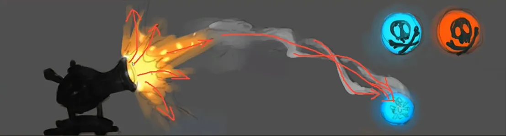

轨迹是由力驱动，用于控制元素运动的轨迹

必须要了解的是，我们在设计和制作特效时，元素的运动方向是由力决定的，而元素的运动方向又决定了运动形态，最终由运动形态体现出力的存在。

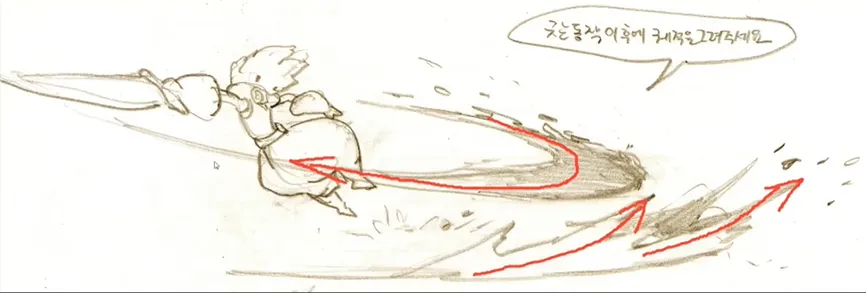

线的动静

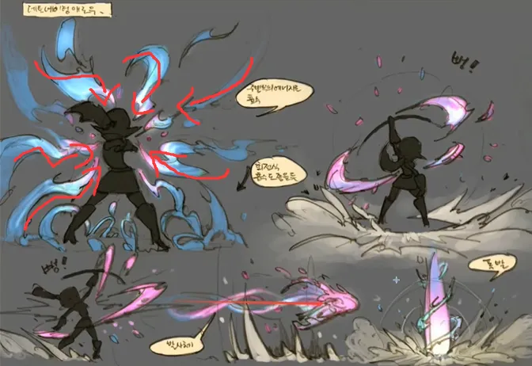

力度改变

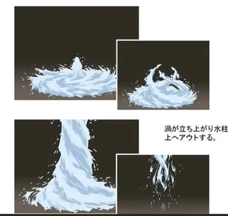

### 面：

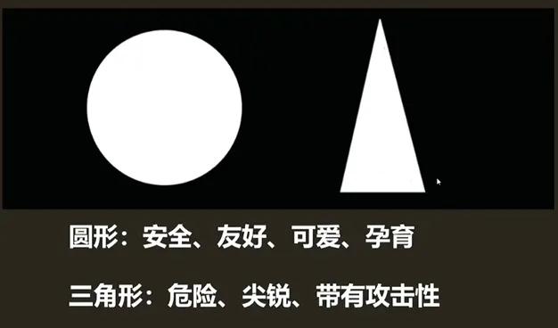

护盾：

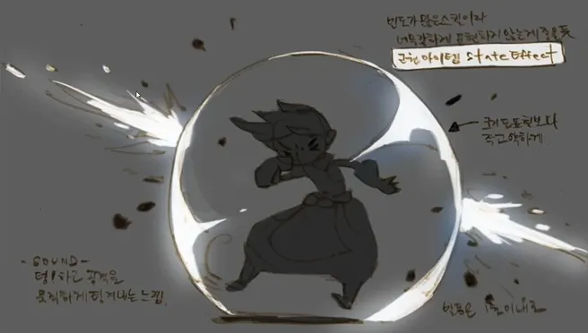

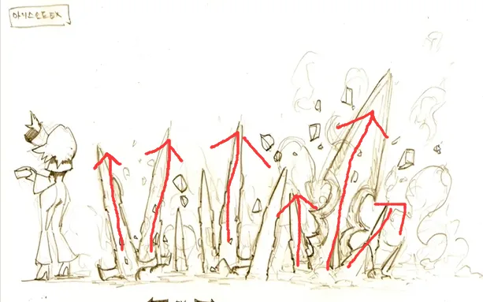

一个综合的案例：

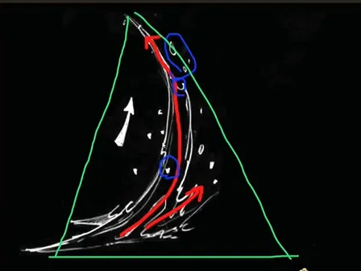

1、通过点增加面的细节

2、力驱动的轨迹线

3、线的性格

4、由下到上由密到疏

溶解度：

溶解度变化对于特效的影响十分大，它可以用于表现一个卸力的过程，这是我们以力作为驱动元素运动的一种重要的表现手法。而且融解度也可以表示风格化程度

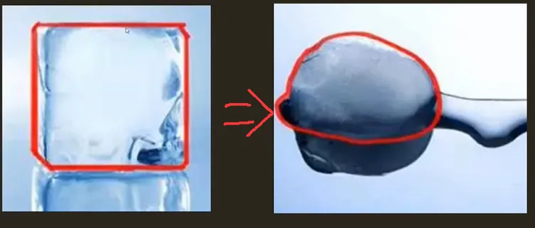

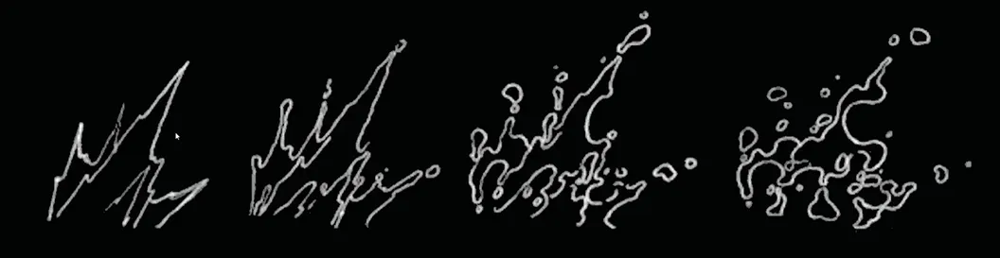

结构：

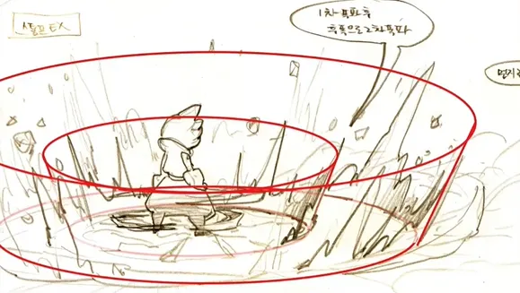

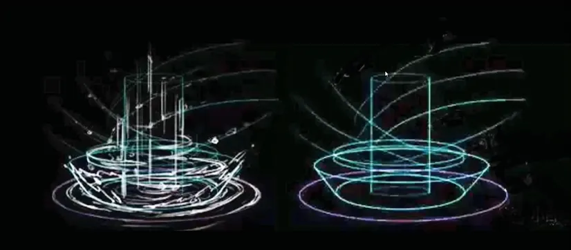

## 色彩和光影

### 光影：

光影在我看来是一个比色彩更重要的成分，它是色彩的基础。在特效设计中，其主要作用有以下几点:

一、高光点可以起到与点类似的吸睛作用

二、可以控制特效的整体层次感

三、增加特效的整体细节信息

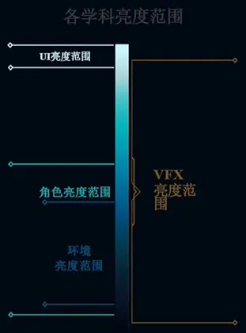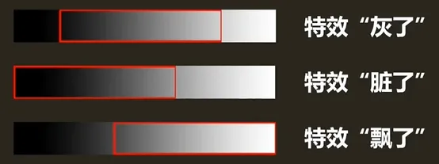

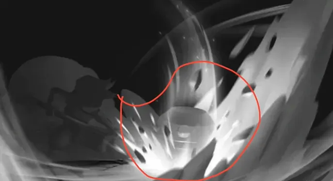

### 色彩

色彩在特效中可以增加特效的层次,，也可以表达相应的情感,让人理解这个特效的功能是什么

1.丰富细节

2.颜色也有情感

治疗：

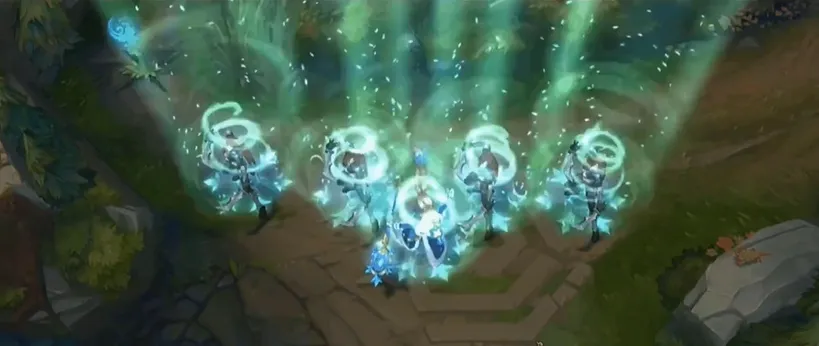

伤害：

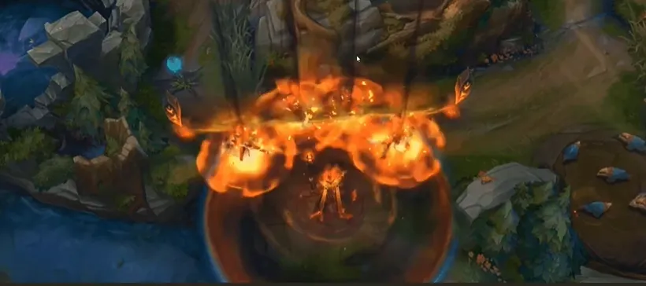

毒：

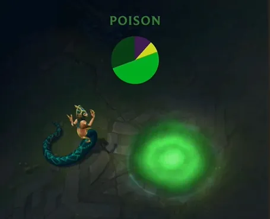

治疗：

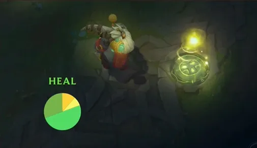

## 重中之重-节奏

节奏是有序的，规律的,蕴含变化的对比;是一系列的对比所带来的整体感觉。

节奏有三要素:间隔、重复、节拍

当然节奏最重要的还是对比。

间隔，重复，节拍：

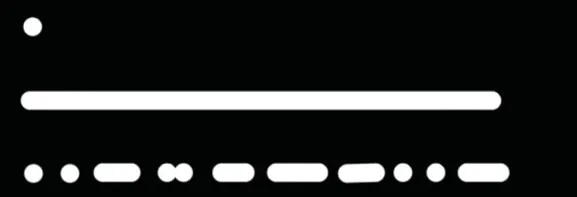

## 对比

对比是节奏变化的核心，对比规律过于简单，或者规律过于繁乱,都不好看。我们要把画面节奏安排在一个区间内:整体节奏是有变化规律的，但是规律中又有一些不规则。

而对比又分为:大与小的对比、疏与密的对比、远与近的对比、方向的对比、色相的对比

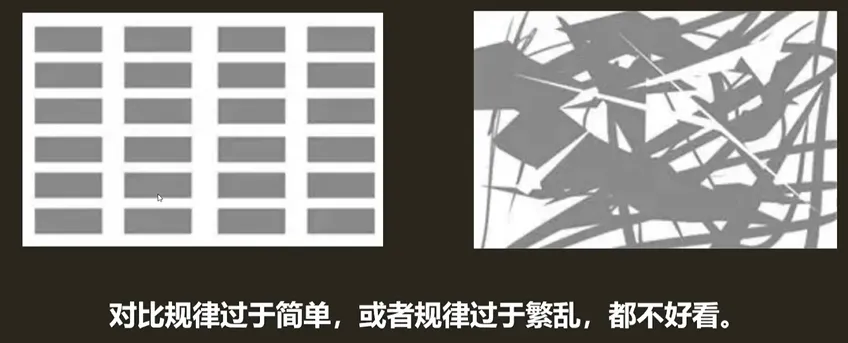

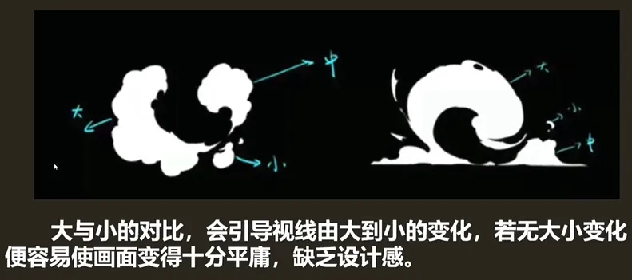

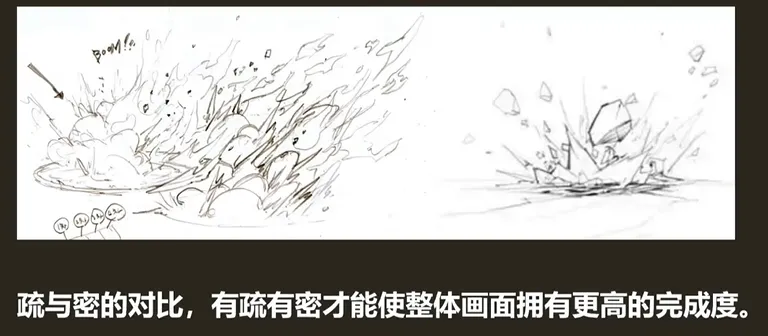

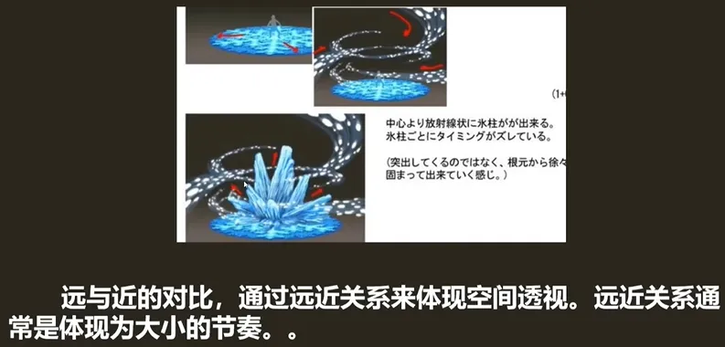

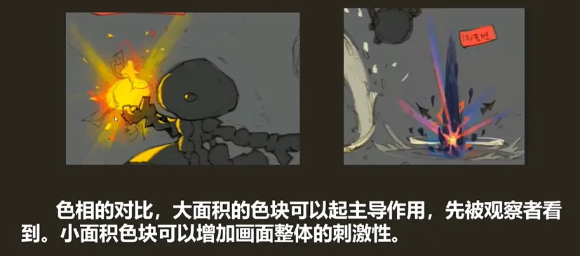

## 参考资料

May霜狼特效第二节:https:/www.bilibili.com/video/BV1hs41157oF

英雄联盟特效风格指南:https://pan.baidu.com/s/1M7rJ9lq3ArD5ZIWilq3loQ

提取码:iwg5

慎独VFX《浅谈游戏打击感》:https://mp.weixin.qq.com/s/wOviUSaPVILXXDGn0X9AKIO

白银《来聊聊如何提高审美那些事》:https://www.cgjoy.com/thread-186178-1-1.html
