## 制作流程：

## 规范的设计原因和目的：

1. 节约沟通成本
2. 保持项目的一致性
3. 工作交接可以更加便捷降
4. 低出错的概率
5. 提升工作效率

—制定规范的目的是尽可能保证，相同的需求分配到不同的特效师手上，可以得到一致的结果

资产结构：

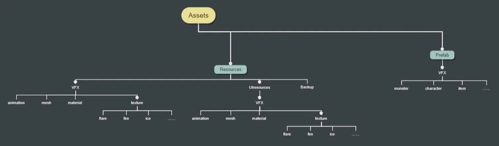

## 资源规范：

### 贴图

像素为2的n次幂(32x32、64x64、128x128....）(32x12.8....大小不超过1024*1024

关闭mipmaps<可根据制作需要开启，一般情况下U贴图/序列图默认关闭>常规格式（(.tga、.png)

限制贴图总数（绘制贴图时考虑通用性)

除特殊mask类需要，贴图填充率尽可能高

贴图合理分类，不应该出现相同或者相似的贴图

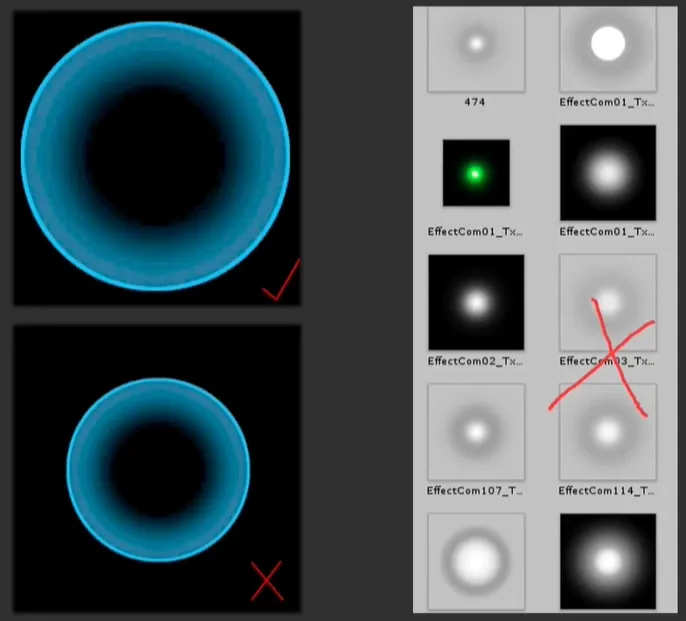

### 模型：

面数不超过500

限制模型总数（建立模型时考虑通用性)关闭meshread/write

输出时关闭不需要的选项（动画/灯光/贴图......

### 命名规范：

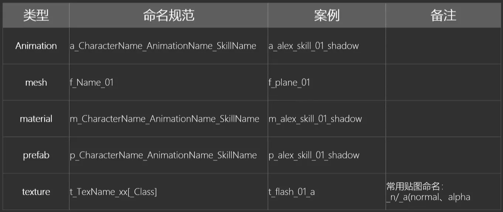

### 路径规范：

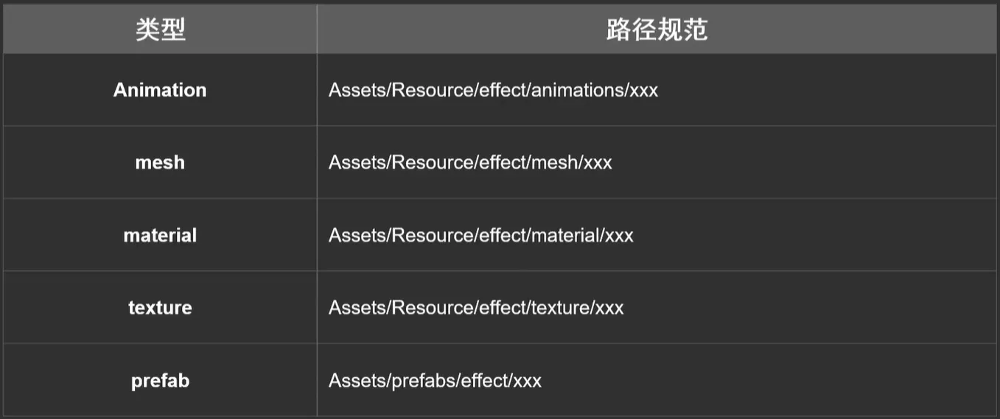

## 制作规范：

1.极限优化情况下，可多使用mesh+动画制作特效，减少粒子发射器的使用

2.制作特效时，关注Batches数量，这个是实际的Drawcall (DC） 数量，对CPU影响较大技能能特效的DC数量（等同于使用的材质球数量）不超过30，buff等经常出现的效果不超过10

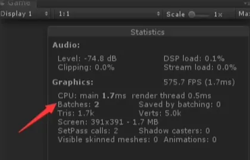

3.粒子发射器尽量不要发射mesh（有可能包含的mesh面数较高）

4.发射器数量限制<30(视项目/技能类型而定)

5.材质球尽可能复用

复用材质可以减少DC

6.制作时需要密切关注OverDraw的情况

对GPU影响较大叠加层数过多，变成白色的情况是不允许出现的，也尽可能不要有全屏大的持续效果

7.关闭renderer阴影/受光

8.特效order in layer/RenderQueue

## 特效拆分与程序调用原理：

事件行为：

1.发生前:预警/蓄力.....

2.进行时:技能释放/飞弹/爆炸.....

3.结束后:消散/溶解/淡出......

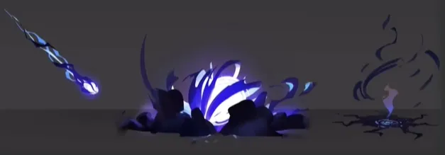

### 特效拆分：

案例:皮卡丘释放了十万伏特，对角金鱼造成了x点伤害效果拔群!

具体拆分以下特效:

1.蓄力特效:皮卡丘周身环绕着闪电

2.释放特效:皮卡丘释放闪电（动作时间固定的情况下可以和蓄力做在一起)技能特效

    a:角金鱼被多根闪电柱击中（技能初期，闪电柱可以用脚本生成多根)技能特效

    b:闪电柱变得又粗又大（技能完全体)

3.受击特效:角金鱼被闪电击中的表现

4.受击特效:角金鱼受到了麻痹效果（Debuff)

### 调用方法：

1.技能编辑器封装单个对象的技能表现

由模型、动作、特效组合而成，可以表达"皮卡丘使用了十万伏特"的视觉效果不同的项目有不同的编辑器使用方法（是否好用取决于程序大佬......）

2.代码控制特效逻辑

一些在特定时间，特定地点播放的效果，可以由程序直接调用prefab

3.特殊类型特效表现此类表现需要和程序商量落地方案

子弹特效（路径/速度/加速度/击中反馈)

材质特效(shader属性表现)

连线特效(linerender等)后处理（校色/径向模糊等)

## 总结：

### 流程规范：

需求->概念设计->落地方案->满足功能的特效->连入游戏->效果迭代

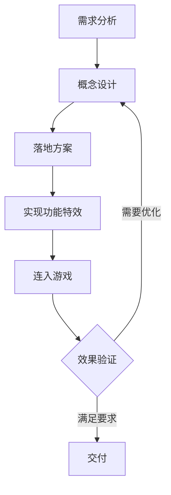

### 资源命名/路径规范：

命名：

格式：类型_名字_次名字……_版本_资源类型

路径：目录_类型

### 资源制作规范：

#### 模型：

1.特效模型面数最大500(面数可以加到1000，但是要分lod等级)

2.特效中如果使用到骨骼动画，骨骼数量尽量不要超过30

3.特效中的模型不要使用mesh collider

4.特效中的模型导出时关闭动画以及材质球

5.使用到的模型尽量合并

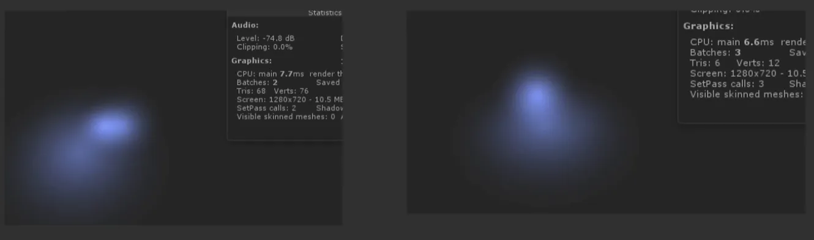

6.使用裁剪尽量减少模型面数：

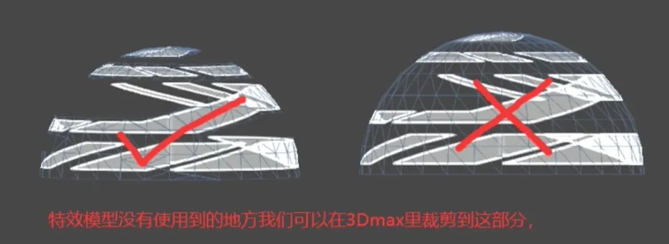

#### 贴图：

1.贴图要统一是2的n次幂，特效纹理尺寸移动端─般≤512

2.尽量少用Alpha通道的，RGB通道可以存不同的图来分别采样，减少内存占用

3.一些规则的几何图形尽量使用shader制作矢量的来通用

4.特效贴图关闭MipMaps

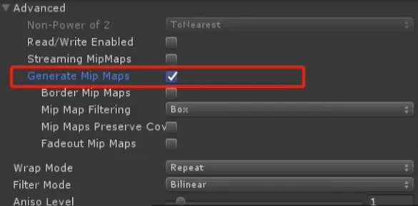

5.贴图尽量合并减少渲染批数

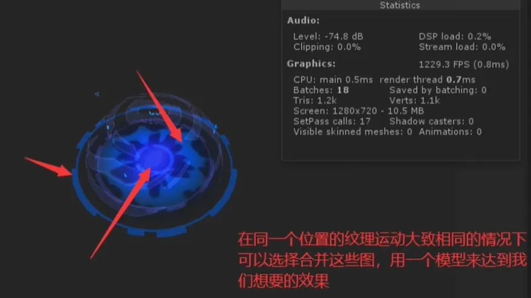

#### 粒子：

1. 粒子最大数量需要根据不同LOD来做分级
2. 尽量不要用粒子来发射模型
3. 粒子发射器中的Scaling Mode设置为Hierarchy
4. 在制作完粒子特效后，根据当前粒子最高峰值数量去调整Max Palicles
5. Noise类的功能要谨慎使用
6. 需要多粒子的特效，尽量以减少粒子数量加速粒子发射速度，减少生命周期的方法替代
