尽管现在已经是半个闲来无事敲代码的人，但仔细想来，小时候似乎也在补习班被迫养成了一些美术素养，画的画不能说丑，只能说是“要情感有情感，要技术有情感”。

以我最近画的一张图为例，献丑了:

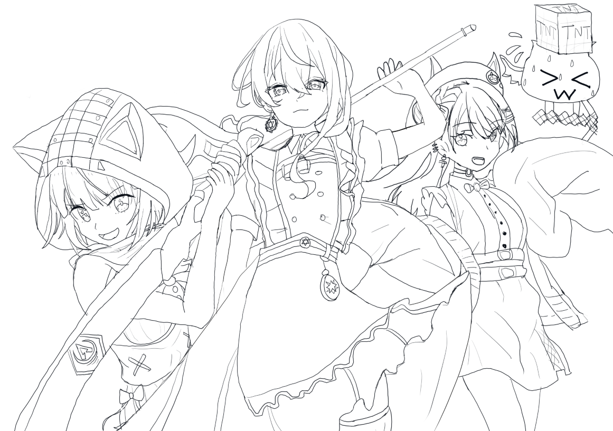

尽管我个人对这张图已经很满意了，但还是让我的美术同学评价了一下，挑出不少毛病：

- 线条不一致，而且似乎是因为控笔的问题，整张图有点脏
- 人物的解剖、比例存在问题，不过毕竟是门外汉，自然也不去深究了
- 最最重要的一点，透视非常奇怪！比起一张多人的合照，更像是类似二游的PV封面图...

而除了上面所说的，一张美术原画所需要的，远远不止一张角色大概的轮廓图。

光影、透视、色彩、构图...等等这些行内人士所考虑的地方，作为技术美术自然是要学会的。虽然原画产出的任务并不会直接操刀，但这种原画制作的流程和素养确实有必要学习。

## 光影

所谓光影，就是**光线照射在物体上所形成的明暗变化，即光线和影子（Light & Shadow）**

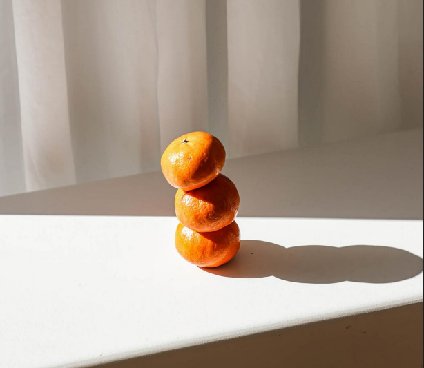

### 黑白灰

在美术黑白灰指亮面、灰面、暗面，输入素描的三大面，主要体现一个物体的争议受光的过程。普遍存在于各种艺术和设计领域。黑白灰作品的出现，源于上世纪 80 年代的伤痕美术。

具体表现可以从下图的素描关系中得出。光线照射，受光面为“亮”，形成“ **白** ”，背光部为“ 暗 ”，形成“ **黑** ”，其余为过渡的“ **灰** ”色。

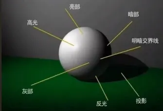

### 明暗五调子”

如果将上图的黑白灰从表现上细分可得；

- 高光：受光面最亮的一个点。
- 亮面：指受光面的高光与深灰面中间的层次。
- 灰面：指亮面与明暗交界线中间的层次。
- 明暗交界线：是指亮暗面的转折处，一般明暗交界线是最重的地方。
- 暗面：包含物体背光面、反光和投影。

这就是素描中所说的  **明暗五调子**

这块的每一个光影元素，都可以在图形学找到相关的工作，例如负责灰面的纹理贴图，负责亮暗面的光照模型，负责交界线的AO等等。

### 游戏中的光影

很多时候说一个事物在画面中“飘了”，可能就是在说光影问题，例如下图的人物阴影

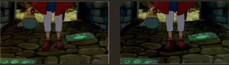

光影的黑白灰变化对于**氛围塑造**也起了很大的作用，例如下图：

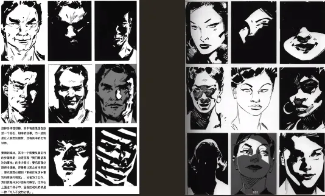

## 透视

“透视”一词源于拉丁文“perspclre”（看透），这在平面或曲面上描绘物体的空间关系的方法或技术。

一张图的透视主要关注下面这些要点：

- 视点：人眼睛所在的地方，用 S 表示。
- 视平线：与人眼登高的一条水平线。
- 视线：视点与物体任何部位的假想连线。
- 视角：视点与任意两条视线之间的夹角。
- 视距：视点到心点的垂直距离。
- 画面：透视图所在的平面。
- 灭点：透视点的消失点。

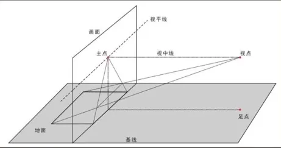

玩过摄影的同学应该对这块的审美素养比较高。

### 透视的类型

#### 平行透视

平行透视也叫单点透视，即物体向视频线上某一点消失。

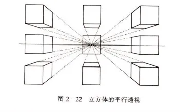

大部分时候，我们用到的都是单点透视。

#### 成角透视

成角透视也叫二点透视，即物体向视频线上某二点消失

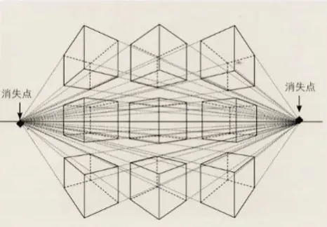

#### 三点透视

有三个消失点，高度线不完全垂直于画面。

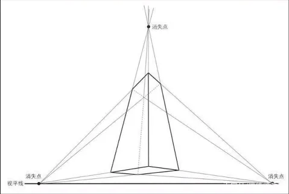

#### 散点透视

散点透视也较多点透视，即不同物体有不同的消失点，这种透视在中国画中比较常见

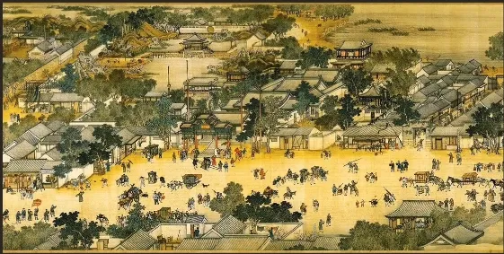

#### 鱼眼透视

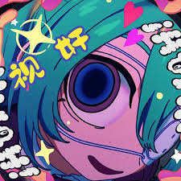

#### 空气透视

空气透视，是由于大气及空气介质（雨，雪，烟，雾，尘土，水气等）使人们看到近处的劲舞比远处的景物浓重，色彩饱满，清晰度高等的视觉现象。又称“色调透视”，“影调透视”，“阶调透视”。如近处色彩对比强烈，远处对比减弱，近处色彩偏暖，远处色彩偏冷等，故空气透视现象又被称为色彩透视。

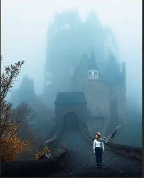

### 达·芬奇的透视观点

根据达·芬奇对于透视研究的结论，透视分为以下几种：

- 色彩透视 ：研究这些物体颜色的淡退
- 消逝透视 ：研究物体在不同距离处清晰度的减低
- 线透视 ：研究物体在不同距离处的大小

**这和我们平时所讲的散点，焦点透视有所不同，大师果然就是大师。**

### 游戏中的透视

游戏中为了营造空间感，会使用雾效，这就是空气透视。

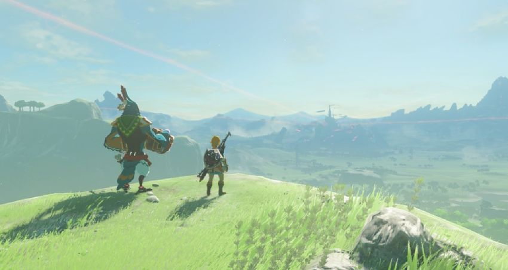

罪恶装备使用了一种奇特的扭曲的透视

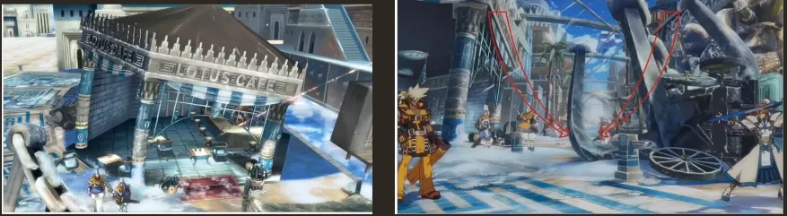

## 色彩

这部分推荐视频：[色彩原理](https://www.bilibili.com/video/BV1UW411o7PJ?p=2)

色彩是眼、脑和我们生活经验对光的颜色类别描述的视觉感知特征。

### 色彩三要素

色彩三要素：色彩可用的**色调**（色相）、**饱和度**（纯度）和**明度**来描述。人眼看到的任意彩色光都是这三个特性的综合效果，这三个特性即是色彩的三要素，期中色调与广播的频率有直接关系，亮度和饱和度与光波的幅度有关。

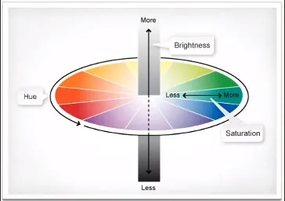

#### 色相

指色彩相貌，是色彩最显著的特征，是不同波长的色彩被感觉的结果。光谱上红、橙、黄、绿、青、蓝、紫就是七中不同的基本色相

#### 纯度

色彩纯度，是指原色在色彩中所占据的百分比。纯度用来表现色彩的浓淡和深浅。纯度是深色、浅色等色彩鲜艳度的判断标准。

彩色系中，常用彩度或者饱和度表示，而黑白的纯度，则可以称之为灰度。

#### 明度

是指色彩的明暗、深浅程度的差别，他去却与反射光的强弱。它包括两个含义：一个是指一种颜色本身的明与暗，二是指不同色相之间存在着明与暗的差别。

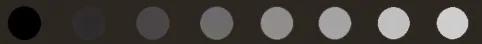

### 三原色

三原色指色彩中不能再分解的三种基本颜色，我们通常说的三原色，是颜料三原色以及光学三原色。

**光学三原色（RGB）：**

红、绿、蓝（靛蓝）。光学三原色混合后，组成显示屏显示颜色，三原色同时相加为白色，赛色属于无色系（黑白灰）中的一种。

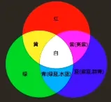

**颜料三原色（CMY）：**

绘画色彩中最基本的颜色为三种，即红（品红Magenta），黄（柠檬黄Yelow）、蓝（青Cyan），称之为原色。

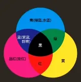

### 复色

任何两种间色（或一个原色与一个间色）混合调出的颜色则称复色，亦称再间色或第三次色。（黑色的深灰黑色，所以任何一种颜色与黑色混合得到都是复色。即凡是复色都有红、黄、蓝三原色的成分。）

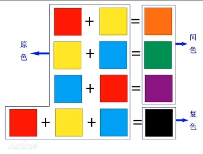

### 同类色

同一色相中不同倾向的系列颜色被称为同类色。如黄色中可分为柠檬黄、中黄、橘黄、土黄等，都称之为同类色。

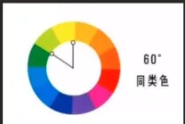

### 互补色

色相环中相隔180°的颜色，被称为互补色。如 红与绿，黄与紫互为补色。补色相减（如颜料配色时，将两种补色颜料涂在白纸的同一点上）时，就成为黑色；

补色并列时，会引起强烈对比的色觉，会感到红的更红、绿的更绿。

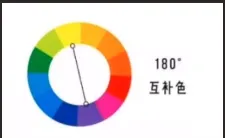

### 对比色

对比色是人的视觉感官所产生的一种生理现象，是视网膜对色彩的平衡作用。指在 24 色相环上相距 120 度 到 180 度之间的两种颜色，成为对比色。

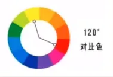

### 冷色和暖色

冷暖色指色彩心理上的冷热感觉。红、橙、黄、棕等色旺旺给人热烈、兴奋、热情、温和的感觉，所以将其成为暖色。绿、蓝、紫等色往往给人镇静、凉爽、开阔，通透的感觉，所以将其称为冷色。色彩的冷暖感觉又被成为冷暖性。色彩的冷暖感觉是相对的，除橙色与蓝色是色彩冷暖的两个极端外，其他许多色彩的冷暖感觉都是相对存在的。比如说紫色和黄色，紫色中的红紫色较暖，而蓝紫色则较冷。

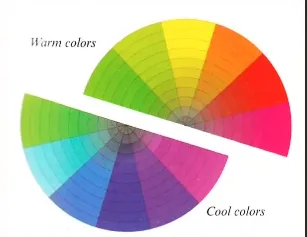

### 游戏中的色彩

色彩在游戏中是非常重要的，可以唤起情感的强大方式，塑造品牌和潮流，增加视觉层次，体现时间的发展等

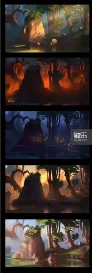

**推荐阅读：游戏设计里的色彩剖析**

[http://www.chuapp.com/article/190673.html](http://www.chuapp.com/article/190673.html)

## 构图

构图是指 在视觉艺术作品中，对画面元素进行安排和组织，使其形成一个有视觉冲击力、美感和主题表达的整体=。它可以理解为“如何将画面元素组合在一起”的问题，是摄影、绘画、设计等领域中一个重要的技巧和概念。

构图的名称，来源于西方的美术，其中有一门课程在西方绘画中，叫做构图学。构图这个名称在我国国画画论中，不叫构图，而叫布局，或叫经营位置。也就是说。摄影构图是从美术的构图转化而来，我们也可以简单的称它为取景。

研究一个平面上处理好三维空间——高、宽、深之间的关系，以突出主题，增强艺术的感染力。构图处理是否得当，是否新颖，是否简洁，对于艺术作品的成败关系很大。

### 构图形式

#### 水平式（安定有力感）

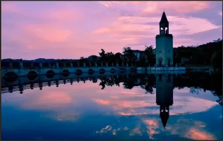

#### 垂直式（严肃端庄）

#### S形（优雅有变化）

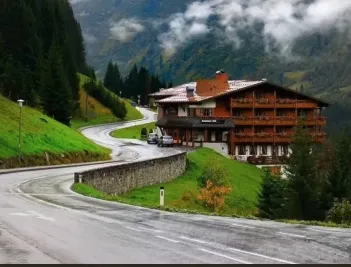

#### 三角形（正三角铰空，锐角刺激）

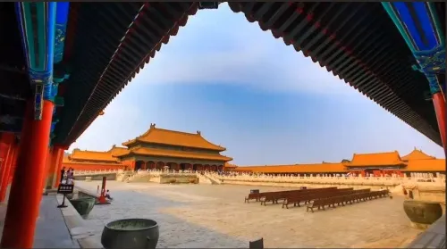

#### 长方形（人工化有较强和谐感）

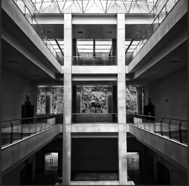

#### 圆形（饱和有张力）

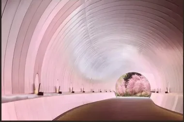

#### 辐射形（有纵深感）

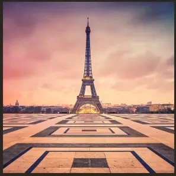

#### 中心式（主题明确，效果强烈）

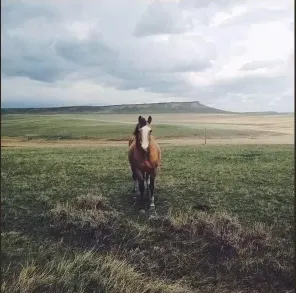

#### 渐次式（有韵律感）

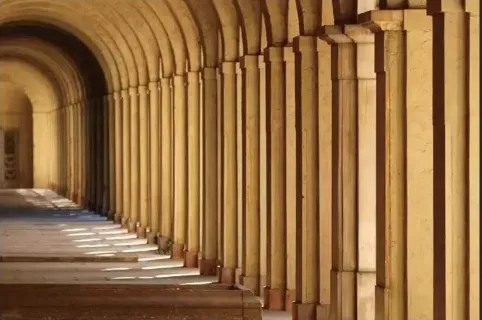

#### 散点式（自由可向外发展）

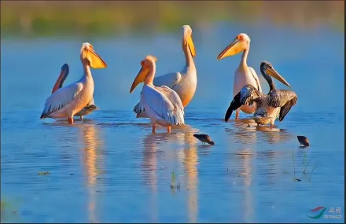

### 游戏中的构图

这里不得不提到《塞尔达传说：荒野之息》，在游戏中使用的**三角设计**原则

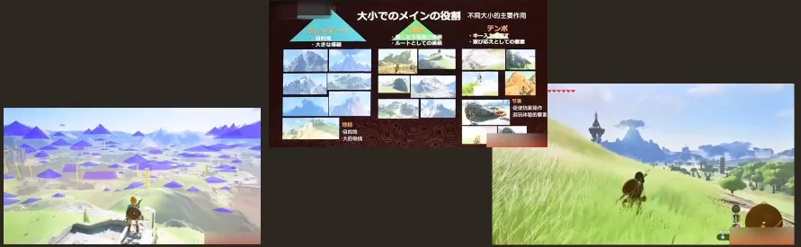

大中小三种尺寸的三角形起到不同的作用

- 大三角：任务指引，目标指引
- 中三角：边界，限制移动
- 小三角：设置障碍，玩家交互

## 镜头语言

### 镜头语言是什么

镜头语言就是用镜头像语言一样去表达我们的意思，我们通常可经由摄影机所拍摄出来的画面看出拍摄者的意图，因为可从它拍摄的主题及画面的变化，去感受拍摄者透过镜头所想要表达的内容。

而蒙太奇（Montage）在法语是“剪接”的意思，但到了俄国他被发展成一种电影中镜头组合的理论，在涂料、涂装行业蒙太奇也是独树一帜的艺术手法和自由式涂装的含义。

### 镜头的一些概念

广角镜头的基本特点是，镜头视角大，视野宽阔。从某一视点观察到的景物范围要比人眼在同一视点看到的大得多；景深长，可以表现出相当大的清晰范围；能强调画面的透视效果，善于夸张前景和表现景物的远近感，这有利于增强画面的感染力。

长焦距镜头是指比标准镜头的焦距长的摄影镜头。视角小，景深短，透视效果差。

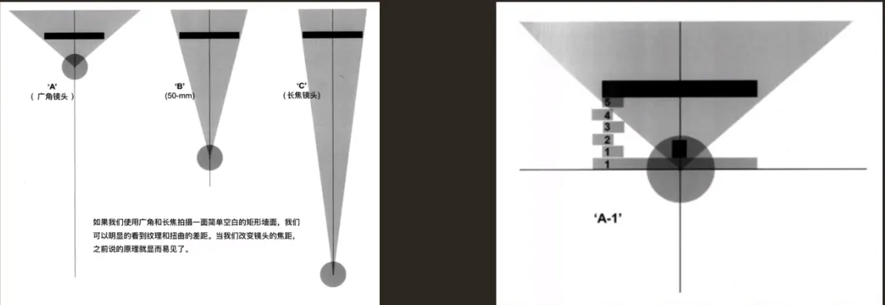

### 镜头语言的常用手法

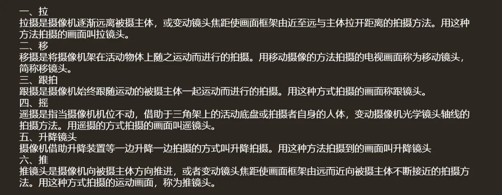

### 游戏中的镜头语言

《战神4》中为了能够拉近玩家和游戏角色的距离，使得游戏感觉更加紧张采用的过肩视角

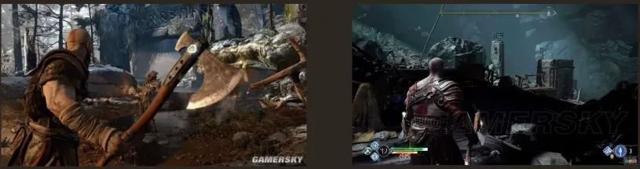

《塞尔达传说：荒野之息》中利用镜头语言在开场一组跟拍后拉起的镜头，直接为玩家展示了海拉鲁大陆，并且远处的城堡直接点名了游戏的目的。

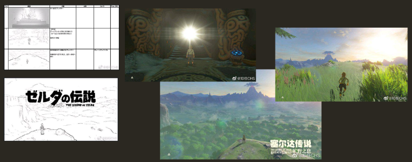

## 游戏美术风格概念设计

### 什么是游戏美术风格概念设计

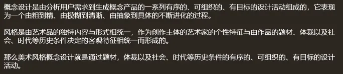

### 如何确定游戏的美术风格

#### 1. 看清自己的用户群体

每种风格都有它的特定喜爱群体，不同的用户群体自然就有不同的审美需求。

#### 2. 题材和风格都是为了游戏本身的理念而服务的

以荒野大镖客为例：

为了追求极致的沉浸式体验，比如在大镖客里猎杀小动物的猎杀某一大型动物所要用的武器是有不同要求的，还有对设计动物的部位，它形成的伤口大小都会对皮毛的品质造成影响，那美术风格肯定要有代入感，也就是要极度写实。

#### 3. 平台的性能技术有时也会限制住一些理念的表达

例如勇者斗恶龙11 在 PS4 和 3DS 上的风格表现则是完全不同。

### 常见的游戏美术风格分类

分为：东方，西方，卡通，写实。

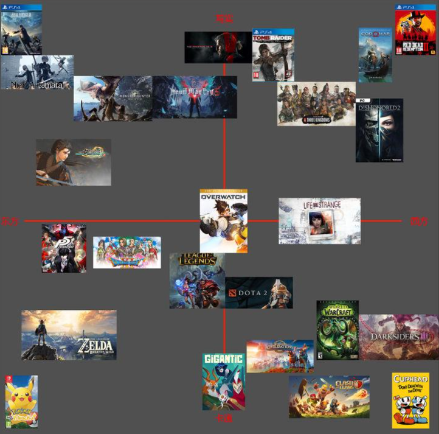
