## 视觉成像

### 视觉系统

人的视觉成像依赖于人体的视觉系统。

> **视觉系统** （英语：visual system）包括感觉器官（眼睛）和中枢神经系统的一部分（视网膜，视神经，视束和视觉皮层），其赋予机体[视觉](https://zh.wikipedia.org/wiki/%E8%A7%86%E8%A7%89 "视觉")以及使几种非图像的光反应功能得以形成。
>
> 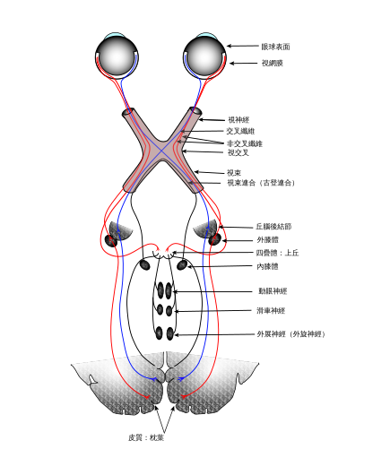

大脑和神经的内容较为晦涩，就着比较重要而且也能看懂的部分，我们来说说视网膜，也就是眼睛。

> 视网膜包含大量的[光感受器](https://zh.wikipedia.org/wiki/%E5%85%89%E6%84%9F%E5%8F%97%E5%99%A8 "光感受器")细胞，这些细胞中含有一种称为[视蛋白](https://zh.wikipedia.org/wiki/%E8%A7%86%E8%9B%8B%E7%99%BD "视蛋白")的[蛋白](https://zh.wikipedia.org/wiki/%E8%9B%8B%E7%99%BD "蛋白")[分子](https://zh.wikipedia.org/wiki/%E5%88%86%E5%AD%90 "分子")。人类有两种视蛋白，[视杆视蛋白](https://zh.wikipedia.org/wiki/%E8%A6%96%E6%A1%BF%E7%B4%B0%E8%83%9E "视杆细胞")和[视锥视蛋白](https://zh.wikipedia.org/wiki/%E8%A7%86%E9%94%A5%E7%BB%86%E8%83%9E "视锥细胞")。视蛋白吸收[光子](https://zh.wikipedia.org/wiki/%E5%85%89%E5%AD%90 "光子")（光粒子）后通过[信号传导通路](https://zh.wikipedia.org/w/index.php?title=%E4%BF%A1%E5%8F%B7%E4%BC%A0%E5%AF%BC%E9%80%9A%E8%B7%AF&action=edit&redlink=1 "信号传导通路（页面不存在）")将信号传递给[细胞](https://zh.wikipedia.org/wiki/%E7%BB%86%E8%83%9E "细胞")，导致光感受器细胞超极化。
>
> 视杆细胞和视锥细胞具有不同的功能。视杆细胞主要存在于视网膜的周边部分，用于在光线很弱的情况下视物。视锥细胞则主要存在于视网膜的中心（或称为[中央凹](https://zh.wikipedia.org/w/index.php?title=%E4%B8%AD%E5%A4%AE%E5%87%B9&action=edit&redlink=1 "中央凹（页面不存在）")）。根据吸收光线[波长](https://zh.wikipedia.org/wiki/%E6%B3%A2%E9%95%BF "波长")的不同可以将视锥细胞分为三类，称为短/蓝、中/绿、长/红视锥细胞。视锥细胞主要用于在正常光强条件下辨别[颜色](https://zh.wikipedia.org/wiki/%E9%A2%9C%E8%89%B2 "颜色")及其他视觉信息 。
>
> 在视网膜中，光感受器细胞突触直接与[双极细胞](https://zh.wikipedia.org/wiki/%E9%9B%99%E6%A5%B5%E7%B4%B0%E8%83%9E "双极细胞")相连，双极细胞突触则与最外层的[节细胞](https://zh.wikipedia.org/wiki/%E8%8A%82%E7%BB%86%E8%83%9E "节细胞")相连，节细胞将[动作电位](https://zh.wikipedia.org/wiki/%E5%8A%A8%E4%BD%9C%E7%94%B5%E4%BD%8D "动作电位")传递到[大脑](https://zh.wikipedia.org/wiki/%E5%A4%A7%E8%84%91 "大脑")。大量的视觉处理过程在这样的一个视网膜[神经元](https://zh.wikipedia.org/wiki/%E7%A5%9E%E7%BB%8F%E5%85%83 "神经元")连接结构中完成。大约有1亿3千万个光感受器接受光信号，然后通过大约120万个节细胞[轴突](https://zh.wikipedia.org/wiki/%E8%BD%B4%E7%AA%81 "轴突")将信息从视网膜传递到大脑。视网膜的处理过程包括形成双极细胞及节细胞的中心-周边[感受野](https://zh.wikipedia.org/wiki/%E6%84%9F%E5%8F%97%E9%87%8E "感受野")，以及从光感受器到双极细胞的信息汇聚和发散。视网膜中的其他细胞，特别是水平细胞和[无长突细胞](https://zh.wikipedia.org/wiki/%E6%97%A0%E9%95%BF%E7%AA%81%E7%BB%86%E8%83%9E "无长突细胞")进行侧向信息传递（从某神经元传递到同层临近的神经元）形成了更加复杂的[感受野](https://zh.wikipedia.org/wiki/%E6%84%9F%E5%8F%97%E9%87%8E "感受野")，例如对[运动](https://zh.wikipedia.org/wiki/%E8%BF%90%E5%8A%A8 "运动")敏感而对颜色不敏感的感受野或者对颜色敏感而对[运动](https://zh.wikipedia.org/wiki/%E8%BF%90%E5%8A%A8 "运动")不敏感的感受野。
>
> 所有这些处理过程的结果由五种不同的节细胞传递到大脑：
>
> 1. M细胞：有大的中心-周边感受野，对[深度](https://zh.wikipedia.org/wiki/%E6%B7%B1%E5%BA%A6 "深度")敏感，对颜色不敏感，对刺激迅速发生适应
> 2. P细胞，有小的中心-周边感受野，对颜色和[形状](https://zh.wikipedia.org/wiki/%E5%BD%A2%E7%8B%80 "形状")敏感
> 3. K细胞，只有非常大的中心感受野，对颜色敏感，对外形和深度不敏感
> 4. 一种具有内在的[光敏](https://zh.wikipedia.org/wiki/%E5%85%89%E6%95%8F "光敏")性
> 5. 最后一种细胞用于眼动

不难看出，人眼就像一个CCD相机，负责把可见光归纳成大脑和神经可以处理的信息。

### 光照与视觉

灯光与物体的反应:吸收、反射和折射

色彩:光照到物体上，物体吸收其他光源色，只反射该颜色光，所以物体

表面呈现该颜色

视觉:该颜色光进入人眼刺激感光细胞，并在视网膜上形成影像。

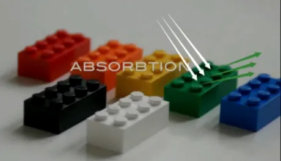

## 甚础灯光

这一块的内容没什么好说的，多用用Unity，靠几个内置的组件的肌肉记忆都知道了。

主要是对于基础光照组合成地形的光照，这部分的审美不是短短一段时间就可以补上来的。

### 环境光

照亮整个场景的常规光线。具有均匀的强度的漫反射光线，亮度一般低于主光。比如阴天，太阳被云层挡住了，但太阳光会在大气中经过无数次的反射和折射形成的光线映入眼帘，仿佛是天空照亮了我们。

游戏中通常使用Cubemap贴图模拟环境光。

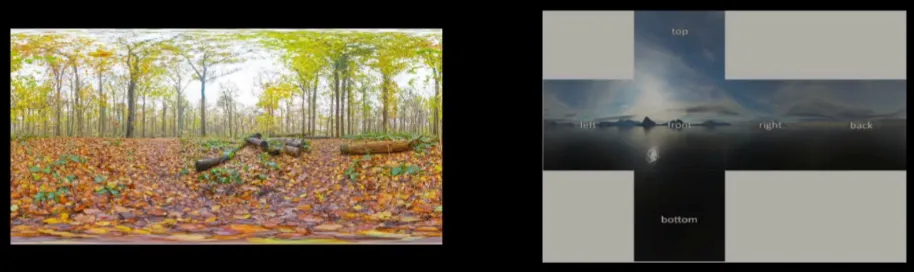

右（cubemap）

### 平行光

类似于自然界中太阳光，能够影响场景的所有物体，其光线互相平行且无衰减，没有真正的光源坐标，位置不会影响其光照效果。

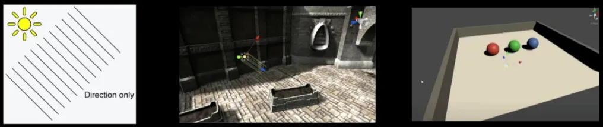

### 点光源

类似灯泡的照明效果，光源向四周发射光线，强度随光源的距离逐渐减小，

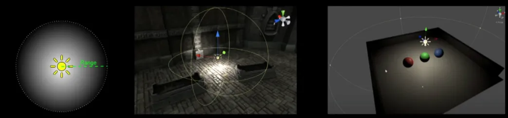

### 聚光灯

类似于手电筒、路灯等照明效果，光源按照一个锥形的范围发射光线，适合强调特定的方向或位置。

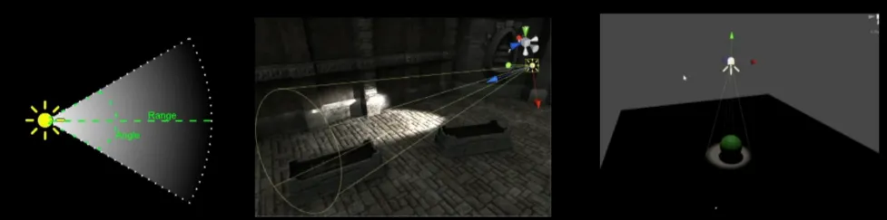

### 区域光

光在所有方向均匀地穿过它们的表面积，但只从矩形的一侧发出，产生带有柔和阴影的漫反射光。仅支持烘焙渲染，模拟例如从窗户照射到房间的室外环境漫反射光线。

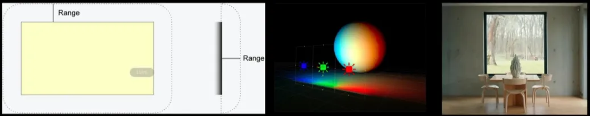

### 自发光

类似于霓虹灯，在物体表面发射漫反射光线，只影响静态物体

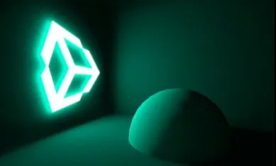

## 反射与阴影

反射：光照射到两种不同介质的分界线上，一部分光改变方向返回原介质的现象叫做光的反射。

### 镜面反射

镜面反射：一束平行光投射到光滑表面的物体时，这束平行光的反射光线也是平行的，这种反射叫做镜面反射。镜面反射遵循光线反射定律，即入射角与反射角相同。

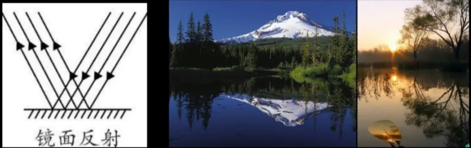

### 漫反射

漫反射：光束投射到微观上具有粗糙表面的的物体，使光线向四面八方进行反射形成柔光的一种现象。

在微观水平上，每条光线都符合光线反射定律，只是在物体宏观表面上观察，光束的反射角度具有多样性。反射后的光线会继续在其他物体表面反射，直至完全吸收。

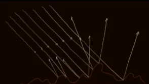

### 阴影

光线被不透明物体遮挡而产生的黑暗范围。阴影可人为分为**直接光阴影**和**漫反射阴影**（环境光遮蔽，AO)

引用一个弹幕的解释:将光线比作子弹，南瓜比作掩体，当只有直接光时，因为南瓜遮挡，阴影区域不会受到子弹攻击;当只有漫反射光照时，离地面和南瓜交界处越近越不易受到子弹攻击;也就意味着越靠近交界处接收到的光线越弱，阴影也就越暗。

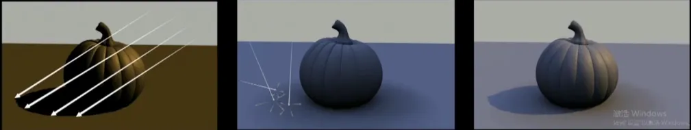

阴影软硬：

- 硬阴影：强化剪影关系，体现结构，增加空间感
- 软阴影：抹去细节，使画面表现柔和，适合女人小孩。

### 环境光遮蔽

在实际光照中，连续的漫反射将光线扩散到空间的各个角落，照亮整个空间;其中物体间相交或靠近的地方的漫反射光线会被遮挡，导致这些地方接收的光线少，形成了环境光遮蔽。

在游戏光照中，通过全局光照来模拟光线在空间中连续的漫反射，但考虑到引擎对光线的反弹次数的限制,物体相交或靠近地方的阴影达不到真实的效果，于是需要单独计算该区域的环境光遮蔽来模拟漫反射阴影，以达到更真实的视觉效果。

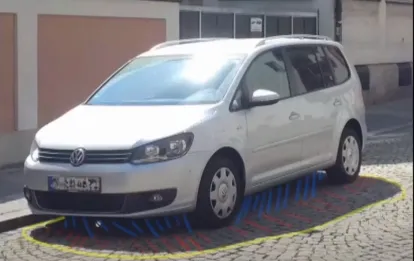

最早的环境遮蔽是从《孤岛惊魂》系列的CryEngine衍生出来的，是一种通过屏幕空间实现的后处理技术（SSAO，屏幕空间环境光遮蔽），不过现在已经有更多更高级的技术，有的甚至可以直接通过GPU进行。

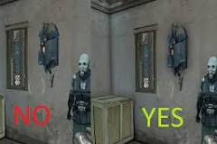

#### AO的应用

1.烘焙到纹理贴图：

获得模型自身AO阴影贴图。相邻模型之间不会产生环境光遮蔽。

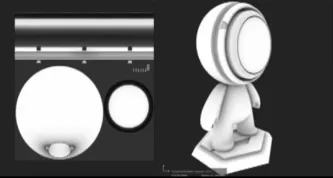

2.烘焙到光照贴图:

可以计算模型自身和模型与模型之间的环境光遮蔽。缺点是光照贴图像素太低，小细节不会被烘焙到光照贴图，因此在常规项目中通常两种一起使用，最大程度的还原现实世界效果。

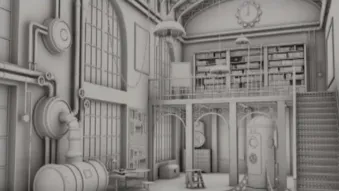

## 光照与色彩

### 色温

色温是照明光学中用丁定义光源颜色的一个物理量。即把黑休加热到一个温度，其发射的光的色与某个光源所发射的光的颜色相同时，这个熙体加热的温度称之为该光源的颜色温度，简称色温。其单位用K(开尔文温度单位）表示。

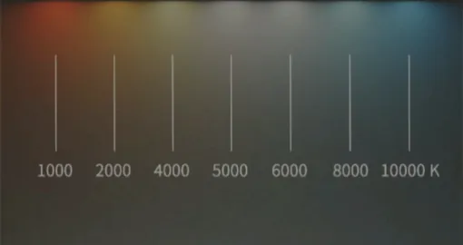

烧红的铁和黄色火焰因为温度不同表现出的颜色变化，符合色温的规律

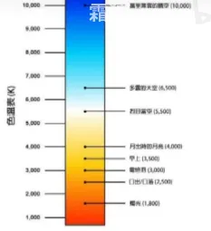

### 光照对明度和饱和度的影响

1.物体吸收其他光原色，只反射某一种光原色

2.光照射到两种不同介质的分界线时，一部分光线改变方向返回原来的介质

收后反射光原色(固定值)

结论:

超过上限的光的所有光原色都会反射，与没超过上限反射的光色混合，使物体表面的颜色呈现明度上升，饱和度降低的现象。

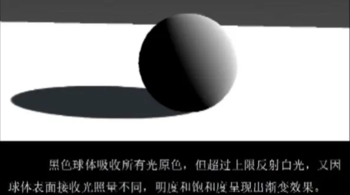

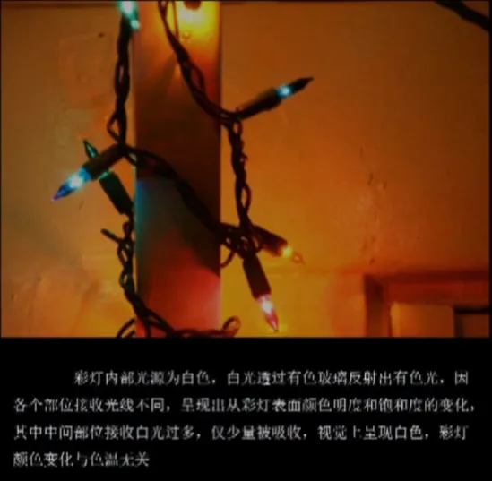

### 光照对色相的影响

《光影色彩理论》中解释了台球和墙体表面由黄到红的色相变化符合色温定律，但根据色温定律,白色光照射在黑色的球体上无法在球体表面产生出白一蓝或者白一黄的颜色变化.

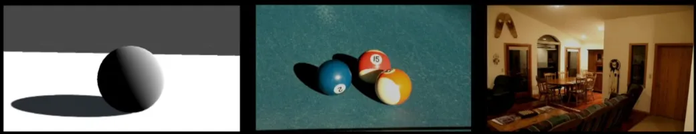

个人解释:

台球场景中的光源为黄色，使红色台球表面混合了光原色

室内场景中远离光源的墙面更多的混合了室内家具反射的红色漫反射光线

结论:

**白光照射在物体上不会带来物体表面色相的变化，即白光照射下物体表面色相不变**

### 天空色彩原理

阳光经过大气层，与大气分子接触发生反射，光波短的光接触更多的大气分子，但因为大气中臭氧层隔绝了大部分的紫外线，又因为人眼对紫色光不敏感，所以天空主要为蓝色。早上和傍晚时分人眼与太阳之间的大气距离远，光波短的蓝色光被隔绝无法到达人眼，所以天空主要呈现光波较长的红色和黄色光;其中一天中太阳颜色由红-黄-白-黄-红的变化也与大气厚度有关。

### 光照与色彩的应用

1.光源为固态忖颜色变化符合色温定律

2.根据明度、饱和度变化对场景中补光光源颜色的进行选择

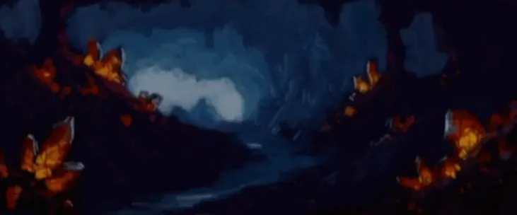

洞穴色彩应用：

水晶为固体，符合色温定律

颜色呈现由黄到红过度;

洞穴主光源为洞外的漫反射光线，光线色相会发生变化，仅改变明度和饱和度。出口的光源颜色为淡蓝色，对洞穴内部进行补光时应选择亮度低、饱和度高的深蓝色。

## 视觉与色彩

### 视觉残像

外部颜色刺激视网膜该颜色感光细胞兴奋，其互补色感光细胞抑制;由于视觉的疲劳，当刺激停止时,该补色的感光细胞开始活跃，于是视觉中产生了原来色的补色。

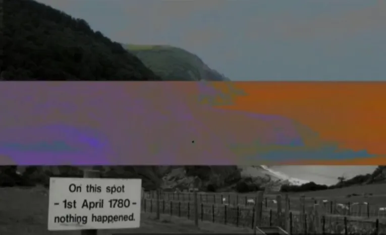

### 同时性效果

两种互补色颜色相邻的部分，互补色的对比现象会更加明显，当视网膜上某一部分发生光刺激反应时，会引越邻近部位的对立反应，在该色周围加强补色的感觉。由于任何颜色总是与其周围的颜色共存，因此现实中几乎每种颜色都处于同时性色彩效果中。

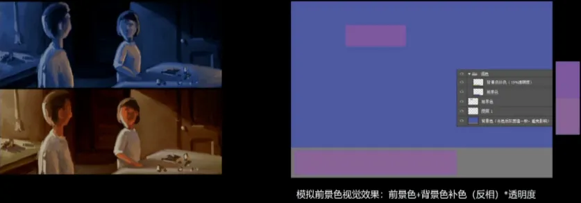

### 互补色平衡原理

视觉残像的现象和同时性的效果，两者都表明了一个值得注意的生理上的事实，即视力需要有相应的补色来对任何特定的色彩进行平衡，如果这种补色没有出现，视力会自动地产生这种补色。

互补色的规则是色彩和谐布局的基础，遵守这种规则便会在视觉中建立精确的平衡。

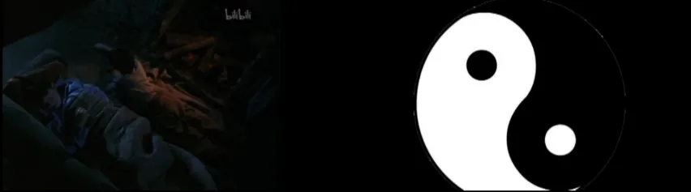
