上一期说到了原画美术的基础，这一期来看看角色原画设计部分。

## 角色设计流程

角色的设计流程大概类似下图：

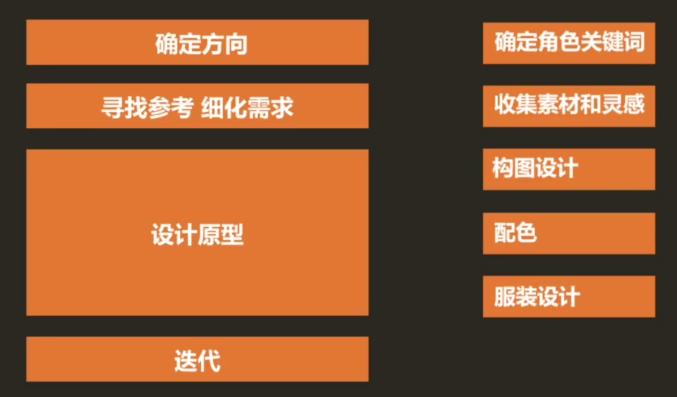

左半部分是大致的管线，右半部分是一些细节步骤。

尤其是在构图设计 -> 配色 -> 服装设计这个过程，是需要经过多轮迭代才能产出最后的成品的。

## 根据角色设计进行衍生

### 确定角色关键词

* 了解角色并找到那些让角色独一无二的关键词
* 世界观、背景、能力、职业、性格、喜好 都可以成为角色的重要标识
* 角色的灵魂：角色的所有组部分都服务于这些关键词

以《守望先锋》中的小美和猎空为例：

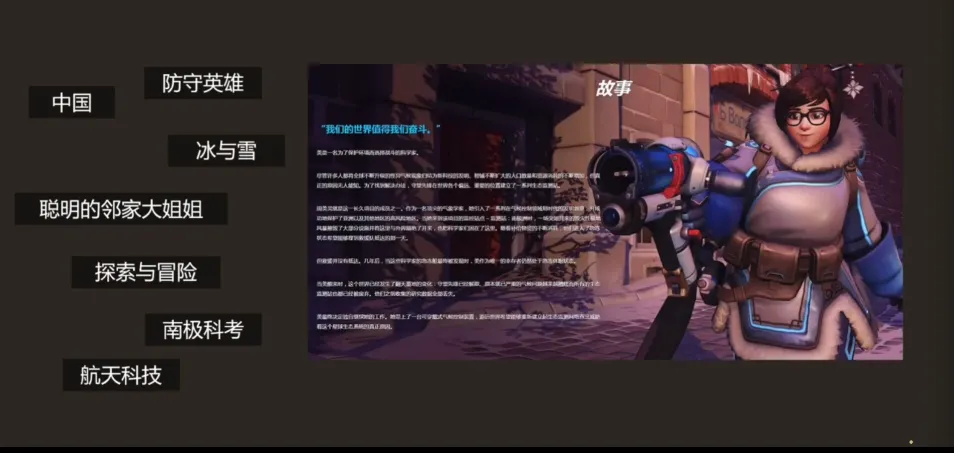

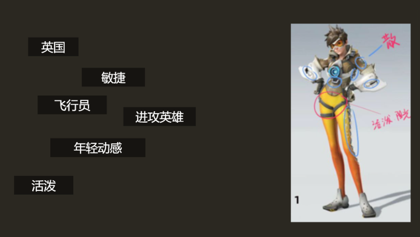

### 收集素材和灵感

* 设计平衡

  * 10%的疯狂 + 90%的经验
    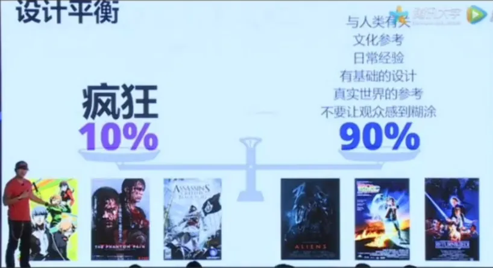
  * 人们总在说“设计语言”，因为设计有时候真的也是一种语言，我们从来都不是创造元素，而是用**已有的元素创造新奇的设计**。
  * 收集素材，发散思维，围绕中心设计点展开更细微的设计，同时搜集素材可以让细节设计更加考究与真实。这是我们要做的事。
* **概念设计**

  * 概念设计是由分析用户需求到生成概念产品的一系列有序的、可组织的、有目标的设计活动组成的，它表现为一个由粗到精、由模糊到清晰、由抽象到具体的不断进化的过程。
  * 概念设计即是利用设计概念并以其为主线贯穿全部设计过程的设计方法。概念设计是完整而全面的设计过程，它通过设计概念将设计者繁复的感性和瞬间思维上升到统一的理性思维从而完成整个设计。
  * 概念设计的过程就是将两个不同的元素合成在一起，例如：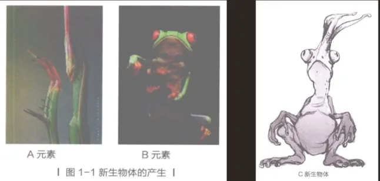
    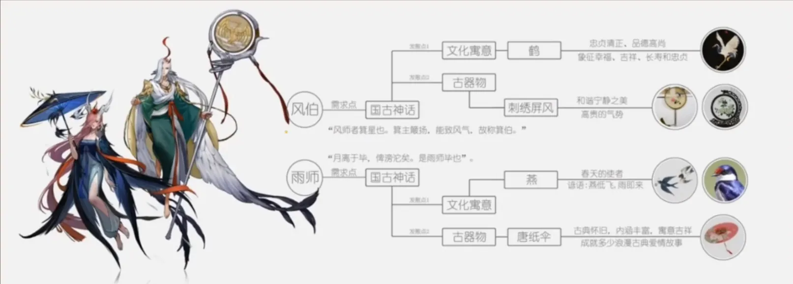
    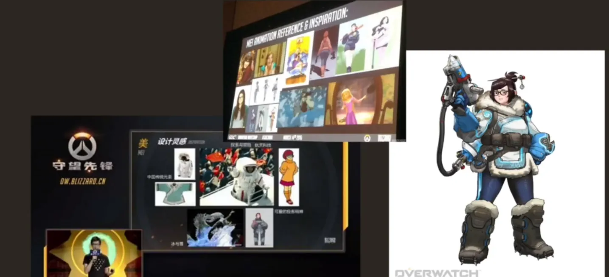

### 构图设计

角色设计里所说的图形感，通常包括：

**构图元素**

基础元素组成了各种构图，不同元素带来不同感受

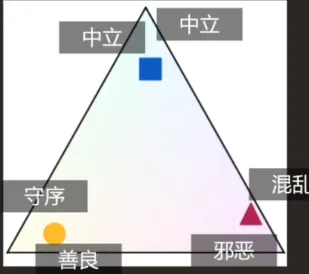

**轮廓剪影**

剪影差异化，强化辨识度，外轮廓越整体流畅，辨识度越高

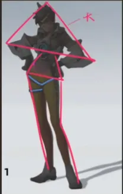
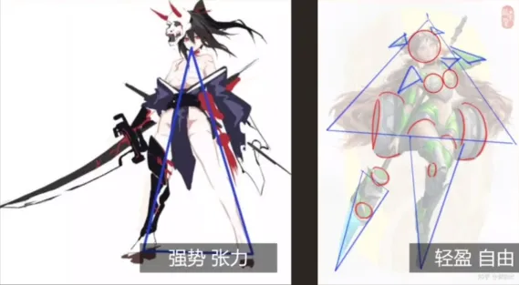
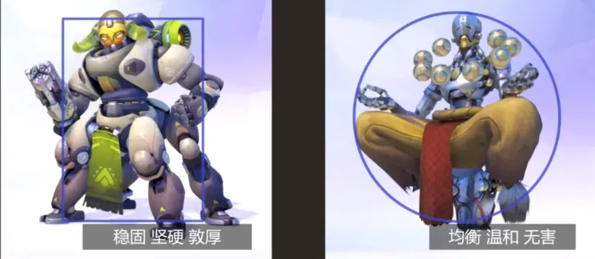

**内在构成**

点构成
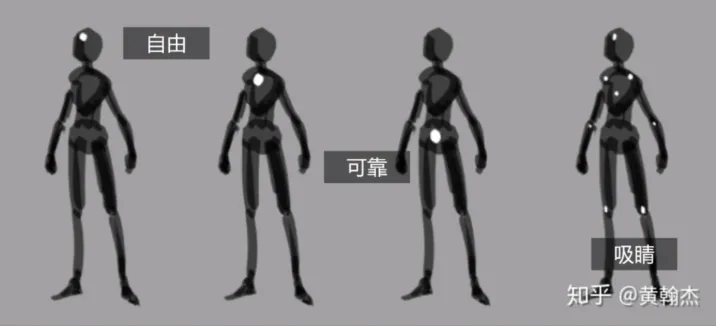

线构成
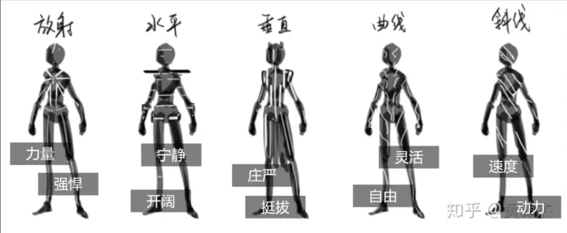

面构成
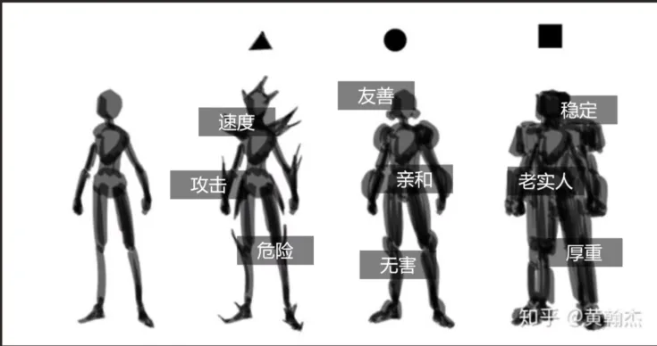

比重构成

轻重 松紧 疏密，简繁对比，辨识度高

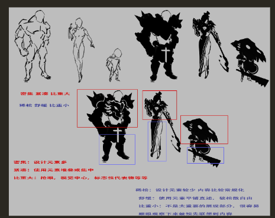

疏密构成

轻重 松紧 疏密，制造反差，诱导视线

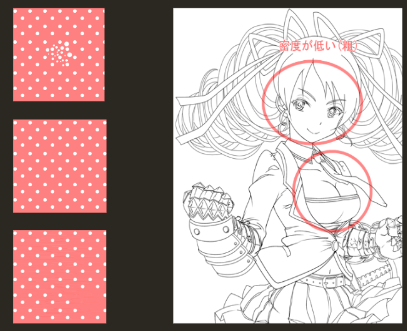

### 配色

整体配色根据风格定调，参考类似风格作品，传达感受

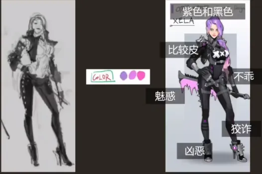

### 服装设计

烘托人物性格，丰富细节信息

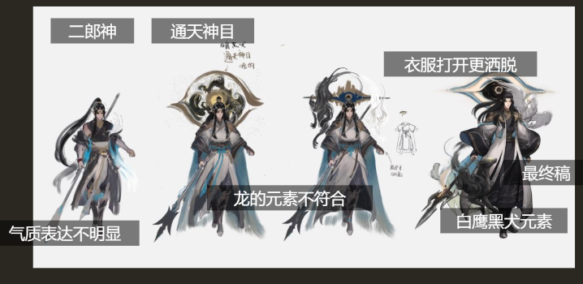

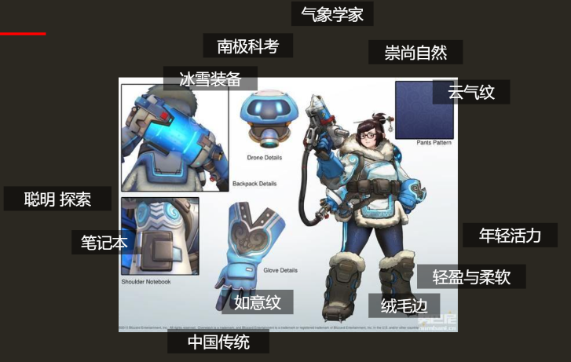

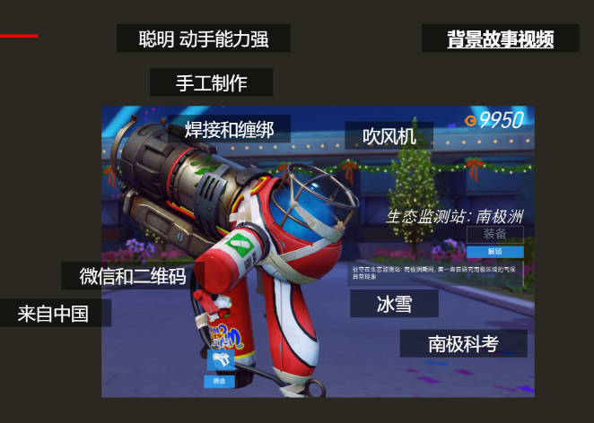

## 案例分析

以《崩坏3》中的 真我之律者爱莉希雅 为例。

### 确定角色关键词

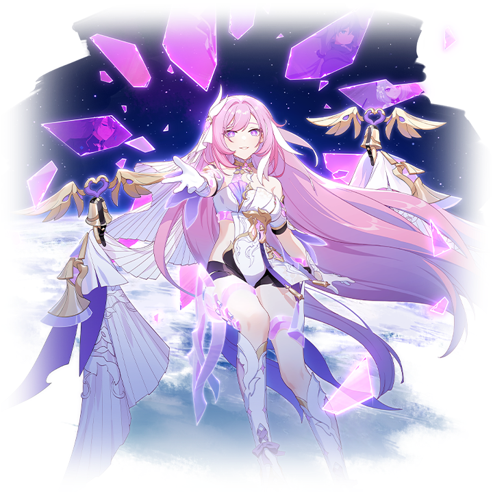

关键词： **无瑕、神性、真诚、人性、希望** 。

* **背景** ：她是前文明时代隶属“逐火之蛾”的融合战士，也是首位支持人类的律者，象征**爱**、**牺牲**与**对人类理想的守护**。
* **性格** ：她真诚、温柔、善良、富有同情心，同时带有一丝**俏皮、热情**，是其他角色的情感支柱。
* **能力** ：通过水晶和崩坏能展现出的纯净、梦幻，象征纯洁与人类的理想。

### 搜索设计灵感和素材

由于角色已经塑造完全，所以这里，我结合自己的见解，对爱莉希雅的设计灵感进行了一些逆向分析。

#### 神话参考

爱莉希雅的名称(Elysia)根植于希腊神话，这也是她气质和体态的一种体现。

Elysia 容易让人联想到 Elysium （极乐净土）。这是希腊神话中为英雄和贤者保留的天堂般的来世。这种联系赋予她神圣、无瑕和永恒之美，与她作为人类希望象征的角色相呼应。

除此之外，爱莉希雅的原始装甲设计，以及早期的剧情刻画下，与希腊爱与美的女神阿佛洛狄忒相得益彰。在她的官方艺术作品中，她常常以温柔的微笑和优雅的姿态出现，这份“美丽”也是对于“美好”“无瑕”这一概念一处具体表征。

#### 自然元素

水晶：水晶是她官方艺术作品中反复出现的主题，装饰着她的装甲与武器，象征着纯洁、力量和清澈。在神秘学传统中，水晶与精神觉醒联系在一起，体现了爱莉希雅作为人类的律者化身的身份，也借此为第十三律者的身份蒙上了一层神秘的面纱。

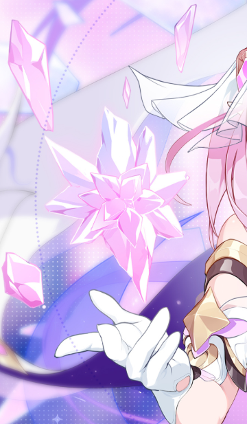

花朵：玫瑰和百合花（似乎是）经常出现在她的艺术作品中，增强了她的优雅气质。玫瑰象征着爱和激情，而百合花则象征着纯洁和新生——两者都与她为人类牺牲和热爱的故事相呼应。

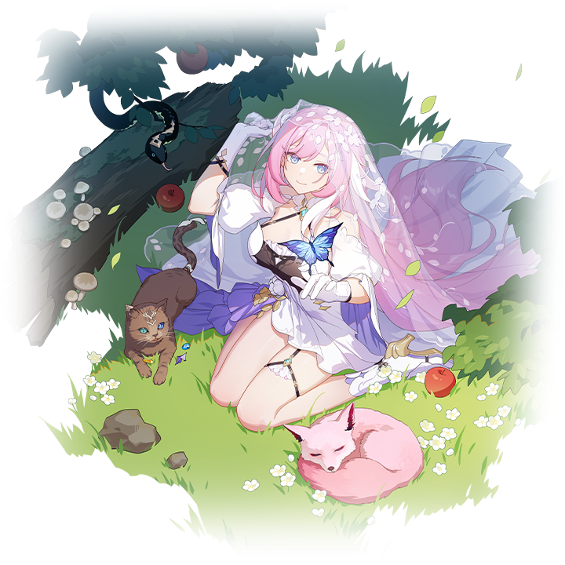

光与色：早期剧情中，紫色的冷色调光影占据了重点；后期剧情中，她的设计却运用柔和的粉色、白色和明亮的色调，让人联想到黎明或黄昏。这种对光的运用象征着希望和重生，强化了她作为美好未来灯塔的叙事，同时也是对于角色身世的一种反差对照。

#### 文哲参考（参考AI）

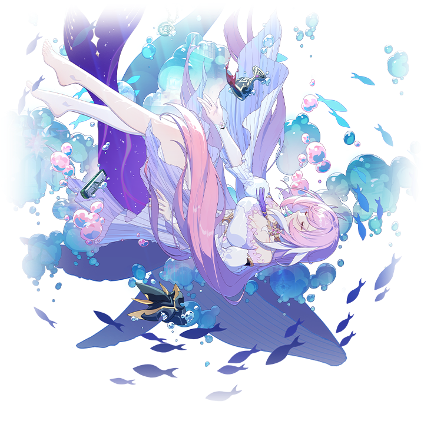

牺牲与人文主义：她作为来自上个时代的融合战士以及首位捍卫人性的律者，其背景故事呼应了**浪漫的牺牲理想**，类似于珀西·雪莱的《解放了的普罗米修斯》。她体现了通过个人牺牲来争取人类进步的斗争。这一点在《崩坏三》的最终章亦有体现。

存在主义反思：作为人类自我的律者，爱莉希雅代表着自我意识和真实性——存在主义的核心信条。她的设计和故事引发人们对人性意义的思考，呼应了萨特等思想家及其对自我定义的关注。

乌托邦愿景：极乐世界的主题将她与乌托邦理想联系在一起，这种文学比喻在托马斯·莫尔的《乌托邦》等作品中有所体现。她的形象反映了人类对理想化、和谐世界的渴望。这也是《崩坏三》一以贯之的理想哲学论调。

### 构图和造型

这部分我们限定某一张图来讲：

首先是轮廓剪影，这一点甚至都不需要我们来画，参考原图背景的圆环：

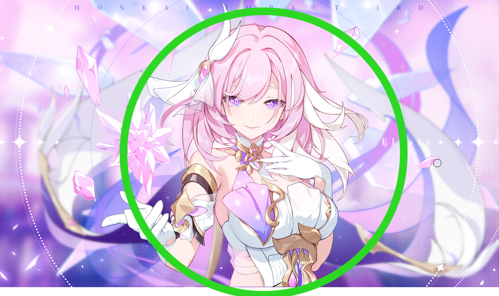

所有构图元素组合得十分和谐，这种正圆形居中的构图，一方面是强化人物的主体性，另一方面是强化了人物的神圣性。除此之外，这种圆形的设计，似乎某种状态下强化了角色的柔软的美感，与水晶的坚硬强大形成了一种恰到好处的中和。

然后我么再来看看细节部分的设计：

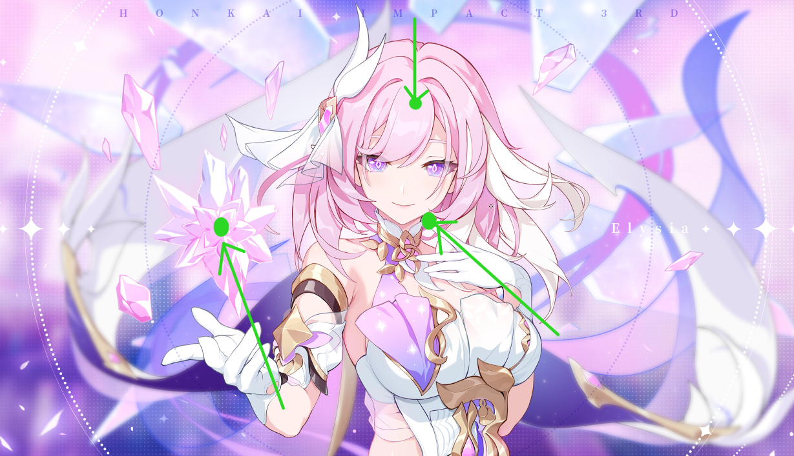

点：整张图的重点来自三个可能的部分，我比较偏向水晶作为焦点，凸显出神圣感。

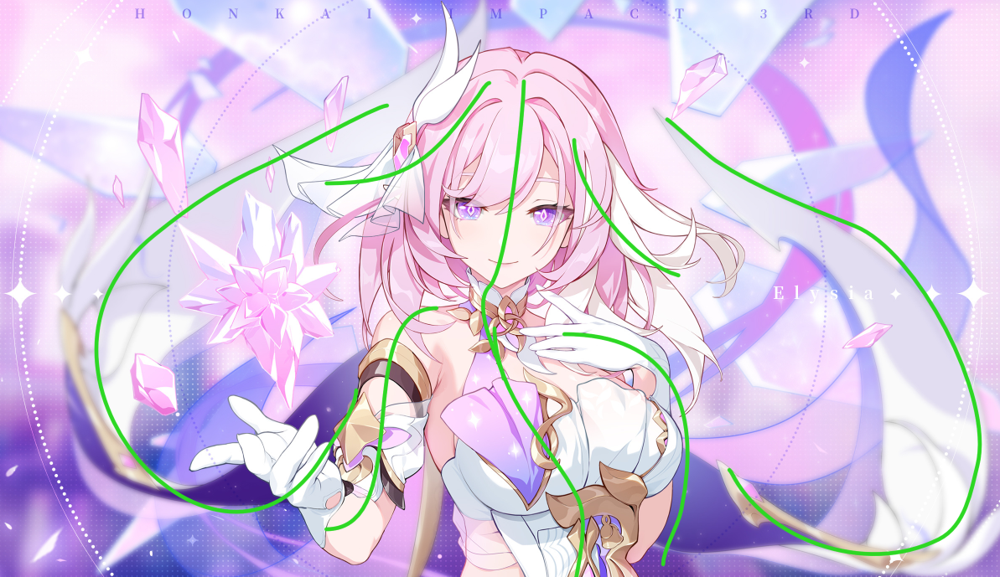

线：头发、身体、丝带的曲线型设计，增添了美感和灵动活泼的感觉。

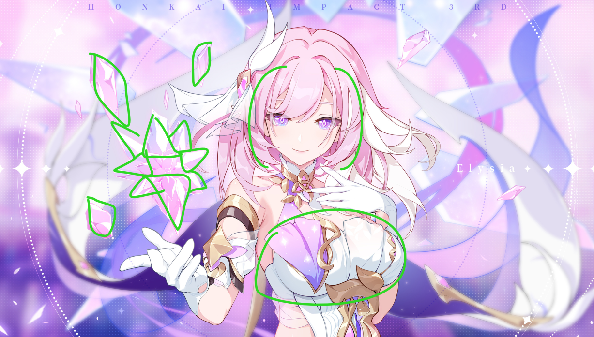

面/比重：裙子的平滑表面与水晶盔甲的复杂细节形成了一种强大与善良的融合，也借助这种“游刃有余”的平滑感衬托了强大的战斗力。

### 配色

* **粉色** ：这是爱莉希雅角色本身的固有设计。
* **金色** **、白色**：服装装饰中的金色，增添高贵与神性。
* **紫色** ：水晶、瞳孔、服饰中的紫色，暗示角色的神秘与崩坏能的力量。

### **服装设计**

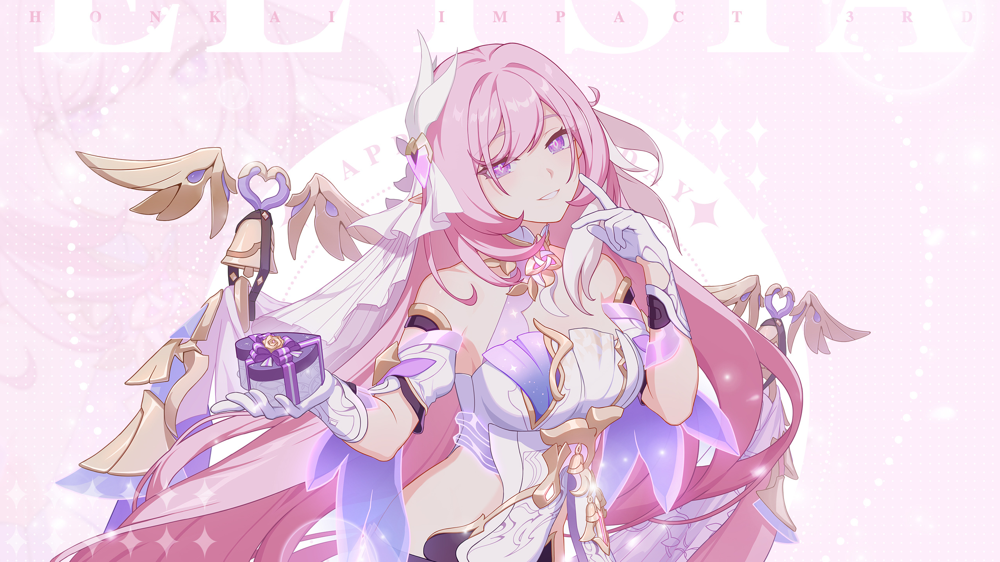

* **裙子与水晶** ：飘逸的白色裙子搭配水晶，展现柔软与坚韧。
* **翅膀与丝带** ：水晶翅膀和飘动的丝带，强化她类似于天使、神的女儿的神性。
* **水晶元素** ：漂浮的水晶既是装饰，也是力量象征。
* **头发** ：粉色长发以波浪形式流动，饰有水晶，增强空灵美感。
* **细节** ：花卉图案体现温柔，水晶的尖锐感则突出力量。
