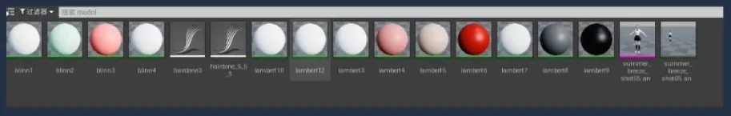
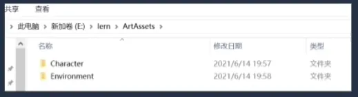
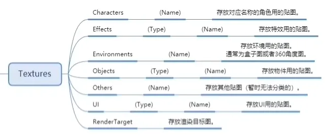
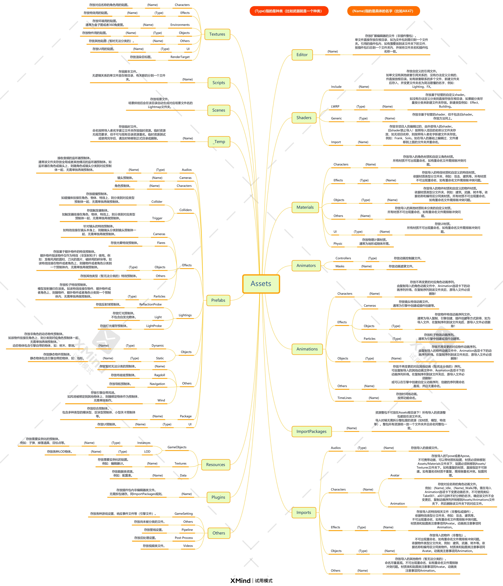
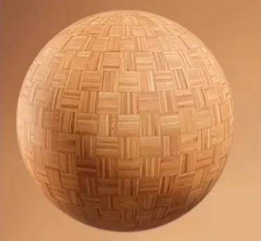
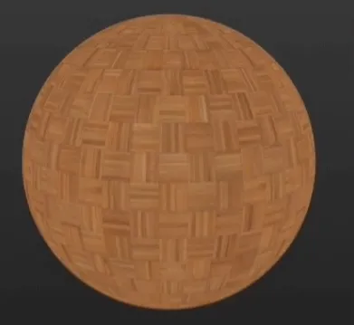
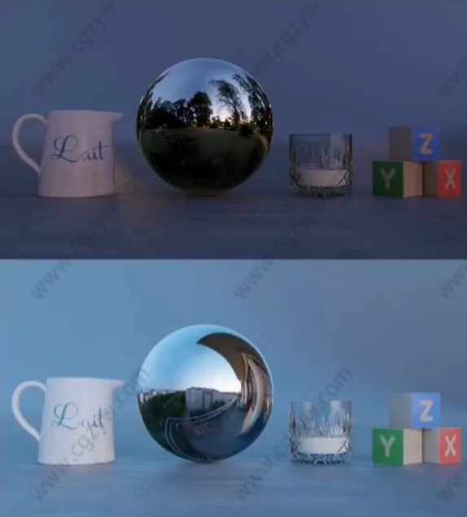
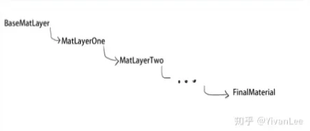
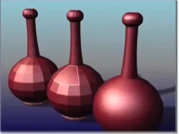

## 资产命名和存储规范

乱放文件会找不到，而且乱命名会给批处理添很大的麻烦，如图

1. 命名都用英文，不然总有奇怪的bug

2. 把模型放入svn等管理平台中相应的资产文件夹内，再导入,方便朔源。并且尽量保持路径和引擎路径一致。

先生成文件，再导入到引擎里面

3. 具体命名因项目而异，但是基本上都大同小异吧。

举个例子：

具体命名方式看项目需求

分享一个大佬的Unity资产命名模式（图有点大，加载可能比较慢）:

Unreal命名可以参考官方文档：[文档链接](https://dev.epicgames.com/documentation/zh-cn/unreal-engine/recommended-asset-naming-conventions-in-unreal-engine-projects)

## 材质资产制作环境规范

1.PBR流程的贴图上不会储存光影信息

2.光与环境和后处理对材质影响极大

3.SP里统一制作环境：

- 光照差别

- 曝光差别

- Shader差别

- 后期差别，包括Tonemapping

- 贴图差别，如压缩，filter，mip等

4.三个不同光比的主要制作光照环境

通用要求:

亮度适中，曝光稳定。（辅助辨识固有色)

中低光比:

1. 光影必须无色趋向。（规范固有色)

2. 没有过强的明暗对比。(辅助辨识pbr材质)

高光比:

1. 某几个方向带有较强的光源。(辅助辨识光滑度和法线)

2. 镜面反射变化丰富。(辅助辨识金属度)

标准环境里还可以增加

1. 几个辅助检验光照环境，比如阴天，晴天，室外，室内，夏季冬季。等辅助光照情景
2. 现实校色，如果有需要的话可以使用现实拍摄的色卡对引擎里的标准环境进行校色
3. 或者更多——由美术提需求

## 材质相关规范

1. 材质参数尽量定死(除了贴图)，方便合批和效果统一。如果没定死也可以合，就是很麻烦

2. 如果材质需要调试，可以连一个测试材质函数到母材质，但是最后得把Switch开关关掉，美术测试完效果后，再把参数合入写死参数的shader。版本构建前，检查—波，如果有勾上的就给美术报个错。

### 混合模式：

材质尽量使用不透明，其次mask材质，最后再考虑半透明

因为半透材质默认无投影，还会乱序得再付出其他计算去解决，性能消耗也比较高。mask材质在手机里消耗和半透明其实差不多，但是不会有乱序等问题

:::tip

可以用阿尔发抖动模拟半透明

[https://zhuanlan.zhihu.com/p/72153625](https://zhuanlan.zhihu.com/p/72153625)

:::

如果一个物体只有部分透明，如果没有特殊情况请把他们的材质分开.

### 植被材质：

树叶和草，最好不要烘焙光照。因为会坑坑洼洼的，还占内存，美术还会觉得不透气

树制作完球形法线后

自己写一个特殊的光照模型，再到外部烘AO图进来用(只针对手游)

草把法线掰向上后，也是同理

自己写一个特殊的光照模型，再到外部烘AO图进来用(只针对手游)

### 贴图通道合并和大小统一

引擎采图有限，包体大小问题

1. 动态物体

采样:3张PBR贴图+Shadowmap

贴图大小: Albedo 2048/1024,normal+Smoothness1024, AO+metallic+其他5122

2. 静态物体

采样:2张PBR贴图+烘焙好的Shadowmap+Shadowmap

贴图大小:

Albedo2048,normal+Smoothness2048, AO+ metallic+其他1024+烘焙的Shadowmap2048

3. 素材内容与格式标准

Abedo（+透明度）占RGB (A)，Normal占RG+smoothness占B，AO占R+metallic占B，G备用，格式使用TGA

### 贴图通道合并和大小统一:

法线第三个通道可以由前两个反推

### 逻辑模块化：

把材质上层的逻辑模块化，我们最后的材质使这些模块的叠加总和，而不是胡乱连一大片材质节点。非常方便后期维护，和新人学习。

## 模型规范

### 布线合理性：

1. 应顺应模型拓扑结构，网格尽量大小均匀，不然模型绑定时候权重不好刷，而且形变会很奇怪，尽量参照大佬的拓扑结构

2. 不要出现重合的点，(最常见的麻烦是会导致在ue4里刷不了布料)，而且占用没必要的资源

3.四个点需要一个平面内，不然转三角面的时候，可能会出现自己不想要的结果。

4.避免三边面和多边面的产生，还是会影响绑定和形变。5.控制面数，会占用没必要的资源

### UV展开的合理性

1. 提高空间利用率

2. 尽量把大块的面缝在一起，不要让UV看起来太过零散，因为UV的接缝处在贴图后也会有断开的效果，要尽量避免接缝，或者把缝藏在模型背面等不显眼的地方。

3. 尽量减少2D图像的扭曲，让其符合3D模型的规律，扭曲的UV会让贴图也产生扭曲的效果。有的扭曲不可避免，一定范围内的扭曲也可以忽略。

4. 大部分将uv拉直，可以进一步的提高空间利用率，但是如果会导致图像过分扭曲，可以不拉直

5. 合理地放置UV，利用重合的UV（完全相同的或者镜像的部位），可以提高贴图的利用效率。例如我们在UV展开一个人物模型时，我们可以把左右手脚UV重合放在一个地方，让更重要的位置（例如脸）拥有更多贴图像素面积。

6. 针对光照UV，不能堆叠,收光复杂度高的地方，摄像机经常看到的地方，尽量给多一些面积配比。如果分配的分辨率预算很小，硬边很多时候都得尽量切开，以防渗透色。

总的来说:提高贴图利用率，和减少接缝和拉伸

### 光滑组（软硬边）与法线：

1. 常用函数有介绍光滑组（软硬边），所以这里着重介绍在模型中体现效果，大于45°效果光滑组单个与2个光滑组下效果对比。
2. 硬边点有所接面数的法线，软边只有一个法线，所以平时才材质里做顶点动画的时候，得注意，不然会断边
3. 对于一些二次元模型有修改了法线的，导入模型的时候记得点选导入法线，而不是自动生成。

### 模型动画导出：

一般是TA根据项目规定好的

一般步骤是:

首先Presets-CurrentPreset还原默认

之后Geometry勾选SmoothGroup和Tangents and Binormals 选项
