今天我们接着来说说GPU的几何阶段。

GPU渲染管线由许多步骤组成，比如 **顶点处理** **、** **图元装配及光栅化** **、** **片元处理** **、输出合并**等。


## GPU阶段(几何阶段部分)

几何阶段在GPU上运行，它处理应用阶段发送的渲染图元，负责大部分的逐三角性和逐顶点操作。几何阶段的一个重要任务就是把顶点坐标变换到屏幕空间中 ，再交给光栅器进行处理。通过对输入的渲染图元进行多步处理后，这一阶段将会输出屏幕空间的二维顶点坐标、每个顶点对应的深度值、着色等相关信息，并传递给光栅化阶段。

几何阶段可以细分为4个子阶段： **顶点着色阶段(Vertex Shading)** ， **投影阶段(Projection)** ， **裁剪阶段(Clipping)** 和 **屏幕映射阶段(Screen Mapping)** 。

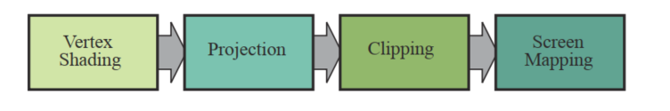

我们不会按照阶段来介绍，而是顺着阶段，把每一块都理清。

### 顶点处理

#### 顶点着色器（Vertex Shader）

顶点着色器的处理单位是顶点，也就是说，输入进来的 **每个顶点都会调用一次顶点着色器** **。**它主要执行**坐标转换**和**逐顶点着色**的任务。

 坐标转换是将顶点坐标从模型空间转换到齐次裁剪空间中 ，它是通过MVP(Model、View、Projection)转换得到的。

> ·Model 矩阵 ： 用于施加世界变换，将一个“快递盒子”里的模型拿出来，摆到场景中。
>
> ·View 矩阵：处于对裁剪的考虑，将整个世界进行移动（所以才要对每个顶点施加变换），永远保证**相机/观察视**口位于原点。
>
> ·Projection 矩阵：一般我们会使用类似绘画创作的透视作图来渲染一幅画面，Projection矩阵用于将整个相机录入的空间（视图空间）“拍”到相机的一个二维平面上（正交投影）。但是为了考虑透视，我们的整个观察的区间并不是四棱柱，而是一个类似棱台的形状，此时需要把较远的一段压扁，变成一个四棱柱，再“拍”到二维上（透视投影）。

咱们先来看看理论：

我们从建模工具得到的是物体的局部坐标(Local Coordinate)，就好像把手办装到一个快递盒子；局部坐标通过模型矩阵Model变换到世界坐标(World Coordinate)，把手办从盒子里拿出来，摆放到场景中；世界坐标通过观察矩阵View变换到观察坐标(View Coordinate)；观察坐标经过投影矩阵Projection变换到裁剪坐标(Clip Coordinate)；裁剪坐标经过透射除法(Perspective Division)得到标准设备空间(Normalized Device Coordinates，NDC)；NDC坐标通过视口变换(Viewport Transformation)变换到窗口坐标进行显示。


光照计算一般都是在世界空间进行的，所以输入的顶点坐标需要通过乘以模型矩阵变换到世界空间。如果物体变换有非均匀缩放，那么在变换法线时就要注意了。我们不能简单的通过乘以模型矩阵来将法线变换到世界空间。下图展示了法线变换可能产生的问题。如果只是存在平移变换(Translation)我们无需对法线进行变换；如果只存在平移和旋转变换(Rotation)我们只需要乘上渲染矩阵；如果存在非均匀缩放变换(Scaling)我们需要使用矩阵的逆的转置来变换法线。关于该过程的推导可以参考[OpenGL Normal VectorTransformation](v)这篇文章。


虚拟摄像机定义了我们的观察空间。世界空间和观察空间的关系如下所示，虚拟摄像机的位置是坐标的原点，观察方向沿着Z轴的负方向。我们可以通过摄像机的位置EyePosition、观察目标点FocusPosition和向上的方向向量UpDirection来构建观察矩阵。OpenGL和DIrectX都有对应的API。该方法的实现比较简单，只需要通过两次向量的叉乘就可以构建该矩阵。


介绍裁剪空间之前，我们需要先来看一个重要的概念：视椎体(Frustum)。视椎体可以通过
上下左右远近六个平面来定义。我们通过投影矩阵将物体从观察空间变换到裁剪空间，裁
剪空间是一个以原点为中心的立方体，不在该裁剪空间的图元都会被裁剪。根据投影方式
的不一样，我们可以定义不同的投影矩阵，常见的投影方法有：正交投影和透视投影。两
种不同投影对应的视椎体如下图所示。我们可以看到正交投影的视椎体是长方体，而透视
投影的视椎体是台体。我们可以通过近平面(Near)、远平面(Far)、垂直视场角(Vertical
Field of View， FOV)和屏幕纵横比(Aspect Ratio，也叫作屏幕宽高比)四个参数来定义视
椎体。


视椎体参数可以这样计算：

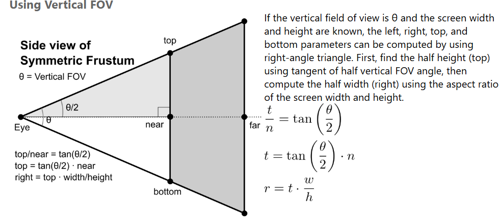

当然，代码是少不了的：

```cpp
// View 矩阵构造
Eigen::Matrix4f get_view_matrix(Eigen::Vector3f eye_pos)
{
    Eigen::Matrix4f view = Eigen::Matrix4f::Identity();

    Eigen::Matrix4f translate;
    translate << 1, 0, 0, -eye_pos[0], 0, 1, 0, -eye_pos[1], 0, 0, 1,
        -eye_pos[2], 0, 0, 0, 1;

    view = translate * view;

    return view;
}

// model矩阵构造
Eigen::Matrix4f get_model_matrix(float rotation_angle)
{
    Eigen::Matrix4f model = Eigen::Matrix4f::Identity();

    float angle = rotation_angle * MY_PI / 180.0f;
    Eigen::Matrix4f rotation;
    rotation << cos(angle), -sin(angle), 0, 0,
        sin(angle), cos(angle), 0, 0,
        0, 0, 1, 0,
        0, 0, 0, 1;

    model = rotation * model;
    return model;
}

// projection 矩阵构造（透视变换）
Eigen::Matrix4f get_projection_matrix(float eye_fov, float aspect_ratio,
                                      float zNear, float zFar)
{
    Eigen::Matrix4f projection = Eigen::Matrix4f::Identity();

    Eigen::Matrix4f persp_to_ortho, ortho_scale, ortho_translate;
    float t = tan(eye_fov / 2.0f * MY_PI / 180.0f) * zNear;
    float r = t * aspect_ratio;
    float l = -r;
    float b = -t;
    float n = zNear;
    float f = zFar;

    // 透视空间压缩到正交空间
    persp_to_ortho << n, 0, 0, 0,
        0, n, 0, 0,
        0, 0, f + n, -f * n,
        0, 0, 1, 0;

    // 正交变换放缩到[-1,1]的裁剪空间
    ortho_scale << 2 / (r - l), 0, 0, 0,
        0, 2 / (t - b), 0, 0,
        0, 0, 2 / (n - f), 0,
        0, 0, 0, 1;

    // 正交变换Cube移到原点
    ortho_translate << 1, 0, 0, -(r + l) / 2,
        0, 1, 0, -(t + b) / 2,
        0, 0, 1, -(n + f) / 2,
        0, 0, 0, 1;

    projection = ortho_scale * ortho_translate * persp_to_ortho * projection;

    return projection;
}
```

看不懂数学公式？没关系，接下来我会给出解释。

**正交投影：**

正交投影又叫平行投影。投影视椎体是一个长方体，物体在投影平面的大小与距离远近没有关系。在OpenGL中我们可以通过 `glm:ortho() `这个函数来创建一个正交投影矩阵。正交投影其实是使用如下的 `GL_PROJECTION`矩阵进行变换。其中，变量r、l、t、b、n和f是视椎体的上下左右远近平面的边界变量。通过正交矩阵变换后，我们得到了裁剪空间。建筑蓝图绘制和计算机辅助设计需要使用到正交投影，因为这些行业要求投影后的物体尺寸及相互间的角度不变，以便施工或制造时物体比例大小正确。正交投影的示意图如前面右图所示。


**透视投影：**

根据我们的生活经验我们会发现这样的现象，离你越远的物体看起来越小，随着距离的增大，最终会消失在视野中，成为灭点。为了实现这种近大远小的效果，我们需要引入透视投影。在OpenGL中我们可以通过 `glm:perspective()` 这个函数来创建一个透视投影矩阵。投影变换使用的是齐次坐标，因为在透视除法阶段需要将XYZ的值除以W分量来获取NDC坐标空间。透视除法可以实现近大远小的视觉效果，该过程由硬件自动执行。这也是正交变换和透视变换最主要的区别，我们在后面会进行具体讨论。下图所示的矩阵是透视投影矩阵，和正交投影一样都是用来进行坐标空间变换的。


至于逐顶点着色，也叫高洛德着色(Gouraud Shading)，得到的光照结果比较不自然，所以一般是在片元着色器中进行光照计算（使用Phong着色）。在此不作过多解释，后面集中阐述。

#### 曲面细分着色器

这是一个可选的着色器，主要是对三角面进行细分，以此来增加物体表面的三角面的数量。借助它可以实现细节层次(`LOD,Level-of-Detail`)的机制，使得离摄像机越近的物体具有更加丰富的细节，而远离摄像机的物体具有较少的细节，如下图所示。


曲面细分是利用镶嵌化处理技术对三角面进行细分，以此来增加物体表面的三角面的数量，是渲染管线一个可选的阶段。它由**外壳着色器(Hull Shader)、镶嵌器(Tessellator)和域着色器(Domain Shader)**构成。

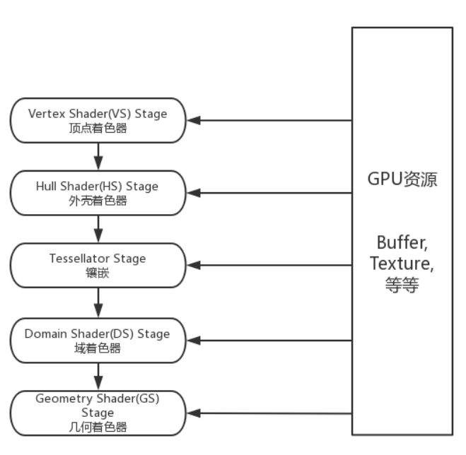

我们不创建**高模(high-poly)**来丰富网格信息主要是考虑到以下几个原因：

1. 基于GPU可以实现动态的LOD技术，可以根据物体距离摄像机的远近来调整多边形网格的细节，比如说，若物体距离摄像机比较远，则按照高模的规格对它进行渲染会造成浪费，因为我们根本看不清网格的所有具体细节。随着物体和摄像机之间距离的拉近，我们可以实现连续镶嵌化处理，增加物体的细节。
2. 节省内存。我们可以在各种存储器中保存低模网格信息，再根据需求用GPU动态地增加物体表面的细节。

#### 几何着色器

**几何着色器(Geometry Shader)**也属于渲染管线的一个可选阶段，位于曲面细分(Tessellation)和光栅化(Rasterization)之间。顶点着色器以顶点数据作为输入数据，而几何着色器则以完整的图元(Primitive)作为输入数据。例如，以三角形的三个顶点作为输入，然后输出对应的图元。与顶点着色器不能销毁或创建顶点不同，几何着色器的主要亮点就是**可以创建或销毁几何图元**，此功能让GPU可以实现一些有趣的效果。例如，根据输入图元类型扩展为一个或更多其他类型的图元，或者不输出任何图元。需要注意的是，几何着色器的输出图元不一定和输入图元相同。几何着色器的一个拿手好戏就是将一个点扩展为一个四边形(即两个三角形)。

几何着色器输出的图元由顶点列表定义而成，而且顶点必须变换到裁剪空间。也就是说，
经过几何着色器处理后，得到的是一系列位于齐次裁剪空间的顶点所组成的图元。这些顶
点会在后面的裁剪、透视除法和光栅化阶段得到进一步处理。

几何着色器的一个主要的应用是**显示物体的法线**，这对于光照效果的调试非常有帮助。我们首先在不使用几何着色器的情况下正常渲染一次场景；然后开启几何着色器第二次渲染场景，送到几何着色器的是三角形图元，我们为其每个顶点生成一个法线向量。这样的效果类似于给表皮生成毛发，事实上，的确有比较老的游戏中，采用了此种方式生成密集的几何图形。

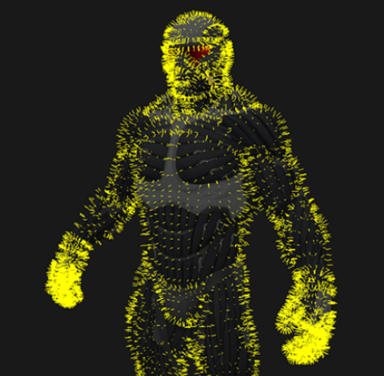

接下来我们看下几何着色器的另一个应用：**动态几何体形成**。我们利用几何着色器也可以实
现物体的LOD技术 (Level of Detail)。比如，我们需要在游戏中绘制一个圆圈，那么我们
可以根据距离摄像机的远近来调整圆圈的顶点数目，充分利用显卡的性能。

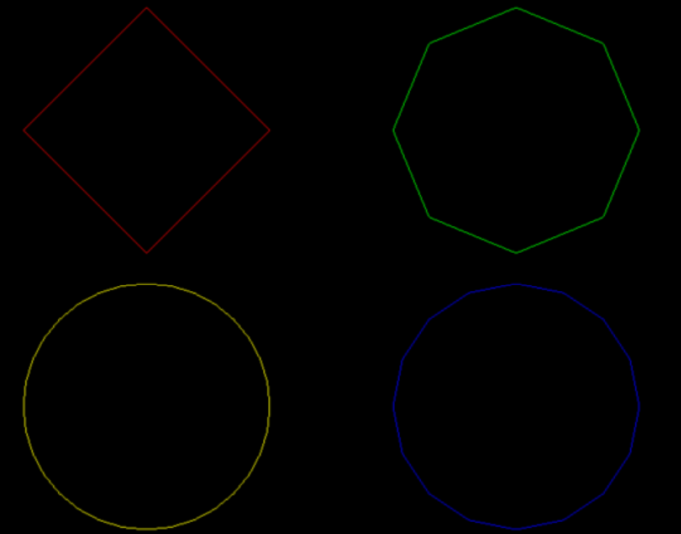

最后来说说最著名的BillBoard（告示牌）技术，公告牌技术就是以3D树木图片的四边形来代替3D树的渲染的技术。我们可以使公告牌总是面向摄像机，这样从远处看过去，公告牌不容易露出破绽，一个显著的应用就是《弹丸论破》的角色立绘。


### 图元组装(Primitive Assembly)

#### 裁剪（Clipping）

经过顶点处理阶段，我们已经知道了顶点在裁剪空间的位置，接下来可以在裁剪空间中进行裁剪、背面剔除、屏幕映射等操作。

只有当图元部分或全部位于视椎体内时，我们才会将它送到流水线的下个阶段，也就是光栅化阶段。而完全位于视椎体外部的图元会被裁剪掉，不会对它们进行渲染。一些图元，它可能一部分位于摄像机视野内，另一部分在摄像机视野外部，外面这部分不需要进行渲染,可以将它裁剪掉。 例如，线段的两个顶点一个位于视椎体内而另一个位于视椎体外，那么位于外部的顶点将被裁剪掉，而且在**视椎体与线段的交界处产生新的顶点**来代替视野外部的顶点（在裁剪空间中进行）。

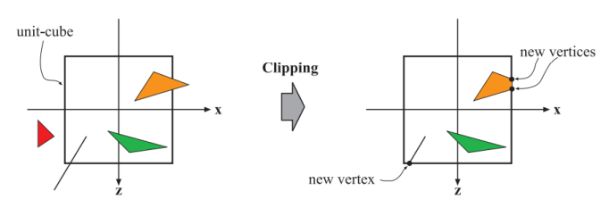

裁剪阶段使用的是4-分量的齐次坐标，在裁剪空间的基础上，进行 **透视除法** `(perspective division)`后得到的坐标叫做归一化设备坐标(Normalized Device Coordinates，NDC)，将坐标从裁剪空间的(-w,-w,w)变换为(-1,-1,1)，即除 w，获得NDC坐标是为了实现屏幕坐标的转换与硬件无关。然后通过视口变换将NDC坐标变换到屏幕坐标，我们会在下面的屏幕映射具体讨论这两个部分。

**不同图形API的NDC空间的z分量不同**。在DirectX中，NDC空间的X和Y分量的范围是[-1, 1]，而Z分量的范围是[0, 1]。而在OpenGL中，NDC空间的X、Y和Z分量的范围都是[-1, 1]。

常见的裁剪算法：
·[Cohen-Sutherland算法](https://zh.wikipedia.org/zh-hans/%E7%A7%91%E6%81%A9-%E8%90%A8%E7%91%9F%E5%85%B0%E7%AE%97%E6%B3%95)
·[Liang-Barsky算法](https://zh.wikipedia.org/wiki/%E6%A2%81%E5%8F%8B%E6%A0%8B-%E6%9F%8F%E4%B8%96%E5%A5%87%E7%AE%97%E6%B3%95)
·[Sutherland-Hodgman多边形裁剪算法](https://en.wikipedia.org/wiki/Sutherland%E2%80%93Hodgman_algorithm)

#### 背面剔除(Back-Face Culling)

即**背对摄像机的三角面剔除**，上面我们讲到过模型数据中含有索引列表，列表中的三个点组成一个三角片，如果这三个点是顺时针排列的，认为是背面，否则认为是正面。

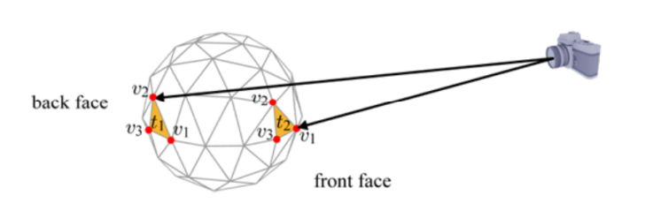

如下图所以，图元t1背向摄像机，需要被剔除，而图元t2需要被保留。我们利用三角形顶点的环绕顺序(Winding Order)来确定所谓的正面(front-face)和背面(back-face)。通常情况下，三角形的3个顶点是逆时针顺序(couter-clockwise，ccw)进行排列时，我们会认为是正面，而顺时针(clockwise，cw)排序时，我们会认为是背面。例如t2的三个顶点顺序为逆时针的(v1，v2，v3)，所以是正面，需要保留。将t1和t2投影到XY平面后，我们可以清楚的看到它们顶点的环绕顺序。

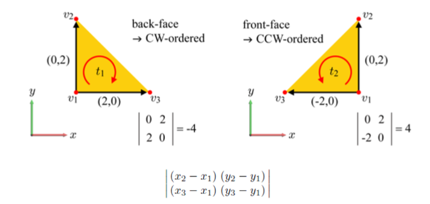

从上图可以看到，这里我们可以使用行列式(determinant)来确定投影后的2D三角形到底是CW还是CCW顺序。行列式的第一行由顶点v1和v2坐标确定，而第二行由顶点v1和v3坐标确定。如果行列式的值为负数，那么该三角面是背面朝向；如果为正数，则是正面朝向。

背面剔除的技术默认是不开启的。我们可以通过 `glEnable(GL_CULL_FACE)` 函数来开启背面剔除的优化。开启后，我们还可以通过glCullFace() 函数来配置剔除的是正面还是背面。参数为 `GL_FRONT` 、`GL_BACK` (默认值)和 `GL_FRONT_AND_BACK` 。

:::warning

虽然背面剔除可以大概减少50%的渲染图元，但是在渲染半透明或不透明物体时，不能使用该技术，否则会出现穿帮的情况，因为半透明或不透明物体可以看到物体背后的东西。

:::

#### 屏幕映射(Screen Mapping)

**屏幕映射（ScreenMapping）**的任务是把每个图元的x和y坐标转换到屏幕坐标系（Screen Coordinates）下。屏幕坐标系是一个二维坐标系，它和我们用于显示画面的分辨率有很大关系。

从前面讨论的顶点变换我们知道：经过模型矩阵Model、观察矩阵View和投影矩阵Projection变换后，局部空间被变换到了裁剪空间(`-Wc <= XYZ <= Wc`)。

接下来，我们对向量除以w，进行齐次化的归一，我们可以得到标准设备空间，该空间一般也称作标准视体(Canonical View Volume，CVV)。这个行为我们称作**透视除法 (Perspective Division)**

执行透视除法是为了实现透射投影中近大远小的视觉效果，经过了投影矩阵Projection的变换后，W分量保留了观察空间中物体Z坐标的信息，所以透视除法才能够根据距离摄像机的远近正确实现透视效果。

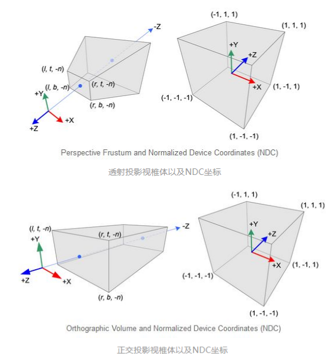

:::note

事实上，在硬件GPU层面上，透视除法在正交投影和透视投影中都会被执行，只不过正交投影变换并没有改变W分量的值(W分量的值仍是1)，所以透视除法并没有实际的效果。我们从这里也明白了使用**齐次坐标**的意义，其实就是为了正确记录下投影变换前(观察空间)中物体的深度信息，也就是Z坐标的值。至于为什么要记录，敬请期待后面的深度测试部分吧~

:::

最后为了转换到屏幕坐标空间，我们首先应用一下视口变换（Viewport Transform）：

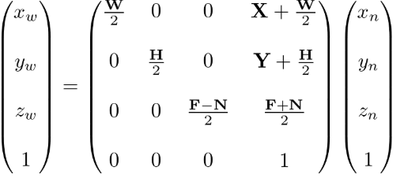

经过视口变换后，我们可以得到窗口坐标(Window Coordinates)。除了窗口坐标，还有屏幕坐标(Screen Coordinates)。一般来说，屏幕坐标是2D的概念，只用于表示屏幕XY坐标，而窗口坐标是2.5D的概念，它还带有深度信息，也就是经过变换后的Z轴的信息。
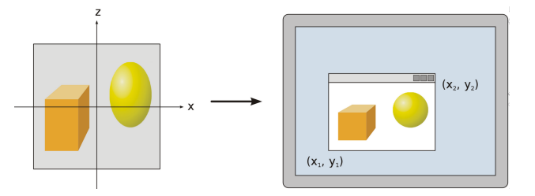

从上面视口变换的示意图我们注意到屏幕空间和Viewport其实是不一样的。在OpenGL中，我们可以通过 `glViewport()` 来设定视口的坐标和宽高。如果视口小于屏幕空间，那么会造成多余的像素被渲染。例如，`glClear()` 会为整个屏幕空间设定指定颜色值。我们可以通过裁切测试(Scissor Test)来指定渲染的区域，避免上面出现的渲染浪费的问题。我们会在后面的内容具体讨论裁切测试这种技术。

:::warning

需要注意的是，不同图形API的屏幕坐标系也存在差异。
OpenGL把屏幕的左下角当成最小的窗口坐标值，而 DirectX 则定义了屏幕的左上角为最小的窗口坐标值。

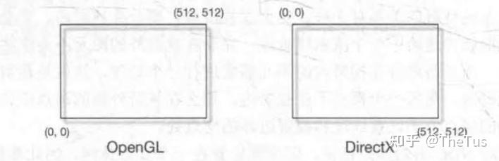
:::

## 总结

不知不觉光几何部分就写了不少了，光栅化和像素只能留到下次说了。。。
