我们已经认识了Phong光照模型和强化后的Blinn-Phong光照模型，他们都建立在一种数学原理之下，认为一切的光照效果都可以拆分成利用法线方向和出射入射方向表示的三种光照的求和（环境光+漫反射+镜面反射），而非模拟真实的物理世界。

为了构建我们梦想中的黑客帝国式的世界，利用算法来人工模拟物理世界的规则是有必要的，现代图形渲染技术，无论常说的是光线追踪还是PBR，或者是离实时渲染很遥远的光子映射和路径追踪，都是通过计算机软件对物理规则的模拟。

## Wtf is PBR

**PBR**，全称是**Physically Based Rendering**（基于物理的渲染），它指的是一些在不同程度上都基于与现实世界的物理原理更相符的基本理论所构成的渲染技术的集合。正因为基于物理的渲染目的便是为了使用一种更符合物理学规律的方式来模拟光线，因此这种渲染方式与我们原来的Phong或者Blinn-Phong光照算法相比总体上看起来要更真实一些。

除此之外，由于它与物理性质非常接近，因此我们（尤其是美术师们）可以直接以物理参数为依据来编写表面材质，而不必依靠粗劣的修改与调整来让光照效果看上去正常。这样做的好处就在于，无论我们的物体被放置在什么样的环境中，它总具有符合现实逻辑的效果，看上去永远是正确的。

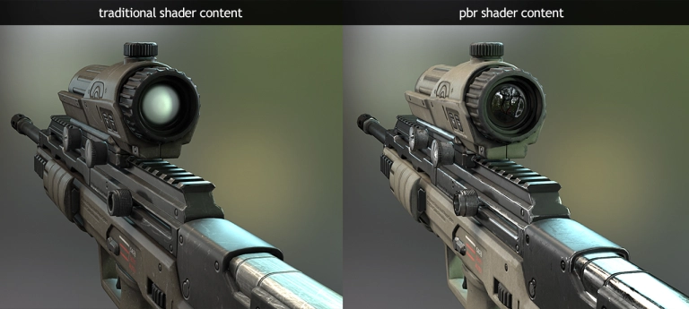

上面的瞄准镜中出现了对周围天空盒的反射，这其实是PBR的一个更高级的实现**IBL**（Image Based Lighting，基于图像的光照）的效果，我们在此不作赘述。

## PBR的Physics

尽管我们希望对物理世界的光照和材质交互进行详尽模拟，但受限于硬件性能，PBR通过遵循少数关键的物理规则，以高效的方式近似模拟，生成与现实世界高度相似的渲染结果。这种方法在实时渲染和离线渲染中都取得了广泛成功。

:::tip

事实上，如果完全模拟物理世界（如精确的光子传播和量子效应）我们的方法就应该被称为Physical Rendering。 : -(

:::

判断一种PBR光照模型是否是基于物理的，必须满足以下三个条件：

1. 基于微平面(Microfacet)的表面模型。
2. 能量守恒。
3. 应用基于物理的BRDF。（这将是本文的重点）

看起来非常深奥？不必担心，你只需要用到大学一年级学到的数学内容以及一些简单的高中物理知识就可以达到手动编写BRDF的水平，毕竟PBR也只是美术家们的一项“工具”而已。

值得一提的是，PBR通过简化的物理模型在视觉效果和计算效率间取得平衡，但并非完全模拟物理世界，这种特性使得它在某些渲染任务中会出现视觉上的“露馅”。例如，它通常忽略波长相关的光散射（如虹彩效应）或复杂次表面Subsurface散射（如皮肤和毛发）。

尽管如此，PBR在游戏引擎（如Unreal Engine、Unity）和影视渲染中广泛应用，通过标准化的材质工作流（如金属-粗糙度模型）实现一致的真实感效果。现代PBR还结合实时光线追踪（如RTX）进一步提升光照精度。

## 微平面模型

所有的PBR技术都基于**微平面理论**。这项理论认为，达到微观尺度之后任何平面都可以用被称为微平面(Microfacets)的细小镜面来进行描绘。根据平面粗糙程度的不同，这些细小镜面的取向排列可以相当不一致：

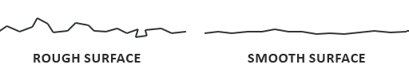

产生的效果就是：一个平面越是粗糙，这个平面上的微平面的排列就越混乱。这些微小镜面这样无序取向排列的影响就是，当我们特指镜面光/镜面反射时，入射光线更趋向于向完全不同的方向发散(Scatter)开来，进而产生出分布范围更广泛的镜面反射。而与之相反的是，对于一个光滑的平面，光线大体上会更趋向于向同一个方向反射，造成更小更锐利的反射：

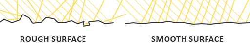

在微观尺度下，没有任何平面是完全光滑的。然而由于这些微平面已经微小到无法逐像素地继续对其进行区分，因此我们假设一个粗糙度(Roughness)参数，然后用统计学的方法来估计微平面的粗糙程度。我们可以基于一个平面的粗糙度来计算出众多微平面中，朝向方向沿着某个向量**h**方向的比例。这个向量**h**便是位于光线向量**l**和视线向量**v**之间的半程向量(Halfway Vector)。

$$
h = \frac{l + v}{\|l + v\|}
$$

微平面的朝向方向与半程向量的方向越是一致，镜面反射的效果就越是强烈越是锐利。通过使用一个介于0到1之间的粗糙度参数，我们就能概略地估算微平面的取向情况了：


## 能量守恒

**微平面近似法**使用了这样一种形式的**能量守恒**(Energy Conservation)：出射光线的能量永远不能超过入射光线的能量（发光面除外）。

如上图我们可以看到，随着粗糙度的上升，镜面反射区域会增加，但是镜面反射的亮度却会下降。如果每个像素的镜面反射强度都一样（不管反射轮廓的大小），那么粗糙的平面就会放射出过多的能量，而这样就违背了能量守恒定律。这也就是为什么正如我们看到的一样，光滑平面的镜面反射更强烈而粗糙平面的反射更昏暗。

当一束光线照射到表面时，根据能量守恒定律，光的能量分为**反射部分**、**折射部分**和**吸收部分**。反射部分包括：镜面反射光（光线以入射角等于反射角的方式直接反射，常见于光滑表面）和漫反射光（光线向各个方向散射，常见于粗糙表面）。折射部分是光线进入材料内部后发生偏折并继续传播的光。吸收部分是光线进入表面后被材料吸收，转化为热能或其他形式的能量。处于对物理模型的近似，我们暂时只对反射光进行处理。

:::tip

我们粗浅地认为折射的结果表现为漫反射，而反射的结果表现为镜面反射。真正的漫反射是由表面的粗糙微平面反射光线形成的，而不是折射光的结果。请记住，**这是一种近似，而不是物理事实**。

:::

这里还有一些细节需要处理，因为当光线接触到一个表面的时候折射光是不会立即就被吸收的。通过物理学我们可以得知，光线实际上可以被认为是一束没有耗尽就不停向前运动的能量，而光束是通过碰撞的方式来消耗能量。每一种材料都是由无数微小的粒子所组成，这些粒子都能如下图所示一样与光线发生碰撞。这些粒子在每次的碰撞中都可以吸收光线所携带的一部分或者是全部的能量而后转变成为热量。

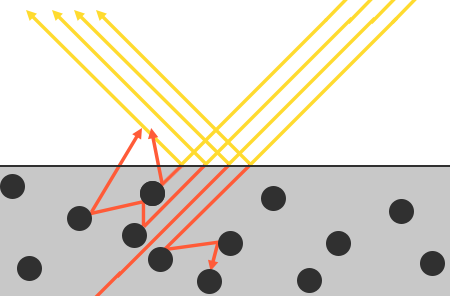

一般来说，并非全部能量都会被吸收，而光线也会继续沿着（基本上）随机的方向发散，然后再和其他的粒子碰撞直至能量完全耗尽或者再次离开这个表面。而光线脱离物体表面后将会协同构成该表面的（漫反射）颜色。不过在基于物理的渲染之中我们进行了简化，假设对平面上的每一点所有的折射光都会被完全吸收而不会散开。宏观上，我们的漫反射结果就是Albedo贴图吸收对应颜色之后的基色。

而有一些被称为**次表面散射(Subsurface Scattering)**技术的着色器技术将这个问题考虑了进去，它们显著地提升了一些诸如皮肤，大理石或者蜡质这样材质的视觉效果，不过伴随而来的代价是性能的下降，这些材质的一个典型的特征就是在强光照下轻微的“透光”效果。

对于**金属**(Metallic)表面，当讨论到反射与折射的时候还有一个细节需要注意。金属表面对光的反应与非金属（也被称为**介电质**(Dielectrics)）表面相比是不同的。它们遵从的反射与折射原理是相同的，但是**所有的**折射光都会被直接吸收而不会散开，只留下反射光或者说镜面反射光。亦即是说，**金属表面只会显示镜面反射颜色，而不会显示出漫反射颜色**。

反射光与折射光之间的这个区别使我们得到了另一条关于能量守恒的经验结论：反射光与折射光它们二者之间是**互斥**的关系。无论何种光线，其被材质表面所反射的能量将无法再被材质吸收。因此，诸如折射光这样的余下的进入表面之中的能量正好就是我们计算完反射之后余下的能量。

总结一下：

1. 当光线照射到表面时，光的能量分为反射部分、折射部分和吸收部分。
2. 反射部分包括镜面反射（specular reflection）和漫反射（diffuse reflection）。
3. 镜面反射是光线以入射角等于反射角的方式反射，常见于光滑表面；漫反射是光线向各个方向散射，常见于粗糙表面。
4. 折射部分是光线进入材料内部后发生偏折并继续传播的光，可能被吸收或透过材料。
5. 在 PBR 中，漫反射通过基色和朗伯特模型近似表示，镜面反射通过微平面模型计算，二者的能量比例满足 kS + kD = 1，以遵守能量守恒。

## 渲染方程

事实上，一群聪明的人很早（真的很早，它首次由 James T. Kajiya 在 1986 年的论文《The Rendering Equation》中提出）就发现，模拟近似真实世界的物理光照，只需要一个公式就可以了。

渲染方程是一个时至今日仍然被广泛应用的概念，是如今我们所拥有的用来模拟光的视觉效果最好的模型。Blender的着色部分就提供了BSDF(包括BRDF和BTDF)的蓝图式编程接口。

基于物理的渲染所坚定遵循的是一种被称为**反射率方程**(The Reflectance Equation)的渲染方程的特化版本。要正确地理解PBR，很重要的一点就是要首先透彻地理解反射率方程：

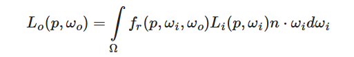

要正确地理解这个长得面目狰狞的方程式，我们必须要稍微涉足一些**辐射度量学**(Radiometry)的内容。

:::tip

关于辐射度量学，我之前写过一篇基于GAMES101的入门博文~

:::

### 立体角

立体角用**ω**表示，它可以为我们描述投射到单位球体上的一个截面的大小或者面积。投射到这个单位球体上的截面的面积就被称为立体角(Solid Angle)，你可以把立体角想象成为一个带有体积的方向：

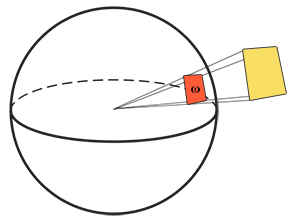

可以把自己想象成为一个站在单位球面的中心的观察者，向着投影的方向看。这个投影轮廓的大小就是立体角。

### 辐射强度

辐射强度(Radiant Intensity)表示的是在单位球面上，一个光源向每单位立体角所投送的辐射通量。

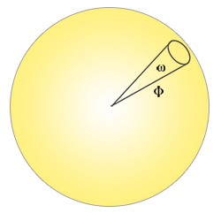

计算辐射强度的公式如下所示：

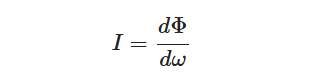

其中**I**表示辐射通量**Φ**除以立体角**ω**。

### 辐射率方程

这个方程表示：一个拥有辐射强度**Φ**的光源在单位面积**A**，单位立体角**ω**上的辐射出的总能量：

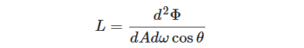

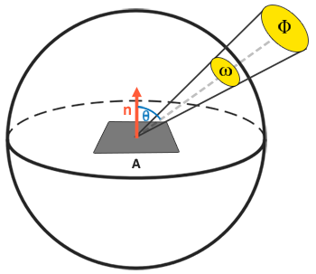

辐射率可以作为我们求反射率方程的一个微分，它包含了描述一个反射过程所需要的全部物理量：立体角、辐射通量、球面积、与平面法线的夹角，并且它们全部都是可以用来积分的微分形式！我们实际上把立体角的微分d**ω**转变为方向向量**ω**然后把球面积的微分d**A**转换为点**p**。这样我们就能直接在我们的着色器中使用辐射率来计算单束光线对每个片段的作用了。

再回来看看我们的反射率方程：


方程中**L**i代表通过某个无限小的立体角**ω**i在某个点上的辐射率，而立体角的微分可以视作是入射方向向量**ω**i。此外，我们用**ω**o表示观察方向，也就是出射方向。

我们利用光线和平面间的入射角的余弦值**cos**θ来计算能量，亦即从辐射率公式**L**转化至反射率公式时的**n**⋅**ω**i。

整个公式理解起来就是：计算从**ω**o方向上观察，光线投射到点**p**上反射出来的辐照度**L**o。

我们观察某一点的时候，只会考虑同侧的光照，所以积分域可以限定在和观察方向相同的半球领域中。一个**半球领域**(Hemisphere)可以描述为以平面法线**n**为轴所环绕的半个球体：

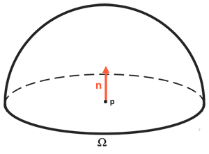

然后我们在这个半球领域上进行积分操作。事实上，渲染方程和反射率方程都不具有解析解，我们只能采用离散的方法来求解它的数值解。

于是问题转化为：在半球领域**Ω**中按一定的**步长**将反射率方程分散求解，然后再按照步长大小将所得到的结果平均化，得到辐照度的**黎曼和(Riemann sum)**。

现在唯一剩下的就只有fr函数了，它被称为BRDF，或者双向反射分布函数(Bidirectional Reflective Distribution Function) ，它的作用是基于表面材质属性来对入射辐射率进行缩放或者加权。

### BRDF

BRDF，或者说双向反射分布函数，它接受入射（光）方向**ω**i，出射（观察）方向**ω**o，平面法线**n**以及一个用来表示微平面粗糙程度的参数**a**作为函数的输入参数，然后近似地求出每束光线对一个给定了材质属性的平面上最终反射出来的光线所作出的贡献程度。

BRDF基于我们之前所探讨过的微平面理论来近似的求得材质的反射与折射属性。对于一个BRDF，为了实现物理学上的可信度，它必须遵守能量守恒定律，也就是说反射光线的总和永远不能超过入射光线的总量。

BRDF可以有很多种类，但是在实时渲染管线中，一般使用Cook-Torrance BRDF。

CT-BRDF由漫反射和镜面反射两个部分组成：

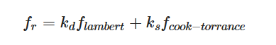

kd表示被折射（漫反射）部分能量所占的比率，ks表示镜面反射能量所占的比率。

在漫反射部分，CT-BRDF采用了Lambertian漫反射，它与我们在Phong着色模型中使用的常数因子类似：

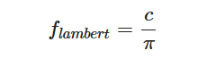

**c**表示表面颜色（回想一下漫反射表面纹理）。除以**π**是为了对漫反射光进行标准化，因为前面含有BRDF的积分方程是受**π**影响的。

事实上，Lambertian漫反射是基于Lambert余弦定理的，也就是我们在计算物理通量（磁通量，电通量，辐射通量）时使用的标准化。但是在反射率方程中，我们通过光线和平面间的入射角的余弦值**cos**θ来计算能量时，已经将能量进行了修正，所以这里只需要简单进行标准化就可以了，不需要利用方向和法线的夹角进行投影。

BRDF的镜面反射部分要稍微更高级一些，它的形式如下所示：

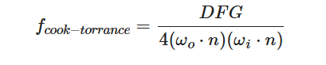

Cook-Torrance BRDF的镜面反射部分包含三个函数，此外分母部分还有一个标准化因子 。字母D，F与G分别代表着一种类型的函数，各个函数分别用来近似的计算出表面反射特性的一个特定部分。三个函数分别为：

**·法线分布函数**(Normal **D**istribution Function)，

**·菲涅尔方程**(**F**resnel Rquation)

**·几何函数**(**G**eometry Function)

以上的每一种函数都是用来估算相应的物理参数的，而且你会发现用来实现相应物理机制的每种函数都有不止一种形式。它们有的非常真实，有的则性能高效。你可以按照自己的需求任意选择自己想要的函数的实现方法。

我们类似LearnOpenGL的实现，采用Epic Games在Unreal Engine 4中所使用的函数，其中D使用Trowbridge-Reitz GGX，F使用Fresnel-Schlick近似(Fresnel-Schlick Approximation)，而G使用Smith’s Schlick-GGX。

### 法线分布函数（NDF）

法线分布函数**D**，从统计学上近似地表示了与某些（半程）向量**h**取向一致的微平面的比率。举例来说，假设给定向量**h**，如果我们的微平面中有35%与向量**h**取向一致，则法线分布函数或者说NDF将会返回0.35。目前有很多种NDF都可以从统计学上来估算微平面的总体取向度，只要给定一些粗糙度的参数。我们马上将要用到的是Trowbridge-Reitz GGX：

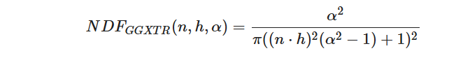

在这里**h**表示用来与平面上微平面做比较用的半程向量，而**a**表示表面粗糙度。

如果我们把**h**当成是不同粗糙度参数下，平面法向量和光线方向向量之间的中间向量的话，我们可以得到如下图示的效果：

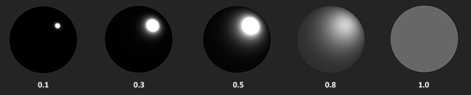

当粗糙度很低（也就是说表面很光滑）的时候，与半程向量取向一致的微平面会高度集中在一个很小的半径范围内。由于这种集中性，NDF最终会生成一个非常明亮的斑点。但是当表面比较粗糙的时候，微平面的取向方向会更加的随机。你将会发现与**h**向量取向一致的微平面分布在一个大得多的半径范围内，但是同时较低的集中性也会让我们的最终效果显得更加灰暗。

```c
float D_GGX_TR(vec3 N, vec3 H, float a)
{
    float a2     = a*a;
    float NdotH  = max(dot(N, H), 0.0);
    float NdotH2 = NdotH*NdotH;

    float nom    = a2;
    float denom  = (NdotH2 * (a2 - 1.0) + 1.0);
    denom        = PI * denom * denom;

    return nom / denom;
}
```

### 几何函数（GF）

几何函数从统计学上近似的求得了微平面间相互遮蔽的比率，这种相互遮蔽会损耗光线的能量。

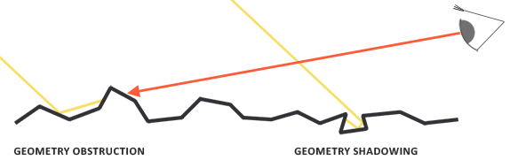

与NDF类似，几何函数采用一个材料的粗糙度参数作为输入参数，粗糙度较高的表面其微平面间相互遮蔽的概率就越高。我们将要使用的几何函数是GGX与Schlick-Beckmann近似的结合体，因此又称为Schlick-GGX：

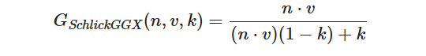

这里的**k**是**α**的重映射(Remapping)，取决于我们要用的是针对直接光照还是针对IBL光照的几何函数:

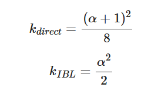

为了有效的估算几何部分，需要将观察方向（几何遮蔽(Geometry Obstruction)）和光线方向向量（几何阴影(Geometry Shadowing)）都考虑进去。我们可以使用史密斯法(Smith’s method)来把两者都纳入其中：

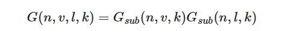

使用史密斯法与Schlick-GGX作为**G**s**u**bGsub可以得到如下所示不同粗糙度的视觉效果：

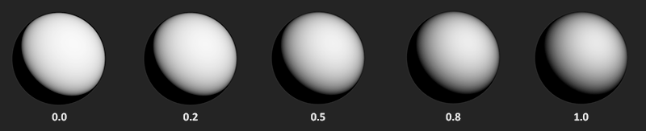

几何函数是一个值域为[0.0, 1.0]的乘数，其中白色或者说1.0表示没有微平面阴影，而黑色或者说0.0则表示微平面彻底被遮蔽。

```c
float GeometrySchlickGGX(float NdotV, float k)
{
    float nom   = NdotV;
    float denom = NdotV * (1.0 - k) + k;

    return nom / denom;
}

float GeometrySmith(vec3 N, vec3 V, vec3 L, float k)
{
    float NdotV = max(dot(N, V), 0.0);
    float NdotL = max(dot(N, L), 0.0);
    float ggx1 = GeometrySchlickGGX(NdotV, k);
    float ggx2 = GeometrySchlickGGX(NdotL, k);

    return ggx1 * ggx2;
}
```

### 菲涅尔方程（FR）

**菲涅尔方程**描述的是被反射的光线对比光线被折射的部分所占的比率，这个比率会随着我们观察的角度不同而不同。当光线碰撞到一个表面的时候，菲涅尔方程会根据观察角度告诉我们被反射的光线所占的百分比。利用这个反射比率和能量守恒原则，我们可以直接得出光线被折射的部分以及光线剩余的能量。

当垂直观察的时候，任何物体或者材质表面都有一个**基础反射率**(Base Reflectivity)，但是如果以一定的角度往平面上看的时候所有反光都会变得明显起来。你可以自己尝试一下，用垂直的视角观察你自己的木制/金属桌面，此时一定只有最基本的反射性。但是如果你从近乎90度（译注：应该是指和法线的夹角）的角度观察的话反光就会变得明显的多。如果从理想的90度视角观察，所有的平面理论上来说都能完全的反射光线。这种现象因菲涅尔而闻名，并体现在了菲涅尔方程之中。

菲涅尔方程是一个相当复杂的方程式，不过幸运的是菲涅尔方程可以用Fresnel-Schlick近似法求得近似解：

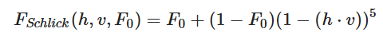

**F**0表示平面的基础反射率，它是利用所谓 **折射指数** (Indices of Refraction)或者说IOR计算得出的。然后正如你可以从球体表面看到的那样，我们越是朝球面掠角的方向上看（此时视线和表面法线的夹角接近90度）菲涅尔现象就越明显，反光就越强：

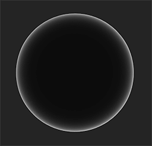

菲涅尔方程还存在一些细微的问题。其中一个问题是Fresnel-Schlick近似仅仅对电介质或者说非金属表面有定义。对于导体(Conductor)表面（金属），使用它们的折射指数计算基础折射率并不能得出正确的结果，这样我们就需要使用一种不同的菲涅尔方程来对导体表面进行计算。

所以我们预计算出平面对于法向入射的结果，然后基于相应观察角的Fresnel-Schlick近似对这个值进行插值，用这种方法来进行进一步的估算。这样我们就能对金属和非金属材质使用同一个公式了。平面对于法向入射的响应或者说基础反射率可以在一些大型数据库中找到：

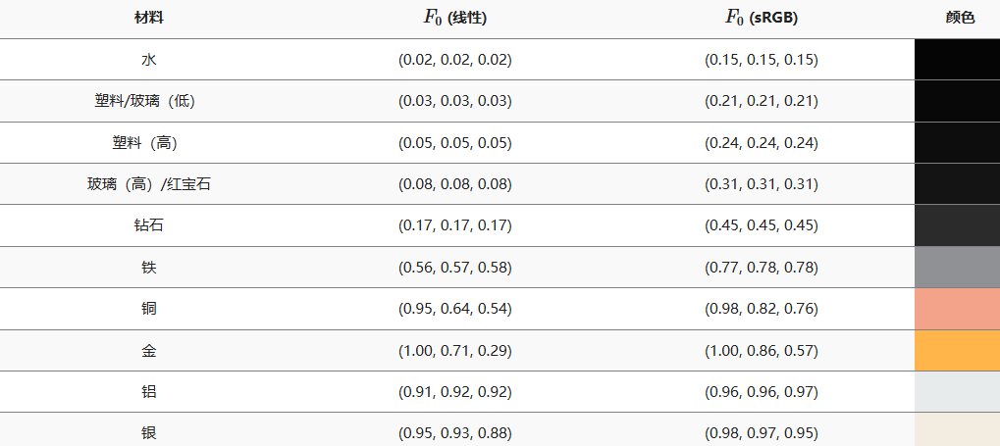

```c
vec3 fresnelSchlick(float cosTheta, vec3 F0)
{
    return F0 + (1.0 - F0) * pow(1.0 - cosTheta, 5.0);
}
```

### Cook-Torrance渲染方程

现在，我们把我们介绍的所有内容展开到渲染方程的基本公式中：

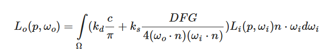

这个公式完成地描述了一个PBR的渲染模型，并且可以直接应用到渲染管线之中！

渲染管线会把一个模型的每个参数通过一个纹理贴图传入，然后在网格体上进行贴图和渲染：

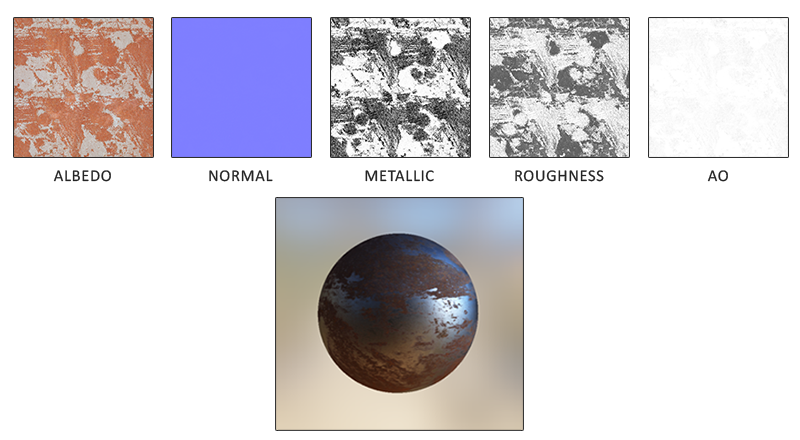

**反照率** ：反照率(Albedo)纹理为每一个金属的纹素(Texel)（纹理像素）指定表面颜色或者基础反射率。这和漫反射纹理相当类似，不同的是所有光照信息都是由一个纹理中提取的。漫反射纹理的图像当中常常包含一些细小的阴影或者深色的裂纹，而反照率纹理中是不会有这些东西的。它应该只包含表面的颜色（或者折射吸收系数）。

**法线** ：法线贴图使我们可以逐片段的指定独特的法线，来为表面制造出起伏不平的假象。

**金属度** ：金属(Metallic)贴图逐个纹素的指定该纹素是不是金属质地的。根据PBR引擎设置的不同，美术师们既可以将金属度编写为灰度值又可以编写为1或0这样的二元值。

**粗糙度** ：粗糙度(Roughness)贴图可以以纹素为单位指定某个表面有多粗糙。采样得来的粗糙度数值会影响一个表面的微平面统计学上的取向度。一个比较粗糙的表面会得到更宽阔更模糊的镜面反射（高光），而一个比较光滑的表面则会得到集中而清晰的镜面反射。某些PBR引擎预设采用的是对某些美术师来说更加直观的光滑度(Smoothness)贴图而非粗糙度贴图，不过这些数值在采样之时就马上用（1.0 – 光滑度）转换成了粗糙度。

**AO** ：环境光遮蔽(Ambient Occlusion)贴图或者说AO贴图为表面和周围潜在的几何图形指定了一个额外的阴影因子。比如如果我们有一个砖块表面，反照率纹理上的砖块裂缝部分应该没有任何阴影信息。然而AO贴图则会把那些光线较难逃逸出来的暗色边缘指定出来。在光照的结尾阶段引入环境遮蔽可以明显的提升你场景的视觉效果。网格/表面的环境遮蔽贴图要么通过手动生成，要么由3D建模软件自动生成。

这些贴图可以由程序生成，或者由美术师来手动绘制，甚至直接从现实世界的照片中导出，在把贴图纹理设置到材质之后，我们的模型在任何光照条件下都会保持一致且自然的物理性质和光照效果。

```c
#version 330 core
out vec4 FragColor;
in vec2 TexCoords;
in vec3 WorldPos;
in vec3 Normal;

// material parameters
uniform vec3  albedo;
uniform float metallic;
uniform float roughness;
uniform float ao;

// lights
uniform vec3 lightPositions[4];
uniform vec3 lightColors[4];

uniform vec3 camPos;

const float PI = 3.14159265359;

float DistributionGGX(vec3 N, vec3 H, float roughness);
float GeometrySchlickGGX(float NdotV, float roughness);
float GeometrySmith(vec3 N, vec3 V, vec3 L, float roughness);
vec3 fresnelSchlickRoughness(float cosTheta, vec3 F0, float roughness);

void main()
{   
    vec3 N = normalize(Normal);
    vec3 V = normalize(camPos - WorldPos);

    vec3 F0 = vec3(0.04); 
    F0 = mix(F0, albedo, metallic);

    // reflectance equation
    vec3 Lo = vec3(0.0);
    for(int i = 0; i < 4; ++i) 
    {
        // calculate per-light radiance
        vec3 L = normalize(lightPositions[i] - WorldPos);
        vec3 H = normalize(V + L);
        float distance    = length(lightPositions[i] - WorldPos);
        float attenuation = 1.0 / (distance * distance);
        vec3 radiance     = lightColors[i] * attenuation;  

        // cook-torrance brdf
        float NDF = DistributionGGX(N, H, roughness);  
        float G   = GeometrySmith(N, V, L, roughness);  
        vec3 F    = fresnelSchlick(max(dot(H, V), 0.0), F0);   

        vec3 kS = F;
        vec3 kD = vec3(1.0) - kS;
        kD *= 1.0 - metallic;   

        vec3 nominator    = NDF * G * F;
        float denominator = 4.0 * max(dot(N, V), 0.0) * max(dot(N, L), 0.0) + 0.001; 
        vec3 specular     = nominator / denominator;

        // add to outgoing radiance Lo
        float NdotL = max(dot(N, L), 0.0);      
        Lo += (kD * albedo / PI + specular) * radiance * NdotL; 
    }   

    vec3 ambient = vec3(0.03) * albedo * ao;
    vec3 color = ambient + Lo;

    color = color / (color + vec3(1.0));
    color = pow(color, vec3(1.0/2.2));  

    FragColor = vec4(color, 1.0);
}  
```

在经过HDR渲染，把颜色经过Gamma矫正到线性空间之后，我们会得到非常惊人的视觉效果。

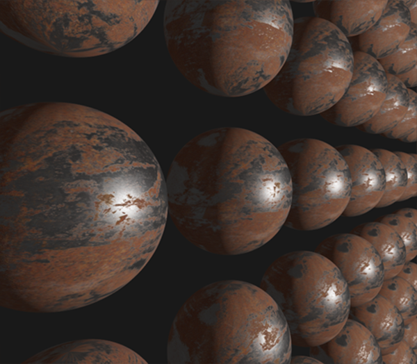
