先来一张毛星云大佬的大纲图，图上的内容不必认识，大致有有个印象即可：

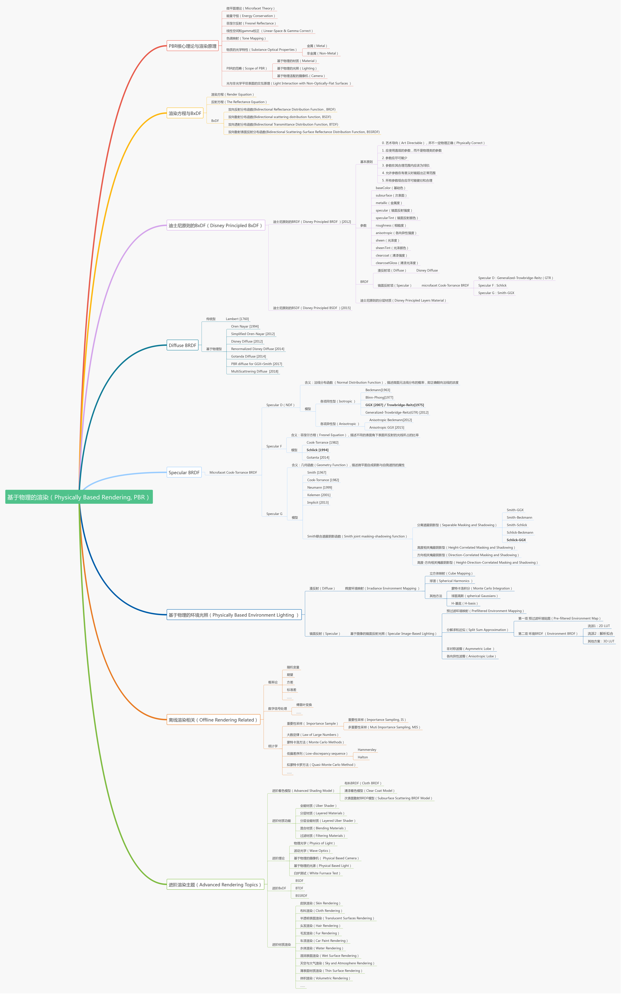

我们不会完全按照毛星云大佬的思路来讲解，如果更喜欢毛佬的风格，可以看看原文：

[知乎文章](zhuanlan.zhihu.com/p/53086060)

# PBR核心理论

这里还是来看看佬的大纲：

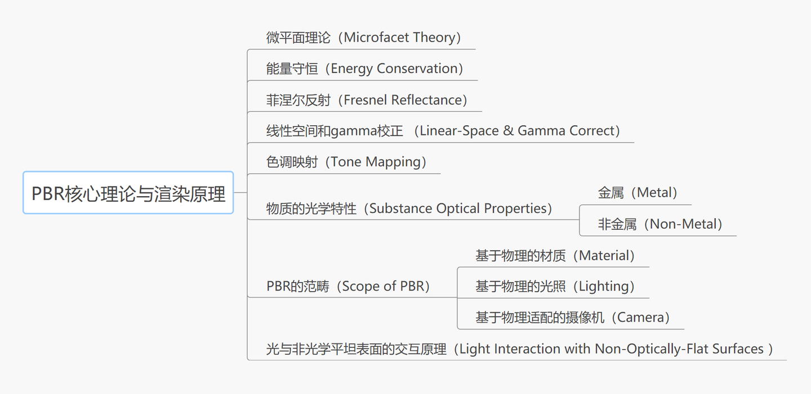

基于物理的渲染（Physically Based Rendering，PBR）是指使用**基于物理原理**和**微平面理论**建模的**着色/光照模型**，以及使用从现实中测量的表面参数来准确表示真实世界材质的渲染理念。

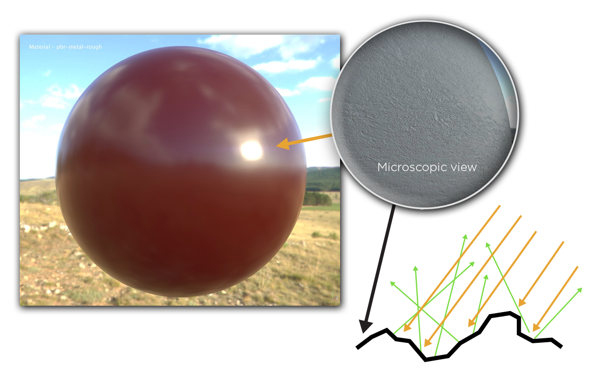

以下是对PBR基础理念的概括：

* **微平面理论（Microfacet Theory）** 。微平面理论是将物体表面建模成做无数微观尺度上有随机朝向的理想镜面反射的小平面（microfacet）的理论。在实际的PBR 工作流中，这种物体表面的不规则性用粗糙度贴图或者高光度贴图来表示。
* **能量守恒（Energy Conservation）** 。出射光线的能量永远不能超过入射光线的能量。随着粗糙度的上升镜面反射区域的面积会增加，作为平衡，镜面反射区域的平均亮度则会下降。
* **菲聂耳反射（Fresnel Reflectance）** 。光线以不同角度入射会有不同的反射率。相同的入射角度，不同的物质也会有不同的反射率。万物皆有菲涅尔反射。F0是即0度角入射的菲涅尔反射值。大多数非金属的F0范围是0.02-0.04，大多数金属的F0范围是0.7-1.0。
* **线性空间（Linear Space）** 。光照计算必须在线性空间完成，shader中输入的gamma空间的贴图比如漫反射贴图需要被转成线性空间，在具体操作时需要根据不同引擎和渲染器的不同做不同的操作。而描述物体表面属性的贴图如粗糙度，高光贴图，金属贴图等必须保证是线性空间。
* **色调映射（Tone Mapping）** 。也称色调复制（tone reproduction），是将宽范围的照明级别拟合到屏幕有限色域内的过程。因为基于HDR渲染出来的亮度值会超过显示器能够显示最大亮度，所以需要使用色调映射，将光照结果从HDR转换为显示器能够正常显示的LDR。
* **物质的光学特性（Substance Optical Properties）。** 现实世界中有不同类型的物质可分为三大类：绝缘体（Insulators），半导体（semi-conductors）和导体（conductors）。在渲染和游戏领域，我们一般只对其中的两个感兴趣：导体（金属）和绝缘体（电解质，非金属）。其中非金属具有单色/灰色镜面反射颜色。而金属具有彩色的镜面反射颜色。

# 物理原理

## 光照现象

光由光子组成，光子既具有粒子的特性，又表现出波的特性。从波的角度看，光是电磁波的一种，不同频率（波长）的光波能量不同，频率越高（波长越短），能量越高，频率越低（波长越长），能量越低，其中波长在380nm－780nm范围内的光波能被人类的视网膜感知到，这个范围的光波称为可见光，不同频率的可见光被人感知为不同的颜色，频率越高的光偏蓝，频率较低的光则偏红。

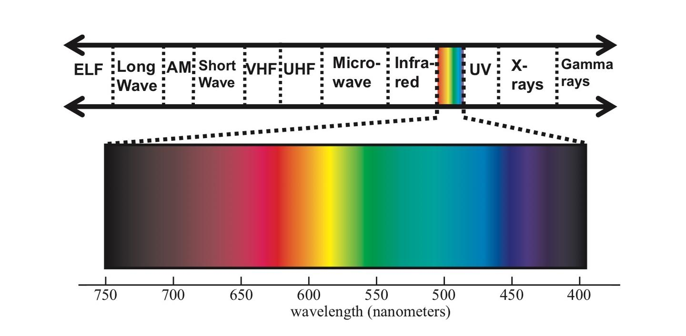

光学根据研究的尺度可以分为波动光学（Wave Optics）和几何光学（Geometric
Optics），波动光学比几何光学复杂，而由于图形学领域关注的尺度远大于可见光的波长（380nm－780nm），也很少涉及光的偏振、干涉和衍射等波动光学才能解释的现象，所以我们一般用几何光学来建立光照模型。

### 光学平面边界上的散射

我们在中学物理课上学过光学平面边界的散射。

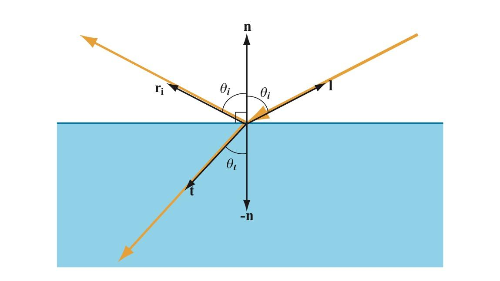

平面边界两边物质的折射率（Refractive Index）不同，当一束光线从一种物质照射到平面边界上时，其中一部分在平面边界被反射回这种物质，反射方向为入射方向关于平面法线的对称向量：

$$
r_i = 2(n \cdot l)n-l
$$

其中$r_i$是反射向量，$l$是光线入射向量，$n$是平面法线，向量间的$\cdot$表示向量的点积，两个单位向量的点积等于它们夹角的余弦。

另一部分光穿过平面边界折射进入另一种物质，折射方向可由Snell法则计算得出：

$$
\frac{\sin\theta_i}{\sin\theta_t} = \frac{v_i}{v_t} = \frac{\lambda_i}{\lambda_t} = \frac{n_t}{n_i}
$$

反射和折射的比例由菲涅尔方程给出，菲涅尔方程比较复杂，图形学里一般使用近似公式计算。

### 非光学平面上的散射

现实世界中的表面绝大多数都是凹凸不平的，尽管这种凹凸不平小于肉眼可见的尺度，但远大于光线的波长。在这种情况下，可以把表面看成是大量朝向各异的微小光学平面的集合，我们肉眼可见的每个点都包含了很多个这样的微小光学平面。

光线照射到这些微小表面上时，同样 ***一部分在表面发生反射*** 。这些朝向不同的微表面把入射光线反射到不同的方向。

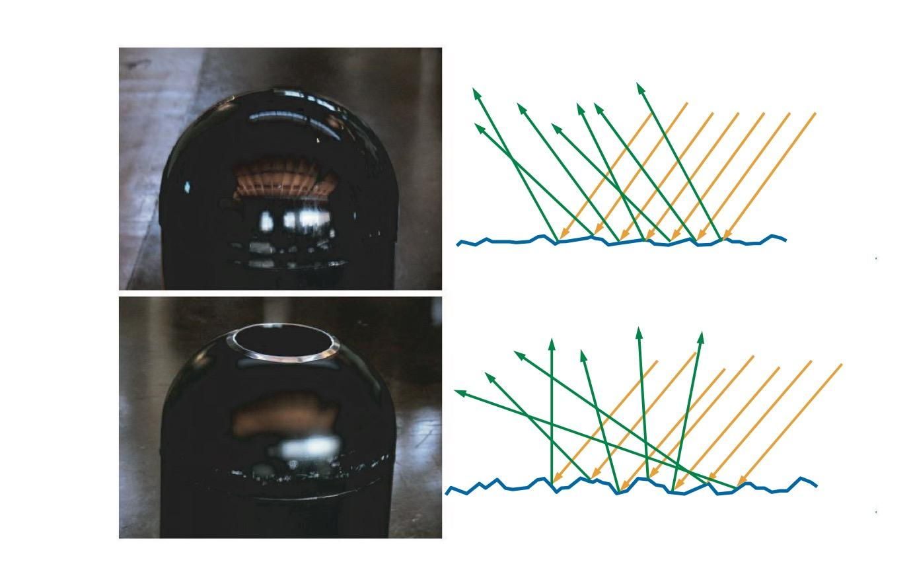

 ***另一部分光线发生折射*** ，折射光线何去何从取决于物质的组成成分。

对于玻璃等透明物质，光线穿透玻璃，在另一边再次发生反射折射，图形学用双向透射分布函数BTDF来模拟这种现象，以后有机会再写。下面我们看看不透明和半透明物质。

对于金属，折射进表面的光线的能量会立即被金属中的自由电子吸收，转换成电子的能量，不再可见（下图左边）。对于非金属（电介质或绝缘体），它们往往不是由单一成分构成，而可以认为其中包含了很多折射率不同的微粒，光线遇到这些粒子后发生反射折射，在物质内部不断传播，散射到不同方向，其中一部分会再次穿过表面被观察到，这种现象称为次表面散射（Subsurface Scattering，下图右边穿出表面的蓝色光线），也有一部分在传输过程中被吸收。

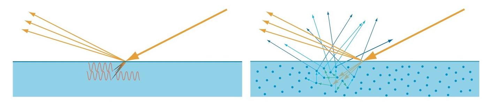

根据物质属性和观察尺度的不同，次表面散射会表现出不同的效果。

如下面的左上图，如果光线在物质中传播距离小于观察尺度（绿色区域，可以认为是一个像素区域），我们看到情况如下面的右上图，入射点、反射点、次表面散射的出射点看起来是同一个点。其中反射部分（图中浅棕色出射光）就是我们常说的高光（Specular Light），常聚集在一个方向周围，向这个方向观察该点会看到明显的高光，从其他方向观察该点时高光则比较微弱；次表面散射部分（图中蓝色出射光）是漫射光（Diffuse Light），光线被散射到各个方向。双向反射分布函数BRDF就是用来模拟这种现象的，这也是本文关注的重点。

如果光线在物质中的传播距离大于观察尺度，如下面的下图，就需要使用次表面散射算法来建模，例如皮肤和大理石材质。

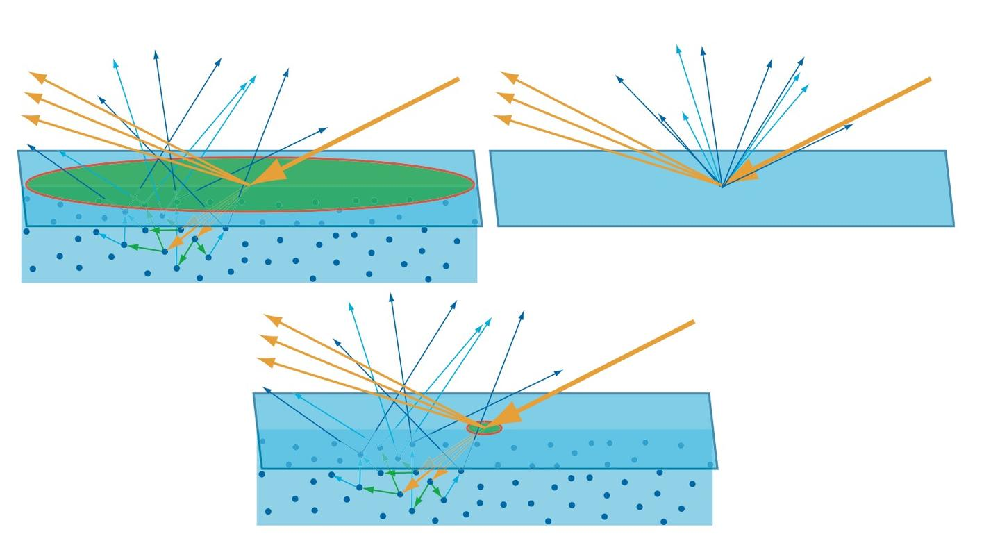

## 光照模型

为了模拟非光学平面的散射，人们建立了各种模型，大致可以分为以下几类：

### 测量模型

MERL等实验室使用仪器测量了上百种真实材质表面在不同光照角度和观察角度下的反射数据，并记录在数据库中。这些数据由于采集自真实材质，所以使用它渲染出来的结果很真实，但缺点是没有可供调整效果的参数，无法基于这些数据修改成想要的效果，另外部分极端角度由于仪器限制，无法获取到数据，而且采样点密集，数据量非常庞大，所以并不适合游戏等实时领域，一般可用在电影等离线渲染领域，也可以用来做图形学研究，衡量其他模型的真实程度。

### 经验模型

经验模型并不是基于物理原理，而是提出经验公式，通过调整参数来模拟光照。

1975年Phong提出Phong反射模型（Phong Reflection Model） ：

$$
I_p = k_a I_a + \sum_{i \in \text{lights}} \left( k_d (\hat{L}_i \cdot \hat{N}) I_{i,d} + k_s (\hat{R}_i \cdot \hat{V})^n I_{i,s} \right)
$$

其中，各个分量解释如下。

环境光：

$$
I_{amb} = k_a I_a
$$

漫反射：

$$
I_{diff} = k_d \max(0, \hat{L} \cdot \hat{N}) I_d
$$

镜面反射：

$$
I_{spec} = k_s \max(0, \hat{R} \cdot \hat{V})^n I_s
$$

反射向量R：

$$
\hat{R} = 2(\hat{L} \cdot \hat{N})\hat{N} - \hat{L}
$$

1977年Blinn对Phong模型做出修改，这就是后来广泛使用的Blinn-Phong反射模型：

$$
I_p = k_a I_a + \sum_{i \in \text{lights}} \left( k_d (\hat{L}_i \cdot \hat{N}) I_{i,d} + k_s (\hat{N}_i \cdot \hat{H})^n I_{i,s} \right)
$$

$$
\hat{H} = \frac{\hat{L} + \hat{V}}{\|\hat{L} + \hat{V}\|}
$$

Blinn-Phong相比Phong，在观察方向趋向平行于表面时，高光形状会拉长，更接近真实情况。

Blinn-Phong模型运算简单，适合早期硬件实现，在显卡只支持固定管线（Fixed Pipeline）的年代，Blinn-Phong模型是设计在显卡硬件中的，OpenGL/Direct3D固定管线的光照模型就是Blinn-Phong模型。

### 基于物理的分析模型

1967年Torrance-Sparrow在Theory for Off-Specular Reflection From Roughened Surfaces中使用**辐射度量学**和**微表面理论**推导出粗糙表面的高光反射模型，1981年Cook-Torrance在《A Reflectance Model for Computer Graphics》中把这个模型引入到计算机图形学领域，现在无论是CG电影，还是3D游戏，基于物理着色都是使用的这个模型。我们将在下文中详细分析它的推导过程。

# 数学推导

## BRDF (双向反射函数)

关于辐射度量学的部分，这里不多赘述，直接进入BRDF和渲染方程的部分。

我们看到一个表面，实际上是周围环境的光照射到表面上，然后表面将一部分光反射到我们眼睛里。双向反射分布函数BRDF（Bidirectional Reflectance Distribution Function）就是描述表面入射光和反射光关系的。

对于一个方向的入射光，表面会将光反射到表面上半球的各个方向，不同方向反射的比例是不同的，我们用BRDF来表示指定方向的反射光和入射光的比例关系，BRDF定义为：

$$
f(l, v) = \frac{dL_o(v)}{dE(l)}
$$

其中 $f$ 就是 **BRDF**，$l$ 是入射光方向，$v$ 是观察方向，也就是我们关心的反射光方向。

* **$dL_o(v)$** 是表面反射到 $v$ 方向的反射光的**微分辐射率**。表面反射到 $v$ 方向的反射光的辐射率为 $L_o(v)$，来自于表面上半球所有方向的入射光线的贡献，而微分辐射率 $dL_o(v)$ 特指来自方向 $l$ 的入射光贡献的反射辐射率。
* **$dE(l)$** 是表面上来自入射光方向 $l$ 的**微分辐照度**。表面接收到的辐照度为 $E$，来自上半球所有方向的入射光线的贡献，而微分辐照度 $dE(l)$ 特指来自于方向 $l$ 的入射光。

表面对不同频率的光反射率可能不一样，因此BRDF和光的频率有关。在图形学中，将BRDF表示为RGB向量，三个分量各有自己的$f$函数。

BRDF需要处理表面上半球的各个方向，如下图使用球坐标系定义方向更加方便。球坐标系使用两个角度来确定一个方向：

1. 方向相对法线的角度$\theta$，称为极角（Polar Angle）或天顶角（Zenith Angle）
2. 方向在平面上的投影相对于平面上一个坐标轴的角度$\phi$，称为方位角（Azimuthal Angle）

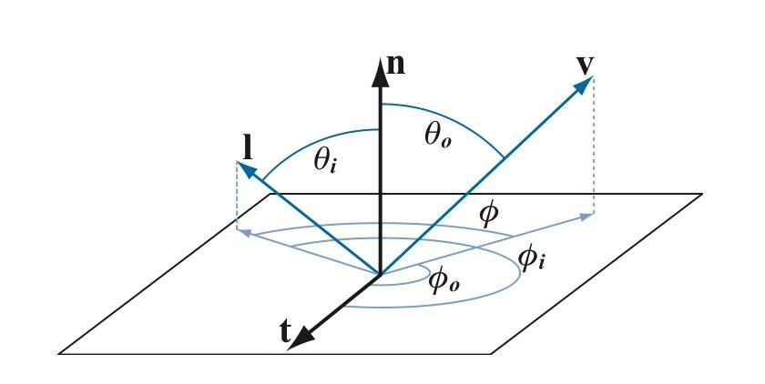

所以 BRDF 也可以表示成

$$
f(\theta_i, \phi_i, \theta_o, \phi_o)
$$

对于各向同性材质，当$l$和$v$同时绕法线$n$旋转时，$f$值保持不变，此时可以用$l$和$v$在平面投影的夹角$\phi$来代替$\phi_i$和$\phi_o$：

$$
f(\theta_i, \theta_o, \phi)
$$

:::tip

至于 **为什么BRDF要定义成辐射率和辐照度的比值，而不是直接定义为辐射率和辐射率比值** ，有两种解释。

**第一种解释**可以参看[brdf为什么要定义为一个单位是sr-1的量？](https://www.zhihu.com/question/28476602/answer/41003204)

我们结合下面辐照度（A）和辐射率（B）测量仪的示意图来看看。辐照度测量仪（A）接受平面上半球的所有光线，可以测量一个较小面积来自于四面八方的所有光通量，光通量$\Phi$除以传感器面积$A$就可以得到辐照度$E$。辐射度测量仪（B）则有一个长筒控制光线只能从一个很小的立体角进入测量仪，光通量$\Phi$除以传感器面积$A$和立体角$\omega$就可以得到辐射率$L$。

测平面上一点在某一个方向的出射辐射率很简单，只需要用仪器（B）从该方向对准该点就可以了。而测平面一点入射的辐射率则没有那么简单，必须保证光源正好覆盖测量仪开口立体角，大了该点会接受到比测量值更多的光照，导致测量值比实际值小，小了则与仪器的设计立体角不一致，可在实际中是基本做不到光源大小正好覆盖测量仪开口立体角的。而测表面的辐照度则简单得多，只要保证光源很小，而且没有来自其他方向的光干扰，这时候测到的辐照度就是平面上来自光源方向的微分辐照度$dE$。

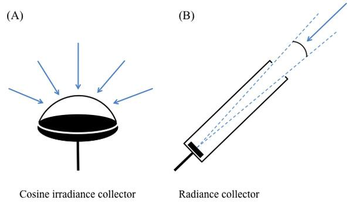

**第二种解释**从数学的角度出发，对于现实世界中的非光学平面，一束光线射到表面上后，被表面反射到各个方向，其中一个出射方向的光通量只是整个反射光通量极小的一部分，当出射方向立体角趋于 0 时，$\lim_{\omega_o \to 0} \frac{dL_o}{L_i} = 0$，所以在实际计算中使用辐射率和辐射率比值是没有意义的。而如果分母改成表面上接收到的来自光源方向的微分辐照度，我们知道 $dE = L_i(l)d\omega_i \cos\theta_i$，由于给入射辐射率乘了一个趋于零的微分立体角，$dE$ 的值会小很多，比值 $\frac{dL_o}{dE}$ 是有意义的，而不是 0。

:::

下面我们来看看**怎么用 BRDF 来计算表面辐射率**。

我们考虑来自方向 $l$ 的入射光辐射率 $L_i(l)$，由辐射率和辐照度的定义：

$$
L_i(l) = \frac{d\Phi}{d\omega_i dA^{\perp}} = \frac{d\Phi}{d\omega_i dA \cos\theta_i} = \frac{dE(l)}{d\omega_i \cos\theta_i}
$$

则照射到表面来自于方向 $l$ 的入射光贡献的微分辐照度：

$$
dE(l) = L_i(l)d\omega_i \cos\theta_i
$$

表面反射到 $v$ 方向的由来自方向 $l$ 的入射光贡献的**微分辐射率**：

$$
dL_o(v) = f(l, v) \otimes dE(l) = f(l, v) \otimes L_i(l)d\omega_i \cos\theta_i
$$

> 符号 $\otimes$ 表示按向量的分量相乘，因为 $f$ 和 $L_i$ 都包含 RGB 三个分量。

要计算表面反射到 $v$ 方向的来自上半球所有方向入射光线贡献的辐射率，可以将上式对半球所有方向的光线积分：

$$
L_o(v) = \int_{\Omega} f(l, v) \otimes L_i(l) \cos\theta_i d\omega_i
$$

上式称为 **反射方程 (Reflectance Equation)**，用来计算表面反射辐射率。

**对于点光源、方向光等理想化的精准光源（Punctual Light）**，计算过程可以大大简化。我们考察单个精准光源照射表面，此时表面上的一点只会被来自一个方向的一条光线照射到（而面积光源照射表面时，表面上一点会被来自多个方向的多条光线照射到），则辐射率：

$$
L_o(v) = f(l, v) \otimes E_L \cos\theta_i
$$

对于多个精准光源，只需简单累加就可以了：

$$
L_o(v) = \sum_{k=1}^n f(l_k, v) \otimes E_{L_k} \cos \theta_{i_k}
$$

这里使用光源的辐照度，对于阳光等全局方向光，可以认为整个场景的辐照度是一个常数，对于点光源，辐照度随距离的平方衰减，用公式 $E_L = \frac{\Phi}{4\pi r^2}$ 就可以求出到达表面后的辐照度，$\Phi$ 是光源的功率，比如 100 瓦的灯泡，$r$ 是表面离光源的距离。

回头看看反射方程，是对表面上半球所有方向的入射光线积分，这里面包含了来自精准光源的光线，也包括周围环境反射的光线。处理来自周围环境的光线可以大幅提高光照的真实程度，在实时图形学中，这部分光照可以用**基于图像的光照 (Image Based Lighting)** 来模拟。我们将在之后讨论IBL。

上面给出了 BRDF 的定义和使用 BRDF 计算表面反射辐射率的公式。但这个定义实际上是无法直接用于计算表面反射辐射率的，我们还要建立一个能模拟真实光照的模型，使得输入入射方向和出射方向，$f(l, v)$ 能输出表面反射微分辐射率和入射微分辐照度的比率。

下面我们来看看微表面理论和Cook-Torrance模型的推导过程。

## 微表面理论 (Micro Facet Theory)

微表面理论（Microfacet Theory）认为我们看到的表面上的一点是由很多朝向各异且光学平的微小表面组成。当光线从$l$方向照射到这点，而我们在$v$方向观察时，由于光学平面只会将光线$l$反射到关于法线对称的$v$方向，而$l$和$v$已经确定，所以只有法线朝向正好是$l$和$v$的半角向量$h$的微表面才会将光线反射到$v$方向，从而被我们看见。

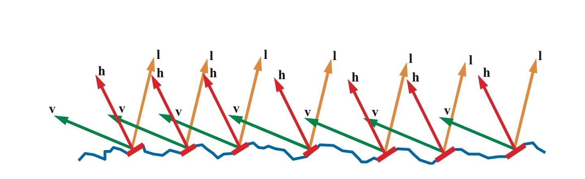

我们用 **法线分布函数（Normal Distribution Function，简写为NDF）$D(h)$** 来描述组成表面一点的所有微表面的法线分布概率，现在可以这样理解：向NDF输入一个朝向$h$，NDF会返回朝向是$h$的微表面数占微表面总数的比例（虽然实际并不是这样，这点我们在讲推导过程的时候再讲），比如有1%的微表面朝向是$h$，那么就有1%的微表面可能将光线反射到$v$方向。

但实际上并不是所有微表面都能收到接受到光线，如下面左边的图有一部分入射光线被遮挡住，这种现象称为Shadowing。也不是所有反射光线都能到达眼睛，下面中间的图，一部分反射光线被遮挡住了，这种现象称为Masking。光线在微表面之间还会互相反射，如下面右边的图，这可能也是一部分漫射光的来源，在建模高光时忽略掉这部分光线。

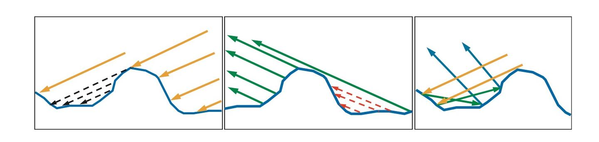

Shadowing和Masking用**几何衰减因子（Geometrical Attenuation Factor)** $G(l,v)$来建模，输入入射和出射光线方向，输出值表示光线未被遮蔽而能从$l$反射到$v$方向的比例。

光学平面并不会将所有光线都反射掉，而是一部分被反射，一部分被折射，反射比例符合**菲涅尔方程（Fresnel Equations）** $F(l,h)$。

Torrance-Sparrow基于微表面理论，用上述三个函数建立了高光BRDF模型：

$$
f(l, v) = \frac{F(l, h)G(l, v)D(h)}{4\cos\theta_i\cos\theta_o} = \frac{F(l, h)G(l, v)D(h)}{4(n \cdot l)(n \cdot v)}
$$

> 其中$n$是宏观表面法线，$h$是微表面法线

这个模型后来由Cook-Torrance引入计算机图形学，也被称为Cook-Torrance模型。不过Cook-Torrance的论文里上式分母里的系数由4改成了$\pi$，但现在大家公认应该用4，下面我们来看看这个公式的推导过程。

## Cook-Torrance 模型公式推导

我们考察一束光照射到一组微表面上，入射光方向 $\omega_i$，观察方向 $\omega_o$，对反射到 $\omega_o$ 方向的反射光有贡献的微表面法线为半角向量 $\omega_h$，则这束光的微分通量：

$$
d\Phi_h = L_i(\omega_i)d\omega_idA^{\perp}(\omega_h) = L_i(\omega_i)d\omega_i\cos\theta_hdA(\omega_h)
$$

> 其中 $dA(\omega_h)$ 是法线为半角向量 $\omega_h$ 的微分微表面面积，$dA^{\perp}(\omega_h)$ 为 $dA(\omega_h)$ 在入射光线方向的投影，$\theta_h$ 为入射光线 $\omega_i$ 和微表面法线 $\omega_h$ 的夹角。

Torrance-Sparrow 将微分微表面面积 $dA(\omega_h)$ 定义为：

$$
dA(\omega_h) = D(\omega_h)d\omega_hdA
$$

Torrance-Sparrow 将前两项解释为单位面积微表面中朝向为 $\omega_h$ 的微分面积。不过这里塞一个 $d\omega_h$ 略诡异，我的理解乘以 $d\omega_h$ 并没有明确的数学或者物理上的意义。要从一组微表面面积 $dA$ 中得到朝向为 $\omega_h$ 的微表面面积 $dA(\omega_h)$，只需要将 $D(\omega_h)$ 定义为 $dA$ 中朝向为 $\omega_h$ 的比例，取值范围在 $[0, 1]$ 就可以了。这里引入 $d\omega_h$ 的实际用途我们稍后再讨论。

由上两式可得：

$$
d\Phi_h = L_i(\omega_i)d\omega_i\cos\theta_h D(\omega_h)d\omega_h dA
$$

设定微表面反射光线遵循菲涅尔定理，则反射通量：

$$
d\Phi_o = F_r(\omega_o)d\Phi_h
$$

由上两式可得反射辐射率：

$$
dL_o(\omega_o) = \frac{d\Phi_o}{d\omega_o\cos\theta_o dA} = \frac{F_r(\omega_o)L_i(\omega_i)d\omega_i\cos\theta_h D(\omega_h)d\omega_h dA}{d\omega_o\cos\theta_o dA}
$$

由 BRDF 的定义可得：

$$
f_r(\omega_i, \omega_o) = \frac{dL_o(\omega_o)}{dE_i(\omega_i)} = \frac{dL_o(\omega_o)}{L_i(\omega_i)\cos\theta_i d\omega_i} = \frac{F_r(\omega_o)\cos\theta_h D(\omega_h)d\omega_h}{\cos\theta_o \cos\theta_i d\omega_o}
$$

> **这里需要特别强调几个夹角：**
>
> * $\theta_h$ 是入射光线 $\omega_i$ 与朝向为 $\omega_h$ 的微表面法线的夹角
> * $\theta_i$ 是入射光线 $\omega_i$ 与宏观表面法线的夹角
> * $\theta_o$ 是反射光线 $\omega_o$ 与宏观表面法线的夹角

回头看反射方程 $L_o(v) = \int_{\Omega} f(l, v) \otimes L_i(l) \cos\theta_i d\omega_i$ 是对 $d\omega_i$ 积分，而上式分母包含 $d\omega_o$，需要想办法把 $d\omega_o$ 消掉。我估计这也是为什么 Torrance-Sparrow 在 $dA(\omega_h) = D(\omega_h) d\omega_h dA$ 中塞一个 $d\omega_h$：可以通过找到 $\frac{d\omega_h}{d\omega_o}$ 的关系，把 $d\omega_o$ 消掉。塞入 $d\omega_h$ 并不会影响方程的合理性，因为 $D(\omega_h)$ 是可以调整的，现在 $D(\omega_h)$ 是一个有单位的量，单位为 $1/sr$。

*Physically Based Rendering, Second Edition* 里关于 $d\omega_h$ 和 $d\omega_o$ 关系的推导（在 14.5.1 节）预设了一个前提：$\theta_i = 2\theta_h$，可这会导致 $\theta_i$ 和 $\theta_h$ 的定义和前面推导过程中的定义不一致。而 Torrance-Sparrow 论文里 $d\omega_o$ 和 $d\omega_h$ 的关系直接引用自一篇付费论文，没有推导。

不过 《*Surface Reflection: Physical and Geometrical Perspectives》* 给出了一个直观的非正式推导，《*An Illumination Model for a Skin Layer Bounded by Rough Surfaces》* 附录 B 给出了详细的数学计算过程。我们来看看前者。

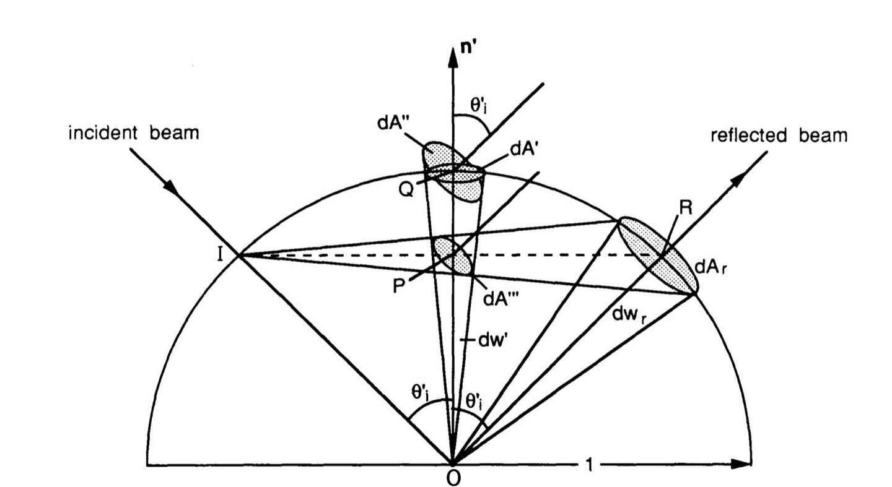

如下图，入射光线照射到一个微表面上，与微表面的单位上半球相交于点 $I$，与微表面相交于点 $O$，反射光线与单位上半球相交于点 $R$，反射光束立体角 $d\omega_o$（图中是 $d\omega_r$）等于光束与单位上半球相交区域面积 $dA_r$，法线立体角 $d\omega_h$（图中是 $d\omega'$）等于法线立体角与单位上半球相交区域面积 $dA'$，因此求 $\frac{d\omega_h}{d\omega_o}$ 等价于求 $\frac{dA'}{dA_r}$。

连线 $IR$ 与法线 $n'$ 相交于点 $P$，则 $IR = 2IP$，由于 $dA_r$ 与 $dA'''$ 半径的比值等于 $\frac{IR}{IP}$，而面积为 $\pi r^2$，与半径的平方成正比，所以 $dA_r = 4dA'''$。

连线 $OQ$ 长度为 $1$，$OP$ 长度为 $\cos\theta'_i$，所以 $\frac{dA''}{dA'''} = \frac{1}{\cos^2\theta'_i}$。

而 $dA'' = \frac{dA'}{\cos\theta'_i}$。

由以上几式可得 $\frac{dA'}{dA_r} = \frac{1}{4\cos\theta'_i}$。

需要注意的是，上图中的 $\theta'_i$ 实际上是微表面的半角 $\theta_h$，所以 $\frac{d\omega_h}{d\omega_o} = \frac{1}{4\cos\theta_h}$。

因此 $f_r(\omega_i, \omega_o) = \frac{F_r(\omega_o)D(\omega_h)}{4\cos\theta_o\cos\theta_i}$

前面讲到过并非所有朝向为 $\omega_h$ 的微表面都能接受到光照（Shadowing），也并非所有反射光照都能到达观察者（Masking），考虑几何衰减因子 $G$ 的影响，则：

$$
f_r(\omega_i, \omega_o) = \frac{F_r(\omega_o)D(\omega_h)G(\omega_i, \omega_o)}{4 \cos \theta_o \cos \theta_i}
$$

我们把这些推导的结果综合到一起，便得到了Cook-Torrance为BRDF的渲染方程。

## 渲染方程 (The Rendering Equation)

所谓的渲染方程，也就是将漫反射项与 Cook-Torrance 高光反射项结合后的完整形式。基于物理的渲染通常将 BRDF 分为漫反射（Diffuse）和镜面反射（Specular）两部分。

结合能量守恒原则，入射光线被分为折射部分和反射部分。我们用 $k_s$ 表示镜面反射比例（由菲涅尔项决定），$k_d$ 表示漫反射比例，且满足 $k_d+k_s=1$。

完整的渲染方程如下：

$$
L_o(p, \omega_o) = \int_{\Omega} (k_d \frac{c}{\pi} + k_s \frac{DGF}{4(\omega_o \cdot n)(\omega_i \cdot n)}) L_i(p, \omega_i)(\omega_i \cdot n) d\omega_i
$$

这里我们的漫反射项使用了Lambert 漫反射模型。其中$c$是表面的反照率（Albedo），除以$\pi$是为了保证半球积分后的能量守恒。

到这里，我们已经从底层的物理推导建立起了 PBR 的数学框架。但在实际代码实现中，我们需要为 **D**、**G**、**F** 选择具体的近似算法，一个常用的选择是：

* **D 项** ：实时渲染中常用的  **Trowbridge-Reitz GGX** 。
* **G 项** ：通常配合 GGX 使用  **Smith 几何遮蔽模型** 。
* **F 项** ：几乎统一使用  **Schlick 近似公式** 。

当然，渲染方程本身并不局限于Cook-Torrance光照模型的BRDF，它只是一个反射率方程的形式，拓广来说，某一点p的渲染方程，可以表示为：

$$
L_o = L_e + \int_{\Omega} f_r \cdot L_i \cdot (w_i \cdot n) \cdot dw_i
$$

**其中：**

* **$L_o$**：是 $p$ 点的出射光亮度。
* **$L_e$**：是 $p$ 点发出的光亮度。
* **$f_r$**：是 $p$ 点入射方向到出射方向光的反射比例，即 **BxDF**，一般为 **BRDF**。
* **$L_i$**：是 $p$ 点入射光亮度。
* **$(w_i \cdot n)$**：是入射角带来的入射光衰减。
* **$\int_{\Omega} \dots dw_i$**：是入射方向半球的积分（可以理解为无穷小的累加和）。

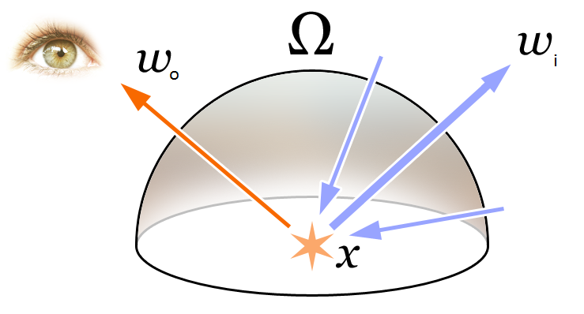

# 实际应用

## BxDF 与 BRDF的分类

BxDF一般而言是对BRDF、BTDF、BSDF、BSSRDF等几种双向分布函数的一个统一的表示。

其中，BSDF可以看做BRDF和BTDF更一般的形式，而且BSDF = BRDF + BTDF。

而BSSRDF和BRDF的不同之处在于，BSSRDF可以指定不同的光线入射位置和出射位置。

在上述这些BxDF中，BRDF最为简单，也最为常用。因为游戏和电影中的大多数物体都是不透明的，用BRDF就完全足够。而BSDF、BTDF、BSSRDF往往更多用于半透明材质和次表面散射材质。

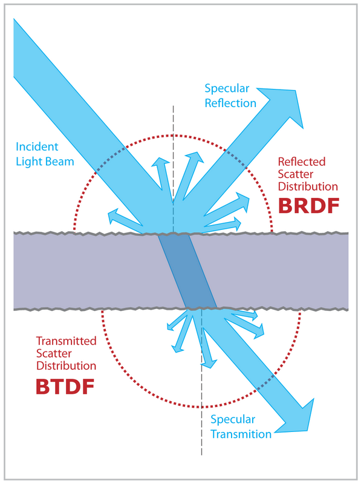

图 BSDF：BRDF + BTDF

我们时常讨论的PBR中的BxDF，一般都为BRDF，对于进阶的一些材质的渲染，才会讨论BSDF等其他三种BxDF。

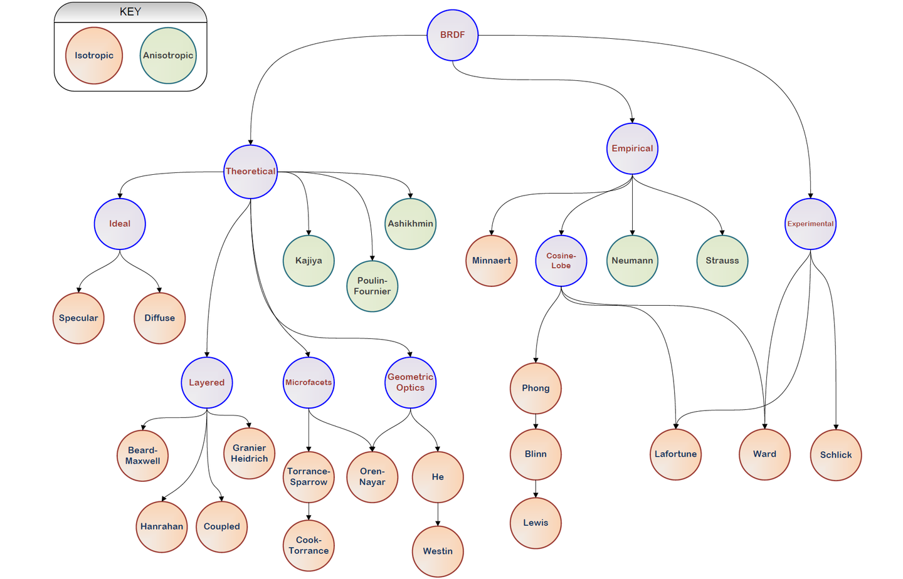

## 迪士尼原则的BRDF（Disney Principled BRDF）

在2012年迪士尼原则的BRDF被提出之前，基于物理的渲染都需要大量复杂而不直观的参数，此时PBR的优势，并没有那么明显。

在2012年迪士尼提出，他们的 **着色模型是艺术导向（Art Directable）的，而不一定要是完全物理正确（physically correct）** 的，并且对微平面BRDF的各项都进行了严谨的调查，并提出了清晰明确而简单的解决方案。

迪士尼的理念是开发一种“原则性”的易用模型，而不是严格的物理模型。正因为这种艺术导向的易用性，能让美术同学用非常直观的少量参数，以及非常标准化的工作流，就能快速实现涉及大量不同材质的真实感的渲染工作。而这对于传统的着色模型来说，是不可能完成的任务。

迪士尼原则的BRDF（Disney Principled BRDF）核心理念如下：

1. 应使用直观的参数，而不是物理类的晦涩参数。
2. 参数应尽可能少。
3. 参数在其合理范围内应该为0到1。
4. 允许参数在有意义时超出正常的合理范围。
5. 所有参数组合应尽可能健壮和合理。

以上五条原则，很好地保证了迪士尼原则的BRDF的易用性。

以上述理念为基础，迪士尼动画工作室对每个参数的添加进行了把关，最终得到了一个颜色参数（baseColor）和下面描述的十个标量参数：

* **baseColor（基础色）** ：表面颜色，通常由纹理贴图提供。
* **subsurface（次表面）** ：使用次表面近似控制漫反射形状。
* **metallic（金属度）** ：金属（0 =电介质，1=金属）。这是两种不同模型之间的线性混合。金属模型没有漫反射成分，并且还具有等于基础色的着色入射镜面反射。
* **specular（镜面反射强度）** ：入射镜面反射量。用于取代折射率。
* **specularTint（镜面反射颜色）** ：对美术控制的让步，用于对基础色（base color）的入射镜面反射进行颜色控制。掠射镜面反射仍然是非彩色的。
* **roughness（粗糙度）** ：表面粗糙度，控制漫反射和镜面反射。
* **anisotropic（各向异性强度）** ：各向异性程度。用于控制镜面反射高光的纵横比。（0 =各向同性，1 =最大各向异性）
* **sheen（光泽度）** ：一种额外的掠射分量（grazing component），主要用于布料。
* **sheenTint（光泽颜色）** ：对sheen（光泽度）的颜色控制。
* **clearcoat（清漆强度）** ：有特殊用途的第二个镜面波瓣（specular lobe）。
* **clearcoatGloss（清漆光泽度）** ：控制透明涂层光泽度，0 =“缎面（satin）”外观，1     =“光泽（gloss）”外观。

每个参数的效果的渲染示例如下图所示。

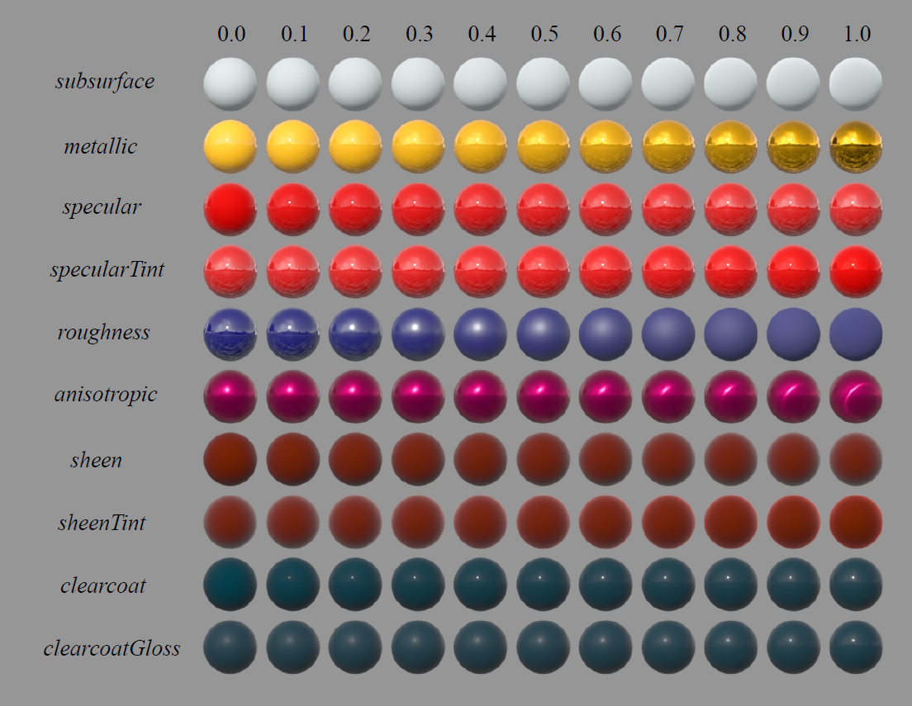

## 迪士尼原则的BSDF（Disney Principled BSDF）

随后的2015年，迪士尼动画工作室在Disney Principled BRDF的基础上进行了修订，提出了Disney Principled BSDF [Extending the Disney BRDF to a BSDF with Integrated Subsurface Scattering, 2015]。

以下是开源三维动画软件Blender实现的Disney Principled BSDF的图示：

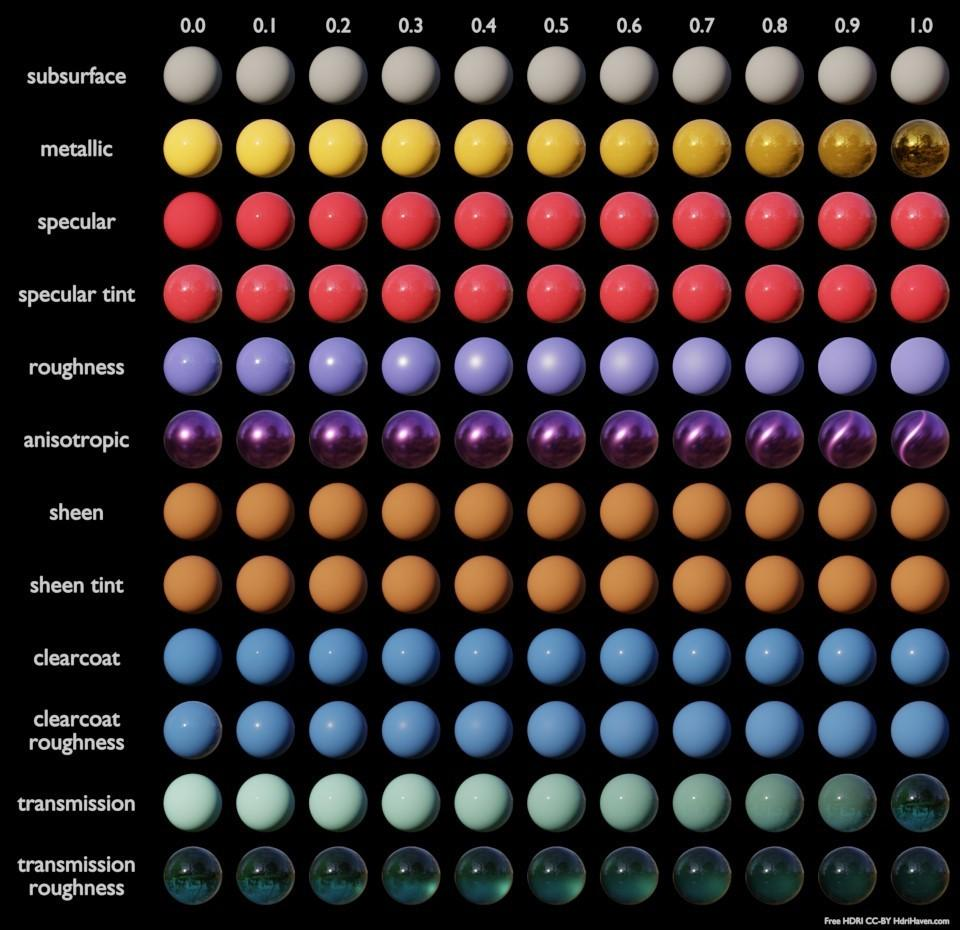

## 漫反射BRDF模型

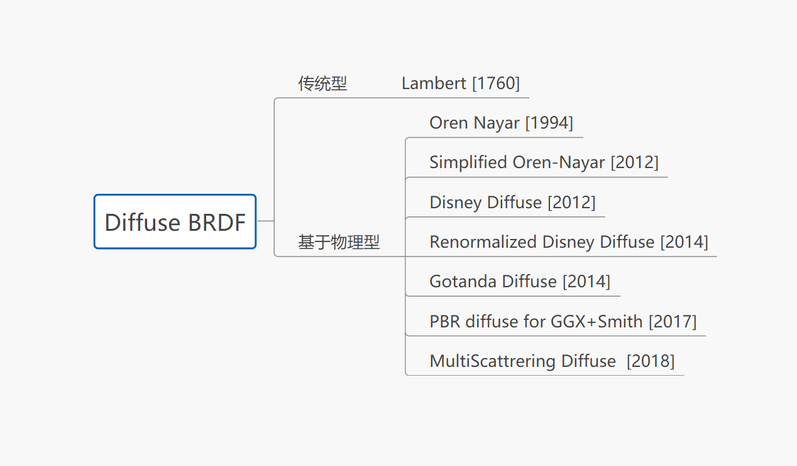

Diffuse BRDF可以分为传统型和基于物理型两大类。其中，传统型主要是众所周知的Lambert。

而基于物理型，从1994年的Oren Nayar开始，这里一直统计到今年（2018年）。

其中较新的有GDC 2017上提出的适用于GGX+Smith的基于物理的漫反射模型（PBR diffuse for GGX+Smith），也包含了最近在SIGGRAPH2018上提出的，来自《使命召唤：二战》的多散射漫反射BRDF（MultiScattrering Diffuse BRDF）：

* Oren Nayar[1994]
* Simplified Oren-Nayar [2012]
* Disney Diffuse[2012]
* Renormalized Disney Diffuse[2014]
* Gotanda Diffuse [2014]
* PBR diffuse for GGX+Smith [2017]
* MultiScattrering Diffuse BRDF [2018]

## 镜面反射BRDF模型

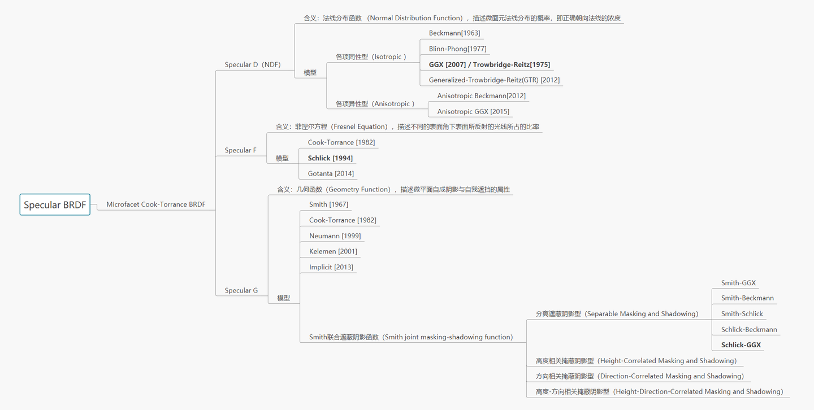

上图加粗部分为目前业界较为主流的模型。

游戏业界目前最主流的基于物理的镜面反射BRDF模型是基于微平面理论（microfacet theory）的Microfacet Cook-Torrance BRDF，也就是我们前文讲到的那个模型。

## 总结

至于DFG的具体方程选择，还有IBL这些内容，虽然算是PBR的重要部分，但是限于篇幅，之后我会重新详细讲解一次。本文的内容应该已经能够到达一个大致入门PBR的水平，具体的细分方向，例如布料、次表面散射这些内容，就算是进阶内容了。

希望读完本文后，您能或多或少有些收获。
