本文是关于Granite中FrameGraph实现细节的记录，希望可以帮助到同学们理解FrameGraph的实现。

## 现代引擎中的解决方案

### Frostbite：Frame Graph（FG）

FG 由 RenderPass 以及其依赖的 Resource 组成。RenderPass 定义了一个完整的渲染操作，Resource 包括了 RenderPass 使用的 PSO、Texture、RenderTarget、ConstantBuffer、Shader 等资源。每个 RenderPass 都有 Input 和 Output 资源，这样 RenderPass 和 Resource 就形成了有向非循环图（DAG）结构，因为描述的是引擎在一帧内的渲染流程，所以称之为 Frame Graph，下图是 FG 的一个例子：

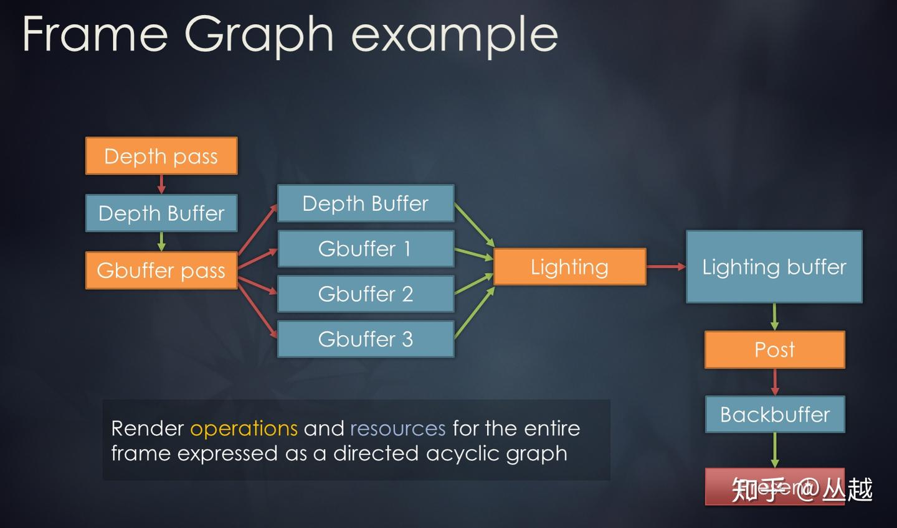

此外，FG 还包括对资源的调度管理，跟踪资源的生命周期，降低资源的消耗。由于是图的形式，因此可以很容易以可视化的方式呈现一帧内的渲染流程，还可以观察每个 RenderPass 依赖的资源，或者反过来看每个资源都被哪些 RenderPass 所使用。

Frostbite 引擎作为 EA 所有工作室的通用引擎，无需考虑授权问题，可以直接通过 C++ 方式提供渲染管线的扩展能力，这样就可以无障碍的访问引擎内部渲染接口和数据，无疑是非常方便的。

### Unity：Scriptable Render Pipeline（SRP）

Unity 并没有使用 FG 的概念，而是通过直接暴露引擎渲染核心接口的方式提供可扩展的能力。这称之为 SRP。2018.4 版本 Rendering 的 Classes 只有十几个，甚至都没有 RenderPipeline 这个类，而到了 2019.1 版本，这个数字扩张了 3 倍，将近 50 个 Classes，新的接口包括：RenderPipeline、ScriptableRenderContext、ScriptableCullingParameters 等等，这些新的接口几乎都是为 SRP 提供基础服务支持的。在 SRP 基础上，Unity 提供了官方的 2 条自定义管线：HDRP 和 LWRP，分别用于高端渲染和低端渲染，高端对应 PC\主机平台，低端对应移动平台。而且如果开发者有能力的话可以创建满足自己要求的自定义管线。

Unity 的引擎核心 C++ 源码需要特定授权才能获取，仅仅通过 C++ 方式提供可扩展机制无法满足广大没有引擎源码授权的开发者，于是 Unity 提供了通过 C# 脚本扩展渲染管线能力，这样任何使用 Unity 引擎开发者都可以定制自己的 Rendering Pipeline，这也是命名为 "Scriptable" 的主要原因。通过 C# 脚本而非 C++ 方式扩展渲染管线，对开发者来说更加友好，难度也会更低些。而且可以充分利用脚本优势，比如快速迭代、编辑后立即生效、可调试等等。

Unity 虽然在 2017 年就提出了 SRP 概念，但直到今年 2019.1 版本 SRP 才真正稳定下来合并到正式版本中。这前后花了 1 年多的时间逐步完善。由此可见这种改进对原有管线架构的修改一定是相当大的。从 Unity SRP 目前暴露的 C# API 来看，还是有些“固定”的，SRP 的流程基本还是内置在引擎 C++ 逻辑中，只是在流程中的关键点上提供了脚本化的接口，和 Frostbite 引擎相比，可定制化能力要差了一些。另外为了满足更多更复杂的自定义需求，要暴露出足够多的引擎核心 C++ 渲染接口，而这需要 Unity 不断推出新版本才行。但无论怎样，与 UE4 相比，在通用商业引擎中渲染管线的可扩展方面，Unity 表现的更加先进。

## 为什么需要Frame Graph？

渲染管线在游戏引擎当中是指完成一帧渲染流程逻辑。这将包括了游戏引擎所支持的渲染Feature以及资源管理等等。在游戏引擎中这些一般都是固化下来的，比如游戏引擎中的Forward或者Deferred Render Path，这些大部分游戏引擎都会支持。当然还有各种后处理Feature(比如Blomm或者DOF等等)。这些都是固化在游戏引擎中，但是随着越来越多的渲染需求来说，现在这种将渲染管线固化在游戏引擎的做法无法满足现有需求并且十分不灵活并难以扩展。这些可以以下几点体现：

* 首先现在游戏的渲染风格就很多样，比如偏写实或者偏卡通或者是每个游戏都有着各自的风格化渲染等，这种固化的渲染管线将无法满足多种不同的风格化渲染的需求。需要更好扩展性才能够满足开发者的需求。
* 硬件差异的问题，现在游戏大多都会多平台上线包括PC和移动端乃至是主机，但是每个硬件差异很大包括硬件Feature支持程度的不同以及GPU架构差异导致的优化手段和侧重点不同。在固化的渲染管线当中将会出现大量的条件编译和路径选择来适配不同平台，这将导致整体渲染管线的维护越来越难。对于移动端来说，由于硬件和图形API的限制不可能达到 PC 和主机相同的画质，并且由于 CPU\GPU 架构不同，整体渲染流程也和PC和主机有所差异。需要不同的渲染管线才可以在移动端平台上获得最大的性能。这些也都需要灵活可配置的渲染管线来支持。
* 在之前在游戏引擎中已经内置的Forward和Deferred Render Path，但是现在各种Render Path正在飞速的发展，比如后续的Foward+以及对应的Tile Base Deferred，还有Clustered Forward以及Clustered Deferred这些不同的Render Path，那么对应的渲染管线也需要修改，整体的维护成本也很高。

复杂的渲染系统如下所示，在这一套渲染系统中耦合相当严重导致维护、扩展和合并/整合的成本很高。并且这一套渲染管线功能繁多十分复杂，一旦出了Bug并难以定位。如果需要扩展新的功能的话，需要修改大量的代码导致难以维护。

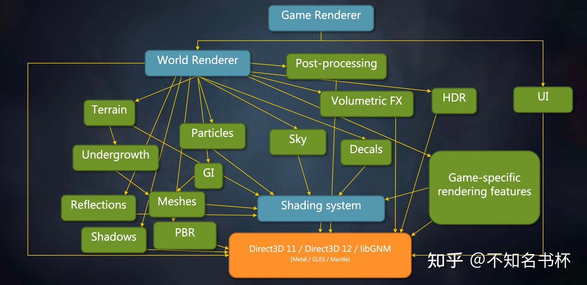

并且之前的渲染架构对于现代图形API是不合适的，比如是执行模型(同步和异步)/多线程/内存模型(现代图形API可以自己完成内存管理)问题等等。现代图形API向开发者开放了相当多的能力，如果这些全部向游戏开发者开放这些细节，这些细节将淹没无数的开发者。游戏引擎作为抹平这些信息的中间层，也需要一个新的渲染架构来面对现代图形API的挑战。所以游戏引擎非常有必要实现一种机制可以良好地掌控现代图形API带来的性能优势，并且尽量隐藏现代图形API的复杂性并且让整体渲染架构更加可扩展和便于调试。

## 什么是Frame Graph？

首先Frame Graph是建立在现代图形API之上，Frame Graph是一个新的渲染框架并在GDC2017中由Frostbite提出，Frame Graph由RenderPass和以及Resource构成。其中RenderPass的概念和Vulkan基本是一致它们都是一份元数据定义了一个完整的渲染流程需要用到的所有资源。Resource则代表了RenderPass使用的 Pipeline State Object、Texture、RenderTarget、ConstantBuffer、Shader等资源。每个RenderPass都会指定对应的Input和Output资源，这样RenderPass和Resource就形成了有向非循环图（DAG）结构。并且Frame Graph可以获得一帧的所有的信息，所以也被成为Frame Graph。如下图所示：


并且由于Frame Graph有着完整一帧的全部信息，可以通过分析的各个RenderPass之间依赖关系来完成一些优化的操作。由于RenderPass和Resource的依赖关系是一个DAG的形式也可以很方便的做到可视化，这将对现代游戏的复杂渲染管线的调试来说有着很大的帮助。并且拥有一帧的完整信息可以帮助简化渲染管线的配置，允许渲染模块更加独立和高效。

拥有完整的一帧的所有信息还可以帮助解决一个在现代图形API中棘手的问题那就是同步，首先拥有所有的Pass信息可以知道Pass之间的执行依赖关系以及它们各自的Input和Output资源可以确定其中的资源依赖。在这里就可以做很多关于Barrier的优化，可以合理按批次的处理Barrier。并且选择最优的同步点，保证并行度尽量高的方案以减少GPU侧的停顿。如下所示，在这里可以分析各个Pass的依赖关系，可以批次处理Barrier或者Resource的布局过渡的情况减少GPU的停顿。

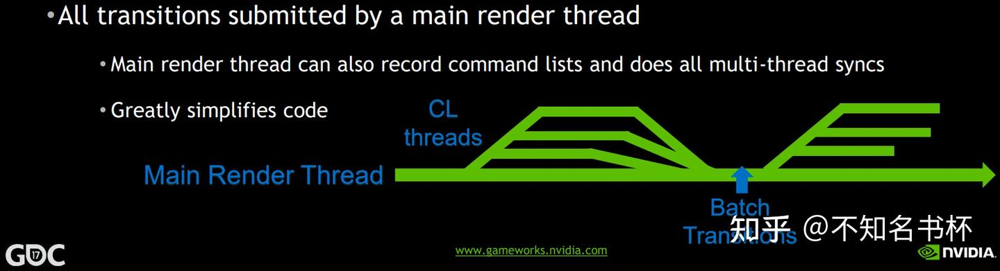

Frame Graph还可以很好的处理Async Compute，Async Compute也就是使用Computer Queue的来完成某些计算，并且Computer Queue是和Graphics Queue是并行的，两者互补干扰，这样就完成一些额外的计算逻辑(比如一些耗时的并且本帧用不到的数据，可以通过Async Compute提前计算)，如下所示可以同时计算一些SSAO相关的数据可以和其他的渲染命令并行，打满GPU侧的负载。

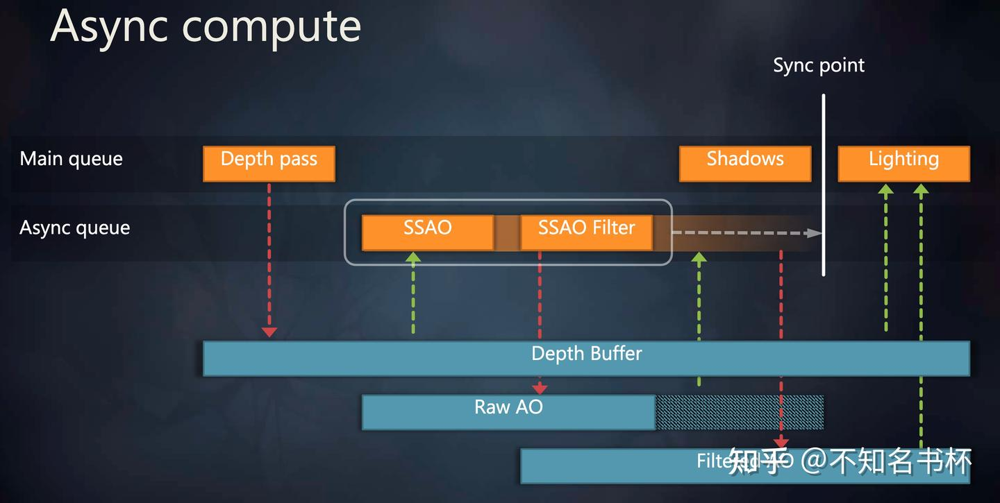

但是这就带来了同步的问题，因为将SSAO 与 SSAO Filter和MainPass异步执行，由于两个Pass异步执行就无法在异步执行的过程中对Raw AO进行内存回收。但是通过FrameGraph有一帧的完整信息也可以推导出相应依赖的关系，控制这个Sync Point放在另外一个Queue使用该资源的时机以获取最佳性能。并且这些资源的生命周期会被延长到这个Sync Point，保证数据的正确性。

此外Frame Graph还有Transient Resources System来帮助分配和调度资源，并且在现代图形API中可以利用其物理内存和逻辑内存相分离的特性通过**Memory Aliasing**充分复用物理内存以减少整体的内存占用。在这里可以通过例子来结合理解。如下所示，这是一些内存依赖关系，需要保证写后读内存可用，并且在读取前内存可见以避免读取到不正确的数据。并且这里用到三块不同的物理内存。

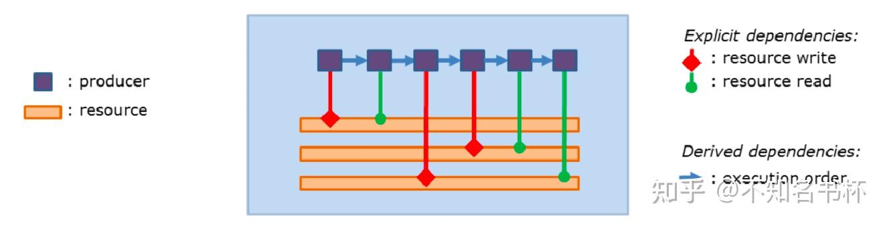

首先还是分析各个Pass之间的依赖关系，然后可以确定每个Resource生命周期的范围。如下所示可以看到有两块逻辑内存是可以通过使用Memory Aliasing来共用同一个物理内存的，这样就可以减少内存的占用。

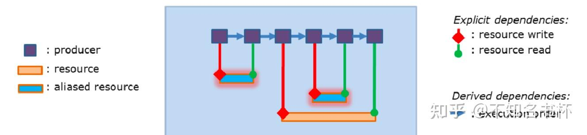

所以通过FrameGraph可以实现精确的自动化的资源跟踪和执行依赖以及内存依赖管理，自动跟踪资源生命周期以确定是否可以启用Memory Aliasing的选项，自动跟踪资源访问同步，用户也可以添加手动同步，以更好地匹配工作负载。如下所示：

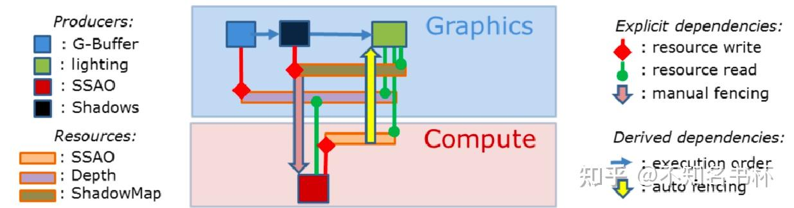

## Frame Graph 设计

Frame Graph的运行流程主要为三个阶段分别为Setup/Compile/Execute。如下所示：

* Setup 阶段：主要用于来收集RenderPass中定义Input和Output所使用的Resource。
* Compile 阶段：根据 Setup阶段获取的所定义的Resource来决定真正需要执行的渲染命令，并且裁剪掉不被执行的命令所依赖资源等等。
* Execute 阶段：是真正执行渲染逻辑的阶段。在这个阶段可以直接调用图形API将渲染命令和 GPU 资源提交到GPU中完成真正的渲染。

如下图所示，接下来会详细介绍这每一步都做了什么。

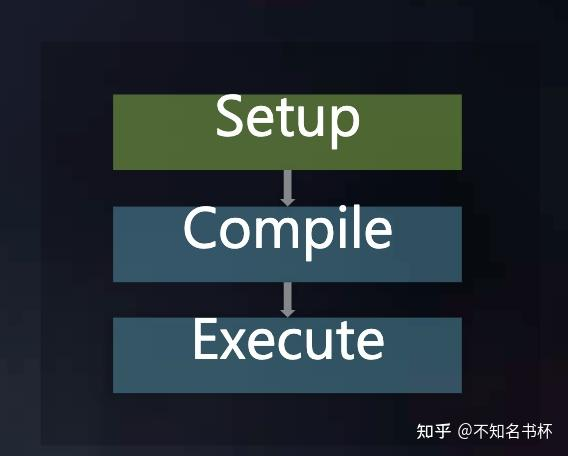

### Setup

Frame Graph是由多个RenderPass来组成的，并且通过RenderPass来组织整体渲染流程，这些RenderPass都需要定义Input和Output的Resource参数设置以及对这些Resource会做什么操作(读写操作等等)。每个RenderPass都需要在Frame Graph提前注册声明这些Resource，并且RenderPass只会使用本身声明过的Resource，其他Pass的输出数据对当前Pass应该是只读且数据安全性不可保证的，并且绝对不应该定义全局静态数据。如果一个Render Pass需要使用另一个Render Pass的数据，则必须调用多线程系统使被依赖的Render Pass确保在依赖的Render Pass之前执行完毕以保证执行依赖和内存依赖的正确性。这些原则是保证Frame Graph是Code-driven甚至是Data-driven的基础，在这里只会让逻辑跟逻辑之间相互依赖，而数据(比如内存数据)和相关逻辑解耦。

### 为什么这样处理？

定义好这些Resource的信息和操作是为了什么呢？因为并不希望开发者来手动管理这些Resource，如果需要手动管理这对于程序员来说无疑是痛苦的，尤其是管理这些Resource的同步，首先是基础做法是将这些同步即时处理，每当开始对Resource开始操作时都需要开发者问自己一个问题，那就是这个资源是否有需要同步来完成一些操作？ 如果是的话则立马处理。这种对于资源状态的跟踪显然会变得非常痛苦，因为可能会读取一个资源1000多次，但是只对它写一次，如果即时同步的话，这肯定消耗不少性能。并且在多线程的情况下如果两个线程发现需要一个Barrier怎么办？总有一个线程需要"赢"得这个资源，反而多了更多的跨线程同步情况需要处理。如果真的需要这样的同步的话等于开历史倒车(不是)。在OpenGL的驱动中这些优化已经做的很好了，为啥还需要自己再重新实现一遍？

另外一个问题是现代图形API让开发者自己显示控制每一个同步点，这对于一些简单的渲染管线来说是没问题的，但是在渲染管线十分复杂的情况下，渲染管线会被分割成不同的部分，每当你在这里和那里添加了一个新Feature或者一些新的步骤，那么必须意识到需要重做你的同步策略。这是十分低效率的，并且会导致你的渲染管线难以扩展，这些都是难以接受的。

通过Frame Graph在RenderPass中提前声明这些Resource的状态和操作，所有Resource的管理全部交给Frame Graph。Frame Graph可以确定这个Resource的生命周期，什么时候会被回收或者拥有足够信息来判断是否可以使用Memory Aliasing来节省内存占用等等。通过这个Setup阶段，FrameGraph便可以获取到完整的一帧所有信息，可以利用这些信息来做到很多优化，可以推导Resource在最终创建时的各种参数，比如可以根据Input Resource的format/size来推导最佳的参数等等。

但是需要注意的是在Setup阶段这些Resource来说是没有真正申请对应的物理内存的。这里可能只是一个handle，当然有一些特例的存在，有些永久资源会直接通过API创建(包括不会改变的全局常量、每帧会复用的数据等等)，它们会被放入到Frame Graph中一起进行管理。

### 伪代码

```cpp
RenderGraph graph;
graph.set_device(device);
AttachmentInfo emissive, albedo, normal, pbr, depth; 
// 设置这些Attachment的信息
.........
// 提前声明对应的light Pass
auto &lighting = graph.add_pass("lighting", VK_PIPELINE_STAGE_ALL_GRAPHICS_BIT);
// 声明所需要的
lighting.add_color_output("HDR", emissive, "emissive");
lighting.add_attachment_input("albedo");
lighting.add_attachment_input("normal");
lighting.add_attachment_input("pbr"));
lighting.add_attachment_input("depth");
lighting.set_depth_stencil_input("depth");
```

上面做的这些就是完成了一个简单的Setup阶段。定义好了对应的RenderPass以及Input和Output的Resource的状态和操作，如下所示：

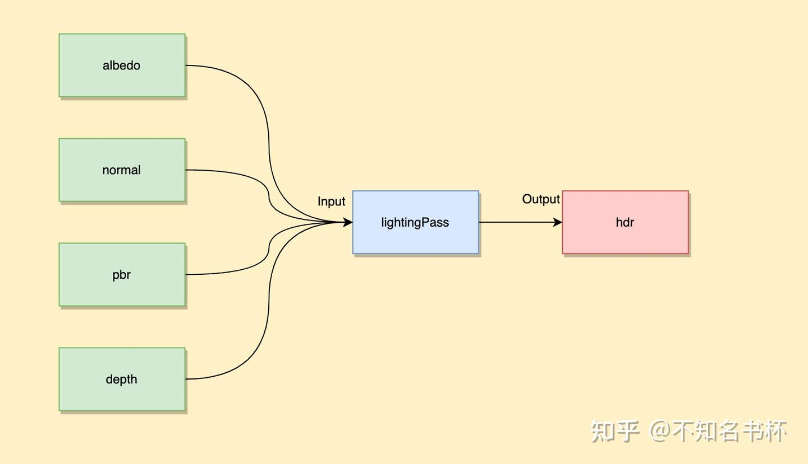

### Compile

在完成了Setup阶段之后接着就是Compile阶段，Compile阶段是不开放给开发者控制的并且所有工作全部都是自动完成。在Frame Graph中没有引用到Resource以及RenderPass都会被裁剪掉。首先这对于Setup阶段的各种设置可以稍微放宽一点，因为多余的Resource和RenderPass会被剔除掉并不会真正的进入渲染流程中。同时也简化了Debug流程，如下所示。在Frame Graph会有一个Debug模块，假如不需要的时候，这些Debug模块依赖的Resoruce和RenderPass都会被裁剪掉。当需要Debug时，只需要加上Move Pass，这样Lighting Pass和Post Pass和与之依赖Resoruce都会自动被裁剪掉，这会帮助更好的解耦每个Pass。

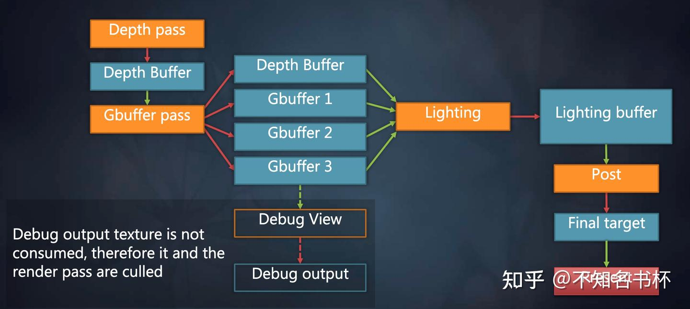

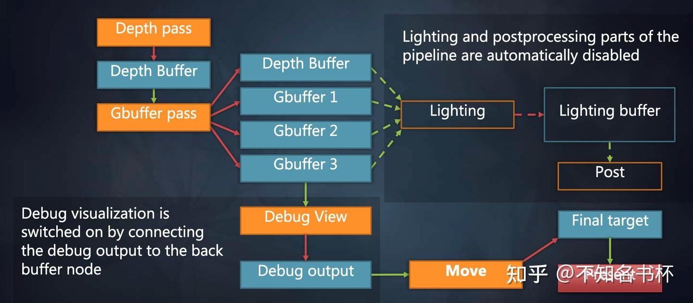

并且在Setup阶段中Frame Graph已经掌握了完整的一帧信息，还可以做到如下操作：

* 自动分析Setup阶段设置的Resource以及RenderPass参数是否合理，并且推导出在该Resource创建时的最佳参数设置。
* 自动分析各个Pass之间的依赖关系，自动进行可能的Pass的重新调度(Pass重排序或者Pass合并，比如在Tile Base中将其多个RenderPass视为为多个Subpass合并为一个RenderPass。这会在带宽上会获取到收益，这对于Tile Base的GPU至关重要)。
* 检查同步问题，在确保执行和内存依赖关系正确的前提，寻找最优同步点，提高整体图形管线的并行度以减少GPU侧的停顿。
* 自动分析Resource的生命周期，确定其Resource释放时机，可以判断是否可用于Memory Aliasing来复用物理内存。

### Execute

到了Execute阶段反而是最简单的了。在完成Compile阶段之后，在Execute阶段只需要申请好真正GPU内存并且调用各个Pass的Execute函数即可(也就是调用各种set State以及Draw或者Dispatch各种命令)。但是在这个阶段就需要创建真正的GPU资源了。

## Granite中的RenderGraph研读

Granite的Frame Graph还是只围绕Vulkan作为后端来实现的。所以部分概念会比较贴近于Vulkan，如果没有相关Vulkan基础读起来可能会一头雾水。

Frame Graph实现是Granite的，该仓库链接如下：

::github{repo="Themaister/Granite"}

关于Frame Graph的代码主要集中在render_graph.hpp以及render_graph.cpp这两个文件内。

### RenderResource

首先来看看如何来封装Resource概念。整体结构如下所示：

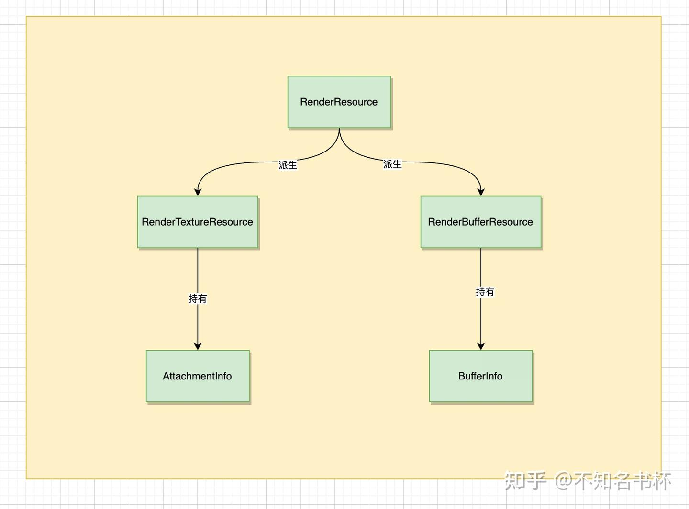

RenderTextuerResource/RenderBufferResource由RenderResource派生而来，对应到Texture和Buffer。Attachment和BufferInfo也就是是Resource本身的属性设置(比如Buffer的size或者是usage，再者是Texture的format和usage等，在这不多赘述)。接下来看看RenderResource是如何设计的吧。

```cpp
enum RenderGraphQueueFlagBits
{
    RENDER_GRAPH_QUEUE_GRAPHICS_BIT = 1 << 0,
    RENDER_GRAPH_QUEUE_COMPUTE_BIT = 1 << 1,
    RENDER_GRAPH_QUEUE_ASYNC_COMPUTE_BIT = 1 << 2,
    RENDER_GRAPH_QUEUE_ASYNC_GRAPHICS_BIT = 1 << 3
};

class RenderResource
{
public:
    enum class Type
    {
        Buffer,
        Texture,
        Proxy
    };
    enum { Unused = ~0u };
    RenderResource(Type type_, unsigned index_)
        : resource_type(type_), index(index_)
    virtual ~RenderResource() = default;
    Type get_type() const
    void written_in_pass(unsigned index_)
    void read_in_pass(unsigned index_)
    const std::unordered_set<unsigned> &get_read_passes() const
    const std::unordered_set<unsigned> &get_write_passes() const
    std::unordered_set<unsigned> &get_read_passes()
    std::unordered_set<unsigned> &get_write_passes()
    unsigned get_index() const
    void set_physical_index(unsigned index_)
    unsigned get_physical_index() const
    void set_name(const std::string &name_)
    const std::string &get_name() const
    void add_queue(RenderGraphQueueFlagBits queue)
    RenderGraphQueueFlags get_used_queues() const

private:
    Type resource_type;
    unsigned index;
    unsigned physical_index = Unused;
    std::unordered_set<unsigned> written_in_passes;
    std::unordered_set<unsigned> read_in_passes;
    std::string name;
    RenderGraphQueueFlags used_queues = 0;
};
```

在这里来解释各个对象属性和方法的各自作用如下：

* written_in_passes和written_in_pass() 方法主要是用于记录该RenderResource被多少的RenderPass执行写操作，每个RenderPass调用written_in_pass()传入的index都是独一无二的，会持续递增。
* read_in_passes和read_in_pass()和上面written_in_passes功能基本一致，不过记录的是该RenderResource被哪些RenderPass执行读操作。
* type：代表的是该Resource的类型主要分为三种Buffer/Texture/Proxy(用于Async Compute)，可通过get_type()获取，构造RenderResource后便不可修改。
* name：代表是该Resource的名称，RenderGraph有一个map容器来管理所有的RenderResource，并且会根据name来获取到对应RenderResource。通过set_name()和get_name()操作该字段。
* index：代表是该RenderResource的索引，在构造RenderResource对象会被传入该index(每多创建一个RenderResource，构造时传入的index会递增)，可通过get_index()获取。
* used_queues：代表是该Resource将被用于的操作，如果是被用于Async Computer或者Graphics，对应的used_queues也会不同。
* physical_index：代表是该RenderResource的索引，后续用于获取对应的ResourceDimensions。

RenderResource基本设计就是如此，可以看出Frame Graph的一些设计原则了，首先是确定了Resource的用途，在不同的RenderPass当中可能会有不同的操作(读或写)。并且使用了一个used_queues字段来区分会被什么形式使用，如果是被使用于Async Computer，那么该Resource的生命周期可能需要被延长。RenderBufferResource和RenderTextureResource也只是衍生出容纳各自Buffer或者Texture信息的相关方法和容器。

### ResourceDimensions

```cpp
struct ResourceDimensions
{
    VkFormat format = VK_FORMAT_UNDEFINED;
    BufferInfo buffer_info;
    unsigned width = 0;
    unsigned height = 0;
    unsigned depth = 1;
    unsigned layers = 1;
    unsigned levels = 1;
    unsigned samples = 1;
    AttachmentInfoFlags flags = ATTACHMENT_INFO_PERSISTENT_BIT;
    VkSurfaceTransformFlagBitsKHR transform = VK_SURFACE_TRANSFORM_IDENTITY_BIT_KHR;
    RenderGraphQueueFlags queues = 0;
    VkImageUsageFlags image_usage = 0;
     bool operator==(const ResourceDimensions &other) const{
		return format == other.format &&
		       width == other.width &&
		       height == other.height &&
		       depth == other.depth &&
		       layers == other.layers &&
		       levels == other.levels &&
		       buffer_info == other.buffer_info &&
		       flags == other.flags &&
		       transform == other.transform;
		// image_usage is deliberately not part of this test.
		// queues is deliberately not part of this test.
     }

}
```

顾名思义这个结构用来表达RenderResource的尺寸或者是说维度，为什么需要一个这样的结构体呢？这是因为后续会将所有的RenderResource都处理为ResourceDimensions。这也是为后续的Memory Ailas做准备，因为不同资源的逻辑内存并不相同，但是只要对应的ResourceDimensions相同，则代表所示的物理内存的大小也是相同，这便是[Memory Alias](https://zhida.zhihu.com/search?content_id=230309940&content_type=Article&match_order=1&q=Memory+Alias&zhida_source=entity)的基础。注意这里image_usage和queues并不在ResourceDimensions是否相等的判断内。

### RenderPass

在RenderPass中主要处理各种Resource的设置和各种回调函数的设置，以便后续在Compile阶段中的操作。

```cpp
class RenderPass
{
public:
    RenderPass(RenderGraph &graph_, unsigned index_, RenderGraphQueueFlagBits queue_)
        : graph(graph_), index(index_), queue(queue_)

    enum { Unused = ~0u };

    RenderTextureResource &set_depth_stencil_input(const std::string &name);
    RenderTextureResource &set_depth_stencil_output(const std::string &name, const AttachmentInfo &info);
    RenderTextureResource &add_color_output(const std::string &name, const AttachmentInfo &info, const std::string &input = "");
    RenderTextureResource &add_resolve_output(const std::string &name, const AttachmentInfo &info);
    RenderTextureResource &add_attachment_input(const std::string &name);
    RenderTextureResource &add_history_input(const std::string &name);
    RenderTextureResource &add_texture_input(const std::string &name,
                                             VkPipelineStageFlags2 stages = 0);
    RenderTextureResource &add_blit_texture_read_only_input(const std::string &name);
    RenderBufferResource &add_uniform_input(const std::string &name,
                                            VkPipelineStageFlags2 stages = 0);
    RenderBufferResource &add_storage_read_only_input(const std::string &name,
                                                      VkPipelineStageFlags2 stages = 0);
    RenderBufferResource &add_storage_output(const std::string &name, const BufferInfo &info, const std::string &input = "");
    RenderBufferResource &add_transfer_output(const std::string &name, const BufferInfo &info);
    RenderTextureResource &add_storage_texture_output(const std::string &name, const AttachmentInfo &info, const std::string &input = "");
    RenderTextureResource &add_blit_texture_output(const std::string &name, const AttachmentInfo &info, const std::string &input = "");
    RenderBufferResource &add_vertex_buffer_input(const std::string &name);
    RenderBufferResource &add_index_buffer_input(const std::string &name);
    RenderBufferResource &add_indirect_buffer_input(const std::string &name);
    void add_proxy_output(const std::string &name, VkPipelineStageFlags2 stages);
    void add_proxy_input(const std::string &name, VkPipelineStageFlags2 stages);
    void add_fake_resource_write_alias(const std::string &from, const std::string &to);
    RenderBufferResource &add_generic_buffer_input(const std::string &name,
                                                       VkPipelineStageFlags2 stages,
                                                       VkAccessFlags2 access,
                                                       VkBufferUsageFlags usage);

private:
    RenderGraph &graph;
    unsigned index;
    unsigned physical_pass = Unused;
    RenderGraphQueueFlagBits queue;
    RenderPassInterfaceHandle render_pass_handle;
    std::function<void (Vulkan::CommandBuffer &)> build_render_pass_cb;
    std::function<bool (VkClearDepthStencilValue *)> get_clear_depth_stencil_cb;
    std::function<bool (unsigned, VkClearColorValue *)> get_clear_color_cb;
    std::vector<RenderTextureResource *> color_outputs;
    std::vector<RenderTextureResource *> resolve_outputs;
    std::vector<RenderTextureResource *> color_inputs;
    std::vector<RenderTextureResource *> color_scale_inputs;
    std::vector<RenderTextureResource *> storage_texture_inputs;
    std::vector<RenderTextureResource *> storage_texture_outputs;
    std::vector<RenderTextureResource *> blit_texture_inputs;
    std::vector<RenderTextureResource *> blit_texture_outputs;
    std::vector<RenderTextureResource *> attachments_inputs;
    std::vector<RenderTextureResource *> history_inputs;
    std::vector<RenderBufferResource *> storage_outputs;
    std::vector<RenderBufferResource *> storage_inputs;
    std::vector<RenderBufferResource *> transfer_outputs;
    std::vector<AccessedTextureResource> generic_texture;
    std::vector<AccessedBufferResource> generic_buffer;
    std::vector<AccessedProxyResource> proxy_inputs;
    std::vector<AccessedProxyResource> proxy_outputs;
    RenderTextureResource *depth_stencil_input = nullptr;
    RenderTextureResource *depth_stencil_output = nullptr;
    std::vector<std::pair<RenderTextureResource *, RenderTextureResource *>> fake_resource_alias;
    std::string pass_name;
};
```

可以看出RenderPass的整体设计，在RenderPass主要用于处理各种RenderResource状态并存入对应的容器当中。并且在RenderPass还有诸多回调函数，将在不同的时机被调用，如下所示：

* build_render_pass_cb： 相当于Frame Graph中的每个RenderPass的Execute函数，会执行具体的渲染逻辑(Draw/Dispatch 命令等等)。
* get_clear_depth_stencil_cb： 用于设置该RenderPass的VkClearDepthStencilValue值。
* get_clear_color_cb： 用于设置该RenderPass的VkClearColorValue值。

### RenderPassInterface

关于这些回调函数内部还封装了一个RenderPassInterface对象用于设置各种回调函数以便于复用。如下所示：

```cpp
class RenderPassInterface : public Util::IntrusivePtrEnabled<RenderPassInterface,
        std::default_delete<RenderPassInterface>,
        Util::SingleThreadCounter>
{
public:
    virtual ~RenderPassInterface() = default;
    // This information must remain fixed.
    virtual bool render_pass_is_conditional() const;
    virtual bool render_pass_is_separate_layered() const;
    // Can change per frame.
    virtual bool need_render_pass() const;
    virtual bool get_clear_depth_stencil(VkClearDepthStencilValue *value) const;
    virtual bool get_clear_color(unsigned attachment, VkClearColorValue *value) const;
    // Called once before bake().
    virtual void setup_dependencies(RenderPass &self, RenderGraph &graph);
    // Called once after bake().
    virtual void setup(Vulkan::Device &device);
    // Called every frame, useful for building dependent resources like custom views, etc.
    virtual void enqueue_prepare_render_pass(RenderGraph &graph, TaskComposer &composer);
    virtual void build_render_pass(Vulkan::CommandBuffer &cmd);
    virtual void build_render_pass_separate_layer(Vulkan::CommandBuffer &cmd, unsigned layer);
};
```

* render_pass_is_conditional被用于判断是否要启用Alias。
* render_pass_is_separate_layered 和 build_render_pass_separate_layer都是和MultiView的情况下有关，在这不过多赘述。
* need_render_pass用于判断最后是否需要将该RenderPass提交给GPU去执行。
* get_clear_depth_stencil 和 get_clear_color 和上面的提到的get_clear_depth_stencil_cb和get_clear_color_cb类似，不再赘述。
* setup_dependencies是在bake()执行之前会被调用。
* setup则是在bake()执行完毕后会被调用。
* build_render_pass和build_render_pass_separate_layer则是对应到每个RenderPass的Execute函数，执行对应的渲染逻辑。

### RenderPass操作

RenderPass中处理各种Resource的状态，主要可以分为两种分别是add_xxx_input和add_xxx_output(还有一个特殊是Depth/Stencil的设置，因为在一个RenderPass中只会有一个固定的Depth/Stencil的Input和Output，所以是单独的set_depth_stencil_input和set_depth_stencil_output)。各个函数中的操作(下方演示都只是一个通用操作，某些特别RenderResource的还有其他逻辑在这不一一展示)如下所示：

### add_xxx_input

**Texture**

```cpp
auto &res = graph.get_texture_resource(name);
res.add_queue(queue);
res.read_in_pass(index);
res.add_image_usage(usage);
XXXX_inputs.push_back(&res);
return res;
```

**Buffer**

```cpp
auto &res = graph.get_buffer_resource(name);
res.add_queue(queue);
res.read_in_pass(index);
res.add_buffer_usage(usage);
XXXX_inputs.push_back(&res);
return res;
```

### add_xxx_output

**Texture**

```cpp
auto &res = graph.get_texture_resource(name);
res.add_queue(queue);
res.written_in_pass(index);
res.set_attachment_info(info);
res.add_image_usage(usage);
XXXX_outputs.push_back(&res);
return res;
```

**Buffer**

```cpp
auto &res = graph.get_buffer_resource(name);
res.add_queue(queue);
res.set_buffer_info(info);
res.written_in_pass(index);
res.add_buffer_usage(usage);
XXXX_outputs.push_back(&res);
return res;
```

### RenderGraph

现在到了RenderGraph(Frame Graph这个名字不得人心，大多引擎实现时都重新改名为了RenderGraph)，完成了RenderResourceResource和RenderPass的封装。以下是RenderGraph的一些重要属性和方法(其他的方法将在RenderGraph的具体执行中介绍)。

```cpp
class RenderGraph : public Vulkan::NoCopyNoMove, public EventHandler
{
public:
    RenderGraph();

    void set_device(Vulkan::Device *device_)
    {
        device = device_;
    }

    Vulkan::Device &get_device()
    {
        assert(device);
        return *device;
    }
    RenderPass &add_pass(const std::string &name, RenderGraphQueueFlagBits queue);
    RenderPass *find_pass(const std::string &name);
    RenderTextureResource &get_texture_resource(const std::string &name);
    RenderBufferResource &get_buffer_resource(const std::string &name);
    void set_backbuffer_source(const std::string &name);
    void bake();
    void reset();
    void log();
    void enqueue_render_passes(Vulkan::Device &device, TaskComposer &composer);
private:
    Vulkan::Device *device = nullptr;
    std::vector<std::unique_ptr<RenderPass>> passes;
    std::vector<std::unique_ptr<RenderResource>> resources;
    std::unordered_map<std::string, unsigned> pass_to_index;
    std::unordered_map<std::string, unsigned> resource_to_index;
    std::vector<std::unordered_set<unsigned>> pass_dependencies;
    std::vector<std::unordered_set<unsigned>> pass_merge_dependencies;
    std::string backbuffer_source;
};
```

* add_pass()会返回一个RenderPass对象，所有的RenderPass都通过passes容器中来管理，RenderPass的索引和name的映射关系将通过pass_to_index来存储。如果pass_to_index中没有对应name，则会创建新的RenderPass。
* get_texture_resource()和get_buffer_resource()负责获取对应的RenderResource，所有的RenderResource都会存储在resources容器，RenderResource和name的关系将通过resource_to_index来存储。如果resource_to_index中没有对应name，则会创建新的RenderResource。
* 在这里还有一个特殊的点，RenderGraph负责分配Resource和调用这些回调，并最终以适当的顺序将其提交给GPU。但是Render Graph同样需要一个终点，在这里会将一个特定的资源提升为backbuffer用于最后的给SwapChain去展示。可通过set_backbuffer_source来设置，backbuffer_source存储其RenderResource的name。
* bake()也就是代表Frame Graph中整个Compile阶段的工作。这也是后续讲解的重点。
* enqueue_render_passes()会真正开启向GPU提交Command的流程，每个RenderPass的Exexcute函数也就在这里被调用。
* log()可以在bake()调用完毕之后输出所有相关的帧信息。

## RenderGraph执行流程

现在就到了重头戏了也就是RenderGraph执行流程，在这个部分可能不同引擎的实现都不一样。大家也可以多看看其他引擎的实现。应该也能学到不少。在这里先补充几个Frame Graph的库供大伙参考，如下所示：

::github{repo="acdemiralp/fg"}

::github{repo="google/filament"}

::github{repo="azhirnov/FrameGraph"}

下图是一张总览介绍了bake函数执行全流程，步骤可能比较多。接下来介绍各自都做了什么。

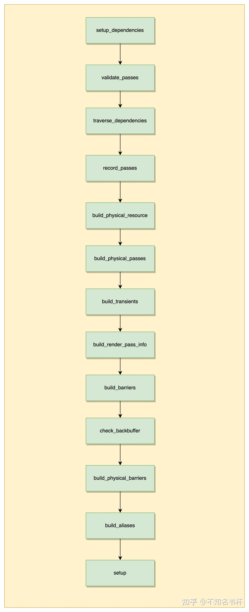

## 相关数据结构

### Barrier

在这里Barrier也就是可以理解为是Vulkan中的各种Barrier比如VkMemoryBarrier等等，但是在这里Barrier只是抽象了一部分，比如Barrier在VkMemoryBarrier可能只是代表srcStageMask和srcAccessMask或者是dstAccessMask和dstStageMask。只能代表一个过程(内存可见或者内存可用)，后续的Barriers才是代表Vulkan中的Pipeline Barrier。主要是分为了两个Barrier容器，分别是invalidate用于存储完成内存可见的过程(代表dstAccessMask和dstStageMask的参数设置)，另外一个flush用于存储完成内存可用的过程(代表srcStageMask和srcAccessMask的参数设置)。

```cpp
struct Barrier
{
    unsigned resource_index;
    VkImageLayout layout;
    VkAccessFlags2 access;
    VkPipelineStageFlags2 stages;
    bool history;
};

struct Barriers
{
    std::vector<Barrier> invalidate;
    std::vector<Barrier> flush;
};
```

* resource_index: 用于标记于是哪个RenderResource需要这些同步。
* layout：也就是该RenderResource后续对应的Layout，Layout Transition也是需要对内存进行读写的，所以需要Barrier来同步。
* access： 保证在某些操作之前内存可见或者是在某些操作后内存可用，根据你将它放在Barrier中srcAccessMask还是dstAccessMask中决定。
* stages： 用于保证其执行依赖的Pipeline Stage。

### PhysicalPass

首先RenderPass代表了一个渲染流程，但是在实际的Vulkan的VkRenderPass中实际上可能会有多个SubPass(最少一个)，实际上PhysicalPass也就是代表VkRenderPass，而RenderPass某种意义上其实是SubPass也可以是一个单独的VkRenderPass，这个转变取决于在什么环境。但是SubPass在移动端上比较重要，因为可以保持是在On Tile上完成渲染便可以节省很多的带宽。而在PC上两者相差不大。所以会尽可能将其合并处理。所以在这里会设计为拥有一个Subpass容器(里面包含一个或者多个Subpass)。

```cpp
struct PhysicalPass{
        std::vector<unsigned> passes;
        std::vector<unsigned> discards;
        std::vector<Barrier> invalidate;
        std::vector<Barrier> flush;
        std::vector<Barrier> history;
        std::vector<std::pair<unsigned, unsigned>> alias_transfer;

        Vulkan::RenderPassInfo render_pass_info;
        std::vector<Vulkan::SubpassInfo> subpasses;
        std::vector<unsigned> physical_color_attachments;
        unsigned physical_depth_stencil_attachment = RenderResource::Unused;

        std::vector<ColorClearRequest> color_clear_requests;
        DepthClearRequest depth_clear_request;

        std::vector<std::vector<ScaledClearRequests>> scaled_clear_requests;
        std::vector<MipmapRequests> mipmap_requests;
        unsigned layers = 1;
};
```

### ResourceState

用于表达每个RenderResource的状态，将在build_physical_barriers被用到。

```cpp
struct ResourceState
{
    VkImageLayout initial_layout = VK_IMAGE_LAYOUT_UNDEFINED;
    VkImageLayout final_layout = VK_IMAGE_LAYOUT_UNDEFINED;
    VkAccessFlags2 invalidated_types = 0;
    VkAccessFlags2 flushed_types = 0;

    VkPipelineStageFlags2 invalidated_stages = 0;
    VkPipelineStageFlags2 flushed_stages = 0;
};
```

## 相关数据容器

* pass_stack: 存储写入backbuffer以及相关依赖的pass
* pass_dependencies: 该容器根据pass中的index获取到unordered_set容器，unordered_set其中包含是该Pass所依赖的其他Pass。
* pass_merge_dependencies: 该容器根据pass中的index获取到unordered_set容器，unordered_set其中包含是该Pass可以合并的pass(通过Subpass合并)。
* physical_dimensions：用于存储所有的ResourceDimensions的容器，通过RenderResource的physical_index来索引。
* swapchain_dimensions： 对应SwapChain的ResourceDimensions。
* physical_passes：储存PhysicalPass的容器，在后续会讲到。

## 执行流程

### setup_dependencies

首先先调用所有RenderPass的RenderPassInterfaceHandle::setup_dependencies。将在bake中所有的操作之前完成该函数。因为封装了RenderPassInterfaceHandle类作为更为状态化的回调函数，可以在多个Pass中复用。因此可以对RenderPassInterfaceHandle做一些扩展或者某些RenderPass在bake前需要做的通用操作都可以放置在setup_dependencies来完成。

### validate_passes

validate_passes的作用是对各个RenderPass的Resource设置检验以确保RenderPass的参数正确，首先是对ColorAttachment/BlitTexture/StorageBuffer/StorageTexture判断是Output和Input的Resource数量是否一致，还有Resolve Output的数量是否是Color Output数量一致，当然还少不了的Depth Stencil。随后是针对相应的设置进行检验，比如如果有Intput的Resource，对应的Output的Resource的设置需要保持一致(Texutre的尺寸和Buffer的size等属性)。这里有一个特殊设置，就是检查Color Input的尺寸是否与Color Output相匹配。如果它们不一致，就不直接做loadOp = LOAD，而是在RenderPass开始时做一个缩放的Blit操作。 这种情况下的loadOp变成了DONT_CARE。

### traverse_dependencies

首先是针对于backbuffer(最后用于展示的图片)有写入操作的RenderPass依次放入pass_stack。通过traverse_dependencies来分析每个Pass之间的依赖关系。通过depend_passes_recursive将递归遍历所有对本RenderPass所有Input Resource有过写入操作的RenderPass并将依赖Pass全部放入pass_stack中。并且统计各个Pass的依赖并放入pass_dependencies。并且针对Color/Input/Depth Attachment做检验以判断是否可以完成合并操作(RenderPass作为VkSubpass合并到一个VkRenderPass中)比不过记录在pass_merge_dependencies中。完成这些操作后pass_stack会按顺序存储所有Pass。但是现在pass_stack中有些Pass是会重复出现的，并且pass之间的顺序是反的(正常的应该是Pass→Pass→backbuffer)。

### depend_passes_recursive

将这个函数将通过written_passes来判断到该Pass依赖written_passes中所有Pass，并且如果特殊的Attachment比如(Color/Input/Depth)则需要额外记录到pass_merge_dependencies当中。并且将该Pass放入pass_stack当中，并且继续调用traverse_dependencies遍历该Pass。

### filter_passes

在这里将对上一步的生成的pass_stack做进一步的处理，清理pass_stack中重复的Pass并且倒置pass_stack。以保证pass_stack中的pass执行顺序是正确的，无依赖的Pass应该提前，有依赖其他Pass的Pass应该在前置Pass之后。

### reorder_passes

reorder_passes将对pass_dependencies和pass_merge_dependencies处理以分析出最好的Pass执行顺序。首先是针对pass_merge_dependencies处理，这会将需要合并的两个Pass，并且合并双方的前置Pass依赖。因为如果需要合并的话则需要两个Pass的所有前置依赖Pass都准备完毕。比如Pass1和Pass5可以合并，但是Pass1可能会依赖其他的Pass。在这里会为Pass5加上Pass1所依赖的Pass。

接下来就是开始Pass的重排序。伪代码如下所示：

```cpp
std::vector<unsigned> flattened_passes {begin(pass_stack)};
std::vector<unsigned> unscheduled_passes {begin(pass_stack)+1, end(pass_stack)};
while(!unscheduled_passes.empty()){
        unsigned best_candidate = 0;
        unsigned best_overlap_factor = 0;
        for (unsigned i = 0; i < unscheduled_passes.size(); i++){
                // 代表可以和其他pass重叠的程度
                unsigned overlap_factor = 0;
                if(pass_merge_dependencies[unscheduled_passes[i]].count(flattened_passes.back())){
                        overlap_factor = Math.max();
                }else{
                  // 判断在flattened_passes中的pass是否有依赖关系，无依赖关系则累加overlap_factor
                    for (auto itr = flattened_passes.rbegin(); itr != flattened_passes.rend(); ++itr)
                    {
                        if (depends_on_pass(unscheduled_passes[i], *itr))
                                break;
                                overlap_factor++;
                    }
                }
                // 不是最合适的话直接忽略
                if(overlap_factor<= best_overlap_factor){
                    continue;
                }
                // 判断该Pass是否和unscheduled_passes中之前的Pass有所依赖
                // 如果依赖则不可以选择
                bool possible_candidate = true;
                for (unsigned j = 0; j < i; j++)
                {
                    if (depends_on_pass(unscheduled_passes[i], unscheduled_passes[j]))
                    {
                        possible_candidate = false;
                        break;
                    }
                }

                if (!possible_candidate)
                    continue;
                best_candidate = i;
                best_overlap_factor = overlap_factor;
        }
        // 将在unscheduled_passes内对应best_candidate的Pass放入flattened_passes中。
        ..........
}
```

### build_physical_resources

在很多情况下，RenderPass对于一个RenderResource来说会有读写修改等操作，比如LightPass中收到一个名为Color的Input，但是输出的可能是名为HDR的Output，但是很显然其实这都是使用的同一个资源，只是用这种抽象的方式来弄清依赖关系，给RenderResource起一些描述性的名字，避免循环。所以在RenderResource中设置一个physical_index字段，并为那些做读-修改-写的RenderResource分配唯一索引。

build_physical_resources处理的也就是RenderResource中的physical_index和physical_dimensions，在这里会遍历每一个RenderPass使用到所有的RenderResource。通过RenderResource获取到对应的ResourceDimension。并且设置其physical_index(每设置一个RenderResource将递增)，具体伪代码如下所示：

```cpp
for(auto &pass_index: pass_stack){
    auto &pass = *passes[pass_index];
    for (auto &input : pass.get_XXX_inputs()){
            // 如果成立则代表该RenderResource还没被使用过
            if (input.texture->get_physical_index() == RenderResource::Unused)
            {
                // 记录该ResourceDimension
                physical_dimensions.push_back(get_resource_dimensions(*input.texture));
                // 设置新的physical_index
                input.texture->set_physical_index(phys_index++);
            }
            else
            {
                // 用过的资源更新其queues以及image_usage
                physical_dimensions[input.texture->get_physical_index()].queues |= input.texture->get_used_queues();
                physical_dimensions[input.texture->get_physical_index()].image_usage |= input.texture->get_image_usage();
            }
            // 针对Color Input和Output或者Storage Texture Input和Output等等
            // Input和Outout共用同一个physical_index，因为本来就是同一个资源使用
            if (pass.get_XXX_outputs()[i]->get_physical_index() == RenderResource::Unused)
                        pass.get_XXX_outputs()[i]->set_physical_index(input->get_physical_index());
                    else if (pass.get_XXX_outputs()[i]->get_physical_index() != input->get_physical_index())
                        throw std::logic_error("Cannot alias resources. Index already claimed.");
    }

    for (auto &input : pass.get_XXX_outputs()){
            if (output->get_physical_index() == RenderResource::Unused)
            {
                physical_dimensions.push_back(get_resource_dimensions(*output));
                output->set_physical_index(phys_index++);
            }
            else
            {
                physical_dimensions[output->get_physical_index()].queues |= output->get_used_queues();
                physical_dimensions[output->get_physical_index()].image_usage |= output->get_image_usage();
            }
    }
}
```

### build_physical_passes

build_physical_passes主要是针对physical_pass中的passes完成填充。并且将会尝试多个RenderPass合并到一个PhysicalPass处理，后续将会将RenderPass作为SubPass处理以获取在移动端的带宽优势。接下来看看怎么判断一个RenderPass是否可以合并吧，在这里主要通过should_merge函数来判断。整体流程如下所示：

### shoule_merge

* 首先是上一个Pass的Color Output是否需要mipmap处理，如果需要则不可合并。
* 以下是关于能否使用VK_DEPENDENCY_BY_REGION_BIT的判断，除了Color/Depth/Input Attachment以外的依赖都不可以，会破坏Framebuffer Local的特性。
  * 判断上一个Pass的Color/Resolve/Storage Texture/Depth Stencil/ Blit Texture Output和下一个Pass的Generic Texture Input是否使用同一个RenderResource。
  * 判断上一个Pass的Generic Buffer Output和下一个Pass的Generic Buffer Input 是否使用同一个RenderResource。
  * 判断上一个Pass的StorageBuffer Output和下一个Pass的StorageBuffer Input 是否使用同一个RenderResource。
  * 判断上一个Pass的Blit Texture Output和下一个Pass的Blit Texture Input 是否使用同一个RenderResource。
  * 判断上一个Pass的Storage Texutre Output和下一个Pass的Storage Texutre Input 是否使用同一个RenderResource。
  * 判断上一个Pass的Color/Resolve/Storage Texture/Blit Texture Output和下一个Pass的ColorScale Input是否使用同一个RenderResource。
* 判断上一个Pass和下一个Pass的Depth Stencil Input或者Output 是否使用的不是同一个RenderResource。
* 判断上一个Pass的Storage Texture/Blit Texture Output和下一个Pass的Color Input是否使用的同一个RenderResource。

以上情况都是不可合并的情况，排除这些情况后，以下条件满足即可合并：

* 上一个Pass的Color/Resolve Output和下一个Pass的Color Input是否有重合，如有重合则可合并。
* 上一个Pass的Depth Stencil Output和下一个Pass的Depth Stencil Input是否有重合，如有重合则可合并。
* 上一个Pass的Color/Resolve/Depth Stencil Output和下一个Pass的Input Attachment是否有重合，如有重合则可合并。

通过should_merge将可以合并的Pass作为全部塞入physical_passes的pass，并且给处理完的physical_pass设置对应的physical_pass_index。到这里每个physical_pass已经包括一个或者多个的RenderPass。

### build_transients

build_transients将完成对于physical_dimensions中每个ResourceDimensions是否启用transients的判断。首先transients可以节省大量的内存使用，如果该Attachment在RenderPass开始时被需要被Clear或者是在RenderPass结束无需Store，那么该Attachment可以启用transients。比如正常的Depth Attachment或者是延迟渲染中的GBuffer，这将节省运行时的大量内存。这在移动端是很重要的，可以将内存完全存储在On-Chip内存并且使用完之后便可销毁可以大大减少带宽的损耗。

对physical_dimensions中的所有ResourceDimensions进行遍历，完成如下操作：

* 给所有的Buffer的ResourceDimensions取消其ATTACHMENT_INFO_INTERNAL_TRANSIENT_BIT标志，Buffer无需transients。
* 对于是历史帧RenderResource使用的ResourceDimensions取消其ATTACHMENT_INFO_INTERNAL_TRANSIENT_BIT，因为历史帧需要保存给其他Pass使用。
* 根据功能开关(用户自己控制)决定是否取消Color/Depth Stencil的ATTACHMENT_INFO_INTERNAL_TRANSIENT_BIT标志。

使用physical_pass_used容器用于存放每个RenderPass被哪个Pass引用(使用RenderResource的physical_pass字段作为索引)，随后遍历所有的RenderResource做如下操作：

* 判断是否是Texture资源或者该RenderResource有没有被写操作，如果满足这些情况则直接跳过不处理。
* 通过get_write_passes获取到所有对该Resource有写入的Pass，首先判断该Pass是否可用，如果可用并且physical_pass_used中的对应Resource内存储physical_pass可用，并且不等于当前遍历到的Pass则取消对应ResourceDimensions的transients标志，如果不是则设置physical_pass_used[]。
* 通过get_write_passes获取到所有对该Resource有读取的Pass，首先判断该Pass是否可用，如果可用并且physical_pass_used中的对应Resource内存储physical_pass可用，并且不等于当前遍历到的Pass则取消对应ResourceDimensions的transients标志。

### build_render_pass_info

在完成上面的步骤后已经能够清晰了解整体的RenderPass情况以及它们之间的依赖关系，build_render_pass_info完成对于所有physical_pass中render_pass_info填充，在这里会完成SubpassInfo、Color/Input/Resolve Attachment等数据的补充。具体结构如下所示：

```cpp
struct RenderPassInfo{
    std::vector<Attachment> color_attachments;
    Attachment *depth_stencil;
    unsigned num_color_attachments = 0;
    RenderPassOpFlags op_flags = 0;
    uint32_t clear_attachments = 0;
    uint32_t load_attachments = 0;
    uint32_t store_attachments = 0;
    uint32_t base_layer = 0;
    uint32_t num_layers = 1;
    VkRect2D render_area = { { 0, 0 }, { UINT32_MAX, UINT32_MAX } };
    VkClearColorValue clear_color[VULKAN_NUM_ATTACHMENTS] = {};
    VkClearDepthStencilValue clear_depth_stencil = { 1.0f, 0 };
    const SubpassInfo* subpasses = nullptr;
    unsigned num_subpasses = 0;
};

struct SubpassInfo
{
    std::vector<uint32_t> color_attachments;
    std::vector<uint32_t> input_attachments;
    std::vector<uint32_t> output_attachments;
    std::vector<uint32_t> color_resolve_attachments;
    bool disable_depth_stencil_attachment;
    uint32_t depth_stencil_resolve_attachment;
    VkResolveModeFlagBits depth_stencil_resolve_mode;
    std::string debug_name;
    // 代表了对应的处理
    DepthStencil depth_stencil_mode = DepthStencil::ReadWrite;
};
```

开始遍历每一个physical_pass，开始如下操作：

* 首先处理Color Attachment，通过SubPass的Color Output获取到对应的Color Attachment索引并且设置对应的color_attachments字段，还要判断该Color Attachment是不是首次被处理则还需要额外处理。额外处理为首先判断是否有对应的Color Input或者是Color Scale Input。如果两者都没有的话，则可以进行clear操作无需load。如果有Color input则需load，Color Scale Input则需额外处理。
* 接着处理Resolve Attachment，通过SubPass的Resolve Output获取到对应的Resolve Attachment索引并且设置对应的color_resolve_attachments字段。注意Resolve Attachment无需设置任何Load或者Clear操作，因为最后都会设置为Don’t Care。
* 接着DepthStencil Attachment，通过SubPass来填充depth_stencil_resolve_attachment字段，首先判断DepthStencil Input和Out是否都存在。首先是两者都存在的情况下，判断是否是首次使用，如果不是首次使用还需要加上Load操作，并且设置为Store因为其他的SubPass还会用到，并将该depth_stencil_mode设置为ReadWrite。只有DepthStencil Output的情况下，如果是首次使用DepthStencil Attachment则需要完成Clear操作。并且设置为Store因为其他的SubPass还会用到，并将depth_stencil_mode设置为ReadWrite。最后便是只有DepthStencil Input的情况下，如果是首次使用DepthStencil Attachment则需要完成Load操作并不需要设置为Store，这里还有一个需要注意的点，那就是这个假如是一个preserve_depth Pass的话则还需要设置为Store，因为后续的Pass会用到。并将depth_stencil_mode设置为ReadOnly。
* 最后处理Input Attachment，通过Subpass的Input Attachment索引来设置input_attachments字段，同样是首次使用需要先Load操作。

### build_barriers

对于一个RenderPass中的所有RenderResource都有可能会遇到以下三种情况：

* 需要Layout Transition，因为Layout Transition也是一个内存读写的操作，需要保证其内存可见。
* RenderPass被使用(发生读取和/或写入)，读取之前需要保证内存可见，写入之后需要保证内存可用。
* RenderPass在新的布局中结束有潜在的写入，需要保证内存可用。

所以针对这些情况为每一个RenderPass都准备一个Barriers对象，如果需要对一个资源需要读取修改并且写入的话则需要在invalidate和flush中各塞入一个Barrier，以保证内存依赖的正确性。

build_barriers将针对每个RenderPass的Input和Output RenderResource，首先是Input的RenderResource，伪代码如下所示，主要是处理不同Attacment加上不同的access以及stage字段。针对于Input的RenderResource主要是保证其内存可见以确保能够读取到最新的数据，也就是设置dstAccessMask和dstStageMask。

```cpp
Barriers barriers;
for (auto &input : pass.get_XXXX_inputs())
{
        // 通过get_invalidate_access
        auto &barrier = get_invalidate_access(input->get_physical_index(), false);
        // 不同的Input RenderResource处理
        ........
        if (barrier.layout != VK_IMAGE_LAYOUT_UNDEFINED){
                        throw std::logic_error("Layout mismatch.");
        }
        barrier.layout = input.layout;
}

// generic_buffer/generic_textures/proxy 处理
{
    // generic_buffer和generic_textures需要设置access。
    // proxy无需设置该access，因为proxy将使用semaphores来完成同步
    if(!proxy){
        barrier.access |= input.access;
    }
    barrier.stages |= input.stages;
}
// storage_buffer/storage_texture/history/blit_texture 处理
{
        if ((pass.get_queue() & compute_queues) == 0){
            // 这个是有问题，应该提供更加扩展的做法，直接强行设置为像素着色器阶段
            barrier.stages |= VK_PIPELINE_STAGE_FRAGMENT_SHADER_BIT; 
        } else{
            barrier.stages |= VK_PIPELINE_STAGE_COMPUTE_SHADER_BIT;
        }
        if(storage_buffer || storage_texture){
            barrier.access |= VK_ACCESS_2_SHADER_STORAGE_READ_BIT | VK_ACCESS_2_SHADER_STORAGE_WRITE_BIT;
        }else if (blit_texture){
            barrier.access |= VK_ACCESS_TRANSFER_WRITE_BIT;
            barrier.stages |= VK_PIPELINE_STAGE_2_BLIT_BIT;
        }
        else{
            // history通常作为纹理被采样，所以设置为SHADER_SAMPLED_READ。
            barrier.access |= VK_ACCESS_2_SHADER_SAMPLED_READ_BIT
        }
}
// input Attachment 处理
{
        barrier.access |= VK_ACCESS_INPUT_ATTACHMENT_READ_BIT;
        barrier.stages |= VK_PIPELINE_STAGE_FRAGMENT_SHADER_BIT;
        // 判断是不是Depth Stencil Attachment
        // 这里需要注意因为Input Attachment可能会被当做Color/Depth Attachment处理，所以要设置好对应的stage和acess。
        if (Vulkan::format_has_depth_or_stencil_aspect(input->get_attachment_info().format))
        {
            barrier.access |= VK_ACCESS_DEPTH_STENCIL_ATTACHMENT_READ_BIT;
            barrier.stages |= VK_PIPELINE_STAGE_EARLY_FRAGMENT_TESTS_BIT | VK_PIPELINE_STAGE_LATE_FRAGMENT_TESTS_BIT;
        }
        else
        {
            barrier.access |= VK_ACCESS_COLOR_ATTACHMENT_READ_BIT;
            barrier.stages |= VK_PIPELINE_STAGE_COLOR_ATTACHMENT_OUTPUT_BIT;
        }
        barrier.layout = VK_IMAGE_LAYOUT_SHADER_READ_ONLY_OPTIMAL;
}

// color Attachment 处理
{
        barrier.access |= VK_ACCESS_COLOR_ATTACHMENT_WRITE_BIT | VK_ACCESS_COLOR_ATTACHMENT_READ_BIT;
        barrier.stages |= VK_PIPELINE_STAGE_COLOR_ATTACHMENT_OUTPUT_BIT;
        // 如果Color Attachment同时被作为Input Attachment 则需要设置为VK_IMAGE_LAYOUT_GENERAL
        if (barrier.layout == VK_IMAGE_LAYOUT_SHADER_READ_ONLY_OPTIMAL)
            barrier.layout = VK_IMAGE_LAYOUT_GENERAL;
        else if (barrier.layout != VK_IMAGE_LAYOUT_UNDEFINED)
            throw std::logic_error("Layout mismatch.");
        else
            barrier.layout = VK_IMAGE_LAYOUT_COLOR_ATTACHMENT_OPTIMAL;
}
```

接下来是Output的处理，针对Output的RenderResource主要是保证其内存可用以保证其写入的数据刷新，也就是设置srcStageMask和srcAccessMask。

```cpp
for (auto &input : pass.get_XXXX_outputs())
{
        // 通过get_invalidate_access
        auto &barrier = get_flush_access(input->get_physical_index(), false);
        // 不同的Input RenderResource处理
        ........
        if (barrier.layout != VK_IMAGE_LAYOUT_UNDEFINED){
                        throw std::logic_error("Layout mismatch.");
        }
        barrier.layout = input.layout;
}
// color_output
{
            // 需要mipmap
            if ((physical_dimensions[output->get_physical_index()].levels > 1) &&
                (physical_dimensions[output->get_physical_index()].flags & ATTACHMENT_INFO_MIPGEN_BIT) != 0)
            {
                // 在这里应该是设置为0，但是为了解决验证层的检验问题，设置为VK_ACCESS_TRANSFER_READ_BIT
                barrier.access |= VK_ACCESS_TRANSFER_READ_BIT; 
                barrier.stages |= VK_PIPELINE_STAGE_2_BLIT_BIT;
                if (barrier.layout != VK_IMAGE_LAYOUT_UNDEFINED)
                    throw std::logic_error("Layout mismatch.");
                barrier.layout = VK_IMAGE_LAYOUT_TRANSFER_SRC_OPTIMAL;
            }
            else
            {
                // 保证写入Color Attachment的内存可用
                barrier.access |= VK_ACCESS_COLOR_ATTACHMENT_WRITE_BIT;
                barrier.stages |= VK_PIPELINE_STAGE_COLOR_ATTACHMENT_OUTPUT_BIT;
                // 因为可能要被作为Input Attachemnt所以设置为VK_IMAGE_LAYOUT_GENERAL
                if (barrier.layout == VK_IMAGE_LAYOUT_SHADER_READ_ONLY_OPTIMAL ||
                    barrier.layout == VK_IMAGE_LAYOUT_GENERAL)
                {
                    barrier.layout = VK_IMAGE_LAYOUT_GENERAL;
                }
                else if (barrier.layout != VK_IMAGE_LAYOUT_UNDEFINED)
                    throw std::logic_error("Layout mismatch.");
                else{
                    barrier.layout = VK_IMAGE_LAYOUT_COLOR_ATTACHMENT_OPTIMAL;
                }
            }
}
// storage_texture/storage_buffer/transfer
{
            if(transfer){
                barrier.access |= VK_ACCESS_TRANSFER_WRITE_BIT;
                barrier.stages |= VK_PIPELINE_STAGE_2_COPY_BIT | VK_PIPELINE_STAGE_2_CLEAR_BIT;
            }else{
              // 在Shader完成写入之后，保证其内存可用
                barrier.access |= VK_ACCESS_2_SHADER_STORAGE_WRITE_BIT;
            }

            if ((pass.get_queue() & compute_queues) == 0){
                barrier.stages |= VK_PIPELINE_STAGE_FRAGMENT_SHADER_BIT;
            } else{
                barrier.stages |= VK_PIPELINE_STAGE_COMPUTE_SHADER_BIT;
            }

}
```

还有关于Depth Stencil Input和Output的Barrier的相关设置，基本处理都大同小异，不再赘述。

### build_backbuffer

build_backbuffer完成backbuffer参数检查以防止SwapChain与backbuffer的尺寸不匹配。假如不一致的话后续还需要进行Blit操作做缩放。并且还需要判断backbuffer是否可以开启transients操作。只有backbuffer对应的ResourceDimensions本身带有transients标志并且backbuffer对应的ResourceDimensions和swapchain_dimensions保持一致才可以启用transients。

### build_physical_barriers

在之前的build_barriers中已经处理好每个RenderPass的Barrier，在介绍PhysicalPass中已经谈到过，一个PhysicalPass会包含多个RenderPass。在最后的Vulkan的VkRenderPass中RenderPass其实会被作为Subpass。所以RenderPass之间中的同步后续会通过VkSubpassDependency来解决。所以在这里关心的是在PhysicalPass中的第一个使用资源的RenderPass的invalidate Barrier以及资源最后一次被使用的Flush Barrier。

首先是遍历每个PhysicalPass中每个SubPass开始遍历，并且根据Barrier中的resource_index索引到physical_dimensions中具体的ResourceDimensions。

* 首先是遍历从invalidate Barrier开始，首先是ResourceDimensions启用了transients或者SwapChain相关的invalidate操作全部忽略。后续找到在PhysicalPass首次被使用的资源，设置相应的invalidated_types和invalidated_stages以及initial_layout，并且如果是该资源是StorageImage的话则会将initial_layout和final_layout都设置为VK_IMAGE_LAYOUT_GENERAL，在只读的情况下为了防止read after wirte的问题，需要让其他Pass知道在开始对资源进行写入之前，需要等待该Pass完成执行。实现的方法是执行一个access=0的flush Barrier，所以将flushed_types和flushed_stages都设置为0，也就代表了这里并没有写操作。这样便可以保证读取数据前内存可见，并没有其他的影响。
* 接着是遍历Flush Barrier，同样是ResourceDimensions启用了transients或者SwapChain相关的invalidate操作全部忽略。还是设置同一个ResourceState对应的flushed_types和flushed_stages字段。如果是该资源是StorageImage则将final_layout都设置为VK_IMAGE_LAYOUT_GENERAL。如果首次flush之前没有进行invalidate操作，则必须先进行invalidate操作。只有RenderPass中的首次flush需要一个匹配的invalidate操作。这是因为在只写的情况下，可以通过从UNDEFINED过渡来丢弃资源。然而仍然需要一个invalidate Barrier，因为需要在开始RenderPass之前完成Layout Transition，并且缓存需要被内存可见。所以只是在这里注入一个invalidate Barrier，layout和access与flush Barrier相同，其实也就是一个无效的Barrier。
* 通过遍历invalidate和flush，可以得到在PhysicalPass中被使用的所有资源的ResourceState。接着来填充PhysicalPass中的invalidate和flush容器。首先是判断该资源的final_layout和initial_layout是否是VK_IMAGE_LAYOUT_UNDEFINED，如果都是则直接忽略。然后可直接使用initial_layout和invalidated_types和invalidated_stages来填充invalidate容器，后续来填充flush，假如flushed_types是不为0，则使用final_layout和flushed_types和flushed_stages来填充，但是flushed_types为0但是invalidated_types不为0的情况下，将设置一个access为0，stage设置为对应invalidate操作保持一致的Barrier塞入flush中，这个flush Barrier的唯一目的是设置该资源作为本阶段的最后一次使用。

### build_aliases

现在便到了最后一步，在这里build_aliases将完成对于RenderResource在时间维度上是否可以alias的判断(也就是说在一帧当中会有多个资源在不同时间点上，考虑alias以减少内存占用)。

首先是遍历每一个RenderPass，做如下操作：

* 通过每个RenderPass所有的Input资源，获取到哪个RenderPass首次或者是最后读取这个资源。
* 通过每个RenderPass所有的Output资源，获取到哪个RenderPass首次或者是最后写入这个资源。
* 通过已经收集到的每个Resource的第一次和最后一次的读写操作的Pass。从第一个的资源开始做是否能够alias的判断，首先是Buffer或者历史帧资源是无需alias的。并且两个资源之间的Queue是必须是一致的才可alias，并且不建议Computer和Graphics之间跨Queue之间的alias,确保只在单一Queue下才可以alias。最后判断使用该Resource的Pass是否有交集即可。无交集即可alias。
* 最后来填充PhysicalPass中的alias_transfer容器，比如alias#0用于Pass#1和#2，alias#1用于Pass#3和#4，alias#2用于Pass#5和#7。在Pass#2结束时，与alias#0相关的障碍被复制到alias#1，并且layout被强制设置为UNDEFINED。当我们开始执行Pass#3时，将等待Pass#2完成，然后将Image过渡到新的布局。在Pass#4之后，alias#1会移交给alias#2，以此类推。Pass#7在下一帧中以类似 "环 "的方式将控制权交还给alias#0。

另一个考虑是增加alias可能会增加所需的Barrier数量，降低GPU的吞吐量。也许在这里需要更多的考虑alias带来的成本，至少如果在调用bake的时候知道你的VRAM大小，就能很好地知道RenderGraph的所有资源，是否真的需要alias。或者优化依赖图以获得最大的重叠度也大大减少了alias的机会，所以如果想把内存考虑进去，这个算法很容易就会变得更加复杂。

## 多线程相关

FrameGraph实现中肯定是少不了多线程编程的，因为想要利用好多核的优势就必须使用多线程编程，这样可以大大缩减在CPU侧的耗时(也是Vulkan的优势所在)，但是同时需要为了多线程编程付出更多的精力，Granite中实现了一个简单的线程池，具有任务调度和依赖跟踪功能，将用于多线程提交Vulkan渲染命令的操作。这部分的代码主要集中在项目中threading文件夹下，还是建议大伙尽量还是对照源码来理解学习。

### 总览

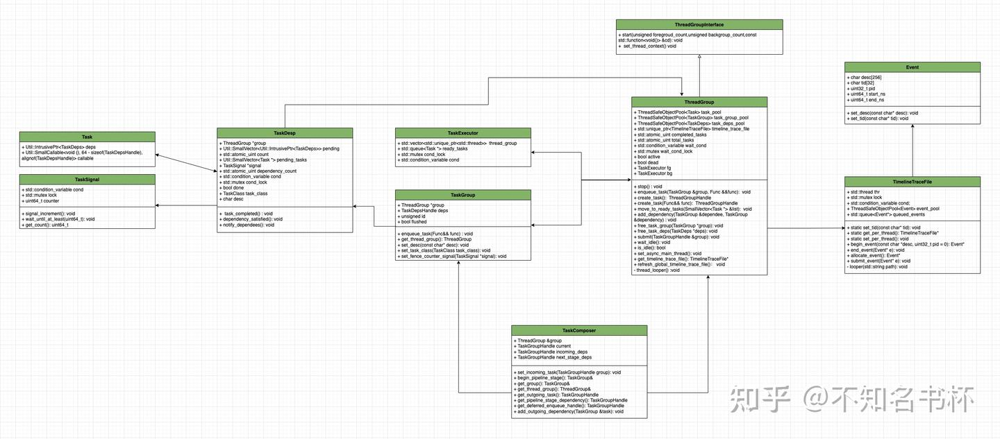

### Task

Task是线程池中最基础的组件，每一个Task中都包含了SmallCallable对象以及TaskDeps对象，其中SmallCallable对象被用来保存本次Task所要执行的逻辑，而TaskDeps对象则被用来维护Task之间的相互依赖。确保在执行当前Task之前，所有的前置依赖Task都已经被执行完成。

Task对象便将需要执行函数的所有信息(包括需要调用的函数和其依赖关系)都封装为一个独立对象来管理，后续方便将多个Task放入执行队列中由线程池来进行管理。保证多个Task可并行执行，其中TaskDeps对象来管理依赖关系。具体代码如下所示：

```cpp
struct Task
{
    template <typename Func>
    Task(TaskDepsHandle deps_, Func&& func)
        : callable(std::forward<Func>(func)), deps(std::move(deps_))
    {
    }

    Task() = default;

    Util::SmallCallable<void (), 64 - sizeof(TaskDepsHandle), alignof(TaskDepsHandle)> callable;
    TaskDepsHandle deps;
};
```

这里选择SmallCallable来存储一个可调用对象，SmallCallable旨在对于那些小且可复制的可调用对象，并且不需要在SmallCallable对象的生命周期之外存在的场景来说(即抛即用的场景)并且可以避免内存分配，这是对std::function的一种改进。这对于内存敏感和性能要求特别高的场景下比较有用，并且将其设置为64-sizeof(TaskDepsHandle)该参数是为了限制SmallCallable对象内部嵌入的可调用对象的大小。它规定了SmallCallable为内部的可调用对象分配的内存大小，该参数可以防止用户试图在SmallCallable对象中存储过大的可调用对象，如果对象太大超出了设定的数值，那么在编译时就会产生错误。

### TaskSignal

TaskSignal其设计目的是用于控制线程间的并发访问以及同步，这提供了一种多线程编程中常用的信号模式。通过TaskSignal让多个线程通过计数器中的值满足某个条件来判断是否需要堵塞或者执行。这样就能够保证Task之间的执行顺序的正确性。具体代码如下所示：

```cpp
struct TaskSignal
{
    std::condition_variable cond;
    std::mutex lock;
    uint64_t counter = 0;

    void signal_increment();
    void wait_until_at_least(uint64_t count);
    uint64_t get_count();
};
```

* uint64_t counter：是一个计数器，用于记录任务完成的个数。
* std::condition_variable cond,std::mutex lock: 来协调和控制多线程间的同步。
* signal_increment(): 每当一个任务完成时将调用此函数。会给counter加一，并通知等待在此条件变量上的线程(如果有的话)。
* wait_until_at_least(): 这个函数允许线程等待直到count达到指定的值。正常情况下cond会释放锁并挂起正在执行的线程，直到被通知可以继续执行(前提是需要满足计数器的值达到某个指定数值)。
* get_count(): 返回当前count的值，并通过std::mutex保证多线程之间数据安全。

### TaskDeps

设计TaskDeps的主要目的是管理多个Task之间的依赖关系，并且为Task的并行执行提供支持。具体代码如下所示：

```cpp
struct TaskDeps : Util::IntrusivePtrEnabled<TaskDeps, TaskDepsDeleter, Util::MultiThreadCounter>
{
    explicit TaskDeps(ThreadGroup *group_)
        : group(group_)
    {
        count.store(0, std::memory_order_relaxed);
        // One implicit dependency is the flush() happening.
        dependency_count.store(1, std::memory_order_relaxed);
        desc[0] = '\0';
    }

    ThreadGroup *group;
    Util::SmallVector<Util::IntrusivePtr<TaskDeps>> pending;
    std::atomic_uint count;

    Util::SmallVector<Task *> pending_tasks;
    TaskSignal *signal = nullptr;
    std::atomic_uint dependency_count;

    void task_completed();
    void dependency_satisfied();
    void notify_dependees();

    std::condition_variable cond;
    std::mutex cond_lock;
    bool done = false;
    TaskClass task_class = TaskClass::Foreground;

    char desc[64];
};
```

* dependency_count：代表当前TaskDeps前置依赖的数量。
* pending：代表所有依赖该TaskDeps执行完毕的其他TaskDeps。
* done：代表TaskDeps所关联的所有Task是否全部执行完成。
* signal：可以通过TaskSignal通知所有依赖该Task的其他Task。
* 通过cond和cond_lock来管理多线程之间的同步。
* 通过count和pending_tasks代表与当前TaskDeps所需完成的所有Task对象和对应Task的数量。
* task_completed(): 当调用该函数时代表和这个TaskDeps相关联的Task已经完成，随后对count递减。当count的值为0时表示所有相关任务全部完成，那么就调用notify_dependees()去通知所有等待当前TaskDeps执行完毕的其他TaskDeps(也就是pending)。
* notify_dependees(): 调用函数会通知所有等待当前TaskDeps完成的其他TaskDeps，代表它们该前置TaskDeps依赖已经完成。如果设置了signal则调用signal的signal_increment函数来通知其他TaskDeps，再调用pending中每个TaskDeps的dependency_satisfied()。最后将done设置为true，并且唤醒所有在等待该TaskDeps完成的线程。
* dependency_satisfied(): 这个函数被调用则表示有一个当前TaskDeps所依赖的TaskDeps已经完成执行，所以递减dependency_count，如果dependency_count变为0，说明所有当前TaskDeps的前置依赖都完成。则会将pending_tasks中移动到执行就绪队列当中，如果pending_tasks为空，则调用当前TaskDeps的notify_dependees函数来让其他依赖开始执行。

### TaskGroup

TaskGroup主要目的如下：

* 是提供一种可以组合Task并发执行的机制。这样你可以一次性启动多个Task并确保完成所有任务，在TaskGroup内的所有Task没有执行依赖，这样可以最大化地利用多核处理器的并行能力。
* 提供一种管理Task之间依赖关系的机制。这可以定义复杂的依赖关系，例如只有当TaskGroup中的所有Task都已完成时，其他的TaskGroup才能开始执行。

总的来说，TaskGroup是为了简化并发编程以及提升代码的可读性和可维护性。

```cpp
struct TaskGroup : Util::IntrusivePtrEnabled<TaskGroup, TaskGroupDeleter, Util::MultiThreadCounter>
{
    explicit TaskGroup(ThreadGroup *group);
    ~TaskGroup();
    void flush();
    void wait();
    bool poll();

    ThreadGroup *group;
    TaskDepsHandle deps;

    template <typename Func>
    void enqueue_task(Func&& func);

    void set_fence_counter_signal(TaskSignal *signal);
    ThreadGroup *get_thread_group() const;

    void set_desc(const char *desc);
    void set_task_class(TaskClass task_class);

    unsigned id = 0;
    bool flushed = false;
};
```

* group：是指向一个ThreadGroup的指针，代表拥有管理当前TaskGroup的ThreadGroup。
* deps：是TaskGroup中管理和其他TaskGroup依赖关系的TaskDeps。
* id：是当前TaskGroup的唯一标识。
* flushed：是一个布尔变量，用于表示当前TaskGroup是否已经调用flush()。
* set_class(TaskClass task_class)：设置TaskGroup对应的TaskClass(前台线或者后台运行)，设置这个变量主要是用于后续调度线程优先级。
* set_desc(const char *desc)：设置TaskGroup的描述，并复制给当前的TaskDeps，这主要用于调试和日志记录。
* get_thread_group： 返回与之关联的ThreadGroup对象的指针。
* set_fence_counter_signal(TaskSignal *signal) ：给TaskGroup设置一个TaskSignal(会放入TaskDeps内)，当TaskGroup的所有任务都完成时，此TaskSignal将被触发。这主要用于多线程中的同步和通知机制。
* flush(): 将flushed设置为true，并且将所有Task添加到TaskGroup中，并准备好执行(通过TaskDeps的dependency_satisfied()将Task放入队列中待执行)。此后不应再向TaskGroup添加任何Task。
* poll()：检查任务组中的所有Task是否已经完成。如果所有Task都完成了，那么它将返回true，否则返回false。
* wait(): 这个方法会阻塞调用线程，直到TaskGroup中的所有Task都执行完毕。如果当前TaskGroup还未调用flush()，则调用flush()。
* enqueue_task(Func&& func))：将一个新Task添加到TaskGroup中。
* TaskGroup::~TaskGroup: TaskGroup的析构函数中，如果flushed不为true则主动调用flush()。

### ThreadGroup

ThreadGroup主要是用来管理多个线程，以更高效的方式对多个线程进行集中管理，使得开发者无需手动管理每一个线程的生命周期，也可以方便地派发和等待任务的完成。

```cpp
class ThreadGroup final : public ThreadGroupInterface
{
public:
    ThreadGroup();
    ~ThreadGroup();
    ThreadGroup(ThreadGroup &&) = delete;
    void operator=(ThreadGroup &&) = delete;

    void start(unsigned num_threads_foreground,
               unsigned num_threads_background,
               const std::function<void ()> &on_thread_begin) override;

    unsigned get_num_threads() const
    {
        return unsigned(fg.thread_group.size() + bg.thread_group.size());
    }

    void stop();

    template <typename Func>
    void enqueue_task(TaskGroup &group, Func&& func);
    template <typename Func>
    TaskGroupHandle create_task(Func&& func);
    TaskGroupHandle create_task();

    void move_to_ready_tasks(const Util::SmallVector<Task *> &list);

    void add_dependency(TaskGroup &dependee, TaskGroup &dependency);

    void free_task_group(TaskGroup *group);
    void free_task_deps(TaskDeps *deps);

    void submit(TaskGroupHandle &group);
    void wait_idle();
    bool is_idle();

    Util::TimelineTraceFile *get_timeline_trace_file();
    void refresh_global_timeline_trace_file();

    static void set_async_main_thread();

private:
    Util::ThreadSafeObjectPool<Task> task_pool;
    Util::ThreadSafeObjectPool<TaskGroup> task_group_pool;
    Util::ThreadSafeObjectPool<TaskDeps> task_deps_pool;

    struct TaskExecutor
    {
        std::vector<std::unique_ptr<std::thread>> thread_group;
        std::queue<Task *> ready_tasks;
        std::mutex cond_lock;
        std::condition_variable cond;
    } fg, bg;

    void thread_looper(unsigned self_index, TaskClass task_class);

    bool active = false;
    bool dead = false;

    std::condition_variable wait_cond;
    std::mutex wait_cond_lock;
    std::atomic_uint total_tasks;
    std::atomic_uint completed_tasks;

    std::unique_ptr<Util::TimelineTraceFile> timeline_trace_file;
    void set_thread_context() override;
};
```

* active: 该字段被用于判断是否已经调用start()。
* dead: 该字段用于判断是否已经调用stop()。
* wait_cond和wait_cond_lock配套使用，用于等待ThreadGroup执行完毕的操作。
* total_tasks用于记录全部的Task数量，completed_tasks记录已经完成的Task数量。
* timeline_trace_file: 可用于记录对应操作开发和结束的时间戳，从而跟踪程序的执行行为。特别是TimelineTraceFile被设计为多线程安全的，可以用于多线程环境。
* task_pool/task_group_pool/task_deps_pool: 多个多线程安全的对象池，分别对应创建Task，TaskGroup，TaskDeps对象的创建。
* thread_looper(index,task_class)：会开启一个无限的循环，在循环中试图从取出TaskGroup中的Task并执行。如果没有Task就会堵塞执行，等待新的Task到来再继续执行。
* start(num_threads_foreground **,** num_threads_background,on_thread_begin): 会创建多个线程，线程数量根据参数控制。并且每个线程都会调用thread_looper函数(开始执行Task)，并且在每个线程开始时都会调用on_thread_begin。
* fg/bg: 两个都是TaskExecutor对象，是真正去执行Task的对象。包括一个线程数组、一个待执行任务队列、一个互斥量和一个条件变量，分别用来管理前台任务和后台任务的工作线程。
* stop(): 会设置dead为true，并向所有线程发送通知，然后等待所有线程完成Task执行，最后销毁所有线程和对应资源。
* submit(TaskGroupHandle &group): 在所有的Task被添加到TaskGroup后，驱动TaskGroup中的所有Task放入执行就绪队列中。
* create_task(): 创建一个新的TaskGroup并返回一个对应的TaskGroupHandle的指针。
* enqueue_task(TaskGroup &group,Func)：会创建一个新的Task并添加进指定的TaskGroup。
* add_dependency(TaskGroup& dependee,TaskGroup& dependency): 为TaskGroup之间添加依赖关系，首先将dependency添加到dependee的依赖列表中，并增加dependency的dependency_count。
* move_to_ready_tasks(Util::SmallVector<:task> &list): 此函数将一组任务移动到就绪任务队列中，并向线程发送通知可以让其继续处理Task。
* wait_idle()：会堵塞执行直到该ThreadGroup完成所有的Task执行。
* ThreadGroup::~ThreadGroup()：ThreadGroup的析构函数内会调用stop函数，确保所有Task执行完毕并且销毁所有对象以确保无内存泄露。

## 使用方式

下面是ThreadGroup的使用示例，创建一个ThreadGroup并且设置了四个线程来执行Task，通过create_task创建三个TaskGroup并且设置所需要执行的逻辑。并且额外通过enqueue_task在task3中添加一个新的Task。并通过add_dependency来设置TaskGroup之间的依赖关系(task1/task2→task3，task1→task2)。最后调用ThreadGroup的submit让每个TaskGroup开始将Task塞入就绪执行队列中。可以调用ThreadGroup的wait_idle()来堵塞代码继续往下执行，直到ThreadGroup中的所有Task执行完毕才继续执行。

```cpp
void test_thread_group(){
    Lapis::ThreadGroup group;
    group.start(4, 0, {});

    auto task1 = group.create_task([]() {
        LOGI("task1!\n");
    });
    auto task2 = group.create_task([]() {
        LOGI("task2!\n");
    });
    auto task3 = group.create_task([]() {
        LOGI("task3!\n");
    });
    group.enqueue_task(*task3, []() {
        LOGI("task3 extra task \n");
    });
    group.add_dependency(*task1, *task3);
    group.add_dependency(*task2, *task3);
    group.add_dependency(*task1, *task2);
    group.submit(task1);
    group.submit(task2);
    group.submit(task3);

    group.wait_idle();
    // 其他逻辑
    ........
}
```

具体执行流程图如下所示:

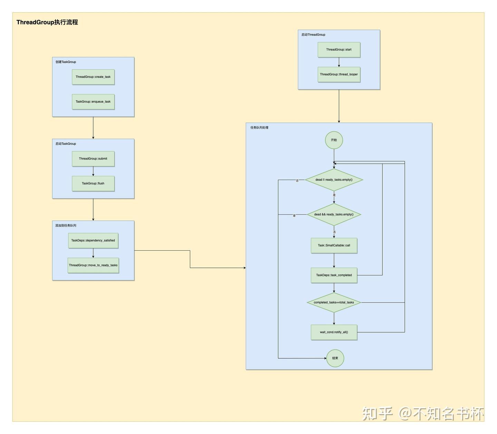

在这里分为两部分:

* 首先是调用ThreadGroup::start()，确定需要开启几个线程以及设置on_thread_begin，并且调用thread_looper()开始处理队列中的Task。在thread_looper函数的循环中会不断地从ready_tasks中取出Task并且调用其中的可调用对象，如果当前ready_tasks为空并且dead为true则直接终止循环，并且每次Task调用完毕后会调用TaskDeps的task_completed()通知该Task已执行完毕。如果全部Task执行完毕，则直接唤醒被ThreadGroup::wait_cond堵塞的所有线程。
* 另外一个部分则是如何将Task塞入ready_tasks，首先创建TaskGroup只需要调用create_task并且会自动塞入一个Task，如果还需要在这个TaskGroup中添加新的Task，可通过TaskGroup::enqueue_task实现，并且通过add_dependency设置TaskGroup之间的依赖。最后通过ThreadGroup::submit提交所有的TaskGroup。最后会调用到TaskGroup::flush→TaskDeps::dependency_satisfied→ThreadGroup::move_to_ready_tasks，将所有需要的Task放入ready_tasks之后被处理。

## 配套的工具函数以及Debug相关

### thread_id

```cpp
namespace Util
{
static thread_local unsigned thread_id_to_index = ~0u;

unsigned get_current_thread_index()
{
    auto ret = thread_id_to_index;
    if (ret == ~0u)
    {
        LOGE("Thread does not exist in thread manager or is not the main thread.\n");
        return 0;
    }
    return ret;
}

void register_thread_index(unsigned index)
{
    thread_id_to_index = index;
}
}
```

首当其冲的就是thread_id，这些函数主要是用来为当前线程注册一个唯一索引。这里声明了一个静态的线程局部变量thread_id_to_index并初始化为~0u，thread_local是C++11引入的一个关键字。它声明了一个线程局部的变量，也就是说每一个线程都有一份这个变量的拷贝，而不是所有线程共享同一个变量。一个线程对其进行的修改不会影响到其他线程中的thread_id_to_index。这样设计的好处是可以避免多线程编程中的数据竞争和同步问题。因为每个线程都有自己的数据拷贝，所以它们可以各自独立地操作这个数据而无需进行复杂的同步策略。也就是说通过register_thread_index可以给每个线程设置一个唯一索引。

这在多线程编程中是很有必要的，因为当在Vulkan使用多线程提交渲染命令时，这种情况下，你将需要跟踪哪个线程正在处理哪一部分的工作，以确保不会出现线程冲突和数据一致性问题。由于不同线程在处理速度上可能会有差异，因此使用线程唯一标识能够帮助编程者更好地管理线程，并确保程序的稳定运行。

在thread_looper()中注册对应的线程ID，每个线程都会调用并且传入index会递增，保证每个线程的ID是独一无二。如下所示：

```cpp
void ThreadGroup::thread_looper(unsigned index, TaskClass task_class)
{
    Util::register_thread_index(index);
    .............
}
```

### thread_name

接下来是thread_name的处理，具体操作如下所示：

```cpp
#ifdef __linux__
#include <pthread.h>
#endif

#ifdef __APPLE__
#include <pthread.h>
#endif

namespace Util
{
void set_current_thread_name(const char *name)
{
    #ifdef __linux__
            pthread_setname_np(pthread_self(), name);
    #elif __APPLE__
        pthread_setname_np(name);
    #else
    // TODO: Kinda messy.
    (void)name;
    #endif
}
}
```

通过pthread_setname_np来设置线程名，但是在linux和mac环境中调用的方式有所不同，但是需要引入的头文件都是pthread.h。在linux环境下的使用方式是 `int pthread_setname_np(pthread_t thread, const char *name)`，thread参数是要设置名称的线程的线程id，这里通过pthread_self()来获取当前线程ID，第二个参数也就是设置的线程名称。在mac环境下的使用方式是 `int pthread_setname_np(const char* name)`只接受一个参数，那就是想要设置的线程名称。由于此函数只能用于设置当前线程的名称，所以没有提供线程ID作为参数。其返回值为0表示成功，否则为一个错误码。

使用这段代码的目的主要是给不同的线程设置不同的名称，这在调试多线程程序时非常有用。在多线程编程中通过线程ID来理解线程的行为比较困难，如果线程有一个描述性的名字，那么调试就会容易得多。通过设置线程的名称，开发者可以更方便地在错误报告、日志文件以及性能剖析工具中识别线程。它可以帮助开发者更快地理解问题发生的上下文，从而更有效地调试代码。

以下代码就是在ThreadGroup关于设置线程名称的操作：

```cpp
void ThreadGroup::set_async_main_thread()
{
    Util::set_current_thread_name("MainAsyncThread");
    .......
}

static void set_main_thread_name()
{
    Util::set_current_thread_name("MainThread");
    .........
}

static void set_worker_thread_name_and_prio(unsigned index, TaskClass task_class)
{
    auto name = Util::join(task_class == TaskClass::Foreground ? "FG-" : "BG-", index);
    Util::set_current_thread_name(name.c_str());
    ...........
}
```

### thread_priority

```cpp
#if defined(__linux__)
#include <pthread.h>
#elif defined(_WIN32)
#include <windows.h>
#elif defined(__APPLE__) && defined(__MACH__)
    #include <pthread.h>
    #include <mach/thread_policy.h>
    #include <mach/thread_act.h>
#endif

void set_current_thread_priority(ThreadPriority priority)
{
#if defined(__linux__)
    if (priority == ThreadPriority::Low)
    {
        struct sched_param param = {};
        int policy = 0;
        param.sched_priority = sched_get_priority_min(SCHED_BATCH);
        policy = SCHED_BATCH;
        if (pthread_setschedparam(pthread_self(), policy, &param) != 0)
            LOGE("Failed to set thread priority.\n");
    }
#elif defined(_WIN32)
    if (priority == ThreadPriority::Low)
    {
        if (!SetThreadPriority(GetCurrentThread(), THREAD_MODE_BACKGROUND_BEGIN))
            LOGE("Failed to set background thread priority.\n");
    }
    else if (priority == ThreadPriority::Default)
    {
        if (!SetThreadPriority(GetCurrentThread(), THREAD_PRIORITY_NORMAL))
            LOGE("Failed to set normal thread priority.\n");
    }
    else if (priority == ThreadPriority::High)
    {
        if (!SetThreadPriority(GetCurrentThread(), THREAD_PRIORITY_HIGHEST))
            LOGE("Failed to set high thread priority.\n");
    }
#elif defined(__APPLE__) && defined(__MACH__)
    if (priority == ThreadPriority::Low)
    {
        sched_param schedParam;
        int policy;
        pthread_getschedparam(pthread_self(), &policy, &schedParam);
        schedParam.sched_priority = sched_get_priority_min(policy);
        if (pthread_setschedparam(pthread_self(), policy, &schedParam) != 0)
            LOGE("Failed to set thread priority.\n");
    }
    else if (priority == ThreadPriority::High)
    {
        struct sched_param param;
        int policy;
        pthread_getschedparam(pthread_self(), &policy, &param);
        param.sched_priority = sched_get_priority_max(policy);
        if(pthread_setschedparam(pthread_self(), policy, &param)) {
            LOGE("Failed to set thread priority.\n");
        }
    }
#else
#warning "Unimplemented set_current_thread_priority."
    (void)priority;
#endif
}
```

这段代码主要是在不同操作系统下设置线程优先级，线程优先级是操作系统决定哪个线程应该获得CPU资源的一个关键因素。较高优先级的线程会在可用CPU资源上优先于较低优先级的线程。在多线程编程中尤其是在需要精细控制CPU资源以提高运行效率的情况下这是很常见的技巧。可以最大利用CPU的性能。在这里主要讲解一下在Mac系统下的实现，如下所示：

* 首先通过pthread_getschedparam获取到现有的调度参数param。
* 通过sched_get_priority_min/sched_get_priority_max分别获取到最大或者最小的调度优先级，并设置param的sched_priority字段。
* 通过pthread_setschedparam设置该线程的调度优先级。

具体使用示例如下所示，这里为不同的线程设置不同的优先级会将主线程设置为最高优先级，但是对于普通的线程来说如果是前台线程则设置为默认优先级，而后台线程则是低优先级。

```cpp
void ThreadGroup::set_async_main_thread()
{
    .......
    Util::set_current_thread_priority(Util::ThreadPriority::High);
}

static void set_main_thread_name()
{
    .........
    Util::set_current_thread_priority(Util::ThreadPriority::High);
}

static void set_worker_thread_name_and_prio(unsigned index, TaskClass task_class)
{
    ...........
    Util::set_current_thread_priority(task_class == TaskClass::Foreground ?
                                      Util::ThreadPriority::Default : Util::ThreadPriority::Low);
}
```

### TimelineTraceFile

```cpp
class TimelineTraceFile
{
public:
    explicit TimelineTraceFile(const std::string &path);
    ~TimelineTraceFile();

    static void set_tid(const char *tid);
    static TimelineTraceFile *get_per_thread();
    static void set_per_thread(TimelineTraceFile *file);

    struct Event
    {
        char desc[256];
        char tid[32];
        uint32_t pid;
        uint64_t start_ns, end_ns;

        void set_desc(const char *desc);
        void set_tid(const char *tid);
    };
    Event *begin_event(const char *desc, uint32_t pid = 0);
    void end_event(Event *e);

    Event *allocate_event();
    void submit_event(Event *e);

    struct ScopedEvent
    {
        ScopedEvent(TimelineTraceFile *file, const char *tag);
        ~ScopedEvent();
        void operator=(const ScopedEvent &) = delete;
        ScopedEvent(const ScopedEvent &) = delete;
        TimelineTraceFile *file = nullptr;
        Event *event = nullptr;
    };

private:
    void looper(std::string path);
    std::thread thr;
    std::mutex lock;
    std::condition_variable cond;

    ThreadSafeObjectPool<Event> event_pool;
    std::queue<Event *> queued_events;
};
```

TimelineTraceFile的设计目标是为了提供执行追踪的能力。具体来说它允许开发者在代码中的特定位置设置时间戳以追踪和记录代码的执行时长。由于这些函数使用了线程局部存储(Thread Local Storage，TLS)，所以它们能够正确处理多线程环境，每个线程可以拥有独立的执行追踪功能。具体如下所示(上面也解释了thread_local关键字的作用，在这不在多赘述)。

```cpp
static thread_local char trace_tid[32];
static thread_local TimelineTraceFile *trace_file;

void TimelineTraceFile::set_tid(const char *tid)
{
    snprintf(trace_tid, sizeof(trace_tid), "%s", tid);
}

void TimelineTraceFile::set_per_thread(TimelineTraceFile *file)
{
    trace_file = file;
}

TimelineTraceFile *TimelineTraceFile::get_per_thread()
{
    return trace_file;
}
```

在TimelineTraceFile中每次记录操作都会新建一个Event对象，Event会包含所需的信息，如下所示：

* char desc[256]：这个字段用来保存本次操作的描述，比如函数的名称或者操作的性质等。
* char tid[32]：这个字段用来保存线程ID，以识别是在哪个线程中记录的。
* uint64_t start_ns, end_ns：这两个字段用来保存该Event的开始和结束时间戳，单位为纳秒。

接下来看看TimelineTraceFile中主要包括什么吧，如下所示：

* std::thread thr: 用于在后台异步写入追踪执行数据的线程。
* std::mutex lock 和 std::condition_variable cond：用于线程间的同步，确保Event对象在多线程环境下安全地进入队列和处理。
* ThreadSafeObjectPool event_pool：是一个存放Event的对象池。
* std::queue queued_events：是一个用于存放等待处理的Event对的队列。
* Event *begin_event(const char *desc, uint32_t pid = 0) 和 void end_event(Event *e): 是用来开始和结束一个Event的记录，begin_event会返回一个Event对象，可以用来记录的各种信息。
* Event *allocate_event()和 void submit_event(Event *e)：都是处理Event对象的函数，前者创建一个新的Event对象，后者将Event对象提交到队列中。
* void looper(std::string path)：会开启一个单独的线程中运行该函数，主要工作是从Event队列中取出Event对象处理并将数据写入到文件中。
* TimelineTraceFile(const std::string &path)：接收一个路径作为参数，这个路径是用于存放时间线追踪数据的文件路径。并将开启一个线程来执行looper函数。
* ~TimelineTraceFile()：在TimelineTraceFile对象销毁前会确保所有的Event对象都被处理，并且保证线程安全地结束。

为了使用上的便利可以利用RAII的思想封装一个ScopedEvent对象，确保当这个类对象创建的时候会自动调用begin_event来开始创建一个Event对象，在该对象析构的时候自动调用end_event。这个类的设计使得用户可以非常简洁地追踪代码执行的时间。

并且还包装一个宏来使用，这个宏的作用是创建一个ScopedEvent对象，即在代码执行的某一范围内自动记录执行的时间，让追踪代码执行时间变得更加方便。

```cpp
#define GRANITE_SCOPED_TIMELINE_EVENT(str) \
    ::Util::TimelineTraceFile::ScopedEvent _timeline_scoped_count_##__COUNTER__{GRANITE_THREAD_GROUP()->get_timeline_trace_file(), str}
#define GRANITE_SCOPED_TIMELINE_EVENT_FILE(file, str) \
    ::Util::TimelineTraceFile::ScopedEvent _timeline_scoped_count_##__COUNTER__{file, str}
```

## TaskComposer

为了在Vulkan中多线程提交渲染命令，于是设计出了TaskComposer。设计目的是简化和管理在ThreadGroup中的Task Pipeline的创建和调度。具体代码如下所示，总的来说TaskComposer提供了一种方法来封装和管理分阶段并行和依赖指定先后顺序的Task，简化在ThreadGroup中构建和调度Task Pipeline各阶段的复杂性。

```cpp
class TaskComposer
{
public:
    explicit TaskComposer(ThreadGroup &group);
    void set_incoming_task(TaskGroupHandle group);
    TaskGroup &begin_pipeline_stage();
    TaskGroup &get_group();
    TaskGroupHandle get_outgoing_task();
    TaskGroupHandle get_pipeline_stage_dependency();
    ThreadGroup &get_thread_group();
    TaskGroupHandle get_deferred_enqueue_handle();
    void add_outgoing_dependency(TaskGroup &task);

private:
    ThreadGroup &group;
    TaskGroupHandle current;
    TaskGroupHandle incoming_deps;
    TaskGroupHandle next_stage_deps;
};
```

* ThreadGroup& group：代表与之关联的ThreadGroup对象。
* TaskGroupHandle current：代表当前Pipeline Stage的TaskGroupHandle。
* TaskGroupHandle incoming_deps：作为当前Pipeline Stage(current)的前置依赖的TaskGroupHandle。
* TaskGroupHandle next_stage_deps：将作为incoming_deps的前置依赖的TaskGroupHandle。
* set_incoming_task(TaskGroupHandle group_): 设置一个TaskGroup作为整个Task Pipeline的起点。
* begin_pipeline_stage()：创建一个新的TaskGroup和TaskDeps，并将它们添加到Task Pipeline中并维护对应的依赖关系。也就是调用该函数则开始一个新的Pipeline Stage(每个Pipeline Stage都需要按顺序执行哦)，并且重新设置currtent和incoming_deps。
* get_group()：返回当前TaskGroup(也就是current)，如果当前没有任何TaskGroup，将调用begin_pipeline_stage()并返回一个TaskGroup(会赋值给current)。
* get_outgoing_task()：结束当前Pipeline Stage(也就是进入到下一个Pipeline Stage)并返回一个TaskGroup，这个TaskGroup表示了当前阶段的结束和下一阶段的开始。
* get_pipeline_stage_dependency(): 该函数返回一个当前Task Pipeline Stage所前置依赖一个的TaskGroup(也就是incoming_deps)，如果需要在当前Pipeline Stage之前补充前置操作的，可以在该TaskGroup内添加Task。
* get_thread_group()：返回与之关联的ThreadGroup。
* get_deferred_enqueue_handle()：获取一个新的TaskGroup，可以将一些在当前Pipeline Stage结束时需要执行的Task提交给它(其实也就是将其作为在下一个Pipeline Stage的前置依赖)。
* add_outgoing_dependency(TaskGroup &task);：可以添加一个Task到下一个Pipeline Stage中，这个Task将会在当前Pipeline Stage的所有Task都完成后执行。

具体用例如下所示：

```cpp
void task0()
{
  LOGI("Task 0 running...");
}

void task1()
{
  LOGI("Task 1 running...");
}

void task2()
{
  LOGI("Task 2 running...");
}

void task3()
{
  LOGI("Task 3 running...");
}

void task4()
{
  LOGI("Task 4 running...");
}

void task5()
{
  LOGI("Task 5 running...");
}

void task6()
{
  LOGI("Task 6 running...");
}

void task7()
{
  LOGI("Task 7 running...");
}

void test_task_composer(){
    Lapis::ThreadGroup group;
    Lapis::TaskComposer composer(group);
    {
      auto initialTask = group.create_task();
      initialTask->enqueue_task(task0);
      initialTask->set_desc("initialTask");
      composer.set_incoming_task(initialTask);
    }

    {  
      auto& firstStage = composer.begin_pipeline_stage();
      firstStage.set_desc("firstStage");
      firstStage.enqueue_task(task1);
      firstStage.enqueue_task(task2);
      firstStage.enqueue_task([ h = composer.get_deferred_enqueue_handle()]() mutable {
        h->set_desc("deferredHandle");
                h->enqueue_task([=]() {
          task4();
                });
          });   
    }

    {
      auto& secondStage = composer.begin_pipeline_stage();
      secondStage.set_desc("secondStage");
      secondStage.enqueue_task(task3);
    }

    {
      auto& thirdStage = composer.begin_pipeline_stage();
      thirdStage.set_desc("thirdStage");
      thirdStage.enqueue_task(task5);
    }

    auto handleToWaitFor = composer.get_outgoing_task();
    handleToWaitFor->enqueue_task(task6);

    group.start(1,0,{});
    handleToWaitFor->wait();

    task7();
}
```

首先是创建ThreadGroup对象并且做为参数来构造TaskComposer对象。并通过set_incoming_task塞入一个TaskGroup作为初始阶段，之后使用begin_pipeline_stage开启一个新的Pipeline Stage继续执行其他的TaskGroup，还通过get_deferred_enqueue_handle获取到一个TaskGroup，TaskComposer会保证在该TaskGroup在task2之后才开始执行，该TaskGroup执行完毕后才开始执行task3。(注意这里的写法每个TaskGroup都是通过析构函数来触发flush函数，如果不是这样的写法，记得需要手动调用flush)

注意如果是使用get_deferred_enqueue_handle来补充一些Task的执行的话，下面这种写法是不可以的。因为这个TaskGroup并没有被显式与某个Pipeline的TaskGroup有依赖关联(比如firstStage)。如果这种用法则需要手动维护其依赖关系(通过add_dependency来设置)。这样的写法会导致该defferedHandle会被提高到和initialTask一样首个被执行，虽然会堵塞secondStage的执行，但是和预期表现不符(预期是先执行完task1，task2，再执行task4，现在变成task0和task4并行，task1，task2反而在后面被执行)。

```cpp
auto defferedHandle = composer.get_deferred_enqueue_handle()
defferedHandle.enqueue_task(task4);
```

建议使用上面示例中的写法，将创建DeferredTaskGroupHandle和执行task4的代码放在了一个lambda函数中，并将这个lambda函数作为该阶段的一个Task来执行。通过这种方式DeferredTaskGroupHandle会在所有task0 task1和task2执行完成后再被创建，这个lambda函数启动时才被添加到任务队列中，所以task4会在这些任务完成后开始执行。这就形成了正确的前置依赖关系，同时符合预期。

## 总结

Frame Graph总的来说像是DSL语言一样，开发者这只需要定义好这些Pass希望执行的渲染逻辑和各个Pass使用到的Resource。其他的都可以一概不管都可以交给Frame Graph来完成，Frame Graph最后会编译成能够在现代图形API上正确运行的代码一样。其实也就是再加了一层抽象层(计算机届的银弹，不够就在加，加到够为止)。莫名的有一种将Opengl或者dx11中图形驱动做的事，重新搬到这一层实现了一样(实际并不是)。但是Frame Graph还是解决了很多问题的，如下所示：

* 构建了高层的帧信息，简化资源管理和管线配置。这或许是后续走向渲染管线走向Date-Drivern的基础。
* 解决了之前的固化渲染管线的不能够灵活扩展的问题，现在Frame Graph中各个RenderPass之间互相解耦，可以进行复用。方片运行编写独立的高性能渲染模块。
* Frame Graph能够对于整体渲染流程提供一个可视化操作，可以让渲染流程更加的直观，更加方便去Debug一个极其复杂的渲染管线。可以随意改变渲染流程以供Debug及其他需求。
* 解决现代图形API棘手的同步问题，通过高层帧信息能够很好的寻找最佳同步点。

但是Frame Graph也不是万能的，有一些特殊的需求还是需要通过全局设置来开洞决定并不能将在一个RenderPass的范围内解决。并且Frame Graph关于在Compile阶段如何得出一个更好的渲染流程，这是一个很大的问题。这还需要在实践中不断摸索以寻找更好的优化方式。并且对于Frame Graph的Compile阶段的实现只有具体思路而没有实践，可能每个引擎的实现都不相同，如何寻找一个较优解是个难题。可以多看看不同的引擎是怎么处理的，相信应该能给我们很多的灵感。

业界已经有很多的游戏引擎都已经用上了Frame Graph，比如Unreal或者是育碧的AnvilNext,当然还有寒霜啦 (不过有些都改了名，比如Render Graph)。后续也会补充一个Frame Graph实现相关的文章(先挖一个坑)。

## References

[游戏引擎随笔 0x03：可扩展的渲染管线架构](https://zhuanlan.zhihu.com/p/70668533)

[Render graphs and Vulkan — a deep dive](https://link.zhihu.com/?target=https%3A//themaister.net/blog/2017/08/15/render-graphs-and-vulkan-a-deep-dive/)

[FrameGraph|设计&amp;基于DX12实现](https://zhuanlan.zhihu.com/p/147207161)

[极简 Frame Graph](https://zhuanlan.zhihu.com/p/618401627)

[Render Graph in DirectX 12](https://zhuanlan.zhihu.com/p/101318415)

[FrameGraph: Extensible Rendering Architecture in Frostbite](https://link.zhihu.com/?target=https%3A//www.gdcvault.com/play/1024612/FrameGraph-Extensible-Rendering-Architecture-in)
