我们学习图形学渲染，往往从基于表面Surface的模型开始，假设场景由真空中一系列的表面组成，从一个表面到另一个表面间光线是直线传播，这个过程中Radiance也不会变化，光线仅仅在这些实心opaque的物体表面surface进行吸收、散射等作用，这种假设是对实际的简化。

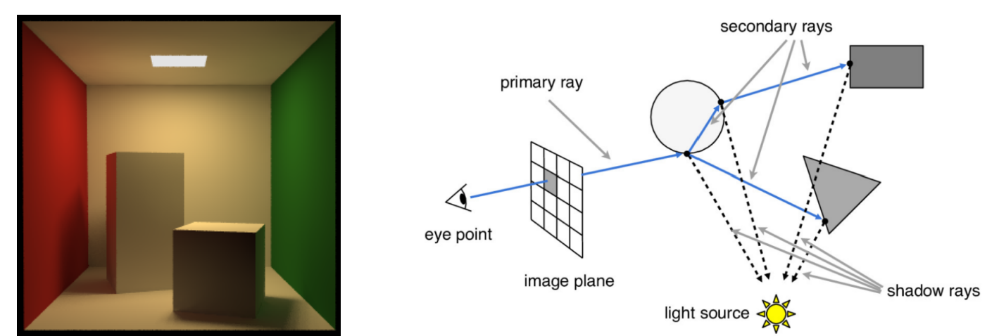

对于充满雾和烟的场景无法精确的表达，也无法描述大气中粒子的散射使天空变蓝这样的现象。研究参与介质(Participating Media)下的体渲染(Volume Rendering)可以精确模拟这些现象。

接下来一系列文章将以《Siggraph 2018 Course》关于**物理体绘制的蒙特卡洛方法**（Monte Carlo methods for phyically based volume rendering），为主要参考材料，介绍基于物理的体渲染中的一些基本知识。

## 参与介质（Participating Media）

许多视觉效果本质上是体积的，云、烟等对象难以用欧氏几何描述，它们可以看作是聚集在一定的区域内的大量粒子，光线在穿过这片区域时会被粒子吸收或散射，而这些粒子也可能自身会向外发出光线。另外，像是玉石这样并非完全不透明的物体，虽然可以用网格模型建模，但是当光线透射介质内部时，也会发生吸收、散射等现象。类似于烟、雾、尘埃、玉石、牛奶等对所穿过的光线产生散射、吸收等作用的空间介质被称为**参与介质（participating media）** 。

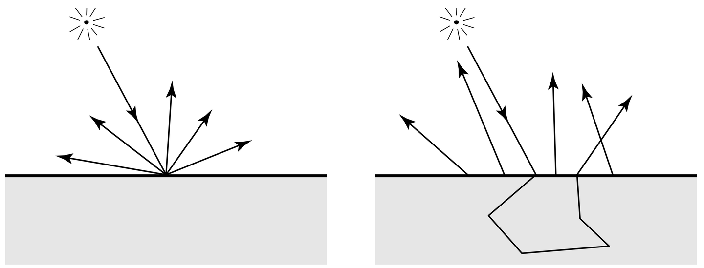

Surface(表面)可以看作由密集的粒子（Dense Particles）构成的。Participating Media(参与介质)则可看作是更稀疏的粒子构成的，RTR4里面定义为volumes filled with particles,其Participate参与到光线传播的过程中，通过吸收和散射，对光线传播产生影响，后面简称为介质。常见的介质包含了：

* 云，烟，雾，火，水，甚至空气
* 皮肤、蜡烛、玉石、牛奶等有着半透明外观的物体
* 科学计算（地震场等）/医疗体数据（MR/CT/PET-CT等）

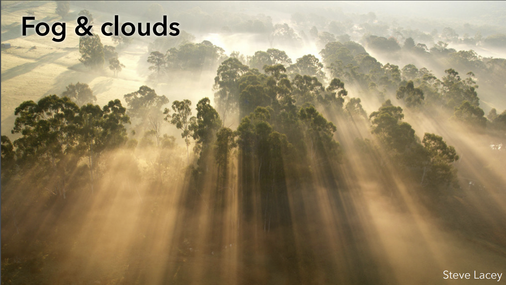

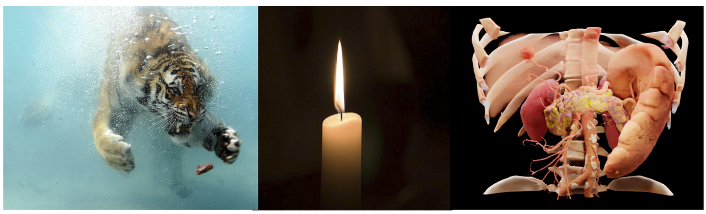

介质可以是均质的homogeneous，例如水、空气等，也可以是非均质的heterogeneous，例如云或烟雾。

### 介质的渲染方法

所有介质的渲染都可以通过求解辐射传输方程RTE（Radiactive Transfer Equation）得到，求解方程有很多种方法，一般通过蒙特卡洛路径追踪，或者光子映射，这个系列我们将介绍基于蒙特卡洛路径追踪来求解 。

上述这两种方法都比较耗时，渲染皮肤、蜡烛、玉石等这类偏向固体的介质，一般还会通过扩展BRDF来描述这类材质，一般描述为次表面散射BSSDF。

### 介质的存储和表达

介质一般通过三维体数据来描述，离散化形式可以看作一个三维数组，数组的每个元素可以称为一个体素Voxel。

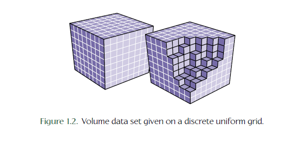

场景中的有效的非空的体素往往在整个空间占的比例很小，因此有很多的空间划分方式来表达稀疏的介质。例如英伟达的gVDB，可以在CPU和GPU表达一致的的动态的Sparse Volume结构。

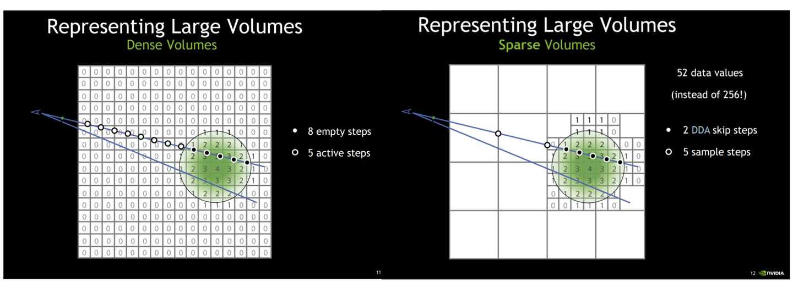

## 光线和介质的作用

光线和介质的作用，主要包含了吸收Absorption，散射Scattering和发射Emission。下图分别给出了以吸收、散射和发射为主要物理过程的效果。

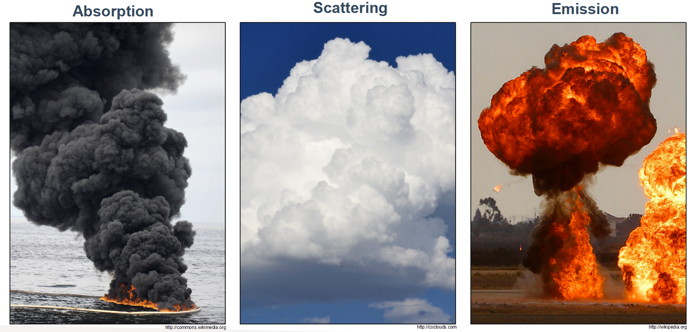

下面和之后的图都画了一些粒子，但这些只是为了说明。我们通常不会显式地描述介质中的粒子，而是通过统计计算，量化光线在单位距离传播中和粒子碰撞的频率，从而对介质进行建模。

光线经过介质三种基本作用：吸收，散射和发射，散射包含内散射和外散射。

* 吸收：光子被介质吸收，转化成热能或其它形式的能量。它是关于吸收系数$\mu_a$的函数。吸收系数代表了光线经过位置 $x$，沿方向 $\omega$ 走一个无穷小的距离被吸收的概率或被吸收的比例，这里注意吸收系数是一个微分的概念，是吸收比例的线密度，代表了单位长度上吸收比例的概率分布，它的单位是距离分之一: $m^{-1}$ 。由定义可知，吸收系数大于0， **可以大于1** ，并不是一个零到一的比例。同时，吸收系数是 **关于位置和方向的函数** ，但一般我们描述场景时，简化成每个体素值一个吸收系数，其只是 **位置的函数** 。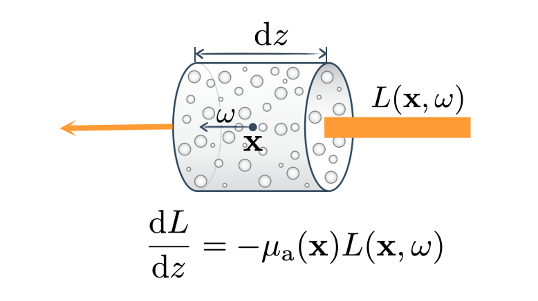

- 外散射：光子与介质作用，向外散射。Phase function相函数描述了不同方向散射的分布。它是关于散射系数 $\mu_s$ 的函数。
  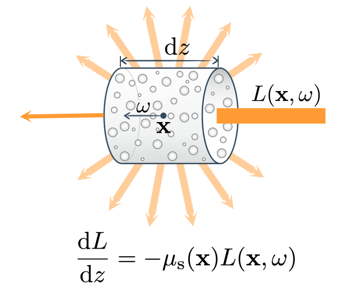
- 内散射：打到人眼方向的光线，或者说对最终Radiance有贡献的光线，可能来自于任意其它方向弹射来的光线的散射，这个过程称为内散射。光线在发生外散射的时候，也有着同样的概率产生内散射，从而产生Radiance的贡献，注意这里的分布函数与外散射互为相反数，数值相同，都是关于散射系数 $\mu_s$ 的函数。
  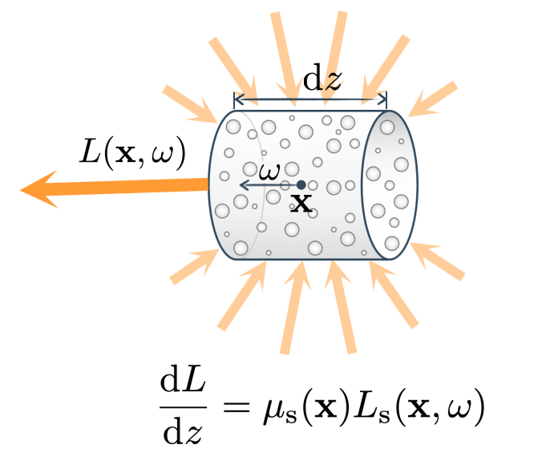
- 发射：当介质到达一个高的温度时，会发生发射的现象。每单位距离下由于自发光产生贡献的分布，可以发现，和吸收的系数呈相反数，这样做是因为作者认为，从物理上来说，能发射能量也就意味着有一定的存储能力，因此它与吸收应该符号相反，属于同一分布。
  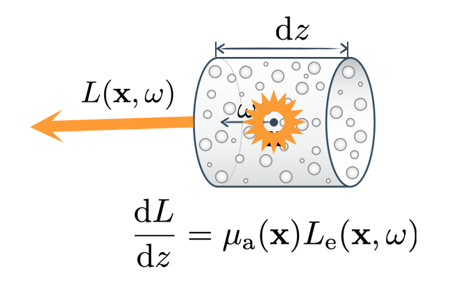

吸收和外散射系数都是乘以 $x$ 处 $\omega$方向上的Radiance，因此吸收系数和散射系数可以相加合并，定义消光系数 $\mu_t(x)$是吸收系数和散射系数的和，指的是光线经过位置 $x$ 处无穷小距离通过的概率或衰减的比例，是衰减的线密度。Albedo反照率是散射系数和消光系数的比值，Albedo为1代表了完全被反射，没有吸收。

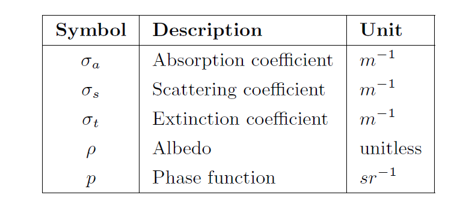

:::tip

上面提到的外散射和内散射，描述的都是 **一次散射/ Single-Scattering** ，事实上，光线在介质内可能发生多次散射，形成 **多重散射 / Multi-Scattering** ，才能到达我们的眼睛。对于不同的渲染介质，对多重散射有不同的处理方式。

比如对于体积雾效果，多散射的效果很弱，我们一般忽略多散射。而对于大气渲染和体积云渲染，多散射的效果就占有很大比率了，我们会使用一些特殊的手法来模拟。这些会在后面详细介绍。

:::

## 辐射传输方程RTE(Radiactive Transfer Function)

吸收和外散射带来能量损失，内散射和发射带来能量增加。将吸收、内散射、外散射和发射项相加，即得到传输方程的**微分**形式。

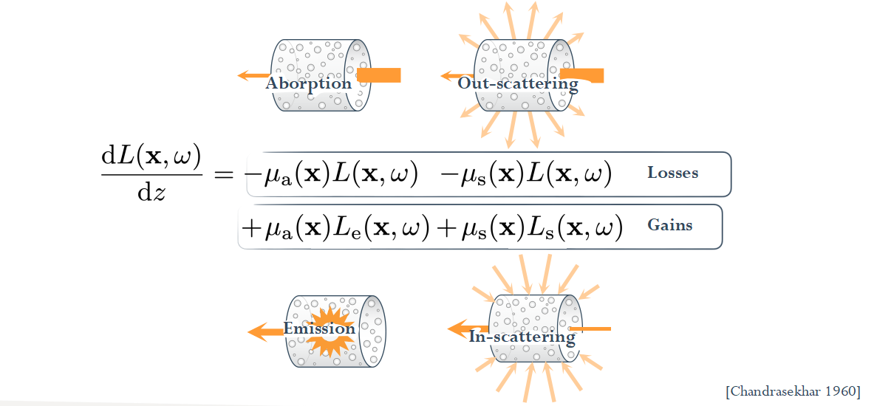

合并吸收和内散射，得到：

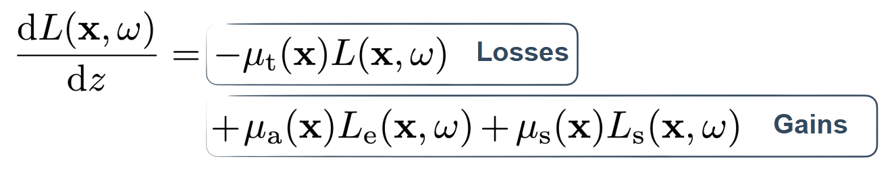

### RTE本身是一种微分形式

简单来说，光线被粒子吸收、散射，同时粒子也发射辐射，于是光线携有辐射亮度的改变量如下：

$$
\underbrace{(\omega \cdot \nabla) L_o (p, \omega)}_{\text{光线辐射亮度的改变}} = -\underbrace{\sigma_a (p, \omega) L_i (p, \omega)}_{\text{光线被粒子吸收}} - \underbrace{\sigma_s (p, \omega) L_i (p, \omega)}_{\text{光线被粒子散射到其它方向}}+ 
\underbrace{\sigma_s (p, \omega) \int_{S^2} f_p (p, \omega_i \to \omega) L_i (p, \omega) d\omega_i}_{\text{粒子散射光线到当前方向}} + \underbrace{L_e (p, \omega)}_{\text{粒子自发光}}
$$

$$
= -\sigma_t (p, \omega) L_i (p, \omega) + \sigma_s (p, \omega) \int_{S^2} f_p (p, \omega_i \to \omega) L_i (p, \omega) d\omega_i + L_e (p, \omega)
$$

* $(\omega \cdot \nabla) L_o(p, \omega)$ 是辐射亮度场沿方向 $\omega$ 的方向导数，是来自方向 $\omega$ 的光线通过 $p$ 点后辐射亮度的改变量；
* $\sigma_a(p, \omega)$ 是**吸收系数（absorption coefficient）**，描述了物质吸收光的能力，可以看作来自方向 $\omega$ 的光线传播单位长度而通过 $p$ 点时被吸收的概率；
* $\sigma_s(p, \omega)$ 是**散射系数（scattering coefficient）**，是来自方向 $\omega$ 的光线传播单位长度而通过 $p$ 点时被介质中粒子散射的概率；
* $\sigma_t(p, \omega) = \sigma_a(p, \omega) + \sigma_s(p, \omega)$ 是**衰减系数（attenuation coefficient）**，描述物质对进入该物质的电磁波能量衰减的特性；
* $\rho = \frac{\sigma_s}{\sigma_t}$ 是介质的**反照率（albedo）**；
* $\ell = \frac{1}{\sigma_t}$ 被称为**平均自由程（mean free path）**，是光线在介质内两次连续与粒子发生交互之间传播的平均距离；
* $f_p(p, \omega_i \to \omega)$ 是**相函数（phase function）**，描述了 $p$ 点处散射辐射的空间分布，是从 $\omega_i$ 方向射入的光线向某个方向单位立体角 $\omega$ 内的散射能量与向所有方向 $S^2$ 散射能量的总和之比；
* 所有方向 $S^2$ 对应于一个单位球；
* $L_e(p, \omega)$ 是来自方向 $\omega$ 的光线传播单位长度而通过 $p$ 点时，因介质中粒子自发光而产生的辐射亮度微增量；

在求解绘制方程时，积分域是所有的景物表面、是二维的，而在求解辐射传输方程时，积分域是参与介质的内部、是三维的。

所以接下来，我们来看看积分的形式。

### RTE的积分形式——VRE（Volume Rendering Equation）

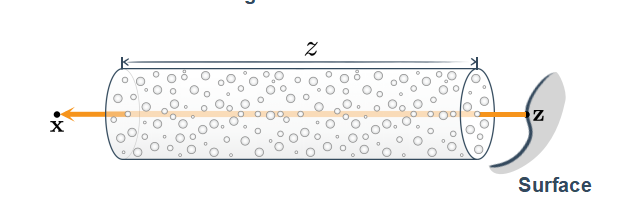

VRE由微分形式的RTE推导得出，给出了光线在 $\omega$ 方向上走一段距离，和介质如何作用，radiance要如何计算。这里推导如下：$\omega$  已知，光线方向 $\omega$ 上任一点**y**位置可以写作 $y=z+\omega * y$ , L看成距离 $y$ 的函数。RTE可写成以下：

$$
\frac{dL}{dy} = -\mu_t(y)L + \mu_a(y)L_e(y) + \mu_s(y)L_s(y)
$$

上述微分形式的 RTE 是一个一阶非齐次微分方程，形如：

$$
\frac{dy}{dx} + P(x)y = Q(x)
$$

其通解是：

$$
y = \left[ \int Q(x) e^{\int P(x) dx} dx + C \right] e^{-\int P(x) dx}
$$

上述 RTE 恒等变换为标准一阶齐次方程的形式：

$$
\frac{dL}{dy} + \mu_t(y)L = \mu_a(y)L_e(y) + \mu_s(y)L_s(y)
$$

令：

$$
Q(y) = \mu_a(y)L_e(y) + \mu_s(y)L_s(y)
$$

则：

$$
\frac{dL}{dy} + \mu_t(y)L = Q(y)
$$

这样 L 的通解可写作：

$$
L = \left[ \int Q(y) e^{\int \mu_t(y) dy} dy + C \right] e^{-\int \mu_t(y) dy}
$$

$$
= e^{-\int_{0}^{z} \mu_t(y) dy} \int_{0}^{z} Q(y) e^{\int_{0}^{y} \mu_t(s) ds} dy + C e^{-\int_{0}^{z} \mu_t(y) dy}
$$

$$
= \int_{0}^{z} Q(y) e^{-\int_{y}^{z} \mu_t(s) ds} dy + C e^{-\int_{0}^{z} \mu_t(y) dy}
$$

代入初值条件 $z = 0$，位置 $\mathbf{z}$ 处的 radiance 为 $L_0$，这里 $L = L_0$, 代入方程得到 $C = L_0$

再定义透射比 Transmittance $T(\mathbf{y}, \mathbf{z}) = e^{-\int_{0}^{y} \mu_t(s) ds}$，光线成功从位置 $\mathbf{z}$ 到达位置 $\mathbf{y}$ 出射光与入射光的比例，或者光子成功从位置 $\mathbf{z}$ 穿过到 $\mathbf{y}$ 的概率，代表了衰减。

定义光学厚度 Optical Thickness $\tau(\mathbf{y}, \mathbf{z}) = \int_{0}^{y} \mu_t(s) ds$

这样整理可得最终的 VRE:

$$
L(\mathbf{x}, \omega) = \int_{0}^{z} T(\mathbf{x}, \mathbf{y}) \left[ \mu_a(\mathbf{y}) L_e(\mathbf{y}, \omega) + \mu_s(\mathbf{y}) L_s(\mathbf{y}, \omega) \right] dy + T(\mathbf{x}, \mathbf{z}) L_0(\mathbf{z}, \omega)
$$

直观理解，$\mathbf{x}$ 处的 radiance 由两部分组成：

第一部分：位置 $\mathbf{z}$ 处的输入亮度 $L_0$ 经 $T(\mathbf{x}, \mathbf{z})$ 衰减后的亮度，$L_0$ 可以是离开介质达到光源或者物体表面的 Radiance

第二部分：从位置 $\mathbf{z}$ 到位置 $\mathbf{x}$ 连线上，每一个位置点 $\mathbf{y}$ 的自发光和内散射的和的衰减的积分。

:::important

**透射比Transmittance**表示两个点之间，光穿过介质后剩余部分的比例。

当介质内部是完全均匀的时，各点处衰减系数完全相同， 为某一常量，从而可以得到透射比的解析解。

也就是说，光线穿过均匀介质时，剩余的比例，和穿过距离呈指数的相关关系。这个现象也叫做  **Beer–Lambert law** ，在实时渲染中，有 **非常重要的应用** ，这里列举一些应用场景如下：

* 后处理雾效计算，雾的穿透率，和深度值的相关关系
* 计算半透明玻璃球的穿透率
* 计算水面、海面，深度值和穿透率的关系

当介质不均匀时，我们可以得到光线传统率和两点之间的介质关系和我们推导的一致。

:::

介质的渲染，其实就是求这个VRE方程。提起体绘制，常用的Raycast算法，其实就是对这个方程散射部分的简化，只考虑了直接光照，即光源达打到位置点 $y$ ，弹射到眼睛，没有考虑物体内部的多次弹射。

## 蒙特卡洛积分求解VRE

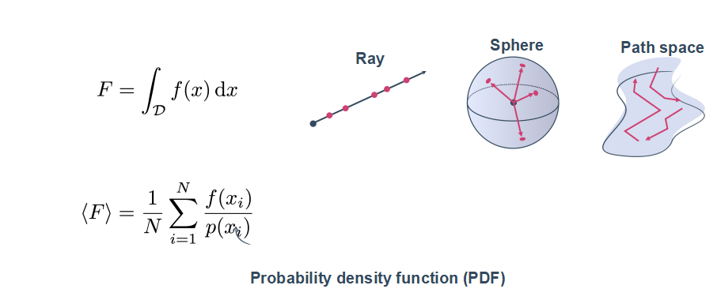

由于VRE方程中的内散射项，来自于其它各个方向的外散射，展开是个无限积分，因此很难求出解析解，可以采用蒙特卡洛积分进行数值计算。

蒙特卡洛积分资料很多，这里不做过多介绍，其核心思想是给定一个积分域D，这个积分域可以是一根光线上的任意距离，一个球面，一个路径的空间，要计算这个积分域D内函数$f(x)$的积分，可以在D范围内生成一系列样本，这些样本代入$f(x)$,再除以该样本对应的概率密度，多个样本加权平均，可得到积分的估计。

蒙特卡洛数值计算 $f(x)$ 在积分域 D 内的积分，如下，

$$
\int_{D} f(x)dx = \lim_{N \to \infty} \frac{1}{N} \sum_{i=1}^{N} \frac{f(X_i)}{p(X_i)}
$$

VRE 体绘制方程如下

$$
L(\mathbf{x}, \omega) = \int_{0}^{z} T(\mathbf{x}, \mathbf{y}) \left[ \mu_{\text{a}}(\mathbf{y}) L_{\text{e}}(\mathbf{y}, \omega) + \mu_{\text{s}}(\mathbf{y}) L_{\text{s}}(\mathbf{y}, \omega) \right] dy + T(\mathbf{x}, \mathbf{z}) L_{\text{o}}(\mathbf{z}, \omega)
$$

利用蒙特卡洛积分计算VRE，简写，取其中一个样本，可写作:

$$
\langle L(\mathbf{x}, \omega) \rangle = \frac{T(\mathbf{x}, \mathbf{y})}{p(y)} [\mu_{\text{a}}(\mathbf{y}) L_{\text{e}}(\mathbf{y}, \omega) + \mu_{\text{s}}(\mathbf{y}) L_{\text{s}}(\mathbf{y}, \omega)] + \frac{T(\mathbf{x}, \mathbf{z})}{P(z)} L_{\text{o}}(\mathbf{z}, \omega)
$$

被积函数是对距离的积分，那么在定义域随机取一个距离 $y$，将 $y$ 代入被积方程，并除以该距离的 $y$ 对应的概率密度值。如果随机的距离 $y$ 穿过了介质，到达了对应的表面点 $\mathbf{z}$，则计算第二个求和项：位置 $\mathbf{z}$ 处的 radiance 衰减，并除以对应的概率密度值 $P(z)$。

因此距离采样，就是讨论**如何生成随机的距离 $y$，以及计算 $y$ 对应的概率密度值**。

直观上概括距离采样是求什么：**光子在和下一个介质粒子作用之前，可以飞多久？**

距离采样的方法可分为两大类：模拟真实的方法和非模拟真实的方法。

## Analog 和Non-Analog模拟真实和非模拟真实方法

根据算法是否严格遵循光传播的物理过程，对算法进行分类，分成Analog模拟方法，和Non-Analog非模拟方法。

### Analog方法

Analog方法中光线沿着传播方向传播，直到和下一个粒子发生碰撞，这类似于现实世界中光子与粒子的相互作用。这样的采样过程通常称为Free Path采样或者Free Flight采样。采样的过程可以是显式的，例如根据累计概率函数CDF反求距离，或者采用Null-Collision零碰撞方法进行概率推理来计算，这两种方法，下文会进行详细介绍。

Analog方法有着以下的特征：

* 和物理过程一致
* 生成free path样本
* 粒子particles的能量不变

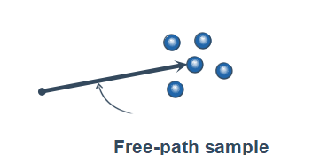

### Non-Analog方法

Non-Analog方法被用来提升Analog方法的采样效率。这类方法使用和Free Path真实分布偏离的分布进行采样，以提升收敛速度。

Non-Analog方法有着以下的特征：

* 和物理过程不一致
* 任意采样步长
* 粒子Particles/photons的能量改变

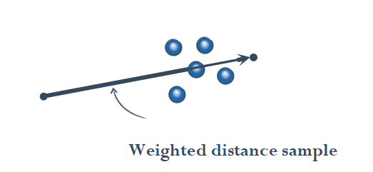

无论是Analog方法还是非Analog方法，都是按照一个特定的PDF进行采样。下面主要介绍Free Path这一Analog采样的方法。

## Free Path 求光线的下一次碰撞的距离

采样距离可以看作光线碰撞到下一个粒子所经过的距离,即光线的飞行距离，可看作随机变量X。

它的分布由介质中粒子的密度决定，但由于路径上粒子分布未知，所以X的pdf未知，不知道如何生成满足X分布的距离样本。这里的思路是，可以通过根据X的其它已知的函数来随机，这里比较巧妙地利用了累积分布函数CDF。

$$
T(y) = e^{-\int_{0}^{y} \mu_t(s)ds} = P(X > y)
$$

根据 Transmittance 透射比的定义，透射比可以看作光线飞行超过长度 $y$ 的概率，那么 $1$ 减去透射比，即飞行小于等于 $y$ 的长度即被终止的光线的累计概率，等于关于 $y$ 的累计密度分布 CDF。

$$
1 - T(y) = P(X \leq y)
$$

$$
Cumulative distribution function(CDF): \quad F(y) = 1 - T(y)
$$

由于累积分布函数 CDF 是单调递增函数，则必然存在反函数 $CDF^{-1}$，可以由 CDF 值求唯一的 PDF，同时 CDF 还是连续的，并且在 0 到 1 之间，这样很适合随机生成一个 CDF 值 $\varepsilon$，根据累计概率 $\varepsilon$ 代入 $CDF^{-1}$ 反求 $y$。

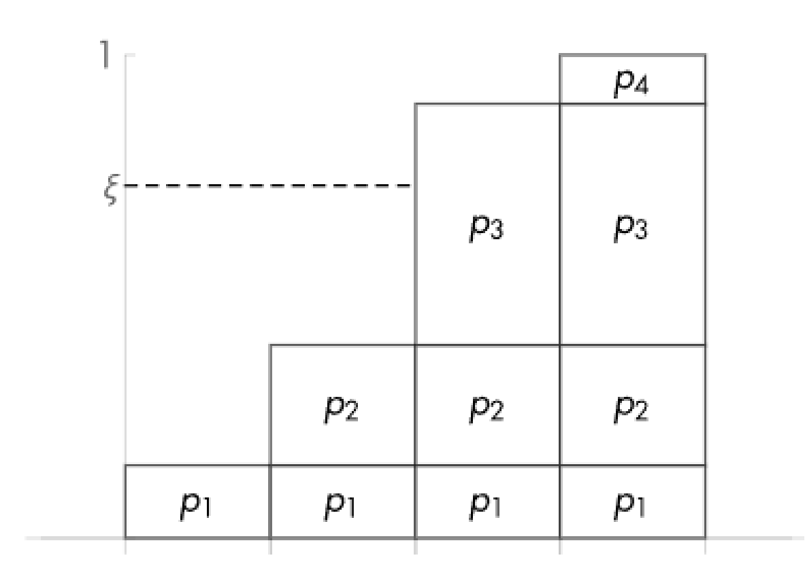

$$
\xi = 1 - e^{-\tau(y)} = 1 - e^{-\int_{0}^{y} \mu_t(s)ds}
$$

求 $y$ 的概率密度值 $PDF(y)$ 也很巧妙，CDF 是 PDF 的积分，PDF 是 CDF 的导数。

$$
PDF(y) = \frac{dF(y)}{dy} = \frac{d}{dy}(1 - e^{-\tau(y)}) = \mu_t(y)e^{-\tau}
$$

根据上述公式，求距离 $y$ 的方法有三种：

* 解析法
* 半解析法（Regular Tracking）
* 近似法（Ray Marching）。

### 解析法

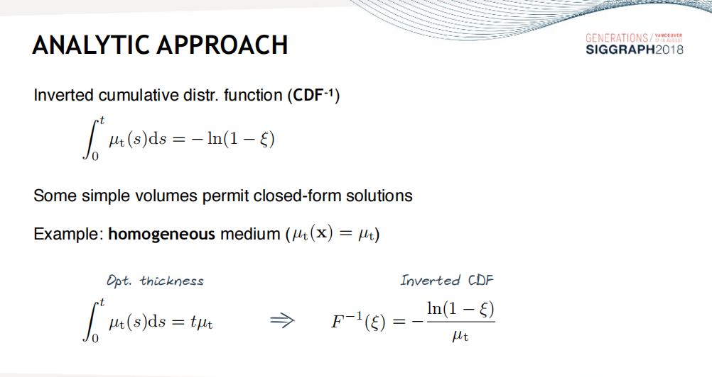

当介质是均匀介质时，消光系数是一个定值，光学厚度即等于距离乘以消光系数。在$CDF^{-1}$函数中，随机给一个累计概率$\xi$代入，再代入是常数的消光系数，即可求得上图距离t。

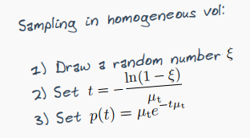

上述公式假定介质是无限的，在存在固定边界的情况下，将超出最近边界的位置PDF Clamp到零，重新计算CDF。最终公式见下表。

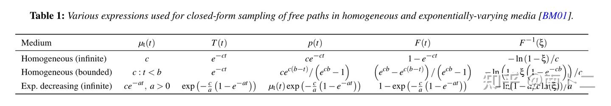

解析法计算非常简单，然而大部分的介质并非各向同性，也没有解析解。

### 半解析法（Regular Tracking）

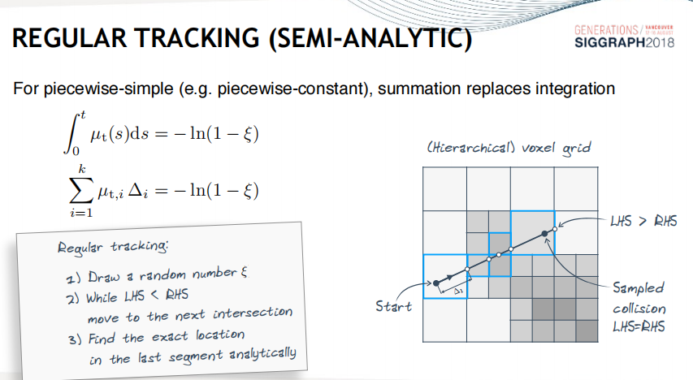

半解析法将体数据看成分段均匀的结构，随机一个累计概率密度$\xi$，左边等式不断累积求和，当左边等式大于右边时，确定t值在当前均匀介质范围中，通过解析法求得t的精确位置。Regular Tracking最大的局限性在于需要和所有非均匀介质的边界碰撞，计算量比较大。可以通过均匀网格划分、八叉树划分等方式，预先存储物体的边界。

### 近似法（Ray Marching）

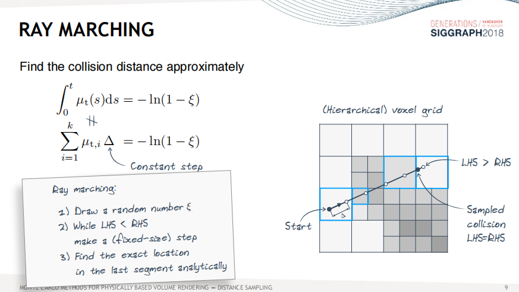

Ray Marching和Regular Tracking主要区别在于Regular Tracking步长不固定，取决于均匀介质间的位置，而Ray Marching的步长是固定的。叫做近似法，是因为将积分的形式简化成累计求和，因此是近似的方法。

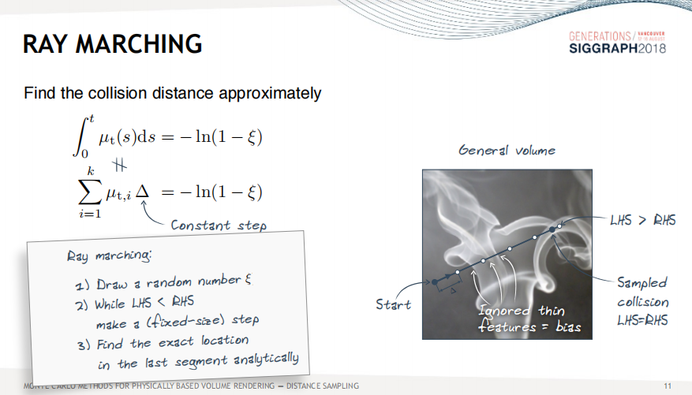

Ray Marching的局限性在于忽略了一个步长范围内消光系数的变化，如果一个步长内存在一个很薄的边界，那么边界在采样中就会错过，因此不够精确。同时，Ray Marching是一种有偏的方法。

## 根据采样距离计算透射比

从位置 $\mathbf{y}$ 到 $\mathbf{x}$ 经过距离 $y$ 的透射比 Transmittance：$T(\mathbf{y} \to \mathbf{x}) = L_{\mathbf{y}} / L_{\mathbf{x}} = e^{-\int_{0}^{y} \mu_{\text{t}}(\mathbf{s}) dt}$

是到达时 radiance 与出射时 radiance 的比值。

其中光学厚度：$\tau(\mathbf{x}, \mathbf{y}) = \int_{0}^{y} \mu_{\text{t}}(\mathbf{s}) dt$

根据公式，透射比是自然对数的负光学厚度次幂。因此透射比有如下特性：

$$
T_{r}(\text{p} \to \text{p}') = T_{r}(\text{p}' \to \text{p})
$$

投射比的计算和距离采样的方法对应，可分为三类方法。

* 通过计算光学厚度的估计，计算透射比
* Estimators using free-flight sampling
* Estimators using null collisions

### 均匀介质的解析解

当介质是均匀介质时，消光系数是定值，透射比可以求得解析解。

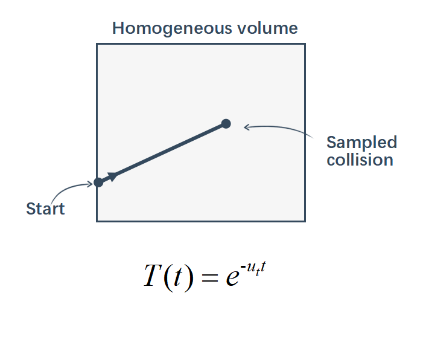

当介质可以看作分段均匀介质时，可以采用分段线性的Regular Tracking，分段代入函数求精确值。

### Regular Tracking中的求解

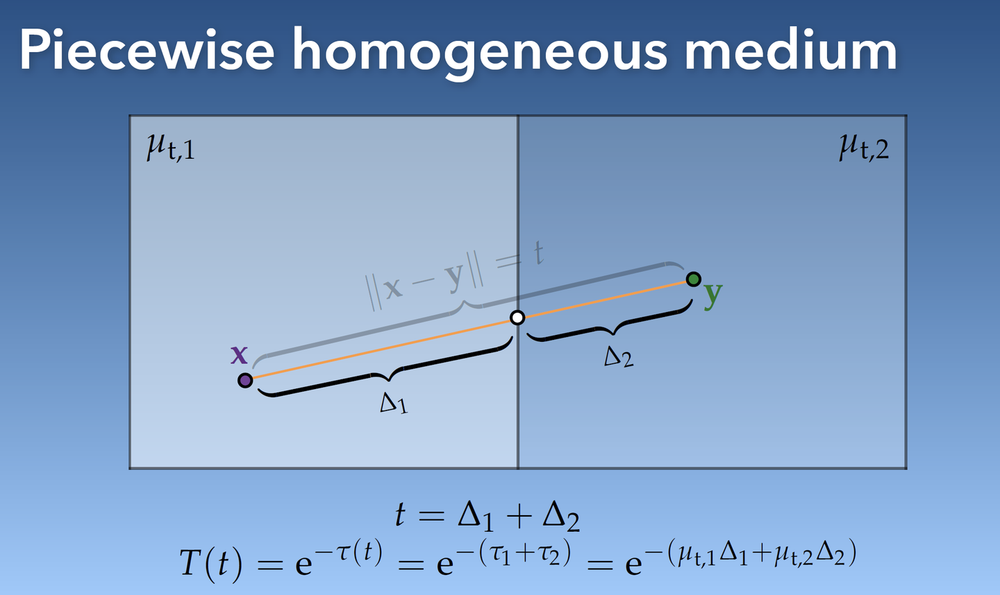

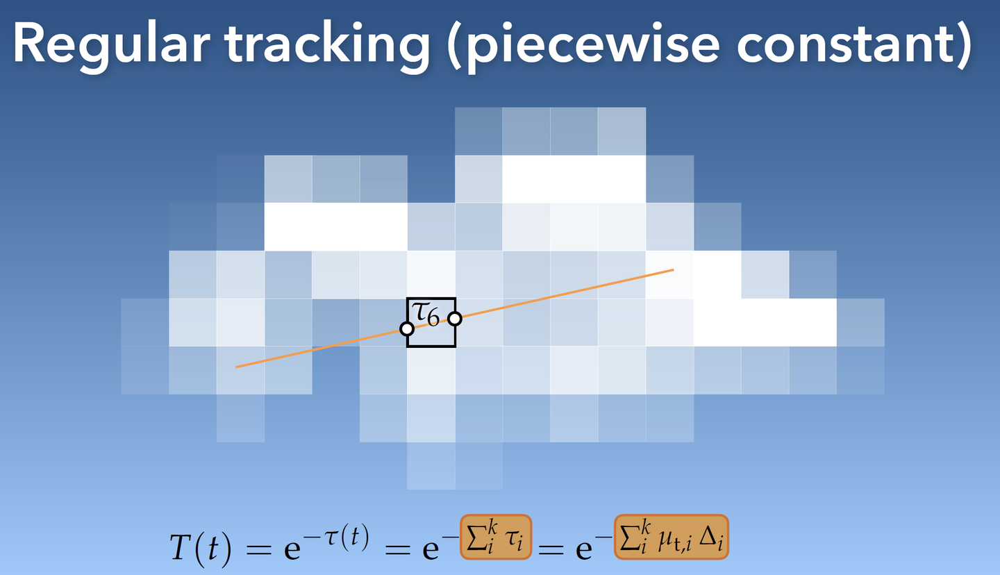

### Ray Marching 中的计算

上面 Regular Tracking 需要找到所有介质的边界，而 Ray Marching 通过固定的步长进行近似，避免了 Regular Tracking 需要找到边界的计算。使用 Ray Marching 距离采样时，透射比可写成以下，转化成计算光学厚度的估计。

$$
\langle T(t) \rangle_{\text{RM}} = e^{-\langle \tau(t) \rangle}
$$

根据光学厚度估计的计算方式不同，可分为两类计算方式：

* 光学厚度的黎曼求和近似

计算光学厚度最直接的方式是采用黎曼求和，假设每个固定步长内，它的消光系数是定值。

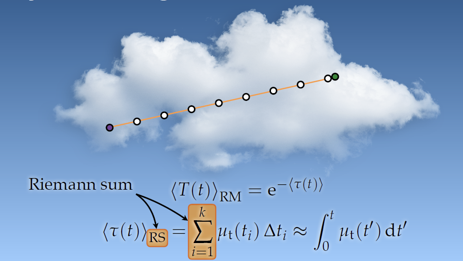

由琴生不等式，和黎曼求和中的近似，可得Ray Marching是有偏的。

另外两种方法略为复杂，这里就不多介绍了。

## 相函数

描述表面的光线散射分布的函数是BRDF，描述参与介质(Participating Media)上散射分布的函数即Phase Function。参与介质由不同半径的粒子组成。这些粒子的分布将影响光线以一定角度入射，以不同的概率散射到不同方向。使用Phase Function相函数可以从宏观角度描述光线的散射方向的分布：给定入射方向，不同散射方向分布概率。

体绘制的Phase Function可对应于表面的BRDF，它们的单位都是立体角分之一。区别是Phase Function分布在一个球面上（包含前向散射和后向散射），BRDF则分布在一个半球上，是后向散射。

### 各项同性和各项异性介质

介质可分为各向同性和各向异性两类。

#### isotropic各向同性介质

物理上的意义是指物体的物理、化学性质不因方向而有所变化性，即在不同方向所测得的性能数值是相同的。常见的介质一般都是各向同性的介质。

:::note

这里有个容易混淆的概念均匀介质，均匀介质Homogeneous Media，指的是各个位置吸收系数和散射系数相等，是常数值。

:::

具体来说，参考介绍光线和介质的相互作用的部分提到，吸收系数、散射系数等是关于**位置和方向**的函数，对于各项同性介质，由于各个方向物理属性相同，吸收系数、散射系数可简化成位置的函数。针对这种介质的相函数，是关于入射角$\omega_i$和出射角$\omega_o$夹角$\theta$的一维函数，一般写成参数化的形式$p(\cos(\theta))$。其中$\theta$被称为 **散射角（scattering angle）** ，是光线入射方向和散射后的出射方向之间的夹角。

#### Anisotropic各项异性介质

物体的物理、化学性质在不同方向所测得的性能数值是不同的。这种介质的内部粒子排布成相干结构，例如具有细粒度的东西都主要在一个方向上，头发、金属拉丝等可以看成这类介质。这种介质的相函数和BRDF类似，是输入、输出立体角的4D函数$p(\theta_i,\phi_i,\theta_o,\phi_o)$。

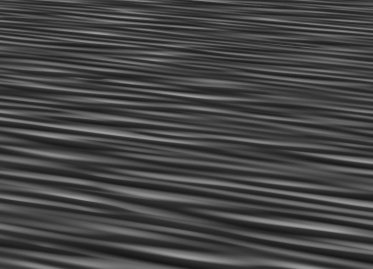

介绍完介质的各向同性和各向异性的特性，下面主要介绍各相函数。这里有点绕，相函数本身，也可以分为各向同性和各向异性的相函数。各向同性的介质可以有着各向异性的相函数。

### 各项同性和各项异性Phase function

#### 各向同性相函数

各向同性相函数，各个方向散射的概率一致，为了保持能量守恒，没有能量增益或损失，因此确保在球面上积分值是1。

$$
p(\omega_i,\omega_o) = \frac{1}{4\pi}
$$

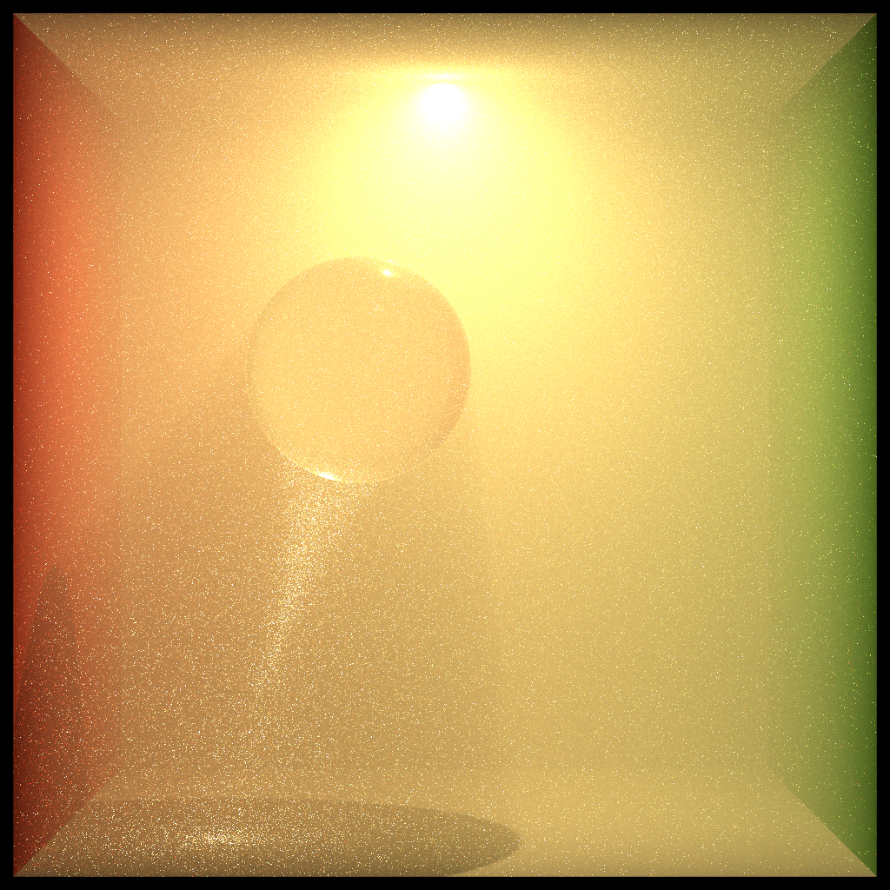

#### 各向异性相函数

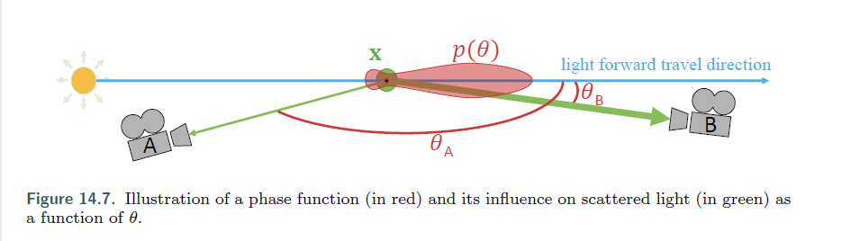

上图是一个典型的各向同性介质的各向异性相函数。入射方向用蓝色表示，x点和A和B两个相机的位置的绿色连线代表了出射方向；图中红色部分代表了一个各向异性的相函数$p(\cos(\theta))$，相函数以极坐标表示，级线代表了某个出射方向的概率。上图相函数的形状是一大一小两个lobe，后向传播对应小lobe，前向传播对应大lobe，说明出射到A点的概率比出射到B点处小。

基于物理的Phase function根据粒子大小相对于波长的比例，确定Phase function的类型，下面公式r是粒子半径，$\lambda$是光线的波长

$$
s_p = \frac{2\pi r}{\lambda}
$$

* 当比值sp小于等于1，光线在空气中传播可以看作瑞利散射Rayleigh scattering
* 当sp约等于1，则是 Mie 散射
* 当sp大于1，则是几何散射，几何散射发生在明显大于光波长的粒子上。在这种情况下，光可以在每个粒子内折射和反射。这种行为需要一个复杂的散射相位函数来在宏观层面上模拟它。现实生活的例子是雨后的彩虹，光线打到小水珠，在水珠内部发生散射。

## 几种经典散射和相函数

### Rayleigh散射

光线在空气中传播，和空气中的粒子发生散射，是一种Rayleigh散射。这里前向散射和后向散射的lobe一样，前向散射和后向散射分布比较平均。

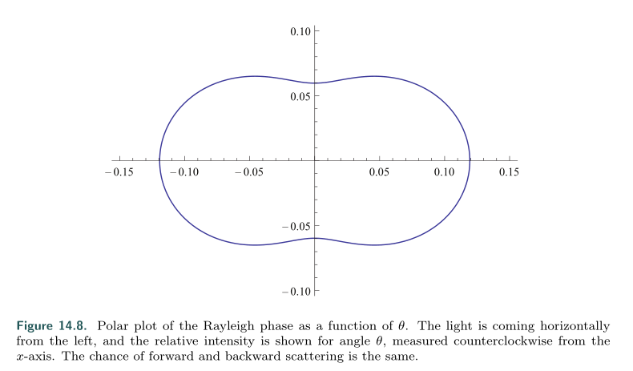

Rayleigh散射和光的波长高相关。散射系数和波长的四次方分之一成正比。这意味着波长更短的蓝光比红光散射更多，这样算天空为什么是蓝色的的原因。

$$
\sigma_s(\lambda) \propto \frac{1}{\lambda^4}
$$

如果介质中的粒子远小于光的波长，例如行星大气层中的单个分子，此时可以使用 **瑞利相函数（Rayleigh phase function）** ，非偏振光的瑞利相函数如下：

$$
f_p (\theta) = \frac{1}{4\pi} \frac{3}{4} (1 + \cos^2 \theta)
$$

### Mie散射

Mie散射和光线的波长不相关。针对某一种大小的粒子的Mie散射有着比较显著的方向性lobe，意味着在某个方向的散射比例较高，其它方向很低，这样对于计算非常耗时。不过幸运的是，介质通常有着比较连续的颗粒大小分布，对所有不同大小半径的粒子的Mie散射相函数求平均，可以用比较平滑的相函数来表示Mie散射。

Henyey-Greenstein是比较常用的Mie散射函数，或者说是一种相函数模型。它不是不能表达真实世界散射行为的复杂性，但可以很好的从宏观描述lobe。它可以用来表示任何烟、雾或粉尘之类的参与介质。

$$
p_{hg}(\theta, g) = \frac{1-g^2}{4\pi(1+g^2-2g \cos \theta)^{1.5}}
$$

这里 $g$ 可以用来调节 lobe 的形状和分布，$g=0$ 是各向同性相函数，$g>0$ 主要是前向散射/前散射，$g < 0$ 主要是后向散射/背散射。

换种说法：

* 如果 $g \in (-1,1)$，则被称为不对称参数（asymmetry parameter），它近似了所有方向光线散射角余弦的平均值；
* 如果 $g>0$ ，则主要发生前向散射（forward scattering），向入射方向相反的方向散射去更多的能量；
* 如果 $g<0$，则主要发生后向散射（backward scattering），向入射方向散射回更多的能量；

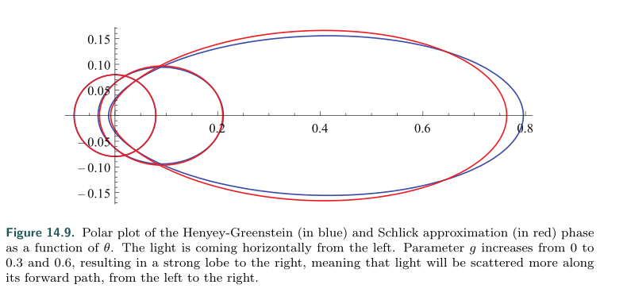

Schlick phase function可以用来当作HG相函数的简化，避免了幂函数计算。

$$
p(\theta, k) = \frac{1-k^2}{4\pi(1+k \cos \theta)^2}, \quad \text{where} \quad k \approx 1.55g - 0.55g^3
$$

分别是背散射和前散射为主导时，两种介质的渲染结果：

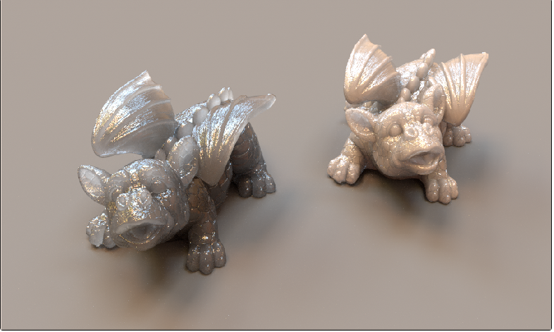

左边介质g=-0.7，右边介质g-0.7，因为光源在后面，因此前散射主导的右边物体更亮

在Henyey–Greenstein模型中，$g$ 的值是由明确的物理意义的。它表示相函数和 $\omega\prime$，$\omega$ 夹角余弦值的乘积的期望值，即：

$$
g = \int_{S^2} p(-\omega, \omega') (\omega \cdot \omega') d\omega' = 2\pi \int_{0}^{\pi} p(-\cos \theta) \cos \theta \sin \theta d\theta
$$

当 g=0 时，表示介质向各个方向均匀散射。

一些非常复杂的相函数无法用一个非对称参数来表示，此时可以将相函数拟合成数个带权重的Henyey–Greenstein相函数的和。比如后面我们要讲的云的散射相函数，就是使用两个 HG 函数插值来拟合的。
