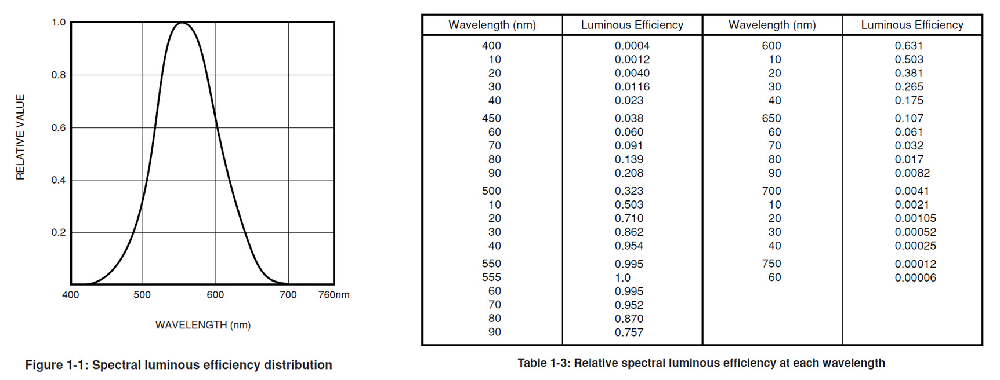
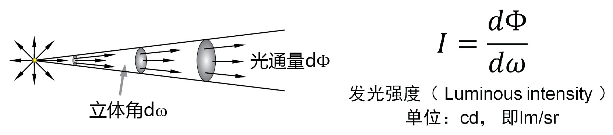
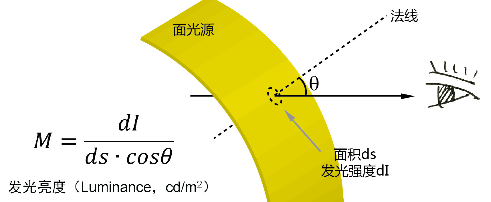
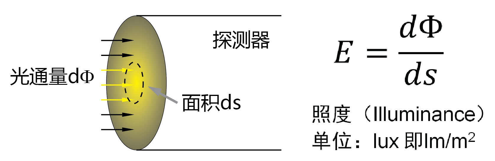
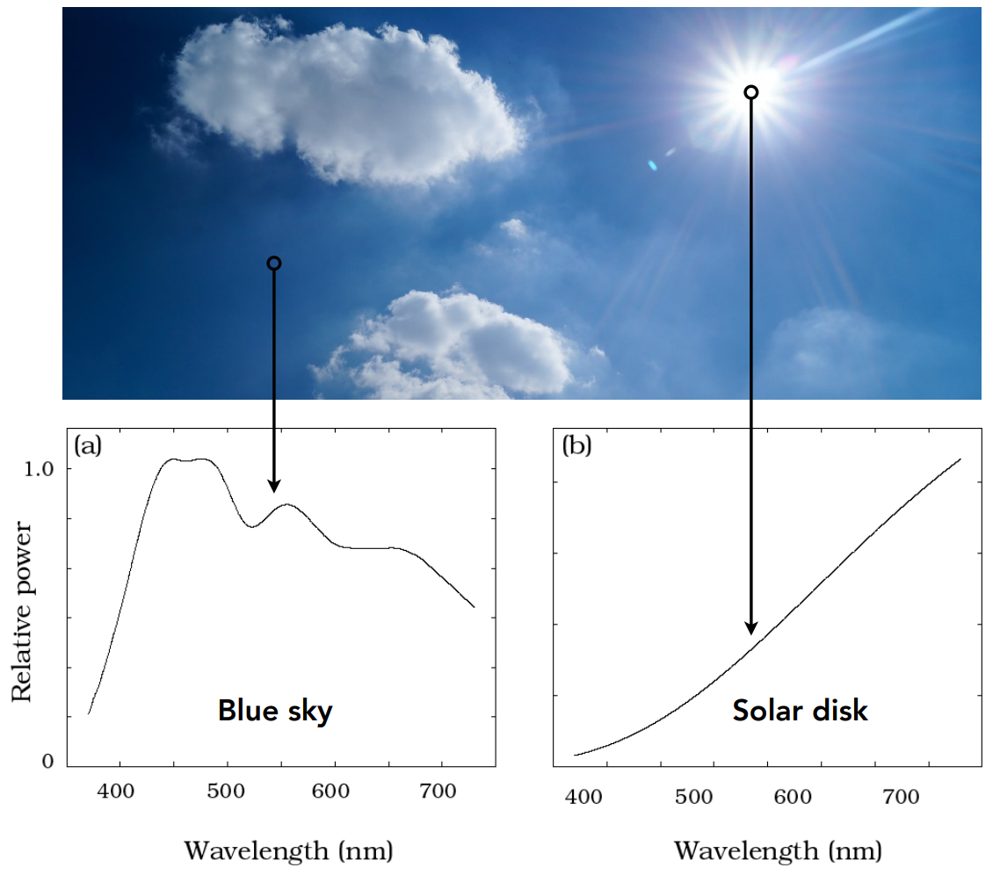
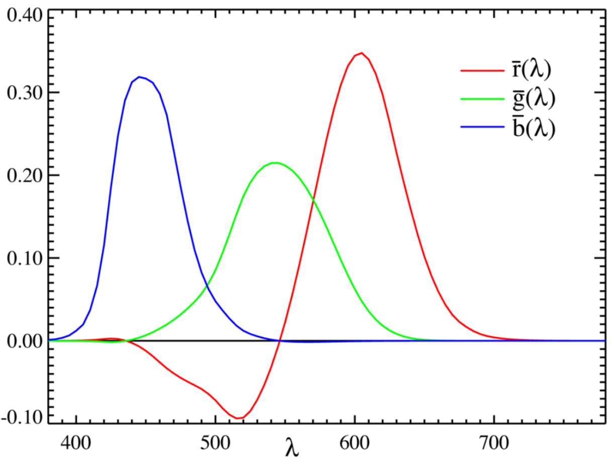
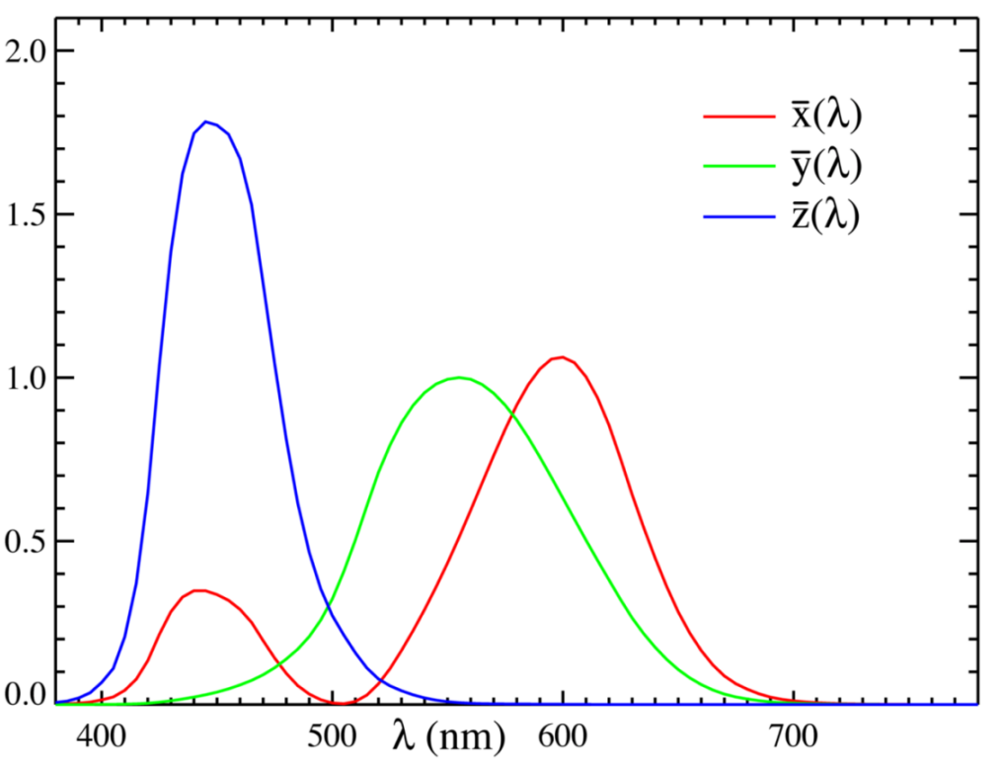

# 衡量辐射（光）的能量——辐射度量学与光度学

辐射度量学在前文已有介绍，这里把辐射度量学和光度学联系起来。

## 辐射度量学 vs. 光度学

流明（lm）、勒克斯（lux）、坎德拉（cd）、坎德拉每平方米（cd/m2）等4个单位都属于光度学（Photometry）的概念，与辐射度量学（Radiometry）概念，如瓦特（W），是可以一一对应进行理解的。其差别在于：

- Photometry（光度学）：关键词是“眼睛，人的感觉"
- Radiometry（辐射度量学）：关键词是“实际能量”。

举个例子，对于一个光源，如果其发出的光能量很高，但都集中在人眼不敏感的红外波段，那么从辐射度量学（radiometry）上面，这个光源很强，但是从光度学（photometry）方面，这个光源就比较弱。

所以人眼对于光谱中不同波长的响应就是两类参数之间转换的关键了。这个值叫Luminous efficiency（$Φ(λ)$）。因为555nm处人眼最灵敏，所以用这个波长的数据作为相对数值的标准，也就是v(555nm)=1；其他波长的Luminous efficiency（$Φ(λ)$）则都是一个小于1的相对值。对应的数值见下右图，曲线见下左图：

## 辐射通量与光通量

辐射源（光源）发出的所有辐射功率被称为**辐射通量（radiant flux）**，符号 $\Phi_{\text{e}}$，单位瓦特（W）；

光源发出的所有功率中，能被人眼感知的那部分功率被称为**光通量（luminous flux）**，符号 $\Phi_{\text{v}}$，单位流明（lumen，符号 lm）；

* 光通量可用来衡量灯具发光的能力，例如，米家台灯 1s 的光通量有 520 lm；

人眼对不同波长的光的灵敏度不同，根据辐射对国际照明委员会（CIE）标准光度观察者的作用，可从辐射通量导出光通量。明视觉下两者关系是：

$$
\Phi_{\text{v}} = K_m \int_{0}^{\infty} \frac{\text{d}\Phi_{\text{e}}(\lambda)}{\text{d}\lambda} V(\lambda) \text{d}\lambda
$$

其中，$K_m$ 是辐射的光效能的最大值，
$\frac{\text{d}\Phi_{\text{e}}(\lambda)}{\text{d}\lambda}$ 是辐射通量的光谱分布，
$V(\lambda)$ 是光谱光视效率。

* 明视觉（photopic vision）是指正常人眼适应了光亮度水平在几个尼特以上时的视觉，这时视锥细胞起主要作用。

## 辐射强度与发光强度

**辐射强度（radiant intensity）**是在给定方向上单位立体角内的辐射通量，符号 $I_{\text{e}}$，单位 W/sr；

* 其中，sr 是立体角的计量单位球面度（steradian）的符号；

相应地，**发光强度（luminous intensity）**是在给定方向上单位立体角内的光通量，符号 $I_{\text{v}}$，单位坎德拉（candela，符号 cd），$1\text{ cd} = 1\text{ lm/sr}$。

## 辐射亮度与光亮度

**辐射亮度（radiance）**是辐射源在给定方向的单位投影面积在单位立体角内的辐射通量，符号 $L_{\text{e}}$，单位 $\text{W/}(\text{sr} \cdot \text{m}^2)$。

相应地，**光亮度（luminance）**是给定方向上单位投影面积的面光源沿该方向的发光强度，符号 $L_{\text{v}}$，单位尼特（nit），$1\text{ nit} = 1\text{ cd/m}^2$。

* 光亮度可用来衡量光源的亮度，例如，iPhone 8 屏幕显示的最大亮度是 625 尼特，阴天的天空平均大约两千尼特，晴朗的天空平均大约八千尼特，正午的太阳大约十六亿尼特。

## 辐射照度与光照度

在光线追踪算法中还涉及到对辐射照度的计算。**辐射照度（irradiance）**是入射到表面一点处单位面积上的辐射通量，符号 $E_{\text{e}}$，单位 $\text{W/m}^2$。

相应地，**光照度（illuminance）**是入射到表面一点处单位面积上的光通量，符号 $E_{\text{v}}$，单位勒克斯（lux，符号 lx），$1 \text{ lx} = 1 \text{ lm/m}^2$。

* 光照度可用来衡量灯具照亮某处的能力，例如，米家台灯 1s 的中心照度值有 1250 lux；

## 对照表

| 描述                                                           | 客观（辐射学）                                                                      | 能被人眼感知（光度学）                                                    |
| :------------------------------------------------------------- | :---------------------------------------------------------------------------------- | :------------------------------------------------------------------------ |
| **发出的所有功率**  符号：$\Phi$                  | **辐射通量（radiant flux）** 单位：瓦特（Watt, W）                       | **光通量（luminous flux）** 单位：流明（lumen, lm）            |
| **单位立体角的功率**  符号：$I$                   | **辐射强度（radiant intensity）** 单位：W/sr                             | **发光强度（luminous intensity）** 单位：坎德拉（candela, cd） |
| **单位出射表面投影、单位立体角的功率**  符号：$L$ | **辐射亮度（radiance）** 单位：$\text{W/}(\text{sr} \cdot \text{m}^2)$ | **光亮度（luminance）** 单位：尼特（nit）                      |
| **单位入射表面的功率**  符号：$E$                 | **辐射照度（irradiance）** 单位：$\text{W/m}^2$                        | **光照度（illuminance）** 单位：勒克斯（lux, lx）              |

# 颜色的呈现——色度学

**色度学（colorimetry）** 是研究颜色度量和评价方法的一门学科。

### 光谱功率分布

景物表面之所以呈现出某种颜色，是因为它向观察方向发出了相应颜色的光，光的颜色由相应的光谱功率分布所刻画，而 **光谱功率分布（spectral power distribution，SPD）** 则是光辐射量（如光亮度、光照度、发光强度、光通量等）或辐射度量（如辐射亮度、辐射照度、辐射强度、辐射通量等）按波长的分布。

计算机在绘制图像时，通过计算景物表面发出光线的光谱功率分布，来得到图像中相应位置像素的颜色。

例如太阳光光谱功率分布的变化：

可见光是波长大约在 380 至 780 nm 之间，能引起视觉的电磁波。单色光的颜色与对应波长大致的范围如下表，它们之间没有清晰的边界。

| 颜色 | 波长（纳米） |
| ---- | ------------ |
| 紫   | 380-450      |
| 蓝   | 450-485      |
| 青   | 485-500      |
| 绿   | 500-565      |
| 黄   | 565-590      |
| 橙   | 590-625      |
| 红   | 625-780      |

### 三原色与颜色空间

光谱功率分布是以波长为自变量的连续函数，如果在绘制时单独地考虑每一种特定频率光的辐射亮度，则计算的过程会相当麻烦，在实际应用中会根据人类的视觉生理进行近似。

视觉来源于光作用于视觉器官引发的感受细胞兴奋。人眼有三种视锥细胞，分别对短（S, 420-440 nm）、中（M, 530-540 nm）和长（L, 560-580 nm）波长的光的响应最大。根据三种视锥细胞的刺激比例，便能描述任一种颜色的感觉。根据人类的视觉生理，任何一种颜色都可以通过适当地混合三种基本颜色而得到，这三种基本颜色称为 **原色（primary color）** 。

为了方便计算机建模，可以根据**三原色定律**，制定一个三种原色的标准集，则所有色光都可以用这三个原色离散地表示，而原色的权值则通过颜色匹配实验确定，不同的原色选取方案便对应了不同的 **颜色空间（color space）** 。

* 用三原色来表示光谱实际上是不准确的，因为一组三原色的权值可以对应于多个不同的光谱，存在同色异谱（metamerism）现象；

### 常见的颜色空间

**CIE 1931 RGB 颜色空间**选取波长分别为 700 nm（红）、546.1 nm（绿）、435.8 nm（蓝）的三种单色光，从中得到三原色，进行实验、建立颜色空间；

* 在 CIE 1931 RGB 颜色空间中，颜色匹配的原色权值可能是负的。例如，波长 500 nm 的单色光对应的目标颜色的红色权值为负，这意味着目标颜色和红色混合的颜色可以匹配绿色和蓝色混合的颜色；

**CIE 1931 XYZ 颜色空间**由 CIE 1931 RGB 颜色空间经线性变换后得到，与后者相比，前者所有颜色的原色权值都大于等于零，而且还有不少其它的好处。

**HSV 非线性颜色空间**用色调（hue）、饱和度（saturation）、明度（value）这三个分量来表示颜色；

* 色调表示不同的颜色；
* 饱和度表示某种颜色的纯度；
* 明度是人眼感觉到的明亮程度；
