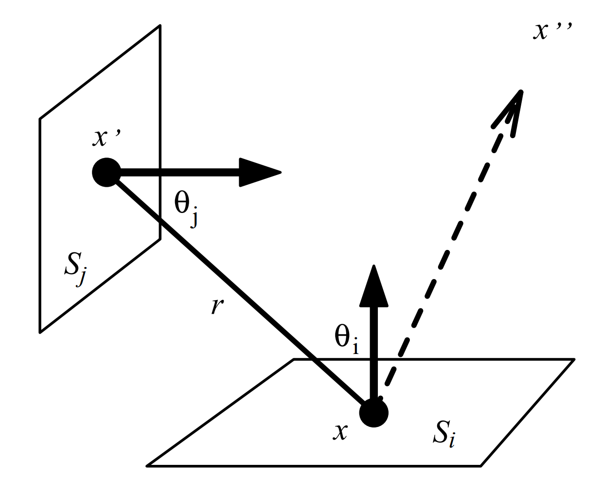
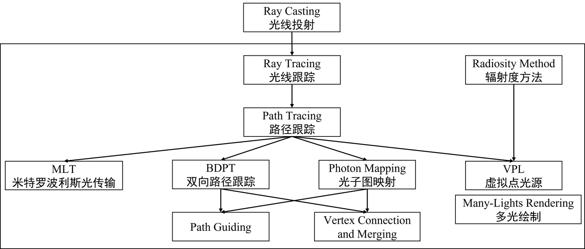
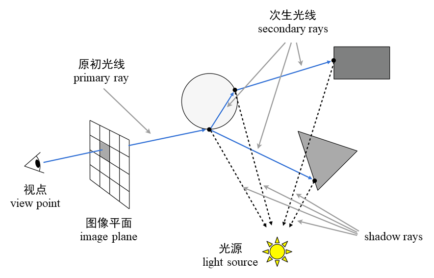
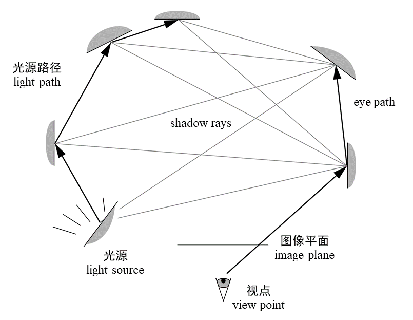
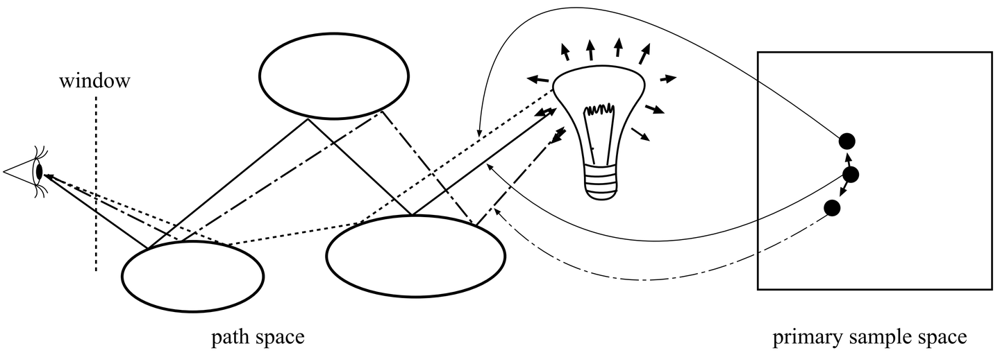
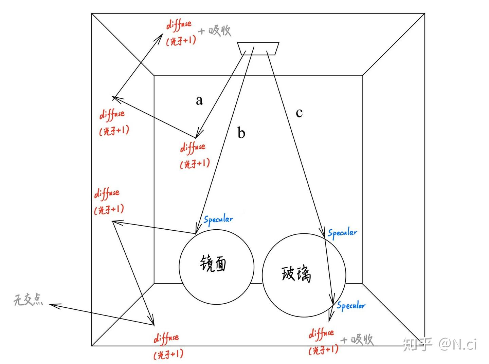
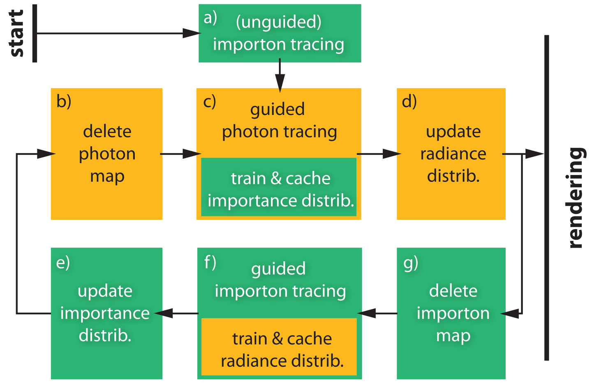
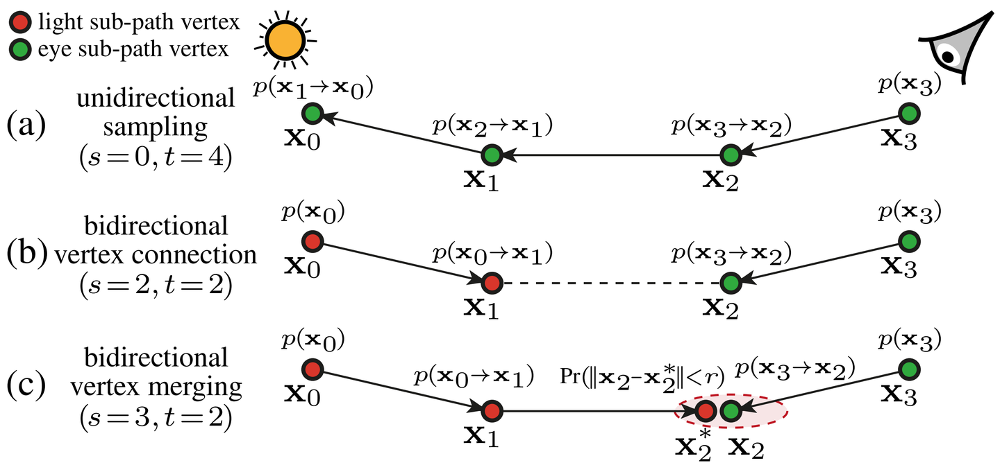
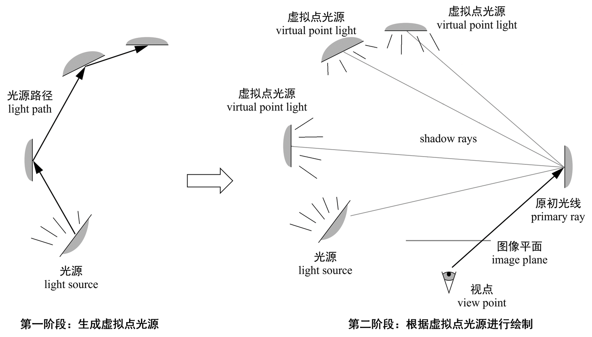

没休息好，今天有些疲惫，来聊点轻松的全局光照的内容。

## 光照模型（Illumination Model）

**光照模型（illumination model）** 描述了物体表面入射光能和出射光能之间的量化关系，它包括：

* **全局光照模型（global illumination model）** ： 它描述了光在三维场景中的传播，包含了直接光照和间接光照效果。例如路径跟踪（path tracing）、双向路径跟踪（bidirectional path tracing）、辐射度方法（radiosity method）。
* **局部光照模型（local illumination model）** ： 它是场景中的光照射到物体表面时，计算反射光、折射光的数学模型。例如冯模型（Phong model）、微表面模型（Microfacet model）。

## 渲染方程（Rendering Equation）

全局光照模型需要描述光在三维场景中的传播。

如果只考虑光的反射，则场景中任一物体表面的任一点朝任意方向出射的能量，由该点自身朝该方向出射的能量，以及源于其它点及环境入射到该点并朝该方向反射的能量共同构成，它们之间的关系可被总结为如下被称为 渲染**方程（rendering equation）** 的公式：

$$
L_o (x, \omega_o) = L_e (x, \omega_o) + \int_{\Omega^+} L_i (x, \omega_i) f_r (x, \omega_i, \omega_o) \cos \langle \omega_i, n \rangle \, \mathrm{d}\omega_i
$$

或者，不妨认为光能在场景中的物体表面之间辐射传输，而环境背景也可以当作一个巨大的、包含了场景中所有物体的天空球，于是物体表面一点 $x$ 向任一点 $x''$ 辐射传输的能量 $L_o (x \rightarrow x'')$ 可以由 $x$ 因自身发光而向 $x''$ 辐射传输的能量 $L_e (x \rightarrow x'')$ 以及 $x$ 反射的所有点 $x'$ 向 $x$ 辐射传输的能量之和所确定。

于是，渲染方程又可以表示为在所有物体表面 $\mathcal{M}$ 上对面元 $\mathrm{d}A$ 进行积分：

$$
L_o (x \rightarrow x'') = L_e (x \rightarrow x'') + \int_{\mathcal{M}} L_i (x' \rightarrow x) f_r (x' \rightarrow x \rightarrow x'') G (x' \leftrightarrow x) \, \mathrm{d}A(x')
$$

其中：

* $L_i (x' \rightarrow x)$ 是 $x'$ 向 $x$ 辐射传输的能量；
* $f_r (x' \rightarrow x \rightarrow x'')$ 是双向反射分布函数（bidirectional reflection distribution function, BRDF），描述了 $x'$ 向 $x$ 辐射传输的能量被反射到 $x''$ 的比例；
* $G (x' \leftrightarrow x) = \frac{\cos \theta_i \cos \theta_j}{\|x' - x\|^2} \mathrm{v} (x' \leftrightarrow x)$
  * $\theta_i$、$\theta_j$ 分别是 $x$ 与 $x'$ 的连线和 $x$ 及 $x'$ 所在表面的法线的夹角；
  * $\|x' - x\|^2$ 是 $x$ 与 $x'$ 之间距离的平方；
  * $\mathrm{v}(x' \leftrightarrow x) = \begin{cases} 1 & x \text{ 与 } x' \text{ 之间无遮挡，可见} \\ 0 & \text{其它} \end{cases}$

设所有景物表面 $\mathcal{M}$ 中，发光物体的表面构成了集合 $\mathcal{M}_e$，则有：

$$
\begin{aligned}
&\forall \,x,\, x^{\prime},\,x^{\prime\prime},\,x_1,\,x_2,\,\cdots \in \mathcal{M},\quad x_0 \in \mathcal{M}_e\\
&\quad\quad L\left(x \to x^{\prime\prime}\right) = L_e\left(x \to x^{\prime\prime} \right) + \int _{\mathcal{M}} L \left( x^{\prime} \to x \right) \, f_s (x^{\prime} \to x \to x^{\prime\prime}) \, \mathrm{G}\left(x^{\prime} \leftrightarrow x\right) \,\mathrm{d} A\left(x^{\prime}\right) \\
&\quad\quad\quad\quad\quad\quad\quad\, = L_e\left(x \to x^{\prime\prime} \right) \quad\quad\quad \text{自身发光} \\
&\quad\quad\quad\quad\quad\quad\quad\quad\, + \int_{\mathcal{M}_e} L \left( x_0 \to x \right) \, f_s (x_0 \to x \to x^{\prime\prime}) \, \mathrm{G}\left(x_0 \leftrightarrow x\right) \,\mathrm{d} A\left(x_0\right) \quad\quad\quad \text{直接光照} \\
&\quad\quad\quad\quad\quad\quad\quad\quad\, + \int_{\mathcal{M}}\int_{\mathcal{M}_e} L \left( x_0 \to x_1 \right) \, f_s (x_0 \to x_1 \to x) \, \mathrm{G}\left(x_0 \leftrightarrow x_1\right)\, f_s (x_1 \to x \to x^{\prime\prime}) \, \mathrm{G}\left(x_1 \leftrightarrow x\right) \,\mathrm{d} A\left(x_0\right) \,\mathrm{d} A\left(x_1\right) \quad\quad\quad \text{间接光照，散射一次} \\
&\quad\quad\quad\quad\quad\quad\quad\quad\, + \cdots \quad\quad\quad \text{间接光照，散射多次}
\end{aligned}
$$

于是，渲染图像中第 $i$ 个像素 $m_i$ 对应的数值：

$$
m_i = \int_{\Omega} w_i(p) F(p) \, \mathrm{d}p
$$

* $p$ 是一条从光源上一点 $x_0$ 出发、进入视点 $x_m$ 的光路 $x_0 \rightarrow \cdots \rightarrow x_{m-1} \rightarrow x_m$，其中 $x_{m-1} \rightarrow x_m$ 进入视点，对应于从视点出发溯源光线抽样像素时生成的原初光线（primary ray）；
* $\Omega$ 是像素 $m_j$ 对应的所有光路构成的集合，它包括直接与光源上一点建立的光路 $x_0 \rightarrow x_m$，直接光照对应的光路 $x_0 \rightarrow x_1 \rightarrow x_m$，间接光照对应的光路 $x_0 \rightarrow x_1 \rightarrow \cdots \rightarrow x_m$；
* $F(p)$ 是光路 $p$ 向像素 $m_i$ 贡献的辐射亮度（光亮度）；
* $w_i(p)$ 是重建像素 $m_i$ 的滤波函数（filter function）；

递归地求解渲染方程，计算进入照相机镜头的光线拥有的辐射亮度，就可以得到图像相应像素的数值，生成目标图像。

## 全局光照模型的意义

虽然只需递归地求解渲染方程，就能渲染场景的全局光照效果，但是，求解一次渲染方程定积分就已经极为困难，更何况还需要递归地求取多次以计算直接光照和间接光照。如果不能高效地估计定积分的最终结果，那么目前达成渲染全局光照效果的目标将是不可能的。

求解渲染方程需要在球或半球对应的立体角范围内进行积分，而方程解的具体函数形式难以用数学解析方法求出。所以，为了高效地近似求解一系列的定积分，研究者发展出了各式各样的全局光照模型。

为了高效地计算积分，可以采用蒙特卡罗方法（Monte Carlo method）或拟蒙特卡罗方法（quasi-Monte Carlo method），根据随机数或伪随机数，按某个概率分布抽样被积函数，从概率计算积分的数学期望。蒙特卡洛方法结合光线跟踪，发展出了路径跟踪（path tracing）、（photon mapping）等方法。

或者，也可以采用有限元方法（finite element method），把场景中物体的表面划分成许多面片，然后根据能量传播的物理规律，模拟光能在这些面片之间辐射传输的过程，近似求解物体表面的光能辐射分布，由此发展出了辐射度方法（radiosity method）。

## 主要的全局光照模型概览

### Ray Tracing **（** 光线跟踪）

光线跟踪的思想可以追溯到光线投射。Appel 在1968年提出了 **光线投射（ray casting）** 的概念，即通过屏幕上的每一个像素向场景投射光线，求取距离视点最近的、光线与景物表面的交点，计算景物可见点的颜色，可类比于光栅化图形学。

**光线跟踪（ray tracing）** 实际上是一个框架，任何基于光在场景中传播的物理规律、从视点出发溯源光线的方法都可以归类为光线跟踪。

最初的光线跟踪由 Whitted 在1979年提出，在光线投射的基础上加入了光线与景物表面的交互，多出了一个递归溯源的过程，于是这种方法也被称为 **递归光线跟踪（recursive ray tracing）** 。具体而言，当求取了距离视点最近的、光线与景物表面的交点后，如果该点处的表面是散射面，则计算直接光源照射该点产生的颜色，否则根据反射定律或者折射定律继续溯源光线，直到光线逃逸出场景或者达到设定的溯源最大深度。

### Path Tracing **（** 路径跟踪 **）、** BDPT **（Bidirectional Path Tracing，** 双向路径跟踪）

**路径跟踪（path tracing）** 在递归光线跟踪的基础上引入了蒙特卡罗方法。当求取了光线与景物表面的交点后，根据随机数按某个概率分布抽样入射光线的方向，计算渲染方程积分的数学期望。

**双向路径跟踪（bidirectional path tracing，BDPT）** 在路径跟踪的基础上额外从光源出发创建光路，再连接从视点溯源的光路和从光源出发的光路上的点，创建多条光路，然后根据光线从这些光路传播的概率，合并各个光路传递的辐射亮度（光亮度）数学期望，即进行所谓的多重重要性抽样（multiple importance sampling，MIS），计算光线最后进入照相机生成图像相应像素的数值。

### MLT（Metropolis Light Transport，梅特罗波利斯光传输）

**梅特罗波利斯光传输（Metropolis light transport，MLT）** 在路径跟踪的基础上引入了马可夫链蒙特卡罗（Markov chain Monte Carlo，MCMC）方法，准确地说，是引入了梅特罗波利斯-黑斯廷斯算法（Metropolis-Hastings algorithm）来抽样整条光路。

简单地说，MLT 首先根据路径跟踪或 BDPT 生成初始的、完整的光路，然后按某个概率分布随机地扰动光路上的顶点，生成新的光路，再按一定的概率判断新的光路是否有效，累计有效光路的贡献，得到最终渲染的图像。

### Photon Mapping **（** 光子图映射）

无论是 BDPT 还是 MLT ，如果抽样光线生成的光路包含先镜面反射、再漫反射、然后镜面反射的路径，则相应的概率都会比较低，算法收敛的速度较慢。于是， **光子图映射（Photon Mapping）** 被提出以更好地渲染这些特定的场景，高效地实现焦散（caustics）效果。

简单地说，算法首先从光源出发，向场景散发携带有光能的粒子，让这些被称为光子（photon）的粒子在场景中被景物不断地反射、折射、散射，形成能量分布，然后从视点出发，去估计光线与景物表面交点附近光子的密度。

### Path Guiding

路径跟踪需要蒙特卡罗方法抽样光线的入射方向，如果抽样到的光线方向对应的实际入射概率越高，则求解渲染方程积分数学期望的方差越小，算法的效率就会越高。一般会根据局部光照模型确定的 BRDF 进行重要性抽样，以改善渲染的质量，但是，因为渲染方程中的被积函数同时也受到入射辐射亮度和可见性成分的影响，所以只考虑 BRDF 进行重要性抽样，在一些情况下是不够的。

一种缓解的措施是在溯源光线的同时，主动地抽样光源上一点，计算当前点的直接光照，避免直到递归追踪光线结束前都没有溯源到某个光源上。但是，如果场景中的物体相互遮挡严重，可见性成分比较复杂，则直接抽样光源往往会失败。于是，**Path Guiding** 系列算法被提出，算法的目标是寻求高效地建模入射辐射亮度场（incident radiance field）的方法，以用于重要性抽样而改善渲染的效果。

2014 年，Vorba 等人结合了 BDPT和光子图映射，提出了一种基于学习的方法，引导生成更有可能进入视点的光路。简单地说，算法首先分别从光源散发光子（photon）、从视点散发携带重要性的粒子（importon），让这些粒子与场景中的景物交互，分别生成辐射亮度分布和重要性分布；然后再进行双向路径跟踪，在生成视点子路径的时候，不仅考虑 BRDF，也考虑入射辐射亮度分布，而在生成光源子路径的时候，不仅考虑 BRDF，也考虑出射光线更可能进入视点的重要性分布。

### VCM（Vertex Connection and Merging）

VCM（Vertex Connection and Merging）是一种 BDPT和光子图映射的结合。核心思想是，在根据 BDPT连接视点子光路和光源子光路上的顶点来创建完整的光路时，即使两个顶点之间被遮挡了，也不丢弃这一条光路，而是使用光子图映射的思想，估计顶点附近的光子密度，最终实现整条光路的融并。

### Radiosity Method **（** 辐射度方法）

与光线跟踪不同， **辐射度方法（radiosity method）** 是一种有限元法，它把场景中物体的表面划分成许多面片（patch），然后根据能量传播的物理规律，模拟光能在这些面片之间辐射传输过程，近似求解物体表面的光能辐射分布，生成全局光照效果。

光线跟踪在执行前需要确定照相机的位姿、焦距、成像分辨率等参数，用以生成从视点出发溯源光线的方向，而辐射度方向则不需要这些观察场景方式的信息。而且，路径跟踪需要随机抽样以计算渲染方程积分的数学期望，存在方差，于是渲染结果有噪点，而作为一种有限元法，辐射度方法相比之下更稳健（robust）。但是，因为辐射度方法一些固有的缺陷，在本世纪该方法不再那么流行，而研究的焦点也转向了光线跟踪。不过，它的一些思想已被光线跟踪类算法吸收，并继承了下来。

### Many-Lights Rendering **（** 多光源渲染）

**Keller** 在1997年提出了 **虚拟点光源（virtual point lights，VPLs）** 这一概念。

IR 算法可以看成吸收了部分辐射度方法（radiosity method）的思想、简化的 BDPT。假设场景中的物体表面都是理想漫反射表面，那么被光源照亮的物体表面每一点都会向外均匀地反射光线，相当于一个个虚拟的点光源，于是可以计算这些虚拟点光源的直接光照，实现图像的渲染。

算法的核心思想类似于辐射度方法中考虑某个面片向其它面片传输辐射度的情形，只是由于虚拟光源从辐射度算法中的虚拟面光源变成了 IR 算法中的虚拟点光源，所以如果希望得到较高质量的渲染图像，那么在算法执行的过程中生成的虚拟点光源数量不能太少，于是自然而然地，有很多学者研究如何高效地从成千上万个点光源中计算直接光照，并产生了一系列可扩展的 **多光源渲染算法（many-lights rendering）** 。

多光源渲染算法把递归地求解渲染方程这一复杂的问题近似为计算大量虚拟点光源的直接光照这一相对简单的问题。
