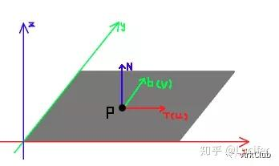
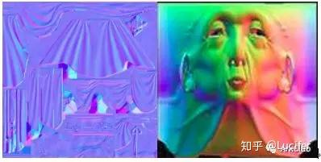
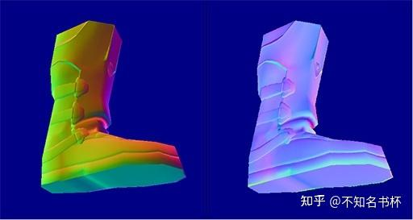
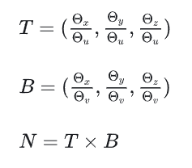
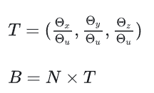
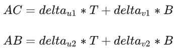
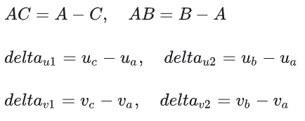
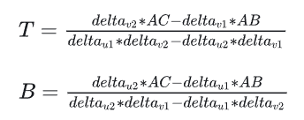
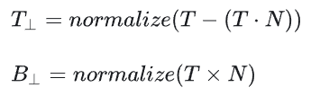
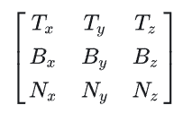

平时每天都在用TBN矩阵计算一些东西，比如法线贴图的采样，或者计算光照模型中的半向量，当成一个黑盒模型在用，本文就用一些粗浅的语言来聊聊切线空间和TBN的一些理论性知识。

## 速查问题

1. Tangent轴的方向与u轴方向相同，Bitangent轴的方向与v轴方向相同，对吗？
2. uv二轴在三维面片上的映射向量相互垂直，对吗？
3. 切线空间tbn中的N（Normal）轴是怎么得到的，其与uv二轴在三维面片上的映射方向的向量是垂直吗？
4. **顶点法线可以直接根据相邻面的法线取平均得到，对吗？**

问题4很有意思。

## 什么是切线空间

Tangent Space，其实一个坐标系，也就是原点+三个坐标轴决定的一个相对空间，我们只要搞清楚原点和三个坐标轴是什么就可以了。

在Tangent Space中，坐标原点就是顶点的位置，其中z轴是该顶点本身的法线方向（N）。另外两个坐标轴就是和该点相切的两条切线。这样的切线本来有无数条，但模型一般会给定该顶点的一个tangent，这个tangent方向一般是使用和纹理坐标方向相同的那条tangent（T）。而另一个坐标轴的方向（B）就可以通过normal和tangent的叉乘得到。

这样说起来实在是太难理解，我们由浅入深，先看这样一张图：

假设在一个模型的表面有一个点P(如上图，x,y,z坐标系为物体的Local坐标系)，那么点P会有个固有属性叫**法线**，就是上图的N(Normal)，这个大家应该都知道，它一般是垂直表面的，就是表示这个点的一个朝向(三个点确定一个三角面，通过插值，组合出这个三角面的法线)。

而与法线垂直且过点P的那个平面，就是由切线和副法线组成的切平面，就如上图的T(Tangent)，即为**切线**，b就是**副切线**(bi-Tangen或叫副法线bi-Normal)。

而由TBN组成的这个空间，就是**切线空间**。

当然了现在又有一个问题，确定了法线，这个平面上的切线理论上可以任意选取无数条中的一条，应该怎么选？这里就涉及到法线贴图的生成了。

## 从法线贴图到切线空间

因为法线贴图也是贴图，也必须通过模型的UV进行采样使用，所以，一般来说，切空间也就和模型的**UV空间**联系了起来。

**将模型UV的u轴正向作为了UV空间的切线方向，v轴正向作为了UV空间的副切线方向。**

而点的UV方向映射到模型空间后，映射后的u正向也就成了真正的TBN空间中的切线方向(如何映射，算法之后介绍)，副切线同理。法线贴图的生成过程，就是将高模的法线方向的值转换到低模的TBN坐标系下，然后再将转换后的值根据插值得到的UV位置，写入到对应的贴图上即可。

顶点的法线值都是单位化的，就是说，表示法线方向的xyz的平方和为1，所以每个方向的值范围都在(-1,1)之间。而为了能保存(-1,1)的法线值，法线贴图就有了这样的定义：法线贴图的RGB分别保存法线的xyz值，像素值(0,255)区间，对应法线值的(-1,1)区间，128对应的法线值就是0。

因为法线一般都是垂直模型表面的，如第一个图，所以它的值一般就是(0,0,1)，对应到法线贴图中，就是RGB(128，128，255)。而对于世界空间的法线，就要看面的朝向了。对于一个正常模型来说，它的法线相对与高模，一般就是在切线和副切线方向上有些许的变化，这也就是为什么切空间的法线贴图都是偏蓝色的，而世界空间的法线贴图都是五颜六色的原因了。

左边是模型所在的坐标系是模型空间下，右边的则是在切线空间下。

可以看到切线空间存储的纹理颜色整体偏蓝，这个问题主要是因为B通道的值普遍大于0.5，因为在切线空间中法线值也就是z轴方向，并且法线的取值范围是[-1,1]，但是纹理中值的范围是[0,1]。所以需要补充一个映射转换到[0,1]之间即(n/2 +1)。所以z的取值范围是[0.5,1]，并且由于实际中顶点法线不会偏移三角形面法线太多，所以整体纹理颜色偏蓝。

## TBN的确定

那么现在我们有了一个法线(Normal)、切线(Tangent )、副切线(Bitangent)构成的一个坐标系了。

z轴固定，使用当前三角面下的法线方向，另外的xy两轴选择使用UV坐标来确定。

具体的做法是取该点的所在三角形的三个顶点P1，P2，P3的UV坐标，选择X轴的方向就是P3→P1也就是T轴，Y轴方向是P3→P2也就是B轴。

但是这种方案还有一个问题，那就是T和B不一定是垂直的。所以一般使用下面这个方案:

## 求解TBN矩阵

每个顶点在世界坐标中都可以用(x,y,z)来表示，但是也可以通过uv坐标来表示，也就是说uv坐标和每个顶点的空间坐标是一一对应的。

将2D纹理映射到3D模型的时候，U轴和V轴的方向会被转化为切线和副切线，U轴是切线，在3D模型上表明纹理的水平变化，V轴是副切线，在3D模型上表明纹理的垂直变化。也就是说**UV轴是一个为未正交化的切线和副切线的组合，可以来构造一个TBN矩阵**。

现在假设有一个三角形ABC，现在需要将这个三角形ABC从UV坐标系中转换到世界坐标系中，那么可以列出以下式子：

其中各个变量如下所示：

代入计算，可得以下式子

到这里 **$\vec{T}$** , **$\vec{N}$** 就已经完全可以计算出来了，但是这里计算出的 **$\vec{T}$** ， **$\vec{N}$** 并不是真正可用的切线和副切线，在工程实践中，由于 **$\vec{T}$** 和 **$\vec{N}$** 可能因为插值或网格导入不完全正交，通常需要进行  **Gram-Schmidt 正交化**。如下所示：

可以看到N在正交化过程中不会受到影响，该过程是对TB向量进行方向的调整以及长度的归一化。TB在此过程后会相互垂直，此时将不再一定与UV方向保持相同。 **特别的，当调整顶点法线后，TB平面甚至将于三维空间中的三角形平面不同，形成的切线空间实际上是不够直观的。** （值得一提的是，在npr渲染中，法线的更改是十分常见的，没事更改顶点法线并非太闲。）

当完成这个操作后T,B会保证相互垂直，但是不一定和UV轴方向保持相同了。最后TBN矩阵如下所示：

## TBN构造相关优化

既然需要从法线贴图中读取出来(在切线空间内)，所以需要一个TBN矩阵来转换到世界空间(或者是TBN矩阵的转置，将世界空间坐标转化为切线空间内)。那么计算TBN矩阵会有两个时机，如下所示：

* 在顶点着色器中完成TBN矩阵的构建，传入像素着色器中来解码从法线贴图中的值。
* 在像素着色器中构建，直接解码从法线贴图中的值。

这两种不同的TBN构建时机主要带来的是执行效率上的差异，一般情况下像素着色器的调用次数是远高于顶点着色器的次数的。所以放在顶点着色器计算次数会更少，显然性能会更好。

但是放在顶点着色器内会被插值处理，所以在像素着色器中中使用的TBN矩阵会有一定畸变，有重新需要正交化的必要。

但是在实践当中一般来说TBN矩阵基本没什么差别，可能有些表现上的极其微小的差异。

但是图形学第一定律是什么？看起来像那就是对了，所以某些情况下对于该情况是不处理的。

## 问题解答

以下是引言提问的几个问题的解答：

1. Tangent、Bitangent轴只在正交化前与UV轴方向分别相同，因此这句话一半对，一半错。对于规范的TBN矩阵而言，TB二轴与UV轴方向极大多数情况很可能并不相同。当顶点法线在建模软件中被修改为不垂直于该面片时，TB平面甚至不在三角形面片上；当uv经过拉伸时，因TB二轴在正交化前与UV方向相同，故正交化后TB二轴必然与uv方向是有所偏差的，而对于一个多面片的模型uv展开，这种拉伸旋转的情况简直司空见惯。
2. uv二轴在三维空间下的方向很可能不垂直。
3. 切线空间的N轴就是顶点法线。（在此提及一点，建模软件中但凡是出现单个顶点包含多条法线（split vertex normal）的，在实际导出后，都是变为多个重合顶点，一个顶点只有一条法线，这是任何时候都不会改变的事实。） uv二轴在三维平面的投影方向就是三角面片所在的平面，n轴并不一定与其垂直。
4. 这个属于常见带有误导色彩的言论，在此特意申明，顶点法线爱怎么调整怎么调整，与面法线并无关联。面法线只是垂直于面的一条向量，规定了面的正反，而顶点法线才是用于光照信息的处理。即便是建模软件中，顶点法线的最初是的默认情况也并非是面法线的平均，只有当在建模软件中对物体进行了平滑着色后，才会根据面法线平均得到顶点法线（如blender中为shader smooth命令）。这其中的逻辑不要弄混。

## 总结

切线空间最开始的时候只知道其作用，其实并不知道是如何推导出来的，在这里算是补上了这一块，先确定法线作为Z轴，随即利用其顶点的UV坐标来推导出切线，这样便可以构建出TBN用于接码法线贴图中的值。

切线空间主要应用于法线贴图，可以在不增加几何细节的情况下提高光照和纹理的质量。并且关于TBN矩阵的使用时机需要注意，如果是为了更好的性能的话，建议是在顶点着色器中构建，不过这个需要分情况来讨论，如果渲染性能瓶颈出在顶点着色器中，反而效率更低。
