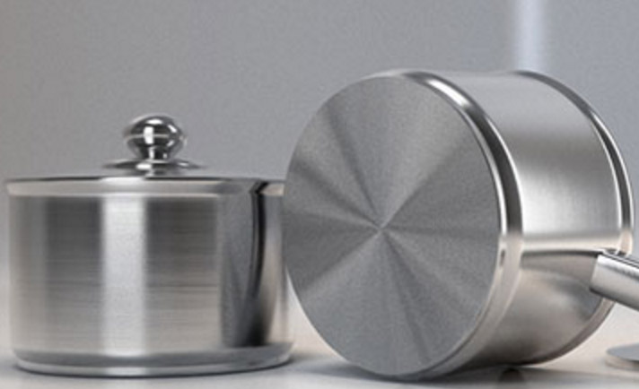
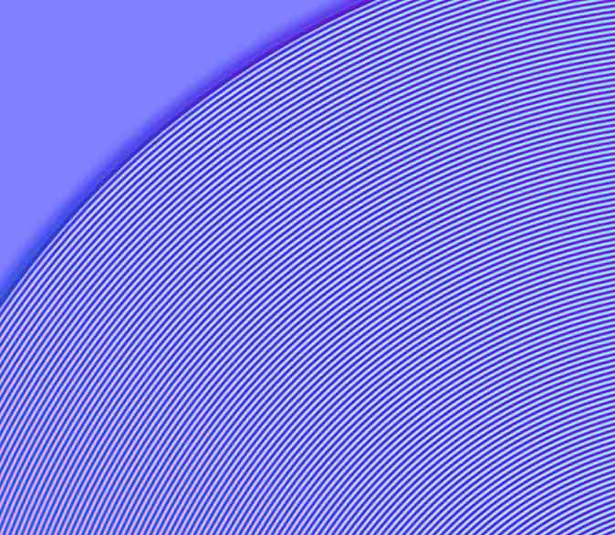
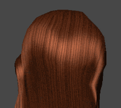
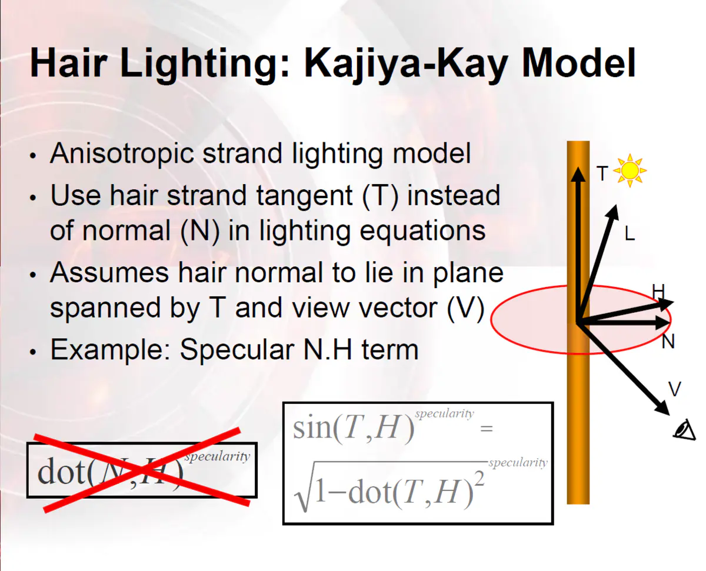
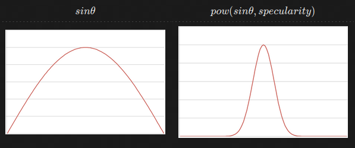
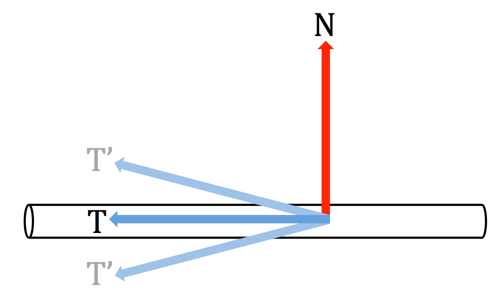
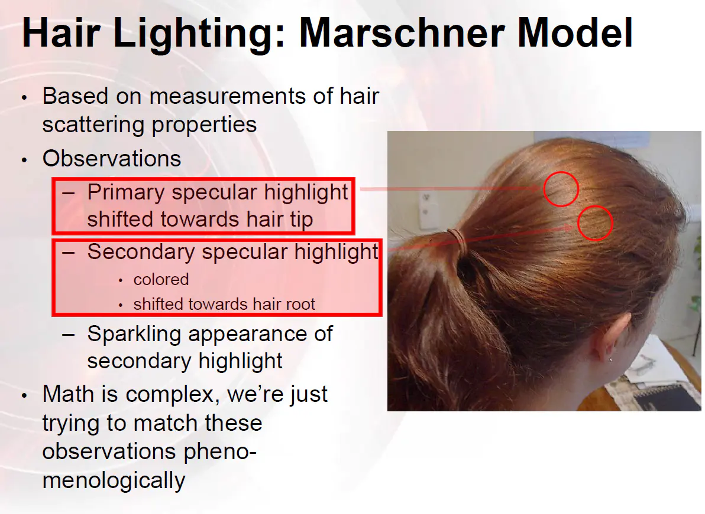
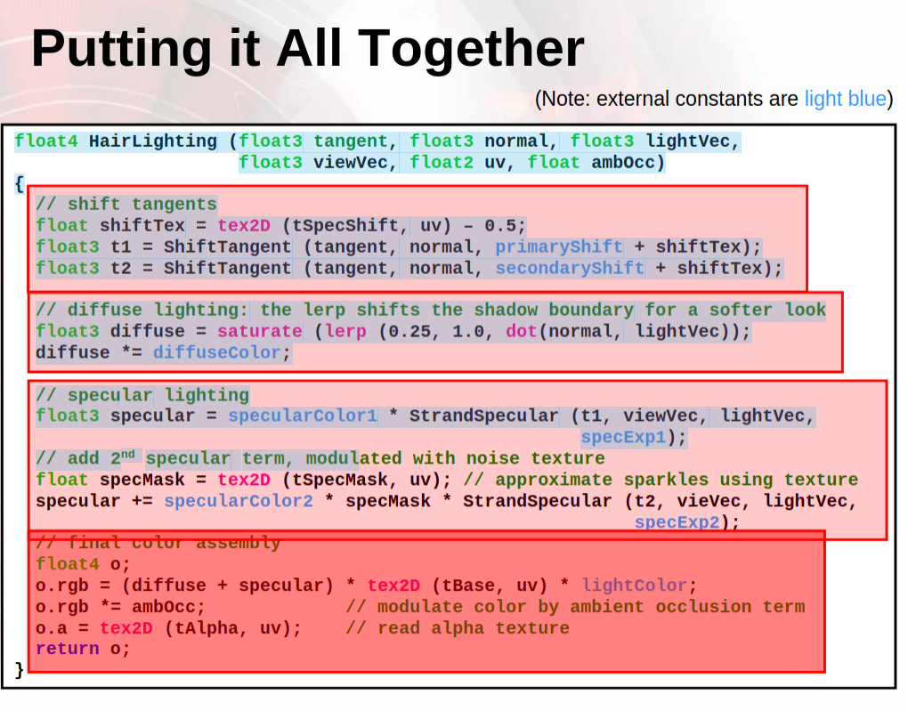

## 物理材料中的各向异性

各向异性是指材料的性质会因为方向的不同呈现不同的特性，最常见的就是半导体，在反方向上几乎不导电。

物理性质可以在不同的方向进行测量。如果各个方向的测量结果是相同的,说明其物理性质与取向无关,就称为各向同性。如果物理性质和取向密切相关，不同取向的测量结果迥异，就称为各向异性。造成这种差别的内在因素是材料结构的对称性。

在气体、液体或非晶态固体中，原子排列是混乱的,因而就各个方向而言,统计结果是等同的，所以其物理性质必然是各向同性的。而晶体中原子具有规则排列，结构上等同的方向只限于晶体对称性所决定的某些特定方向。

所以一般而言，物理性质是各向异性的；晶体是各向异性的，非晶体是各向同性的，在渲染中使用各向异性时，我们主要指光学各向异性；

## 各向异性光照

光照渲染中的各向异性（Anisotropic）指的是在不同方向上表现出的光照效果会产生差异，如下图所示(拉丝金属的各向异性)：



金属表面反射的高光效果和使用 BlinnPhong（或者类似算法）得到的高光效果有着明显的差异。这主要是由于加工工艺和设计上的要求导致的。就比如上图中的锅底部分就有着非常明显的各向异性光照效果，当进一步放大后，从法线贴图中可以看到，锅底并不是抛光的（我们可以认为，一个完全被抛光的物体表面是光学平面），而是像下面这样：



可能这样设计的目的是为了增加火焰和锅底的接触面积，使其受热更充分更均匀。同时这种类型的凹槽也就造成了各项异性的光照效果。

由于凹槽没有小到可以被光线忽略，所以当光线到达物体表面的时候没有办法直接反射出去，而是射入了凹槽中，在凹槽内部经过多次反射，最终才反射出来。现实生活中还有很多物体表面会产生各向异性的光照效果，比如**绸缎织物、CD表面、唱片、头发**等。

:::note

简要来说：

* 各项同性：从物体表面一点往四周出发，其属性变化率都是一致的。
* 各项异性：从物体表面一点往四周出发，其属性变化率根据具体方向会有明显差异。

所以实现各项异性光照的关键点在于，使用各方向变化率不同的属性计算。要获取各项异性的属性，方法有两种：

1. 从贴图上下手，绘制表面属性时就故意使其各方向变化率不一。
2. 从算法上下手，改用其他天生就各向异性的属性并设计专门的算法实现效果。

第一点对美术要求高，而且因为贴图分辨率的限制，效果不一定好，例如一根一根的头发丝非常多，不可能每根都在大小有限的贴图上表现的非常清楚。所以一般会采用第二种方法实现各向异性，也因此我们需要学习新的光照算法。

:::

在光照渲染中，显然使用类似 BlinnPhong 这样的光照模型，是无法模拟出这样的效果的，所以需要使用一些 Tricks 来达到目的。这里我们使用一篇最经典的文章 [Hair Rendering And Shading](https://web.engr.oregonstate.edu/~mjb/cs519/Projects/Papers/HairRendering.pdf) 中的方法，最终效果类似下图：



## Kajiya-Kay 光照模型

Kajiya 是一种模拟头发高光的光照模型（是模型意味着它很全面，不仅是函数计算那么简单），其由 Blinn-Phong 改造而来，特点是不使用法线，而是使用天然就各项异性的切线代为计算光照数据。

### 高光计算



例如上图这个圆柱的高光（其实模拟的就是发丝），如果使用正常的Blinn-Phong，其一定会形成一道顺着柱子的条纹高光，因为其上下的法线变化更缓，左右则更急，所以上下将会显示很多的高光。但我们希望实现的高光效果，则与其相反，希望其能沿着柱子显示，而不是上下。

如何实现？寻找一下圆柱周围一圈的相同点就会发现，其副切线都是一致的。不过副切线恰巧与法线垂直，所以基于法线的光照计算方法 $\cos(\theta)$（$\theta$ 是 `normal` 和 $h$ 的夹角）就不能用了，应改为 $\sin(\theta')$（$\theta'$ 是 `bitangent` 和 $h$ 的夹角），不过 $\sin$ 不利于计算，但可利用三角函数关系式转换为：

$$
\sqrt{1 - \cos^2(\theta')}
$$

这样就可以用点乘实现，即上图中的公式结果。

从公式中可以看出当 $\theta$ 为$\frac{\pi}{2}$时值达到最大，并使用类似 BlinnPhong 也有的 pow 操作来提亮高光。



将其替换到 Blinn-Phong（PBR 版） 的基数部分后，我们便可以写出Kajiya-Kay 高光的具体代码了：

```hlsl
float blinnCardinal = saturate(sqrt(1 - pow(dot(h, b), 2)));
float kkSpecularTerm = pow(blinnCardinal, max(2 / roughness2 - 2, 0.0001)) * (1 / roughness2);

```

### 高光扰动

上述的 Kajiya-Kay 实现后可以在球面上形成天使环的效果，但如果我们希望球面能表现头发效果的话，就必须实现一丝一丝的效果。方法很简单，同样是基于各向异性，让代表每根头发处的表面表现出不同的效果，从而营造出由密集的不同物体构成的感觉，即我们要打破天使环光滑的光斑效果。

此处我们就必须利用贴图来实现各向异性了，因为顶点无法承载如此高频的信息。我们可以搞一张带有密集条纹的噪波图来扰动用于计算的切线，扰动方式也很简单，直接用与其一起计算的法线即可，本质上就是调整了他们的光照角度。

```hlsl
float anisotropy = tex2D(_AnisotropyMap, uv).r;
float disturbance = (anisotropy - 0.5) * _DisturbanceIntensity + _DisturbanceOffset;
float3 b = normalize(bitangent + normal * disturbance);
```

* _AnisotropyMap：各向异性噪波图，可用做高光扰动基数。
* _DisturbanceIntensity：扰动的强度。
* _DisturbanceOffset：统一向一个方向扰动，可实现高光偏移效果。

原理就是说，为了让光照效果产生一些随机性的变化，我们需要对 T 进行随机的旋转操作，如下图所示：



### 双重高光



这里还有一个注意点，就是双重高光，就是计算两次参数不同的高光，一个做前景一个做背景，叠起来，这样会更符合现实的头发效果。当然这种双重光照的渲染技巧，不仅是在这适用，很多其他场合也是可用的。

GDC上的PPT中最终给出的完整shader是这样的：



## 金属拉丝

金属拉丝的效果类似碟片、平底锅的反光，一个盘状物体上可以明显看到对称的三角高光。这些东西的共同点是，上面都有一圈一圈的小纹路，这也正是这些物体形成各项异性高光的原因。本质上这和一根一根头发丝组成的各项异性高光是一样的。

所以需要考虑有什么属性，在这些一圈一圈的纹路上水平和垂直方向的变化率不同。法线肯定是不行的，其在全方向都一致，故只能实现各向同性高光。但切线可以（不过也依赖圆盘的做法），如果是一些uv成扇形展开的圆盘，其切线会顺着圆圈纹路的方向，所以从纹路方向看，他们是缓慢变化角度的，而从垂直角度来看，则是始终不变的。因此对于这类圆盘，我们只需要利用切线计算光照就行。

那具体如何计算？还是用 Kajiya-Kay 模型，虽然 Kajiya-Kay 模型默认是针对头发丝的，但得力于 Blinn的超强兼容性，我们依然可以通过变换基数的方式，将其改造为金属拉丝高光。

```hlsl
float blinnCardinal = saturate(sqrt(1 - pow(dot(h, t), 2)));
```

这和 Kajiya-Kay 基本一样，仅仅是把副切线（`b`）替换成了切线（`t`）而已。

## 各向异性反照率

上面仅讲到了各向异性表面高光的实现，但实际上其漫射等其他光照也会受影响。不过处理方法非常简单，我们可以直接简单的扰动物体的反照率即可。

```hlsl
albedo = albedo * lerp(1, anisotropy, _AlbedoDisturbance);
```

* `anisotropy`：上文扰动高光时用过的各向异性系数。
* `_AlbedoDisturbance`：反照率扰动强度。
