今天我们开始GPU的光栅化阶段。

## GPU阶段(光栅化阶段部分)

光栅化阶段也在GPU上执行。光栅化阶段的目标是找到处于图元(三角形)内部的所有像素，进而将2D坐标顶点转为屏幕上的像素，每个像素附带深度和其他着色信息，它们一并传入pixel。它需要对上一个阶段得到的逐顶点数据(例如纹理坐标 、顶点颜色等)进行插值，然后再进行逐像素处理。

光栅化阶段分为两个子阶段： **三角形设置(Triangle Setup)** 和 **三角形遍历(Triangle Traversal)** 。

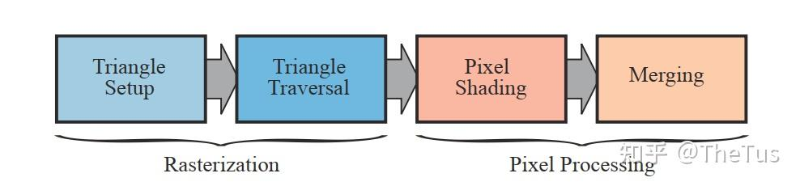

### 三角形设置 (Triangle Setup)

我们从上一个阶段获得图元的顶点信息，也就是三角面每条边的两个端点，但如果要得到整个三角网格对像素的覆盖情况，我们就必须 **计算每条边上的像素坐标。** 为了能够计算边界像素的坐标信息，我们就需要得到三角形边界的表示方式。这样一个计算三角网格表示数据的过程就叫做三角形设置。

首先，我们会计算三角形网格信息，例如三角形顶点坐标和边界表达式。

边界表达式利用了**edge函数**实现，edge函数用于确定一个像素中心或其他sampler是否在一个三角形内，硬件上会对每个三角形边缘应用一个edge函数，它基于直线方程。

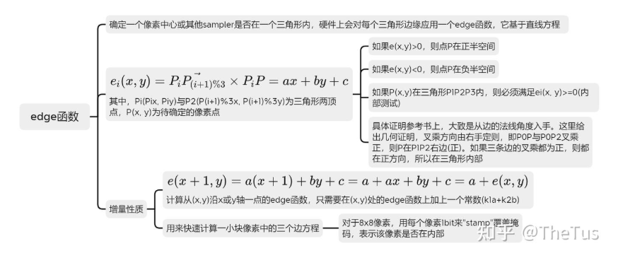

看不懂？没关系，这里有代码：

```cpp
static bool insideTriangle(float x, float y, const Vector3f *_v) {
  Vector3f edges[3];
  Vector3f conns[3];
  for (int i = 0; i < 3; i++) {
    edges[i] = _v[(i + 1) % 3] - _v[i];
    conns[i] = Vector3f(x - _v[i].x(), y - _v[i].y(), -_v[i].z());
  }
  Vector3f res[3];
  for (int i = 0; i < 3; i++) {
    res[i] = conns[i].cross(edges[i]);
  }
  return res[0].dot(res[1]) >= 0 && res[1].dot(res[2]) >= 0 &&
         res[2].dot(res[0]) >= 0;
}
```

简而言之，就是判断一个点是否位于三角形内，判断各向量与连线叉乘是否同向即可，除此之外，还有重心法等等，在此不作详细解释。

紧接着，我们会对顶点的输入数据(比如，颜色、法线、纹理坐标)进行插值，得到各个片段对应的数据值，为后面的片段着色提供片段数据。其中，利用重心插值是一种经典的三角形采样方式。

下面以颜色为例（事实上，我们很少去插值颜色值，通常都是利用片段着色器对片段进行着色）：

```cpp
// 获取重心
static std::tuple<float, float, float> computeBarycentric2D(float x, float y,
                                                            const Vector3f *v) {
  float c1 =
      (x * (v[1].y() - v[2].y()) + (v[2].x() - v[1].x()) * y +
       v[1].x() * v[2].y() - v[2].x() * v[1].y()) /
      (v[0].x() * (v[1].y() - v[2].y()) + (v[2].x() - v[1].x()) * v[0].y() +
       v[1].x() * v[2].y() - v[2].x() * v[1].y());
  float c2 =
      (x * (v[2].y() - v[0].y()) + (v[0].x() - v[2].x()) * y +
       v[2].x() * v[0].y() - v[0].x() * v[2].y()) /
      (v[1].x() * (v[2].y() - v[0].y()) + (v[0].x() - v[2].x()) * v[1].y() +
       v[2].x() * v[0].y() - v[0].x() * v[2].y());
  float c3 =
      (x * (v[0].y() - v[1].y()) + (v[1].x() - v[0].x()) * y +
       v[0].x() * v[1].y() - v[1].x() * v[0].y()) /
      (v[2].x() * (v[0].y() - v[1].y()) + (v[1].x() - v[0].x()) * v[2].y() +
       v[0].x() * v[1].y() - v[1].x() * v[0].y());
  return {c1, c2, c3};
}


// ... exist codes ...

	// 计算深度插值
	auto [alpha, beta, gamma] = computeBarycentric2D(ind_x, ind_y, t.v);
        float w_reciprocal =
            1.0 / (alpha / v[0].w() + beta / v[1].w() + gamma / v[2].w());
        float z_interpolated = alpha * v[0].z() / v[0].w() +
                               beta * v[1].z() / v[1].w() +
                               gamma * v[2].z() / v[2].w();
        z_interpolated *= w_reciprocal;

// ... exist codes ...
```

GPU会在三角形设置阶段计算三角形上的常数因子，以便三角形遍历阶段能够有效地进行(edge方程的a, b, c常量)。并且，还会计算与属性插值相关的常量。总之，它就是处理前面阶段传递的数据，为三角形遍历阶段做准备。

### 三角形遍历 (Triangle Traversal)

三角形遍历阶段将会检查每个像素是否被一个三角网格所覆盖。如果被覆盖的话，就会生成一个 **片元 (fragment)** 。而这样一个找到哪些像素被三角网格覆盖的过程就是三角形遍历，这个阶段也被称为**扫描变换(Scan Conversion)** 。

这一步的输出就是得到一个片元序列。需要注意的是，一个片元并不是真正意义上的像素，而是包含了很多状态的集合，这些状态用于计算每个像素的最终颜色。这些状态包括了（但不限于）它的屏幕坐标、深度值Z、顶点颜色，以及其他从几何阶段输出的顶点信息，例如法线、纹理坐标等。

然而，遍历从来不是难事（并非），问题在于如何聪明的遍历，这里我们使用Bounding Box包围盒。

由于在光栅化阶段，我们仅仅在2D空间上操作，简单的一个2D方框框住需要光栅化的地方就行，不需要使用类似光线追踪中3D空间的AABB包围盒。

代码如下：

```cpp
// Screen space rasterization
void rst::rasterizer::rasterize_triangle(const Triangle &t) {
  auto v = t.toVector4();

  // Find out the bounding box of current triangle.
  // iterate through the pixel and find if the current pixel is inside the
  // triangle
  int max_x =
      static_cast<int>(std::max(std::max(v[0].x(), v[1].x()), v[2].x()));
  int max_y =
      static_cast<int>(std::max(std::max(v[0].y(), v[1].y()), v[2].y()));
  int min_x =
      static_cast<int>(std::min(std::min(v[0].x(), v[1].x()), v[2].x()));
  int min_y =
      static_cast<int>(std::min(std::min(v[0].y(), v[1].y()), v[2].y()));

  // If so, use the following code to get the interpolated z value.
  // auto[alpha, beta, gamma] = computeBarycentric2D(x, y, t.v);
  // float w_reciprocal = 1.0/(alpha / v[0].w() + beta / v[1].w() + gamma /
  // v[2].w()); float z_interpolated = alpha * v[0].z() / v[0].w() + beta *
  // v[1].z() / v[1].w() + gamma * v[2].z() / v[2].w(); z_interpolated *=
  // w_reciprocal;

  // set the current pixel (use the set_pixel function) to the color of
  // the triangle (use getColor function) if it should be painted.
  
  for (int ind_x = min_x; ind_x < max_x; ind_x++) {
    for (int ind_y = min_y; ind_y < max_y; ind_y++) {
      if (!insideTriangle(ind_x, ind_y, t.v))
        continue;
      auto [alpha, beta, gamma] = computeBarycentric2D(ind_x, ind_y, t.v);
      float w_reciprocal =
          1.0 / (alpha / v[0].w() + beta / v[1].w() + gamma / v[2].w());
      float z_interpolated = alpha * v[0].z() / v[0].w() +
                             beta * v[1].z() / v[1].w() +
                             gamma * v[2].z() / v[2].w();
      z_interpolated *= w_reciprocal;

      int index = get_index(ind_x, ind_y);
      if (depth_buf[index] > z_interpolated) {
        depth_buf[index] = z_interpolated;
        set_pixel({ind_x, ind_y, z_interpolated}, t.getColor());
      }
    }
  }
}
```

其中计算重心和判断边界地函数在之前我们已经给出了。

## GPU阶段（像素阶段部分）

像素阶段在GPU上执行，它主要处理光栅化阶段发送过来的在图元内部的片元序列。GPU会对每个片元进行像素操作，如颜色和深度的计算、纹理采样、混合等。最终，这些像素被组合成最终的图像。

像素阶段可以分为两个子阶段： **像素着色(Pixel Shading)** 和 **合并(Merging)** 。


### 像素着色

像素着色阶段的任务是使用光栅化阶段传递的插值后的数据以及纹理计算像素颜色。着色方面，基本的技术包括**片段着色器(Fragment Shader)**，**光照模型（Lighting Model）**，**纹理贴图 (Textures)**等等**。**

#### 片段着色器

这个没什么好多说的，和顶点着色器一样，都是一种类C语言的科学计算程序，它最主要的任务就是着色。光栅化阶段实际上并不会影响屏幕上每个像素的颜色值，而是会产生一系列的数据信息，用来表述一个三角网格是怎样覆盖每个像素的。而每个片元就负责存储这样一系列数据。着色有两种最常见的技术，分别是纹理贴图和光照技术。

#### 纹理贴图

纹理贴图也称为纹理映射，是将图像信息映射到三角形网格上的技术，以此来增加物体表面的细节，令物体更具有真实感。纹理技术有很多，最常见的是**凹凸贴图(bump mapping)、法线贴图(normal mapping)、高度纹理(height mapping)、视差贴图(parallax mapping)、位移贴图(displacement mapping)、立方体贴图(cubemap)、阴影贴图(shadowmap)**。例如图中左边地球仪是一个球形，但我们也可以将地图绘制在右图一张二维的平面上，那么它们之间就存在着纹理映射的关系，我们想要获取地球仪上任意一点的信息，都可以从贴图中寻找。

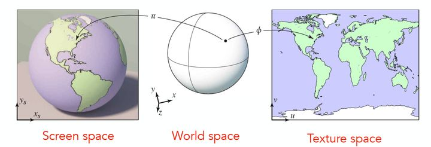

纹理贴图是片段着色器的主要操作，通过贴图技术可以实现很多高级的效果。我们将贴图上的每个像素称为纹素(texel，纹理像素texture pixel的意思，用于和像素进行区分)， **纹理映射其实就是进行纹素和像素对应的过程** **。**

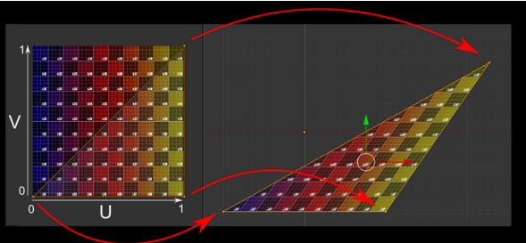

怎么对应呢？使用uv坐标足矣。

我们一般使用一个二维的坐标(u，v)来表示纹理坐标，其中u是横坐标，v是纵坐标，因此纹理坐标一般也被称为UV坐标。UV坐标一般被归一化到[0,1]之间，但是如果UV超出这个范围，我们就需要指定纹理坐标的寻址方式，也叫作平铺方式。常见的寻址方式有：重复寻址(repeat)、边缘钳制寻址(clamp，拉伸纹理边缘)和镜像寻址(mirror)。在Unity中，可以通过设置贴图的Wrap Mode来修改，其中per-axis可以单独控制 Unity 如何在 U 轴和 V 轴上包裹纹理。下图展示了Unity3d中纹理的重复寻址和钳制寻址方式。

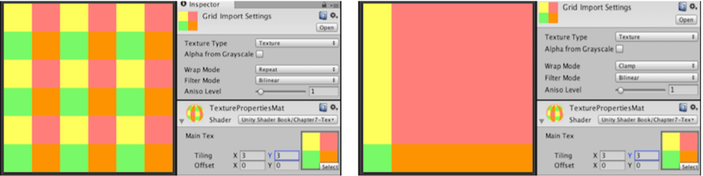

除了寻址方式外，纹理的采样方式也会觉得最终的显示效果。由于纹素和像素通常不是一一对应的，所以我们需要决定像素所对应的纹素信息时，需要用到纹理的滤波方式。

**纹理采样**是指给定一个坐标，去寻找它在纹素数组中的值。由于纹素和像素通常不是一 一对应的（例如将10x10的图片映射到50x50的屏幕中），所以我们需要决定像素所对应的纹素信息时，需要用到纹理的滤波方式。

Unity中的滤波主要有三种，可以通过Filter Mode进行设置，

* **Pointer，点过滤**，纹理在靠近时变为块状，会产生较为明显的失真。
* **Bilinear，双线性过滤**，pixel对应的纹理坐标为中心，采该纹理坐标周围4个texel的像素，再取平均，以平均值作为采样值。
* **Trilinear，三线性过滤**，以双线性过滤为基础。会对pixel大小与texel大小最接近的两层Mipmap level分别进行双线性过滤，然后再对两层得到的结果进生线性插值。

Unity中的Trilinear滤波技术，和Bilinear差不多，只不过会在**多级渐近纹理(mipmapping)**之间进行混合。

纹理的多级渐进技术是为了解决纹理缩小时产生所谓的摩尔纹现象，由于远处的物体并不需要很高的精度，所以我们在对远处物体进行采样时，会使用分辨率更低的纹理贴图，这就是mipmapping的思想。

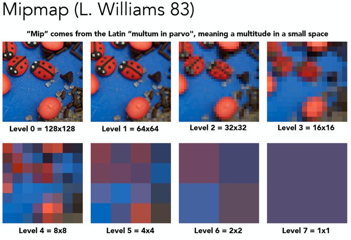

这部分在GAMES101中有详细教学：

<iframe src="https://player.bilibili.com/player.html?isOutside=true&aid=90798049&bvid=BV1X7411F744&cid=162397441&p=9" scrolling="no" border="0" frameborder="no" framespacing="0" allowfullscreen="true"></iframe>

#### 光照模型（Lighting）

前面我们提到了高洛德着色，现在我们来具体介绍一下各个不同的着色算法。

光照由直接光和间接光组成，计算光照最常用的就是**Phong模型**了，它是一个经验模型，参数信息都是经验得到的，并没有实际的物理意义，所以利用Phong模型会出现违背物理规则的时候。Phong模型将物体光照分为三个部分进行计算，分别是：**漫反射（Diffuse）、镜面反射（Specular）和环境光（Ambience）**。

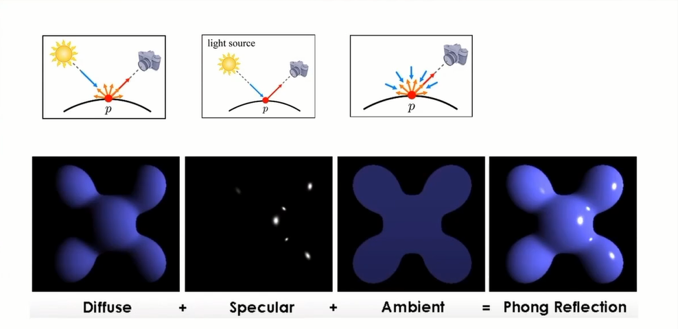

* **漫反射Diffuse**
  漫反射是投射在粗糙表面上的光向各个方向反射的现象。当一束平行的入射光线射到粗糙的表面时，表面会把光线向着四面八方反射，所以入射线虽然互相平行，由于各点的法线方向不一致，造成反射光线向不同的方向无规则地反射。在漫反射中，视角的位置是不重要的，因为反射是完全随机的，因此可以认为在任何反射方向上的分布都是一样的。但是，入射光线的角度很重要。
* **镜面反射Specular**
  镜面反射是指若反射面比较光滑，当平行入射的光线射到这个反射面时，仍会平行地向一个方向反射出来。
* **环境光Ambient**
  环境光分量是用来模拟全局光照效果的，其实就是在物体光照信息基础上叠加上一个较小的光照常量，用来表示场景中其他物体反射的间接光照。

漫反射表示的是光线进入物体内部后重新散射出来的那部分光线，简单起见我们会认为重新散射出来的光线是均匀分布的，如上图所示。因此，无论观察者从哪个方向进行观察，漫反射效果其实是一样的，所以我们认为漫反射和观察位置是无关的。漫反射分量通常利用**朗伯特余弦定律(Lambert Consine Law)**来计算，也就是说漫反射的大小取决于表面法线和光线的夹角。当夹角越大时，漫反射分量越小，当夹角接近90度时，我们认为漫反射几乎为零。

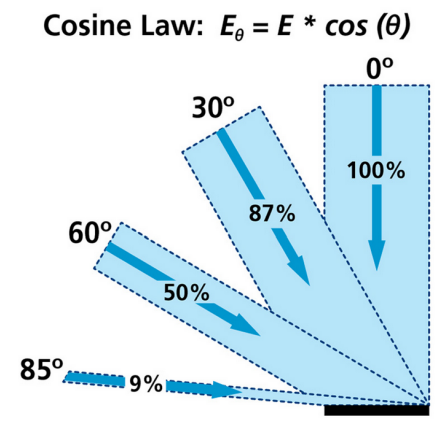

说到朗伯余弦定律，我们不得不说下半朗伯模型(Half Lambert)。该光照模型是有Valve公司在制作半条命游戏时发明的，由于改进物体较暗区域的光照信息。如下图所示，右边的图是使用半朗伯模型得到的效果。我们可以明显的看到人物被照亮了！半朗伯模型的代码只需要在原来的代码加上 `float hLambert = difLight * 0.5 + 0.5;` 一行代码就可以了，其实该代码就是将之前的漫反射系数从[0，1]变到[0.5,1]，所以提升了漫反射的亮度信息。

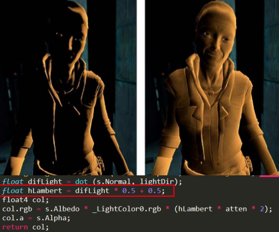

镜面反射表示光线照射到物体表面后被重新反射的现象，镜面反射遵循反射定律。我们生活中发现金属表面会有高光的现象，就是由于金属对光线有较高的反射率，给人一种金属感，通过镜面反射我们可以模拟金属和非金属物质对光照的反射程度。我们在日常生活中其实也可以发现，高光跟我们观察的方向是有关系的，我们在描述高光性质时需要知道观察者位置信息。

然而，有一种更好的镜面光照的处理模型，就是我们接下来要介绍的：Blinn-Phong光照模型。

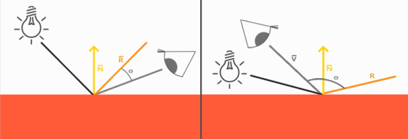

我们知道高光跟观察位置密切相关，当观察方向和反射光线夹角大于90度时(如上图所示)，Phong模型会出现镜面反射分量被消除的情况，所以出现高光不连续的想象，如下图的第一种图所示。我们可以通过Blinn-Phong模型来对它进行改进，下面两张图对比了这两种模型在处理高光时的差异。

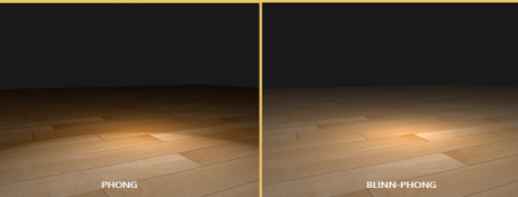

Blinn-Phong模型在处理镜面反射时不使用观察方向和反射光线的夹角来计算，而是引入了一个新的向量：**半角向量(Halfway vector)**。半角向量其实很简单，就是光线向量L和观察方向V的中间位置。Blinn-Phong模型计算的就是半角向量H和平面法线的夹角(当视线和反射向量对齐时，有最大的镜面反射)，这样无论观察者在那个方向进行观看，半角向量和法线夹角都不会超过90度，不会出现上面说的高光不连续的问题，光照效果更佳真实。

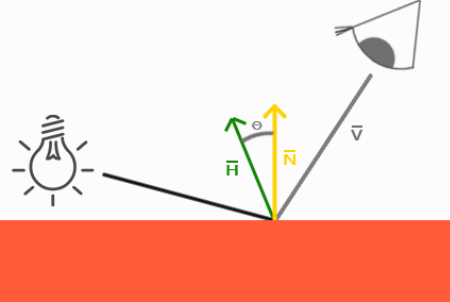

好了，看了这么久，上代码！

```cpp
// 使用phong氏着色的片段着色器
Eigen::Vector3f phong_fragment_shader(const fragment_shader_payload &payload) {
  // ambient coefficient
  Eigen::Vector3f ka = Eigen::Vector3f(0.005, 0.005, 0.005);
  // diffuse coefficient
  Eigen::Vector3f kd = payload.color;
  // specular coefficient
  Eigen::Vector3f ks = Eigen::Vector3f(0.7937, 0.7937, 0.7937);

  auto l1 = light{{20, 20, 20}, {500, 500, 500}};
  auto l2 = light{{-20, 20, 0}, {500, 500, 500}};

  std::vector<light> lights = {l1, l2};
  Eigen::Vector3f amb_light_intensity{10, 10, 10};
  Eigen::Vector3f eye_pos{0, 0, 10};

  // pow term for specular light
  float p = 150;

  Eigen::Vector3f color = payload.color;
  Eigen::Vector3f point = payload.view_pos;
  Eigen::Vector3f normal = payload.normal;

  Eigen::Vector3f result_color = {0, 0, 0};
  for (auto &light : lights) {
    // For each light source in the code, calculate what the *ambient*,
    // *diffuse*, and *specular* components are. Then, accumulate that result on
    // the *result_color* object.
    Eigen::Vector3f light_dir =
        (light.position - point).normalized();                 // input light
    Eigen::Vector3f view_dir = (eye_pos - point).normalized(); // look at
    Eigen::Vector3f half_vec =
        (light_dir + view_dir).normalized(); // half vector(bisector)

    // calc r^2
    float rp2 = (light.position - point).dot(light.position - point);

    // L_amb = K_amb * I
    Eigen::Vector3f La = ka.cwiseProduct(amb_light_intensity);

    // L_dif = K_dif * (I / r^2) * max(0, norm dot input_light)
    Eigen::Vector3f Ld = kd.cwiseProduct(light.intensity / rp2);
    Ld *= std::max(0.0f, normal.normalized().dot(light_dir));

    // L_spec = K_spec * (I / r^2) * max(0, norm dot half_vec)^powder
    Eigen::Vector3f Ls = ks.cwiseProduct(light.intensity / rp2);
    Ls *= std::pow(std::max(0.0f, normal.normalized().dot(half_vec)), p);

    result_color += (La + Ld + Ls);
  }

  return result_color * 255.f;
}
```

当然，纹理贴图我们也给加上之后，就是这样的：

```cpp
Eigen::Vector3f
texture_fragment_shader(const fragment_shader_payload &payload) {
  Eigen::Vector3f return_color = {0, 0, 0};
  if (payload.texture) {
    // Get the texture value at the texture coordinates of the current fragment
    Eigen::Vector2f uv_coords = payload.tex_coords;
    return_color = payload.texture->getColor(uv_coords.x(), uv_coords.y());
  }
  Eigen::Vector3f texture_color;
  texture_color << return_color.x(), return_color.y(), return_color.z();

  Eigen::Vector3f ka = Eigen::Vector3f(0.005, 0.005, 0.005);
  Eigen::Vector3f kd = texture_color / 255.f;
  Eigen::Vector3f ks = Eigen::Vector3f(0.7937, 0.7937, 0.7937);

  auto l1 = light{{20, 20, 20}, {500, 500, 500}};
  auto l2 = light{{-20, 20, 0}, {500, 500, 500}};

  std::vector<light> lights = {l1, l2};
  Eigen::Vector3f amb_light_intensity{10, 10, 10};
  Eigen::Vector3f eye_pos{0, 0, 10};

  float p = 150;

  Eigen::Vector3f color = texture_color;
  Eigen::Vector3f point = payload.view_pos;
  Eigen::Vector3f normal = payload.normal;

  Eigen::Vector3f result_color = {0, 0, 0};

  for (auto &light : lights) {
    // For each light source in the code, calculate what the *ambient*,
    // *diffuse*, and *specular* components are. Then, accumulate that result on
    // the *result_color* object.
    Eigen::Vector3f light_dir = (light.position - point).normalized();
    Eigen::Vector3f view_dir = (eye_pos - point).normalized();
    Eigen::Vector3f half_vec = (light_dir + view_dir).normalized();

    float r2 = (light.position - point).dot(light.position - point);

    Eigen::Vector3f La = ka.cwiseProduct(amb_light_intensity);
    Eigen::Vector3f Ld = kd.cwiseProduct(light.intensity / r2) *
                         std::max(0.0f, normal.normalized().dot(light_dir));
    Eigen::Vector3f Ls =
        ks.cwiseProduct(light.intensity / r2) *
        std::pow(std::max(0.0f, normal.normalized().dot(half_vec)), p);

    result_color += (La + Ld + Ls);
  }

  return result_color * 255.f;
}
```

### 输出合并（Output-Merger）

合并阶段，又称 **ROP阶段** 。在 `DirectX`中，该阶段被称为输出合并阶段，而 `OpenGL`将其称为逐片元操作（`Per-Fragment Operations`）。它主要完成以下两个任务：

* 决定每个片元的可见性。这涉及了很多测试工作，例如深度测试、模板测试等 。
* 如果一个片元通过了所有的测试，就需要把这个片元的颜色值和已经存储在颜色缓冲区中的颜色进行合并，或者说是混合。

早期GPU的渲染管线中，深度测试是在像素着色器之后才执行的。这种做法会导致很多不可见的像素也会执行像素着色器计算，从而浪费了计算资源。为了避免这种浪费，后来的GPU架构采用了**Early-Z**技术，将深度测试提前到像素着色器之前(如下图所示)。这样一来，Early-Z就可以在像素着色器之前剔除很多无效的像素，从而避免它们进入像素着色器，提高了渲染性能。

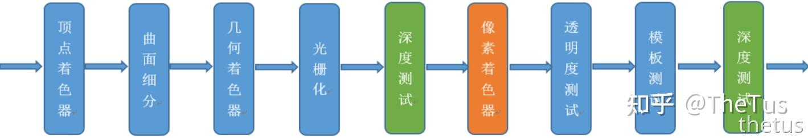

#### 裁切测试 (Scissor Test)

在前面视口变换中我们已经提到裁切测试这种技术了。裁切测试可以避免当视口比屏幕窗口小时造成的渲染浪费问题。通常情况下，我们会让视口的大小和屏幕空间一样大，此时可以不需要使用到裁切测试。但当两者大小不一样大时，我们需要用到裁切测试来避免像 `glClear() `出现的问题。裁切测试默认是不开启的，我们可以通过 `glEnable(GL_SCISSOR_TEST) `来开启裁切测试，通过 `glScissor()` 来指定裁切区域。

如果对裁切测试还不是很明白，可以参考StackExchange上面的这个问题：
[What is the purpose of glScissor?](https://gamedev.stackexchange.com/questions/40704/what-is-the-purpose-of-glscissor)

#### Alpha 测试（Alpha Test）

通过片元数据，可以获取该片元的alpha值，如果alpha值小于某个数的话，则直接将该片元丢弃，不进行渲染，这是非常“粗暴”的（即只渲染透明度在某一范围内的片元），可以用来做一些树叶镂空的效果。

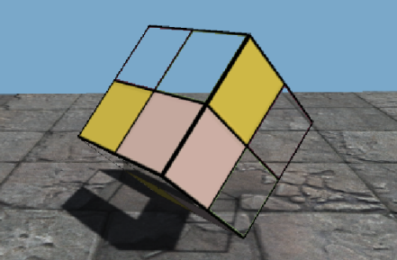

#### 模板测试 (Stencil Test)

模板测试默认是不开启的，我们可以通过 `glEnable(GL_STENCIL_TEST)`指令将其打开，这是一个开发者可以高度配置的阶段。如果开启了模板测试，GPU会首先读取模板缓冲区中该片元位置的模板值，然后将该值和读取到的参考值进行比较，这个比较函数可以是由开发者指定的，例如小于时舍弃该片元，或者大于等于时舍弃该片元。如果这个片元没有通过这个测试，该片元就会被舍弃。

模板测试其实很简单，我们可以把它理解为一个模子mask，通过mask的值来控制那些片段的可见性，无法通过模板测试的片段将被丢弃，下图给出了模板测试的一个例子。模板测试属于流水线中高度可配置的阶段，可以通过 `glStencilMask` 来设置一个掩码，该掩码会将要写入缓存区的值进行AND操作，默认情况下掩码值有1，不影响输出。此外，我们还可以利用 `glStencilFunc` 和 `glStencilOp` 两个函数来设置模板函数，控制在模板测试失败或成功时的行为。我们可以利用模板测试来实现**平面镜效果**、**平面阴影**和**物体轮廓**等功能。

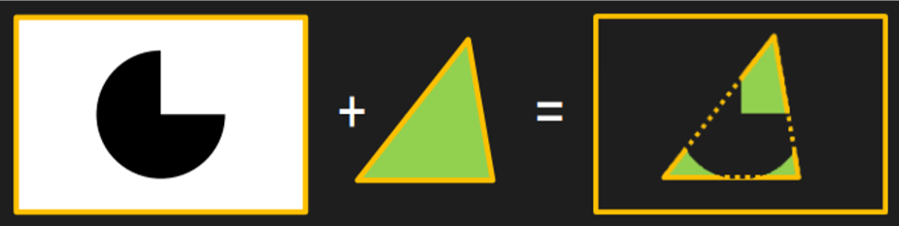

#### 深度测试(Depth Test)

根据我们的日常经验，近处的物体会挡住后面的东西，我们可以通过深度缓冲来实现这样的效果。深度测试的原理很简单：比较当前片段的深度值是否比深度缓冲中预设的值小(默认比较方式)，如果是更新深度缓冲和颜色缓冲；否则丢弃片段不更新缓冲区的值。

OpenGL的深度测试默认是禁用的，我们可以通过 `glEnable(GL_DEPTH_TEST) `来开启深度测试。深度测试是可配置的阶段，我们可以通过深度函数 `glDepthFunc()` 来设置深度比较运算符，默认情况下的深度比较函数是 `GL_LESS`，也就是前面的物体会盖住后面的物体。除了 `GL_LESS`还有其他深度比较函数，比如：`GL_ALWAYS`、`GL_GREATER`、`GL_NEVER`等。

#### 混合（Blend）

一个片元经过层层测试，总算来到了混合功能面前，对于不透明物体，开发者可以关闭混合（Blend）操作。这样片元着色器计算得到的颜色值就会直接覆盖掉颜色缓冲区中的像素值。但对于半透明物体，我们就需要使用混合操作来让这个物体看起来是透明的。下面是一个简化版的混合操作流程图。

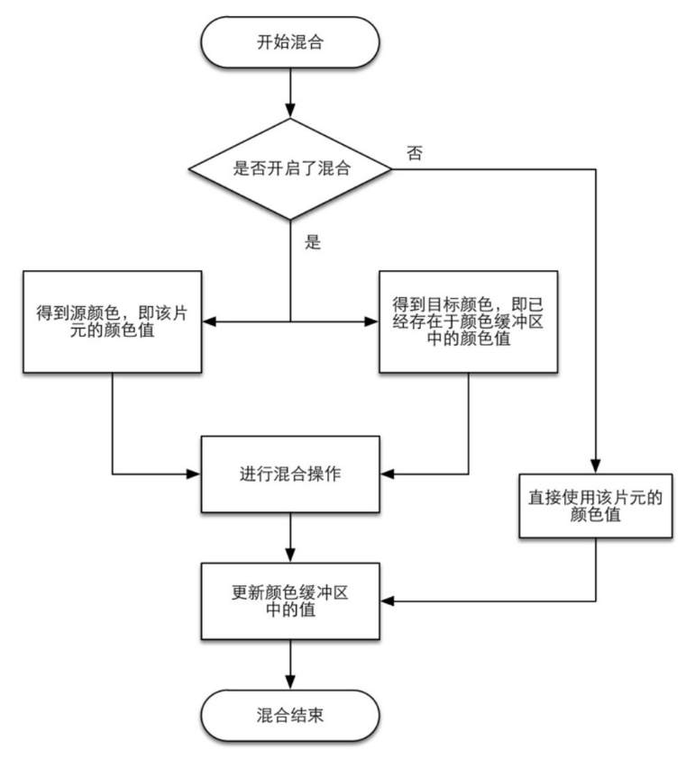

:::tip

当场景中既有不透明物体，又有半透明物体时，我们需要先渲染不透明物体，渲染顺序为**从前往后(Front-to-Back)**；然后再渲染半透明物体，渲染顺序为**从后往前(Back-toFront)**。我们要对不透明和半透明物体分开渲染是因为：我们可以透过半透明物体看到半透明物体背后的东西，所以对半透明物体进行渲染时需要后面图层的信息，才能够正确进行混合。

:::

### 帧缓冲 （Frame Buffer）

可以简单理解为一个临时画布,GPU渲染完成的信息会存放在帧缓存区,等待使用，上述各种测试也是在帧缓冲区进行的。

当图元经过上述的计算、测试和混合后，就会显示到屏幕上。我们的屏幕显示的就是颜色缓冲区中的颜色值。但是， 为了避免我们看到那些正在进行光栅化的图元，GPU会使用**双重缓冲(Double Buffering)** 的策略。这意味着， 对场景的渲染是在器后发生的， 即在**后置缓冲(Back Buffer)** 中。 一旦场景已经被渲染到了后置缓冲中， GPU 就会交换后置缓冲区和 **前置缓冲(Front Buffer)** 中的内容， 而前置缓冲区是之前显示在屏幕上的图像。 由此， 保证了我们看到的图像总是连续的。

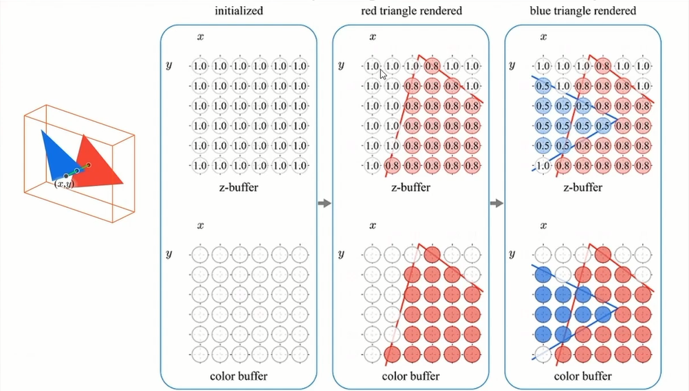

在绘制完一帧后，Buffer会将其显示在显示器上，完成了整个渲染的流程。

## 总结

这一篇的内容已经不少了，但是还有很多细枝末节的地方没有介绍到，例如**抗锯齿，颜色空间，抖动处理**之类的内容，只能以后再说了= . =。

滚去写实验报告了 QwQ ...
