## 光栅化/Rasterization

对于 $W \times H$ 的屏幕，屏幕上的像素点坐标可以表示为 $(x, y), x \in [0, W - 1], y \in [0, H - 1]$，像素中心点为 $(x + 0.5, \ y + 0.5)$。

对于一个三角形，设未转换前的坐标为 $\boldsymbol{v}_i, i \in \{0, 1, 2\}$，经过投影矩阵后，坐标变为 $\boldsymbol{q}_i = \boldsymbol{Mv}_i$。然后再投射到屏幕空间中，投射到坐标为 $\boldsymbol{p}_i = ((q_{ix}/q_{iw} + 1)W/2, (q_{iy}/q_{iw} + 1)H/2$。

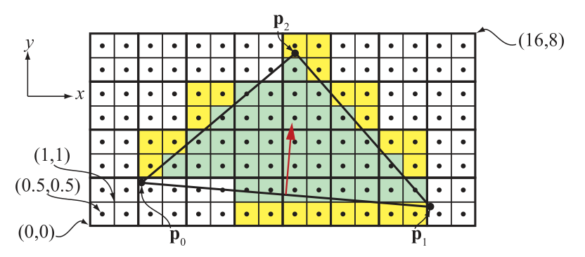

如上图所示，可以看出像素点网格被划分成了2X2的组，这样的组叫做  **Quad** 。因为使用贴图LOD时，我们是需要计算UV的微分值的。渲染三角形时，都是已Quad作为最小单位的。也就是说，一个三角形，即使只覆盖了一个Quad中的一个像素，整个Quad中的四个像素都会被光栅化，这样需要额外光栅化的像素点叫做  **Helper Pixel/辅助像素** 。这样，如果是比较小的三角形，在渲染时，辅助像素的比例就越高，造成性能浪费。辅助像素的数量也叫做  **quad overeshading** 。

要确定一个像素的中心点，或者某个采样点，是否在三角形内，硬件会先算出三角形每条边的方程：

$$
\boldsymbol{n} \cdot ((x, y) - \boldsymbol{p}) = 0
$$

$\boldsymbol{n}$ 是边界的法线，和边垂直并指向三角形内，$\boldsymbol{p}$ 是边上的一个点。整个方程也可以表示成 $ax + by + c = 0$。我们设三角形的三个点 $\boldsymbol{p}_0, \boldsymbol{p}_1, \boldsymbol{p}_2$，得到的三条边的公式分别为 $e_0, e_1, e_2$。对于每条边 $e$，当某个点正好在线上时，得 $e(x, y) = 0$。如果一个点对所有三条边都满足 $e(x, y) > 0$，那么这个点就是位于三角形内部的。

为了计算方便，通常我们会将点的坐标转化成 fixed-point/定点数格式。这样一来是可以方便进行定义 tie-breaker 规则，二来可以更快地判断点是否在三角形内部。比如我们可以使用 1.14.8 位格式，1位表示正负，14位表示整数坐标，8位表示在像素内部的小数坐标。也就是说，对于 $x, y$ 分量，在像素点内部共有 $2^8$ 种可能的位置。而整数坐标则必须满足处于 $[-(2^{14} - 1), (2^{14} - 1)]$ 范围内。

边界方程的另外一个重要属性是具有**可增/incremental**属性。假设我们现在有一个像素点中心位置为 $(x, y) = (x_i + 0.5, y_i + 0.5)$，其中 $(x_i, y_i)$ 是整数坐标位置。已知带入边界方程得 $e(x, y) = ax + by + c$，现在我们想得到右边像素的带入值 $e(x + 1, y)$，就可以得到：

$$
e(x + 1, y) = a(x + 1) + by + c = e(x, y) + a
$$

将原来的带入值，加上 $a$ 后就能得到新的带入值。这个性质在 y 轴方向上也是一样的。利用这个性质，我们可以快速地在一个 **tile** (一般是 8x8 的像素块) 中计算每个像素的覆盖信息。这些将在后面详细介绍。

当像素的中心点刚好在某条边上时，就需要一些特殊的处理方案。比如现在有两个三角形共享一条边，如果像素中心刚好在这条共享边上，就需要决定这个像素点是归哪侧所有。首先肯定不能是同时属于两个三角形的，这样会导致像素被计算两次。

要解决这个问题，需要使用 tie-breaker 规则。这里我们来介绍下 DirectX 的 **top-left 规则**。当像素点坐标满足 $e_i(x, y) > 0, \forall i \in \{0, 1, 2\}$，该点位于三角形内部。当像素中心点穿过一条边时，如果这条边是一个三角形的 left-edge/right-edge 时，认为像素点是在三角形内部。如果一条边是水平的，且其他的边都在其下面，则这条边是 top-edge。如果一条边不是水平边，且处在三角形左侧，则是 left-edge，一个三角形最多可以有两条 left-edge。从符号上来判断 left-top edge 非常简单，top edge 满足 $a = 0, b < 0$，left-edge 满足 $a > 0$。

上面讲的都是如何渲染三角形，接下来我们来简单介绍下如何渲染线。通常线是被看成一像素宽的长方形，这样是作为两个三角形来渲染。这样可以使用三角形渲染的规则复用。而点也是当成正方形来渲染的。

为了提高效率，通常我们会使用 **级联/hierarchical** 方式来遍历三角形。硬件会先算出整个三角形的AABB，然后测试每个 tile 和AABB是否相交，再测试 tile 是否和三角形相交。测试 AABB 和 tile 相交比较简单。测试 tile 和三角形相交的方式如下，可以直接选择 tile 四个顶点中距离边最近的那个进行测试。如下图中的 4x4的 tile，和边进行相交测试时，只需要判断黑色的顶点是否在边的**正半空间**内。如果测试 tile 都在三条边外侧，则认为 tile 中的像素都不在三角形内。测试大量 tile 和三角形的相交属性时，也会使用前面我们提到的 incremental 属性。

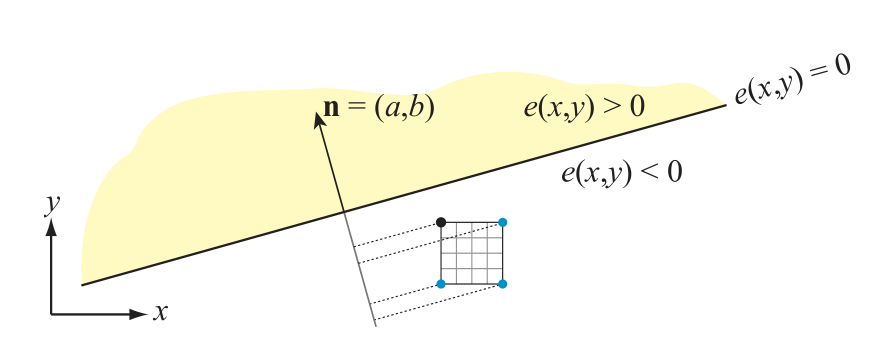

如下图所示，是一个级联遍历三角形的过程。tile 通过zigzag 或者其他的方式空间填充曲线来遍历，这样可以增加空间的连续性/coherency。此外我们还可以使用嵌套 tile 的方式来加速遍历过程，比如先把整个空间分成 16x16 的 tile，每个 tile 再划分成 4x4 的 subtile。

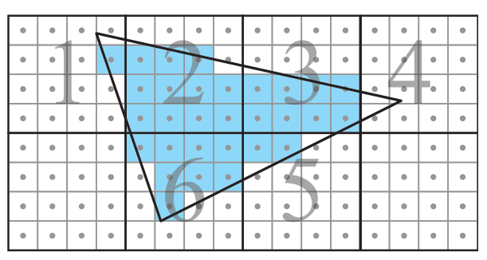

这种遍历方式的优点是可以尽量提高 **连续性/coherency** 。这样可以更好地利用缓存，更快地访问 buffer。假设现在一个大三角形以扫描线的方式进行遍历，纹素就会被缓存下来。当使用mipmap时，就可以直接从缓存中复用。而且以扫描线的方式进行遍历时，很可能在扫描线开始时，已经将后续需要用到的纹素缓存下来，这样在后续的访问中，可以直接从缓存中取值。

在三角形遍历开始之前，GPU 一般会有一个 三角形准备阶段。这个阶段会计算遍历过程中需要用到的常量，比如三角形的三条边的方程参数等。

在三角形准备阶段开始前，必要的情况下，GPU会对三角形进行 **裁剪/clipping** 。在裁剪空间内对三角形进行裁剪是非常昂贵的操作，因此GPU只有在绝对必要时，才会进行裁剪。裁剪时总是会和裁剪空间的近平面进行clipping，会裁剪出一个或者两个三角形。而和屏幕边界和裁剪，GPU大多会使用 **guard-band clipping** 的方式进行处理，这种处理方式比较简单，具体的原理可参考下图。

图中粉色的区域是 6500x4900 的屏幕空间，外圈黄色部分是XY轴上+16K~-16K的 guard band。下面的两个绿色三角形，会在三角形准备阶段被剔除掉。最常见的情况是类似蓝色三角形的情况，和屏幕区域相交，但是没有超出 guard-band 区域外，会走正常的 tile 处理流程，不会发生裁剪。红色的三角形，即和屏幕空间相交，又有超出 guard-band区域外的部分，会发生裁剪。注意右边的红色三角形，裁剪时划分成了两个小三角形。

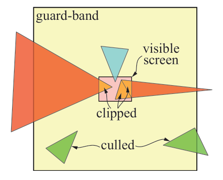

## 插值/Interpolation

先来看下 **重心坐标/barycentric coordinates** ，定义为：

$$
u = \frac{A_1}{A_0 + A_1 + A_2}, v = \frac{A_2}{A_0 + A_1 + A_2}
$$

其中 $A_i$ 是对应小三角形的面积。重心坐标有第三个分量 $w = A_0 / (A_0 + A_1 + A_2)$，且满足 $u + v + w = 1$。因此我们直接使用 $1 - u - v$ 来代替 $w$。

左：重心坐标插值；中：重心坐标uv值的变化；右：法线n2由p0p1旋转得到，A2的面积为bh/2

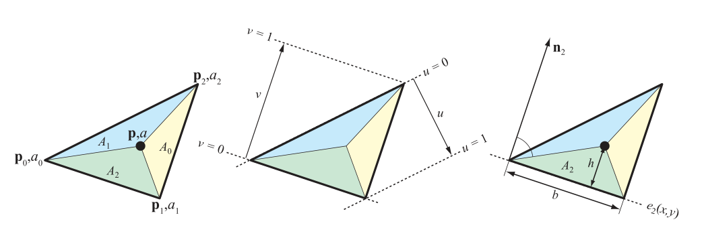

对于每个顶点的属性值 $a_i, i \in \{0, 1, 2\}$，使用重心坐标进行插值后的属性值为：

$$
a(u, v) = (1 - u - v)a_0 + ua_1 + va_2
$$

前面我们讲过，三角形的每条边对应着一个边界方程。现在我们将边界方程写成法线式，再根据点乘定义展开：

$$
e_2(x, y) = e_2(\boldsymbol{p}) = \boldsymbol{n}_2 \cdot (\boldsymbol{p} - \boldsymbol{p}_0) = \|\boldsymbol{n}_2\|\|\boldsymbol{p} - \boldsymbol{p}_0\| \cos \alpha
$$

其中 $\boldsymbol{n}_2$ 由边 $\boldsymbol{p}^0\boldsymbol{p}^1$ 逆时针旋转 90 度得到，我们再令 $b = \|\boldsymbol{n}_2\|$，表示 $\boldsymbol{n}_2$ 的长度，也是三角形边 $\boldsymbol{p}^0\boldsymbol{p}^1$ 的长度。而 $\|\boldsymbol{p} - \boldsymbol{p}_0\| \cos \alpha$，其实就是 $\boldsymbol{p} - \boldsymbol{p}_0$ 在 $\boldsymbol{n}_2$ 方向上投影的长度，也刚好是构成的小三角形的高度(参考上图右边的示意)，小三角形的面积为 $A_2$。由此我们可以得到 $e_2(x, y) = \|\boldsymbol{n}_2\|\|\boldsymbol{p} - \boldsymbol{p}_0\| \cos \alpha = bh = 2A_2$，得到的值刚好是我们用来计算重心坐标需要用到的面积值。由此可得

$$
(u(x, y), v(x, y)) = \frac{A_1, A_2}{A_0 + A_1 + A_2} = \frac{(e_1(x, y), e_2(x, y))}{(e_0(x, y) + e_1(x, y) + e_2(x, y))}
$$

在三角形准备阶段，我们会提前计算出 $\frac{1}{(A_0 + A_1 + A_2)}$ 的值，这样也可以避免每个像素中计算除法。在使用边界方程遍历三角形时，我们可以顺便计算出上面公式中求解重心坐标时需要的项。不过，在对深度值进行插值时，只有正交投影下这种方式才适用。在透视投影下，使用重心坐标插值无法得到正确的结果。

要计算透视投影下的插值，我们要使用 **透视矫正/perspective-correct**  ，将 $\frac{a}{w}$ 和 $\frac{1}{w}$ 分别在三角形中进行线性插值，然后在每个像素中计算一次除法。其中 $w$ 是顶点经过变换后得到的齐次坐标的第四个分量。

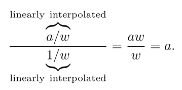

这里其实是把透视校正的插值过程变成了两个线性插值，因为线性插值是比较廉价的操作。**具体的推导过程可以参考**[孙小磊：计算机图形学六：透视矫正插值和图形渲染管线总结](https://zhuanlan.zhihu.com/p/144331875)，这里直接给出结论，不再进行推导。

假设现在有一条在屏幕空间中的水平的线，线的左右两侧的属性值分别为 $a_0 = 4, a_1 = 6$，在正交投影下，中间点的插值为 $a = 5$。

在透视投影下，假设这条线的两端的 $w$ 分量值为 $w_0 = 1, w_1 = 3$。透视矫正插值计算过程为：

|      | $a$ | $w$ | $1/w$ | $a/w$ |
| :--- | :---- | :---- | :------ | :------ |
| 点0  | 4     | 1     | 1       | 4       |
| 点1  | 6     | 3     | 1/3     | 2       |
| 插值 | 5     | 2     | 2/3     | 3       |

最终插值结果为 $a = 3/(2/3) = 4.5$。

实际上，我们经常会对很多属性值进行透视矫正插值，因此我们先计算出 **透视矫正重心坐标/perspective-correct barycentric coordinates** ， $ (\tilde{u}, \tilde{v}) $，将其应用在所有的插值计算中。

要计算透视矫正重心坐标，我们使用这样的辅助函数：

$$
f_0(x, y) = \frac{e_0(x, y)}{w_0}, f_1(x, y) = \frac{e_1(x, y)}{w_1}, f_2(x, y) = \frac{e_2(x, y)}{w_2}
$$

这里的的很多系数也是可以在三角形准备阶段预计算的，比如我们设 $e_0(x, y) = a_0x + b_0y + c_0$，在三角形准备阶段，就可以预计算出 $a_0/w_0$ 及其他类似的常量项。另外，我们还可以将辅助函数都乘以 $w_0w_1w_2$，得到 $e_0(x, y)w_1w_2, e_1(x, y)w_0w_2, e_2(x, y)w_0w_1$ 这样可以避免进行除法运算。

根据辅助函数，可以得到透视矫正重心坐标为：

$$
(\tilde{u}(x, y), \tilde{v}(x, y)) = \frac{(f_1(x, y), f_2(x, y))}{(f_0(x, y) + f_1(x, y) + f_2(x, y))}
$$

和前面我们计算重心坐标的公式相比，形式很接近。不同的地方在于，新的公式的分母值并不是常数无法提前计算，需要在每像素中做除法。

最后需要注意的一点是，因为我们期望的深度值是 $z/w$，是已经除过 $w$ 的，因此不需要使用透视矫正重心坐标来进行插值。我们只需要在每个顶点中计算出 $z_i/w_i$，然后进行线性插值即可。

## 保守光栅化/Conservative Rasterization

从 DirectX11 及后续的 OpenGL 扩展开始，一种新的光栅化方式**保守光栅化/Conservative Rasterization/CR**出现了。CR 有两种类型，一种是 overestimated CR /OCR/ outer-conservative rasterization，另外一种是 underestimated CR/UCR/inner-conservative rasterization。

传统的光栅化方式是，当像素中心点在三角形内部时，该像素被包含。OCR 是整个像素框，只要和三角形有相交部分，就被包含。UCR 则要求整个像素框都在三角形内部。具体示意如下图所示：

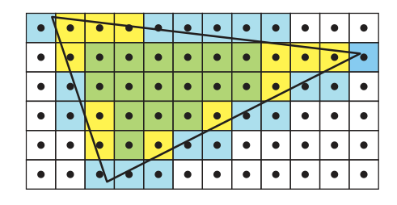

现代的图形硬件，大都直接支持 CR。在硬件中，OCR和UCR通过将 tile 在遍历时的大小扩大或缩小一个像素来实现。 在对于不支持CR的硬件，也可以通过在geometry shader中放大三角形的方式来实现 OCR。CR可以用于图形空间的碰撞检测、遮挡剔除、阴影计算、抗锯齿等各种算法中。

## 海量计算和调度/Massive Compute and Scheduling

为了实现高速计算，GPU会尽可能地并行计算可编程着色器。在CPU中，降低计算延迟的方式主要是通过快速的本地缓存和一些运行策略来实现。运行策略包括分支预测策略、指令重排序、寄存器重命名和指令预取等。

和CPU完全不同，GPU主要通过增加芯片的面积，添加大量**着色器核心/shader cores**来实现快速计算。GPU之所以能充分利用并行化来计算，有两个原因。一是因为GPU通常需要处理的数据，是非常相似的数据，比如说大量的像素着色，计算过程其实都是一样的。二是因为每个像素的计算都是独立的，不需要依赖周围像素点的数据，也不需要和周围点共享内存。

比如现在有一个模型，光栅化后有2000个像素点需要着色，也就是说像素着色器程序需要执行2000次。假设现在只有一个 shader processor，shader processor需要从第一个像素开始，执行2000次着色器程序，直到最后一个。当 shader 执行数学运算时，寄存器都是在本地的，计算会很快，没有什么延迟。但是当shader 需要访问贴图时，由于贴图是外部的资源，不在shader processor的缓存中，而从内存中读取需要花费成百上千个时钟周期，这时GPU便会闲置等待，等待贴图访问完成后，再继续执行，这样就造成了 **阻塞/stall** 。

为了避免这种可怕的情况，当shader processor需要进行贴图访问时，不会挂起等待，而是会切换到下一个像素的计算。这种切换的速度非常快，这样shader processor会执行第二个像素的数学计算部分，等遇到访问贴图时，又会切换到第三个像素的计算。最终，所有的2000个像素都会通过这种方式来计算。当贴图访问取到颜色后，shader 程序就会恢复并继续执行。这样，每个像素的平均执行时间被大大降低，贴图访问造成的 stall 被隐藏。

除此之外，GPU还会使用 **SIMD/single instruction multiple data** 来加速执行，SIMD会将数据和逻辑分开，在同一个时钟周期内，执行多个 shader program的同一条指令。SIMD 可以使用更少的芯片，在处理数据和切换时也更加方便。比如说现在要处理我们的2000个像素点，每个像素的处理计算叫做一个  **thread** ，这里的 thread 并不是CPU中的线程，它包括了一些 shader 需要用到的数据，以及一些运行时需要的寄存器。使用相同 shader 的一组 thread 会被打包在一起，叫做 warp(NVIDIA) 或者 wavefront(AMD)。wrap/wavefront 会被 GPU shader cores进行调度，使用 SIMD 处理。每个 thread 被映射到一个 SIMD lane上。

比如现在我们有2000个 thread，NVIDA的GPU每个 warp 包含32个thread，这样我们需要 2000/32 = 62.5 个wrap。GPU会为我们分配63个wrap，其中一个 warp 是半空的。warp 的执行方式和前面我们所讲的过程类似，shader program 会在一个时钟周期内，在32个 processor 上执行相同的指令。当遇到内存访问时，这个 warp 中的所有 thread 会等待访问内存的结果返回，同时切换到另外一个 warp 中的 32个thread 进行执行。而每个 thread 的寄存器都是独立的，会记录当前程序执行到的位置。所以这种切换不需要进行数据处理，切换的速度会非常快。

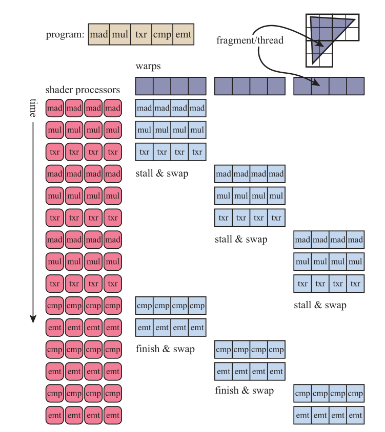

shader 中的分支会对计算过程产生很大影响，也就是 if 语句和循环语句。如果一个 warp 中所有的 thread 都执行相同的分支，那自然是没有什么问题。但是当有些 thread 选择不同的分支时，就会造成  **thread divergence** 。因为 SIMD 要求 warp中的 thread 执行相同的指令，所以当一些 thread 执行 if 分支的指令时，其余的 thread 需要进行等待。这也告诉我们，在写 shader 时应尽量避免 if语句 和循环语句。

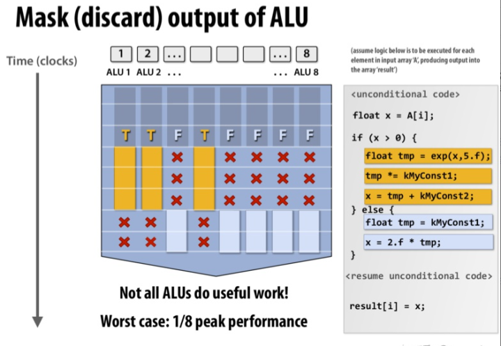

在GPU中，**arithmetic logic unit/ALU** 是执行程序的通用硬件单元，也叫做  **SIMD lane** ，对应着每个 thread 的执行。每个 ALU 中包括了 floating point/FP unit和integer unit。FP 中的浮点数通常就是标准的 IEEE 754标准的浮点数，支持 **fused-multiply add/FMA** 指令。ALU 还包括 move/compare 、load/store、分支判断和超越数计算(正弦余弦指数)单元。因为超越数计算单元并不常用，也可能是放在 ALU 外单独的地方，放在 **special unit/SU**中。

和 CPU 的指令执行一样，ALU的执行也会使用 pipeline parallelism，将每个指令的执行分成几个阶段，每个阶段都是同时执行的。比如说现在某个指令再执行计算乘法，下个指令正在执行取值操作。这样，流水线上的阶段划分得越多，整体执行速度也越快。不过为了简化设计，ALU 的阶段划分通常会比较少。

和 CPU core 相比，ALU 很少有中断，用来实现分支预测、寄存器重命名等。相反，GPU 通过在芯片上大量复制 ALU来提供超强的算力，提供大量寄存器来方便 warp 切换。比如 NVIDIA GTX 1050Ti 有 3584个ALU。

每32个 ALU 作为一个组，构成 SIMD engine，和其他的单元一起组成  **multiprocessor/MP** 。MP在不同显卡厂商中称呼不同，在NVIDIA中叫做 streaming multiprocessor，在Intel中叫 execution unit，AMD中叫做compute unit。MP的结构如下图所示。MP 中包括：向SIMD engine调度计算的调度器，由32个 ALU 组成的 SIMD engine，L1 cache，local data storage/LDS，texture unit/TX，处理不在ALU中执行的指令的 special unit/SU。

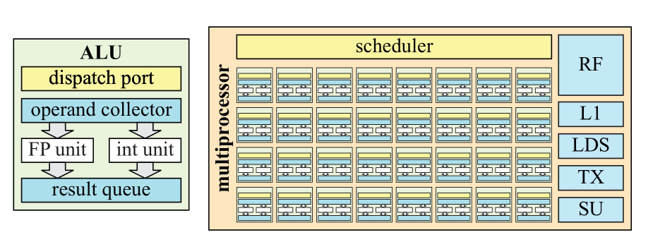

这样每个 MP 接受 warp 调度器分配的几个 warp，为每个 warp 中的 thread 分配 register file/ RF ，然后 MP 就会按照最佳的执行方式来 调度 warp 的执行，通常下游的工作优先级要高于上游的工作，比如 pixel shder 的优先级高于 vertex shader，这样可以尽量防止阻塞。

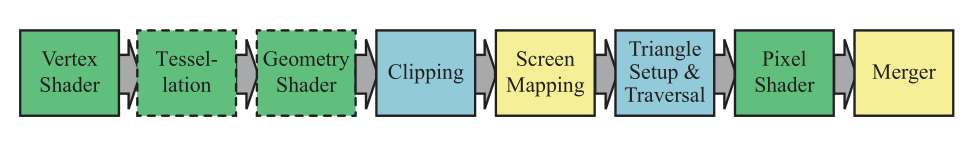

不同的GPU架构，结构都有些区别，这些会在后面进一步说明。

## 延迟和填充率/Latency and Occupancy

**延迟/latency** 指的是从发出请求到收到结果之间的时间。在GPU中，访问内存数据和贴图数据是非常慢的，需要成百上千个时钟周期，延迟会很大。前面我们讲过，GPU 通过 wrap swapping的方式来降低延迟。当使用 SIMD 多线程来处理数据时，每个 MP 可以处理的 warp 数目是有限制的。当前 warp 数目取决于寄存器使用，贴图采样、L1 caching、插值和其他因素。我们定义**填充率/occupancy** $o$ 为

$$
o = \frac{w_{active}}{w_{max}}
$$

其中 $w_{max}$ 是 MP 中最大 warp 数目，$w_{active}$ 是当前可用的 warp 数目。$o$ 是一个衡量计算资源利用率的指标。比如现在有 $w_{max} = 32$，且 shader processor 上有 256 kB 的寄存器。然后有两个 shader program，分发你别使用 27 个和 150 个 32 位浮点数寄存器。SIMD 的宽度是 32，这样可以分别得到两个 shader program 的可用 warp 数：

$$
w_{active} = \frac{256 * 1.24}{27 * 4 * 32} \approx 75.85, w_{active} = \frac{256 * 1.24}{150 * 4 * 32} \approx 13.65
$$

对于第一种情况，一个较短的程序使用了 27 个寄存器，得到的 $w_{active} > 32$，此时的填充率 $o = 1$，是最理想的情况。而第二种情况下，$w_{active} \approx 13.65, o \approx 0.43$。因为可用 warp 数变少了，填充率变低，意味着延迟隐藏的技术被削弱了。因此，设计一个能够良好地平衡最大 warp 数目，最大寄存器和其他共享资源的架构是非常重要的。

在大部分情况下，我们都尽量希望填充率越高越好。为了保证填充率，一般推荐在 shader 中不要使用超过 64 个寄存器。当然在很高填充率下，如果访问贴图资源较多，也可能导致缓存失效，使得执行更慢。

另外一种延迟来自于从 GPU 向 CPU 中回传数据。在计算机内部，可以认为 GPU 和 CPU 是两个并行运行的系统，因此它们之间的交互需要稍微费些力气。当从 GPU 中读取数据时，GPU 中的流水线必须被 flush，而此时 CPU 也需要等待 GPU。

不过在有些架构中，比如 Intel 的GEN 架构中，GPU 和 CPU 是处在同一个芯片上且是共享内存的，这种延迟就会大大降低。

一种不会造成 stall 的回读机制是类似于遮挡查询的机制。对于遮挡查询，GPU 中会进行判断，并将数据回传。而 CPU 中不会等待查询结构，而是会定期查询回传结果。这样在等待回传结果时，GPU 和 CPU 都在进行各自的工作，不会造成 stall。

## 内存架构和总线/Memory Architecture and Buses

在两个设备间，发送数据的通道叫做  **端口/port** ，**总线/bus** 是超过两个设备间共享的通道。**带宽/bandwidth** 是用来描述在端口/总线间传输数据的速度。在计算机图形结构中，端口/总线是把各个部分连接起来的胶水，可以说是非常重要。因为带宽是一种稀缺资源，因此在图形系统构造中，精心的设计和分析是必须的。

很多 GPU 都有独占的 GPU 内存 ，也叫做 **显存/video memory** 。访问显存会比通过CPU总线访问系统内存要快很多。比如PC上的 16位 PCIe v3 总线，速度是 15.75GB/s，PCIe v4 总线，速度是31.51 GB/s。Pascal 架构的显卡(GTX 1080)显存，速度可以达到320 GB/s。

一般来说，texture 和 render target 都是存储在显存中，对于场景中不怎么改变的物体，数据也是存在显存中。即使是带动画的人物角色，mesh 也是不变的，每帧变化的是在关节处混合的顶点。在这种情况下，动画是由模型的矩阵和 vertex shader program来驱动的。因此静态的 vertex buffer 和 index buffer是放在显存中的，供快速访问。而每帧需要更新的数据，是放置在动态的 vertext buffer和index buffer中，位于可通过总线访问的系统内存中。

大部分游戏主机，比如所有版本的 XBox和 PS4，会使用 **通用内存架构/unified memory architecture/UMA** ，这时 CPU 和 GPU 会共享内存，并使用相同的总线，这点和 PC 上显卡的显存很不一样。Intel 的 GEN9 图形架构也是使用了 UMA，来实现 CPU 和 GPU的内存共享，如下图所示。不过可以看出，GPU 还是拥有自己的 L1、L2、L3 缓存，而 LLC/last -level cache 才是共享的，这样可以尽量保证 GPU 访问内存的速度。

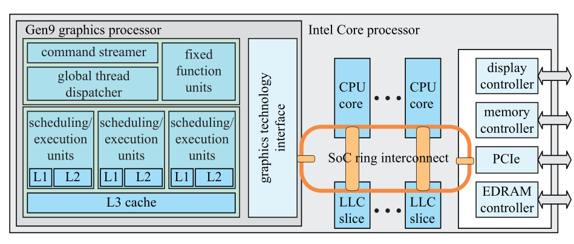

**Intel的Gen9 SoC结构，图形处理器和CPU时共享内存的，LLC也是共享的。**

## 缓存和压缩/Caching and Compression

在不同的GPU 架构中，缓存的位置不尽相同。总体来说，增加级联式的缓存的目的，一是降低内存访问的延迟，二是利用内存访问的**局部性/locality **来提高带宽的利用率。局部性指的是，当GPU访问某个位置的内存后，很可能会在不久后再次访问该处的内存，或者相邻位置的内存。大部分 texture 和 buffer 都是按照 tiled 模式存储的，这点也对增加局部性有帮助。

为了降低带宽的占用，大部分 GPU 的硬件单元会将 render target 实时压缩和解压。注意，这些压缩算法都是无损的，这样总是能精准复现原始的数据。压缩算法的核心是 tile table，会为每个 tile 存储额外的信息，tile table 可以存储在 chip 上或者级联内存中。如图所示，是两种压缩系统的设计方式，压缩单元在两种系统中的位置不同。

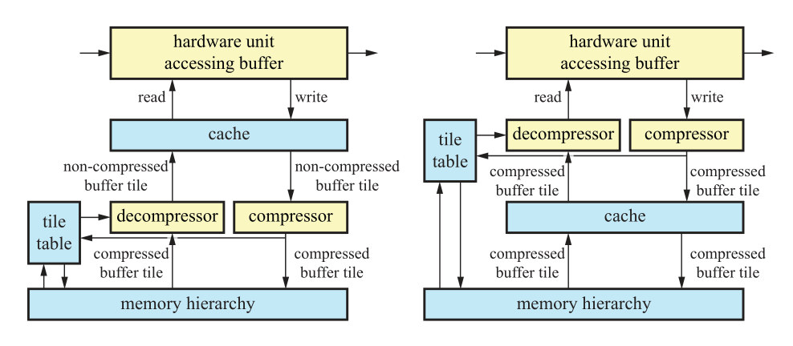

**GPU中 render taget的压缩和缓存技术示意图。左：压缩解压单元在缓存之后；右：压缩解压单元在缓存之前**

一般来说，depth、color、stencil 的压缩设置方式是一样的。在 tile table 中，会记录对应 tile 中像素的状态，可能是 compressed、uncompressed 或者 cleared。压缩的模式也可能是不同的，例如某个压缩模式可以压缩至 25%，另外一个可能压缩至 50%。GPU 处理内存转换的大小也会影响压缩的级别。例如某种架构下 GPU 能处理的最小内存大小为 32B，如果 tile 的大小为 64B，那就只能压缩至 50%。如果tile 大小为 128B，那么可能的压缩比例是 75%(96B)、50%(64B)、25%(32B)。

tile table 也会用来做快速 clear render target。当某个render target 需要 clear 时，只需要在 tile table 中将对应的状态设置为 cleared，而不用修改 render target 中的内容。当硬件需要访问 render target 中的内容时，解压缩单元会先检查 tile table 中设置的 tile 状态，如果状态是 cleared，那么就将 clear 的值直接写到缓存，而不需要进行解压缩处理，这样就节省了带宽。如果 render target的状态不是cleared，那么解压缩单元会从内存中读取数据，如果是压缩数据，则进行解压。因此 render target 的 clear 是一个非常快速的操作，通过简单地设置状态就能实现。

当硬件单元访问 render target 且写入了新的值后，当 tile 从cache 中被置换出来时，它就会被发送到压缩单元，压缩单元会尝试对其进行压缩。如果支持两种以上的压缩方式，那么几种压缩格式都会被尝试，然后选择占用内存最小的那个。因为 render target的压缩要求必须是无损的，如果没有合适的压缩格式，那就会使用未压缩格式进行存储。如果压缩成功，tile 的状态被设置成 compressed，压缩失败时，则设置成 uncompressed。

压缩/解压单元可以在缓存之后(post-cache)，也可以在缓存之前(pre-cache)。Pre-cache 的压缩方式可以显著增加缓存的利用效率，但是也会使得系统变得更加复杂。通常对于颜色的压缩方式是这样的：在 tile 中得到一个颜色的锚点值，然后算出其他颜色和锚点值得差，并进行记录。而对于深度值，因为深度值在屏幕空间中是线性得，所以通常是通过保存平面方程来实现。

## 颜色缓冲区/Color Buffering

GPU的渲染需要访问很多的 buffer，比如颜色、深度、模板等。注意这里的“颜色”，并不一定是可以看到的颜色，可以是任意的数据。

根据可以表示的颜色数量的不同，Color buffer 有几种不同的颜色模式，这些模式包括：

* **High color** ，每个像素两个字节，其中15位或者16位表示颜色，共可表示 32768/65536种颜色；
* **True color/ RGB color** ，每像素3或4个字节，24位用来表示颜色，可表示 16777216/1700万种颜色；
* **Deep color** ，每像素30/36/48位，可表示超过十亿种颜色。

High color 使用16位表示颜色时，红绿蓝三个通道，每个至少可以分到5位，表示32个级别的值。剩余1位，通常会用来加在绿色通道中，因为人眼对绿色是最敏感的，对亮度的贡献度最高。High color 相对 true color 和 deep color 有很大的速度优势，因为每像素2字节对于计算机是非常友好的，访问速度会非常快。但是现在 high color 已经非常少见，因为如果每通道只有32或64个级别，那么相邻的颜色级别很容易被区分。这个问题也叫做 **banding** 或 **posterization** 。由于 **Mach banding** 的心理效应，人类的视觉系统会放大这种差异。通过将相邻的颜色级别进行混合，进行抖动，可以降低这种效应的影响。即使是在24位的显示器上，banding 还是会被注意到，往 framebuffer 中添加噪声可以掩盖这个问题。

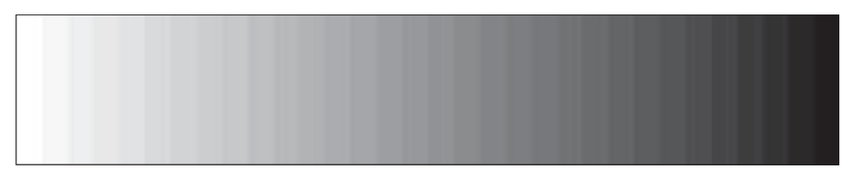

**长方形从左从左往右，从白色到黑色，共32个级别，形成了 banding。**

True color 使用24位表示RGB颜色，每个通道一个字节。在PC系统上，有时候顺序会被翻转成BGR。在计算机内部，true color常常会存储成每像素32位，因为计算机的内存系统通常对4字节的元素访问进行优化。当 true color 使用24位进行保存时，也叫做 packed pixel format。有些时候我们会为RGB通道添加一个A通道，表示 alpha 值，形成RGBA。对于实时渲染来说，通常用24位来表示颜色是足够的。虽然也能看到颜色的 banding，但是相对16位颜色来说要好的多。

Deep color每个通道使用10/12/16位，共30/36/48位表示RGB颜色。如果加上 alpha 通道，就变成 40/48/64 位。HDMI 3.1 支持30/36/48这三种模式，DisplayPort每通道最多可以支持16位。

Color buffer 通常会使用上面我们提到的方式进行压缩和缓存，除此之外，将 color buffer 中的颜色和即待写入的颜色进行混合的过程 blending，将在后面讲到。Blending 通过 raster operation/ROP 单元实现，每个 ROP 通常会连接到一个内存分区上。

## 视频输出控制器/Video Display Controller

每个GPU，都有 **视频输出控制器/Video Display Controller/VDC** ，或者叫做 display engine 或 display interface，负责将 color buffer 显示到显示器上。GPU 上有这样的硬件单元，来提供不同的接口，比如说 high-definition multimedia interface (HDMI)、DisplayPort、digital visual interface(DVI) 和 video graphics array (VGA)。即将进行显示的 color buffer 可能是位于可供 CPU 访问的内存中，也可能是位于 GPU 的显存中。每个接口都会使用相应的标准协议传输 color buffer，时间信息，甚至音频信息。VDC 也可能进行一些图形缩放、降噪和多图形源组合等功能。

显示器的图像刷新频率通常在 60Hz~144Hz之间，叫做 **垂直刷新率/vertical refresh rate** 。当屏幕刷新率低于 72Hz 时，人眼就能感受到闪烁。

近些年来，显示器技术在刷新率、每通道位数、色域和同步方面都有进步。显示器刷新率一般都是60Hz，现在120Hz的屏幕也越来越常见，甚至最高能达到600Hz。对于高刷新率，一张图形通常会显示多次，有些时候会插入一些纯黑色的帧，来最小化帧间移动时导致的模糊。相对于每通道8位的表示，现代的HDR显示器每通道可以使用10位或者更多。Dolby 的HDR显示器技术，会使用LED组来增强LCD显示器。这样可以是显示器获得 10倍的亮度和100倍的对比度。带有更大色域的显示器也越来越多，可以显示更多的颜色，更加生动的图像。

为了降低撕裂效果，厂商也开发出一些自适应的同步技术，像AMD的FreeSync和NVIDIA的G-sync。

## 单缓冲，双缓冲和三缓冲/Single, Double, and Triple Buffering

假设现在我们只有一个buffer，表示当前需要显示到显示器上的内容。当一帧中的三角形被绘制时，会随着显示器的刷新，逐渐一点点出现，这种效果是很奇怪的。即使我们的帧率和显示器刷新率相等，single buffer 还是会有问题。如果我们决定清除 buffer 然后绘制一个较大的三角形，因为VDC 会将正在绘制的color buffer区域输出，我们就会短暂地看到 color buffer的变化。这种现象叫做 **撕裂/tearing** ，画面显示看起来被分割成了两部分。在一些像Amiga 的古老系统中，你可以通过检测 Beam来防止画面撕裂，这样single buffering就是可行的。现在只有在一些 VR系统中才会用到这种 single bugger渲染架构，会使用 beam 方式来尽可能降低延迟。

目前最常用的消除撕裂的方式是使用 double buffering。一个渲染完成的图像在 **front buffer** 中显示，同时不可见的的 **back buffer** 在被绘制。当back buffer 中的图像被传输到显示器后，图形驱动会 swap front buffer 和 back buffer，来避免撕裂。Swap的过程通常都是简单地交换两个 color buffer的指针。对于 CRT 显示器，这个事件叫做 vertical retrace，整个过程叫做  **vertical synchronization / Vsync / 垂直同步** 。虽然LCD 显示器没有 beam 的 retace，但是我们使用相同的术语来表示显示器中的交换过程。

如果渲染过程完成后，立即交换 back buffer 和 front buffer，可以最大化帧率，这样可以用来测试渲染系统的性能。但是这样其实是没有跟随 vsync 来进行更新的，同样会造成撕裂。不过因为两个buffer 都是渲染好的完整图像，撕裂效果不会像 single buffer 中那样糟糕。

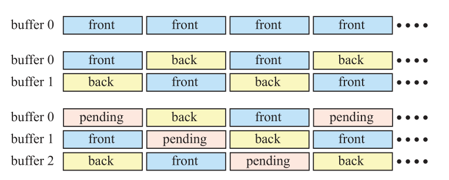

对 double buffering 进行改进，添加上 pending buffer， 就形成了 triple buffering。pending buffer 和 back buffer 类似，都是不可见的，不同的是 pending buffer 是可以被修改的。pending buffer 在交换之后，会变成 back buffer。再次 swap 后，成为 front buffer。这样，三种buffer 构成了循环，如上图所示。

使用 doule buffering 时，等待垂直刷新及swap时，front buffer 需要被显示，而 back buffer 因为是已经渲染好的图像，所以需要保持不变，等待被显示。相对 double buffering，triple buffering的优势在于，当等待垂直刷新的时候，系统可以访问 pending buffer。这样 triple buffering 避免了等待的时间，从而增加帧率。不过相应的缺点就是，会增加整整一帧的延迟，会给用户从手柄鼠标键盘的输入增加延迟，甚至产生卡顿。

理论上来说，超过三个的buffer 也是可行的。如果每帧渲染的时间波动很大，使用更多的buffer，就能使结果更平滑，帧率更高，当然代价就是更大的延迟。

一种加速渲染技术就是 SLI/scalable link interface，可以让两张或者更多显卡同时工作。AMD 系列显卡中这种技术叫做 CorssFire X。并行工作的原理，可以是将整个屏幕分成两个或更多部分，每个显卡负责一部分区域的渲染。也可以是每个显卡负责一个单独的帧，最后将所有帧汇总。

## 深度裁剪、测试和缓冲区/Depth Culling, Testing, and Buffering

深度值的精度是非常重要的，可以避免很多渲染错误。例如，当你建模一张放在桌子上的纸时，纸是略微高于桌子的表面的。因为 z-buffer 计算的精度限制，桌子会穿过纸张，形成很多斑点。这个问题叫做 z-fighting。如果纸张和桌子表面完全放置在相同的高度，那么深度测试就无法判断二者的关系。这个问题是错误的建模导致的，无法通过提高z值精度来解决。

z-buffer在渲染管线中，用来解决可见性的问题，每像素通常有 24位或者 32位，可能是使用浮点数格式或者定点数格式。对于正交投影，z值和距离值是成正比的，所以分布也是均匀的。而对于透视投影，z值分布是不均匀的，近处的z值精度值会比远处更高。在经过透视投影矩阵变换后，z值还需要除以w分量。如果z值是用定点数表示的，那么z值还会映射到相应范围内的整数值。

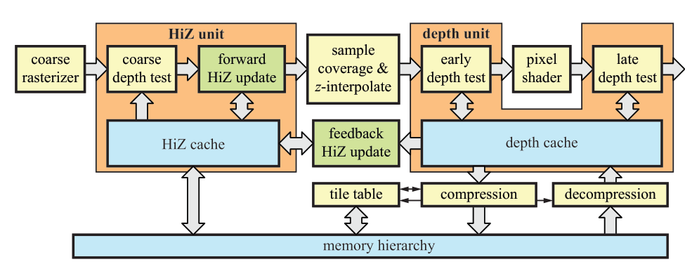

深度管线的流程如上图所示，整个流程的目标是实现：测试每个即将到来的深度值、光栅化图元时生成深度值，当深度测试通过后写入深度值。同时，整个流程需要时非常高效的。

上图中左边部分是粗粒度光栅化的HiZ单元，HiZ单元在叫做 **coarse depth test**的地方开始，在这里会进行两种z-culling测试。

第一种是 $z_{max} - culling$，思路是存储整个 tile 上 $z$ 的最大值。$z_{max}$ 的值通常是位于 on-chip 内存或者缓存中，在上图中，我们把这块内存叫做 Hiz 缓存。这样我们可以快速地判断一个三角形时候被一个 tile 完全遮挡。如果三角形的深度值满足 $z_{min}^{tri} > z_{max}$，那么就可以保证在这个 tile 中，整个三角形是被之前渲染的图元给挡住的。这样在这个 tile 中，这个三角形就不必进行后续的逐像素的深度测试。注意这并不意味着每个像素的 pixel shader 的执行一定也会完全跳过。实践中，我们会使用相对保守的方式来计算 $z_{min}^{tri}$ 的值，因为要计算出精确地值，还是比较麻烦的。比如我们可以采用这样的方式来计算：

1. 使用三角形三个顶点的最小 $z$ 值，总是不是很精确，但是额外的计算量很小；
2. 使用三角形的平面方程，确定在 tiel 四个角上的深度值，使用最小的 $z$ 值。

将两种策略结合，取二者中的最大值，可以达到最佳的裁剪效果。

另外一种粗粒度深度测试是 $z_{min} - culling$，思路是存储整个 tile 上像素的 $z_{min}$ 值，可以用来避免 z-buffer 的读取，如果整个三角形确定是位于所有之前渲染的几何体之前的，每像素的深度测试就可以跳过。这个和前面说的 $z_{max}$ 的道理大致是一样的。

上面图中的绿色框，显示了两种更新 tile 的 $z_{max}$ 和 $z_{min}$ 值方法。如果三角形覆盖了整个 tile，那么更新可以直接在 HiZ 单元中进行。如果没有，则需要计算出每个采样点的深度之后，在读回到 HiZ 单元中，这样会造成一定的延迟。

对于通过粗粒度深度测试的 tile，会接着进行深度测试、像素覆盖率和采样点深度值。这些值会发送到深度单元，显示在上图的右边。然后就是进行 pixel shader 的计算。不过在有些时候，在不改变最后结果的前提下，会进行额外的 **early-z** 测试。Early-z 测试是每像素点的测试，在 pixel shader 之前进行，如果测试失败，则被挡住的采样点的 pixel shader 就不会执行。early-z 常常会和 z-culling 混淆，但是 early-z 是由单独的硬件处理的，两种技术是可以单独存在的，没有互相依赖的关系。

在大部分情况下，GPU 会自动使用 $z_{max} - culling$，$z_{min} - culling$ 和 early-z。然而，如果 pixel shader 中写入了自定义深度值、或者使用了 discard 以及向 UAV 中写入了值，这三种剔除技术就会被关闭。当 early-z 不可用时，深度测试就会发生在 pixel shader 之后，叫做 **late depth test**。

现代的硬件，可以支持原子的 read-modify-write操作，在shader中加载并写入texture中的值。此时，在确保安全的情况下，你可以忽略上面的限制，显示地启用 early-z。另外一个特性，在pixel shader中输出的自定义深度值是保守深度值时，也可以启用。比如如果程序员能保证输出的自定义深度值大于三角形中的深度值，就可以开启early-z和 $z_{max}-culling$。

一般来说，将几何体从前往后进行渲染，对于遮挡剔除是比较友好的。另外一种类似的技术是 z-prepass，现将需要渲染的物体深度值输出，不计算pixel shader。然后将深度测试设置为 equal，因为z-buffer是已经计算好的，这样就只会渲染最前面的表面。

除此之外，当我们使仅使用 depth test ，而不使用深度写入时，即使使用了 discard 也是可以使用 early-z test 的，这个特性可以结合 z-prepass， 在一些植被非常多，使用了很多 AlphaTest 材质的情况下，来做性能优化。比如 UE 中支持在手机上，开启仅 mask 材质（适用了 alpha test/discard 的不透明物体）的 z-prepass。这样，在第二次绘制 basepass 时，就可以走 early-z test。

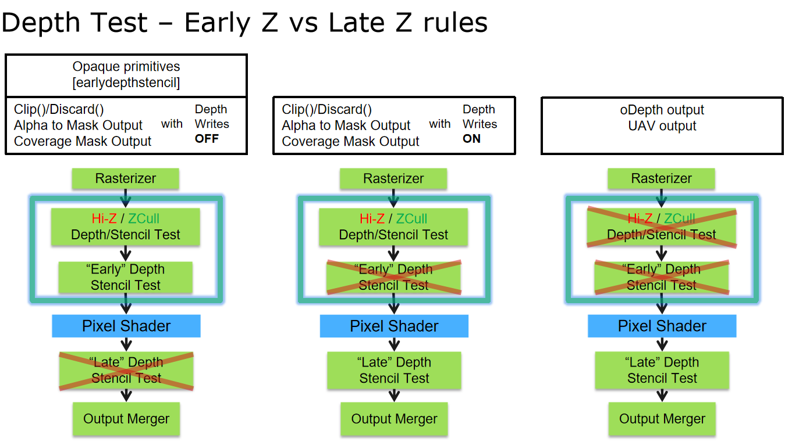

如上图右下角的部分所示，depth buffer 也会进行压缩，这些我们在前面缓存和压缩中已经讲过。

## Textureing/纹理

在实时渲染中，我们需要对texture进行各种各样的操作，包括取值、过滤和解压缩。这些当然可以通过软件来实现，不过用硬件可以比用软件快40倍。GPU 中的 texture unit 会执行取址、过滤、clamp和解压缩的工作。和 texture cache配合来降低带宽的使用。我们先来看下过滤/filtering。

为了使用缩小过滤(mipmap filtering 和 anisotropic filering)，我们需要求出纹理坐标在屏幕空间变化的微分值。也就是说，为了算出纹理的 lod 级别 $\lambda$，我们需要知道 $\partial u / \partial x$、$\partial v / \partial x$、$\partial u / \partial y$ 和 $\partial v / \partial x$。如果纹理的坐标是从 vertex shader 中直接传入的，并且在 pixel shader 直接用来访问纹理用，那就可以直接通过解析的方式求得。如果纹理坐标通过一些函数进行了转换，比如说 $(u', v') = (\cos v, \sin u)$，这时要通过解析的方式来计算微分值就困难许多。虽然我们还是可以通过链式来解析式地求解微分，但是这种方式却难以处理一些非常复杂的情况。比如现在要计算出物体表面的反射，物体法线由法线贴图给出，要计算出用来采样环境贴图用的反射方向的微分，就非常困难。因此，在图形硬件中，一般会使用 2x2 的 quad，利用周围像素点的纹理坐标来求微分，这也是 GPU 架构中总是将 quad 作为调度单元的原因。

一般我们用两种方式计算纹理坐标的微分值，一种是计算处 quad 上四个点的纹理坐标，直接求差作为四个像素点共同的微分值。另外一种方式较为精确，是四个像素点分别计算微分值，计算的方式是通过略微偏移纹理坐标，然后计算插值。下图显示了这两种计算方式的区别。OpenGL4.5 和 DirectX11 支持这两种微分计算方法。

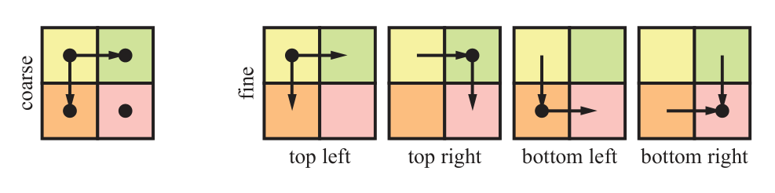

左边是简略的计算方式，右边是精确的计算方式。

为了降低带宽使用，GPU 通常会使用 Texture Caching来缓存最近的 texture 读取结果，而且访问非常快。具体的缓存大小和置换策略，取决于 GPU 厂商的架构实现。在访问某个位置的像素后，通常能很快在缓存中找到附近像素的值。我们之前提到过，texture 在GPU中使用 tiled 的顺序存储，而非扫描线的顺序，来最大化局部性。一个tile中的 texel 通常是一次性获取的，tile 的大小和缓存线的大小一般是一致的(比如64个字节)。

另外一种存储 texture 的模式是 swizzled 模式，假设现在纹理坐标已经转换成了定点数 $(u, v)$，$u$ 和 $v$ 分别有 n 位。设 $u$ 的第 i 位为 $u_i$。将 $(u, v)$ 转换成 swizzled 纹理坐标的方式为：

$$
A(u, v) = B + (v_{n-1}u_{n-1}v_{n-2}u_{n-2} \cdots v_1u_1v_0u_0) \cdot T
$$

$B$ 是 texture 的起始地址，$T$ 是每个 texel 占据的内存大小。使用这种方式映射后，texel 在内存中的顺序如下图所示。这种填充模式也叫做 Morton Sequence，常用来提高本地性。图中显示的是二维贴图的情形，也是最常见的情形。

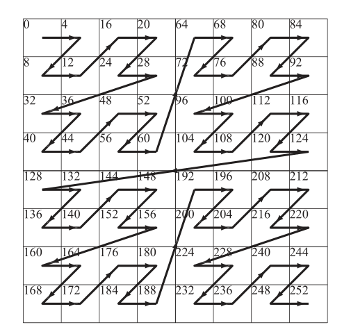

上图为 texture swizzling，数字表示在内存中的地址

Texture unit 中会包含来实现将不同格式 texture 解压缩的部分。相对于使用通用计算部分来解压缩，使用专用的硬件要快得多。我们之前提到过，texture 会在内存中进行压缩，包括 render target 也是一样。

Mipmapping 对于提高 texture 缓存局部性非常重要，因为它可以最大化 texel-pixel 的比例，尽量保证每个像素在 texture 中采样的范围对应一个 texel。Mipmaping 是少有的能在渲染中同时提高视觉效果和性能的技术。

## 架构/Architecture

整个渲染大致的流水线由以下几个阶段组成：

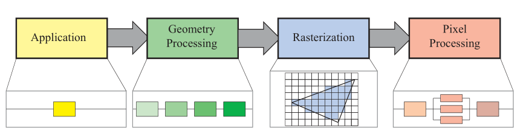

对于这四个阶段，大致介绍如下：

### (1) Application Stage/应用阶段

Application stage 由CPU驱动，是应用程序将需要渲染的数据发送到GPU上，这部分是由开发者完全控制的。

Application stage 也是可以通过多线程来加速的，且是通过 CPU 上的多线程来实现的。

### (2) Geometry Processing/几何处理

GPU 上的几何处理阶段，负责处理每个三角形和每个顶点的处理。这个阶段可以进一步划分成这样四个阶段：

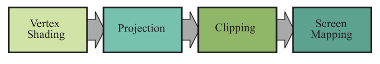

Geometry Processing 会处理每个顶点的数据(纹理坐标，法线等)，进行空间变换(模型空间到裁剪空间)，然后进行 clipping，并最终映射到屏幕空间中。

图形渲染中的 Geometry shader 和 Tessellation shader ，也是在这一步完成的，可以输出图元，以及修改图元属性。

### (3)  Rastererizer/光栅化

这部分在前面已经有了比较详细的介绍，可以分成两个阶段，三角形准备和三角形遍历：

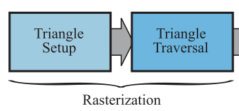

### (4) Pixel Processing/像素处理

这部分自然就是对每个像素点进行计算并着色了，也可以分成两个部分，分别是像素着色和最总结果合并：

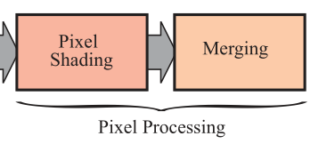

最终的合并阶段，是需要保证像素的合并顺序的。比如处理半透明的blend时，顺序会影响最总的结果。同时也需要考虑深度测试和模板测试。

要实现快速的渲染，就要想办法尽量将计算部分并行化，在 GPU中，几乎所有的渲染步骤都可以实现并行。并行的含义是同时计算多个结果，最后将得到的结果合并。如下图所示，是通过并行来加速渲染流水线的过程。大部分情况下，在GPU实际执行时，这三个阶段实际是由统一的 unified unit(比如说 unified ALU) 来计算完成的。

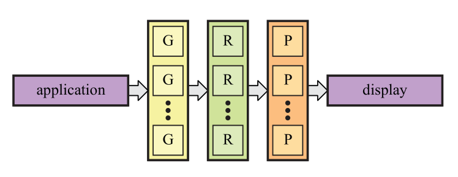

需要注意，无论是对于软件还是硬件，通过并行来提升的性能是有限的，因为总有需要进行串行执行的部分。比如某个系统，其中有10%的部分是串行的，那就意味着，即使并行部分并行数量达到无穷大，最高也只能有10倍的运行速度提升。因此，在设计图形的并行结构时，一昧地提高并行化是不可取的。

对于图形架构来说，很多东西是可以并行计算的，但是我们必须要保证，最终渲染的结果，和按照提交顺序逐个渲染的期望结果是一样的。因此一些排序工作是必须的，不同的图形架构中，排序发生的时机各不相同。

## 其他

更详细的GPU渲染管线内容，可以参考博客里[GPU渲染管线流程](https://monsterstation.netlify.app/archive/category/GPU渲染管线流程/)分类下我的其他文章。
