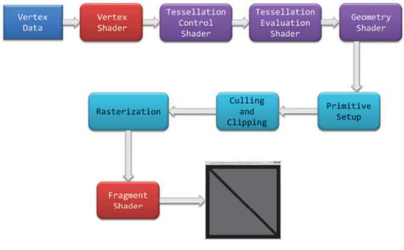
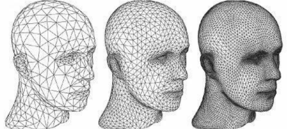
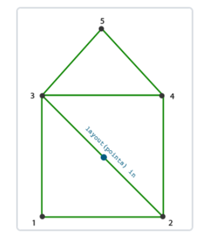
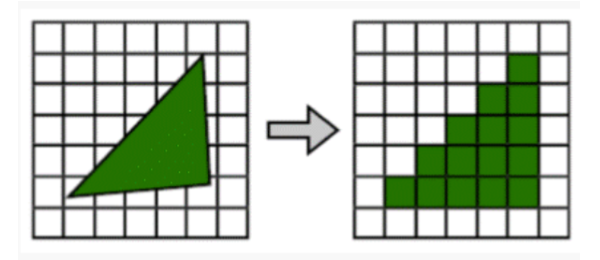
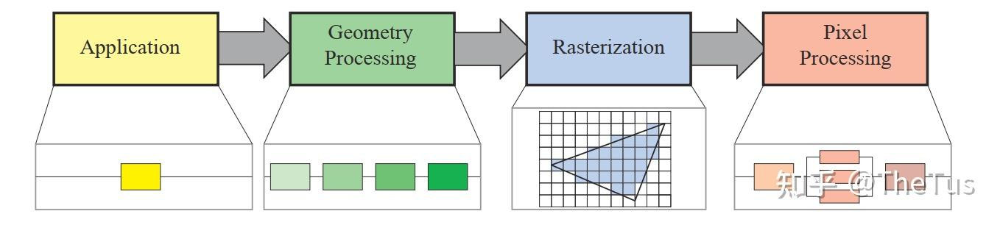
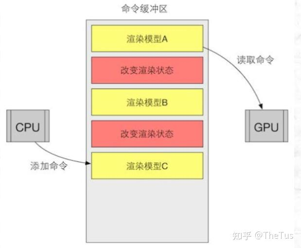

## Hello Pipeline!

图形渲染管线是实时渲染的核心组件。渲染管线的功能是通过给定虚拟相机、3D场景物体
以及光源等场景要素来产生或者渲染一副2D的图像。渲染管线是实时渲染的重要工具，实时渲染离不开渲染管线。

图形渲染管线主要包括两个功能：一是将物体3D坐标转变为屏幕空间2D坐标，二是为屏幕
每个像素点进行着色。渲染管线的一般流程如下图所示。分别是：**顶点数据的输入、顶点
着色器、曲面细分过程、几何着色器、图元组装、裁剪剔除、光栅化、片段着色器以及混
合测试**。我们会在后文对管线的各个阶段进行详细的介绍。

渲染管线的一个特点就是**每个阶段都会把前一个阶段的输出作为该阶段的输入**。例如，片
段着色器会将光栅化后的片段(以及片段的数据块)作为输入进行光照计算。除了图元组装和
光栅化几个阶段是由硬件自动完成之外，管线的其他阶段管线都是可编程/可配置的。其中
顶点着色器、曲面细分相关着色器、几何着色器和片段着色器是可编程的阶段，而混合测
试是可高度配置的阶段。

**管线的可编程/可配置**是渲染管线的另一个特点。因为早期的渲染管线（例如古早的OpenGL）采用的是立即渲染模式(Immediate mode，也就是固定渲染管线，所有操作只用于生成一轮图片)，不允许开发人员改变GPU渲染的方式，而核心渲染默认(Core-profile mode)允许开发人员定制化GPU的渲染方式。

事实上，渲染流水线是种模型，将3D场景变换至2D场景的处理流程抽象分离为不同的流水线阶段，供用户使用。其本质即指令从CPU端的应用程序层发送至API运行时、驱动层及至GPU端（包括二者间的通信，连接都靠PCle接口，实质上就是围绕这种总线传递数据），资源数据在内存与显存间游走，最后是GPU内部各种引擎、缓存、命令队列等根据指令配合运作将数据转化为显示器可视信号。至于为什么是GPU，当然是因为GPU的高速计算了。

:::important
虽然管线的划分粒度不一样，但是每个阶段的具体功能其实是差不多的，原理也是一样的，并没有太大的差异。主要的划分角度就是CPU角度和GPU角度两类。
:::

## 渲染流程

**顶点数据**：顶点数据用来为后面的顶点着色器等阶段提供处理的数据。是渲染管线的数据主要来源。送入到渲染管线的数据包括顶点坐标、纹理坐标、顶点法线和顶点颜色等顶点属性。为了让OpenGL明白顶点数据构成的是什么图元，我们需要在绘制指令中传递相对应的图元信息。常见的图元包括：点(GL_POINTS)、线(GL_LINES)、线条(GL_LINE_STRIP)、三角面(GL_TRIANGLES)。

**顶点着色器**：顶点着色器主要功能是进行坐标变换。将输入的局部坐标变换到世界坐标、观察坐标和裁剪坐标。虽然我们也会在顶点着色器进行光照计算(称作**高洛德着色**)，然后经过光栅化插值得到各个片段的颜色，但由于这种方法得到的光照比较不自然，所以一般在片段着色器进行光照计算。关于坐标变换以及着色方案的细节，我们会在后面详细介绍。

**曲面细分**：曲面细分是利用镶嵌化处理技术对三角面进行细分，以此来增加物体表面的三角面的数量，是渲染管线一个可选的阶段。它由**外壳着色器**(Hull Shader)、**镶嵌器**(Tessellator)和**域着色器**(Domain Shader)构成，其中外壳着色器和域着色器是可编程
的，而镶嵌器是有硬件管理的。我们可以借助曲面细分的技术实现细节层次(Level-ofDetail，又称LOD)的机制，使得离摄像机越近的物体具有更加丰富的细节，而远离摄像机的物体具有较少的细节。

**几何着色器**：几何着色器也是渲染管线一个可选的阶段。我们知道，顶点着色器的输入是单个顶点(以及属性)， 输出的是经过变换后的顶点。与顶点着色器不同，几何着色器的输入是完整的图元(比如，点)，输出可以是一个或多个其他的图元(比如，三角面)，或者不输出任何的图元。几何着色器的拿手好戏就是将输入的点或线扩展成多边形。下图展示了几何着色器如何将点扩展成多边形。

**图元组装**：图元组装将输入的顶点组装成指定的图元。图元组装阶段会进行裁剪和背面剔除相关的优化，以减少进入光栅化的图元的数量，加速渲染过程。在光栅化之前，还会进行屏幕映射的操作：透视除法和视口变换。

**透视除法和视口变换**：关于透视除法和视口变换到底属于流水线的那个阶段并没有一个权威的说法，某些资料将这两个操作归入到图元组装阶段，某些资料将它归入到光栅化过程，但对我们理解整个渲染管线并没有太大的影响，我们只需要知道在光栅化前需要进行屏幕映射就可以了，所以我们这里将屏幕映射放到了图元组装过程。这两个操作主要是硬件实现，不同厂商会有不同的设计。

**光栅化**：经过图元组装以及屏幕映射阶段后，我们将物体坐标变换到了窗口坐标。光栅化是个离散化的过程，将3D连续的物体转化为离散屏幕像素点的过程。包括三角形组装和三角形遍历两个阶段。光栅化会确定图元所覆盖的片段，利用顶点属性插值得到片段的属性信息，然后送到片段着色器进行颜色计算，我们这里需要注意到片段是像素的候选者，只有通过后续的测试，片段才会成为最终显示的像素点。

**片段着色器**：片段着色器在DirectX中也成为像素着色器(Pixel Shader)。片段着色器用来决定屏幕上像素的最终颜色。在这个阶段会进行光照计算以及阴影处理，是渲染管线高级效果产生的地方。

**测试混合阶段**：管线的最后一个阶段是测试混合阶段。测试包括裁切测试、Alpha测试、模板测试和深度测试。没有经过测试的片段会被丢弃，不需要进行混合阶段；经过测试的片段会进入混合阶段。Alpha混合可以根据片段的alpha值进行混合，用来产生半透明的效果。Alpha表示的是物体的不透明度，因此alpha=1表示完全不透明，alpha=0表示完全透明。测试混合阶段虽然不是可编程阶段，但是我们可以通过OpenGL或DirectX提供的接口进行配置，定制混合和测试的方式。

:::note
上面的划分只是出于我的个人思路和其他参考，并不代表完全正确的渲染管线流程。

**《Real TimeRendering》**一书将渲染管线划分为以下四个阶段：**应用程序阶段(Application)、几何处理阶段(Geometry Processing)、光栅化(Rasterization)和像素处理阶段(Pixel Processing)**。应用阶段通常是在CPU端进行处理，包括碰撞检测、动画物理模拟以及视椎体剔除等任务，这个阶段会将数据送到渲染管线中；几何处理阶段主要执行顶点着色器、投影变换、裁剪和屏幕映射的功能；光栅化阶段和我们上面讨论的差不多，都是将图元离散化片段的过程；像素处理阶段包括像素着色和混合的功能。

:::

## 数据与存储

### 模型格式

顶点数据在DirectX中成为输入装配阶段(Input Assembler State)。是渲染管线数据的主要来源，输入的数据可以包括顶点坐标、顶点颜色、顶点法线、纹理坐标等数据，利用这些输入数据我们可以在片段着色器计算片段的光照信息，最终输出到颜色缓冲器。顶点数据在流水线中以图元的方式进行处理，常见的图元有：点、线和三角面。在OpenGl中可以使用glGenVertexArrays() 、glGenBuffers() 、glBindBuffer() 、glBindVertexArray() 、glVertexAttribPointer() 等API从应用程序传入数据，并设置顶点对应的属性信息和内存布局。

现代游戏开发中最常用的格式当属FBX（.fbx），而最经典的模型格式还是OBJ（.obj），WebGL中更多使用GLTF（.gltf / .glb）。

我们用三角形网格来近似表示物体，用指定的3个顶点来定义三角形。由于相邻三角形会存在顶点共用的情况，尤其在物体网格非常复杂的情况下，冗余数据会非常多。我们可以通过使用索引来避免共享顶点间数据的多余，也就是使用元素缓存对象(Element BufferObject，EBO)。

### 纹理/图片格式

* **PNG (.png)** ：无损压缩，支持透明通道，常用于纹理贴图。
* **JPEG (.jpg)** ：有损压缩，适合大尺寸漫反射贴图，文件小。
* **DDS (.dds)** ：DirectX纹理格式，支持MIP映射和压缩，适合实时渲染。
* **KTX (.ktx)** ：跨平台纹理格式，优化GPU加载。
* **EXR (.exr)** ：高动态范围（HDR）图像，适合光照贴图和后期处理。

### 材质数据

主要包括材质属性（漫反射、镜面反射、粗糙度等）、着色器代码（GLSL、HLSL）、PBR参数、贴图引用。

* **MTL (.mtl)** ：搭配OBJ，存储基本材质信息。
* **GLTF** ：内嵌PBR材质描述（金属度、粗糙度等）。
* **USD** ：支持复杂材质网络和着色器绑定。
* **SPIR-V (.spv)** ：跨平台着色器字节码，存储编译后的着色器。
* **Proprietary Formats**：如Unity的ShaderLab或Unreal的材质文件。

## CPU阶段（应用阶段）

应用阶段是完全可控制的，因为它在CPU上执行。

应用阶段的主要任务是输入装配。输入装配阶段会从显存中读取几何数据(顶点和索引)，再将它装配为 **几何图元(geometry primitive)** 。简单来说，应用阶段通过索引将顶点装配在一起，构成图元传递给几何阶段。

这通常在多个处理器核心上执行，被称为 **超标量结构(superscalar construction)** 。

应用阶段的其他任务包括：粗粒度剔除(将完全不可见的物体剔除)，碰撞检测、处理其他源输入(键盘、鼠标等)、加速算法...

另外，应用阶段也可以通过计算着色器在GPU上运行。

### CPU主流程

主要流程如下：

1. 进行剔除(Culling)工作 :剔除主要分为三类，分别是

> 视锥体剔除(Frustum Culling) ：如果场景中的物体和在视锥体外部，那么说明物体不可见，不需要对其进行渲染.。在Unity中可以通过设置 `Camera`的 *`Field of view`* , *`Clipping Planes`*等属性修改视锥体属性。
>
> 层级剔除(Layer Culling Mask) ：通过给物体设置不同的层级，让摄像机不渲染某一层，在Unity中可以通过*`Culling Mask`*属性设置层级可见性
>
> 遮挡剔除(Occlusion Culling) ：当一个物体被其他物体遮挡而不在摄像机的可视范围内时不对其进行渲染

2. 设置渲染顺序 ：渲染顺序主要由 渲染队列(Render Queue) 的值决定的，不透明队列(`RenderQueue < 2500`)，根据摄像机距离 从前往后排序 ，这样先渲染离摄像机近的物体，远处的物体被遮挡剔除；半透明队列(`RenderQueue > 2500`)，根据摄像机距离 从后往前排序 ，这是为了保证渲染正确性，例如半透明黄色和蓝色物体，不同的渲染顺序会出现不一样的颜色 。
3. 打包数据 : 将数据提交打包准备发送给GPU，这些数据主要包含三部分，分别是

> 模型信息 :顶点坐标、法线、UV、切线、顶点颜色、索引列表...（数据类型取决于模型格式，一般会为不同格式的模型编写不同的Loader，例如Assimp库）
>
> 变换矩阵 :世界变换矩阵（也称Model矩阵）、VP矩阵(根据摄像机位置和fov等参数构建)
>
> 灯光、材质参数 ：shader、材质参数、灯光信息

4. 调用SetPass Call， Draw Call ：
   SetPass Call: Shader脚本中一个Pass语义块就是一个完整的渲染流程，一个着色器可以包含多个Pass语义块，每当GPU运行一个Pass之前，就会产生一个SetPassCall，所以可以理解为调用一个完整渲染流程。
   DrawCall：CPU每次调用图像编程接口命令GPU渲染的操作称为一次Draw Call。Draw Call就是一次渲染命令的调用，它指向一个需要被渲染的图元（primitive）列表，不包含任何材质信息。GPU收到指令就会根据渲染状态（例如材质、纹理、着色器等）和所有输入的顶点数据来进行计算，最终输出成屏幕上显示的那些漂亮的像素。

:::note
Unity中可以通过开启Stats查看SetPass Call 和DrawCall调用的次数，它们可能会占用大量CPU资源，是性能优化中非常值得关注的一个点
:::

 CPU渲染阶段最重要的输出是渲染所需的几何信息，即渲染图元（rendering primitives），通俗来讲，渲染图元可以是点、线、三角面等 ，这些信息会传递给GPU渲染管线处理。

### CPU与GPU的调度

> 这一段来自[知乎文章](https://zhuanlan.zhihu.com/p/627201581)

首先我们需要明确的是GPU是一个计算设备，一个独立的设备，它不是一个CPU线程，所以我们并不能像丢一个DrawCube()函数让GPU执行。

我们能做的就是把各种数据经过API一股脑塞给它：shader，buffer等。即使是命令，也是要存在 **命令缓冲区(CommandBuffer)** 的 **命令队列(CommandList)** 里。而命令队列本质也只是一个数据容器，本身不会携带任何逻辑或回调。

命令缓冲区使得 CPU 和 GPU 可以相互独立工作。当CPU需要渲染一些对象时，它可以向命令缓冲区中添加命令，而当 GPU 完成了上一次的渲染任务后，它就可以从命令队列中再取出一个命令并执行它。

命令缓冲区的命令有很多种，而**Draw Call**就是其中一种。其他命令还有改变渲染状态等。例如下图中，黄框就是一次Draw Call。

说人话就是，CPU就像一个什么都会一点的老板，而GPU是专精计算的员工。GPU本身是怠惰的，只有当CPU向它发送命令时，才会开始工作。CPU会命令GPU：“把目标给我渲染到相机上”，“把相机给我清空”，“给我画一个三角形”。而这个“给我画一个三角形"就是一次Drawcall。

### Draw Call（绘制调用）

Draw Call这个名称中的Call就决定了DrawCall一定是类似函数的东西，如果你编写过渲染管线，或者使用过OpenGL等API就明白，Draw Call就是对Draw()这个函数的调用。DrawCall是指在应用阶段生成的渲染命令，用于绘制一个或多个图元(如三角形)的请求。每个DrawCall包含了一组渲染状态(如渲染目标、着色器程序、纹理等)和要渲染的几何数据。

DrawCall在**应用阶段**生成。在应用阶段，应用程序通过调用图形API发送渲染命令给图形硬件。这些渲染命令包括绘制调用，即DrawCall。

具体来说，DrawCall在渲染管线的不同阶段起着不同的作用：

* 应用阶段：应用程序将准备好的几何数据(如顶点坐标、纹理坐标等)和渲染状态(如光照、材质属性等)通过DrawCall发送给图形硬件。应用阶段的DrawCall将几何数据传递到下一个阶段，即几何阶段。
* 几何阶段：在几何阶段，图形硬件对传入的几何数据进行处理，执行顶点着色器、图元装配和裁剪等操作。每个DrawCall会经过几何阶段的处理，生成裁剪后的几何图元。
* 光栅化阶段：在光栅化阶段，裁剪后的几何图元被转换为屏幕上的像素。这个阶段包括三角形光栅化、像素插值和面剔除等操作。每个DrawCall生成的几何图元会经过光栅化阶段的处理，生成覆盖屏幕上像素的片段。
* 像素阶段：像素阶段是渲染管线的最后一个阶段。在像素阶段，对每个片段进行像素着色器的计算，确定最终像素的颜色、深度和其他属性。每个DrawCall生成的片段会经过像素阶段的处理，最终输出到帧缓冲中。

DrawCall与性能息息相关。例如一个场景中有两个小人，如果在应用阶段分别导入，那么就会产生两次DrawCall。如果将它们 **合并(Batch)** ，则只会产生一次Drawcall。

DrawCall批次太多会导致CPU性能开销过大，一般来说有两种解决方法：

* 合批，把模型合成一个大mesh。（Unity采用手动批处理，UE5中有网格代理等实现）
* GPU Instance，用于绘制重复的模型。只需要提交一次模型数据，通过在GPU中对buffer进行偏移获取本次绘制的计算数据。

## 总结

今天说了不少了，后面还有三个阶段，会在之后的文章中给出详细的介绍，敬请期待吧 ~
