我们可以将阴影大致分成两个部分，**全影 (umbra)** 和 **半影(penumbra)** 。半影区域就是阴影的过渡区， 也就是软阴影，有半影的阴影过渡时，视觉效果会好很多。

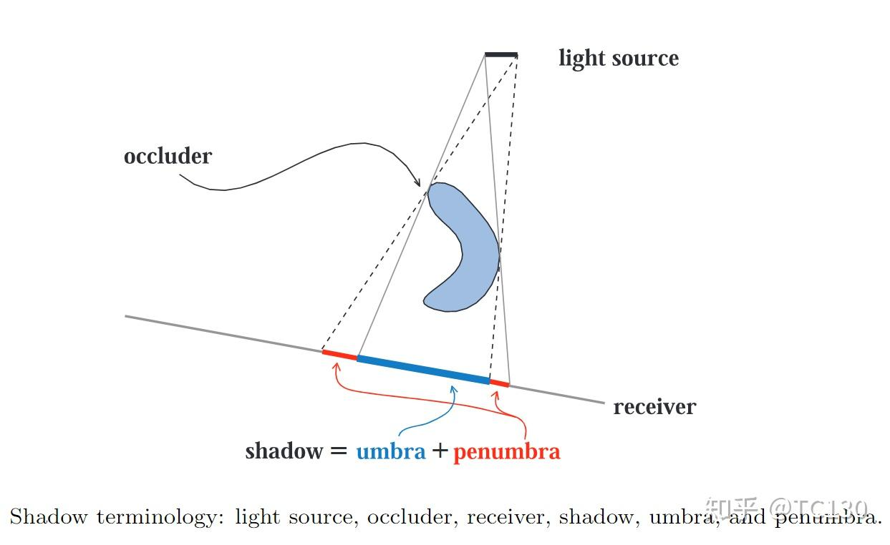

对于静态的场景，我们可以选择将阴影烘焙到**Lightmap**中，或者直接画在贴图上。这篇文章，我们主要来介绍下动态阴影的相关技术，因为阴影是实时渲染中比较重要的技术，实现的方式也非常多。本篇文章，尽量覆盖到各种常用的阴影渲染技术。

## 简单的手绘假阴影

在手游或者2D游戏中上经常能看到这种做法，对于动态的角色，将阴影做成一张贴图，让后贴到脚下的地面上，虽然是很简单的形式，也能极大地增强真实感。

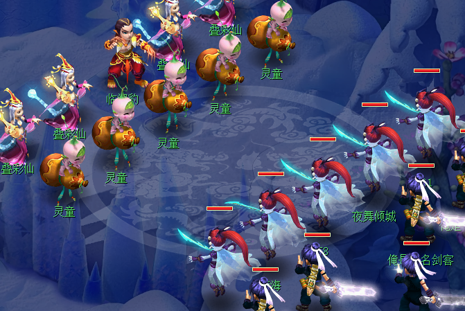

## 平面投射阴影

### 1. 平面投射阴影的计算

平面投射阴影，就是将需要投射阴影的物体再渲染一次，投射到地面上，来产生阴影。根据平面的位置，我们可以计算出一个投射的矩阵，直接将物体的坐标变换到平面上。

我们先来看简单的情况，如下图左边所示将阴影投射到x轴上的情况，我们在光源 $l$ 的照射下，需要从点 $v$ 投射阴影到点 $p$ ，根据三角形相似原理，我们可以简单地得到：

$$
\frac{p_x - l_x}{v_x - l_x} = \frac{l_y}{l_y - v_y} \Rightarrow p_x = \frac{l_y v_x - l_x v_y}{l_y - v_y}
$$

相应地，我们还可以算出 $z$ 轴上的坐标为：$p_z = (l_y v_z - l_z v_y) / (l_y - v_y)$，将结果整理成投影矩阵为：

$$
\mathbf{M} = \begin{pmatrix} 
l_y & -l_x & 0 & 0 \\ 
0 & 0 & 0 & 0 \\ 
0 & -l_z & l_y & 0 \\ 
0 & -1 & 0 & l_y 
\end{pmatrix}
$$

这样可以通过矩阵计算投影坐标：$p = Mv$。

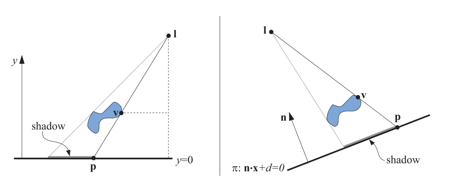

现在，我们看上图中右边这种更加一般的情况，在这种情况下，我们同样可以根据三角形相似原理，推导出投射阴影的坐标变换方程为：

从 $\mathbf{v}$ 点映射到 $\mathbf{p}$ 点：

$$
\mathbf{p} = \mathbf{l} - \frac{d + \mathbf{n} \cdot \mathbf{l}}{\mathbf{n} \cdot (\mathbf{v} - \mathbf{l})} (\mathbf{v} - \mathbf{l})
$$

令 $\mathbf{p} = \mathbf{Mv}$，推导后写成矩阵的形式：

$$
\mathbf{M} = \begin{pmatrix} 
\mathbf{n} \cdot \mathbf{l} + d - l_x n_x & -l_x n_y & -l_x n_z & -l_x d \\
-l_y n_x & \mathbf{n} \cdot \mathbf{l} + d - l_y n_y & -l_y n_z & -l_y d \\
-l_z n_x & -l_z n_y & \mathbf{n} \cdot \mathbf{l} + d - l_z n_z & -l_z d \\
-n_x & -n_y & -n_z & \mathbf{n} \cdot \mathbf{l}
\end{pmatrix}
$$

如果是平行光源，计算的方式也是大致相同，并没有特别的难度。

在进行渲染时，我们可以选择先来渲染阴影，将投射阴影的物体，经过上述矩阵的变换到平面上，然后得到没有光照的黑色地面，此时同时把深度写入。然后再正常渲染地面和投射阴影的物体，为了使地面和阴影之间不会冲突，此时可以为深度值添加一些偏移。

添加偏移的方式可以直接通过图形 API 来添加，比如 OpgnGL 中的 `glPolygonOffset` 和 DirectX 中的 `DepthBias`设置。当然，你也可以选择在绘制阴影时添加偏移，绘制地面时正常绘制，最终的结果都是相同的。后面我们讲到的各种阴影技术，经常会用到添加偏移（bias）的技术。

另外一种安全的做法是，先正常渲染地面，然后渲染地面上的阴影，渲染阴影时将深度测试关闭，就不会产生深度冲突的问题。最后再渲染投射阴影的物体，这样可以防止阴影投射到非地面的区域。

如果接受阴影的地面不是一个无穷大的平面，则可能需要需要通过stencil buffer标记出需要接受阴影的部分，这样可以只让阴影产生在需要产生的平面上。

另外一个需要注意的情况，是如下图所示的情况，在进行计算时，需要保证投射阴影的物体，位于光源和接受阴影的地面之间，否则就会出现错误的阴影效果。

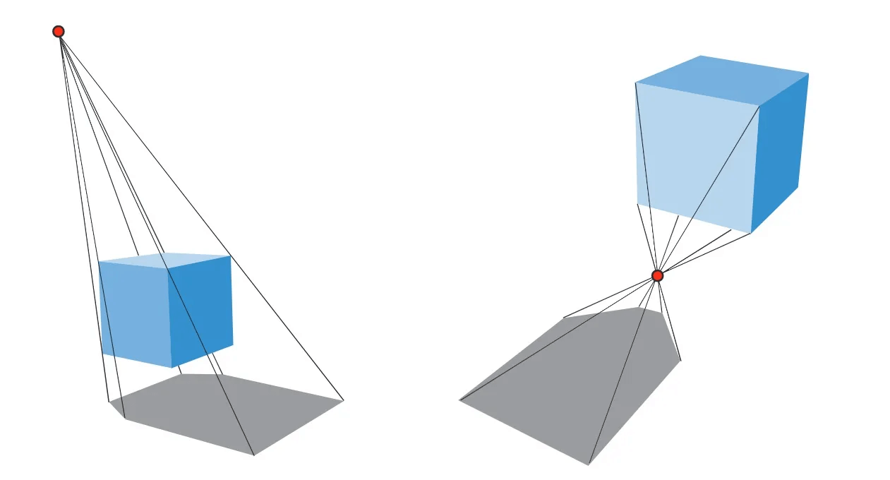

总的来说，这种直接投射阴影的方式，简单直接，适合直接投射在平面上的阴影。目前在手机游戏中，仍然有广泛的应用。

这种直接投射的阴影无法实现软阴影效果。而且由于我们是先渲染出的地面，再将影子的颜色乘以地面的颜色，这样其实并不是完全符合阴影产生的原理。

我们知道，阴影是由于地面没有受到光照而产生的，如果直接将地面的颜色乘以阴影，可能会产生不正确的阴影效果，特别是地面上有高光效果时。这类阴影叫做调制阴影（Modulated shadow），相对普通的阴影，开销要小一些。

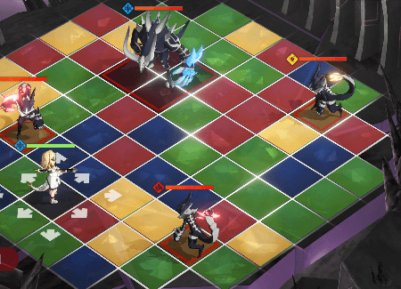

### 2. 借助Texture的投射阴影

上面我们说到的投射阴影，是直接渲染到被投射的平面上，这样我们就无法实现软阴影的效果，因此我们这里将阴影先保存在一张贴图中，再从贴图中投射到平面上。这样还可以先得到阴影图，再渲染地面，得到正确的阴影效果。

和前面的直接投射相比，这种方式因为中间经过了一层转变，如果保存阴影的贴图分辨率很低，就可能会造成投射出来的结果有锯齿感。

这样，我们就可以将贴图中的阴影先进行边缘模糊，再进行投射，就可以非常方便地得到软阴影效果。

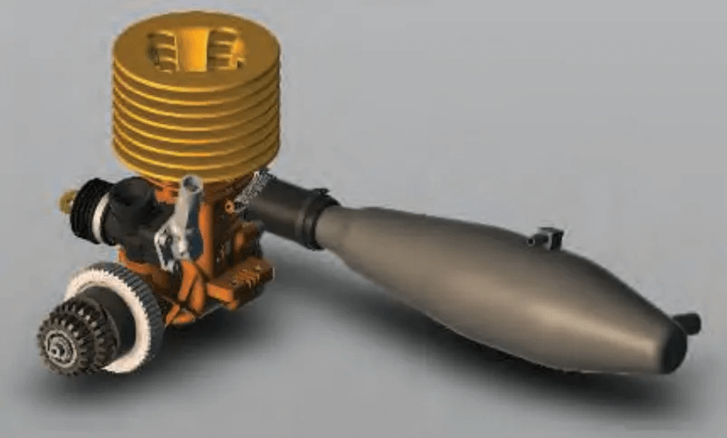

上图为投射阴影实现的软阴影，先将阴影投射到贴图中，然后进行模糊，再投射至平面，实现软阴影效果

为了提升运行效率，我们还可以将多个物体的Texture打包到一个Shadow Atlas中，这样每个物体的投射阴影，占用整个大贴图的一部分。如果光源和投射阴影的物体都没有改变，我们甚至可以不用更新阴影，实现帧间阴影的复用。

## Shadow Volume 阴影

shadow volume 以前是一种非常流行的阴影实现方案，目前在游戏中应用很少。但是它是后面我们将要讲到的 PerObject 阴影的基础，因此了解其原理是非常重要的。shadow volume 需要依赖 stencil buffer 来进行实现。

### 1. shadow volume

shadow volume 就是从光源沿着模型边缘拉伸至无限远处加上前盖后盖形成的形状。可以说，位于 shadowvolume 内部的物体，在渲染时具有阴影，在shadowvolume 外部的物体，在渲染时没有阴影。

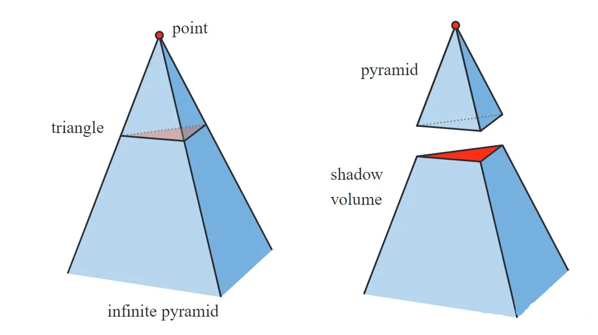

### 2. ZPass算法

Shadow Volume阴影的原理就是取一条从视点到目标点的线，每次进入Shadow Volume，Stencil模板计数加一，每次离开计数减一，这样计数为0的部分就是无阴影的地方，计数不为0的地方就是有阴影的地方。

Shadow Volume的实现需要两个Pass，第一个Pass是标记具有阴影的区域，第二个Pass是进行阴影渲染。

第一个Pass，从视点渲染Shadow Volume几何体，屏幕中被Shadow Volume覆盖的区域，就是所有可能产生阴影的位置。我们这里使用Stencil Buffer来标记出实际具有阴影的位置：开启Z-Test，设置Stencil模式为正面部分+1，背面部分-1。这样渲染完成后，Stencil Buffer为0的部分就是无阴影的地方，Stencil Buffer中不为0的部分就是有阴影的地方。

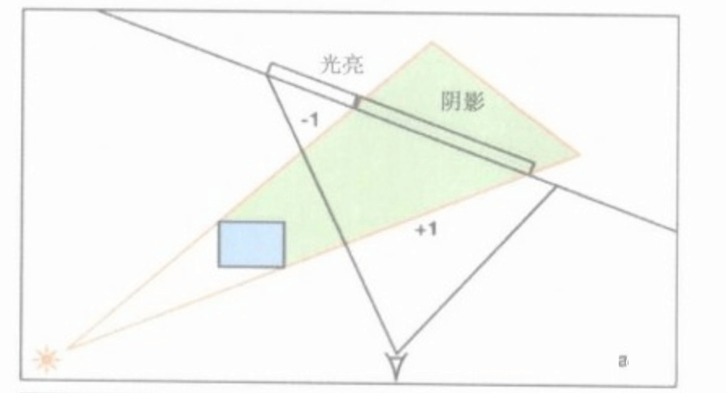

第二个Pass，同样也是渲染Shadow Volume的几何体，不过此时直接关闭深度测试，使用模板测试，直接在上一步中标记出的位置渲染出阴影。

### 3. Z-Fail算法

ZPass算法有个缺陷，当摄影机在Shadow Volume中的时候，就会产生错误的结果。

当摄影机位于Shadow Volume中时，ZPass标记阴影区域失效：

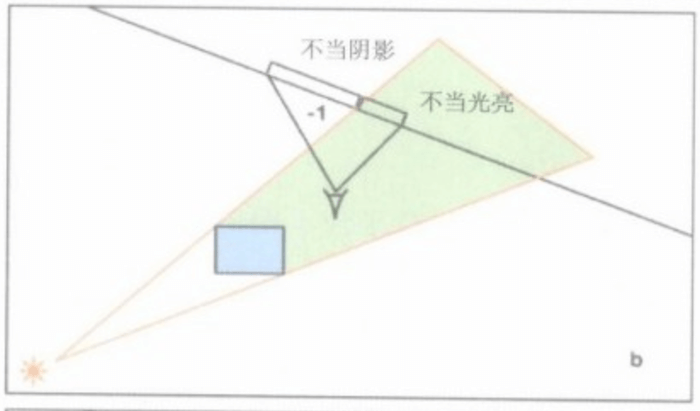

所以就有了Z-Fail的算法，Z-Fail算法和ZPass算法类似，只是改成从物体背面计数，在Z-Test fail的几何体部分，在进入Shdow Volume时计数-1，离开时计数+1，这样就可以规避这个缺陷。

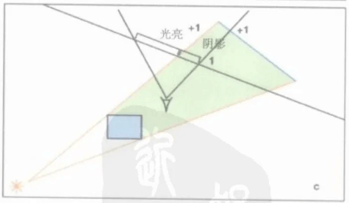

不过一般来说Z-Fail算法普遍要比ZPass算法慢，因为从背面渲染Shadow Volume，通常会覆盖更多的像素点。

因此在实践中，我们可以先做一个摄影机是否位于Shadow Volume中的判断，来决定使用ZPass或者是Z-Fail算法来进行标记阴影区域。

### 4. 生成阴影体的步骤

有一种最常见的生成Shadow Volume的方法，不过这种方法要求目标模型是封闭的多边形网格（没有空洞、裂隙、自相交）。

分为三部分：front capping 前盖-> back capping 后盖-> silhouette 轮廓拉伸成的侧面

front capping就是取模型中面向光源的三角面，方向判断可以通过判断面法线和光源方向的乘积的正负值来判断。

back capping就是取模型中背向光源的面，沿光源方向拉伸到无穷远处。

silhouette是判断两个临接面与光源方向不同的边，若认为是轮廓边，则将每条边扩展拉伸到无穷远处形成一个四边形面。

### 5. 在无穷远出的渲染

如何表示无穷远处的点？使用齐次坐标将w分量置为0，xyz表示方向即可。

如何避免图元在摄影机far clip plane外被裁剪掉?

一种方法是使用GL_DEPTH_CLAMP_NV扩展，将far plane外的点clamp到裁剪空间中。不过这个方法好像是只适用于OpenGL和NVIDIA显卡。

另外一种方法是稍微修改下摄影机的裁剪矩阵，将far plane设置为无穷远。

普通摄影机矩阵 (Standard Perspective Projection Matrix) ：

$$
\mathbf{P} = \begin{bmatrix} 
\frac{2 \times Near}{Right - Left} & 0 & \frac{Right + Left}{Right - Left} & 0 \\
0 & \frac{2 \times Near}{Top - Bottom} & \frac{Top + Bottom}{Top - Bottom} & 0 \\
0 & 0 & -\frac{Far + Near}{Far - Near} & -\frac{2 \times Far \times Near}{Far - Near} \\
0 & 0 & -1 & 0 
\end{bmatrix}
$$

远裁面在无穷远处处的摄影机矩阵 (Infinite Far Plane Projection Matrix)：

$$
\lim_{Far \to \infty} \mathbf{P} = \mathbf{P}_{\text{inf}} = \begin{bmatrix} 
\frac{2 \times Near}{Right - Left} & 0 & \frac{Right + Left}{Right - Left} & 0 \\
0 & \frac{2 \times Near}{Top - Bottom} & \frac{Top + Bottom}{Top - Bottom} & 0 \\
0 & 0 & -1 & -2 \times Near \\
0 & 0 & -1 & 0 
\end{bmatrix}
$$

当然精度或有微乎其微的减少。

### 6. 适用于非封闭模型的方法

把模型分成两部分，一部分是面向光源的面，一部分是背向光源的面，分别进行拉伸生成Shadow Volume，就可以支持非封闭模型。缺点是原来的轮廓边相当于生成了两次，造成性能浪费。

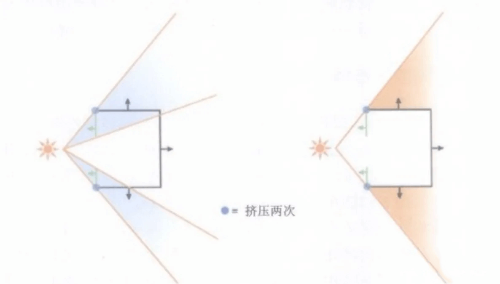

上图中，左边是面向光源面，右边是背向光源面，两个加在一起形成正确的结果。

### 7. 使用Geometry Shader生成Shadow Volume

使用GS可以将生成Shadow Volume的工作移交给GPU，不过必须用TRIANGLE_STRIP的方式来输入模型。

使用GL_TRINGLES_ADJACENCY_EXT模式来向GS中输入三角形图元，就可以获取三角形的邻接面，以此在GS中进行轮廓边判断、输出Shdow Volume等操作。

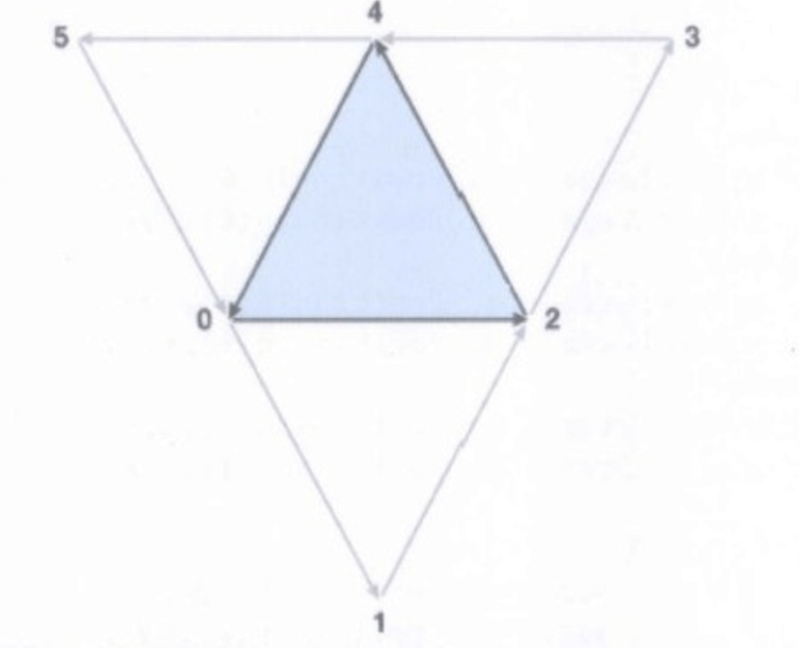

## Shadow Map——当前最主流的方式

### 1. shadowmap 的原理

当下应用最广泛最常见的方法，shadowmap 的使用，需要两个步骤。

假设我们现在要渲染带阴影的场景如下：

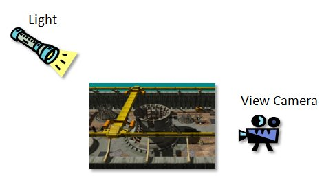

步骤1：从光源处出发，向光照的方向看去，来构造出光照空间。然后在光照空间，我们渲染需要产生阴影的物体，此时将深度写入到Z-Buffer中，得到保存最近处物体的深度值的Shdowmap。

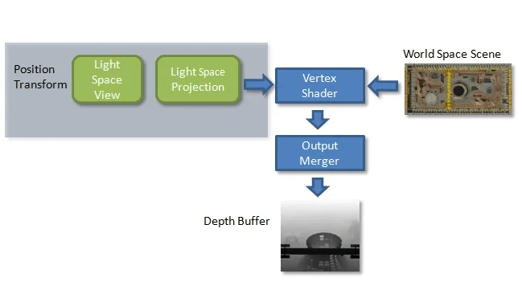

步骤2：然后我们再次正常渲染物体，在渲染时，我们根据渲染物体的世界坐标，变换到上一阶段的光照空间坐标，再计算出该点在Shadowmap中的深度值并进行比较，如果相对光源的距离比Shadowmap中的深度要大，就说明该点处在阴影中，否则就说明不在阴影中。

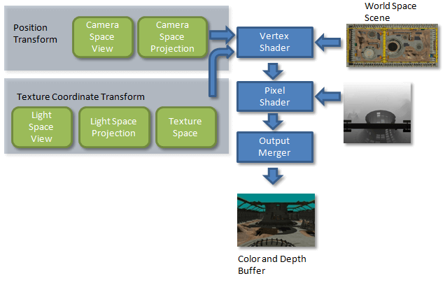

下图显示了整个Shadowmap工作的流程：

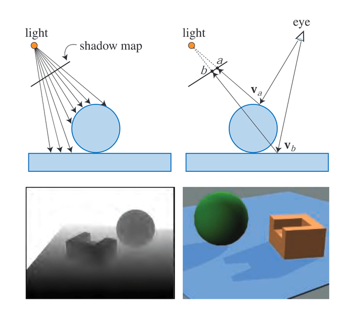

对于锥形光源，我们只需要沿着光照方向生成Shadowmap。对于类似太阳光的平行光源，我们就需要使用正交投影来进行计算深度，而且投影体的空间范围，需要包含我们的视锥空间。如果是点光源，就会更加复杂一点，为了能保存各个方向的深度值，我们一般需要使用Cubemap 。如果将一个物体进行六次渲染，每次渲染深度到每个面，那么渲染深度的开销就会比较大，因此我们一般会使用RenderTargetArray配合Gemotry Shader，一次性将一个物体的深度，同时写入到六个面上。

### 2. Light Space Frustrum的计算

Shadowmap的效果，一般会非常依赖于Shadowmap分辨率的大小和Z-Buffer的精度。因此我们要尽量提高Shadowmap的精度。

如果直接使用整个场景的AABB转化到Light Space，肯定是不行的，这样会造成很多不需要的阴影投射计算：

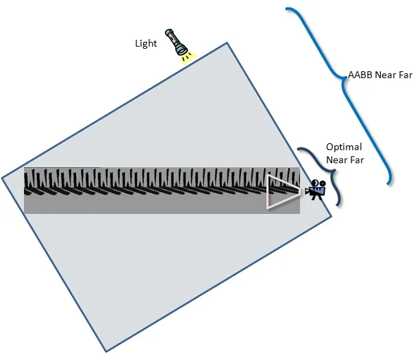

通常我们会使用下面的方式来计算Light Space Furstrum的边界大小。将世界空间视锥的八个顶点，变换到光照空间，算出在光照空间下，最远和最近的z值，并计算出AABB边界：

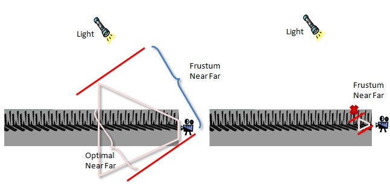

不过，这样也可能会造成另外一个问题，就是当摄影机的View Frustrum很小时，造成计算出来的Light Space Frustrum非常小，无法正确地投射所有需要投射阴影的物体。

因此我们还会根据整个场景的AABB空间，对得到的Light Space Frustrum进行扩展，使其能否覆盖到可能产生阴影的物体。当然，为了防止Light Space Frustrum的Near Plane 和Far Plane的值相差过大，我们还会在光照中设置一个最大阴影距离，当阴影投射物体，超出这个最大距离后，就不再投射阴影，来提高阴影的精度。

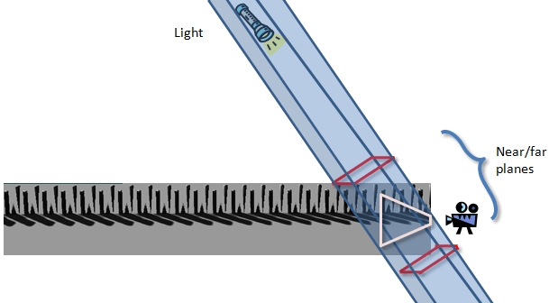

### 3. Shadow Bias处理自阴影走样

如下图所示，在进行阴影计算时出现了Self-shadow Aliasing/Shadow Acne，在计算自身的阴影时，因为在Shadowmap中存储的深度值，和物体自身的深度是相同的。因为在写入 Shadowmap时，我们计算的是Shadowmap像素中心点的深度值，这样在进行深度采样时，由于Shadowmap的精度限制，就会使比较的深度值产生误差，造成错误的渲染效果。

自阴影走样，右边是加了Bias的效果：

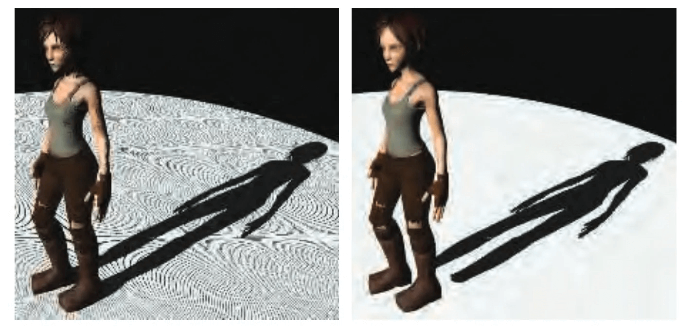

一种常见的解决自阴影误差的方式，是使用 **Bias Factor** ，对采样时的深度值，沿着光照的方向进行偏移。偏移的值可以是一个常量，这样计算起来比较方便，但是可能会在斜平面上继续产生误差，使用常量时叫做 **Constant Bias** 。

下图左边展示了Shadow Acne出现的原因，黑色的竖线代表Shadowmap中像素点的位置。左边是未添加Bias的情况，当我们在彩色的位置点进行比较深度时，其实采样到的深度是旁边的竖线处x标记位置的深度，可以看出，绿色点的深度测试是正确的，蓝色和橙色的深度测试是错误。下图中间是使用了Bias的情况，将深度值沿着光照方向进行偏移固定的距离。这样绿色和橙色的点形成了正确的深度值，但是由于偏移的值比较小，蓝色的点的阴影计算，仍然是错误的。

> 左：出现Shadow Acne的原因；
> 中：使用Constant Bias；
> 右：使用Slope Scale Bias

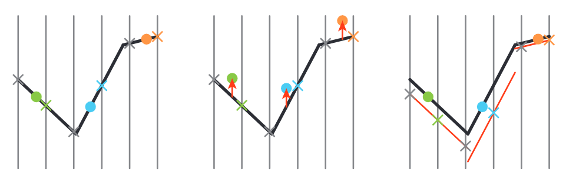

我们发现，在斜面角度较大时，一个固定的偏移值就不再适用了，因此一个常见的改进，就是根据斜面角度来改变偏移值，叫做 **Slope Scaled Depth Bias / Slope Bias** 。如上图右边所示，可以看出所有的点的阴影计算结果都是正确的。

设平面法线和光照方向的夹角为θ，视锥大小为frustrumSize，Shadowmap的大小为
shadowmapSize，考虑到我们需要半像素的偏移，这样我们可以计算出需要的Slop Bias的偏移值为：

$$
\frac{frustrumSize \star \tan(\theta)}{shadowmapSize \star 2}
$$

不过我们可以注意到，这个偏移值是和tan(θ)成正比的，这样的话，当θ趋近于90度时，偏移值是趋近于无穷大的，因此我们需要为偏移值设置一个最大值。

在实际游戏引擎实践中，我们常常需要结合两种Bias来使用，这样来达到较好的效果。

这两种Bias都可以通过图形API硬件来实现。例如在DX11中，我们可以在OutputMerge阶段中，通过参数指定两种Bias的值[[1]](https://learn.microsoft.com/en-us/windows/win32/direct3d11/d3d10-graphics-programming-guide-output-merger-stage-depth-bias)：**DepthBias**和 **SlopeScaledDepthBias** ，这样总的Bias计算方式为：

```glsl
Bias = (float)DepthBias * r + SlopeScaledDepthBias * MaxDepthSlope;
```

我们还可以设置DepthBiasClamp的值，防止计算出的Bias值过大：

```glsl
Bias = min(DepthBiasClamp, Bias)
```

另外一种常用的替代Slope Scaled Depth Bias的方案是 **Normal Offset Bias** ，将阴影的计算位置沿着物体表面的法线偏移，通过计算我们可以算出需要偏移的距离为：

$$
\frac{frustrumSize \star \sin(\theta)}{shadowmapSize \star 2}
$$

相对于Slope Scaled Depth Bias，这种方式的一个优点是不用担心θ趋近于90度时，整个偏移值趋近于无穷大。

UE4中，使用的 **Constant Bias + Slope Scaled Depth Bias** ：

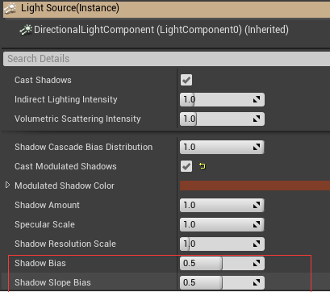

Unity中，使用的是 **Constant Bias + Normal Offset Bias** ：

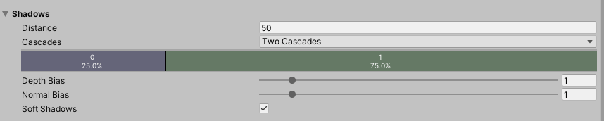

当然，我们的Bias值也不能设置得过大，否则会出现漏光等问题，也叫做 **Peter Panning** 。

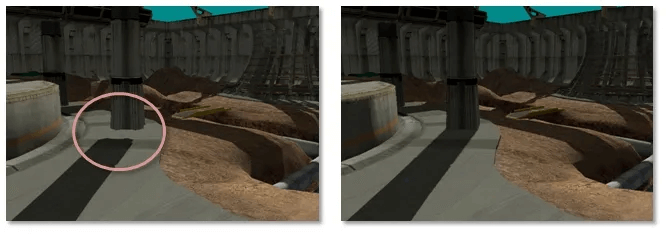

为了保证这种Bias的方式能正确地解决深度冲突。我们应尽量保证物体几何模型是正确的，保证正反面朝向是对的，尽量保证模型封闭，且避免使用太薄的物体模型。

添加Bias可以是在生成Shadowmap阶段完成，也可以在阴影计算阶段，也就是生成Shadowmap时。在Vertex Shader中通过反向添加Bias的方式来偏移计算处的Shadowmap深度值，这样可以节省一些运行开销，且可以简化阴影的计算，这样在采样阴影时，就无需考虑计算偏移的问题。

大部分情况下二者得到的效果是基本接近的，不过在Shadowmap生成阶段添加偏移这种方式也有一些瑕疵：

1. 不够灵活，所有点的偏移值完全相同，意味着无法根据情况灵活调整Bias值，比如在PCF采样软阴影时，只能提前给出比较大的Bias值，而无法根据PCF Radius的大小灵活调整；
2. 和Normal Offset Bias，在光照角度比较小的时候，会导致渲染结果错误[[2]](https://zhuanlan.zhihu.com/p/370951892)，Unity中的阴影就有这样的缺陷。
   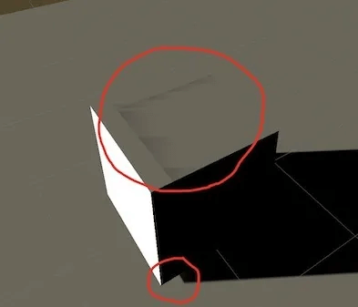

还有一种比较少见的解决自阴影的方式，是将物体背面的深度写入到Shadowmap，进行深度测试时，就不会出现深度冲突。但是这种方式有很大限制，要求使用的模型必须是正确封闭的，且正反面没有错误。而且如果物体模型很薄，导致前面和背面深度几乎相等，这种方式仍然会失效。因此这种方式不太通用，现在已经很少能见到。

### 4. 移动平台的Pack

某些旧的移动平台不支持浮点数纹理，这时需要我们将Shadowmap的深度值Pack到RGBA贴图中，Pack和UnPack的公式如下：

```glsl
//Pack:
vec4 comp = fract(depth * vec4(255.0 * 255.0 * 255.0, 255.0 * 255.0, 255.0, 1.0));
comp -= comp.xxyz * vec4(0.0, 1.0 / 255.0, 1.0 / 255.0, 1.0 / 255.0);
//UnPack:
float depth = dot(texture((m_tex), (m_uv)), vec4(1.0 / (255.0 * 255.0 * 255.0), 1.0 / (255.0 * 255.0), 1.0 / 255.0, 1.0))
```

这里我们使用的是255作为模来使用，网上也能搜索到使用256作为模的版本。

但是测试结果表明，使用256时精度是不如255的[[3]](https://aras-p.info/blog/2009/07/30/encoding-floats-to-rgba-the-final/)，而且还会遇到不同硬件表现不一致的问题，因此强烈建议使用255 作为参数。

### 5. Spot Light Shadow， Perspective Correct

在写入到 Shdowmap 时，对于一个平行光，我们使用的是正交投影矩阵。而对于一个聚光或者点光源，我们使用的是透视投影矩阵。

Spot Light Shadowmap 的特殊处理，使用线性深度。

### 6. Point Light Shadow

Geometry Shader 的应用,

SV_LAYER 作为REnderTarget

不需要 perspective correct

### 7. 基于 Shadowmap 的透射阴影

实现如 SSS 效果等

## Shaowmap精度提升

由于Shdowmap的精度限制，我们在渲染中会遇到各种各样的渲染问题。

一种叫做Perspective Aliasing，由于shadowmap是在lightsapce中进行计算的，所以在 view frustrum 近处观察时，每个像素对应shaodowmap 中 texel 的比例就会降低，产生锯齿。

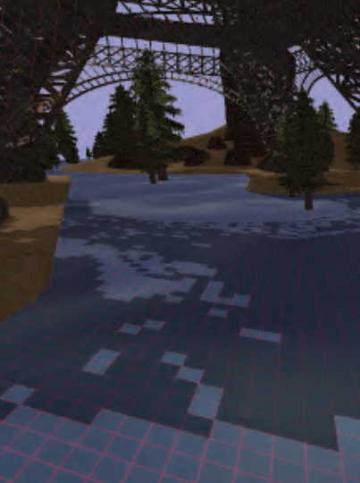

另外这一种叫做 projective aliasing，是在斜面上进行渲染时，shadowmap 精度不足产生的，本质上来说和Perspective Aliasing是相同的。

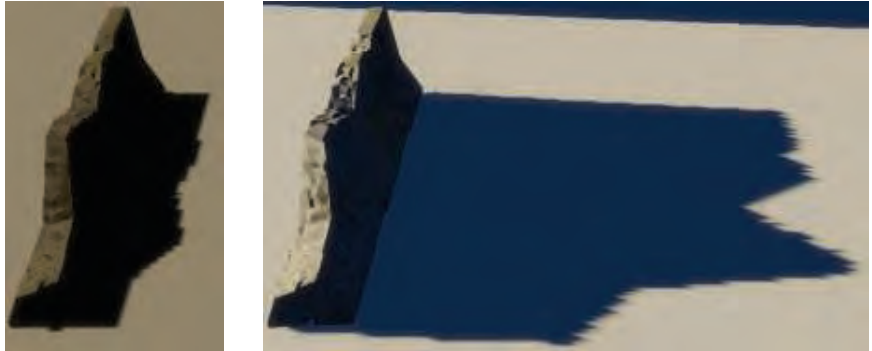

通常，提升Shadowmap的分辨率可以改善上面两种渲染问题。但是处于性能考虑，我们不会把Shadowmap的分辨率设置的太大，而是使用一些手段，来提高渲染结果的精度。

### 1. 使用Perspective Warping

这类方法，通过修改光照空间的投影矩阵，来为视锥近处的物体阴影，提供更高的精度。

常见的有这样几种方式，Perspective Shadow Maps（PSM），Light Space Perspective Shadow Maps（LiSPSM）和Trapezoidal Shadow Maps (TSM)。这些修改投影矩阵的方式原理上大致都是相通的，如下图所示，显示了这类方式的原理：

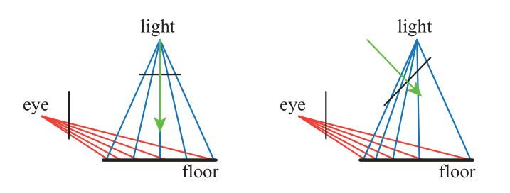

改变计算Shadwomap时的投影方向，就可以为近处提供更高的精度。

这类方式虽然使用起来简单，但是有很多无法处理的特殊情况，比如观察方向和光照方向完全相同时，这类方式就完全无法发挥作用。而且在摄影机移动时，这种方式非常的不稳定。

这类方式目前已经被彻底淘汰，这里也就不再深入讲解相关的原理和实现。

### 2. Cascaded Shadow Maps（CSM）

CSM是目前最常见的提高Shadowmap精度的手段，候也叫做Parallel-Split Shadow Maps。

通常在渲染视角附近的物体时需要更高的Shadowmap精度，而直接生成的Shadowmap往往不符合这个条件，所以将Frustum分割成数个部分，每个部分单独生成一张Shadowmap，最后组合成一张Atlas。

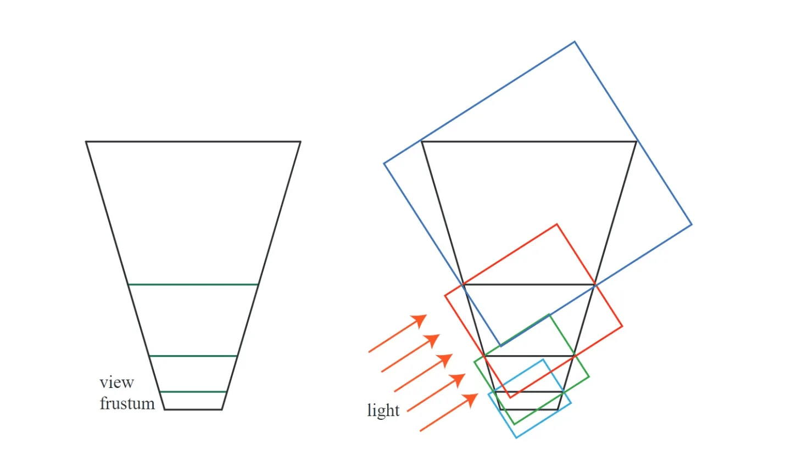

从理论上来说，使用指数分布的CSM划分方案是最佳的，即满足

$$
r = \sqrt[n]{\frac{f}{n}}
$$

f、n是相机的far、near值，n是指数系数。

比如我们取n=3，f=1000。 这样我们划分出来的三级CSM就是：1-10，10-100， 100-1000。

但是如果我们这样来划分，最近处1-10这个范围的一个CSM划分，物体太少，反而会导致Shadowmap空间的浪费。因此在实践中，常常会结合指数划分和其他划分手段来使用，或者直接由用户手动设置相应的比例值。

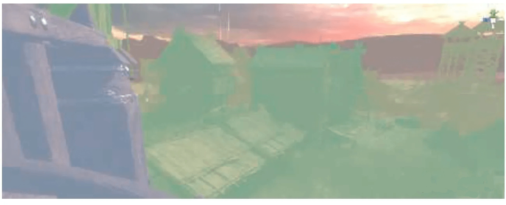

### 3. Stablize CSM

在使用Shadowmap时，在移动摄影机时，我们经常会遇到阴影闪烁的问题。因为当摄影机移动后，摄影机的View Frustrum会发生改变，同时Light Space的Frustrum会相应改变，就会造成两帧直接的阴影位置不一样，产生闪烁，在没有使用PCF过滤阴影时，会尤其明显。下图显示了这种闪烁的示例，可以看出视角的微小变化，导致阴影产生了剧烈的闪烁：

<iframe width="100%" height="468" src="https://uwa-ducument-img.oss-cn-beijing.aliyuncs.com/Blog/USparkle_DynamicShadows/40.mp4" scrolling="no" border="0" frameborder="no" framespacing="0" allowfullscreen="true"> </iframe>

通常我们会使用Stabilize Cascades来解决这个问题，Stabilize Cascades将相机的移动分成两个部分来处理，分别是相机的旋转和平移。无论相机是如何运动的，都可以分解成沿着视锥中心的旋转和平移。

首先来看绕视锥中心的旋转，当视锥旋转时，因为视锥边界的改变，就会导致计算出来阴影的Light Space Frustrum改变，产生不稳定的结果。要解决这个问题，我们将视锥 Frustrum计算出一个球形的Bounding Volume出来，并用这个球形的Bounding Volume 来算出阴影的Light Space Frustrum，这样当我们的视锥沿着球体中心旋转时，得到的球形Bounding Volume是不变的，算出来的阴影的Light Space Frustrum自然也不会变化。

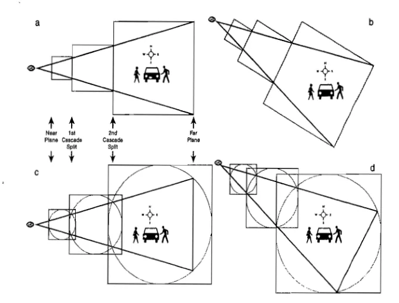

ab展示的传统的Light Space Frustrum计算过程，cd使用球形BV时的计算过程，在摄影机转动时也是稳定的。

从Frustrum生成Bounding Box Sphere，可以使用简单方法求出中心点，算最大半径的方式。也可以使用能得到更加紧凑边界的标准算法。

接下来就是处理摄影机平移的部分了，这一步的处理，就是通过偏移投影矩阵，来保证两帧之间，世界空间中的同一点，能投影到Shaodwmap中的相同相对像素位置上。为了计算方便，我们常常取世界空间中的零点，作为参考点，将世界空间的零点，变换到Shadowmap坐标中，并通过偏移，确保得到的Shadowmap坐标是对齐于某个像素的。对齐过程实现的大致代码如下：

```glsl
            // Create the rounding matrix, by projecting the world-space origin and determining
            // the fractional offset in texel space
            XMMATRIX shadowMatrix = shadowCamera.ViewProjectionMatrix().ToSIMD();
// 使用零点作为参考点
            XMVECTOR shadowOrigin = XMVectorSet(0.0f, 0.0f, 0.0f, 1.0f);
// 将参考点变换到 shadowmap的坐标
            shadowOrigin = XMVector4Transform(shadowOrigin, shadowMatrix);
            shadowOrigin = XMVectorScale(shadowOrigin, sMapSize / 2.0f);
// 在shadowmap坐标系中，将坐标对齐到整数坐标线上
            XMVECTOR roundedOrigin = XMVectorRound(shadowOrigin);
            XMVECTOR roundOffset = XMVectorSubtract(roundedOrigin, shadowOrigin);
            roundOffset = XMVectorScale(roundOffset, 2.0f / sMapSize);
            roundOffset = XMVectorSetZ(roundOffset, 0.0f);
            roundOffset = XMVectorSetW(roundOffset, 0.0f);
//应用偏移，得到新的 projection 矩阵
            XMMATRIX shadowProj = shadowCamera.ProjectionMatrix().ToSIMD();
            shadowProj.r[3] = XMVectorAdd(shadowProj.r[3], roundOffset);
            shadowCamera.SetProjection(shadowProj);
```

在大部分游戏引擎中，Stablize CSM都是默认打开的。不过需要注意的一点是，打开Stablize CSM时，因为阴影的有效范围减少了，所以是会导致阴影精度降低的。在可以保证阴影效果足够软而不会产生闪烁的时候，也可以选择关闭这个功能，来提升阴影的精度。

**4. CSM Caching**
在使用CSM时，我们常常会遇到CSM开销较大的问题，比如现在使用四级CSM级联，就意味着在生成Shaodwmap时，很多物体需要重复绘制四次。因此有的时候我们会对CSM进行一些优化。

一种方式是降低远处CSM的更新频率。比如在原神的PC版中，共有八级的CSM，前四级是每帧都更新的，后四级是逐帧依次更新的，这样相当于每帧需要更新五级的CSM。

另外一种方式是将CSM中算出的阴影动态缓存，对于静态物体的Shadowmap，是可以实现前后两帧之间的复用的。上一帧中静态物体的Shadowmap，经过一些小小的处理，在当前帧仍然是可用的，对于一些没有覆盖的区域，可以动态来检测，重新绘制生成：

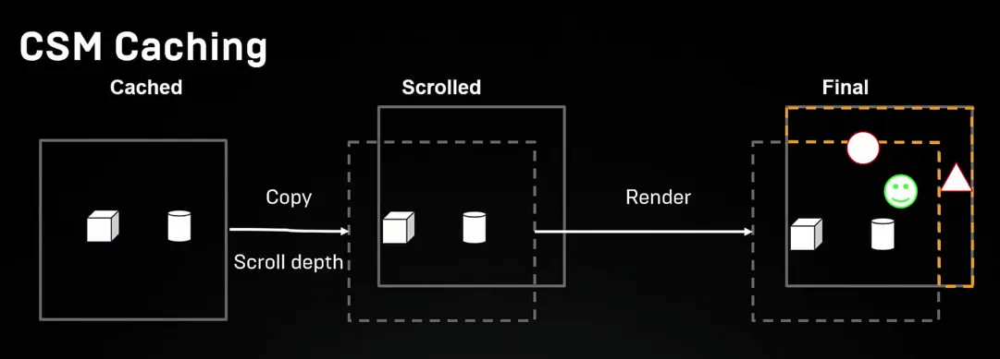

### 5. Virtual Shadow Map： 未来的发展方向

随着 Virtual Texture 技术在游戏引擎中的逐步推广，Virtual Shadow Map 也开始进入大众的视野之中。

UE5 中推出了 Virtual Shadow Map 的功能。理念类似Nanite的流加载。

## 基于 Shadowmap 实现软阴影

### **1. Percentage-Closer Filtering (PCF)**

采样shadowmap 时，我们往往这样来实现一些软阴影的效果：在目标采样点周围，进行四次采样，然后取平均值，作为最终结果。注意这里的取平均值，并不是取平均值后进行比较，而是对四个采样点，分别进行深度测试，然后每个采样点的0或1的结果值进行平均，这样在半影区域就能得到软阴影效果。

这种将采样结果进行平均的方式叫做 Percentage-Closer Filtering (PCF) ，PCF通过将目标点附近的采样结果平均，来模拟出半影的效果。

现在的硬件都直接提供周围四点采样的加权PCF深度测试，比如OpenGL中的sampler2DShadow，DirectX中的 SampleCmp。这种采样的加权方式类似于普通像素采样时的双线性采样，在目标位置附近2X2像素中，逐像素进行深度比较，得到结果值0或1，然后将结果按照相对周围像素位置进行加权平均。

直接使用硬件PCF，只能采样到2X2的像素点，得到的半影过渡，往往不够柔和。如果想要更加柔和的阴影过渡，或者把半影区域扩大，就需要将采样点分布范围扩大，也需要增加采样点的个数。

简单的方式，是直接在目标点周围按照 Grid 模式进行采样，但是这样往往会在半影中看到分层的瑕疵。

因此我们更加常用的方式，是使用预计算好的 Possion 分布的采样点，来进行采样。为了使结果进一步平滑，我们还可以使用逐像素的噪声值，对采样点位置进行旋转，这样每两个相邻的像素点，采样的模式都是不同的，可以有效地平滑半影区域。

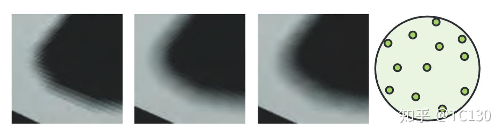

从左到右是 4*4 Grid采样，12点Possion采样，12点Possion采样 + 旋转，Possion分布图

### 2. PCF软阴影的bias问题

在前面我们已经讲过 bias 的问题，在PCF采样中，因为PCF采样 shadowmap 的范围会比较大，因此会进一步暴露出 shadow acane 的问题。当然我们也有响应的手段来解决这些问题。

一种简单的方式，是根据PCF filter kernel 的大小，来动态改变 shadow bias 的大小，当然这样做的缺点也很明显，就是 PCF kernel 越大，就会损失越多的阴影精度信息。

另外一种方式是  **bias cone** ，根据当前采样点到采样中心的位置，来缩放bias的大小，如下图左边所示。是一种相对简单有效的缓解 bias 问题的方案。

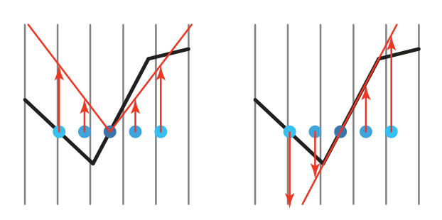

上图右边显示的一种逐采样点来做精确bias的算法， **Receiver Plane Depth Bias，** 这种方式需要假定接受阴影的是一个平面，然后会根据每个阴影采样点到中心的位置，来计算偏移。一般能产生非常好的结果。

### **3. Percentage-Closer Soft Shadows (PCSS)**

PCF阴影的一个缺点，就是半影的宽度非常固定，无论产生阴影的位置距离光照有多远，半影的宽度都是一样的。

PCSS通过判断半影到遮挡物和半影到光源的距离，来动态确定半影的宽度。半影宽度越大，采样阴影的模式分布也越大，就能得到越柔和的阴影。这样就能得到如下图右边所示的，随距离变化的阴影效果。

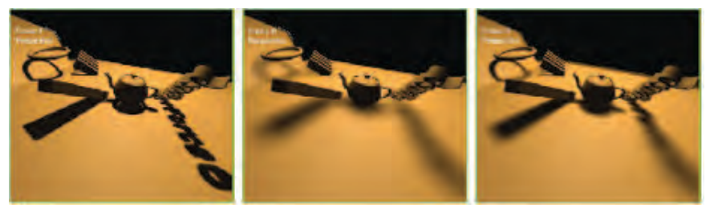

左：PCF硬阴影，中：PCF软阴影，右：PCSS阴影

PCSS算法分成这样几个步骤：

1. 计算出区域内平均 blocker 深度；
2. 根据 blocker 深度，计算出需要的半影宽度；
3. 用半影宽度，作为 PCF kernal 的大小，计算出阴影。

PCSS的计算其实很简单，就是根据三角形相似，来计算出采样所需的分布距离，然后将距离内的采样值进行平均。

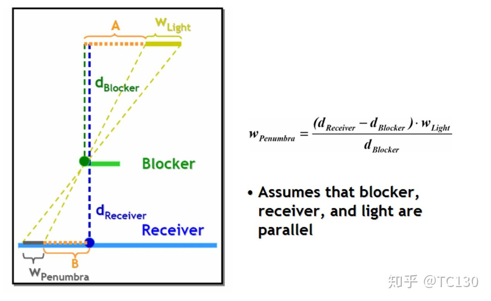

不过当半影宽度非常大时，就需要非常多的采样点，这样采样shadowmap的开销也会变大。因此PCSS是一种不太稳定的软阴影方案，在游戏中的实际应用并不是特别多。

### 4. Manual PCF 计算

## 基于shadowmap 的逐物体阴影/Per Obejct Shadow

### 1. PerObject Shadow的实现

这里，我们来小结一下逐物体阴影的常用应用场景。

1. Stationary模式的光照，烘焙静态物体的阴影；
2. 高精度角色阴影，和场景阴影分离；
3. 超出CSM阴影范围的物体，单独处理阴影；
4. 移动端廉价的 modulated shadow 实现（后面会讲到）。

### 2. 使用 Shadowmask 混合多种 Shadow

由于阴影技术非常繁多且复杂，我们的阴影可能来自于如下技术的一种或者几种：

* CSM Shadow
* Per Object Shdow
* Capsule Shadow
* 烘焙阴影

如果同时在 Shader 中多个 PerObject 阴影。如果在一个pass中同时判断多个阴影，那么处理起来会非常麻烦，切回产生大量的 shader 变体。

一种通用的解决方案，是将阴影预先绘制到 shadowmask上。绘制到 shadowmap 时，可以使用相同的通道，分别使用不同的方式写入 shadow 值，混合方式选择取最小。

### 3. Modulated shadow的实现

前面我们讲到的平面阴影，只能投射阴影到平面上，在使用shadowmap保存深度后，就可以将阴影投射到任意的曲面上，具体放方法如下：

首先我们得到需要渲染阴影物体的AABB，然后将AABB转换到 lightsapce，得到新的 orthogonal light space ABB。然后我们将物体的深度渲染到一张 shadowmap 中。

我们将 lightspace 的 AABB 沿着 光照方向进行延长，就得到了一个 shadow volume。

接下来我们就可以使用这个 shadow volume 来得到投射阴影了。将 shadow volume作为几何体进行渲染，在shader中读取当前位置的 depth 值，反算出世界坐标，在通过投影矩阵算出光照空间下的深度值，在 shadowmap中进行采样，得到阴影。将最终输出结果的混合方式为 DstColor Zero，这样，被遮挡区域有阴影的位置，颜色都这样乘以一个阴影系数，得到一个染色的效果，也就实现了 modulated shadow。

注意，为了防止在不需要阴影的区域渲染出阴影，我们需要在代码中进行clip，如果计算出shadowmap中对应的uv坐标超出0~1的范围，就不再渲染阴影。在Unity中实现的 shader 代码大致如下：

```glsl
                float4 frag (v2f i) : SV_Target
		{
			float2 uv = i.vertex.xy * (_ScreenParams.zw - 1);
			float depth = tex2D(_CameraDepthTexture, uv).r;
	
#if !UNITY_REVERSED_Z
			depth = depth * 2 - 1;
#endif

#if UNITY_REVERSED_Z
			uv.y = 1 - uv.y;
#endif
			float4 clipPos = float4(2.0f * uv - 1.0f, depth, 1.0);//
//反算出世界空间坐标
			float4 worldSpacePos = mul(UNITY_MATRIX_I_VP, clipPos);
			worldSpacePos /= worldSpacePos.w;//
//得到shadowmap中uv坐标
			float4 projectorPos = mul(_WorldToProjector, worldSpacePos);
	
#if UNITY_REVERSED_Z
			projectorPos.z = clamp(projectorPos.z, 0.0001, 1);
#else
			projectorPos.z = clamp(projectorPos.z, 0, 0.9999);
#endif
// uv不在0~1范围内，不需要阴影
			clip(projectorPos.xy);
			clip(1 - projectorPos.xy);
			projectorPos.xy = projectorPos.xy * _ShadowmapTex_ST.xy + _ShadowmapTex_ST.zw;
			float shadow = SAMPLE_TEXTURE2D_SHADOW(_H3D_GroundShadowmapTex, sampler_H3D_GroundShadowmapTex, projectorPos.xyz).r;
			return shadow;
		}
```

Modulated shadow 有这样两个明显的缺点：1，无法完全正确还原阴影效果，因为 modulated shadow 是通过将原色乘以某个系数来实现的阴影，而非遮蔽光照形成阴影，因此效果会有误差。而且多个modulated shaodw 会多次叠加在一起。2，在特定的观察角度下，modulated shadow 可能会穿过被投射阴影的物体。

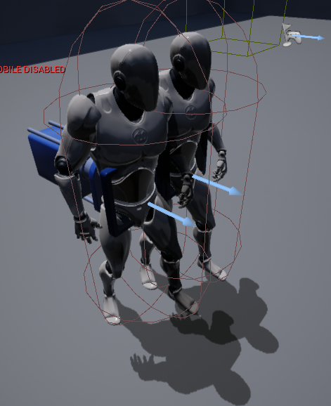

UE4中Modualted shaow的效果，可以看到两个人物的阴影出现错误的叠加。

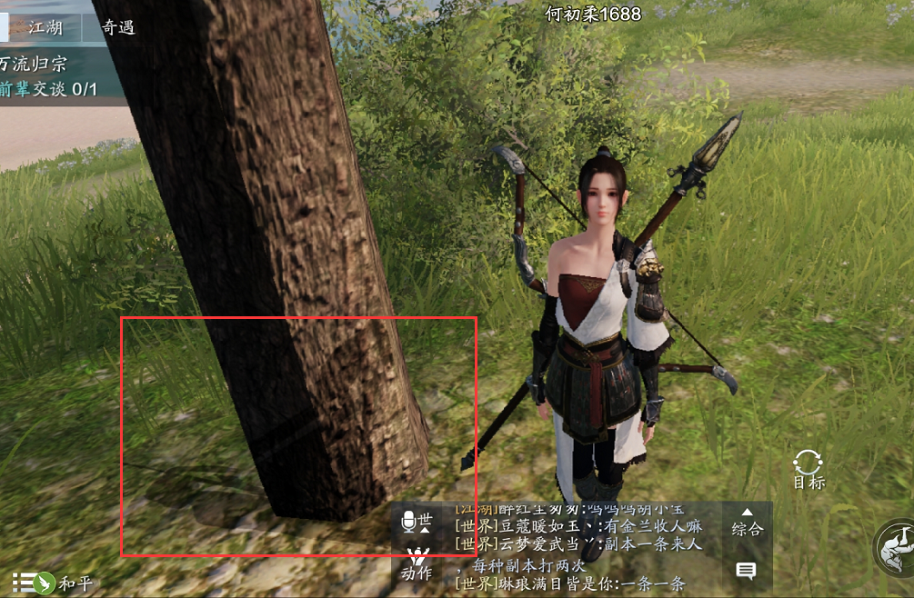

天涯明月刀手游中的modualted shadow，错误地穿过了树干

在游戏实践中，最常用到 modulated shadow的地方，就是将人物投影在地面上。我们知道，modulated shadow 的效果是有偏差的，特别在人物身上这种非常高频的区域，就会非常明显。因此我们通常会使用模板的方式，将人物身上的modulated shadow剔除掉，只显示在地面上。对于人物身上的自阴影，我们会按照正常的shaodwmap 来渲染。

这样一来，我们为人物单独生成一张 shadowmap，会同时在两个地方用到，一是用于产生人物身上的自阴影，二是用于地面投射的modulated shadow。这也是手机游戏中常用的一种处理人物角色阴影的方案。

比如在天涯明月刀手游中，就是使用这样的实现方式。如下图所示，左边是 shadowmap，右边是渲染的结果，shaowmap 同时用来实现人物身上的自阴影和地面上的 modualted shadow。

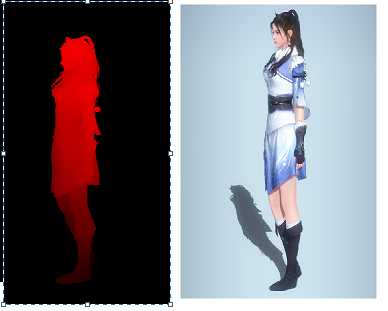

左边是仅针对人物生成的shadowmap、同时用于人物的自阴影，和地面的投影

## 基于ZBuffer的 Filterable Shadowmap

前面介绍的是使用 PCF 来得到软阴影，在每次计算阴影时，需要进行很多次的采样和计算，如果想要更加柔和的阴影过渡，就只能通过增加采样次数来实现。在这里，我们将介绍下一些可以预过滤的阴影技术，这些技术可以将得到的 shadowmap 进行模糊预处理，来得到软阴影，这样可以降低计算软阴影的开销。

### 1. Variance Shadow Map(VSM)

VSM 使用两张 shadowmap，分别存储深度值和深度值的平方，具体原理如下：

已知切比雪夫不等式为：

$$
P(x \geq t) \leq \frac{\sigma^2}{\sigma^2 + (t - E(x))^2}
$$

这样，我们使用两张 shadowmap 分别存储深度值和深度值的平方。这样，将两张 shadowmap 进行 filter 处理（使用 mipmap 或者双 pass 高斯模糊），就可以直接得到 $E(x)$ 和 $E(x^2)$，已知方差 $\sigma^2 = E(x^2) - E(x)^2$，这样，我们可以直接将得到的 $P(x)$ 值作为阴影系数值来使用，方便地得到软阴影。

当然，从上面的切比雪夫不等式我们可以看出，这里的 $P(x)$，其实只是一个概率值的上界，我们这里是直接使用这个上界作为最终的阴影系数来使用了。

下面，我们就来证明下，在简单的光照环境下，这种直接使用上界得到的阴影系数是合理的：

现在有一个深度值为 $d_1$ 的平面，投射阴影到深度值为 $d_2$ 的平面上。现在我们在采样阴影时进行 filter，设 $p$ 为未被遮挡的比例，也就是我们期望得到的阴影系数值，由此我们可以得到：

$$
\mu = E(x) = pd_2 + (1 - p)d_1
$$

$$
E(x^2) = pd_2^2 + (1 - p)d_1^2
$$

$$
\sigma^2 = pd_2^2 + (1 - p)d_1^2 - (pd_2 + (1 - p)d_1)^2
$$

$$
= (p - p^2)(d_2 - d_1)^2
$$

我们从切比雪夫不等式中得到的概率上界为：

$$
\begin{aligned}
p_{max}(d_2) &= \frac{\sigma^2}{\sigma^2 + (\mu - d_2)^2} \\
&= \frac{(p - p^2)(d_2 - d_1)^2}{(p - p^2)(d_2 - d_1)^2 + (pd_2 + (1 - p)d_1 - d_2)^2} \\
&= \frac{(p - p^2)(d_2 - d_1)^2}{(p - p^2)(d_2 - d_1)^2 + (1 - p)^2(d_2 - d_1)^2} \\
&= \frac{p - p^2}{1 - p} \\
&= p
\end{aligned}
$$

和我们的期望值是相等的，证明我们这样来使用切比雪夫不等式的概率上界是正确的。

这样，我们就可以通过对 shadowmap 进行预处理，来得到软阴影。

我们的实现过程大致如下：

1、在光照空间下，将深度值和深度值的平方分别存储到两张 flaot 格式的shadowmap中；

2、将两张shadowmap进行mipmap处理，或者使用双pass高斯模糊；

3、在渲染时进行阴影计算，如果当前像素点的深度值小于平均深度  ，说明该点没有被阴影遮挡。如果深度值大于平均深度，就是用前面的公式来计算阴影系数。

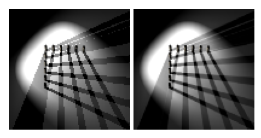

左：直接进行VSM计算；右：先进行mipmap处理，再计算VSM

在一些复杂光照环境下，VSM可能会出现一些瑕疵。

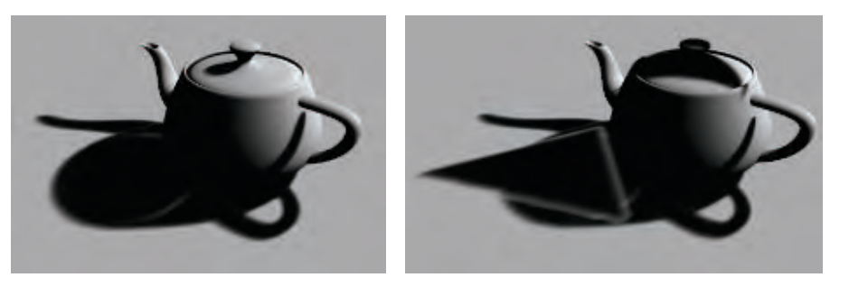

左边是正常的VSM计算，在右边，添加了一个三角形后，造成了明显的漏光

### 2. Exponential Shadow Map ESM

ESM 也是一种类似 VSM 的 Filtered Shadow Map。在空间中有一点 $x$，设 $d(x)$ 为 $x$ 到光源的距离，$z(p)$ 表示当前方向上最近的遮挡物的距离，这样我们得到阴影函数为：

$$
s(d, z) = \begin{cases} 0 & d > z \\ 1 & d \leq z \end{cases}
$$

$s(x)$ 得到的结果是 0 或者 1，表示当前的点是否被阴影遮挡。

现在，我们使用指数函数来代替函数 $f$，我们这样来定义这样一个指数的函数，来代替原来的 0 或 1 的大小判断：

$$
f(d, z) = e^{-c(d-z)} = e^{-cd}e^{cz}
$$

从下图中我们可以看出，当 $d - z > 0$ 时，新的函数 $f$ 和原来的阴影判断函数 $s$ 是非常接近的，且 $c$ 的值越大，就越接近。

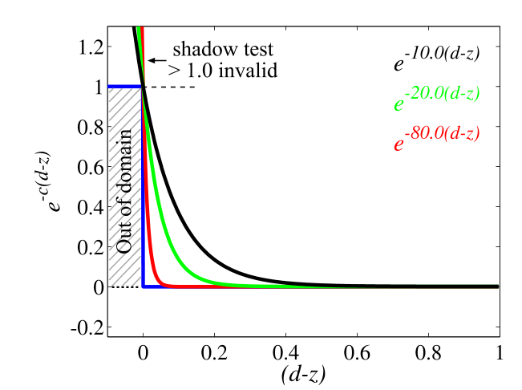

在使用原始的阴影函数计算软阴影时，得到的过滤后的结果为：

$$
s'(d, z) = \sum_{i}^{N} ws(d, z_i), w = \frac{1}{N}
$$

这也是我们熟悉的 PCF 计算软阴影的方式。现在，我们使用指数函数来代替上述的计算过程：

$$
\begin{aligned}
f'(d, z) &= \sum_{i}^{N} wf(d, z_i) \\
&= \sum_{i}^{N} we^{-cd} e^{cz_i} \\
&= e^{-cd} \sum_{i}^{N} we^{cz_i}
\end{aligned}
$$

观察最后这个公式，我们发现左边的部分是可以直接在计算阴影时求得，右边的部分，其实是可以通过预过滤的方式计算出来。也就是说，我们生成的 shadowmap 中存储 $e^{cz_i}$ 的值，然后对 shadowmap 进行 filter 处理，就可以得到右边 $\sum_{i}^{N} we^{cz_i}$ 的部分。

从前面的图像中我们知道，$c$ 的值越大，指数函数的图形就和真实的阴影判断越接近。不过在实际计算时，由于精度的限制，我们不能把 $c$ 的值设置得过大，通常选择一个合适的值即可。

一个针对 ESM 的改进，是对深度值的编码做出一些改进，将结果保存在 log 空间中，这样可以使用更大的 $c$ 值，得到的结果精度自然也会更高：

$$
\begin{aligned}
\ln(\sum_{i=0}^{N} w_i e^{cz_i}) &= \ln[\sum_{i=0}^{N} w_i e^{cz_i}] \\
&= \ln[\sum_{i=0}^{N} w_i e^{c(z_0 + (z_i - z_0))}] \\
&= \ln[e^{cz_0} \sum_{i=0}^{N} w_i e^{c(z_i - z_0)}] \\
&= cz_0 + \ln[w_0 + \sum_{i=1}^{N} w_i e^{c(z_i - z_0)}]
\end{aligned}
$$


### 3. Exponential Variance Shadow Map EVSM

EVSM是一种对VSM的改进，人们发现，在使用VSM的时候，可以将深度使用一个 wrap 函数进行处理，然后直接对 wrap 后的结果进行VSM中同样的计算处理，可以得到更好的阴影结果。

借鉴ESM中的做法，这个 wrap函数就是 $e^{cx}$ 。在实践中，会使用 $-e^{cx}$ 再求出一个 wrap 值，然后取两个结果的最小值。

因此这种方法叫做EVSM，结合了ESM和VSM的优点，缺点就是使用的Buffer存储较多，需要4通道。

### 4 . Moment Shadow Map MSM

moment意思是矩，表示变量的分布特征，比如一阶矩就是平均值，二阶矩就是方差。

### 5 . Filterable Shaodwmap的小结

各个方案的概览如下，一般来说，使用的通道数越多，效果也越好。

| 方案 | 使用通道数 | 保存的参数                                       |
| ---- | ---------- | ------------------------------------------------ |
| VSM  | 2          | $d$,$d\star d$                               |
| ESM  | 1          | $e^{c\star d}$                                 |
| EVSM | 4          | $e^{cd}$,$e^{2cd}$,$-e^{-cd}$,$e^{-2cd}$ |
| MSM  | 4          | $d$,$d\star d$,$d^3$,$d^4$               |

一个网络上的不同shadowmap技术的示例。

相对于普通的PCF阴影，Filterable Shadowmap 拥有一些模糊阶段的固定开销。在采样非常软的阴影的时候，相对普通的PCF是有性能优势的。但是在硬阴影下，性能反而会下降。

除此之外，Filterable Sadowmap 要产生类似类似PCSS的可变柔和度的阴影，实现起来要复杂很多。

而且 Filterable Shaodmap还有考虑硬件兼容，数值溢出，以及一些漏光等边界条件。因此个人不是非常推荐使用 Filterable Shadowmap 来代替普通的PCF阴影，特别是在移动平台上。不过在使用静态烘焙阴影时，因为可以进行预处理模糊阴影，使用 Filterable Shaodmap 是一个可以用来尝试降低运行开销的方案。

## Contact Shadow

前面我们讲过，仅仅使用 CSM 阴影的话，在近距离观察人物的时候，精度往往是不够的。除了使用 PerObjectShadow 之外，另外一种提供近处高精度阴影的方式是使用 Contact Shadow。

Contact Shadow 的原理比较简单，是在屏幕空间进行逐像素的 RayMaraching，来得到高质量的近距离阴影。因为RayMarching的开销较大，Contact Shadow RayMatching的距离一般都很短，大约在0.1m~0.5m左右。

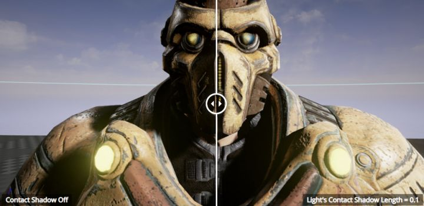

Contact Shadow对 CSM 阴影通常是近距离细节补充的关系，一般不会直接使用 Contact Shaodw 来代替普通的阴影计算。

Contact Shadow的另外一个用途，是用于使用了parallax occlusion mapping的场景。此时无法在 shadowmap中算出精确的偏移值，就可以使用 Contact Shadow。

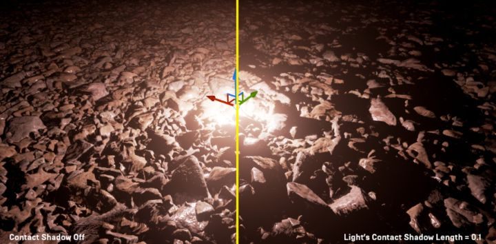

## 基于SDF的阴影

前面我们说的阴影，都是通过处理模型来实现的。

SDF/Signed Distance Field 是一种保存空间中信息的场，保存空间中当前位置到最近的模型表面的距离。在物体外部时使用正数，在物体内部时使用负数。

由于 SDF 信息和模型的面数无关，因此我们可以使用非常大范围的 SDF 信息，并且使用 Clipmap 来做 LOD 处理。CSM 阴影，在距离较远处，由于需要处理的模型较多，开销也会增大。而 SDF 阴影就没有这个问题。

SDF 的另外一个优势，就是可以非常方便地实现 Cone Tracing，进而方便地实现软阴影和面光源阴影效果。相对于 Shadowmap 阴影，SDF 阴影更加柔和。

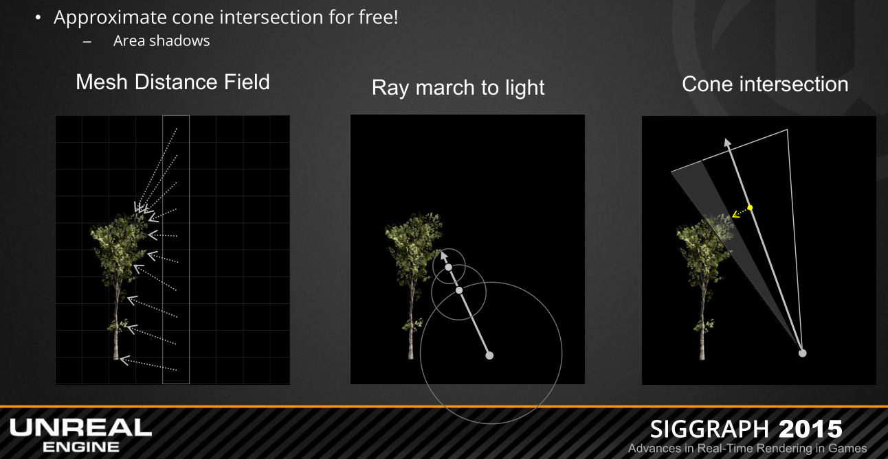

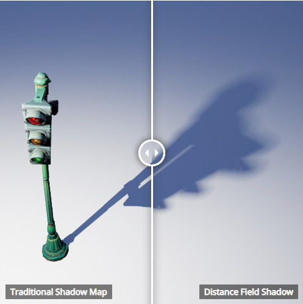

## 环境光照的阴影

环境光照的阴影，其实就是我们常说的 SSAO，即环境光照遮蔽。这里不作详细的介绍。

## Capsule AO 和 Capsule Shadow

使用 SSAO 时，得到的 AO 效果范围较小，会导致人物的 AO 效果不是很好。而人物是动态的，又无法使用烘焙 AO。Capsule AO 将人物模型简化成胶囊体形状，并进行 AO 计算，来得到范围更大，更加柔和的 AO。

同样，经过前面的分析我们知道，要使用 shadowmap 来实现大范围软阴影，是非常困难的。Capsule Shadow 是一种用于实现柔和的人物投影的阴影。

## 基于光线追踪的阴影技术

阴影是实时光追中比较简单的应用，实现起来也非常简单。使用光线追踪，可以非常方便地实现一些面光源的软阴影效果，只需要在面光源上，采样很多个点，然后和目标点之间进行连线并计算遮挡。

## 体阴影

前面我们讲的阴影，都没有考虑半透明物体的阴影。在考虑半透明阴影后，事情就会变得非常复杂。关于这方面的内容，会在未来的文章中详细讲解。
