# 次表面散射理论

## 参与介质

**参与介质（participating media）** 是指对所穿过的光线产生散射、吸收等作用的空间介质，例如烟、雾、尘埃等。

左图是 BSDF 描述的材质示意，右图是参与介质示意：

对于 BSDF 建模的材质，模型假设光线仅在景物表面被散射，光线的入射点和出射点相同，而且光线离开景物表面后就不再受材质影响了。但是，光线在参与介质中传播时实际上也会被介质中的粒子吸收、散射而能量衰减，同时介质本身也可能会发射辐射而使光能增加，所以此时 BSDF 描述的局部光照模型就非常不准确了。

要想准确地绘制烟、雾、玉石、牛奶等半透明的液体之类的参与介质，一种较为精确但是开销较高的方法是在景物内部细致地跟踪光路，用相函数等描述材质，求解辐射传输方程，而不再停留于景物的表面。另一种不那么准确但开销较小的方法是建模光线在介质内部的交互，近似光线在介质内部传播的结果，用 BSSDF 描述材质，此时就可以回到景物的表面，继续使用求解绘制方程的形式了。

上一篇介绍了使用体渲染（volume rendering）的方法求解辐射传输方程进行着色，而本文将简单地介绍拟合参与介质的 BSSRDF 。

一般 BSSRDF 会假设入射光线相交的景物表面是平坦的、表面积无限，并假设参与介质是均质的、厚度无限，所以和求解辐射传输方程相比，根据 BSSRDF 描述的参与介质生成的图像是不准确的。（奈何它简单而且高效啊！）

## BSSRDF基本

按照刚才的说法，我们有如下假设。

1. 次表面散射的物体是一个曲率为零的平面 $S$。
2. 这个平面 $S$ 的厚度，大小都是无限。
3. 平面内部的介质参数$\mu_i$是均匀的。
4. 光线永远是从垂直的方向$w$入射表面。

正因为有这些假设，所以很容易把出射光的强度与出射点和入射点之间的距离用一个函数去近似。

在这些假设成立的前提下，我们可以得到一个BSSRDF函数，表示散射光照出射光和入射光的关系：

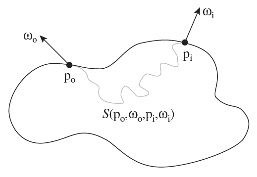

**BSSRDF（bidirectional subsurface scattering reflection distribution function，双向子面散射反射分布函数）** $S(p_i, \omega_i, p_o, \omega_o)$ 描述了物体表面一点 $p_i$ 处来自方向 $\omega_i$ 入射辐射通量（radiant flux）的微增量 $d\Phi_i(p, \omega_i)$ 与其所引发的在点 $p_o$ 处向出射方向 $\omega_o$ 反射辐射亮度（radiance）增量 $dL_o(p, \omega_o)$ 之间的关系：

$$
S(p_i, \omega_i, p_o, \omega_o) = \frac{dL_o(p_o, \omega_o)}{d\Phi_i(p_i, \omega_i)}
$$

对于散射光照，求解光照的方程是一个嵌套积分：

$$
L_o(p_o, \omega_o) = \int_A \int_{\Omega^{+}} S(p_o, \omega_o, p_i, \omega_i) L_i(p_i, \omega_i) \lvert \cos \theta_i \rvert d\omega_i dA
$$

* $\Omega^{+}$ 是表面法线确定的正半球，包含了所有可能的光线入射方向 $\omega_i$；
* $\theta_i$ 是入射方向 $\omega_i$ 和表面法线方向的夹角；
* 入射光线携带的辐射亮度乘以光线入射方向和法线方向夹角的余弦，得到辐射照度，再在物体表面 $A$ 进行积分，得到入射辐射通量；
* BSSRDF 需要在包含了所有可能光线入射点 $p_i$ 的表面区域 $A$ 上进行面积分，可以假设只有在出射点 $p_o$ 附近一定范围内的入射点 $p_i$ 才有明显贡献，以更方便求解；

绘制方程中的 BSSRDF $S(p_i, \omega_i, p_o, \omega_o)$ 把介质对光线的散射近似为如下三部分：

$$
S(p_i, \omega_i, p_o, \omega_o) = S^{(0)}(p_i, \omega_i, p_o, \omega_o) + S^{(1)}(p_i, \omega_i, p_o, \omega_o) + S_d(p_i, \omega_i, p_o, \omega_o)
$$

* $S^{(0)}(p_i, \omega_i, p_o, \omega_o)$ 是光线仅被介质吸收而衰减，没有发生散射的成分；
* $S^{(1)}(p_i, \omega_i, p_o, \omega_o)$ 是光线仅在介质中被散射一次的成分；
* $S_d(p_i, \omega_i, p_o, \omega_o)$ 是光线在介质中被散射多次的成分；

### 扩散理论

**扩散理论（Diffusion Theory）** 是处理参与介质中“多次散射”问题的核心简化模型。它的本质是将复杂的光子随机游走过程，近似为类似于热传导或流体扩散的宏观物理过程。

它建立在一个关键假设之上：光线在介质内部每经过一次散射，其辐射亮度分布就会变得更模糊、更趋向于均匀分布。

* **从方向性到无方向性** ：当散射次数足够多时（通常在平均自由程 **ℓ** 的数倍距离之外），光子的原始入射方向信息完全丢失，辐射亮度趋近于 **漫反射** 。
* **数学转换** ：这使得我们将复杂的方向积分简化为空间位置的函数，即只需关注光能随距离 **r** 的衰减，而不再需要追踪每一个微观散射角。

值得注意的一点是，只有在材质散射强度很大，即平均自由程（mean free path）很短的时候，使用Diffusion才是一种比较合适的方案，因为此时光线会迅速发生散射，形成比较均匀的分布。前面我们讲到的大气渲染，体积雾等，是不能使用Diffusion Profile的。

### Dipole Model

在2001年，Jensen 等人发表论文《A Practical Model for Subsurface Light Transport》，提出了 dipole model。

对于 $S^{(0)}$，模型假设介质厚度无限，于是该项无贡献：

$$
S^{(0)}(p_i,w_i,p_o,w_o) =  0
$$

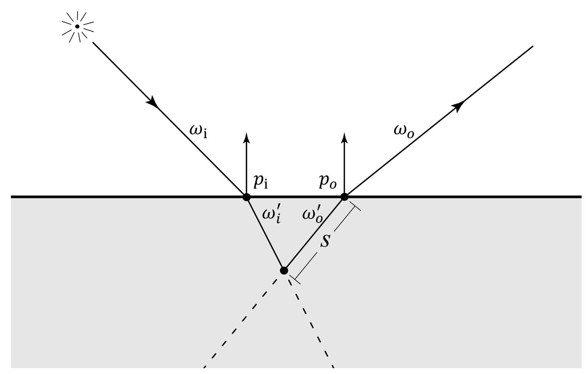

对于$S^{(1)}$ ，模型假设介质表面平坦，被均匀地照亮，且介质内部是均质的，于是沿着折射光线积分，可以得到一次散射贡献的出射辐射亮度：

$$
L_o^{(1)}(p_i, \omega_i, p_o, \omega_o) = \sigma_s(p_o) \int_{\Omega^+} F \cdot p(\omega_i' \cdot \omega_o') \int_{0}^{\infty} e^{-\sigma_{tc} \cdot s} \cdot L_i(p_i, \omega_i) ds d\omega_i
$$

* $\omega_i'$ 和 $\omega_o'$ 分别是介质内部被折射的入射和出射方向；
* $F = F_t(\eta, \omega_i) \cdot F_t(\eta, \omega_o)$ 是两处菲涅尔项的乘积，其中 $\eta$ 是材质的相对折射率；
* $\sigma_{tc} = \sigma_t(p_o) + G \cdot \sigma_t(p_i)$ 是联合消光系数，其中 $G$ 是几何因子，$\sigma_t$ 是衰减系数（attenuation coefficient）；

对于 $S_d$，因为光线在介质内部每经过一次散射，辐射亮度分布便会变得更模糊、更趋向于均匀分布一些，所以经过多次散射后，辐射亮度分布会趋近于漫反射，于是多次散射的贡献如下：

$$
S_d(p_i, \omega_i, p_o, \omega_o) = \frac{1}{\pi} F_t(\eta, \omega_i) R_d(\|p_i - p_o\|) F_t(\eta, \omega_o)
$$

* $F_t(\eta, \omega_i)$ 和 $F_t(\eta, \omega_o)$ 是两处的折射菲涅尔项；
* $R_d$ 是漫反射的 BSSRDF，等于辐射出射度除以入射辐射通量（incident flux）；
* 辐射出射度（radiant exitance）是单位辐射表面积向半球空间发射的辐射通量；
* $\frac{1}{\pi}$ 是归一化项；

$$
\begin{aligned}
\int_{\Omega^+} \cos \theta \mathrm{d}\omega &= \int_{0}^{2\pi} \int_{0}^{\frac{\pi}{2}} \cos \theta \cdot \sin \theta \mathrm{d}\theta \mathrm{d}\phi \\
&= \int_{0}^{2\pi} \mathrm{d}\phi \int_{0}^{\frac{\pi}{2}} \cos \theta \sin \theta \mathrm{d}\theta \\
&= 2\pi \cdot \left. \frac{1}{2} \sin(2\theta) \right|_0^{\frac{\pi}{4}} \\
&= \pi
\end{aligned}
$$

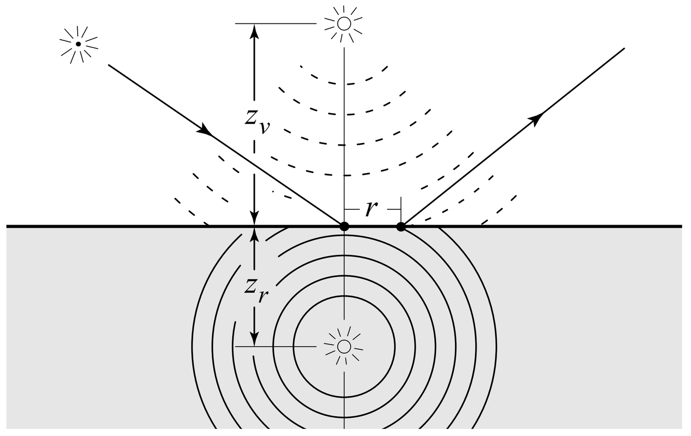

Jensen 等人采用偶极子（dipole），即用两个相对的虚拟点光源来近似光线在平坦的、表面积无限的、厚度无限的均匀介质内部多次散射的效果，其中一个点光源被放置在表面之下深度 $z_r$ 处，另一个被放置于表面之上高度 $z_v$ 处，它们联合的影响如下：

$$
R_d(r) = \frac{\alpha'}{4\pi} \left[ (\sigma_{tr} \cdot d_r + 1) \frac{e^{-\sigma_{tr} \cdot d_r}}{\sigma_t' \cdot d_r^3} + z_v (\sigma_{tr} \cdot d_v + 1) \frac{e^{-\sigma_{tr} \cdot d_v}}{\sigma_t' \cdot d_v^3} \right]
$$

* $\sigma_t' = \sigma_s (1 - g) + \sigma_a$，其中 $g$ 是光线散射角余弦的平均值，$\sigma_s$ 是散射系数，$\sigma_a$ 是吸收系数；
* $\alpha' = \frac{\sigma_s (1 - g)}{\sigma_t'}$；
* $\sigma_{tr} = \sqrt{3\sigma_a \cdot \sigma_t'}$；
* $d_r$ 是与表面之下点光源之间的距离，$d_v$ 是与表面之上点光源之间的距离；

对于两个点光源的位置，可以考虑 $z_r = \frac{1}{\sigma_t'}$，$z_v = z_r + 4 \frac{1 + F_{dr}}{1 - F_{dr}} D$：

* $D = \frac{1}{3\sigma_t'}$ 是扩散常数（diffusion constant）；
* $F_{dr}$ 是所有入射方向漫反射菲涅尔项的平均值，可以使用 Egan 和 Hilgeman 的论文中给出的公式 $F_{dr} = -\frac{1.44}{\eta^2} + \frac{0.71}{\eta} + 0.668 + 0.0636\eta$ 近似；

这种方法只模拟了多次散射，而忽略的直接散射/单次散射，如果需要得到直接散射的结果，则要单独用Ray Marching的方法求解。

### Normalized Diffusion

在2015年，Christensen 和 Burley 发表论文《Approximate Reflectance Profiles for Efficient Subsurface Scattering》，提出了一种对漫反射 BSSRDF 高效的近似：

$$
R_d(r) = A \frac{e^{-\frac{r}{d}} + e^{-\frac{r}{3d}}}{8\pi \cdot d \cdot r}
$$

* $A$ 是景物表面的**反照率（albedo）**；
* $d$ 是控制函数形状的参数，反应了次表面散射效果的柔和程度；
  * 在物理上，$d$ 和介质的平均自由程（mean free path）$\ell$ 有关，可取值 $d = \frac{\ell}{s}$，其中 $s$ 是标度因子（scaling factor），取决于 $A$；
  * 当光线垂直入射表面时，标度因子可取值 $s = 1.85 - A + 7|A - 0.8|^3$；
  * 对于漫反射折射的表面，标度因子可取值 $s = 1.9 - A + 3.5(A - 0.8)^2$；
  * $d$ 也可以由漫反射平均自由程（diffuse mean free path）$\ell_d$ 决定，取值 $d = \frac{\ell_d}{s}$，此时标度因子可取值 $s = 3.5 + 100(A - 0.33)^4$；

$2\pi r \cdot R_d(r)$ 对应的累积概率分布函数是 $\text{cdf}(r) = 1 - \frac{1}{4} e^{-\frac{r}{d}} - \frac{3}{4} e^{-\frac{r}{3d}}$，具体的推导如下：

$$
\begin{aligned}
\operatorname{cdf}(r) &= \frac{\int_{0}^{r} 2 \pi t \cdot R_{d}(t) \mathrm{d} t}{\int_{0}^{\infty} 2 \pi t \cdot R_{d}(t) \mathrm{d} t} \\
&= \frac{\int_{0}^{r} 2 \pi t \cdot A \frac{e^{-\frac{t}{d}}+e^{-\frac{t}{3 d}}}{8 \pi \cdot d \cdot t} \mathrm{d} t}{\int_{0}^{\infty} 2 \pi t \cdot A \frac{e^{-\frac{t}{d}}+e^{-\frac{t}{3 d}}}{8 \pi \cdot d \cdot t} \mathrm{d} t} \\
&= \frac{\int_{0}^{r}\left(e^{-\frac{t}{d}}+e^{-\frac{t}{3 d}}\right) \mathrm{d} t}{\int_{0}^{\infty}\left(e^{-\frac{t}{d}}+e^{-\frac{t}{3 d}}\right) \mathrm{d} t} \\
&= \frac{\left.\left(-d e^{-\frac{t}{d}}-3 d e^{-\frac{t}{3 d}}\right)\right|_{0} ^{r}}{\left.\left(-d e^{-\frac{t}{d}}-3 d e^{-\frac{t}{3 d}}\right)\right|_{0} ^{\infty}} \\
&= \frac{\left(-d e^{-\frac{r}{d}}-3 d e^{-\frac{r}{3 d}}\right)-(-d-3 d)}{(0-0)-(-d-3 d)} \\
&= \frac{4 d-d e^{-\frac{r}{d}}-3 d e^{-\frac{r}{3 d}}}{4 d} \\
&= 1-\frac{1}{4} e^{-\frac{r}{d}}-\frac{3}{4} e^{-\frac{r}{3 d}}
\end{aligned}
$$

虽然该函数并不基于物理，而是经试验得到的经验模型，但是它的效果超过了以往不少基于物理的模型，而且形式简单，开销较小，将相应的累积概率分布函数应用于蒙特卡罗方法也很方便。另外，该函数不仅考虑了多次散射的成分$S_d$ ，也考虑了一次散射的成分$S^{(1)}$。

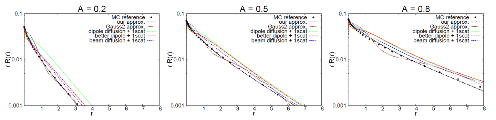

Normalized Diffusion所接受的介质参数和传统的有所不同。通常描述介质用的是吸收系数$\sigma_a$，和散射系数$\sigma_s$。但是由于它们和最终材质外观的联系并不是一个线性关系，下面的表格可以看出$\sigma_a$和$\sigma_s$与材质的颜色的关系非常摸不着头脑。所以Artists并不能很方便的直接调整这些系数。所以其实大部分渲染器都会把这些系数映射成材质表面的Albedo$A$和平均散射距离$l_d$（diffuse mean free path）供美术调整。不仅如此，也只有这也，才可以将纹理上的颜色应用到次表面散射材质上去。

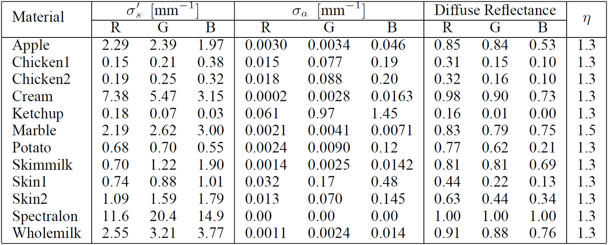

当平均散射距离为0的时候，会收敛到和漫反射材质一样的结果。下图是五只用Normalized Diffusion渲染的兔子，平均散射距离从左到右由小变大。

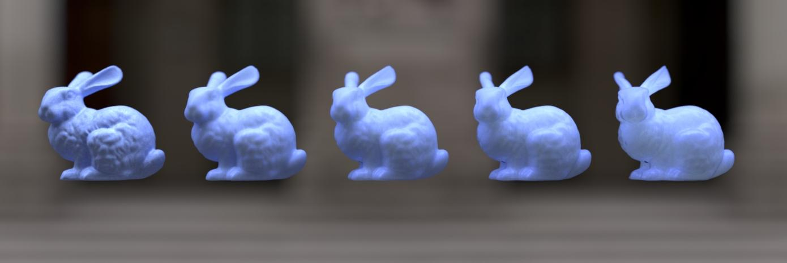

## BSSRDF 重要性采样

在使用蒙特卡罗方法求解绘制方程时，需要根据 BSSRDF 抽样光线方向。

在2013年，King 等人发表论文《BSSRDF Importance Sampling》，提出了一种根据 BSSRDF 使用重要抽样法生成光线样本的方法。假设物体材质均匀，只有位于同一局部范围内的光线入射点和出射点之间存在明显的联系，所以可以只在着色点附近进行抽样。

Solid Angle在2013年提出一个多轴投射的采样方法。首先根据$R_d$在入射点周围的圆盘上根据$R_d$的分布采样一个距离$r$，接着将这个点垂直投影到模型的表面上。因为BSSRDF是在物体的表面积上积分，所以在遇到和入射点法线方向不同的表面时，样本的pdf需要乘以入射和出射点法线的点积。当入射与出射表面接近垂直的时候，pdf就会非常小。所以[9]中的做法是用一定的概率在binormal和tangent方向进行投影，然后用多重重要性采样计算样本的pdf，就可以在凹凸不平的表面达到更快的收敛速度。

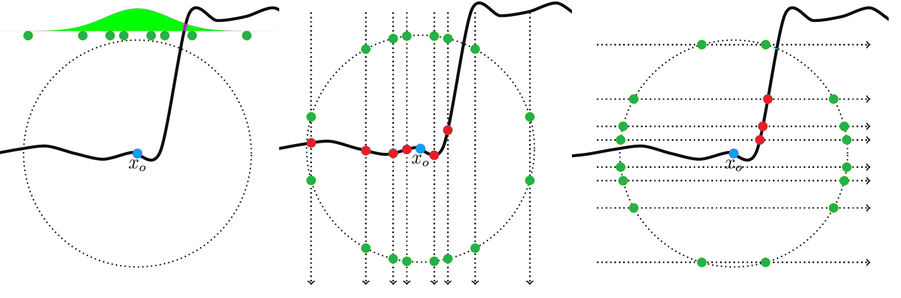

至于对散射距离的采样，Normalized Diffusion的CDF可以直接公式计算，上面已经提过了。不过采样需要的$cdf^{-1}$无法解析的表达，这里可以直接用预计算查表的方法解决。计算的时候让$d$等于1，查表时乘以实际的$d$就能得到散射距离。有了以上采样的方法，就可以把次表面散射采样的路径作为一种特殊路径集成到Path tracing或者Bidirectional path tracing的积分中去。

# 次表面散射应用

## 皮肤渲染之预积分

假设我们渲染一个皮肤材质的带散射的球体，会得到这样的结果。可以看到，在明暗变化区域，有明显的过渡效果。且如果球体的半径越小，散射效果就更明显。

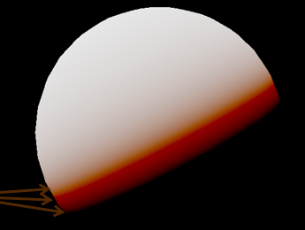

预积分皮肤渲染的思想，就是将 $N \cdot L$ 和球体曲率作为积分的输入项，将输出的漫反射系数作为输出，预先计算出漫反射的相关系数 。

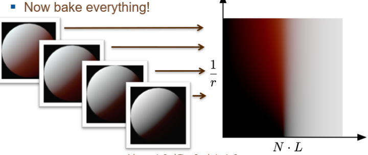

求解积分的过程，就是将平行光照在一个皮肤材质的球体上，然后使用高斯函数近似 Diffusion Profile，计算出球体上每个角度方向的次表面散射。

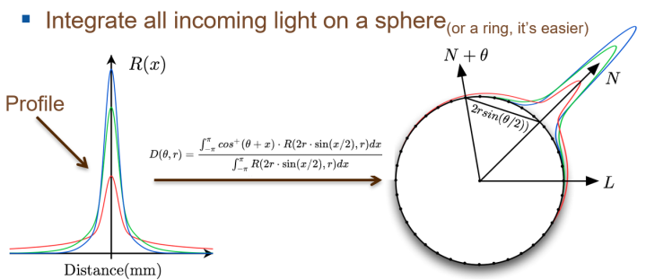

$$
D(\theta, r) = \frac{\int_{-\pi}^{\pi} \cos^+ (\theta + x) \cdot R(2r \cdot \sin(x/2), r) \mathrm{d}x}{\int_{-\pi}^{\pi} R(2r \cdot \sin(x/2), r) \mathrm{d}x}
$$

当然只是这样进行积分算散射还是不够的，因为皮肤表面非常粗糙，渲染出来的皮肤效果，没有次表面散射的柔和的感觉。因此我们在计算漫反射时，会对皮肤表面的法线进行一些模糊处理。

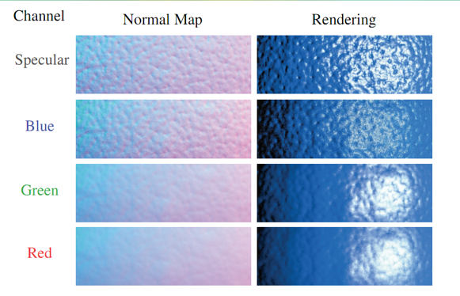

平滑的法线，可以是直接使用几何法线，也可以是将普通的法线贴图进行模糊处理得到。在进行光照计算时，我们将高光部分正常计算，漫反射部分，根据每个通道的散射强度，在普通法线和平滑法线之间进行插值，分别计算出每个通道的漫反射，然后合在一起。

除此之外，我们还要考虑次表面散射对半影的影响。次表面散射，会对阴影产生影响，皮肤表面的半影区域会变窄，这个也是需要进行预积分计算的。

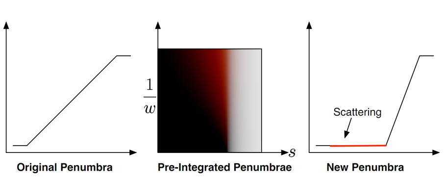

另外就是考虑环境光照的影响了，同样需要进行预积分计算。比如我们要用球谐函数来表示环境光照的漫反射，就需要对球谐系数进行一个预积分处理：

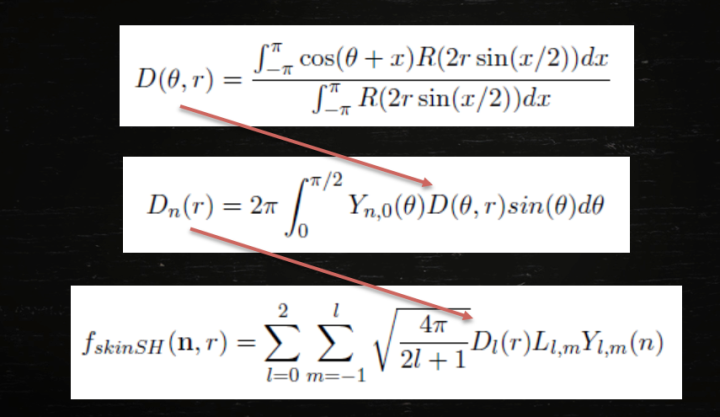

总结下来是这样几个要点：

1. 预积分皮肤漫反射；
2. 表面法线平滑；
3. 预积分半影处理；
4. 预积分环境光漫反射；

预积分皮肤相对于后面要讲的屏幕空间的方式，开销要小的多，目前常用于手机上的人物渲染。我们也可以进一步对其进行优化，将得到的LUT转化成球形高斯函数来近似。

预积分皮肤的缺点小结如下：

1. 每套皮肤的散射参数，都需要一套LUT图；
2. 无法表现出非常柔和的次表面散射效果；
3. 由于Diffusion Profile函数的缺陷，在积分用的球体半径较小时，会产生能量损失，效果不正确。仔细看预积分的图，右上角部分是有些偏蓝色的。建议直接将蓝色部分用PS修成白色。
4. 预积分的半影效果，难以控制。

## 皮肤渲染之屏幕空间处理

屏幕空间后处理需要考虑以下几个问题：

1. 次表面散射只作用于漫反射，因此在进行后处理之前，我们需要将漫反射和高光来分开存储；
2. 物体表面各处的散射强度不相同，需要在不同位置，进行不同程度的散射计算；
3. Diffusion Profile中，RGB三通道的散射值不同，每个通道的散射强度不同；
4. 在不同距离，不同法线朝向下，后处理散射的屏幕空间中的宽度应该跟随着变化。

### 分离漫反射和高光：

方案一：使用MRT，将高光和漫反射分别存储到两个Buffer中；

方案二：使用CheckBoard，将高光和漫反射分别放到黑格和白格中，在使用时进行还原；

方案三：使用Alpha通道，保存计算的中间结果，高光+没乘BaseColor的漫反射。然后使用Alpha通道来保存漫反射的亮度比例。这样在后面计算时，就可以直接还原出光照的两个分量。这种只处理漫反射中间结果光照，最后乘以BaseColor的做法也可以用在其他方案中，可以使物体表面保留更多细节。

### Separable SSS

Separable SSS 是目前最常见的后处理SSS实现方式，来看下具体实现的细节。

我们先来看下 Separable的含义是什么。我们进行图像处理时，会使用一些 kernel 对整个图像求卷积，来实现一些图像处理效果。如果一个 kernel 矩阵可以表示成两个一维向量的乘积，那么我们就说这个 kenel 是 separable 的，我们的卷积操作，也可以分解成两步。第一步是垂直方向的卷积，第二步是水平方向的卷积，这样可以大幅简化计算的开销。

比如我们常用的高斯模糊，使用的 kernel可以进行分解，这样我们一般做高斯模糊时，都会拆成两个 pass 来执行，降低带宽的消耗。

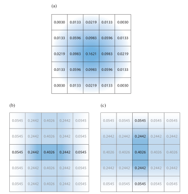

现在我们来看下 Diffusion Profile，也可以看成一个卷积的 kernel，不过遗憾的是，这个kernel 并不是 separable的。单独的一个高斯函数是 seperable，但是多个高斯函数的和却不是 seperable的。

设 kernel 为 $R_d$ ，输入能量为 $E$ ，卷积计算的结果为：

$$
M_e(x, y) = \int_{R^2} E(x', y') R_d(x - x', y - y') \mathrm{d}x' \mathrm{d}y'
$$

在渲染中，一个常用的技巧就是，建立一些假设，然后根据这些假设，简化计算过程。包括前面的 BSSRDF 也是基于了一些假设。

我们现在假设输入的图像，能量变化在 xy 方向上相等，我们就可以这样来求卷积：

$$
\begin{aligned}
M_{e}(x, y) &=\iint E\left(x^{\prime}, y^{\prime}\right) R_{d}\left(x-x^{\prime}, y-y^{\prime}\right) \mathrm{d} x^{\prime} \mathrm{d} y^{\prime} \\
&=\int E_{1}\left(x^{\prime}\right) \underbrace{\int R_{d}\left(x-x^{\prime}, y-y^{\prime}\right) \mathrm{d} y^{\prime}}_{a_{p}\left(x-x^{\prime}\right)} \mathrm{d} x^{\prime} \\
&\quad+\int E_{2}\left(y^{\prime}\right) \underbrace{\int R_{d}\left(x-x^{\prime}, y-y^{\prime}\right) \mathrm{d} x^{\prime} \mathrm{d} y^{\prime}}_{a_{p}\left(y-y^{\prime}\right)} \\
&=\iint E\left(x^{\prime}, y^{\prime}\right) \frac{1}{\left\|a_{p}\right\|_{1}} a_{p}\left(x-x^{\prime}\right) a_{p}\left(y-y^{\prime}\right) \mathrm{d} x^{\prime} \mathrm{d} y^{\prime}
\end{aligned}
$$

当然，这样假设下，得到的实际结果和原始的 diffusion Profile是有偏差的。不过这种偏差，往往是可以接受的。

下面是Separbal Diffusion Profile和真实Diffusion的偏差：

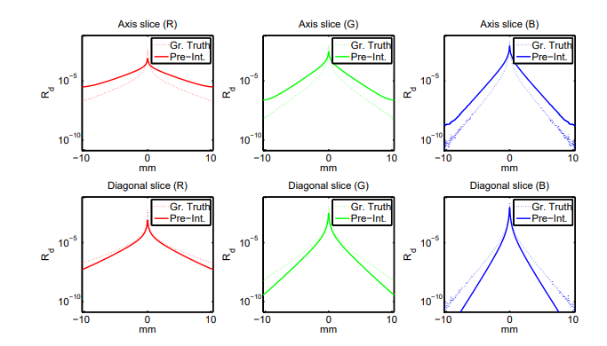

这样，我们在CPU中提前计算出 $a_p$ 的值，就可以使用 separable的方法，来进行后处理次表面散射。

## 简单次表面渲染之Light Wrap

上面讲到的的次表面散射的处理，大部分只会用于皮肤渲染上，而不会用于其他物体的次表面散射。因为对于其他物体的次表面散射效果，人观察起来往往不是非常敏感，所以会使用一些更加简单的处理方式。

LightWrap通过将 $L \cdot N$ 进行重映射，来实现次表面散射的效果。

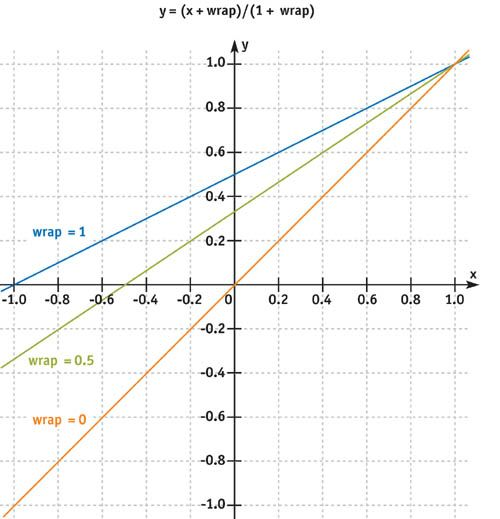

LightWrap常常能在在各种光照模型中见到，比如神秘海域4中布料材质和头发值的近似次表面散射的漫反射项为：

$$
f_{diff}(\boldsymbol{l}, \boldsymbol{v})(\boldsymbol{n}, \boldsymbol{l}) \Rightarrow \frac{\rho_{ss}}{\pi}(\boldsymbol{c}_{scatter} + (\boldsymbol{n} \cdot \boldsymbol{l})^+)^{\mp} \frac{(\boldsymbol{n} \cdot \boldsymbol{l} + w)^{\mp}}{1 + w}
$$

这里 $\Rightarrow$ 意思是将左边的漫反射计算，替换成右边的形式。 $\mp$ 表示将结果 clamp 到 [0,1] 范围，$w$ 是 [0,1] 的 wrap 系数。

## 次表面散射的透射实现

次表面散射的另外一重含义，指的是光线从物体中穿过，到达另外一侧的现象。

对于植被物体，缺少次表面散射投射，会使得植被看起来偏暗，缺乏真实感。

植被物体的透射次表面散射，不需要考虑叶子的厚度信息，我们可以简单地结合LightWrap 来实现， D 是PBR方程中法线分布函数：

$$
L_{ss} = D(0.6, (-v \cdot l)^+) * \left( \frac{(-n \cdot l + Wrap)}{(1 + Wrap)^2} \right)^2 * c_{ss}
$$

对于大理石等物体，通常需要厚度信息来模拟光线穿透效果，也有简易的近似方式：

$$
t_{ss} \boldsymbol{c}_{ss} ((\boldsymbol{v} \cdot -\boldsymbol{l})^+)^p
$$

* $t_{ss}$ 表示当前光线穿透材质的厚度；
* $\boldsymbol{c}_{ss}$ 是次表面散射颜色（Subsurface Color）；
* 通过对视向与反光照方向的点积进行幂运算（$p$），来控制背光处散射光强度的集中程度。

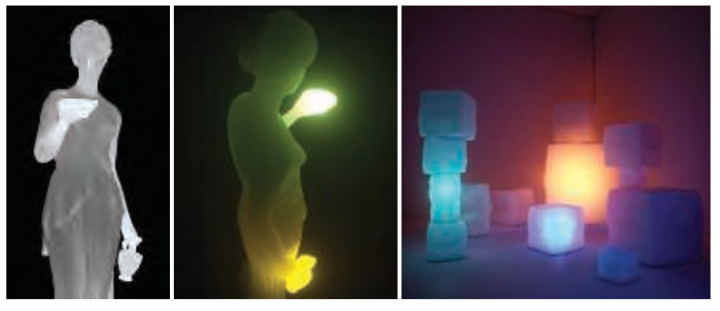

对于人物皮肤效果，添加耳朵等处的透射，可以皮肤看起来更加通透。皮肤的透射计算，我们往往是和前面讲的次表面散射结合在一起的，直接使用前面讲过的 Diffusion Profile即可。对于厚度信息，一般是通过采样相应点的shadowmap，反算出世界空间坐标，再算出坐标距离，来作为光线穿过的距离。

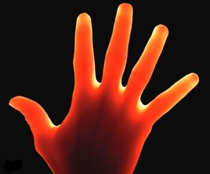
