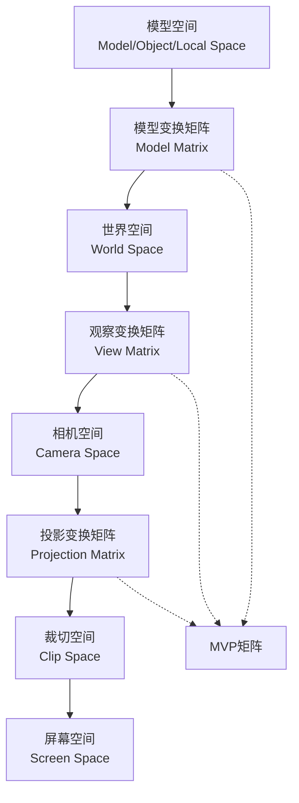

# 坐标空间术语

这部分没啥必要细说，按照UE5的官方文档所言：

> 坐标空间术语包括两方面：**空间** 与 **空间变换**

## 空间

| 虚幻引擎中的坐标空间             | 别名                                                                                                         | 描述                                                                                                                                                                                                                                                        |
| -------------------------------- | ------------------------------------------------------------------------------------------------------------ | ----------------------------------------------------------------------------------------------------------------------------------------------------------------------------------------------------------------------------------------------------------- |
| Tangent (切线空间)               |                                                                                                              | 为正交坐标系（插值后将发生偏移），可为左手或右手坐标系。 TangentToLocal (切线空间到局部空间)变换仅包含旋转变换， 因此它是标准正交坐标变换。（可通过转置或求逆进行反变换）。                                                                       |
| Local (局部空间)                 | Object Space (对象空间)                                                                                      | 为正交坐标系，可为左手或右手坐标系（常用是右手坐标系）。 LocalToWorld (局部空间变换到世界空间)变换， 非线性变换链的起始变换（如果包含缩放变换）以上及平移变换。                                                                                   |
| World (世界空间)                 |                                                                                                              | WorldToView (世界空间到视镜像空间)变换仅包含旋转和平移变换， 所以View（视图）空间中的坐标和World（世界）空间中的坐标是一样。                                                                                                                           |
| TranslatedWorld (平移的世界空间) |                                                                                                              | TranslatedWorld (平移的世界空间) = World （世界空间） + PreViewTranslation （在视变换之前进行的平移变换）                                                                                                                                                   |
| View (观察空间)                  | CameraSpace (相机空间)                                                                                       | 平移矩阵用于从组合变换矩阵中去除浮动相机位置，这提高了移动项点的精确度。 ViewToClip (观察空间到剪裁空体)变换包括XY、Y轴上的缩放变换。但不包括Z轴变换(这种变换/缩/偏向中)。 可在Z轴上缩放以及平移，通过变换挤紧坐标为空间为ClipSpace（剪裁空间）。 |
| Clip (裁剪空间)                  | HomogenousCoordinates (齐次坐标系)、 PostProjectionSpace (后投影空间)、 ProjectionSpace (投影空间) | 以透视投影矩阵形式进行透视的空间坐标。注意剪裁空间中的W和视投影转件的位一样。                                                                                                                                                                               |
| Screen (屏幕空间)                | OpenGL 的 NormalizedDeviceCoordinates (规格化设备坐标系)                                                     | 在透视投影完成之后： 左侧/右侧 -1,1，顶部/底部 1,-1，近/远 0,1  (OpenGL RH需要更改个固定变为 -1,1)                                                                                                                                                |
| Viewport (视口空间)              | ViewportCoordinates (视口坐标系)、 WindowCoordinates (窗口坐标系)                                       | 通常被认为单位： 左侧/右侧 0, 0宽度-1，顶部/底部 0, 高度-1                                                                                                                                                                                             |

## 空间变换

空间变换应该始终使用 ***X To Y*** 的命名格式。

**示例：**

* WorldToView
* TranslatedWorldToView
* TangentToWorld

# 空间的投影变换

之前在初学Unity的时候，对空间的唯一认知就是确定一个Transform坐标。这次我们从图形学的角度来理解空间。

一个数据表示的三维模型，显示到电脑屏幕的平面上，需要经过如下过程：

这个MVP矩阵，就是用于计算一个集合阶段的顶点变换的矩阵，即：

MVP矩阵 = Projection矩阵 *View矩阵* Model矩阵

# 几类空间的解释

推荐一个油管上的视频：

<iframe width="560" height="315" src="https://www.youtube.com/embed/E6Srr-HaicI?si=n62yTyyJeEY-NxGt" title="YouTube video player" frameborder="0" allow="accelerometer; autoplay; clipboard-write; encrypted-media; gyroscope; picture-in-picture; web-share" referrerpolicy="strict-origin-when-cross-origin" allowfullscreen></iframe>

### 模型/物体/本地空间 Model/Object/Local Space

模型/物体/本地，这三类叫法指的是同一空间。模型空间的坐标系原点是模型的原点。X,Y,Z三轴向量的方向和轴单位长度则以模型建模时为标准。

就是旋转模型之后，跟着旋转的那个坐标系。

### 世界空间 World Space

世界空间 是游戏引擎直接使用频率最高的空间。平时在gameplay逻辑代码中获取的物体绝对坐标就是世界空间系下物体的坐标。

也就是旋转模型之后，始终保持原正交的坐标系。

### 相机/观察空间 Camera/View Space

相机/观察空间的坐标系原点和轴向就是相机的位置和旋转轴向。但是有一点特殊，所有空间中只有相机/观察空间是右手坐标系，其余的空间都是左手坐标系。

在UE中的View Space和Camera Space是两个空间，View Space是相对Camera Space的，他在阴影通道的表现和Camera Space略有不同。

### 切线空间 Tangent Space

最抽象的一个空间，在Unity中甚至没有提及，在UE中额外提了一嘴。

切线空间不像其它空间是宏观意义的坐标系。它是对面，点的坐标系。可以理解为每个点都有独立切线坐标系。

图中红色方向是我们熟悉的法线，准确的说是这个面上某个像素的法线（Normal）。绿色的就是这个法线的切线（Tangent），蓝色的是正切线（Bitangent）。切线就是当前这个像素点的面或者顶点的切线，正切线就是法线和切线的叉乘结果向量，坐标系的3轴两两垂直。

好，那么这玩意有个啥用？

这个时候就要联想到游戏开发上了，模型除了网格，还有贴图啊！为了贴图，法线可就很重要了！所以切线空间就是为了法线而生的！

模型Model的法线表现形式是模型数据在建模软件导出时赋予的，而模型软件在导出的时候不光给出了点面的法线方向，同时还给出了切线方向。而我们通过法线和切线向量的叉乘就得到了垂直于法线和切线构成的面的正切线向量。于是，切线空间坐标系就组装完成了。切线空间和模型空间一样，都是在模型数据决定的。模型空间是宏观的，模型所有点共用一个坐标系。而切线空间是微观的，所有点各自拥有一个坐标系。知道了切线空间的坐标系的构成，那就能实现其它空间和切线空间的转换。

修改法线的意义，在于通过切线空间，我们可以实现在不增加模型顶点数量的情况下，增加模型表面的光照细节；也可以实现面上细节的层次叠加，如岩石上层分布苔藓等。

比如一块平整的石头，它的法线肯定都是一个朝向，如果我通过切线空间修改了法线的方向，就能在视觉上产生坑坑洼洼的效果，尽管这块石头的网格、顶点、贴图都是同一个。说白了也就是通过代码实现更加有意思的效果。
