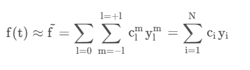
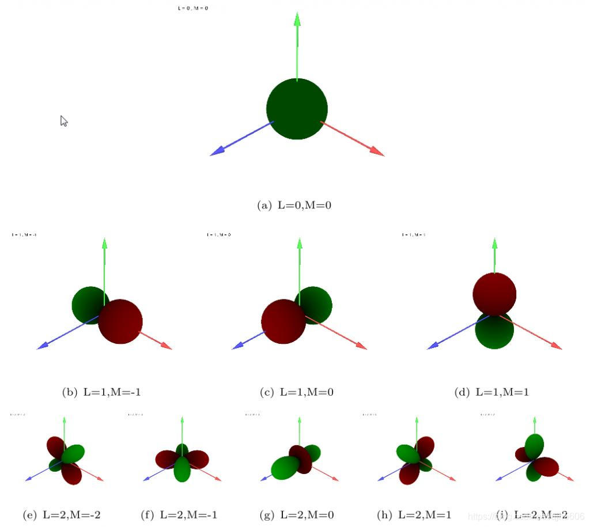
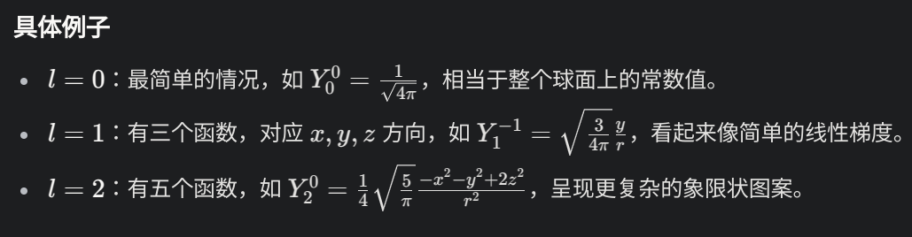

## Motivation

球谐函数(Spherical Hamonics, SH)在图形学主要应用在实时渲染和光照(Realtime Rendering & Lighting)领域。

它主要用来高效地表示和处理球面上的数据，比如光照、反射、阴影等。

最著名的一个应用是游戏引擎中的光照探针(Lighting Probe)，光照探针用于捕获和模拟场景中的光照信息。具体来说，光照探针是一个虚拟的采样点，放置在三维场景中的某个位置，用来记录从该点向周围环境辐射的光照数据。这些数据包括光的方向、强度、颜色等信息，通常以球谐函数（Spherical Harmonics）或其他压缩形式存储。光照探针的目的是在不进行完整的光线追踪计算的情况下，为场景中的物体提供近似但逼真的光照效果。

为什么要用球谐函数来存储呢？

我们来看一段相关介绍：

球谐函数的标准正交性，一方面让它可以表示近乎所有的光照信息，另一方面提供了快速的计算查找能力。

而球谐函数的旋转不变性，天然地提供了在3D场景中的高效存读能力，通过很小的算力需求来支撑强大的实时功能。

## 球谐函数

对于场景中信息的存读，使用文件IO肯定是不现实的，而从内存/GPU中加载，对于设备有较高的要求。但是如果类似深度学习，把信息压缩成一个函数，通过输入的变量来查找呢?

球谐函数就像一套工具，能把这些复杂的信息拆成简单的小块，然后再拼回去。

### 用一个比喻来解释

假设你在一个房间里，房间里有很多灯，灯光从四面八方照过来，亮度还不均匀。你想告诉朋友这个房间的光是怎么分布的，但直接说“东边有点亮，西边很暗，南边超亮”会很啰嗦。球谐函数就像一套“魔法拼图”：

1. 它先把房间里的光照拆成几个基本图案（比如“整体亮度”“东西方向的差别”“南北方向的差别”）。
2. 每个图案都有个“强度值”，告诉你这个图案占多大比重。
3. 把这些图案加起来，就能差不多还原整个房间的光照分布。

这些基本图案就是球谐函数的基础，它们是一组数学公式，专门用来描述球面上的变化。

### 在计算机图形学中的应用

在光照探针里，球谐函数特别有用。光照探针采集周围的光照信息（从各个方向来的光），然后用球谐函数把这些信息“压缩”成几个数字（系数）。

渲染的时候，引擎拿着这些系数一算，就能快速知道某个点应该有多亮、什么颜色，而不用每次都重新算所有光线。

- 一方面，球谐函数只要几个系数，就能大致描述出来360度方向的光照，优化了效率
- 一方面，球谐函数通过球面存取数据，擅长处理平滑的变化，比如天空从蓝到橙的渐变，不会显得生硬。

然而，如果光照变化特别复杂（比如有很多小光斑或尖锐阴影），球谐函数可能会“模糊”细节，因为它更适合平滑的大范围光照。所以球谐函数也不是万能的。

除了光照探针，球谐函数还被用于预计算辐射传输（Precomputed Radiance Transfer，PRT），用于处理物体之间复杂的间接光照（比如墙反射的光照到地板上）。

## 球谐函数的数学原理

数学原理确实有点复杂...

这里给出两篇不错的博客，从应用和理解的角度来分析一下数学原理。

- [图形学基础|球谐光照](https://blog.csdn.net/qjh5606/article/details/118444249)
- [cxx](https://winka9587.github.io/posts/SH_color/)

### 前置数学知识

1.基函数

基函数是函数空间中的基本元素，就像欧几里得空间中的坐标轴一样。任何函数都可以表示为基函数的线性组合。

例如，对于二次多项式空间，可以用基函数组{1,t,t^2}进行线性组合得到，即a+bt+ct^2
 。这里{a , b , c}即表示各个基函数的系数。

这种概念类似于二维欧几里得空间中的基向量，但函数空间通常是无限维的，因此需要无限个基函数来完全描述连续函数。

2.谐函数

“谐函数”在数学和物理学中通常指的是满足某些特定条件的函数，尤其是在函数空间（Function Space）或调和分析的背景下。

在数学中，谐函数（Harmonic Function）通常是指满足拉普拉斯方程（Laplace's Equation）的函数，显著的特征是在二维或三维的欧几里得空间中，函数的二阶偏导数之和为零。

在物理学中，谐函数广泛应用于描述稳态的物理场，如电场（电势）、重力场和流体中的势场。

### 说明

球谐函数是将谐函数限制在球坐标系下的单位球面的一组基函数。它们可以用来近似球面上的任何函数**f**(**t**)。

用数学语言来描述如下：

其中，N表示了系数或者说基底函数的数量，理论上需要无限个基函数才能完全恢复连续函数，但在实际中通常只取前几阶（如 l=0,1,2）来近似。

y_1^m被称为球谐基，c_1^m是对应球谐基方向上的系数。

球面空间上的球谐函数y_1^m可视化如下：

具体的函数表达式可以在[这里](https://en.wikipedia.org/wiki/Table_of_spherical_harmonics)查看，应用的时候一般不超过3阶。

上图中，绿色表示球谐函数的值为正值，而红色表示球谐函数的值为负值；矢径越大球谐函数值的绝对值越大，反之矢径越小球谐函数值的绝对值越小。

- l=0,m=0时，是一个常数函数，相当于整个球面上的值相同。
- l=1时，对应m=-1,0,1，呈现出类似偶极子的图案，绿色表示正值，红色表示负值，矢径大小反映绝对值的强弱。
- l=2时，对应m=-2,-1,0,1,2，呈现更复杂的象限状图案，反映了更高阶的角动量状态。

在实际的使用中，一般只取前几阶的球谐函数来近似球面上的函数。例如在量子力学中，原子轨道的形状（如 s 轨道为球对称，p 轨道为哑铃状，d 轨道为更复杂的四叶草状）直接对应于低阶球谐函数。而在图形学中，更常用的是球谐函数的实数形式，这一点不同于量子力学的复数形式。

下面给出的是实数形式：

至于**投影与重建**部分，限于笔者的技术水平，在此就不乱说明了。
