## Introduction

辐射度量学（Radiometry）是研究电磁辐射的测量和传播的学科，广泛应用于物理学、光学和计算机图形学等领域。在图形学中，辐射度量学主要用于模拟光在三维场景中的传播，以实现真实感渲染。

从图形学角度看，辐射度量学关注以下几个核心概念：

1. **辐射通量（Radiant Flux, Φ）**
   表示单位时间内通过某个表面的总能量，单位是瓦特（W）。它是描述光源发射或表面接收能量的基本量。
2. **辐射强度（Radiant Intensity, I）**
   表示光源在特定方向上单位立体角内的辐射通量，单位是瓦特每立体弧度（W/sr）。常用于点光源的描述。
3. **辐照度（Irradiance, E）**
   表示单位面积上接收到的辐射通量，单位是瓦特每平方米（W/m²）。它衡量表面被光照亮的程度。
4. **辐射率（Radiance, L）**
   这是图形学中最关键的量，表示从某个点沿特定方向、在单位面积和单位立体角内的辐射通量，单位是瓦特每平方米每立体弧度（W/m²·sr）。辐射率描述了光在空间中的分布，是渲染方程的核心。

在图形学中，辐射度量学为光照计算提供了理论基础。例如，**渲染方程**（Rendering Equation）利用辐射率来模拟光与表面的相互作用，考虑直接光照、反射、折射和阴影等效果。通过数值方法（如路径追踪），可以根据这些量计算出逼真的图像。辐射度量学在图形学中就像“光的数学语言”，帮助我们量化光的行为，从而生成真实感画面。

GAMES101的光线追踪部分通过辐射度量学建立了一个完整的数学框架，从基本的光能量定义到光与表面的交互，再到渲染方程的求解和算法实现。这一框架不仅解释了光在三维场景中的传播规律，还支持了从简单反射到复杂全局光照的图像渲染技术。

---

## 基本辐射度量学中的物理量

| 物理量                                 | 符号表示     | 公式定义                                                              | 单位                       |
| -------------------------------------- | ------------ | --------------------------------------------------------------------- | -------------------------- |
| 辐射能 (Radiant energy)                | \( Q \)      |                                                                       | 焦耳\( J \)                |
| 辐射通量 (Radiant flux) 或功率 (power) | \( \Phi \)   | \( \Phi = \frac{dQ}{dt} \)                                            | 瓦特\( W \)/ 流明 \( lm \) |
| 角度 (Angles)                          | \( \theta \) | \( \theta = \frac{l}{r} \)                                            | 弧度\( rad \)              |
| 立体角 (Solid Angles)                  | \( \Omega \) | \( \Omega = \frac{A}{r^2} \)                                          | 球面度\( sr \)             |
| 辐射强度 (Radiant Intensity)           | \( I \)      | \( I(\omega) = \frac{d\Phi}{d\omega} \)                               | 烛光\( cd \)               |
| 辐照度 (Irradiance)                    | \( E \)      | \( E(x) = \frac{d\Phi(x)}{dA} \)                                      | 照度\( lux \)              |
| 辐射率 (Radiance) 或亮度 (Luminance)   | \( L \)      | \( L(p, \omega) = \frac{d^2\Phi(p, \omega)}{d\omega dA \cos\theta} \) | 尼特\( nit \)              |

### 说明

- \( \cos\theta \) 出现在辐射率公式中，表示投影面积对入射光线的角度影响。
- 单位中既有物理单位（如焦耳、瓦特），也有光度学单位（如流明、烛光、照度、尼特），详情参照辐射度量学和光度学的对应关系。

## 辐射能与辐射通量

这部分与高中物理学的（电磁）能量/通量的定义如出一辙，（包括部分定义性质，例如兰伯特余弦定理）。

**辐射能** (Radiant energy) Q ： **电磁辐射(electromagnetic radiation)的能量** ，单位是焦耳 J ，用符号表示(很少用在计算机图形学中)：

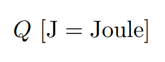

**辐射通量** (Radiant flux)或 **功率** (power) Φ ：**单位时间**释放(emitted)、反射(emitted)、透射(transmitted)或接受(received)的 **能量** 。单位是 W 或 lm

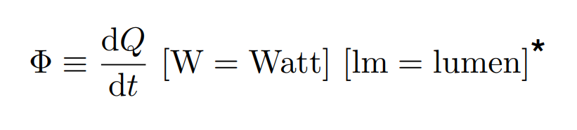

## 辐射强度，辐照度(Irradiant)，辐射(Radiant)

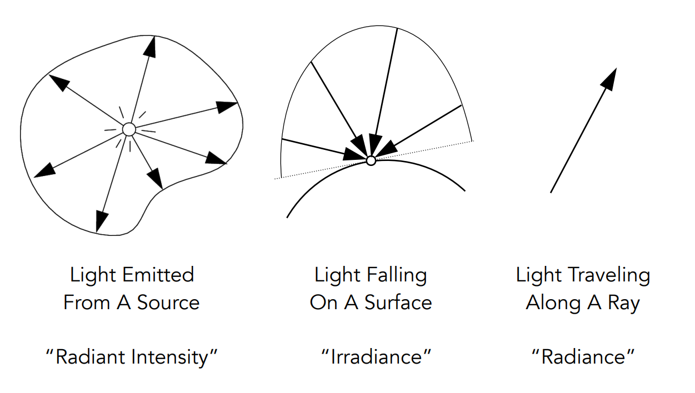

**辐射强度** (Radiant Intensity) I ：辐射(发光)强度是 **单位立体角**(solid angle)由点光源发出的 **功率** (power)。

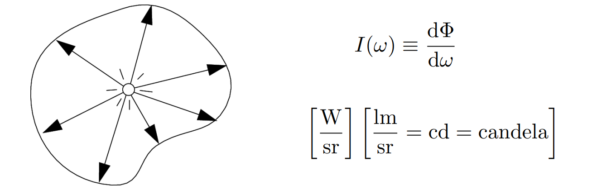

 **立体角(Solid Angles)** ：球面上的**投影面积**与**半径的平方**之比

* Ω=A/r^2
* 球体的立体角值为 4π 球面角度(steradians)

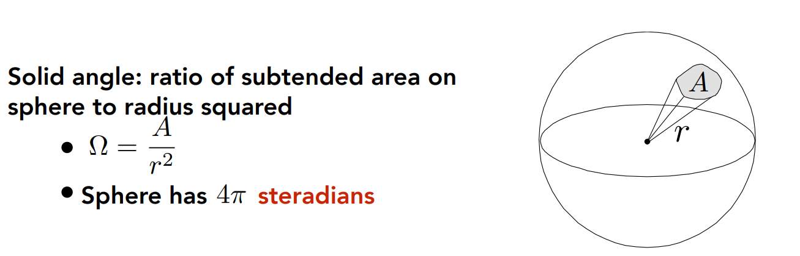

**微分立体角**

求单位面积和单位立体角：

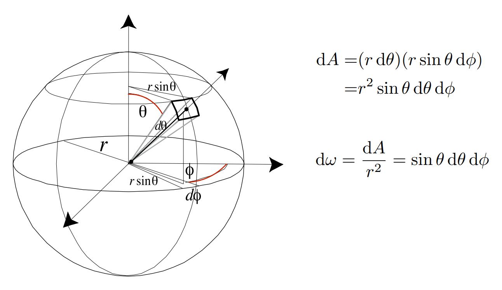

**辐照度** (Irradiance) E ：辐照度是每(垂直/投影)**单位面积入射**到一个**表面上一点**的 **辐射通量(功率)** 。单位：lux，照度(勒克斯)

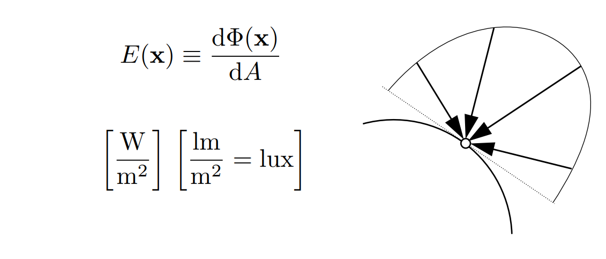

对于通量的计算，我们同高中阶段通量的理解，采用兰伯特余弦定理。

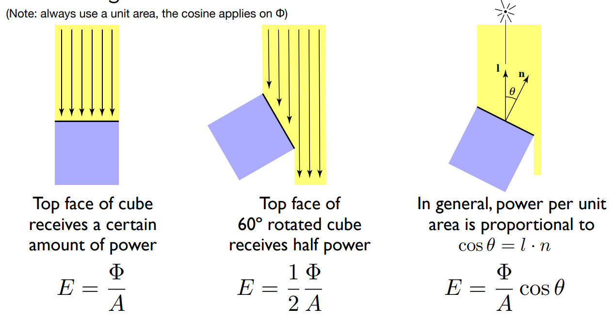

因此，我们可以得到类似电通量/磁通量的衰减：(图片来源于知乎)

 **辐射** (Radiance)是描述光在环境中的分布的基本场量

* 辐射是与光线有关的量
* 渲染是关于计算辐射的

在辐射度量学中，**辐射** (Radiance)或 **亮度** (luminance) L 是指一个表面在**每单位立体角、每单位投影面积**上所发射(emitted)、反射(reflected)、透射(transmitted)或接收(received)的 **辐射通量(功率)** 。

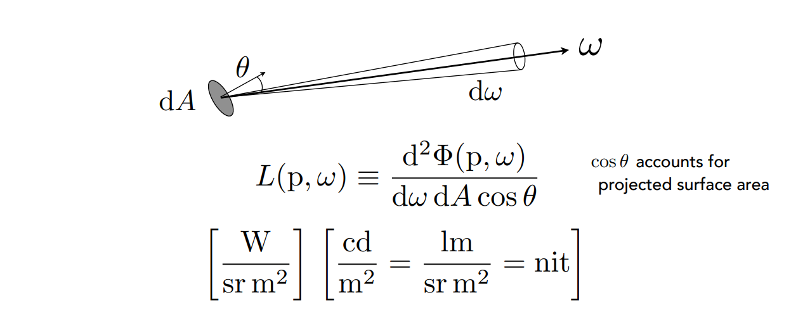

**辐射强度(Radiant Intensity)、辐照度(Irradiance)、辐射(Radiance)三者关系：**

- 辐射强度：单位立体角的辐射通量
- 辐照度：单位投影面积的辐射通量
- 辐射：**单位投影面积**的**辐射强度**或者是**单位立体角**的 **辐照度** (单位立体角、单位投影面积的辐射通量)

## 入射辐射与出射辐射

**入射辐射** (Incident Radiance)：指**到达表面的单位立体角**的 **辐照度** 。即它是沿着给定光线到达表面的光(入射方向指向表面)

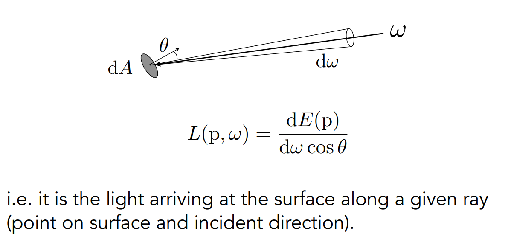

**出射辐射** (Exiting Radiance)：**离开表面**的**单位投影面积**的 **辐射强度** 。例如：对于面光(area light)，它是沿着给定光线发射的光(出射方向指向表面)

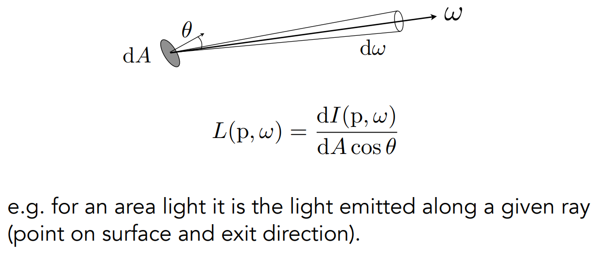

## **辐照度** (Irradiance)  **VS. 辐射** (Radiance)

辐照度：在面积dA 的总辐射通量

辐射： 在面积dA 、方向 dω 上的辐射通量

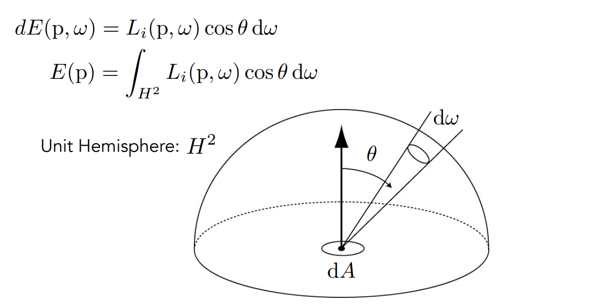
