光照模型(illumination model)，也称为明暗模型，用于计算物体某点处的光强(颜色值)。从算法理论基础而言，光照模型分为两类：一种是基于物理理论的(PBR)，另一种是基于经验模型的(传统光照模型)。

经过了几十年的发展，随着渲染方程的出现，传统光照模型之上，逐渐出现了基于物理的光照模型，局部光照也发展出全局光照等更具真实感的技术。

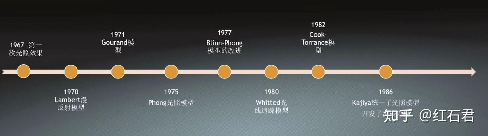

我们之前提到过的Lambert模型、Phong模型、Gouroud模型，基本都是传统光照模型，今天总结一下基于BSSRDF、BRDF等等这些渲染方程高级光照模型

## 全光函数(Plenoptic Function)

全光函数是一个描述场景中光场（Light Field）的数学函数，用于表示在任意位置、任意方向、任意时间、任意波长的光辐射强度。它是渲染和光传输研究的基础，涵盖了光在三维空间中的所有可能信息。

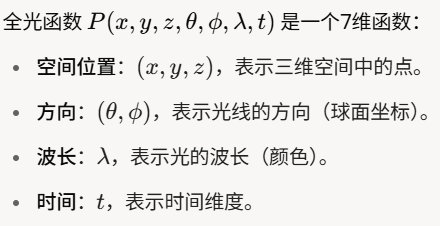

其值表示在特定位置、方向、波长和时间的辐射度(Radiance)。也就是说，通过全光函数，可以重建任意视点、任意方向的场景图像。

## 散射函数

散射函数是用来描述光或其它波在介质中散射特性的函数。它可以是描述不同方向的散射光强度的函数，也可以是描述时间-频率色散信道特性的函数，或者是在水体中光散射角度分布特性的参数。****

换言之，散射函数就是对全光函数的简化，因为我们不需要模拟光照的所有性质，遵循以下规则。当然，这张图实际上就囊括了大部分我们接下来会说到的方程。

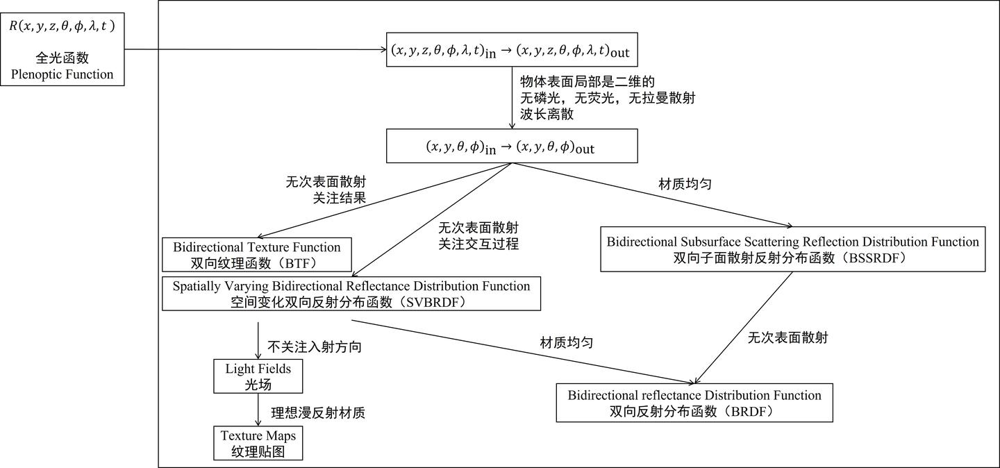

两个全光函数的组合（14维），可以描述任一时刻三维空间中任一一点向另一点传播的光的信息：

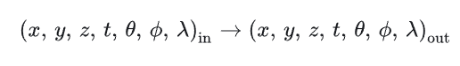

在实际应用中，常对该函数进行不同程度的简化，以便更好地应用于不同的特定场景。

* 在绘制时，常考虑物体表面一点向另一点传播的光的信息，而物体表面一般可认为是二维的，于是位置维度(z)被简化了；
* 绘制某一时刻场景的状态，可以假设光的波长与时间无关，没有磷光（phosphorescence），于是时间维度(t)被简化了；
* 可以假设入射光和出射光的波长相同，没有荧光（fluorescence）或拉曼散射（Raman scattering），并且波长是离散的，或者用 RGB 三个分量来表示，于是波长维度(lamda)被简化了；

原本 14 维的函数经过上述的简化后，得到了如下基本的 8 维函数：

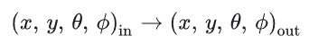

## BTF(双向纹理函数)

BTF是SVBRDF的进一步扩展，描述了表面在不同入射光方向、观察方向和空间位置下的完整外观。它不仅包括反射，还包括复杂的光学现象（如遮挡、阴影、次表面散射）。但是，它比SVBRDF更通用，因为包含了非局部效应（如表面纹理引起的阴影和遮挡）。

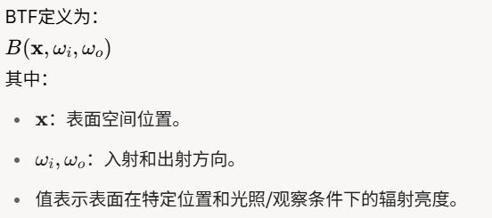

在上文给出的基本 8 维函数的基础上，假设没有子面散射，即假设光线入射表面后从同一点射出，便得到了 6 维的 BTF（bidirectional texture function，双向纹理函数）。

BTF 直接测量光与物体表面交互的结果，保存为相应的纹理（texture）信息，而不关注具体的交互过程。

我们把上面的向量式子展开就可以得到6维的标量形式了：

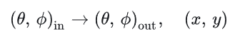

## SVBRDF(空间变化的双向反射分布函数)

SVBRDF是BRDF的扩展，允许反射特性在表面不同位置发生变化。它在空间维度上对BRDF进行参数化，也正因此，SVBRDF描述了表面材质的空间异质性，例如木材纹理、油漆上的划痕等。它是真实世界中复杂表面的更精确表示。表示为：

形式上和BTF相同，在上文给出的基本 8 维函数的基础上，假设没有子面散射，即假设光线入射点和出射点相同，也可以得到 6 维的 SVBRDF（spatially varying bidirectional reflectance distribution function，空间变化双向反射分布函数）。

SVBRDF 与 BTF 在函数形式上相同，区别在于 SVBRDF 建模了光线与物体表面之间交互的具体过程，而 BTF 不关注过程，只记录结果。

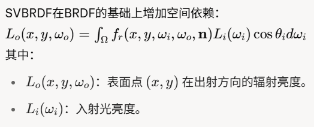

### 光场

在 SVBRDF 的基础上，不关注光线的入射方向，只关注表面上不同点在不同方向光出射的情况，便得到了 4 维的光场（light fields）。

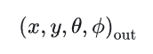

### 纹理贴图

在光场的基础上，假设是理想漫反射表面，即各个光出射方向情况相同，便得到了 2 维的纹理贴图（texture map）。

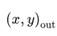

## BSSRDF(双向次表面散射反射分布函数)

BSSRDF描述了光线在物体表面某点入射后，经过内部散射，从另一表面点出射的反射特性。BSSRDF扩展了BRDF，允许光在入射点和出射点分离，描述次表面散射。它考虑了光在材料内部的次表面散射，适用于半透明材质。

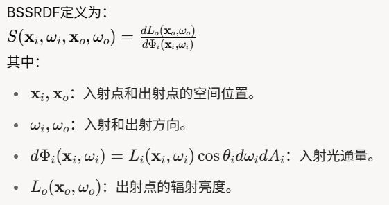

在上文给出的基本 8 维函数的基础上，假设物体材质均匀，每个点的反射属性相同、与位置无关，可以得到 6 维的 BSSRDF（bidirectional subsurface scattering reflection distribution function，双向子面散射反射分布函数）。

虽然出射点和入射点不是同一个点，但是可以假设只有距离相近的光线入射点和出射点之间才有明显联系，此外 BSSRDF 还做出了其它一系列的假设，所以只考虑出射点位置即可。

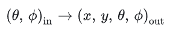

至于次表面散射，这个说起来篇幅太长，之后会开一期新的博客来说说这么个事( = V = )

## BRDF(双向反射分布函数)

最后就是我们最经典的BRDF了！就是那个传说中最初的渲染方程...

BRDF描述了光线从入射方向 ωi 照射到表面某点后，向出射方向 ωo 反射的辐射亮度的比例。它假设光在表面同一点发生反射，不考虑次表面散射。

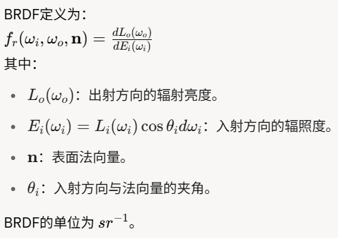

在 BSSRDF 的基础上，假设没有子面散射，光线入射点和出射点相同，或者在 SVBRDF 的基础上，假设物体材质均匀，每个点的反射属性相同、与位置无关，便可以得到 4 维的 BSDF（bidirectional scattering distribution function，双向散射分布函数），其中：

* 反射成分被称为 BRDF（bidirectional reflectance distribution function，双向反射分布函数），描述了沿空间任一方向入射到物体表面的光线，经过物体表面的反射朝空间其他方向辐射的辐射亮度分布；
* 如果物体透明，则透射成分被称为 BTDF（bidirectional transmittance distribution function，双向透射分布函数）；

如果假设物体材质各向同性（isotropic），即性质不随方向的变化而变化，则 BRDF 还可以进一步地被简化。

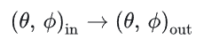

这部分可以看我之前的另一篇博客：[冲冲冲！](https://monsterstation.netlify.app/posts/cg/pbr/%E7%8E%B0%E4%BB%A3%E5%9B%BE%E5%BD%A2%E6%B8%B2%E6%9F%93%E6%8A%80%E6%9C%AFpbr)

## 总结

| 函数     | 全称                                                               | 特性                         | 典型应用场景             |
| -------- | ------------------------------------------------------------------ | ---------------------------- | ------------------------ |
| 全光函数 | Plenoptic Function                                                 | 描述光在空间中的传播和分布   | 光场渲染、光线追踪       |
| BRDF     | Bidirectional Reflectance Distribution Function                    | 描述表面单点的局部反射特性   | 实时渲染、基于物理的渲染 |
| SVBRDF   | Spatially Varying BRDF                                             | 考虑表面材质的空间变化       | 纹理材质模拟             |
| BSSRDF   | Bidirectional Scattering-Surface Reflectance Distribution Function | 包含次表面散射效应           | 半透明材质渲染（如皮肤） |
| BTF      | Bidirectional Texture Function                                     | 包含所有反射特性及非局部效应 | 超真实渲染、复杂材质模拟 |
