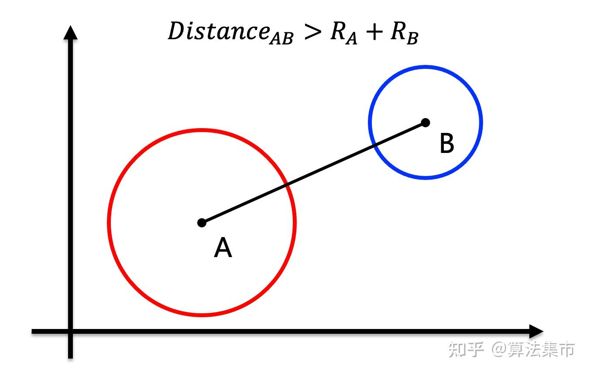
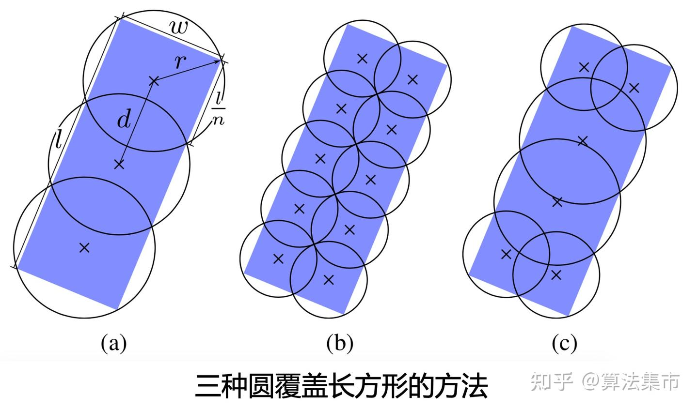
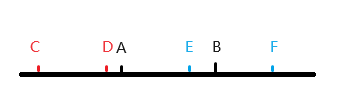
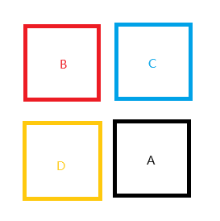
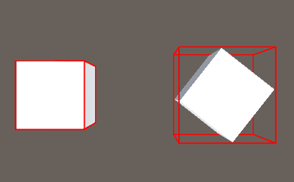
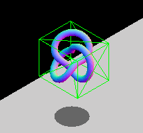

物理碰撞模拟中采用包围形检测，较为简单且常用的主要是两种：外接圆和轴对齐包围盒（AABB）。

## 外接圆

使用外接圆的方式来粗略判断是否碰撞是非常快的。只要两个圆形的圆心距离 大于 两个圆的半径之和，则这两个圆不相交。



当然，由于物体通常不会是一个标标准准的圆形，使用一个外接圆是非常粗略的。

为了提高判断的准确度，可以使用多个圆来覆盖长方形，在覆盖长方形的前提下，尽可能减少多余的覆盖区域，如下图所示。



## AABB

AABB 检测，即轴对齐包围盒（Axis-Aligned Bounding Boxes）检测，是一种检测两个物体有没有相交的算法。物体根据坐标轴形成包围盒，通过检测顶点关系来判断是否相交。

### 1维



如上图所示，在一维坐标轴中，存在一个物体 AB，一个物体 CD 以及一个物体 EF。

当我们要检测物体 AB 和 CD 是否相交的时候，我们不难看出，只要物体 CD 的最大坐标和最小坐标都不在物体 AB 的坐标之间，那我们就认为这两个物体没有相交。

当我们检测物体 AB 和物体 EF 是否相交的时候，我们观察到物体 AB 和物体 EF 的坐标相交了，因此这两个物体相交。

由此我们可以得出，当一个物体的最大坐标和最小坐标都不在另一个物体的最大坐标和最小坐标之间，则两个物体没有相交。

### 2维



同样的，我们在平面中也存在 A、B、C、D 四个物体。

对于物体 A 和物体 D，在 X 轴中，我们需要判断 D 的 X 最大值和 D 的 X 最小值都不在 A 的 X 最大值和 X 最小值中，我们就能判断连个物体不相交。

对于物体 A 和物体 C，在 X 轴中，我们需要判断 C 的 Y 最大值和 C 的 Y 最小值都不在 A 的 Y 最大值和 Y 最小值中，我们就能判断连个物体不相交。

因此，对于平面来说，我们只是拓展了一个轴的检测，并且这两个轴的检测只要有一个成立，就表示两个物体不相交。

我们在做平面 AABB 检测的时候会出现三种情况，即 B、C、D 三个物体和 A 物体之间的关系。这三种情况只要出现一种成立即可。所以，我们判断物体关系的时候就判断不成立的情况，用 **或** 来连接，可以减少计算量。并且当我们判断的时候可以直接用一个物体的最大值去比另一个物体的最小值，用最小值去比最大值，进一步减少计算。

### 3维

在三维空间中进行 AABB 检测与在二维空间中检测并无不同，只是要检测的轴再增加一个 Z 轴。三个轴之间的关系也是**或**的关系。

```cpp
//包围盒数据结构
using System.Collections;
using System.Collections.Generic;
using UnityEngine;

public class CollisionData : MonoBehaviour
{
    public Vector3 max = Vector3.zero;
    public Vector3 min = Vector3.zero;
}
---------------------------------------------
/// <summary>
/// AABB检测
/// <param name="data1"></param>
/// <param name="data2"></param>
/// </summary>//AABB检测
private bool CollisionAABB(CollisionData data1,CollisionData data2)
{
    //包围盒1的最小值比包围盒2的最大值还大 或 包围盒1的最大值比包围盒2的最小值还小 则不碰撞
    if (data1.max.x < data2.min.x || data1.max.y < data2.min.y || data1.max.z < data2.min.z ||
        data1.min.x > data2.max.x || data1.min.y > data2.max.y || data1.min.z > data2.max.z)
    {
        return false;
    }
    else
    {
        return true;
    }
}

```

AABB 检测在物体有旋转的情况下会造成包围盒过大，因此检测的精度不是很高。具体情况如下图所示。



具体成因，主要是AABB存在**轴对齐约束**。两个非旋转的盒子之间是否重叠可以只通过逻辑比较进行检查，而旋转的盒子则需要三角运算，计算速度较慢。如果你有旋转的物体，可以通过修改包围盒的尺寸，这样盒子仍可以包裹物体，或者选择使用另一种边界几何类型，比如球体（旋转不改变形状）。



## 实际

实际应用时，在游戏引擎中，对于AABB的处理，我们可以交由管理模型网格体的资源层自动计算，例如：

```cpp
struct AABB
    {
        glm::vec3 min;
        glm::vec3 max;

        constexpr glm::vec3 center() const { return (min + max) * 0.5f; }
        constexpr glm::vec3 extent() const { return max - min; }
    };

void Mesh::calculateAABB()
    {
        if (m_verts.empty())
        {
            m_aabb.min = glm::vec3(0.0f);
            m_aabb.max = glm::vec3(0.0f);
            return;
        }

        m_aabb.min = m_verts[0].position;
        m_aabb.max = m_verts[0].position;

        for (const auto& vert : m_verts)
        {
            m_aabb.min = glm::min(m_aabb.min, vert.position);
            m_aabb.max = glm::max(m_aabb.max, vert.position);
        }
    }
```
