碰撞检测中，通常分为 粗略碰撞检测 和 精细碰撞检测 两个步骤。

粗略碰撞检测用来将两个明显不相交的物体快速排除，使用 外接圆的包围形 或 轴对齐包围矩形（Axis Aligned Bounding Box，AABB）都是比较好的方式。

精细碰撞检测则用来准确判断两个物体是否相交。分离轴定理（Separating Axis Theorem，SAT）是一种可用于精确判断两个物体是否相交的算法，不仅适用于 Box（矩形），还适用于 凸多边形（Polygon）。基于分离轴定理的算法原理简单，即只要能找到一条可将两个多边形分开的直线，则这两个多边形不相交。

除了上文说到的SAT算法之外，GJK（Gilbert–Johnson–Keerthi）算法更加高效。

## 前置知识

### 凸多边形

凸多边形的定义：对于平面上的一个多边形，如果延长它的任何一条边，都使整个多边形位于一边延长线的同侧，这样的多边形叫做凸多边形。

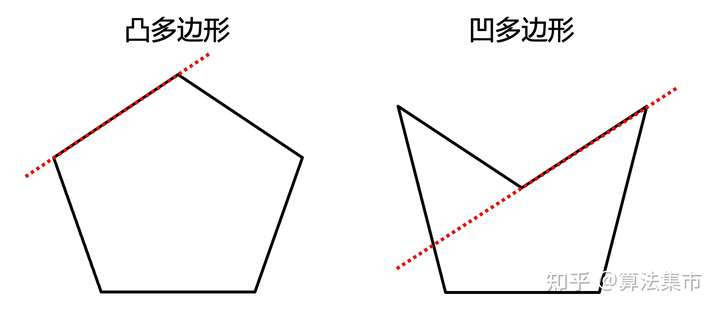

根据上述定义，人可以直观判断出一个多边形是否为凸多边形，但在程序中，如何判断一个多边形是否为凸多边形呢？

答案是利用向量的叉乘。如下图所示，根据多边形的顶点坐标，依次求出每条边的向量。

* 若多边形的顶点是逆时针序列，则向量的叉乘 a x b，b x c，c x d，d x e，e x a 的结果均大于0；
* 若多边形的顶点是顺时针序列，则向量叉乘的结果均小于0。
* 但若同时存在大于0 和 小于0 的结果，则说明是凹多边形。

### 闵可夫斯基差

闵可夫斯基差，也可以叫做闵可夫斯基和，它的定义也很好理解，点集A与B的闵可夫斯基和被定义为：

A + B = {a + b | a ∈ A，b ∈ B}

如果 A 和 B 是两个凸多边形，则 A + B 也是凸多边形。

闵可夫斯基和从几何上的直观理解是A集合沿B的边际连续运动一周扫过的区域与B集合本身的并集，也可以是B沿着A的边界连续运动扫过区域与A自身的并集。

GJK算法用到的不是闵可夫斯基和，而是闵可夫斯基差，即：

A - B = {a - b | a ∈ A，b ∈ B}

虽然使用的是减法运算，但其仍然是闵可夫斯基和，相当于先对B中的所有点做负运算（相对原点的镜像），然后再与A做加法。

**GJK算法的核心就是闵可夫斯基差，即若两个多边形相交，则它们的闵可夫斯基差必然包括原点。**

例如：

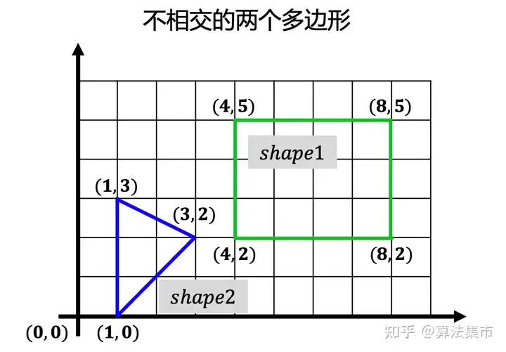

它们的闵可夫斯基差如下图所示，其闵可夫斯基差不包括原点，且两个多边形之间的距离就是其闵可夫斯基差到原点的距离。事实上，GJK 算法发明出来的初衷就是为了计算两个凸多边形之间的距离。

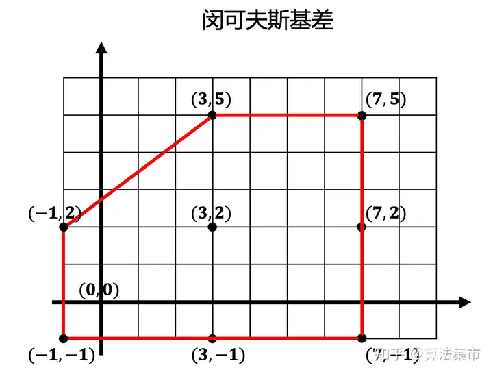

### 单纯形

k阶单纯形（simplex），指的是k维空间中的多胞形，该多胞形是k+1个顶点组成的凸包。

在GJK算法中，单纯形被大量使用。单纯形指的是点、线段、三角形或四面体。例如，0阶单纯形是点，1阶单纯形是线段，2阶单纯形是三角形，3阶单纯形是四面体。

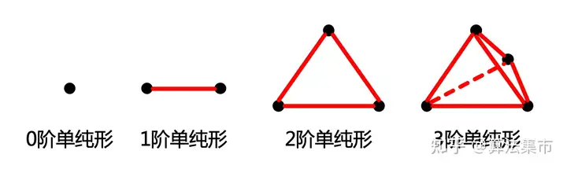

对于2维空间的多边形，最多用到2阶单纯形。那单纯形到底有什么作用呢？

对于上面两个相交的多边形例子，实际应用中，其实不需要求出完整的闵可夫斯基差，只需要在闵可夫斯基差内形成一个多边形，如下图所示，并使这个多边形尽可能包围原点，这个多边形就称为单纯形。即假如单纯形包围原点，则闵可夫斯基差必然包围原点。

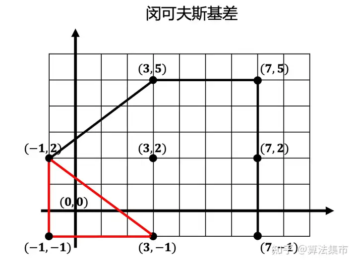

### Support函数

Support函数的作用是计算多边形在给定方向上的最远点。如下图所示，在向量 a 方向的最远点为 A 点，在向量 b 方向的最远点为 B 点。这里在寻找给定方向上的最远点时，需要用到向量的点乘。

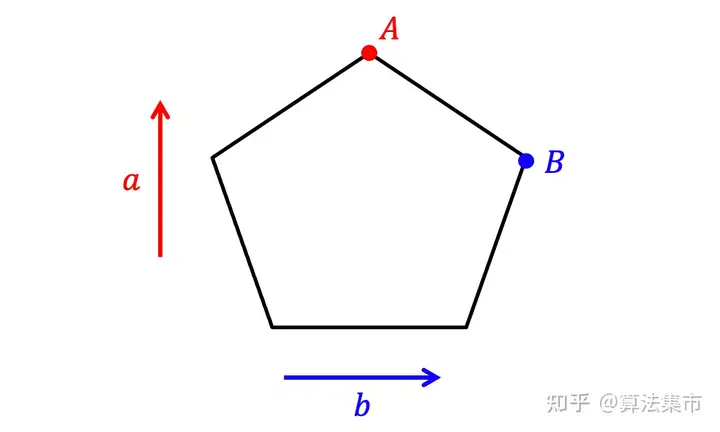

为什么需要Support函数呢？这是因为在构建单纯形时，我们希望尽可能得到闵可夫斯基差的顶点，而不是其内部的一个点，这样产生的单纯形才能包含最大的区域，增加算法的快速收敛性。

如下图所示，在给定向量 a 方向上，shape1 的最远点为（4，2），在向量 -a 的方向上，shape2 的最远点为（5，3），这两个点作差即得到点（-1，-1）。利用这种方式得到的点都在闵可夫斯基差的边上。

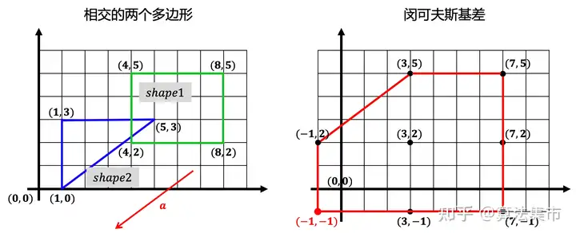

## GJK算法步骤

下图是 GJK 算法的伪代码，其核心逻辑是：给定两个多边形 p 和 q，以及一个初始方向，通过迭代的方式构建、更新单纯形，并判断单纯形是否包含原点，若包含原点则两个多边形相交，否则不相交。

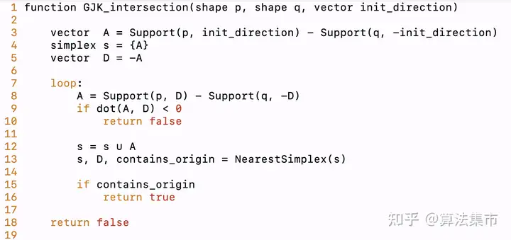

GJK 算法的具体步骤如下图所示。

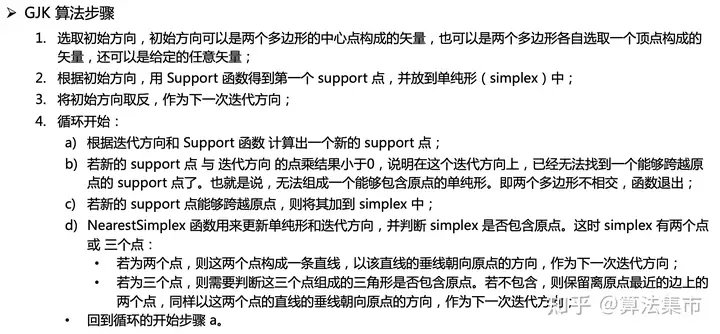

我们还是通过一个例子来理解上述步骤。

步骤1：选取初始方向 dir（0,1），如下图所示；

步骤2：多边形 p 在初始方向上 dir 的最远点为（4,5），多边形 q 在 -dir 方向上的最远点为（1,0），因此第一个 support 点为（3,5）；

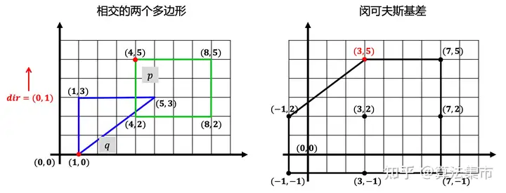

步骤3：将初始方向取反 dir 变成（0,-1）；

**第一次循环：**

步骤4a：根据迭代方向 dir（0,-1），得到第二个 support 点（3,-1），如下图所示；

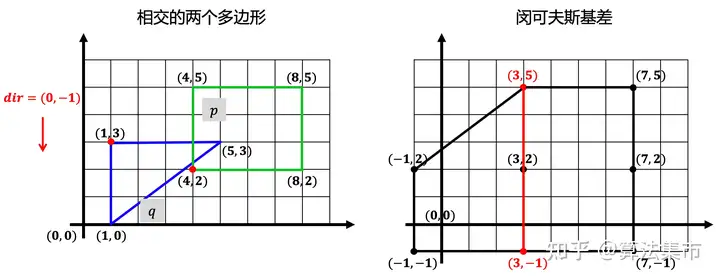

步骤4b：新的 support 点（3,-1） 与 迭代方向（0,-1） 的点乘结果大于0，说明跨越原点了；

步骤4c：新的 support 点能够跨越原点，将其加到 simplex 中，此时 simplex 中有两个点；

步骤4d：以这两个点的直线的垂线朝向原点的方向（-1,0），作为下一次迭代方向，如下图所示；

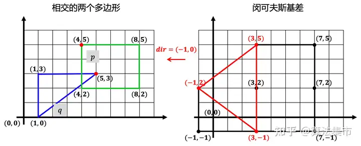

**第二次循环：**

步骤4a：根据迭代方向 dir（-1,0），得到 support 点（-1,2），如上图所示；

步骤4b：新的 support 点（-1,2） 与 迭代方向（-1,0） 的点乘结果大于0，说明跨越原点了；

步骤4c：新的 support 点能够跨越原点，将其加到 simplex 中，此时 simplex 中有三个点；

步骤4d：这三个点组成的三角形没有包含原点，保留离原点最近的边上的两个点（-1,2）和（3,-1），同样以这两个点的直线的垂线朝向原点的方向，作为下一次迭代方向（-3,-4）；

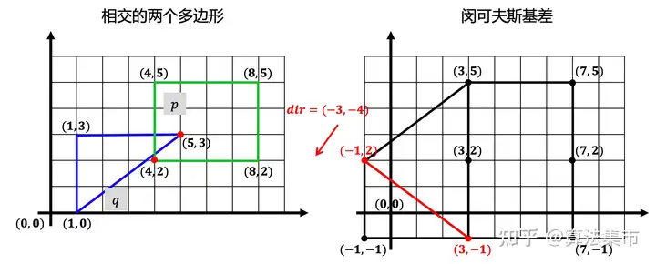

**第三次循环：**

步骤4a：根据迭代方向 dir（-3,-4），得到 support 点（-1,-1），如下图所示；

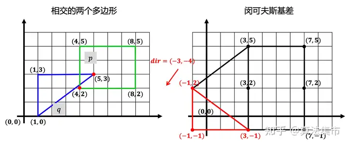

步骤4b：新的 support 点（-1,-1） 与 迭代方向（-3,-4） 的点乘结果大于0，说明跨越原点了；

步骤4c：新的 support 点能够跨越原点，将其加到 simplex 中，此时 simplex 中有三个点；

步骤4d：这三个点组成的三角形包含原点了，说明这两个多边形相交。到此结束。

从上面的示例中可以看出，GJK 是一种基于迭代的算法，其收敛速度取决于迭代方向。

到这里，我们对整个 GJK 算法步骤就有了一个基本认识。但是，在上面的步骤4d中，如何判断三角形是否包含原点，如何查找下一个迭代方向，以及如何计算两个不相交的多边形之间的距离，还需要有更细化的工作，这里不再进行叙述。

## 声明

本文参考大量下方文章的内容：

链接：https://zhuanlan.zhihu.com/p/511164248
