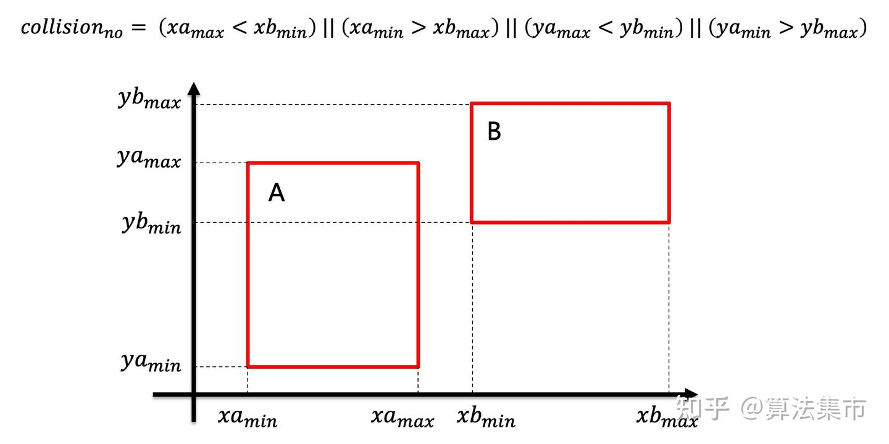
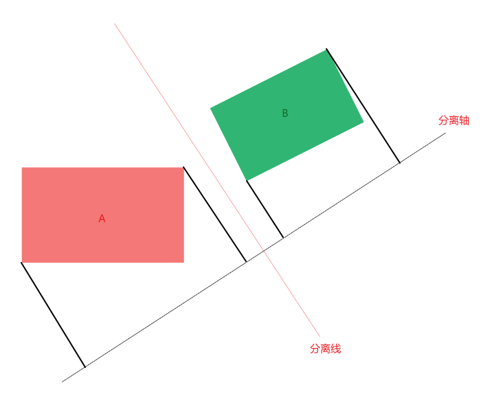
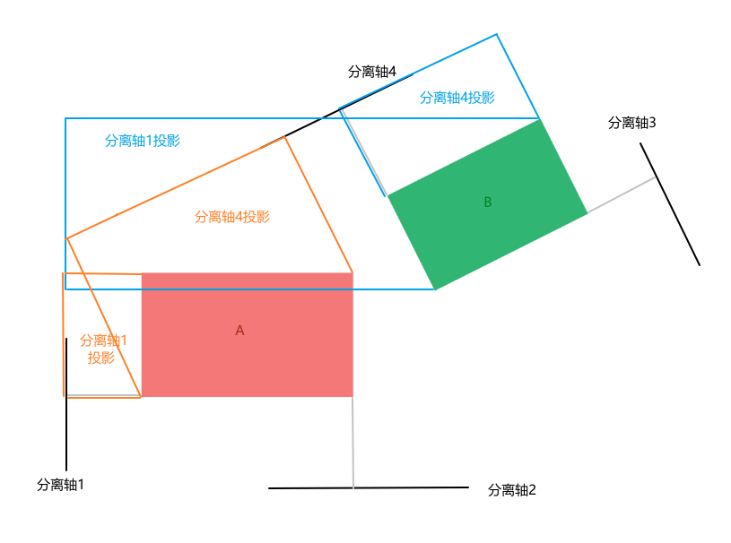
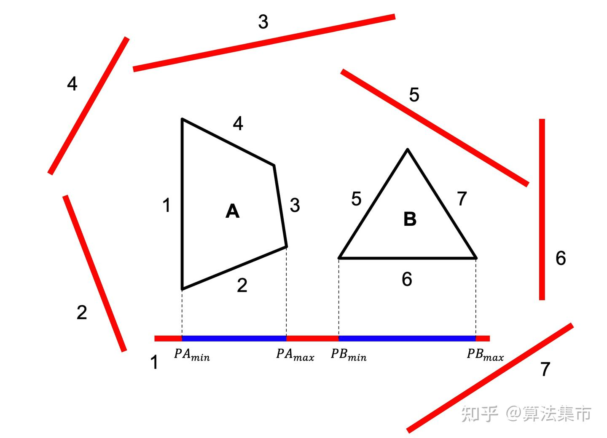
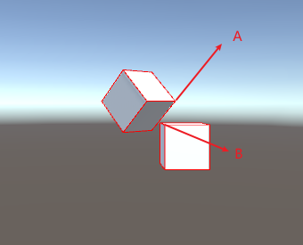

上一篇文章说到了，基于包围形的方法是一种粗略的碰撞检测方法，基于外接圆形的方法运算速度很快，但精度很差；基于轴对齐包围盒（AABB）的方法适合本身就是矩形的物体，其运算速度非常快，但检测精度还是不够。



所以接下来我们来说说OBB和SAT。

## OBB

OBB 检测，即有向包围盒（Oriented Bounding Box）检测，是一种检测两个物体有没有相交的算法。物体根据包围盒中心、包围盒大小以及包围盒旋转轴构造有向包围盒，该包围盒比 AABB包围盒更贴合旋转物体。OBB 检测利用 SAT（Separating AxisTheorem）分离轴算法进行相交检测，比 AABB检测具有更好的检测精度。

## SAT算法原理



对于两个凸多边形来说，若存在一条直线把两个凸多边形分开，那么垂直于这条直线的轴则称为分离轴。若两个物体在分离轴上的投影不相交，则两个物体不相交，并且一旦在某个轴上存在不相交的情况，则两个物体一定不相交，退出检测。

在实际运用中，我们常以凸多边形的边的垂线作为分离轴，依次检测物体在分离轴上的投影。

### 2维



在 2D 图形中，分离轴的数量为两个凸多边形物体的边数之和，如上图所示，4 条黑色的轴为分离轴。在分离轴 1 上，我们观察到物体 A的投影和物体 B 的投影相交了，因此在分离轴 1 上，两个物体相交；在分离轴 2 上，我们观察到两个物体的投影没有相交，因此两个物体在分离轴 2 上没有相交。

由此，我们可以得出 A、B 两个物体没有相交。通过观察图像我们也知道这个结果没错。

#### 实操

以下图中的两个多边形 A 和 B 为例，分离轴定理的具体步骤为：

1. 首先根据边1的两个顶点位置坐标，计算出边1的向量，设为（x，y）；
2. 进而求出边1的法向量，作为分离轴，为（y, -x）或（-y，x）。若需要求两个多边形的最小分离距离，这里的法向量还需要化为单位向量；若只需判断两个多边形是否相交，则不需要化为单位向量；
3. 依次将多边形 A 和 B 的所有顶点与原点组成的向量投影到这个分离轴上，并记录两个多边形顶点投影到分离轴上的最小值和最大值（Pmin，Pmax），形成一个投影线段；
4. 判断这两个投影线段是否发生重叠，若不重叠，则有 （PAmax < PBmin）||（PAmin > PBmax）；
5. 若两个投影线段不重叠，则代表存在这样一条直线将两个多边形分开，两个多边形不相交，可以直接退出循环；
6. 若两个投影线段重叠，则回到步骤1，继续以边2的法向量作为分离轴，进行投影计算；
7. 当两个多边形的所有边都检查完之后，找不到这样一条分离的直线，则意味着两个多边形相交。



### 3维

在 3D 中，我们以一个有向的长方体来包围物体，即 OBB。

由于长方体的坐标轴两两垂直，因此坐标轴即是分离轴。由于两个长方体之间还存在特殊的摆放。



在这种情况下，两个包围盒的坐标轴分离轴投影均相交，但是这两个物体并没有相交，两个物体之间还是存在一个面能够把两个物体分开，这个面就是向量 A 和向量 B 构成的平面。

利用向量叉乘的性质，我们可以求出一个垂直于这个面的向量，我们以这个向量为新的分离轴。两个物体每两条边构成的面都需要求垂直向量，因此两个 OBB 包围盒之间有 `3 * 3 = 9` 条新的分离轴。加上原来两个向量的 `3 + 3 = 6` 条分离轴，在 3D 中一共要检测 `15`条分离轴。

对于其中一条分离轴，我们遍历顶点作为向量，投影到分离轴上，筛选出最大和最小值。对两个物体进行同样的操作后，我们比较两个物体的投影最值有无相交。每条分离轴以此方法操作即可。

```cpp
//包围盒数据结构
using System.Collections;
using System.Collections.Generic;
using UnityEngine;

public class CollisionData : MonoBehaviour
{
    public Vector3[] vertexts = new Vector3[8];
    public Vector3[] axes = new Vector3[3];
    public Vector3 center = Vector3.zero;
}
---------------------------------------------
/// <summary>
/// SAT分离轴碰撞检测之OBB检测
/// <param name="data1"></param>
/// <param name="data2"></param>
/// </summary>
private bool CollisionOBB(CollisionData data1,CollisionData data2)
{
    //求与两个OBB包围盒之间两两坐标轴垂直的法线轴 共9个
    int len1 = data1.axes.Length;
    int len2 = data2.axes.Length;
    Vector3[] axes = new Vector3[len1 + len2 + len1 * len2];
    int k = 0;
    int initJ = len2;
    for (int i = 0; i < len1; i++)
    {
        axes[k++] = data1.axes[i];
        for (int j = 0; j < len2; j++)
        {
            if (initJ > 0)
            {
                initJ--;
                axes[k++] = data2.axes[j];
            }
            axes[k++] = Vector3.Cross(data1.axes[i], data2.axes[j]);
        }
    }


    for (int i = 0, len = axes.Length; i < len; i++)
    {
        if (NotInteractiveOBB(data1.vertexts, data2.vertexts, axes[i]))
        {
            //有一个不相交就退出
            return false;
        }
    }
    return true;
}

/// <summary>
/// 计算投影是否不相交
/// </summary>
/// <param name="vertexs1"></param>
/// <param name="vertexs2"></param>
/// <param name="axis"></param>
/// <returns></returns>
private bool NotInteractiveOBB(Vector3[] vertexs1, Vector3[] vertexs2, Vector3 axis)
{
    //计算OBB包围盒在分离轴上的投影极限值
    float[] limit1 = GetProjectionLimit(vertexs1, axis);
    float[] limit2 = GetProjectionLimit(vertexs2, axis);
    //两个包围盒极限值不相交，则不碰撞
    return limit1[0] > limit2[1] || limit2[0] > limit1[1];
}

/// <summary>
/// 计算顶点投影极限值
/// </summary>
/// <param name="vertexts"></param>
/// <param name="axis"></param>
/// <returns></returns>
private float[] GetProjectionLimit(Vector3[] vertexts, Vector3 axis)
{
    float[] result = new float[2] { float.MaxValue, float.MinValue };
    for (int i = 0, len = vertexts.Length; i < len; i++)
    {
        Vector3 vertext = vertexts[i];
        float dot = Vector3.Dot(vertext, axis);
        result[0] = Mathf.Min(dot, result[0]);
        result[1] = Mathf.Max(dot, result[1]);
    }
    return result;
}

```

综上，分离轴定理是一种适用于 bounding box 和 polygon 的精细碰撞检测算法，其优点是算法原理简单，可准确判断两个多边形是否相交；缺点在于当多边形的边数较多时，该算法的效率较低（当两个多边形相交时，需要遍历完所有边进行判断）。

在实际应用中，为了提高效率，通常 **先使用 基于轴对齐包围矩形（AABB）的方法进行粗略的碰撞检测，然后再使用 分离轴定理（SAT）做精细碰撞检测** 。

同时值得一提的是，OBB 检测只能是凸多边形，不适用于凹多边形的情况。凹多边形可以分割为凸多边形进行检测。
