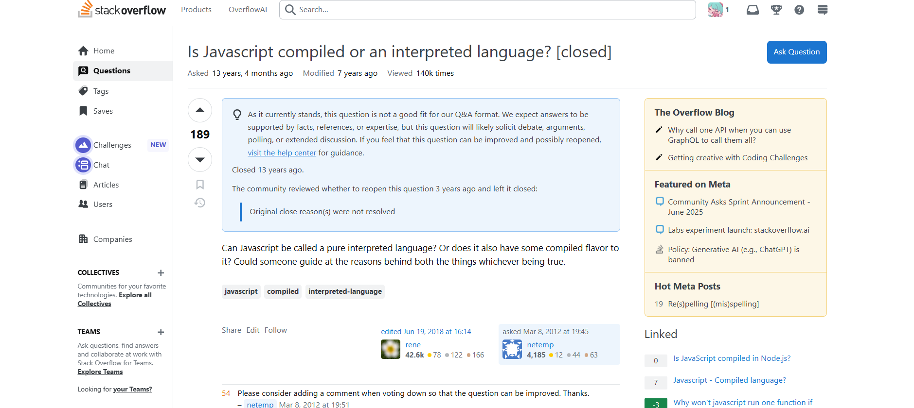
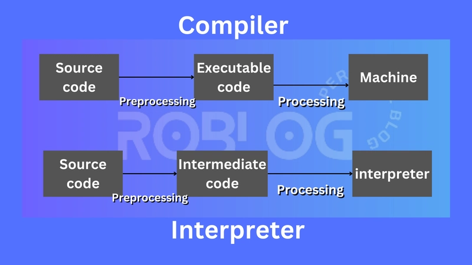

今天一个人在C++、C#、TS、JS之间轮轴切换地看代码的时候，虽然很磨练大脑，却冥冥之中有一些奇怪的感觉：

虽说一致认为Typescript和Javascript这类【前端专用】的语言是“解释型”语言，而C++和C#这类和编译器同生共死的语言是“编译型”语言。

如果说Javascript依赖于V8或者Nodejs这层v8wrapper来运行的时候，首先解释成字节码来运行，然后对热点部分进行JIT得到机器码来运行，可以被称为“解释”的话...

那么C#先编译成IL这种中间表示，再选择性加载.NET或者Mono的动态链接库的行为，明明就很像是在解释啊喂！

自己胡乱纠结了半天，也没有想到能说服自己的结论，于是就到网上一顿乱找，还真找出来了很久以前的一个陈年帖子：



原来13年前就有人和我有一样的疑惑了吗，汗...

顺着这个逻辑链，我又找到了几篇其他的提问和博客，最终的得出一个结论：

编译型或者解释型这个说法虽然常用，但对于给语言分类，确实是没什么用的**二极管思维**。与其说某个语言是编译型或者解释型，不如说语言执行过程的某个步骤是进行编译还是进行解释。

## 传统而生硬的分类法

> 每个程序都是一组指令，无论是添加两个数字还是通过互联网发送请求。编译器和解释器将人类可读的代码转换为计算机可读的机器代码。
>
> 对于编译型语言，目标计算机以编译语言直接翻译程序。而对于解释型语言，源代码不会直接由目标计算机翻译，而是由 *另一个* 程序（即解释器）读取并执行代码。

我们常常认为，编译语言直接转换为处理器可以执行的机器代码。作为结果，它们会比解释语言更快更高效地执行。 它们还使开发人员可以更好地控制硬件方面，例如内存管理和 CPU 使用率。编译语言需要一个“构建（Build / Make / Compile）”步骤——首先需要手动对其进行编译。每次需要进行更改时，你都需要“重建”程序。

相反，解释型语言是逐行执行程序的每个命令。每次读到一句，就对状态进行一次更新，然后继续读下一句，有一种像在不断"Tick"的感觉。

作为一种公认，纯编译语言的示例是 C，C ++，Erlang，Haskell，Rust 和 Go，而常见的解释语言的示例是 PHP，Ruby，Python 和 JavaScript。

解释型语言曾经比编译型语言慢很多。但是，随着JIT（即时编译）的发展，这种差距正在缩小。大多数编程语言可以同时具有编译和解释的实现——语言本身不一定是编译或解释的。但是，为简单起见，通常将其简称为某一类。

## 编译器和解释器

### 编译器

编译器是一种软件工具，可以将人类可读的源代码转换为机器可执行的代码。编译过程涉及几个阶段，包括

* 词汇分析
* 语法分析（解析）
* 语义分析
* 代码生成
* 优化

在词法分析过程中，编译器将源代码分解成一系列标记，这些标记是具有独立含义的单元。例如，在语句 中 `"x = 5 + 3;"`，标记将是 `"x"`、`"="`、`"5"`、`"+"`和 `"3"`。词法分析器还会为每个标记分配一个类型，例如“标识符”、“操作符”或“文字”。

然后，在语法分析（解析）过程中，编译器检查标记的顺序和结构，以确保它们构成有效的程序。这涉及分析编程语言的语法并构建表示程序结构的语法树。

语法分析完成后，编译器会执行语义分析，检查代码中的逻辑错误。这包括验证程序是否遵循语言规则，例如类型检查、作用域规则和函数调用。

一旦编译器验证了程序的正确性，它就会生成计算机可以执行的机器码或字节码。这涉及将语法树和语义信息转换为计算机硬件可以执行的低级指令。

最后，编译器进行优化，以提高生成代码的效率。此过程包括分析代码并进行修改以提高内存使用率。

总而言之，编译器是将人类可读的源代码转换为机器可执行代码的重要工具。编译过程包含多个阶段，每个阶段对于生成正确高效的代码都至关重要。

### 解释器

解释器是一种程序，它直接读取并执行用高级编程语言编写的代码，无需中间的编译步骤。与编译器在执行之前将整个源代码翻译成机器码不同，解释器逐行读取并执行源代码，遇到每个语句时就进行翻译和执行。

当解释器运行程序时，

* 它首先对源代码进行词法分析和解析，以生成表示程序结构的抽象语法树（AST）。
* 然后，解释器遍历抽象语法树 (AST)，依次执行每个节点。在执行过程中，解释器可能会生成并操作其他数据结构来表示程序的状态，例如用于跟踪变量值的符号表。

使用解释器的一个优点是它允许更动态和交互式的开发，因为程序员可以即时测试和修改代码，而无需重新编译整个程序。然而，解释代码可能比执行编译代码慢，因为解释器必须执行额外的工作来翻译和执行每个语句。

总的来说，解释器提供了一种以高级语言执行代码的便捷方法，但在某些情况下其性能可能不如编译代码。



## Javascript究竟是如何翻译的

JavaScript 自最初作为一种简单的脚本语言诞生以来，已经取得了长足的进步。早期的 JavaScript 引擎仅仅是解释器，逐行执行代码。然而，随着 JavaScript 越来越流行，用例也越来越广泛，性能问题也随之显现。即时解释代码会导致性能损失，尤其对于复杂的应用程序而言。这促使人们开发出使用即时 (JIT) 编译器的新引擎。

JIT 编译器不同于传统的编译器，例如用于 C++ 的编译器。传统的编译器在编译期间有充足的时间优化代码，但 JIT 编译器必须在代码执行之前进行编译。JavaScript 代码一旦即将运行，就会被编译成可执行的字节码。

尽管 JavaScript 的编译方式与其他编译型语言有所不同，但其编译过程仍然遵循一些与传统编译器相同的规则。JavaScript 代码在执行前会被解析，这使得它看起来像是一种解析型语言。然而，代码在执行前会被转换为二进制形式。

为了更好地理解这个过程，让我们仔细看看代码执行在幕后是如何进行的：

* 首先，使用 Babel 或 Webpack 等工具对代码进行转换。
* 转换后的代码被提供给引擎，引擎将其解析为抽象语法树 (AST)。
* 然后，AST 被转换为机器可以理解的字节码。这被称为中间表示 (IR)，并由 JIT 编译器进一步优化。
* 优化后，JS 虚拟机（VM）执行代码。

因此，我们可以得出结论，JavaScript 的执行分为三个阶段：

* 解析
* 编译
* 执行

看这样一段代码：

```javascript
console.log("Hello");
for(var i = 0;i<4;i++) {
    console.log(Hello);
}

```

上述代码示例中的输出展示了解释器的行为，其中 first `Hello`被打印到控制台，然后报告错误。这个输出有力地证明了 JavaScript 是一种解释型语言。

虽然 JavaScript 代码看起来像是逐行执行的，但这仅在解析阶段才成立。实际上，整个代码会在执行前一次性编译，转换为机器可读的代码。因此，JavaScript 是一种即时编译语言，在其第一阶段使用解释器。

事实上，V8 从未包含任何类似解释器的东西，而目前大多数主流 JS 引擎都配备了 JIT 编译器。因此，“JavaScript 是解释型的”这种说法显然是错误的，或者说许多人（比如我）对解释器/编译器的定义本身就是错误的。

Chrome 中使用的 V8 JavaScript 虚拟机不包含解释器。它由两个编译器组成，可以动态编译代码。其中一个编译器运行速度很快，但生成的代码效率低下；另一个编译器是优化编译器。

无论怎样，我们只能说Javascript是没有静态编译器的，但是不能说它就是解释型语言。

## 逐渐模糊的边界

### JIT

脚本语言 JIT 编译器的出现模糊了编译和解释之间的界限，以至于这个问题的意义已经变得不那么重大了。

只有当引擎读取一行代码并立即执行时，才算是解释吗？Shell 脚本通常仍然以这种方式实现。

当引擎获取整个文件，立即将其编译为字节码，然后解释执行该字节码时，才算是解释吗？古早的Mozilla 引擎就是这样工作的，CPython 也是如此。

当引擎一次解析一个函数，然后将其 JIT 编译为本机代码时，才算是解释吗？那些将整个文件编译为字节码，然后根据需要一次 JIT 执行一个函数的引擎又如何呢？事实上，如今大多数脚本引擎都以这种方式工作，主要的 Java VM 也以这种方式工作，只是编译为字节码的过程是预先进行的。

很早的Javascript确实是为解释设计的，它有一个 `eval`函数和一个 `Function`构造函数，你可以将程序代码以字符串的形式传入，然后执行，能够在运行时动态构建程序代码需要引擎能够解释源代码。

### 字节码和虚拟机

字节码和虚拟机的引入进一步模糊了编译与解释的界限。字节码是一种中间表示形式，介于源代码和机器码之间。它比源代码更接近机器码，但仍然需要虚拟机（VM）来执行。

许多现代语言（如Java、C#、Python等）都采用了字节码和虚拟机的架构：

1. **Java** ：源代码被编译为JVM字节码，然后由JVM解释执行或JIT编译为机器码
2. **C#** ：源代码被编译为CLR（公共语言运行时）的中间语言（IL），然后在运行时由CLR执行
3. **Python** ：源代码被编译为Python字节码（.pyc文件），然后由Python虚拟机执行

这种架构结合了编译和解释的优点：

* 编译为字节码阶段可以进行静态分析和优化
* 虚拟机执行时可以根据运行时信息进行动态优化
* 实现了跨平台性，因为字节码可以在任何有虚拟机的平台上运行

### AOT

AOT编译是另一种混合模式，它试图在保持灵活性的同时提高性能。与JIT（Just-in-Time）编译不同，AOT编译在程序运行前就将字节码或中间表示编译为机器码。

现代语言和运行时环境越来越多地采用AOT编译：

* **Java** ：通过GraalVM可以实现AOT编译
* **C#** ：.NET Native可以将IL代码AOT编译为本地代码
* **JavaScript** ：一些框架（如React Native）允许将JavaScript代码AOT编译

AOT编译提供了接近传统编译语言的性能，同时保留了高级语言的抽象能力。但它也失去了JIT编译能根据运行时信息进行优化的优势。

## 结论

所以说，这种编译型还是解释型的辩论是永无止境的，它就像社区里常见的编程语言孰强孰弱一样。说到底这种争论就像**甜豆腐脑还是咸豆腐脑好吃**一样...
