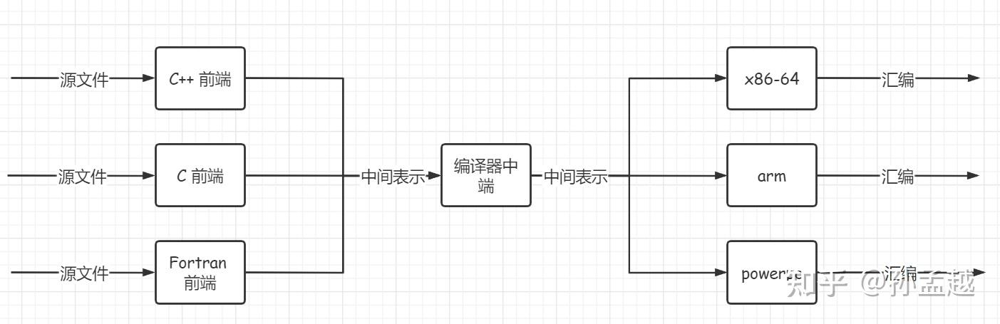
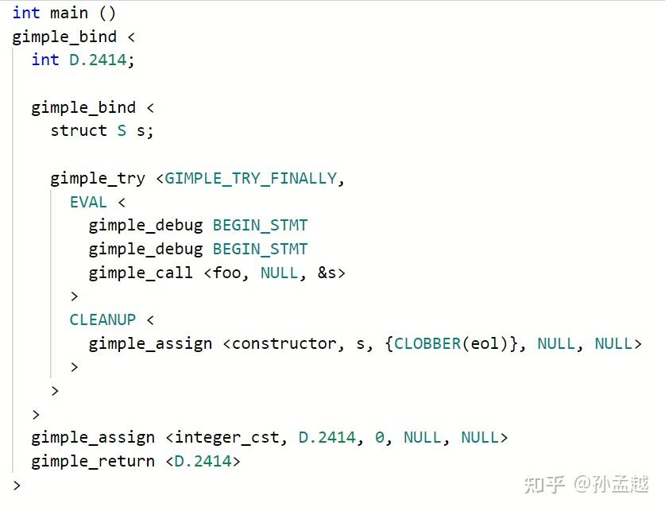
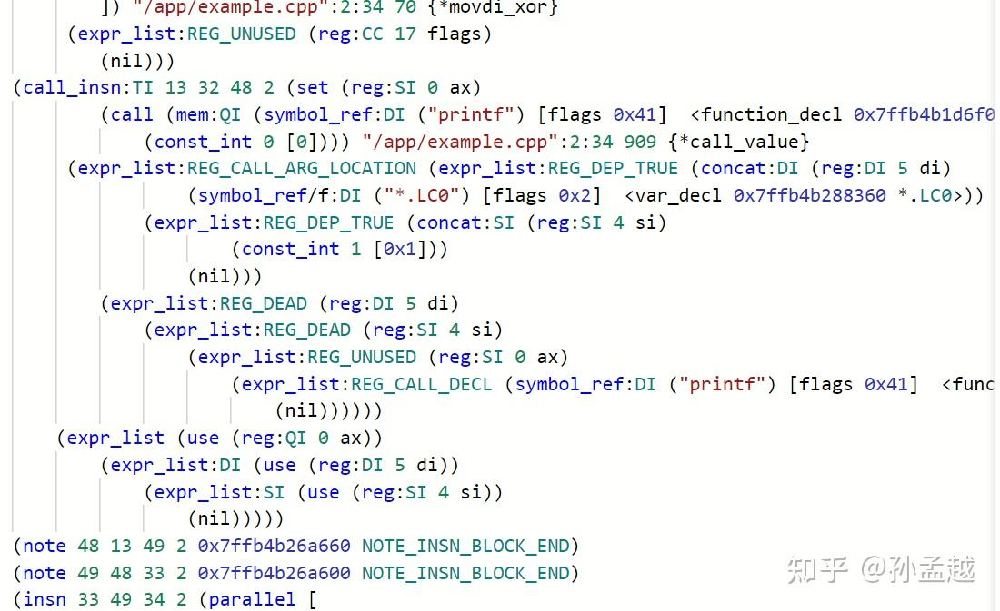
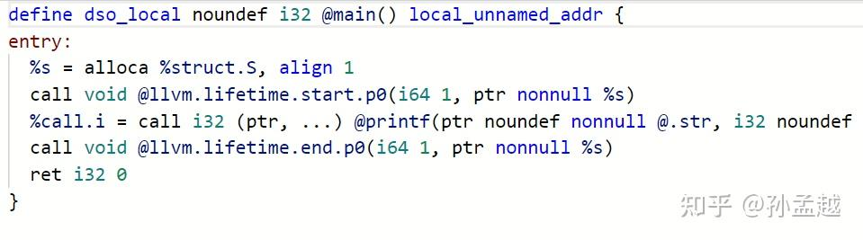
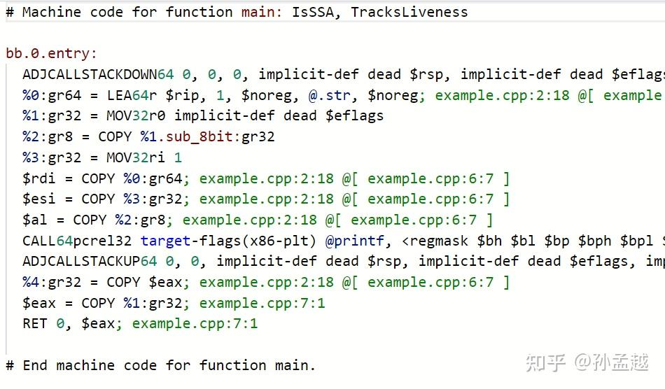
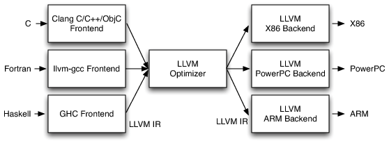
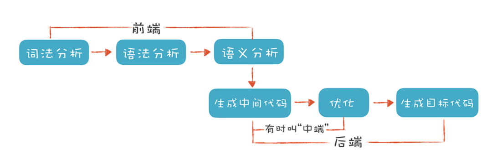
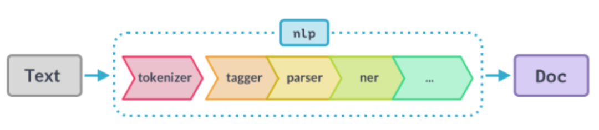
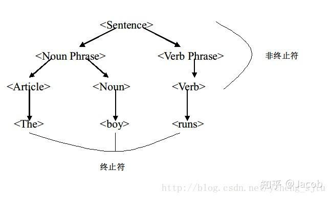

笔记中如有涉及源码的部分，参考以下库：

::github{repo="gcc-mirror/gcc"}

## 编译器到底是个什么东西？

说到底，编译器也是一个**程序**：输入字符串，输出目标代码。

从总体上看有如下过程：

1. 词法分析：读入源码字节，将其组成有意义的TOKEN流。比如把 `return` 这六个字符放在一起, 理解成为一个单词。
2. 语法分析：根据TOKEN流构建树形的中间表示，也就是生成AST抽象语法树。
3. 语义分析：检查是否和语言的定义一致，并且会收集信息放入语法树中以便在随后的代码生成过程中使用。
4. 中间代码生成：根据语法树生成低级的中间表示。在GCC里叫做GIMPLE，而在LLVM里叫做LLVM IR。（至此编译器前端的任务结束）
5. 代码优化：优化中间代码。大家会操作**编译器的中间表示**，而忽略掉原始的编程语言，不管你是用C还是Rust，优化都会在中间代码上进行。（至此编译器中端的任务结束）
6. 汇编代码生成：优化后的重点代码被送到编译器后端，对中间代码进行进一步优化，产生另一种中间代码，在 GCC 里叫 RTL (寄存器转移语言), 在 LLVM 里面则是 LLVM MIR (机器中间表示)，最后根据这种中间代码生成平台特定的汇编代码。

这里展示GIMPLE 和更低级的 RTL

再给大家看看对应的 LLVM IR 和 LLVM MIR 的样子:

（上述图片来自知乎@孙孟越）

在设计理念上，各有千秋

* GCC 和 LLVM 的 IR 设计理念不同。GIMPLE 是高层次 IR，保留较多语言语义，适合前端优化；LLVM IR 更低层次，接近机器表示，适合跨语言和跨平台的优化。
* RTL（GCC） vs. MIR（LLVM）：RTL 是 GCC 的寄存器转移语言，偏向传统编译器设计；MIR 是 LLVM 的机器级 IR，设计更现代，优化空间更大。

在做项目的过程中，我们用的最多的是对**配置文件**（例如json、xml等，讲的好听一点就是DSL，领域特定语言）进行分析，然后执行自定义的操作，那么下面就来看这部分的基础知识。

## 重新认识编程语言

我们常常听到关于编译器讨论中的**前后端**这一术语，当然，这与互联网Web开发的前后端不是一回事。

一般情况下我们认为，开发者常用的编程语言由编译器前端负责，计算机读取的汇编代码的由编译器后端负责，通过某种**中间表示（IR）**，将M * N复杂度的问题降低为M + N的复杂度。

忽略掉一个项目文件中各种不同后缀文件（例如.c  .h  .json  .xml）繁杂的用途，按其表达能力，可以分为两种：

* DSL（Domain Specific Language）：**特定领域语言**，比如用来描述数据的 json、用来查询数据的 sql、标记型的 xml 和 html，都属于面向特定领域的专用语言。它们的一个特性就是对于某一种类型的工作非常合适，但是并不具备实现任意功能的能力（没有人会用SQL来写一个软光栅渲染...）
* GPL（General Purpose Language）：**通用用途语言**，也就是我们常说的编程语言。比如 C、JavaScript、Rust，这类语言是 **图灵完备** 的，你可以用一门 GPL 语言去设计和实现一种 DSL 语言。

:::tip

虽然很难以置信，但是yaml 是图灵完备的...

:::

不管是为特定领域而发明的各类 DSL，还是图灵完备的 GPL 语言，他们基本都符合 BNF（ **巴科斯范式** ）。

wiki告诉了我们这BNF是个什么玩意：

> **BNF** 规定是[推导规则](https://zh.wikipedia.org/w/index.php?title=%E6%8E%A8%E5%AF%BC%E8%A7%84%E5%88%99&action=edit&redlink=1)(产生式)的集合，写为：
>
> <符号> ::= <使用符号的表达式>
>
> 这里的 <符号> 是[非终结符](https://zh.wikipedia.org/wiki/%E9%9D%9E%E7%BB%88%E7%BB%93%E7%AC%A6)，而[表达式](https://zh.wikipedia.org/wiki/%E8%A1%A8%E8%BE%BE%E5%BC%8F)由一个符号序列，或用指示[选择](https://zh.wikipedia.org/wiki/%E9%80%89%E6%8B%A9)的[竖杠](https://zh.wikipedia.org/w/index.php?title=%E7%AB%96%E6%9D%A0&action=edit&redlink=1) '|' 分隔的多个符号序列构成，每个符号序列整体都是左端的符号的一种可能的[替代](https://zh.wikipedia.org/w/index.php?title=%E6%9B%BF%E4%BB%A3&action=edit&redlink=1)。从未在左端出现的符号叫做[终结符](https://zh.wikipedia.org/wiki/%E7%BB%88%E7%BB%93%E7%AC%A6)。

emmm，似乎跟没说一样。简而言之，BNF 就是一种  **上下文无关文法** 。

一个相反的例子就是，人类的自然语言是一种 上下文**有关**文法，我完全可以在这篇文章的末尾加上"以上内容全部都是笔者臆想出来的，仅供参考"来浪费大家的时间。

这些其实都是在 **静态层面** 上对语言的描述，为了实际执行这些语言，就需要对其进行解析，还原出语言本身所描述的信息结构。这件事，在计算机领域的课程叫《编译原理》，在智能科学与技术的课程叫《自然语言理解》。

不难看出，两者的流程惊人的相似：

* 都需要先进行 tokenize 处理，编译器做的是 **词法分析** （常用工具是 lexer），NLP 做的是 分词（最常见的是 jieba 分词）
* 词法分析的产物是有含义的 token，下面都需要进行 **语法分析** （即 parser），NLP 里通常会做 向量化（最常见的是 word2vec 方法）
* 这两步完成后，编译器前端得到的产物是 AST（Abstract Syntax Tree，抽象语法树），NLP 得到的产物是一段话的向量化表示

DSL 是面向特定用途的语言，以 JSON 为例，得到 AST 就已经有完整的信息结构了，在面向对象语言里无非再多一步**利用反射将其映射到一个 class 的所有字段里**；以 HTML 为例，得到 AST 就已经有完整的 DOM 树了，浏览器已经具备渲染出整个网页所需的大部分信息。

对 GPL 语言来说，编译型语言(例如C/C++ , Rust)目的是生成**机器可执行的代码**，解释型语言(例如Javascript , Python)的目的是生成**虚拟机认识的中间代码**。

## 术语一句话解释

### 上下文无关文法

从直观上理解，所谓上下文无关文法，指某个单词（word）的含义可以直接理解，而不必考虑其上下文。例如C++中的所有for，都标志"我要开始一段循环了"。

### 终结符

BNF 中还提到了终结符和非终结符的概念，又该如何理解？

这一点其实可以类比于自然语言（如英语的识别过程）。

回到我们之前的定义上，所谓上下文无关文法，即**在进行句子识别时，不用非到终止符才完成识别**。

我们读一段C语言代码 `for(int i=0;i<nums.size;i++)`的时候，想象我们的大脑把它编译成自然语言，读作"对于 i 从 0 开始，当 i 小于 nums 的 size 的时候执行，然后 i ++"，我们不会思考for到底在这里表达什么具体的意思，一旦它出现在我们的视野中，即使用自然语言读出来，我们也会固定地把它读成"对于"，然后开始思考这个循环的逻辑就行了。

### NFA/DFA

FA 表示 Finite Automata（有穷状态机），即根据不同的输入来转换内部状态，其内部状态是有限个数的。而 NFA 和 DFA 分别代表 **有穷不确定状态机** 和 **有穷确定状态机**。运用子集构造法可以将 NFA 转换为 DFA，让构造得到的 DFA 的每个状态对应于 NFA 的一个状态的集合。

### 编译器前端执行流程

首先预处理器插入新的文本，然后词法分析器（lexer）生成终结符，而语法分析器（parser）则利用自顶向下或自底向上的方法，利用文法中定义的终结符和非终结符，将输入信息转换为 AST（抽象语法树）。

之后，parser 进一步还会调用不同的子模块进行 **语义处理** ，主要是如下这些：

1. 处理函数/变量的声明. 在文件 `gcc/cp/decl.cc`, `gcc/cp/decl2.cc` 之中.
2. 处理模板 (parameterized types). 在文件 `gcc/cp/pt.cc` 之中.
3. 函数调用以及重载决议. 在文件 `gcc/cp/call.cc` 之中. 我也写过一篇关于函数重载的[文章](https://zhuanlan.zhihu.com/p/351145406), 其机制非常复杂.
4. 名字查找. 在文件 `gcc/cp/name-lookup.cc` 之中.
5. 类的处理. 在文件 `gcc/cp/class.cc` 之中.
6. 类型检验, 比如检查是不是完整类型. 在文件 `gcc/cp/typeck.cc` 之中.
7. 语义检查, 比如不可使用 private 函数等. 在文件 `gcc/cp/semantics.cc` 之中.
8. coroutine 功能. 在文件 `gcc/cp/coroutine.cc` 之中.

最后产出IR中间代码，前端部分就结束了

### 编译器后端执行流程

下一步是把 AST 变成 GIMPLE, 这个过程叫 gimplify。在这里会做一些耳熟能详的优化，包括删除死代码，分支预测（CPU中经常用的概念），向量化，循环优化等。不同的优化选项, 比如 `O1 O2 O3`就是在这一部分生效。给编译器传递一个 `-fdump-tree-all` 的选项, 它就会 dump 出 GIMPLE(SSA) 结果。

下一步, 就是从 GIMPLE 到 RTL 。这里涉及到一些, 像是寄存器分配、合并指令、去除死代码、去掉无意义的 jump、指令重排之类的 pass。给编译器传递 `-fdump-rtl-all` 的选项可以打印出全体 RTL pass 的输出。

## 编译体系

这里我直接引用孙孟越大神的原话，很有启发性：

> 2023 年的我对 build system 有了更加深刻的认知, 在这里稍微介绍一下.
>
> 首先, 需要有个东西, 他去管理该编译哪些东西, 很多时候不需要编译每一个翻译单元. 这个系统的典型例子就是 GNU Make. 当你提供了一个 build script, 告诉他应该怎么正确的编译以后. 他就可以根据这个 build script 实现正确的增量编译方案.
>
> 但是这个 build script 从哪里来呢? 于是有了更进一步的抽象. 现代 C++ 中, 最广泛采用的就是 CMake. 典型应用就是 CMake 分析你告诉他的一些关系, 然后计算出 build script, 再交给像 GNU Make 这种工具去 build.
>
> 说回 GCC 这个项目, 它用的就是 GNU Make, 但由于它的诞生时代, 他用的是 Autoconf 输出 Makefile, 也就是 Autoconf + GNU Make. 像 LLVM 这种更现代的项目, 它用的就是 CMake 输出 Ninja build script. 默认用的是 CMake+Ninja 的组合.

Build system 的核心在于高效管理编译过程，避免重复工作。像 GNU Make 这样的工具，通过解析 Makefile，基于文件时间戳或内容哈希判断哪些文件需要重新编译。这种增量编译极大提升了开发效率，尤其在大型项目中。

同时，手动写 Makefile 是痛苦的，尤其是复杂项目。CMake、Autoconf 等工具的出现，将开发者从繁琐的脚本编写中解放出来。

Ninja 是一个专注于速度的 build system，相比 GNU Make，它的语法更简单，执行效率更高。CMake + Ninja 的组合在 LLVM 等项目中流行，因为 CMake 提供了强大的配置能力，而 Ninja 则优化了实际构建过程。

也就是说，Build system 的本质是 **依赖管理和增量编译** 。它需要解决以下问题：

* **正确性** ：确保所有依赖正确解析，编译顺序无误。
* **效率** ：通过增量编译（只重新编译修改的部分）减少构建时间。
* **可维护性** ：降低配置复杂度，适应不同平台和项目规模。

此外，C/C++的编译器急需**与语言生态的整合** ，Rust 的 Cargo 集成了构建、包管理和测试，用了就知道有多舒服。Conan和vcpkg或许在C++上做得并不出众。
