## 冯诺伊曼模型

按照冯诺伊曼模型，程序在计算机上执行的过程类似：

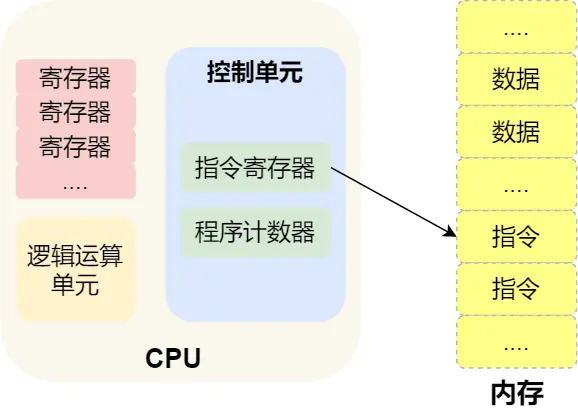

程序实际上是一条一条指令，所以程序的运行过程就是把每一条指令一步一步的执行起来，负责执行指令的就是 CPU 了。

那 CPU 执行程序的过程如下：

- 第一步，CPU 读取「程序计数器」的值，这个值是指令的内存地址，然后 CPU 的「控制单元」操作「地址总线」指定需要访问的内存地址，接着通知内存设备准备数据，数据准备好后通过「数据总线」将指令数据传给 CPU，CPU 收到内存传来的数据后，将这个指令数据存入到「指令寄存器」。
- 第二步，「程序计数器」的值自增，表示指向下一条指令。这个自增的大小，由 CPU 的位宽决定，比如 32 位的 CPU，指令是 4 个字节，需要 4 个内存地址存放，因此「程序计数器」的值会自增 4；
- 第三步，CPU 分析「指令寄存器」中的指令，确定指令的类型和参数，如果是计算类型的指令，就把指令交给「逻辑运算单元」运算；如果是存储类型的指令，则交由「控制单元」执行；

CPU 从程序计数器读取指令、到执行、再到下一条指令，这个过程会不断循环，直到程序执行结束，这个不断循环的过程被称为 **CPU指令周期**

## 机器码和汇编

一条指令，或者是一段内存的代称，我们可以用0和1的不同组成来指代。这样做，一方面缩小了程序的大小，另一方面减少了CPU的识别负担。0和1组成一个可执行的程序，这些0与1的组合就成为机器码。

至于所谓的汇编，是最早为了让机器码便于识别，程序员提供的一种更加上层的机器码的编写方式，它们通过汇编器进行处理得到最终的机器码表示用于执行。所以汇编只能算作操作更加贴近底层的**编程语言**，而不是CPU的执行单元。

我们以 `a=1+2` 为例来看看CPU的执行逻辑。

a=1+2可以在不同的现代编程语言中实现，但是汇编语言不支持这样的写法，我们以C语言编译为Intel x86汇编的结果为例：

```asm
section .data
    a dd 0          ; 声明变量 a，预留 4 字节空间

section .text
    global _start
_start:
    mov eax, 1      ; 寄存器赋值
    add eax, 2      ; 累加
    mov [a], eax    ; 结果存回 a
```

其结构类似：

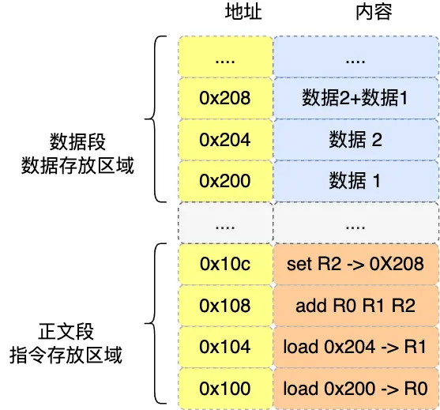

编译完成后，具体执行程序的时候，程序计数器会被设置为 0x100 地址，然后依次执行上述正文段的 4 条指令。

## 从MIPS指令集了解CPU

不同的 CPU 有不同的指令集，也就是对应着不同的汇编语言和不同的机器码，接下来选用最简单的 MIPS 指令集，来看看机器码是如何生成的，这样也能明白二进制的机器码的具体含义。

MIPS 的指令是一个 32 位的整数，高 6 位代表着操作码，表示这条指令是一条什么样的指令，剩下的 26 位不同指令类型所表示的内容也就不相同，主要有三种类型R、I 和 J。

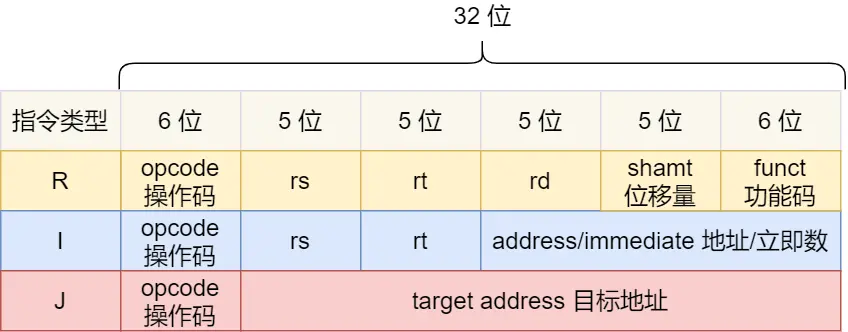

其中：

- R指令，用在算术和逻辑操作，里面有读取和写入数据的寄存器地址。如果是逻辑位移操作，后面还有位移操作的「位移量」，而最后的「功能码」则是再前面的操作码不够的时候，扩展操作码来表示对应的具体指令的；
- I指令，用在数据传输、条件分支等。这个类型的指令，就没有了位移量和功能码，也没有了第三个寄存器，而是把这三部分直接合并成了一个地址值或一个常数；
- J指令，用在跳转，高 6 位之外的 26 位都是一个跳转后的地址；

接下来，我们把前面例子的这条指令：「add指令将寄存器R0和R1的数据相加，并存放结果到R2」，翻译成机器码。

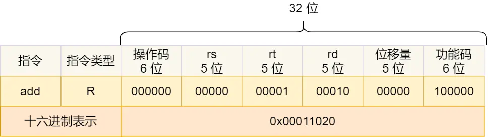

加和运算 add 指令是属于 R 指令类型：

- add 对应的 MIPS 指令里操作码是000000，以及最末尾的功能码是100000
- rs 代表第一个寄存器 R0 的编号，即00000
- rt 代表第二个寄存器 R1 的编号，即00001
- rd 代表目标的临时寄存器 R2 的编号，即00010
- 因为不是位移操作，所以位移量是00000

把上面这些数字拼在一起就是一条 32 位的 MIPS 加法指令了，那么用 16 进制表示的机器码则是0x00011020

编译器在编译程序的时候，会构造指令，这个过程叫做指令的编码。CPU 执行程序的时候，就会解析指令，这个过程叫作指令的解码。

现代大多数 CPU 都使用来流水线的方式来执行指令，所谓的流水线就是把一个任务拆分成多个小任务，于是一条指令通常分为 4 个阶段，称为 4 级流水线，如下图：

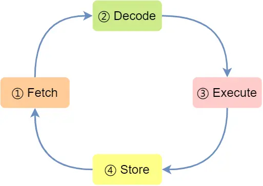

上面这 4 个阶段，我们称为**指令周期** ，CPU 的工作就是一个周期接着一个周期，周而复始。

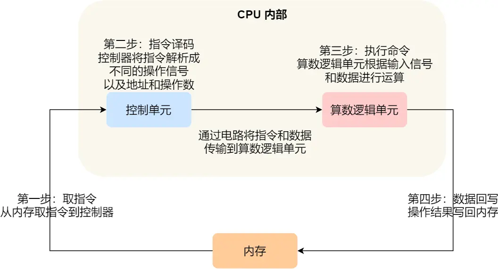

对于 CPU 来说，在一个时钟周期内，CPU 仅能完成一个最基本的动作，时钟频率越高，时钟周期就越短，工作速度也就越快。

程序执行的时候，耗费的 CPU 时间少就说明程序是快的，对于程序的 CPU 执行时间，我们可以拆解成：


时钟周期时间就是 CPU 主频，主频越高说明 CPU 的工作速度就越快，比如 2.4 GHz 四核 Intel Core i5，这里的 2.4 GHz 就是电脑的主频，时钟周期时间就是 1/2.4G。

另外，换一个更好的 CPU，这个也是软件开发中控制不了的事情，我们应该把目光放到另外一个乘法因子 —— CPU 时钟周期数，如果能减少程序所需的 CPU 时钟周期数量，一样也是能提升程序的性能的。


因此，要想程序跑的更快，优化这三者即可：

- 指令数，表示执行程序所需要多少条指令，以及哪些指令。这个层面是基本靠编译器来优化，毕竟同样的代码，在不同的编译器，编译出来的计算机指令会有各种不同的表示方式。
- 每条指令的平均时钟周期数（CPI），表示一条指令需要多少个时钟周期数，现代大多数 CPU 通过流水线技术（Pipeline），让一条指令需要的 CPU 时钟周期数尽可能的少；
- 时钟周期时间，表示计算机主频，取决于计算机硬件。有的 CPU 支持超频技术，打开了超频意味着把 CPU 内部的时钟给调快了，于是 CPU 工作速度就变快了，但是也是有代价的，CPU 跑的越快，散热的压力就会越大，CPU 会很容易奔溃。

很多厂商为了跑分而跑分，基本都是在这三个方面入手，特别是超频这一块。

## 存储器的层次结构

:::important

这里仅仅作一个简要的介绍，更加详细深入的了解，还是亲自去读一读 **CSAPP** 更好。

:::

存储器通常可以分为这么几个级别：

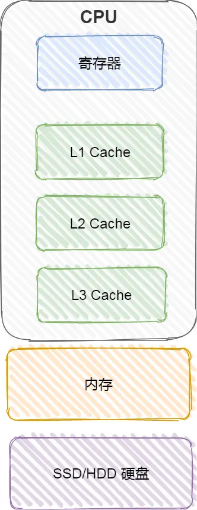

### 寄存器

最靠近 CPU 的控制单元和逻辑计算单元的存储器，就是寄存器了，它使用的材料速度也是最快的，因此价格也是最贵的，那么数量不能很多。

寄存器的访问速度非常快，一般要求在半个 CPU 时钟周期内完成读写，CPU 时钟周期跟 CPU 主频息息相关，比如 2 GHz 主频的 CPU，那么它的时钟周期就是 1/2G，也就是 0.5ns（纳秒）。

CPU 处理一条指令的时候，除了读写寄存器，还需要解码指令、控制指令执行和计算。如果寄存器的速度太慢，则会拉长指令的处理周期，从而给用户的感觉，就是电脑「很慢」。

### CPU多级缓存

CPU Cache 用的是一种叫 SRAM（**Static Random-Access Memory**静态随机存储器）的芯片。

SRAM 之所以叫「静态」存储器，是因为只要有电，数据就可以保持存在，而一旦断电，数据就会丢失了。

在 SRAM 里面，一个 bit 的数据，通常需要 6 个晶体管，所以 SRAM 的存储密度不高，同样的物理空间下，能存储的数据是有限的，不过也因为 SRAM 的电路简单，所以访问速度非常快。

CPU 的高速缓存，通常可以分为 L1、L2、L3 这样的三层高速缓存，也称为一级缓存、二级缓存、三级缓存。

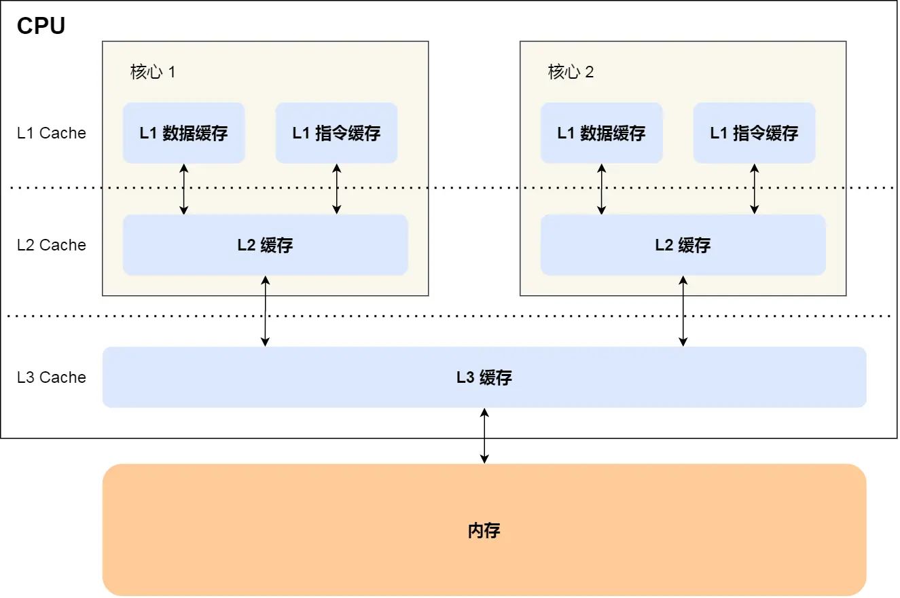

L1 高速缓存的访问速度几乎和寄存器一样快，通常只需要 2~4 个时钟周期，而大小在几十 KB 到几百 KB 不等。每个 CPU 核心都有一块属于自己的 L1 高速缓存，指令和数据在 L1 是分开存放的，所以 L1 高速缓存通常分成 **数据缓存**(dCache)和 **指令缓存**(iCache)

L2 高速缓存同样每个 CPU 核心都有，但是 L2 高速缓存位置比 L1 高速缓存距离 CPU 核心 更远，它大小比 L1 高速缓存更大，CPU 型号不同大小也就不同，通常大小在几百 KB 到几 MB 不等，访问速度则更慢，速度在 10~20 个时钟周期

L3 高速缓存通常是多个 CPU 核心共用的，位置比 L2 高速缓存距离 CPU 核心 更远，大小也会更大些，通常大小在几 MB 到几十 MB 不等，具体值根据 CPU 型号而定。访问速度大约在20~60个时钟周期

### 内存

内存用的芯片和 CPU Cache 有所不同，它使用的是一种叫作DRAM （Dynamic Random Access Memory，动态随机存取存储器）的芯片。相比 SRAM，DRAM 的密度更高，功耗更低，有更大的容量，而且造价比 SRAM 芯片便宜很多。

DRAM 存储一个 bit 数据，只需要一个晶体管和一个电容就能存储，但是因为数据会被存储在电容里，电容会不断漏电，所以需要「定时刷新」电容，才能保证数据不会被丢失，这就是 DRAM 之所以被称为「动态」存储器的原因，只有不断刷新，数据才能被存储起来。

### 硬盘

SSD（Solid-state disk） 就是我们常说的固体硬盘，结构和内存类似，但是它相比内存的优点是断电后数据还是存在的，而内存、寄存器、高速缓存断电后数据都会丢失。内存的读写速度比 SSD 大概快10~1000倍。

当然，还有一款传统的硬盘，也就是机械硬盘（Hard Disk Drive, HDD），它是通过物理读写的方式来访问数据的，因此它访问速度是非常慢的，它的速度比内存慢10W倍左右。

由于 SSD 的价格快接近机械硬盘了，因此机械硬盘已经逐渐被 SSD 替代了。

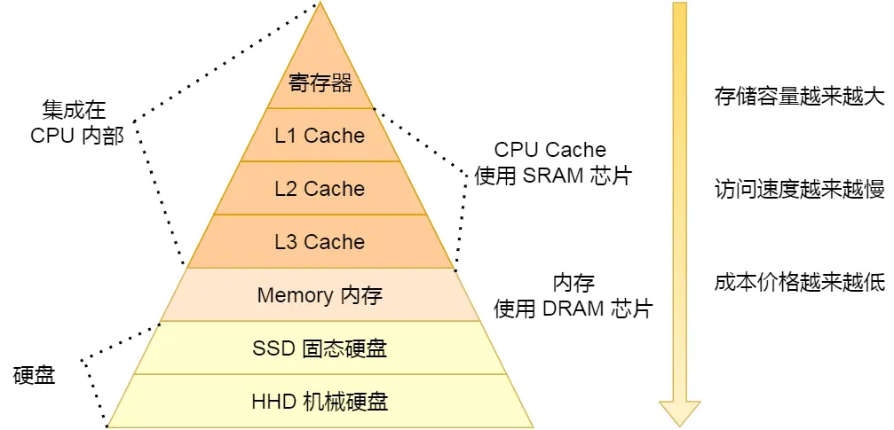

## CPU缓存原理

我们先简单了解下 CPU Cache 的结构，CPU Cache 是由很多个 Cache Line 组成的，Cache Line 是 CPU 从内存读取数据的基本单位，而 Cache Line 是由各种标志（Tag）+ 数据块（Data Block）组成，你可以在下图清晰的看到：

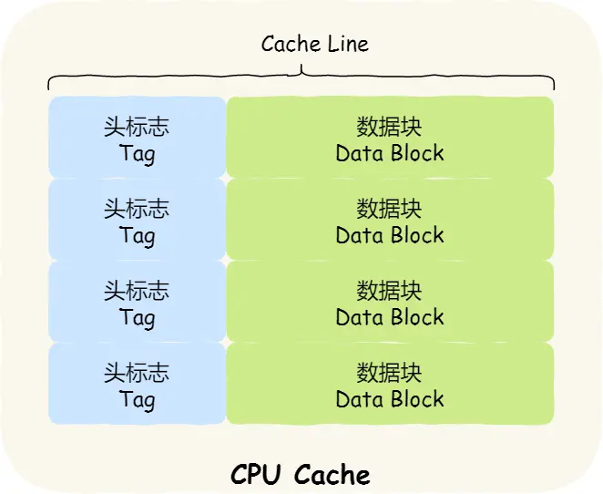

CPU Cache 的数据是从内存中读取过来的，它是以一小块一小块读取数据的，而不是按照单个数组元素来读取数据的，在 CPU Cache 中的，这样一小块一小块的数据，称为 **缓存块(Cache Line)。**

举个例子，Linux系统默认的L1 Cache Line大小是64 bytes，也就是说可以一次载入64字节的数据。假如我们有一个int array[1000]，现在CPU需要访问array[0]，由于int 在内存只占2 word = 4 bytes，不足64 bytes。所以CPU会把array[0]到array[15]都一次性加载到L1 Cache。之后访问array[0] ~array[15]的时候，不需要再加载到L1，除非访问其他内容。

事实上，CPU 读取数据的时候，无论数据是否存放到 Cache 中，CPU 都是先访问 Cache，只有当 Cache 中找不到数据时，才会去访问内存，并把内存中的数据读入到 Cache 中，CPU 再从 CPU Cache 读取数据。

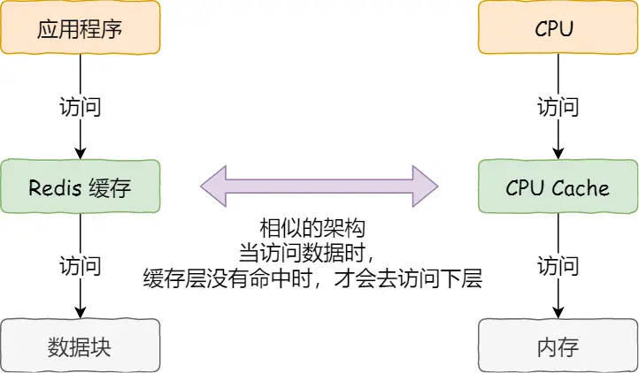

这样的访问机制，跟我们使用「内存作为硬盘的缓存」的逻辑是一样的，如果内存有缓存的数据，则直接返回，否则要访问龟速一般的硬盘。

那 CPU 怎么知道要访问的内存数据，是否在 Cache 里？如果在的话，如何找到 Cache 对应的数据呢？我们从最简单、基础的**直接映射 Cache**说起，来看看整个 CPU Cache 的数据结构和访问逻辑。

### 直接映射

对于直接映射 Cache 采用的策略，就是把内存块的地址始终「映射」在一个 CPU Cache Line（缓存块） 的地址，至于映射关系实现方式，则是使用「取模运算」，取模运算的结果就是内存块地址对应的 CPU Cache Line（缓存块） 的地址。

举个例子，内存共被划分为 32 个内存块，CPU Cache 共有 8 个 CPU Cache Line，假设 CPU 想要访问第 15 号内存块，如果 15 号内存块中的数据已经缓存在 CPU Cache Line 中的话，则是一定映射在 7 号 CPU Cache Line 中，因为 15%=7

机智的你肯定发现了，使用取模方式映射的话，就会出现多个内存块对应同一个 CPU Cache Line，比如上面的例子，除了 15 号内存块是映射在 7 号 CPU Cache Line 中，还有 7 号、23 号、31 号内存块都是映射到 7 号 CPU Cache Line 中。

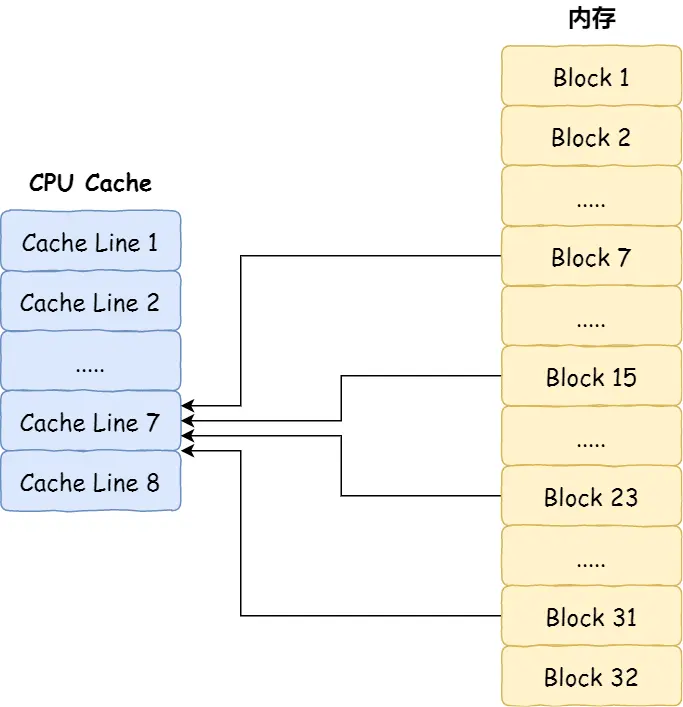

因此，为了区别不同的内存块，在对应的 CPU Cache Line 中我们还会存储一个组标记（Tag）。这个组标记会记录当前 CPU Cache Line 中存储的数据对应的内存块，我们可以用这个组标记来区分不同的内存块。

除了组标记信息外，CPU Cache Line 还有两个信息：

- 一个是**数据块**，从内存加载过来的实际存放数据
- 另一个是**有效位**，它是用来标记对应的 CPU Cache Line 中的数据是否是有效的，如果有效位是 0，无论 CPU Cache Line 中是否有数据，CPU 都会直接访问内存，重新加载数据。

CPU 在从 CPU Cache 读取数据的时候，并不是读取 CPU Cache Line 中的整个数据块，而是读取 CPU 所需要的一个数据片段，这样的数据统称为一个字。那怎么在对应的 CPU Cache Line 中数据块中找到所需的字呢？答案是，需要一个偏移量（Offset）

因此，一个内存的访问地址，包括**组标记、CPU Cache Line 索引、偏移量**。这三种信息，于是 CPU 就能通过这些信息，在 CPU Cache 中找到缓存的数据。而对于 CPU Cache 里的数据结构，则是由**索引 + 有效位 + 组标记 + 数据块**组成。

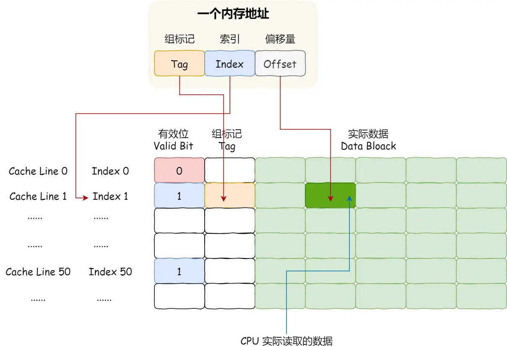

如果内存中的数据已经在 CPU Cache 中了，那 CPU 访问一个内存地址的时候，会经历这 4 个步骤：

- 根据内存地址中索引信息，计算在 CPU Cache 中的索引，也就是找出对应的 CPU Cache Line 的地址；
- 找到对应 CPU Cache Line 后，判断 CPU Cache Line 中的有效位，确认 CPU Cache Line 中数据是否是有效的，如果是无效的，CPU 就会直接访问内存，并重新加载数据，如果数据有效，则往下执行；
- 对比内存地址中组标记和 CPU Cache Line 中的组标记，确认 CPU Cache Line 中的数据是我们要访问的内存数据，如果不是的话，CPU 就会直接访问内存，并重新加载数据，如果是的话，则往下执行；
- 根据内存地址中偏移量信息，从 CPU Cache Line 的数据块中，读取对应的字。

到这里，相信你对直接映射 Cache 有了一定认识，但其实除了直接映射 Cache 之外，还有其他通过内存地址找到 CPU Cache 中的数据的策略，比如全相连 Cache 、组相连 Cache 等，这几种策策略的数据结构都比较相似。

### CPU优化策略

我们知道 CPU 访问内存的速度，比访问 CPU Cache 的速度慢了 100 多倍，所以如果 CPU 所要操作的数据在 CPU Cache 中的话，这样将会带来很大的性能提升。访问的数据在 CPU Cache 中的话，意味着**缓存命中**，缓存命中率越高的话，代码的性能就会越好，CPU 也就跑的越快。

「如何写出让 CPU 跑得更快的代码？」这个问题，可以改成「如何写出 CPU 缓存命中率高的代码？」。

我们分开来看「数据缓存」和「指令缓存」的缓存命中率

#### 如何提升数据缓存的命中率

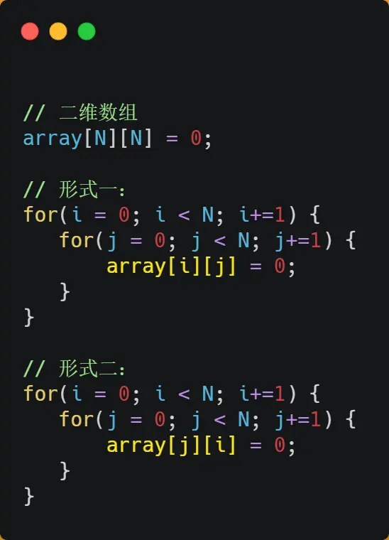

形式1比形式2快 3 倍左右，遇到这种遍历数组的情况时，按照内存布局顺序访问，将可以有效的利用 CPU Cache 带来的好处，这样我们代码的性能就会得到很大的提升。

#### 如何提升指令缓存的命中率

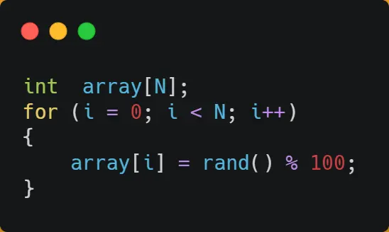

接下来，对这个数组做两个操作：

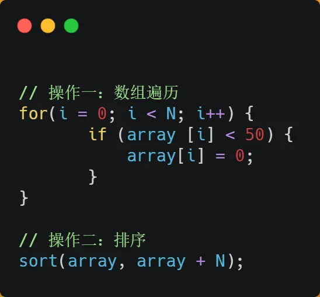

那么问题来了，你觉得先遍历再排序速度快，还是先排序再遍历速度快呢？

这里有一个前置知识，CPU的分支预测。如果分支预测可以预测到接下来要执行 if 里的指令，还是 else 指令的话，就可以「提前」把这些指令放在指令缓存中，这样 CPU 可以直接从 Cache 读取到指令，于是执行速度就会很快。

所以，当数组中的元素是随机的，分支预测就无法有效工作，而当数组元素都是是顺序的，分支预测器会动态地根据历史命中数据对未来进行预测，这样命中率就会很高。

在C/C++中，我们可以使用宏来手动建议分支预测：

C写法:

```c
#define likely(x) __builtin_expect(!!(x),1)
#define unlikely(x) __builtin_expect(!!(x),0)

if(likely(a==1)){
    // do sth.
}
else {
    // do sth.
}
```

C++写法:

```cpp
if([[unlikely]](a==1)){
    // do sth.
}else {
    // do sth.
}
```

实际上，CPU 自身的动态分支预测已经是比较准的了，所以只有当非常确信 CPU 预测的不准，且能够知道实际的概率情况时，才建议使用这两种宏。

#### 如何提升多核CPU的缓存命中率

在单核 CPU，虽然只能执行一个线程，但是操作系统给每个线程分配了一个时间片，时间片用完了，就调度下一个线程，于是各个线程就按时间片交替地占用 CPU，从宏观上看起来各个线程同时在执行。

当有多个同时执行「计算密集型」的线程，为了防止因为切换到不同的核心，而导致缓存命中率下降的问题，我们可以**把线程绑定在某一个 CPU 核心上**，这样性能可以得到非常可观的提升。

在 Linux 上提供了`sched_setaffinity`方法，来实现将线程绑定到某个 CPU 核心这一功能。

## CPU缓存一致性

事实上，数据不光是只有读操作，还有写操作，那么如果数据写入 Cache 之后，内存与 Cache 相对应的数据将会不同，这种情况下 Cache 和内存数据都不一致了，于是我们肯定是要把 Cache 中的数据同步到内存里的。

问题来了，那在什么时机才把 Cache 中的数据写回到内存呢？为了应对这个问题，下面介绍两种针对写入数据的方法：

- 写直达(write through)
- 写回(write back)

### 写直达

保持内存与 Cache 一致性最简单的方式是，把数据同时写入内存和 Cache 中，这种方法称为写直达(write through)

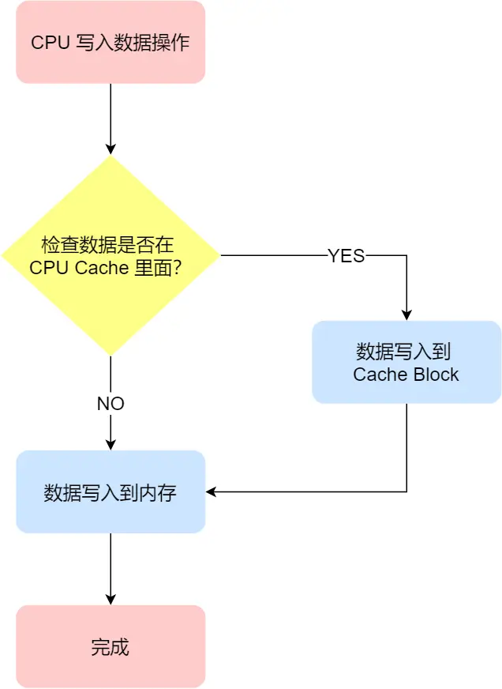

在这个方法里，写入前会先判断数据是否已经在 CPU Cache 里面了：

- 如果数据已经在 Cache 里面，先将数据更新到 Cache 里面，再写入到内存里面；
- 如果数据没有在 Cache 里面，就直接把数据更新到内存里面。

写直达法很直观，也很简单，但是问题明显，无论数据在不在 Cache 里面，每次写操作都会写回到内存，这样写操作将会花费大量的时间，无疑性能会受到很大的影响。

### 写回

既然写直达由于每次写操作都会把数据写回到内存，而导致影响性能，于是为了要减少数据写回内存的频率，就出现了写回（Write Back）

在写回机制中，**当发生写操作时，新的数据仅仅被写入 Cache Block 里，只有当修改过的 Cache Block「被替换」时才需要写到内存中**，减少了数据写回内存的频率，这样便可以提高系统的性能。

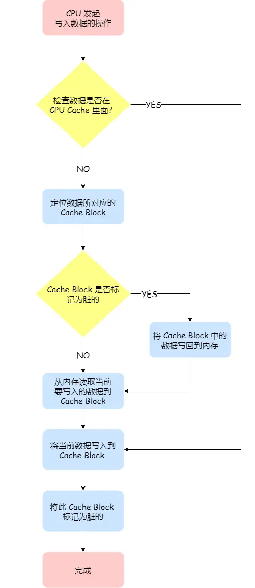

- 如果当发生写操作时，数据已经在 CPU Cache 里的话，则把数据更新到 CPU Cache 里，同时标记 CPU Cache 里的这个 Cache Block 为脏（Dirty）的，这个脏的标记代表这个时候，我们 CPU Cache 里面的这个 Cache Block 的数据和内存是不一致的，这种情况是不用把数据写到内存里的；
- 如果当发生写操作时，数据所对应的 Cache Block 里存放的是「别的内存地址的数据」的话，就要检查这个 Cache Block 里的数据有没有被标记为脏的：
  - 如果是脏的话，我们就要把这个 Cache Block 里的数据写回到内存，然后再把当前要写入的数据，先从内存读入到 Cache Block 里，然后再把当前要写入的数据写入到 Cache Block，最后也把它标记为脏的；
  - 如果不是脏的话，把当前要写入的数据先从内存读入到 Cache Block 里，接着将数据写入到这个 Cache Block 里，然后再把这个 Cache Block 标记为脏的就好了。

可以发现写回这个方法，在把数据写入到 Cache 的时候，只有在缓存不命中，同时数据对应的 Cache 中的 Cache Block 为脏标记的情况下，才会将数据写到内存中，而在缓存命中的情况下，则在写入后 Cache 后，只需把该数据对应的 Cache Block 标记为脏即可，而不用写到内存里。

CPU 缓存与内存使用「写回」机制的流程图如下，左半部分就是读操作的流程，右半部分就是写操作的流程，也就是我们上面讲的内容。

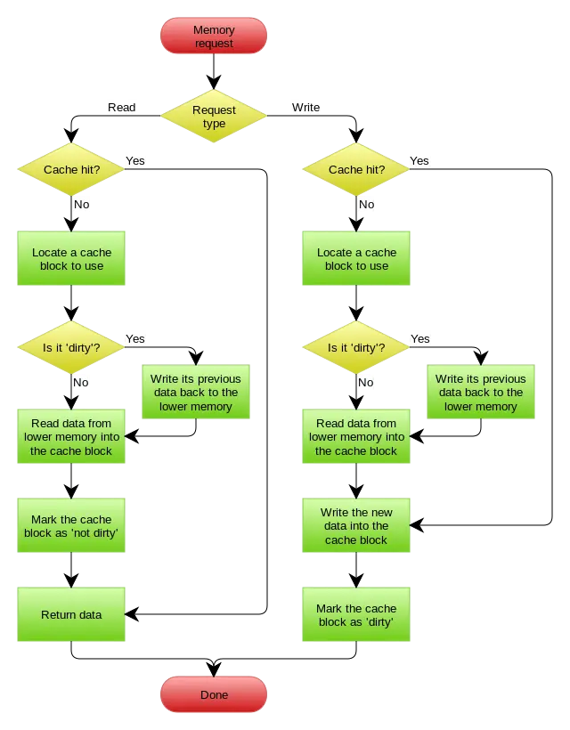

### 缓存一致性问题

现在 CPU 都是多核的，由于 L1/L2 Cache 是多个核心各自独有的，那么会带来多核心的**缓存一致性**的问题，如果不能保证缓存一致性的问题，就可能造成结果错误。

假设 A 号核心和 B 号核心同时运行两个线程，都操作共同的变量 i（初始值为 0 ）。

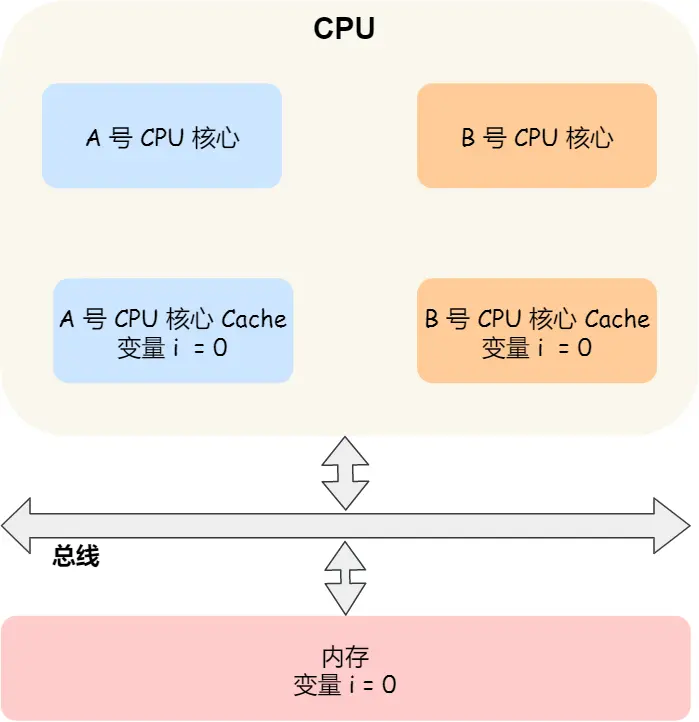

这时如果 A 号核心执行了i++语句的时候，为了考虑性能，使用了我们前面所说的写回策略，先把值为1的执行结果写入到 L1/L2 Cache 中，然后把 L1/L2 Cache 中对应的 Block 标记为脏的，这个时候数据其实没有被同步到内存中的，因为写回策略，只有在 A 号核心中的这个 Cache Block 要被替换的时候，数据才会写入到内存里。

如果这时旁边的 B 号核心尝试从内存读取 i 变量的值，则读到的将会是错误的值，因为刚才 A 号核心更新 i 值还没写入到内存中，内存中的值还依然是 0。这个就是所谓的缓存一致性问题，A 号核心和 B 号核心的缓存，在这个时候是不一致，从而会导致执行结果的错误。

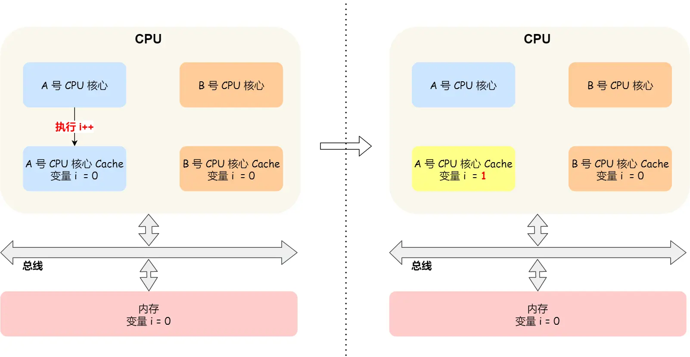

那么，要解决这一问题，就需要一种机制，来同步两个不同核心里面的缓存数据。要实现的这个机制的话，要保证做到下面这 2 点：

1. 某个 CPU 核心里的 Cache 数据更新时，必须要传播到其他核心的 Cache，这个称为写传播（Write Propagation）
2. 某个 CPU 核心里对数据的操作顺序，必须在其他核心看起来顺序是一样的，这个称为事务的串行化（Transaction Serialization）

第一点写传播很容易就理解，当某个核心在 Cache 更新了数据，就需要同步到其他核心的 Cache 里。而对于第二点事务的串行化，就是说Cache的变化事务应该在所有核心的眼里都发生相同顺序的变化。

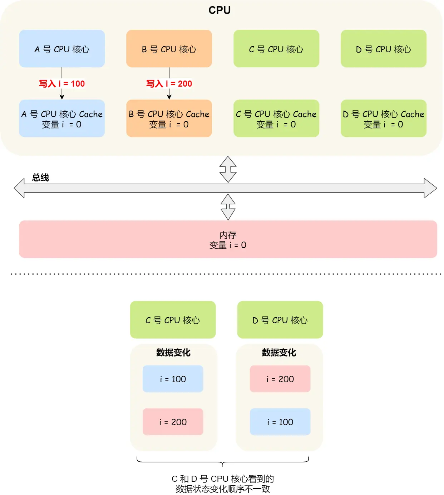

我们要保证 C 号核心和 D 号核心都能看到**相同顺序的数据变化**，比如变量 i 都是先变成 100，再变成 200，这样的过程就是事务的串行化。

要实现事务串行化，要做到 2 点：

1. CPU 核心对于 Cache 中数据的操作，需要同步给其他 CPU 核心；
2. 要引入「锁」的概念，如果两个 CPU 核心里有相同数据的 Cache，那么对于这个 Cache 数据的更新，只有拿到了「锁」，才能进行对应的数据更新。

那接下来我们看看，写传播和事务串行化具体是用什么技术实现的。

### 总线嗅探

写传播的原则就是当某个 CPU 核心更新了 Cache 中的数据，要把该事件广播通知到其他核心。最常见实现的方式是总线嗅探（Bus Snooping）

我还是以前面的 i 变量例子来说明总线嗅探的工作机制，当 A 号 CPU 核心修改了 L1 Cache 中 i 变量的值，通过总线把这个事件广播通知给其他所有的核心，然后每个 CPU 核心都会监听总线上的广播事件，并检查是否有相同的数据在自己的 L1 Cache 里面，如果 B 号 CPU 核心的 L1 Cache 中有该数据，那么也需要把该数据更新到自己的 L1 Cache。

可以发现，总线嗅探方法很简单， CPU 需要每时每刻监听总线上的一切活动，但是不管别的核心的 Cache 是否缓存相同的数据，都需要发出一个广播事件，这无疑会加重总线的负载。

另外，总线嗅探只是保证了某个 CPU 核心的 Cache 更新数据这个事件能被其他 CPU 核心知道，但是并不能保证事务串行化。

于是，有一个协议基于总线嗅探机制实现了事务串行化，也用状态机机制降低了总线带宽压力，这个协议就是 MESI 协议，这个协议就做到了 CPU 缓存一致性。

### MESI协议

MESI 协议其实是 4 个状态单词的开头字母缩写，分别是：

- Modified，已修改
- Exclusive，独占
- Shared，共享
- Invalidated，已失效

这四个状态来标记 Cache Line 四个不同的状态。

「已修改」状态就是我们前面提到的脏标记，代表该 Cache Block 上的数据已经被更新过，但是还没有写到内存里。而「已失效」状态，表示的是这个 Cache Block 里的数据已经失效了，不可以读取该状态的数据。

「独占」和「共享」状态都代表 Cache Block 里的数据是干净的，也就是说，这个时候 Cache Block 里的数据和内存里面的数据是一致性的。

「独占」和「共享」的差别在于，独占状态的时候，数据只存储在一个 CPU 核心的 Cache 里，而其他 CPU 核心的 Cache 没有该数据。这个时候，如果要向独占的 Cache 写数据，就可以直接自由地写入，而不需要通知其他 CPU 核心，因为只有你这有这个数据，就不存在缓存一致性的问题了，于是就可以随便操作该数据。

另外，在「独占」状态下的数据，如果有其他核心从内存读取了相同的数据到各自的 Cache ，那么这个时候，独占状态下的数据就会变成共享状态。

那么，「共享」状态代表着相同的数据在多个 CPU 核心的 Cache 里都有，所以当我们要更新 Cache 里面的数据的时候，不能直接修改，而是要先向所有的其他 CPU 核心广播一个请求，要求先把其他核心的 Cache 中对应的 Cache Line 标记为「无效」状态，然后再更新当前 Cache 里面的数据。

事实上，整个 MESI 的状态可以用一个有限状态机来表示它的状态流转。还有一点，对于不同状态触发的事件操作，可能是来自本地 CPU 核心发出的广播事件，也可以是来自其他 CPU 核心通过总线发出的广播事件。下图即是 MESI 协议的状态图：

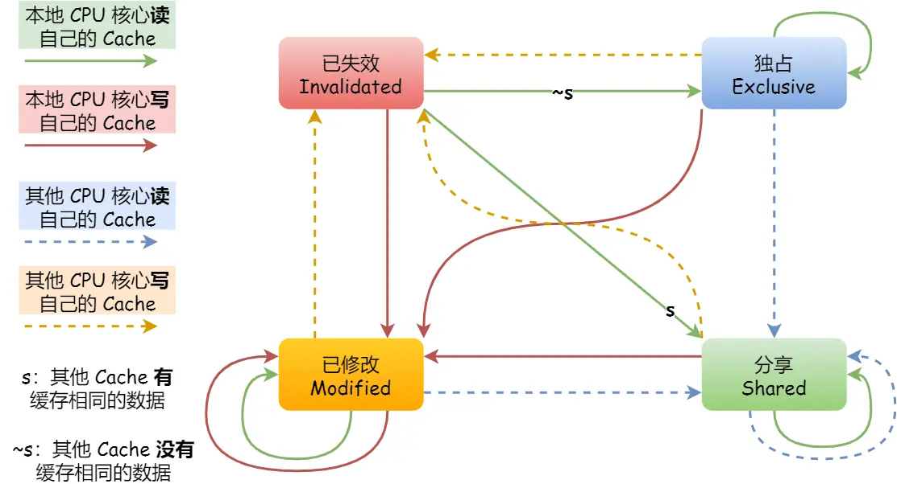

### 伪共享

对数组的加载， CPU 会加载数组里面连续的多个数据到 Cache 里，因此我们应该按照物理内存地址分布的顺序去访问元素，这样访问数组元素的时候，Cache 命中率就会很高，于是就能减少从内存读取数据的频率， 从而可提高程序的性能。

但是，在我们不使用数组，而是使用单独的变量的时候，则会有 Cache 伪共享的问题，Cache 伪共享问题上是一个性能杀手，我们应该要规避它。

现在假设有一个双核心的 CPU，这两个 CPU 核心并行运行着两个不同的线程，它们同时从内存中读取两个不同的数据，分别是类型为long的变量 A 和 B，这个两个数据的地址在物理内存上是连续的，如果 Cahce Line 的大小是 64 字节，并且变量 A 在 Cahce Line 的开头位置，那么这两个数据是位于同一个 Cache Line 中，又因为 CPU Cache  Line 是 CPU 从内存读取数据到 Cache 的单位，所以这两个数据会被同时读入到了两个 CPU 核心中各自 Cache 中。

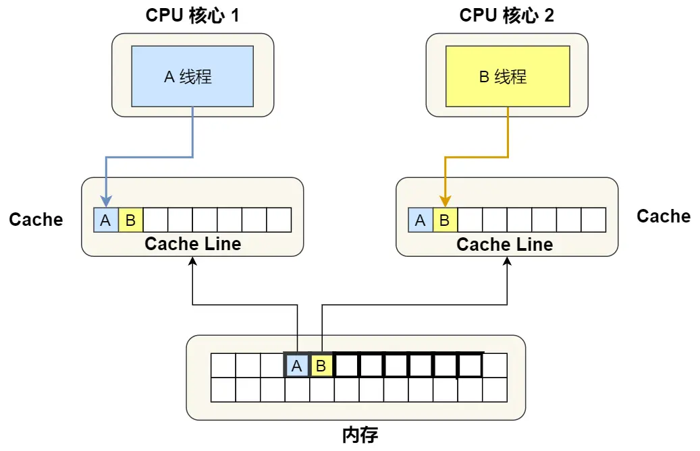

我们来思考一个问题，如果这两个不同核心的线程分别修改不同的数据，比如 1 号 CPU 核心的线程只修改了 变量 A，或 2 号 CPU 核心的线程的线程只修改了变量 B，会发生什么呢？

1. 最开始变量 A 和 B 都还不在 Cache 里面，假设 1 号核心绑定了线程 A，2 号核心绑定了线程 B，线程 A 只会读写变量 A，线程 B 只会读写变量 B。
   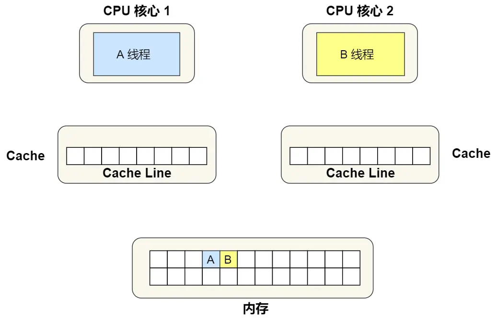
2. 1 号核心读取变量 A，由于 CPU 从内存读取数据到 Cache 的单位是 Cache Line，也正好变量 A 和 变量 B 的数据归属于同一个 Cache Line，所以 A 和 B 的数据都会被加载到 Cache，并将此 Cache Line 标记为「独占」状态。
   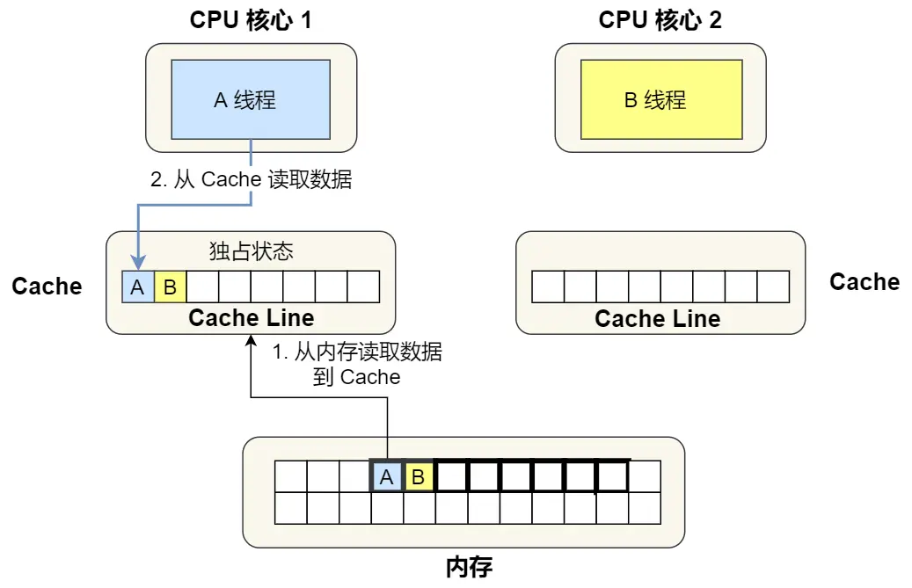
3. 接着，2 号核心开始从内存里读取变量 B，同样的也是读取 Cache Line 大小的数据到 Cache 中，此 Cache Line 中的数据也包含了变量 A 和 变量 B，此时 1 号和 2 号核心的 Cache Line 状态变为「共享」状态。
   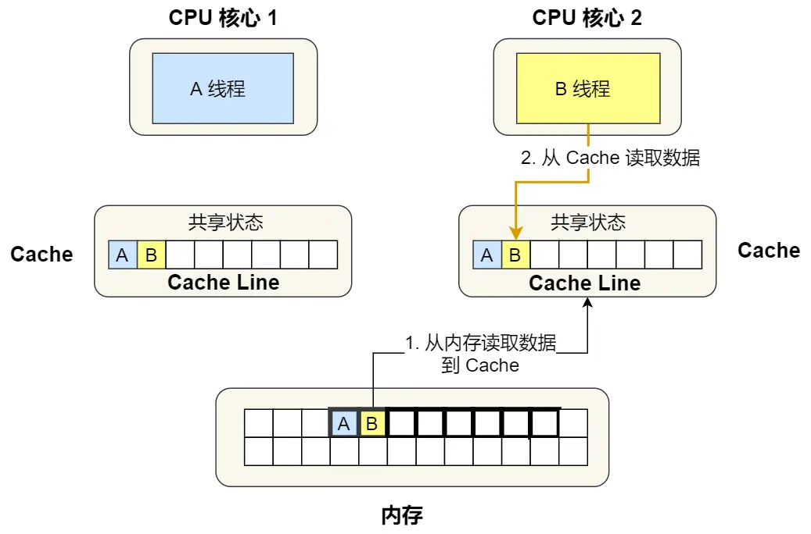
4. 1 号核心需要修改变量 A，发现此 Cache Line 的状态是「共享」状态，所以先需要通过总线发送消息给 2 号核心，通知 2 号核心把 Cache 中对应的 Cache Line 标记为「已失效」状态，然后 1 号核心对应的 Cache Line 状态变成「已修改」状态，并且修改变量 A。
   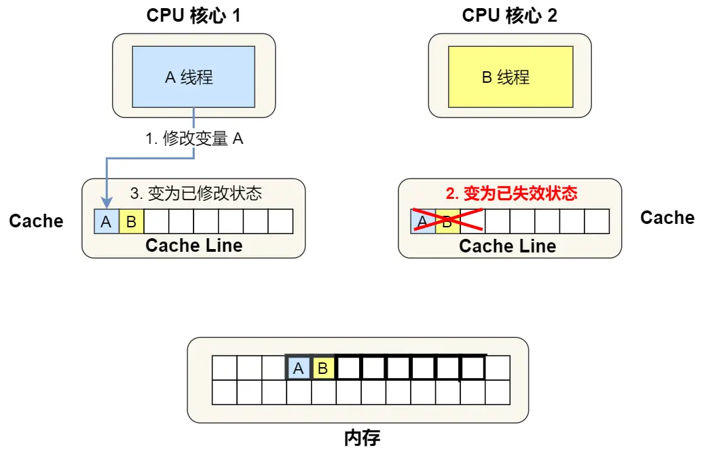
5. 之后，2 号核心需要修改变量 B，此时 2 号核心的 Cache 中对应的 Cache Line 是已失效状态，另外由于 1 号核心的 Cache 也有此相同的数据，且状态为「已修改」状态，所以要先把 1 号核心的 Cache 对应的 Cache Line 写回到内存，然后 2 号核心再从内存读取 Cache Line 大小的数据到 Cache 中，最后把变量 B 修改到 2 号核心的 Cache 中，并将状态标记为「已修改」状态。
   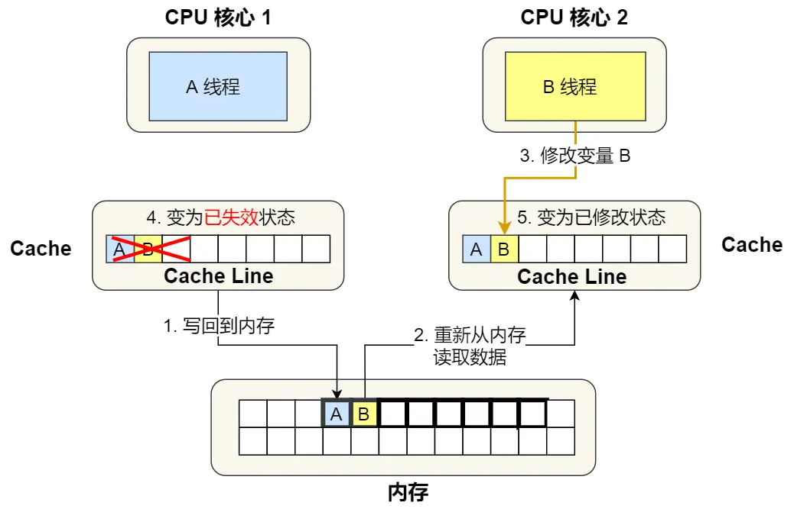

所以，可以发现如果 1 号和 2 号 CPU 核心这样持续交替的分别修改变量 A 和 B，就会重复 4 和 5 这两个步骤，Cache 并没有起到缓存的效果，虽然变量 A 和 B 之间其实并没有任何的关系，但是因为同时归属于一个 Cache Line ，这个 Cache Line 中的任意数据被修改后，都会相互影响，从而出现 4 和 5 这两个步骤。

因此，这种因为多个线程同时读写同一个 Cache Line 的不同变量时，而导致 CPU Cache 失效的现象称为伪共享（False Sharing）

### 伪共享解决方案

对于多个线程共享的热点数据，即经常会修改的数据，应该避免这些数据刚好在同一个 Cache Line 中，否则就会出现为伪共享的问题。

在 Linux 内核中存在__cacheline_aligned_in_smp宏定义，是用于解决伪共享的问题。

因此，针对在同一个 Cache Line 中的共享的数据，如果在多核之间竞争比较严重，为了防止伪共享现象的发生，可以采用上面的宏定义使得变量在 Cache Line 里是对齐的。

例如结构体:

```c
struct node{
  int a;
  int b;
};
```

结构体里的两个成员变量 a 和 b 在物理内存地址上是连续的，于是它们可能会位于同一个 Cache Line 中，如下图：

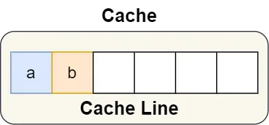

所以，为了防止前面提到的 Cache 伪共享问题，我们可以使用上面介绍的宏定义，将 b 的地址设置为 Cache Line 对齐地址，如下：

```c
struct node{
  int a;
  int b __cacheline_aligned_in_smp;
};
```

这样 a 和 b 变量就不会在同一个 Cache Line 中了，如下图：

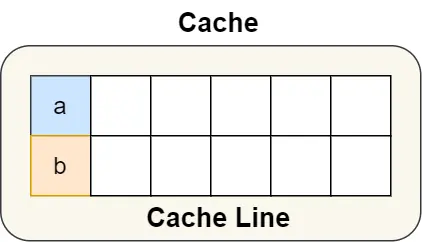

所以，避免  Cache 伪共享实际上是用空间换时间的思想，浪费一部分 Cache 空间，从而换来性能的提升。
