《 Silent Hill 》(寂静岭)系列最新作《 Silent Hill f 》重新回到最初的心理恐怖，其由龙骑士07执笔剧本，首次把故事从美国小镇「寂静岭」，移到60代年日本的边远小镇「戎之丘」。即使地点不同，新作仍然保留了原作各種核心元素，包括表里世界、内心黑暗面的怪物化身、面对自身扭曲的潜意识，以及各种宗教、药物滥用以及特殊的社会结构。

我们首先以发生时间线重新整理和排列，用最简单的方式了解故事大概，以及可能对应的真实历史资料。**比喻和暗喻的部分仅为推测**，日后可能会有追加的内容或新的情报而被推翻。游戏最少需要完成三周目才能完整体验故事，只完成一周目只能接触到故事最表层，担心被剧透一脸的朋友还请退出～

<h1>！！！！！！以下内容含有剧透！！！！！！<h1>

## 仍是寂静岭

《Silent Hill》系列的世界被划分为三个，分别是一般人所在的「现实世界」、异世界的表层「表世界」，以及异世界的深层「里世界」。游戏内玩家基本上不会接触到「现实世界」，「表世界」被迷雾所笼罩，有着与「现实世界」几乎一样的小镇，但充斥着不少怪物。「里世界」被神秘力量侵蚀，很多时候只保留外观但残破不堪，或完全处于另一个黑暗诡异血腥的异世界，怪物会反映每个当事人的内心。不论「表世界」还是「里世界」，同样属于与「现实世界」完全隔壁的「异世界」。

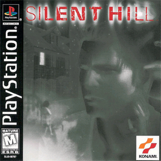

主系列的「寂静岭」是一个有着神秘力量的特殊地域，受到邪神和邪教的力量影响，部分情况是吸食**毒品**，继而引诱内心有着黑暗面的人到访，或单纯把到访的人拉入「异世界」。《Silent Hill f》的「戎之丘」则是关乎三个不同的信仰传说，加上传统枷锁、扭曲爱情、思想洗脑、毒品的束缚构成，被迷雾包围的「戎之丘」是「表世界」，黑夜里的神社「闇之社殿」则是「里世界」。

## 神话与信仰沿革

传说在古代的日本神话，**须佐之男砍下八歧大蛇的头，其中一个头掉落到「戎之丘」成为一条会吐出毒水的水龙，并成为当地的村民的信仰**。根据「复仇记」的记录，直到镰仓时代中期（1180年代源家击败平家后建立的首个幕府政权），一名戴着几重脸具、身高十尺的怪异僧人「异形僧」来到「戎之丘」，带领民众来到山上的千年杉树，千年杉的树根吸收了水龙的邪气，自此水龙沉睡在巨杉之下。**自此民众追随异形僧的神喻，巨杉成为「御神体」，舍弃水龙信仰开始了千年杉信仰**，一座非常气派的神社坐落于山上。（游戏第二周目后最终隐藏BOSS之一「九十九神」对应「异形僧」。）

同一时间，传说「戎之丘」亦是平家战败后逃亡隐遁之地，当地保留了不少平家的文化。逃亡的武士誓言要复兴平家，把已故的君主（历史上最后的君主是平清盛）佩刀埋藏在守护「戎之丘」的千年杉树根底下。（「灵刀」只能在二周目后取得，一周目只能找到对应文件，在「复仇记」的明治时代部分有后续记载。）

传说在室町时代应永年间（1394-1428年），日本曾经发生大饥荒，一群饥饿的年轻人为了发财，成功寻找到「灵刀」。其中一名年轻人获得「灵刀」就被平家的怨灵附身，将附近的人逐一斩杀。本来只是平家亡君的佩刀，就因为备受恐惧而称为「灵刀」，「灵刀」自此下落不明。

根据「万事记」的记载，**「戎之丘」是平家无法与外界进行交易的避世之处，继而诞生了珍视和供奉旧老物品的文化。民众会把物品供奉在御神体的树洞中，这个文化演变成为「付丧神信仰」，继而令「戎之丘」不同的信仰混合起来**。游戏内「九十九神」就有着五张脸、八只手，加上树洞的身躯。

（日本付丧神传说最初来自约1180年代平安时代末期的《今昔物语集》，只要物品经过99年的岁月，就会获得灵魂和生命，成为各种各样的妖怪。1336年建立的室町时代中期，这些变成妖怪的旧老物品就被称为「付丧神」，传说演变成遭到胡乱抛弃或注入强烈思念的物品都有机会成为「付丧神」。）

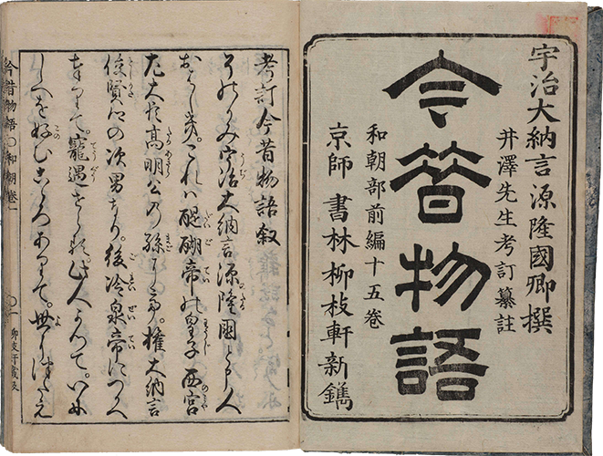

---

「千年杉神社」代代由五十岚家族担任神主进行祭祀和管理，**江户时代某天落雷击中了千年杉，导致年千杉完全烧毁**，失去御神体的千年杉神社渐渐荒废，后来在小镇郊外建造新的小神社。随着民众失去了千年杉这个御神体，**村民可能因此开始崇敬第二古老的东西：长满青苔的「稻荷神像」**。

根据当时的神职人员记载，失去「御神体」代表失去神的加护，邪恶的水龙即将苏醒。来自西方的善狐一族为了封印水龙，就需要凝聚信仰的力量，进行献祭仪式。

**民众的信仰不是来自封印水龙，而是最古老的物品**，造成「戎之丘」的「稻荷神」信仰独立于日本其他地方，只有短暂的历史。**不过，论历史其实「灵刀」比「稻荷神像」更悠久更早出现，当时未被发现的「灵刀」足以从根本撼动「戎之丘」的信仰**。

后来小神社改为供奉「稻荷神」，传说变为「稻荷神」把水龙封印在地底，纵使小镇的老人都非常虔诚，前往神社的人已经少之又少，反之小镇的各处都设有稻荷神像。新的信仰认为水龙会经由水井呼吸，所以不能随便封井。建屋挖井都是借用「稻荷神」的土地，神社会举办「地镇祭」感谢「稻荷神」，劝导建筑发展防止水龙灾，而水井下的毒其实是存在于「戎之丘」地底的硫化氢，与游戏主线一体化。（游戏周目后最终隐藏BOSS之一的「九尾狐」对应「稻荷神」。）

「稻荷神」会协助供养老旧废弃的工具，村民就把旧刺针插在炸豆皮上供奉，成为「戎之丘」独有的供奉方式。村民亦可以自行取走在神像前供养的老旧工具，他们认为把工具使用到最后是「稻荷神」教诲，称为「喜拾」。

游戏内的「稻荷神」会使用闪电，根据迷宫化的深水家谜题显示，「刀」和「狐狸」在天秤上进行激烈的战斗，一时风起云涌漩涡覆天。尽管太阳从狐狸背后升起，从刀的身后下山，争斗仍然没有平息。故事内没有提到烧毁「千年杉」的闪电来历，也有可能是「稻荷神」所为，与「九十九神」争夺「戎之丘」的信仰而破坏平衡。在「闇之社殿」都可以找到一把有着闪电刀纹的薙刀「近江守宗政」，号「稻魂」，意思是「稻妻」（INAZUMA，闪电）。

---

## 秘药与传说

另一方面，代代在「戎之丘」担任药师的岩井家，记载有一种古法炼制的红水秘药「**盘腿坐的布袋和尚**」，但现世流传的秘药都是假货。真正的「盘腿坐的布袋和尚」可以消除体内的恶灵，若果服用者都身怀不能见光之事，就会与恶灵一同被毁灭。

民间的红水药方有退烧和止痛效果，可以直接口服或涂抹在患部上，一些拒绝就医的老人会坚持使用。**从前的人相信发烧是恶灵附身所致，所以红水能够驱除恶灵**。

红水来自深受山灵祝福的山泉水积累于地底千丈，溶入仙花灵草之药效，历经百年方才熟成。**红水拥有强大的破邪之力，但作为祓除污秽的力量，药性则过于强大，只能用于洗净沾染污秽的古物上**。

在「御神体」被闪电烧毁时，就曾经使用过真正的「盘腿坐的布袋和尚」，岩井家把「盘腿坐的布袋和尚」洒在「稻荷神」的神像上，祓除沾染的污秽，确保神像不会遭到破坏。**相传神像自此涌出红色的泉水，能够治疗居民的病痛**。

**天正时代（约1580年）外国的传教士把秘药「科库罗麻科库罗」带到日本长崎，长崎的方言有「层层嵌套」的意思，代表「自己的内心还有一个自己，而那个自己中又有另一个自己」**。这种秘药又称为「冥想药」，可以与自己的内心深处进行深度沟通。游戏内简体中文以外的译文则是「不同的自我」来形容。

（天正时代的传教活动主要在1573-1603年，来自葡萄牙天主教，受利于当时织田信长容许在京都进行传教。其中路易士‧佛洛伊斯在方济各推荐下来到日本，与织田信长会面。信长死后，1587年丰臣秀吉禁止传教活动，路易士定居于长崎。游戏内并未提到路易士。）

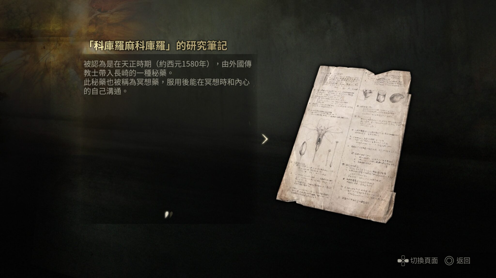

根据外国的药草学记载，「科库里麻科库罗」来自磨碎后的稀有植物「白黑草」种子，粉末会散发淡淡的桃子香味。这种植物对生长环境要求相当严苛，难以进行人工栽培，他们把只能摘取到少量的「白黑草」称为「神之花」。异国的传说中，使用「白黑草」能够与神对话、拜访神的国度、领悟奇迹的能力，古代的帝王认为这是长生不老的药。

（传说提到古代帝王寻找的长生不老药，反而比较贴近公元前210年秦王派遣徐福出海，其中一个现今无法证实的传说，指徐福在最后抵达了日本，并收录在1339年的《神皇正统记》内。前文提到记载「付丧神」的《今昔物语集》，就是最早记载徐福前往日本的记录。）

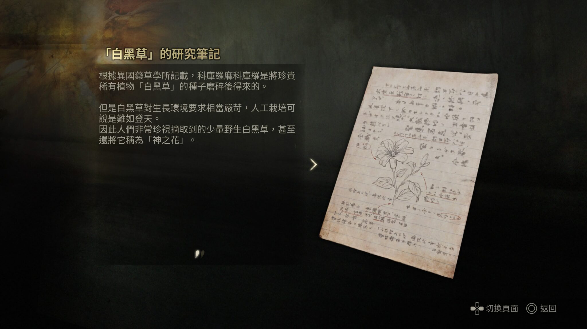

在安永三年（1774年）日本推出了《解体新书》，但日本在安永五年（1776年）推出的《异国药草学》却被视为奇书，湮没在历史的长河中。书里亦有记载一种能够与神灵对话的奇特药物，经由传教士带到日本。

（《解体新书》是杉田玄白于1774年翻译德国医学家的《Anatomische Tabellen》荷兰语文版，亦是日本第一本翻译的人体解剖学外语书。）

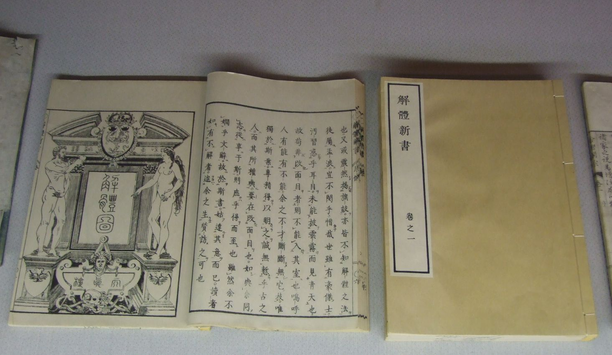

「科库罗麻科库罗」亦是游戏内使用的回复药「红色胶囊」，能够轻微缓解头痛，有着慢性的强力致幻效果。在正传《Silent Hill》系列中，自1865年代开始，邪教会使用「寂静岭」当地的植物，制作成毒品迷幻药「白克劳迪亚」贩卖，毒品交易间接促进了「寂静岭」的观光收入。（游戏内没有提及「科库里麻科库罗」和「白黑草」，与正传「白克劳迪亚」之间的关联，双方开始使用的时间也相隔百年。）

---

## 明治至昭和时代

「复仇记」提到在明治时代（1868-1912年），很多目击者看见一名身高超过两米的巨汉，在「戎之丘」挥舞着太刀砍杀居民。他戴着能乐脸具以及树皮树根制成的盔甲，警告民众停止对狐狸的信仰，破坏小镇内所有狐狸神像，重拾对千年杉「御神体」的信仰，否则水龙将会复活。当时的人就认为巨汉是「御神木」狂热信徒，模仿过去的「异形僧」，证言提到犯人死亡的时候突然起雾，一群狐狸包围犯人后消失无踪。

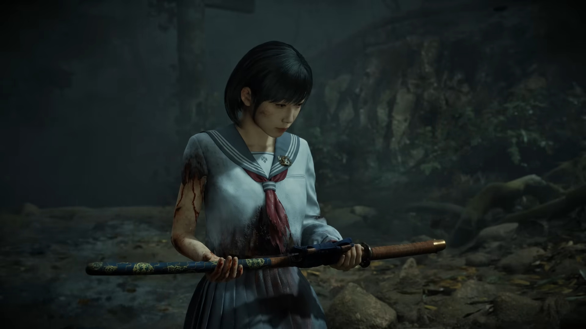

第二次世界大战前（1939年前），米田老师得到稻荷神的神喻，尽可能买下小镇「戎之丘」北侧山脉的土地，甚至不惜要借钱买下来，那座山将会为他带来巨大的财富。后来政府决定在「戎之丘」兴建水坝，米田老师的土地被政府以高价收购，他把这笔巨款全部用于振兴「戎之丘」，并在水坝兴建期间创立了气派的「戎之丘中学」，同时把稻荷神龛和神像捐赠给学校。

**「戎之丘」因为水坝工程和煤矿，吸引大量劳工移居令小镇变得繁荣**。在第二次世界大战结束后，「戎之丘」设立了第一个诊所，由外地来的现代医生执业。

（小镇因为煤矿而繁荣是《SH》主系列的共通设定，只有《SH4》及《Homecoming》是灰原镇和牧羊人溪谷。渡假小镇「寂静岭」过去因煤矿而繁荣，在美国内战后受到邪教和毒品支配，秘密进行邪神复活和献祭仪式，初代游戏结局中献祭仪式被主角哈利‧梅森破坏，神秘的力量仍然存在。真人电影版改为邪教献祭失败，导致小镇的煤矿大火而废弃，并产生大量的煤灰。）

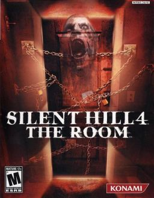

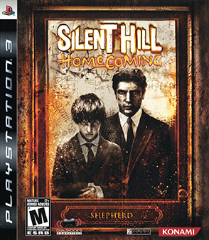

除了米田老师外，另有一个传说，某个居民曾经赠送食物给一只瘦得皮包骨的狐狸，结果狐疑附身到其妻子身上，告知他在什么地方埋有宝藏。却说又有一次，狐狸附身在祈祷师身上，告诫众人饥荒即将来临。

**传说「稻荷神」会帮助其信徒，但相对地不容许被侮辱，会用极为残忍的方式报复**。根据「戎之丘」农夫给儿子的纸条记述，曾经有一群宪兵队从外地来到，他们在喝醉后踢了「稻荷神」，甚至在上面吐口水。第二天早上这群宪兵被发现全部死在沟渠里，脸面表情因为恐惧而扭曲，尸体的肚子异常肿胀。遗体被送到诊所检查发现，从喉咙、胃、肠，到屁股都塞满了几十至几百只的老鼠、小鸟、青蛙、蛇的尸体。

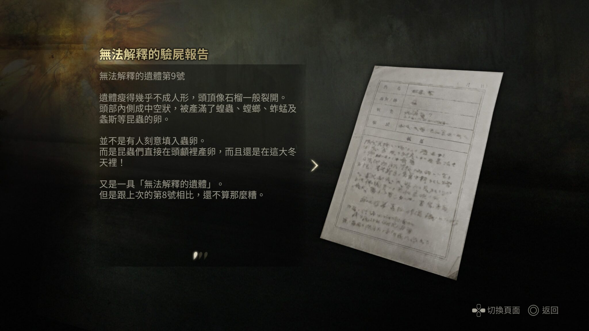

在诊所中不能带出和公开的好几具验尸报告中，也有提到有犯下「妨害祭礼罪」的受害人，得罪「稻荷神」后受到报复的下场。冬天的遗体瘦得几乎不成人形，头顶像石榴裂开，内侧变成中空状，产满蝗虫、螳螂、蚱蜢、螽斯等不同昆虫的卵，当地的警察都会刻意回避不调查。

「复仇记」作者的父亲就曾因为各发自治会的神社部盗用费用，后来死于意外故事，神社的就人推说是「稻荷神」作祟。作者开始四处去发信仰是无稽之谈，结果身体失去食欲，吐出蝗虫的幼虫，后来开始在睡觉时吐出各种成虫，头部开始被虫卵占据，但受制于「戎之丘」的信仰求诊无门。

**「戎之丘」本来就有药师世家岩井家，诊所的医生则来自「戎之丘」外面的地方，采用现代的医学诊断和药身处方**。部分老人仍然信任传统汤药，只有汤药无法改善病情才会前往诊所就医，后来诊所医生和岩井家在讨论后决定合作治疗。

然而，「戎之丘」的居民认为受伤时只要参拜「稻荷神」，愈虔诚就会获得神的加护，疼痛就会减轻和加快痊愈速度，甚至老人声称受到骨折重伤都会很快好转。有时候病人只是接受了问诊，都会不药而愈，医生认为信仰以及与患者之间的信赖都有帮助治疗的效果。

**后来医生在酒宴上遇到岩井家的长辈，有着不为人知的丰富药学知识，又发现岩井家使用受到法律管制的药物**。考虑到岩井家的药是「戎之丘」的传统之一，医生决定不过问岩井家的处方。另一方面，医生亦开始了亲身进行「服用实验」，发现连续数日服用「科库里麻科库罗」后可以进入清醒梦，以及在黑暗世界中进行探索思考。在连续服用两星期后，平均每两天就会出现一次清醒梦，终于医生在梦里找到可以对话的另一个自己。

昭和20年4月（1945年），**「戎之丘」清水区突然喷发温泉，连日喷发超过30公尺高的水柱，造成噪音和硫化氢的恶臭，温泉水极高的含砷量造成严重污染，混有硫化氢的水蒸气令三名受害者的皮肤溃烂**。同年5月，「戎之丘」频繁发生微弱的地震以及大量无感地震，被认为是大地震的先兆，而虔诚的老人认为地震是「稻荷神作祟」。深水家后面的山路因为土石崩塌而封闭，亦可能因为地震和温泉喷发。

（历史上1945年1月13日在三重县发生了严重的6.6级「三河地震」，罹难人数2306人，每天超过40次的余震。作为「戎之丘」设计原型的岐阜县，就是与三重县相邻的北方。）

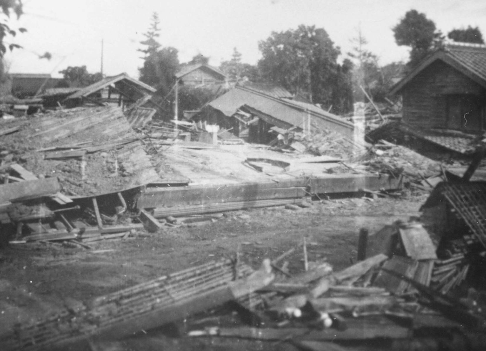

**随着「戎之丘」的煤矿关闭和水坝工程完结，逐渐没落成为乡村小镇，但仍然保留着少数比较豪华的建筑，唯有连接小镇与市中心的宏伟铁桥，令人回忆起几分当年的繁华**。「戎之丘」经常有狐狸跑到镇上，虽然镇上的老人尊敬狐狸，不会主动去打扰，却有小朋友因为好奇心而刺激对方。为了避免因为动物身上的病原体引发感染，医生开始劝导居民不要用狐狸接触。

**不过，在「戎之丘」公园就曾经发现过狐狸咬伤小孩的意外。年幼的寿幸被受惊的狐狸弄伤，年幼的深水雏子成功安抚狐狸帮助了寿幸，赶来的大人们打算杀死狐狸，但狐狸最后被雏子保护放走了**。寿幸因为家庭因素，不久后就紧急搬家，但仍然喜欢着雏子，双方一直保持书信来往，有着难以想象是同世代孩子的文笔和字迹。

在诊所「旧病历」的文件中提到，寿幸被狐狸所伤的后曾经高烧昏迷，只有诊所医生和寿幸独处的时候，他突然坐起身，回应医生的呼唤时却忘记了自己的名字。医生认为患者因高烧而记忆错乱并不罕见，但寿幸的表情变得如人偶一样冷漠。第二天寿幸再次昏迷，很快就被来到的救护者接走，**医生在「戎之丘」行医已经有一段时间，让他想到寿幸可能是被狐狸附身**。

---

## 主要角色背景

雏子从小就是让人头疼的孩子，经常与父母产生摩擦，只有姐姐**润子**理解和保护她，成为家庭的润滑剂，直到姐姐出嫁，家庭开始分崩离析。润子提到「女人就该活像个女人」的说法，被视为通往幸福的捷径，但雏子并不认同别人安排的道路。

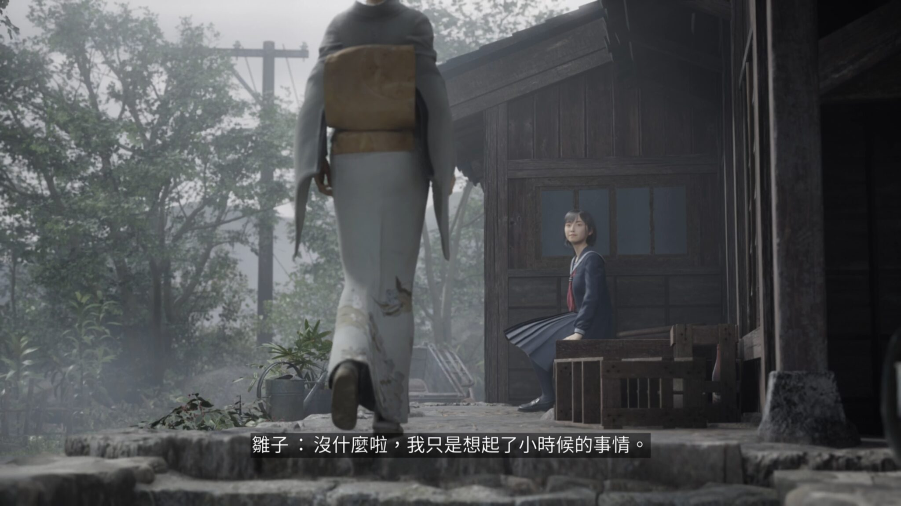

**在雏子的眼中有一个不同的世界，她有着不同于同世代人的价值观。受到父母和成长环境的巨大压力影响，雏子对男女的关系和友情都有着不同于日本传统的理解和感性**。她讨厌使用暴力又只会发脾气的父亲，讨厌母亲千依百顺的态度，父亲曾经向雏子投掷菜刀造成了终身的阴影。

雏子讨厌别人为其作主，不会受到同性影响，经常与男生游玩，在同龄孩子中也是个异类。不过，**雏子小时候唯独有一个赛璐珞人偶，独自一人的时候总喜欢与人偶对话，但人偶在成长的期间不翼而飞。基于小镇供奉老旧物品的「付丧神信仰」，雏子一直想寻回人偶将其供奉**。

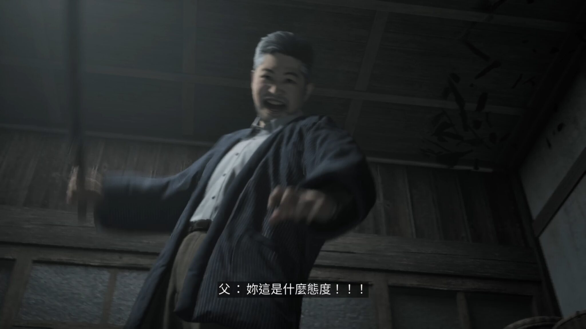

除了姐姐润子外，能够理解雏子的是另一个青梅竹马**岩井修**，一起进行宇宙战争游戏，两人以伙伴相称。小镇内的其他男性在雏子眼中，都与讨厌的父亲没什么分别。修来自药师世家岩井家，不会嘲笑雏子，也不会捉弄异性，认为自己体内流着药师之血，**自小就跟随奶奶学习各种植物和药草知识**。

由于雏子长期受到家庭压力影响，入读中学后开始出现紧张型头痛，最初修推荐她服用市售的止痛药，雏子却出现对药物的上瘾和依赖性。**修决定自己制作止痛药让雏子服用**，他认为雏子渴求的不是药物，而是能够放开聊天的对象，而修对雏子的感情早就超越了伙伴。事实上，雏子亦认为修不单唯一的理解者，也是伴侣。

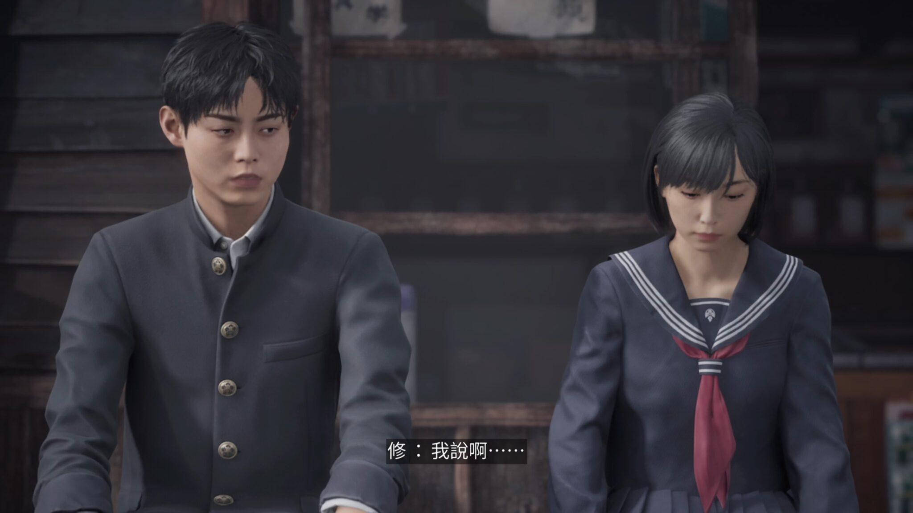

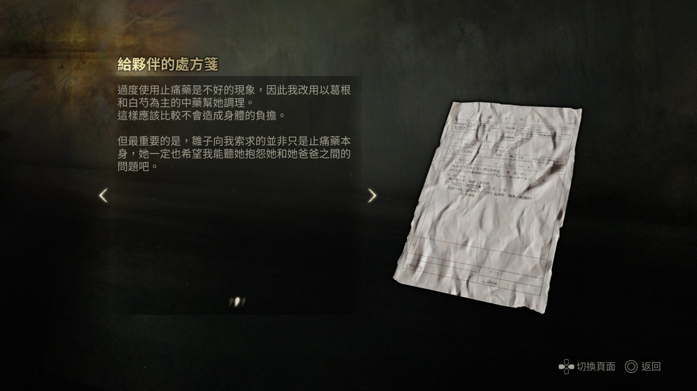

后来雏子和修在中学认识的两名女生朋友：**五十岚咲子**和**西田凛子**，在表面上和平的中学生涯背后，形成一个扭曲的复杂关系网

**五十岚咲子**是「千年杉神社」神主的女儿，天真无邪又爱作梦的孩子，梦想是继承神主职位，每逢新年都会穿上巫女服贩卖御札。**先天的灵能力者**，能够梦见很神明和幽灵，以及「戎之丘」里深深缠绕的灵体和宿怨，**古老的神祇因为被夺去信仰，一直想要报仇雪恨**。不过，身边的大人们根本不相信咲子，甚至带咲子去见精神科医生，仅诊断出有轻微的自闭症倾向。

咲子因为灵感体质，能够听到不存在的声音和歌声，在学校被当成是怪人，变得害怕黑暗，因为黑暗会让她感受到孤独。雏子是她第一个结交的人类朋友，咲子开始对雏子产生扭曲的依赖，后来咲子向雏子借了500日圆，一直赖着不还钱，成为两人之间的连结。

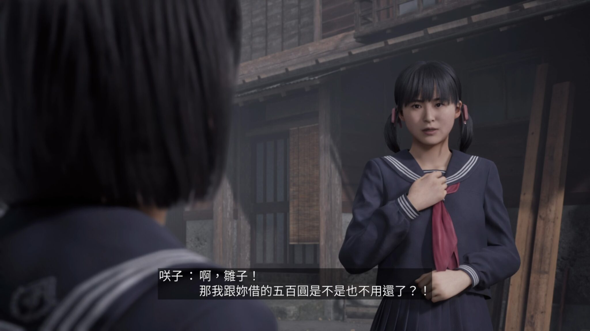

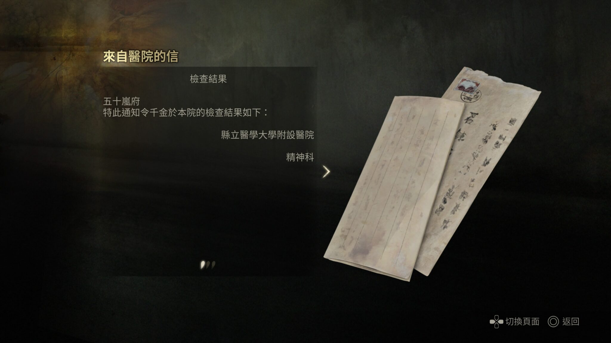

**西田凛子**是中学时的班长，个性认真又死脑筋，热衷于学习和钻研女孩子的兴趣及服装。然而，真正的凛子是个内心异常扭曲，从其他人的失败中获得成功感，帮助别人仅为了满足自己更加优秀的优越感。与雏子和咲子结交，仅仅是让身边有两个异类，从而满足自己的虚荣心，**后来喜欢了雏子身边的修**。

「戎之丘」的中学生流传一个折纸小魔法，写下不能说出口的心声，折成狐狸的外形放在无人处，借此消除心中的怨恨作为心灵供养。若果其他人发现折纸，需要阅读入面的内容后供奉在稻荷神像，内容不可外传。凛子写下过无数的纸狐狸却未有供奉，表面上与雏子关系很好，并多次向对方表明喜欢修。她不满雏子一直钓着修的感情，妒忌一直待在修身边的雏子，甚至到了写折纸祈求杀死对方的程度，更散布不少雏子的坏话。即使如此，凛子写给修的情信，却从未成功传达。

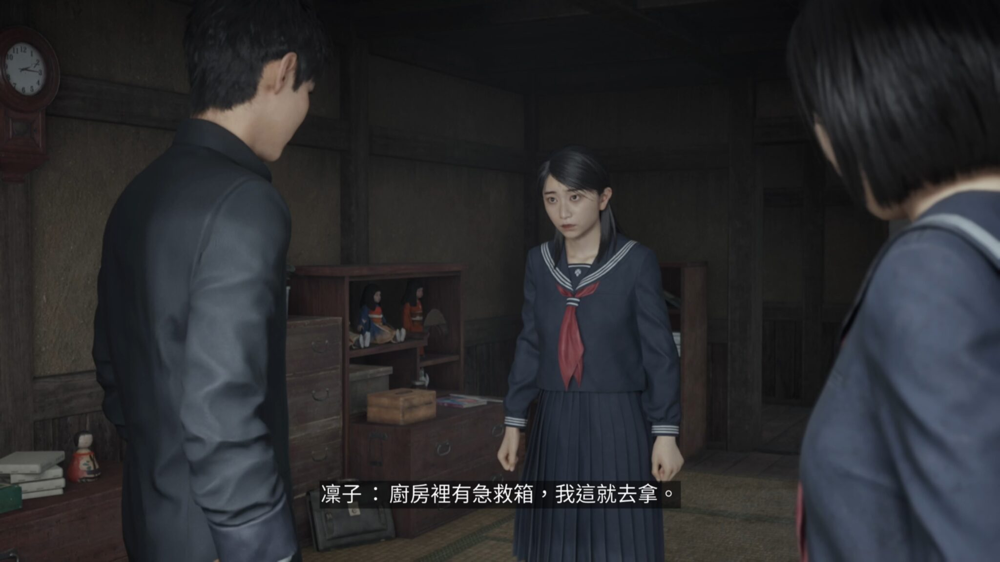

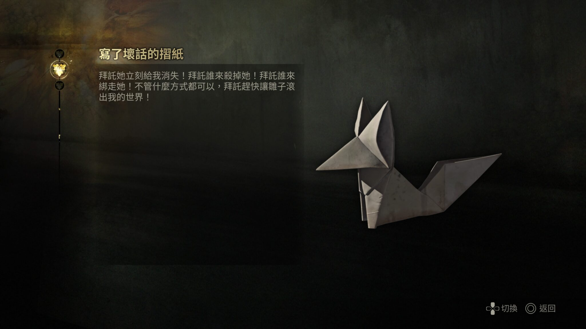

从「戎之丘」搬出去的**寿幸**，真正的名字是**常喜寿幸**，来自世代都是借着灾难财而发达的富豪常喜家，名字来自父亲英寿和母亲幸枝。常喜家因为「趁火打劫」而招人忌恨，流传着「死没良心老常喜，乘人之危赚一笔」和「常喜家常常喜孜孜地盼着天下大乱」等坏话。

寿幸实际上是常喜家私生子，少爷英寿在年轻时风花雪月，当中包括一个年轻貌美的女佣幸枝，幸枝甚至怀上了寿幸，两人曾经考虑过私奔。然而，常喜家后来找到一门相当有利的亲事，最终英寿抛弃了幸枝，被视为障碍的幸枝被赶到了「戎之丘」，带着满腹委屈流下血泪，但幸枝并没有放弃带着孩子回到常喜家。

**后来常喜家女佣传言出现了「诅咒」而人心惶惶**，患者会出现头痛、发烧、头晕、畏寒、呕吐、腹泻等病征，之后会变得呼吸困难、意识障碍、运动障碍、不自主运动，以及容貌变成狰狞诡异，咬紧牙根和双眼上扬。**最后患者会发出怪叫以及四肢爬行，如同被妖狐附身**。常喜家族长对女佣和医生下达封口令，最后英寿、现任夫人、长子死亡，遗体发出剧烈的恶臭，皮肤腐烂剥落，族长下令直接火化。然而，长女和次女在发病后突然完全康复。

（游戏内「闇之社殿」可以找到很多「稻荷神」和妖狐一族的相关暗示，亦可以肯定常喜家与「稻荷神」的关系。书库更有一本书，提到「用尽所有秘术和秘药，将其精神和肉体归于我等」。无法确定常喜家本来就是妖狐族，还是后来全族被狐狸夺舍，或寿幸为了成为继承人而咒杀本来的家族，只能肯定这一代有被下诅咒。当然也有可能族长是九尾狐，再挑合适的后人夺舍。）

---

## 时间来到游戏主线的1960年代（1962年10月6日）

雏子的父亲深水宽太本来是个渔民，有着相当高超的厨艺，但因为受骗而欠下巨债。深水家的姐妹都只能穿着旧衣服，在中学基本上抬不起头，加上父亲经常发脾气、迁怒以及有暴力倾向，造成与深山家庭的撕裂。姐姐润子在出嫁后就再也没有回家，雏子亦仅在后来见过消瘦的姐姐。

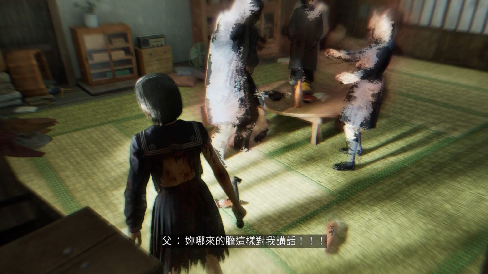

**在游戏第一周目开局**，雏子无法忍受暴躁父亲强烈的情绪勒索、不可理喻的养育欣慰论，并与成熟的姐姐对比。纵使心底对母亲的卑躬屈膝感到不满，仍然在母亲的保护下逃走，到小镇上的杂货店「千鹤屋」想找个朋友见面，那里亦是朋友们自少最常聚集的地方。

**游戏第二周目后的开局**，变成父亲正喜牧牧地谈论雏子的婚事，常喜寿幸努力精进自己终于成为继承人，就以偿还深水家的债务为条件，提出与雏子的婚事，这一天正是雏子的大婚之日。雏子出门前往「千鹤屋」，因为她无法理解和接受被他人决定的婚姻。父亲把女儿卖了，母亲认为女儿找到一户好人家。在过去的时代，因为政治地位或金钱的联姻并不稀奇，不问男女都可以是一个货币。

**真相是二周目开始才是现实，一周目是混集回忆来混淆视听**。故事开始的时候，深水雏子实际上已经20岁，即将出嫁，角色以学生的形象出现，只是雏子想停留在那个时光的投射。不论哪个周目，大部分的剧情顺序和BOSS都不会改变。

**由于成长环境导致雏子有严重的婚前恐惧症**，除了父母和姐姐的影响，甚至可以在田里，找到一封妻子遭到丈夫虐打，在怀着孩子出逃的书信，丈夫在相亲时戴着温柔的假面具。在各方面都反映出在那个时代中，女性普遍在家庭的地位低下，雏子对婚姻充满恐惧。

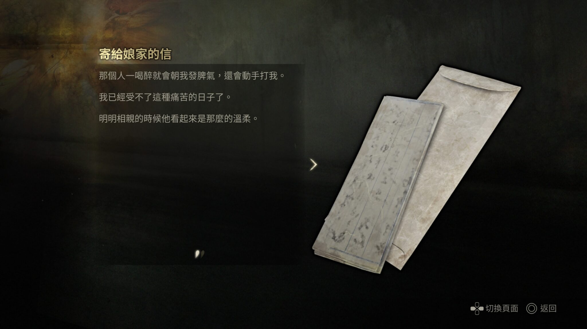

---

## 游戏流程解析

在游戏第一周目早期，剧情以「遗忘」和类似「多种人格」的方式隐藏。在后续的剧情当中，明确分别「现实世界」和「表世界」是「**深水雏子**」，而「里世界」则是逐渐狐狸化的「**狐之雏子**」，两个对立思维底下「独立的自我」。

雏子前往「千鹤屋」途中会经过咲子的家，**被咲子称为「叛徒」**，两人仍然相约到「千鹤屋」见面。「叛徒」反映了咲子与雏子的过去，雏子是咲子第一个人类朋友，约定绝对不会抛弃对方。**雏子结婚后，咲子就会独自一人，回归孤独的黑暗内，所以雏子变成了「叛徒」**。

在「千鹤屋」雏子会遇到修，以及之后来到的凛子和咲子，「戎之丘」随即受到「表世界」的浓雾和红花群（彼岸花）侵蚀，咲子很快就被寄生而死亡。雏子遭到迷雾里的怪物追杀，与修和凛子失散，途中与各种怪物战斗，即使成功与两人会合，都会突然在雾中失散。整个「戎之丘」都被雾所包围，其他村民全部失踪。

为了逃出「戎之丘」的「表世界」，三人顺序走访了整个小镇、诊所、农田、郊外小神社、凛子的家，却发现唯一连接外部市中心的铁桥被红花摧毁。最后决定从修家的后山路逃走，他们又顺序走遍了旧千年杉神社、戎之丘中学、避难小屋、修家。最后为了向怪物复仇，雏子回到了深水家，却发现深山家变成了一个诡异的迷宫。

途中雏子会多次偷听到凛子和修的密话，**凛子向修劝说该放手，「雏子已经死了」**。雏子来到凛子家的时候，凛子会从后把雏子推下楼梯，尝试亲手把雏子杀死。**凛子把雏子出嫁形容为「死去」，代表了修和雏子的关系已经逝去**，即使如此，凛子都无法令修回心转意。同理，凛子的折纸会到咲子即将「死去」，对应咲子是最早受到侵蚀而死亡，咲子应该是最早出嫁的成员。

**从「千鹤屋」开始回到「深水家」的整个旅程，其实也是雏子在现实世界对学生时代的回顾，也是她一直想停留的时光总结，在结婚前都害怕着，被困在迷雾当中，「属于深水雏子的部分」**。小时候曾经在农田迷路，对成年人和稻草人妖怪的传说产生恐惧。在戎之丘中学回忆起其他同学的坐位，他们在课室内的种种，以及狐狸折纸的传说，窥探他们的内心真意。离开修家，最后回到深水家告别父母。

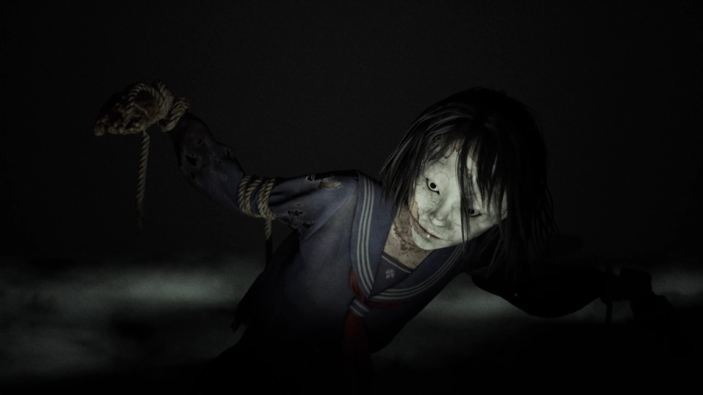

如同《Silent Hill》系列，雾里的异世界是都地域和邪神的特殊力量，反映不同人的内心投射，由各种喻意构成世界。「戎之丘」则是来自「九十九神」、「稻荷神」、「水龙」的信仰力量，来自三个神祇的仙界战争。（实际参战的只有「九十九神」和「稻荷神」。）

**路上看见的怪物同样，没有面貌，永远带着虚假的微笑，如同被扒了一层皮的女性人偶，代表那个时代的女性。拿着菜刀的肥大怪物，反映了雏子对父亲挥刀家暴的精神创伤。化为怪物的稻草人，来自雏子儿时在农田迷路的可怕回忆。全身长满大量乳房的怪物，在战斗途中会不断产下小怪物，来自过去时代把女性视生育工具的形象**。

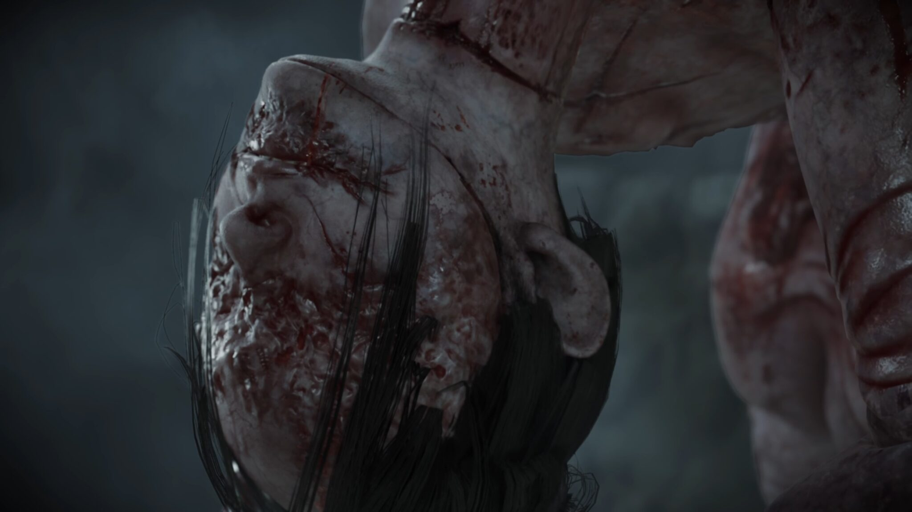

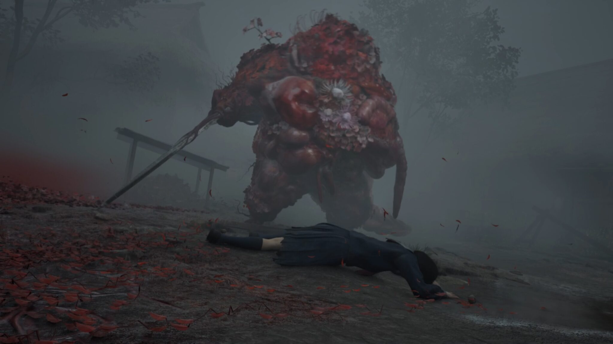

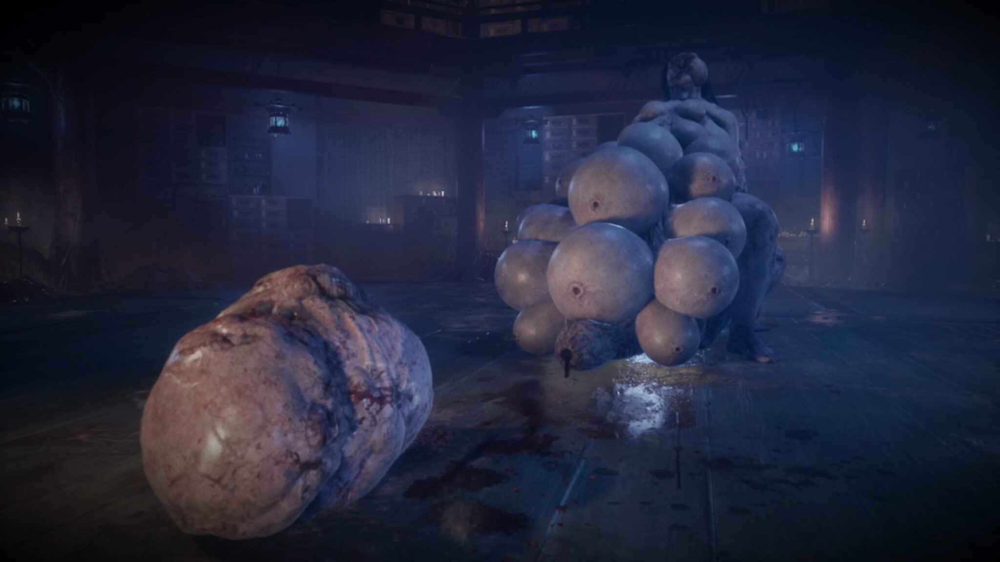

**旅程期间雏子会多次因为头痛而昏倒，在每个地标来到「里世界」的「闇之社殿」，雏子会在「狐脸男」的带领下前往圣域，完成仪式成为狐狸族，「属于狐之雏子的部分」**。只要跟随「狐脸男」的脚步就会获得幸福，喝下变为熔岩的水，净化自身的污秽，与过去的朋友道别。雏子打倒了化为恶灵的咲子和凛子，在「闇之社殿」把咲子埋葬于黑暗（变回孤独一人），把凛子推落熔岩烧死（妒忌之火），最后用铁链把修吊死，斩断情义。

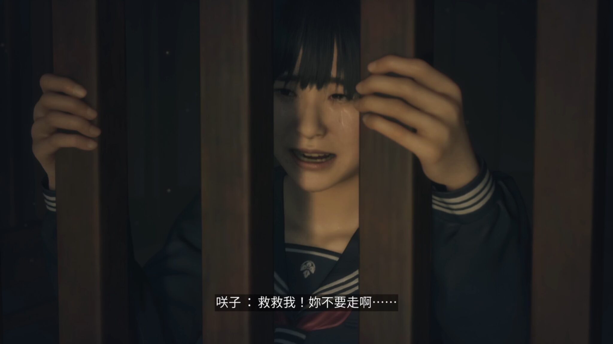

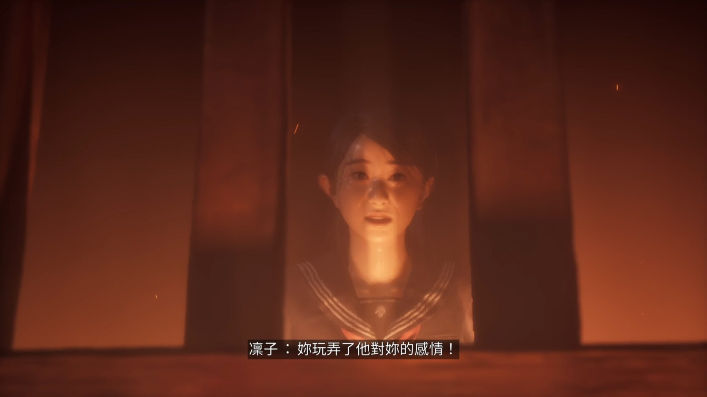

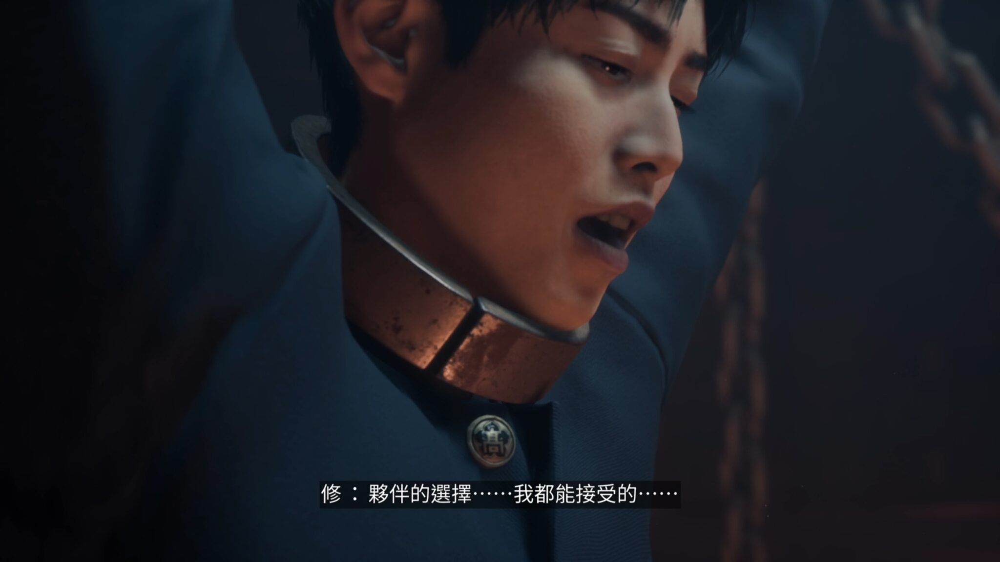

**化为恶灵的咲子穿身憧憬的巫女服，没有下巴（没有信用），身体和心被开了一个洞，咲子坚信雏子不是自愿前往圣域，化身障碍阻挡在她的眼前，然而雏子最后还是被「狐面男」带走。恶灵凛子没有面孔（脱下假面具），驱使和召唤傀儡，千方百计杀死雏子，把雏子赶出她的世界，好让自己能够与修相宿相栖。在成为恶灵之后，双方反而可以打开心扉对话，她们的形象反映出各自内心的渴求，现实中各人的交锋意象化**。

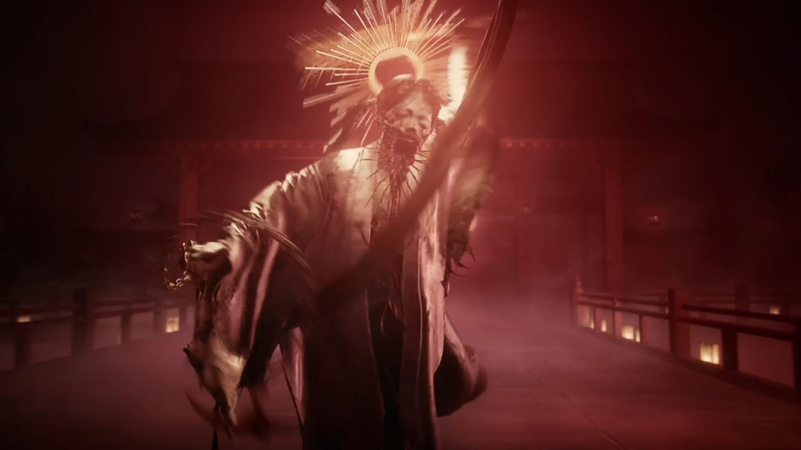

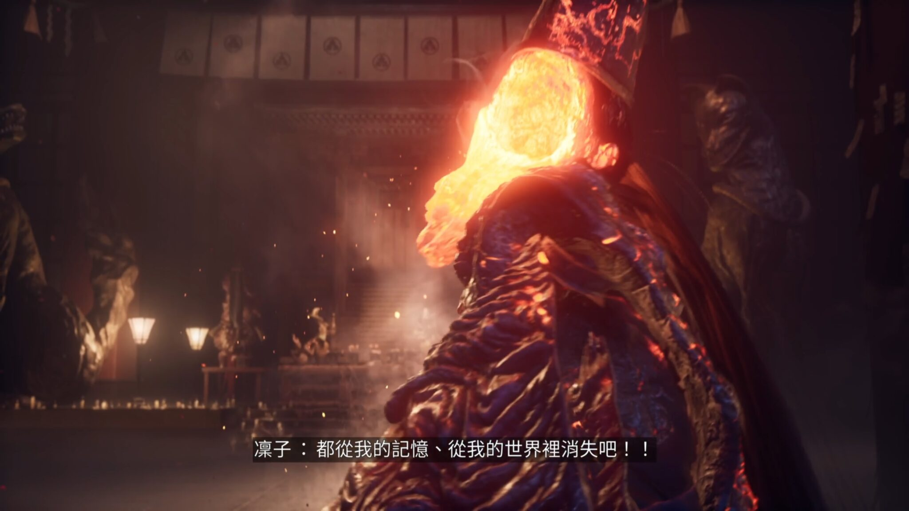

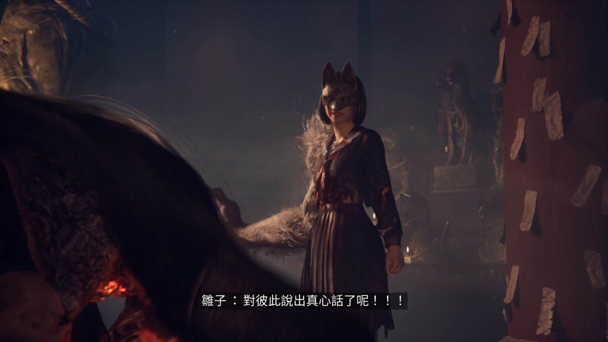

如果从「狐面男」驱逐妖怪化的咲子来看，也有可能是咲子从一开始就反对这场嫁事，所以「狐面男」从婚礼上驱逐或根本没有邀请咲子，所以故事一开始咲子就被侵蚀死了，没有参与整个旅程。

「闇之社殿」三阶段的仪式中，雏子亲自砍下自己的右臀，移植狐狸的巨臂，在背部刻上狐狸一族的烙印。最后由狐狸侍从把雏子的脸皮割下，替换成狐狸的脸具，获得狐狸的眼睛。在这些仪式中，雏子成为别人的力量、成为别人的所有物、舍弃本来的自我和真面目，从此成为别个家族的一份子。

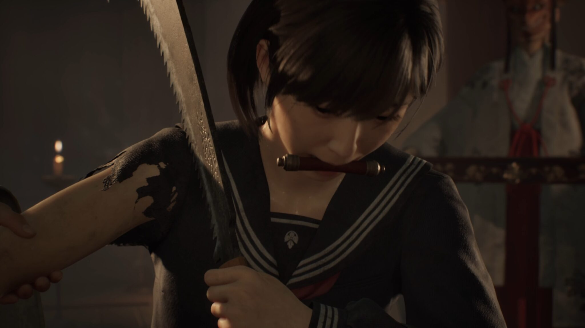

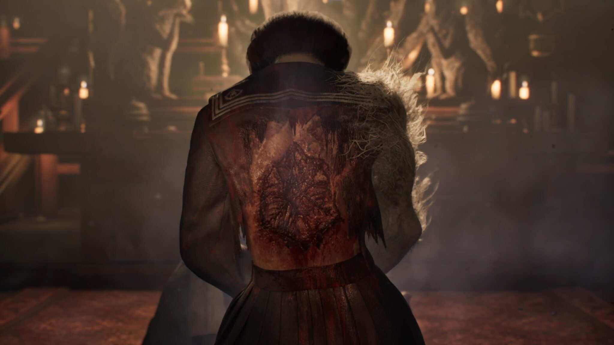

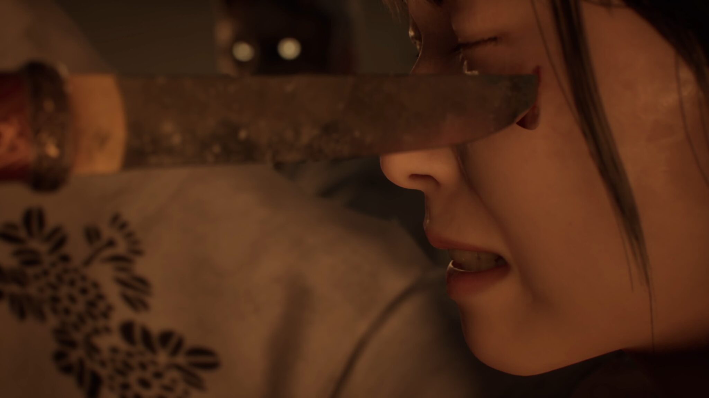

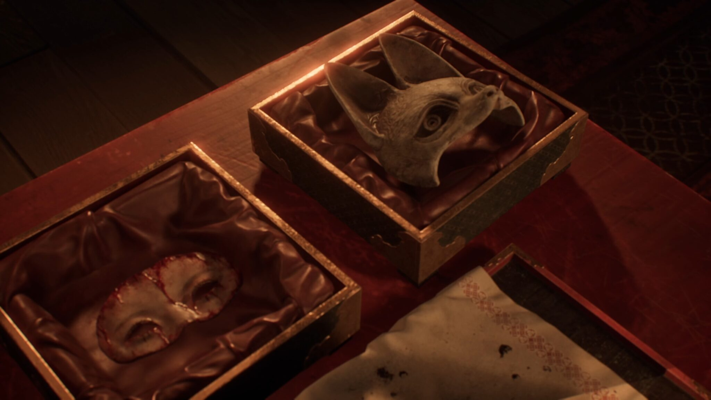

**最终在「里世界」的自我会变成「雏子」，而不是「深水雏子」，因为婚后会冠上夫姓，不再是本来的自己，「雏子」会忘记和否定自己是「深水雏子」，成为「狐之雏子」**。「闇之社殿」尽头的圣殿，有着无数狐狸族人和佣人的祝福，实际上就是现实世界的结婚会场。最后迷宫化的深水家，就是成长时内心压抑的累积，让「狐之雏子」和「深水雏子」进行对话。

「深水家」的迷宫和「闇之社殿」的蜿蜒道路，代表着迷失和不断绕远路的内心，雏子在最后会评价自己是刚愎自用、孑然一身。所有「讨厌」只是逃避的借口，面对自己、与自己沟通，深思熟虑后下的决定才是最珍贵，不论结果如何。

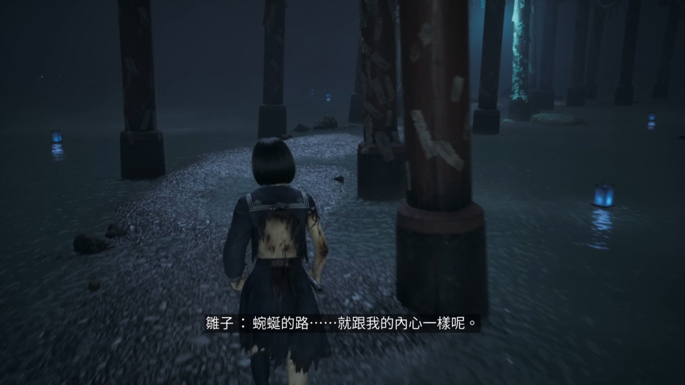

「表世界」的「深水雏子」，还是在「里世界」的「狐之雏子」，她们都会见到儿时的**赛璐珞人偶**。偶会指引两位雏子，「不要相信狐狸」、「不要相信凛子」、「不要去某个地方」等，阻止雏子去结婚。姐姐润子会戴着「乌天狗」的脸具，在婚礼前后现身。（游戏内无法得知润子和「乌天狗」所属的势力，润子从未阻止雏子的道路，而是让她继续前进，「乌天狗」也可能只是比喻姐姐出嫁后成为另一个家族。）

当「深水雏子」回到深水家，回顾自己中学时代家庭的影响，终于能够与深层意识的自我「**雏子之影**」对话。「狐之雏子」杀死了三个好友，「深水雏子」则会看到三个被吊死的好友尸首，直面儿时对菜刀的阴影，击退幻化成怪物的母亲。**最终「狐之雏子」被彼岸花侵蚀，变成没有面貌的怪物「白无垢」，回到深水家杀死了父母。白无垢即日本传统的婚纱，无貌的新娘，杀死父母代表告别**。

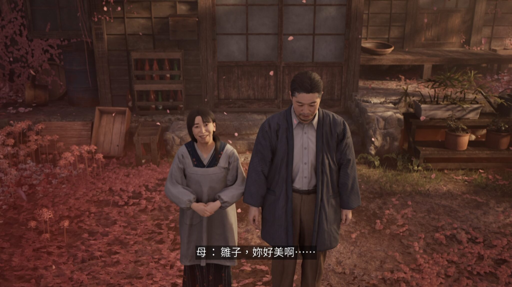

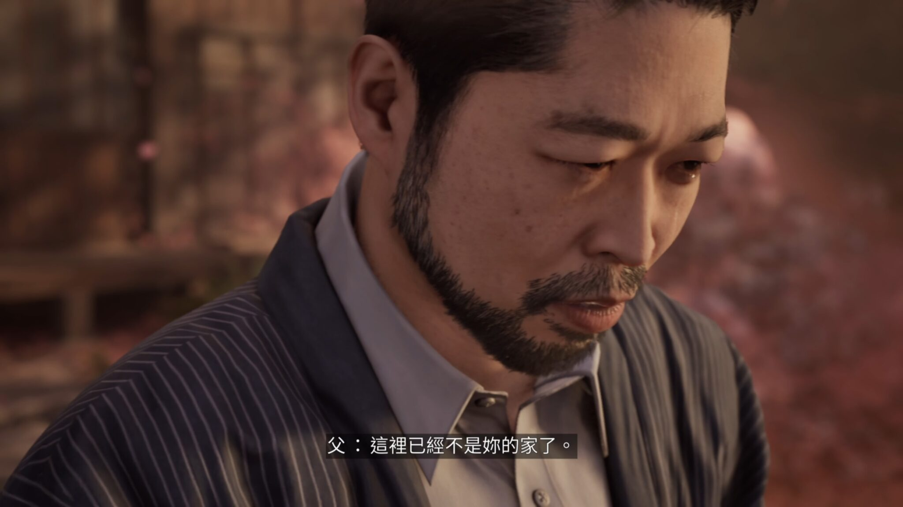

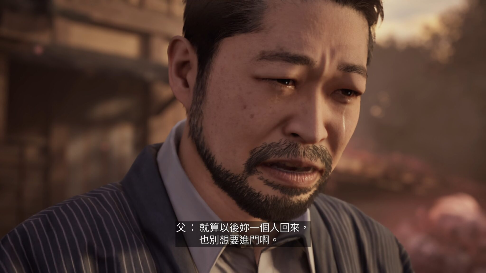

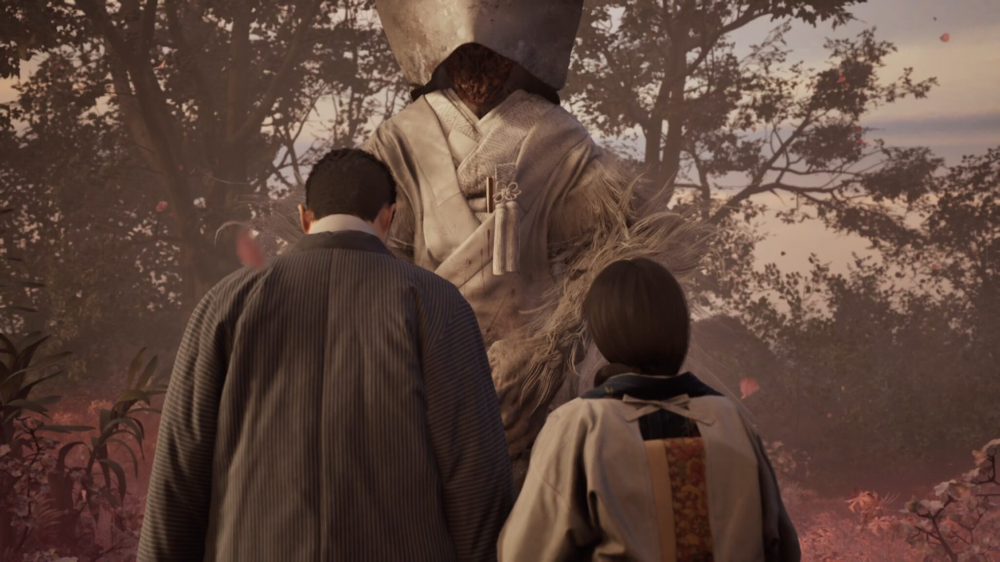

在润子的诱导下，「白无垢」会杀死「深水雏子」，认为这是为了让她摆脱过去和自我。「深水雏子」死后会来到「闇之社殿」，为了追杀「白无垢」而来到圣域，最后「深水雏子」破坏圣域并与「白无垢」展开厮杀。

（深水家迷宫的自我对话内容，根据进入不同的结局路线而改变，打败「白无垢」再接续进入的剧情都不同。游戏内的剧情顺序是反过来，先让玩家看见「白无垢」杀死「深水雏子」，之后再揭示「白无垢」其实是「狐之雏子」。）

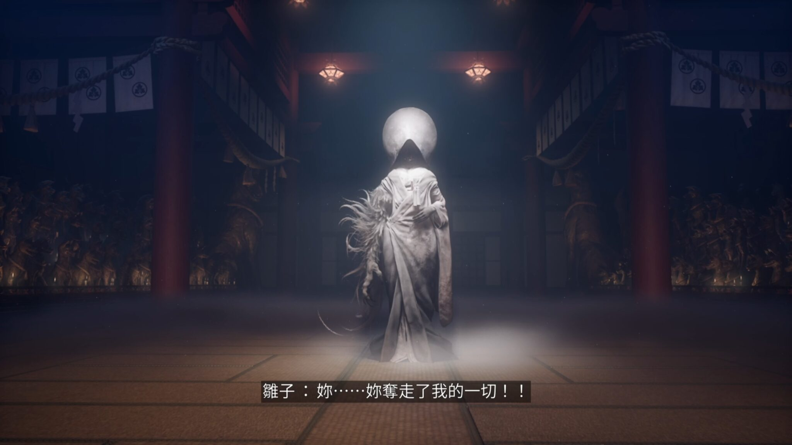

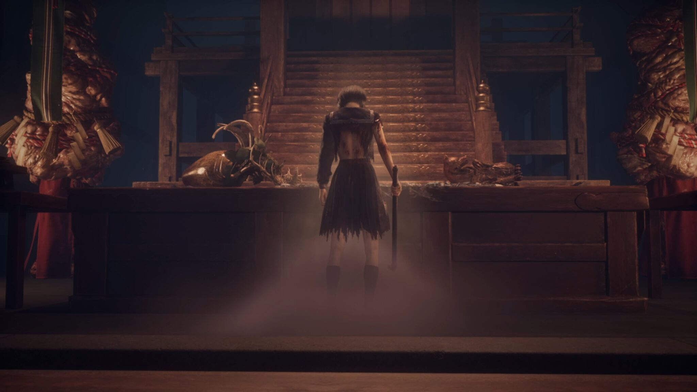

**游戏第一周目的故事最后，玩家会知道「狐面男」就是常喜寿幸，戴着脸具的他也代表受到家族世俗束缚。只有在无人的情况下，寿幸曾经偷偷地脱下脸具，诉说自己对雏子的感情，其实寿幸也是雏子和修的青梅竹马**。

---

## 结局详解

### 第一结局—诅咒如雏鸟般归来

一周目是强制第一结局，也是以「现实世界」和「一般人」角度出发的坏结局，雏子在故事内形象为「雏鸟」。雏子过度服用「红色胶囊」而出现强烈的幻觉，手持铁管和菜刀破坏婚礼会场，避开追来的警察逃走。修会坚称不知道「红色胶囊」的强烈致幻性，强调自己不知道副作用，寿幸则继续维护着失控的雏子。根据警察的报告，雏子杀死了一名男性，以及重伤另一名男性，但没有提到两人是谁。

这个结局中所有事情都只是药物引起的「幻觉」，即使在「白无垢」的战斗中落败，「深水雏子」都会得到几乎无限的红色胶囊和多次复活。在离开圣域后，「深水雏子」都会在幻觉中看到大量「红色胶囊」，意识在各个地方跳跃，现实小镇上所有人都会变成怪物的模样，继续与「白无垢」进行无尽的战斗。

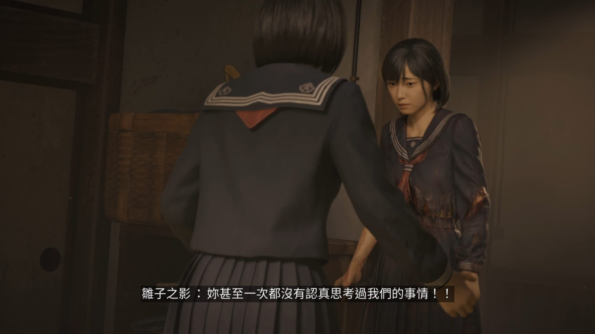

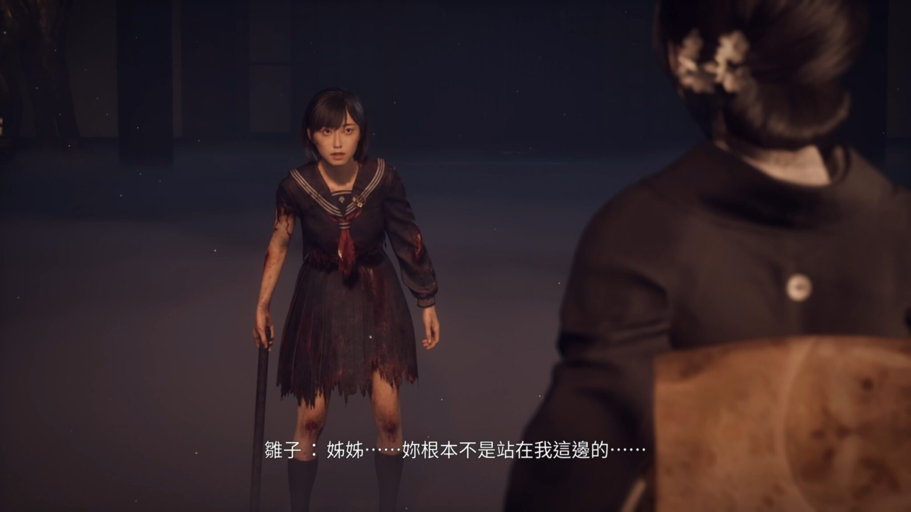

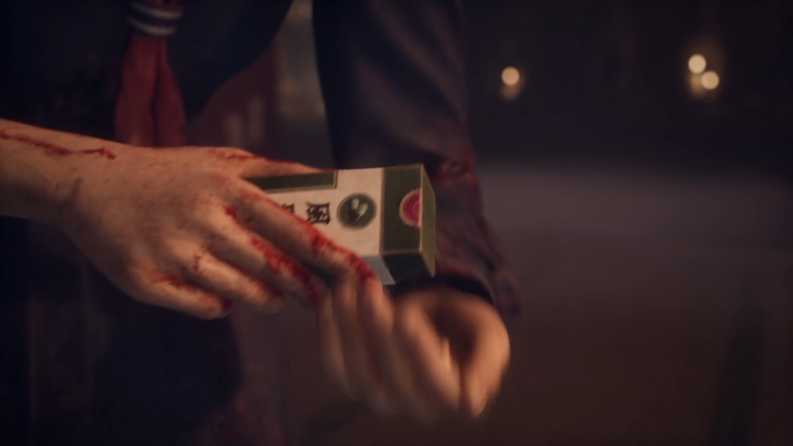

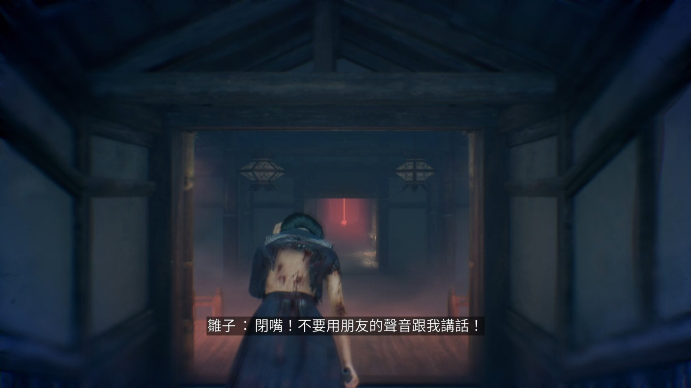

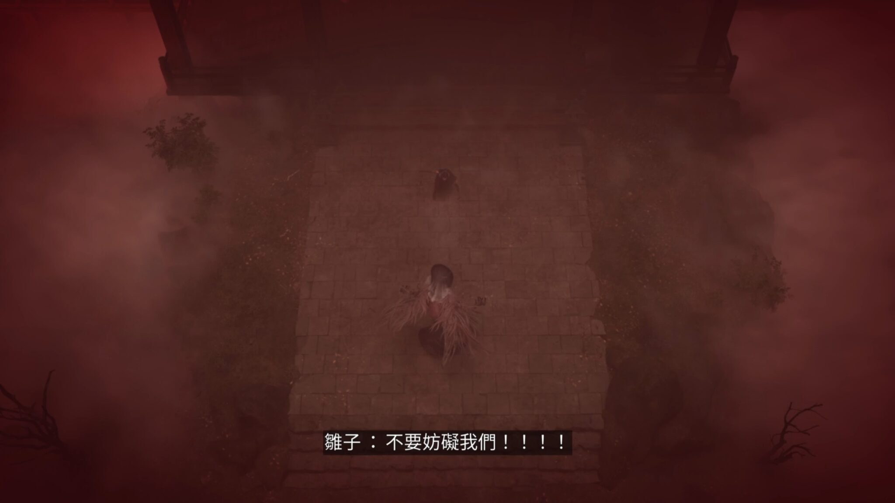

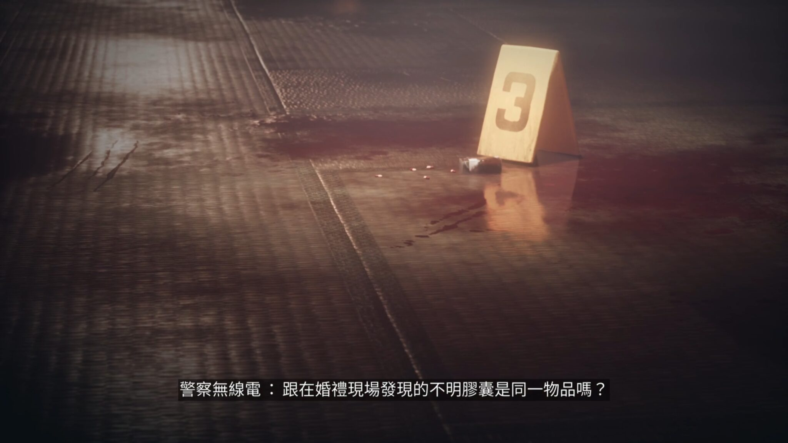

---

### 第二结局—狐狸娶亲

第二结局玩家不再服用「红色胶囊」，所以不会产生幻觉，在最后归还「红色胶囊」，而寿幸和雏子的婚礼关乎「稻荷神」与「九十九神」的信仰战争。即其他结局中，各种神怪事件都是真实发生。

二周目提到「戎之丘」的「稻荷神」信仰中有提到狐狸娶亲的传说，从当地选出一名有特殊血统女性结婚（第四结局表示血统是偶然出现），可以发现雏子是有特殊血统的灵能继承者，「稻荷神」需要雏子帮助才能继续封印水龙。「闇之社殿」的书库有记载「赤色泉水自母胎涌出，深不见底，即深水家。」

在第一周目就可以在小镇中心，找到铃谷真由美的失踪女性告示，在最终章失踪告示则会变成深水雏子。同样第一周目「闇之社殿」可以找到真由美迷失的石刻记录，第二周目真由美的石刻会变成跨物种婚姻和找到天堂，得知真由美就是上一个拥有特殊血统的女性，在最后嫁入狐狸族。

从族长备忘录得知，过去狐狸族的献祭仪式，祭品会被榨出每一滴血，混和八次酿造成酒，再摘下五脏六腑，放入咀嚼后的米饭重新缝合。祭品会放置于暗处直到溢出酒香，梳妆打扮后披上美丽的嫁裳，以草船乘载祭品，用血酒染红湖面。在祭品沉入水底后，暂时封印水龙的毒水。

然而事过境迁，现在仪式已经无法平息水龙的愤恨，决定在水龙沉睡的湖上放置巨大石块封印，施展暂时以土克水的强力法术，但有朝一日「土虚水侮」封印还是会被破除。「稻荷神」以巨大石块为地基建造宫殿，将其变为圣域，命名为「天瑞」。若封印失败，愤恨会冲破天际，降灾厄于世，灭天地万物。

雏子在山里找到破烂的地藏像，以及父亲供奉的旧菜刀，每次供奉旧物品时都可以听到风铃声。在供奉五个古老地藏像后，可以在千年杉找到明治时代曾经砍杀居民的「灵刀」，利用「赤色破邪之水」净化「灵刀」上的怨恨。「狐之雏子」则会在「暗之社殿」找到红水秘药「盘腿坐的布袋和尚」。

（游戏内「灵刀」不祓除怨恨，或没有获得「灵刀」，就会进入第三结局，不祓除「灵刀」会有自动回复耐久度以及防御机能。祓除怨恨后只保留极高的攻击力。）

「灵刀」的怨恨包含了「千年杉」即「九十九神」对信仰被夺取的怨恨，在结局中雏子会选择出嫁，选择了狐狸阵营。当千年杉无法吸收水龙的毒，就会从此枯萎凋零，也就是「刀」和「狐狸」的战争。

咲子的日记提到，她曾经做了个不可思议的梦，有一把寄宿着邪恶力量的诅咒之刀，刀与神平起平坐，祓除恶灵等同削弱污秽之神的力量。只要把刀浸在秘药之中，雏子就能够摆脱操控，不再迷失在雾中。

在「深水家迷宫」的两个自我争论当中，雏子会得出成为不一样的自己，「献出自己的翅膀」结论。岩井修在结局会来到圣殿，坦白自己调制给雏子的药有问题，内含能够与自己对话的成分，即「红色胶囊」的成分包含「科库里麻科库罗」，然而药性对部分人的体质十分危险。修谎称这是对雏子的头痛有帮助，想用药物让雏子拒绝寿幸的婚事，但雏子最后还是选择了寿幸。

第二结局的最后BOSS「九十九神」会现身，并且与修同化，与「狐之雏子」决战。在「狐之雏子」打败后「九十九神」后，附身在修的「九十九神」会分离倒下。修决定「暂时」把雏子交给寿幸，意味着日后会把雏子抢回来，寿幸接受了修的挑战，两人在清晨的太阳下对拳展示决心。最终寿幸会脱下会狐狸脸具，然而在婚礼过后，雏子对婚姻的恐惧却未有消失，一直认为润子就是被母亲高价卖出，哭喊着不想成为像母亲一样的人。这个结局代表「雏鸟失去了自由的翅膀。」

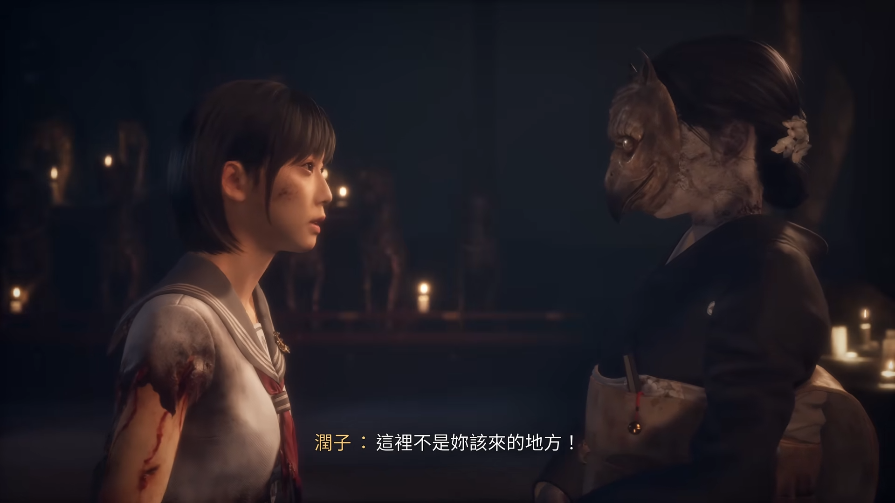

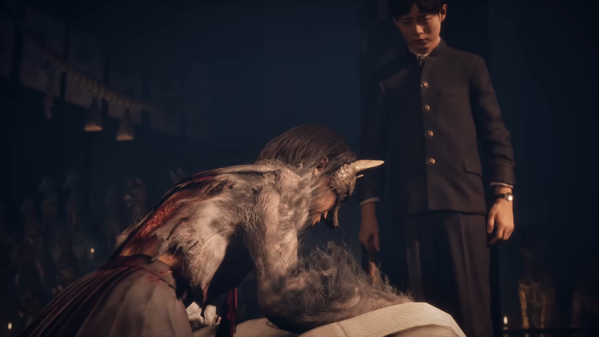

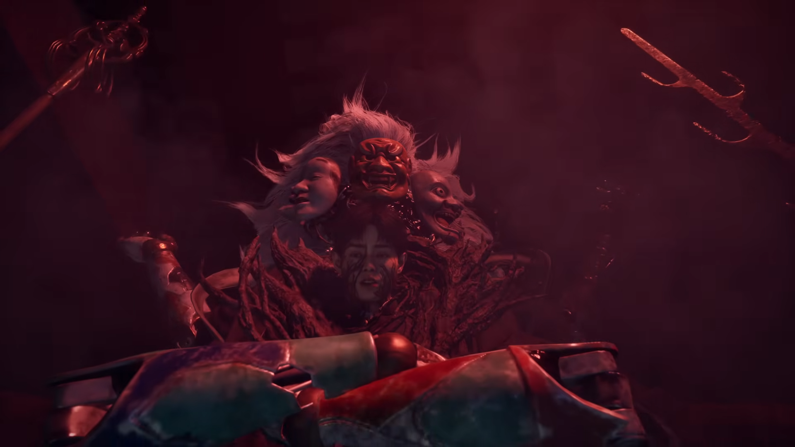

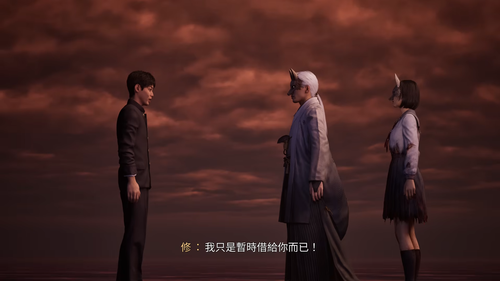

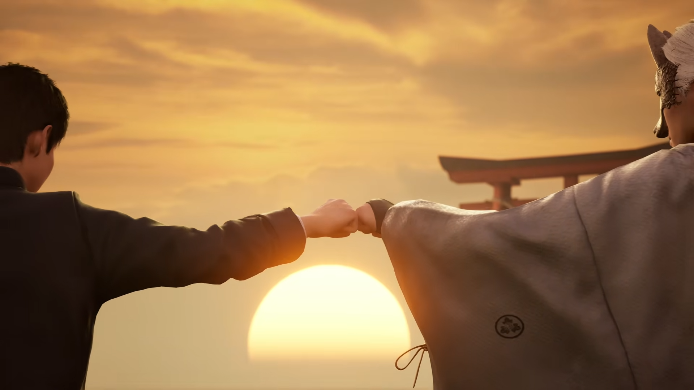

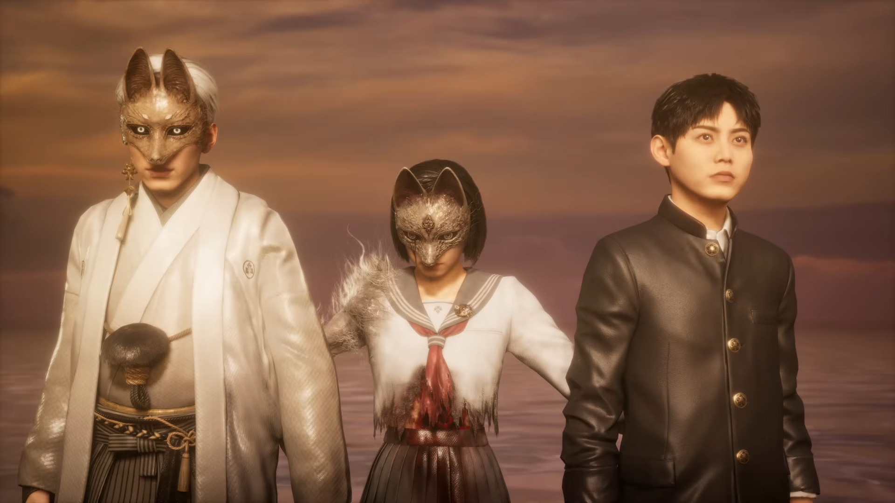

---

### 第三结局—狐狸沾湿其尾

第三结局玩家不再服用「红色胶囊」，所以不会产生幻觉。与第二结局相对，雏子如果没有找到「灵刀」，或没有净化「灵刀」上的怨恨，在迷宫化的深水家自我对谈，就会变成「雏子之影」取得主导权，确认自己对修的感情，「雏子之影」的脸部脱落。

**「我想永远做我自己……！」** 对比第二结局，可以确定深水雏子的内心认为婚姻就是失去自我，成为像母亲一样逆来顺受的人。当雏子和修渐渐长大成人，他们无法摆脱已经成为女人和男人的事实，害怕一直以来的关系化为乌有，纠结在「伙伴」和「男女」之间。

结局「深水雏子」会拒绝润子的劝导，遵从自我破坏圣域，修也会拿着球棒来到圣域袭击「狐面男」，大闹婚礼现场抢婚。最终「狐脸男」会变身成为第三结局的最后BOSS「**七尾狐**」，一个自年幼时受到雏子帮助，从此死心塌地爱上她的男人，为了雏子学习了所有人世道理、礼法、知识，他设法得到财富、名声、地位，只为雏子不再受到世间痛苦。（可以理解成「七尾狐」和寿幸都在儿时爱上雏子，比起其他人的夺舍，两人更像是目标一致而融合。）

当「深水雏子」打败「**七尾狐**」后，寿幸会明白到这是雏子想要什么，最后决定放手让雏子与修私奔。结果雏子和修会嘲弄对方衣服不合衬，修不适合绑领带，也就是「现实世界」中两人应该是分别穿着白无垢和领带西装。然而，雏子与修逃向的仍然是被迷雾包围的世界。失去雏子代表「稻荷神」无法封印水龙的毒，「现实世界」持续三个星期出现硫化氢水柱涌出，至今未止，「戎之丘」的居民全面撤出。

（从第二结局和第三结局可以知道，以「现实世界」的层面，水龙的毒水就是高浓度硫化氢泉水。硫化氢存在于部分火山、天然气和井水内，有着类似臭鸡蛋的气味，高浓度能够造成急性中毒和短时间内死亡。）

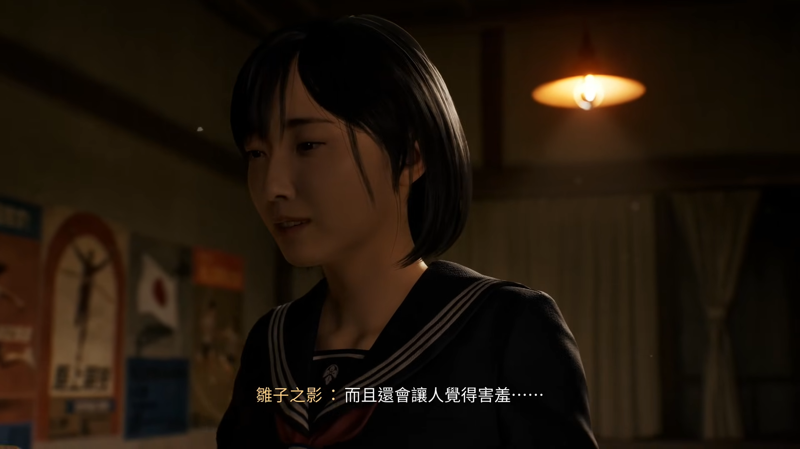

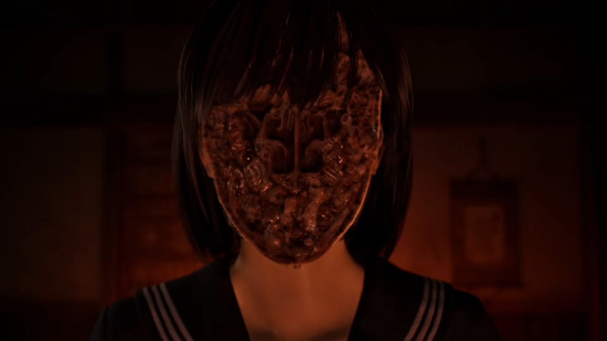

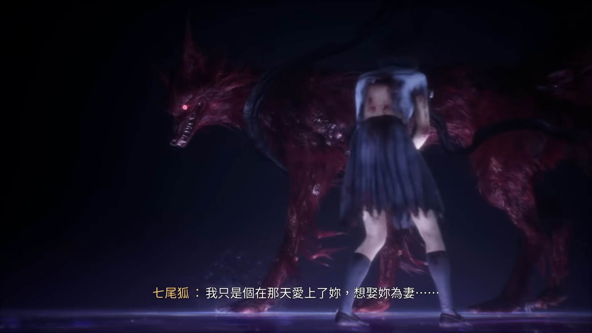

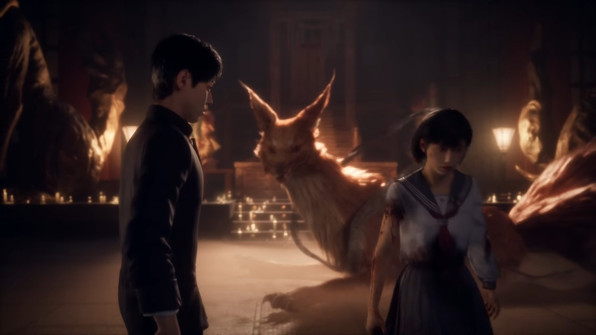

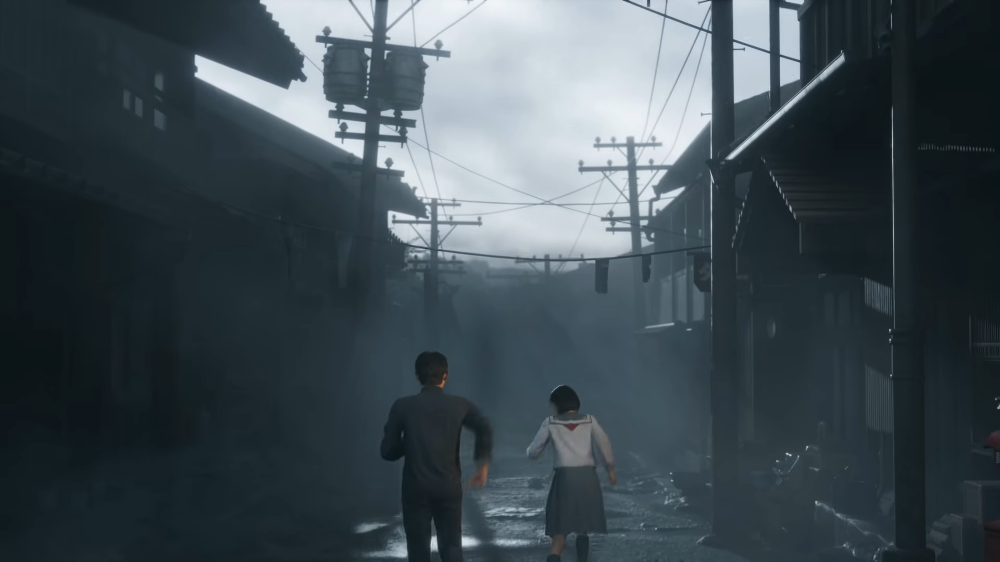

---

### 第四结局—寂静戎之丘（真结局）

游戏的真结局，第四结局玩家不再服用「红色胶囊」，同样不会产生幻觉。雏子在净化「灵刀」后，把身上的胸针供奉给古老地藏像，感谢对方的好意。在回到「迷宫化的深山家」时，雏子会得到与父母再次沟通的机会，解开双方的误会。

母亲会劝慰雏子，父亲只是想在女儿面前展现威严，曾经想和朋友合开一间小店，他把朋友视为弟弟一样，但朋友最后偷走了所有的财产才会性格大变，每次发脾气后都会对母亲道歉。母亲也曾经试过连续几天只做父亲讨厌的食物，甚至把污水混入茶杯里，迫使父亲向母亲下跪道歉，只是一切都不会被润子和雏子看见，让孩子看见软弱的一面是奇耻大辱。加上在母亲生下两姐妹后身体状况一直很差，急需一笔钱做高风险的手术，父亲仍然不离不弃，母亲认为丈夫作为父亲是不合格的，但作为丈夫已经是合格了。

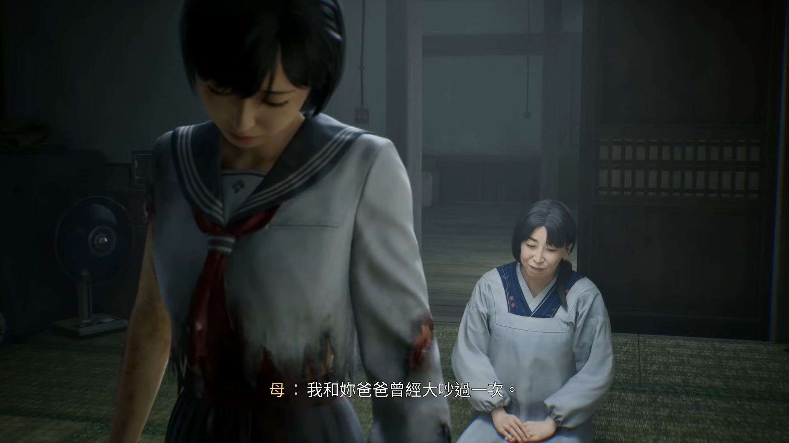

父亲则会向雏子下跪，对一直以来的语言暴力道歉，就只是为了当一个有威严的父亲，不要因为没出息的父亲而害怕其他男人。寿幸与他截然不同是个优秀的青年，而修也是个好男人，决定最后让雏子自己选择对象，甚至要不要结婚。

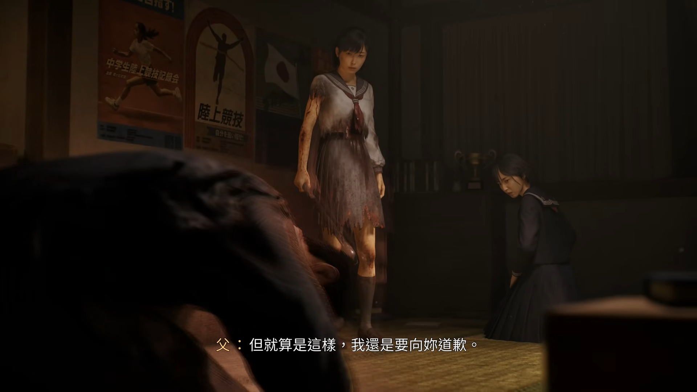

「深水雏子」与「雏子之影」会为了父亲而再度起争执，「深水雏子」认为家族的羁绊无法斩断，但是否要原谅他就取决于自己，即使不原谅对方，也不能视而不见。即使是令人同情的遭遇，但不代表要活于父亲的阴影下，最后雏子有了能够离开家里，自己做主的决定。

父母的自白是1960年代的价值观投射，以及对于对父母的刻板印象，父母的错误会造成孩童永久的心理创伤。理论上那个时代孩子仍然是无法自主决定大部分事情，也可能是想表达在二战后新思维的浸入，造成世代价值观开始改变。

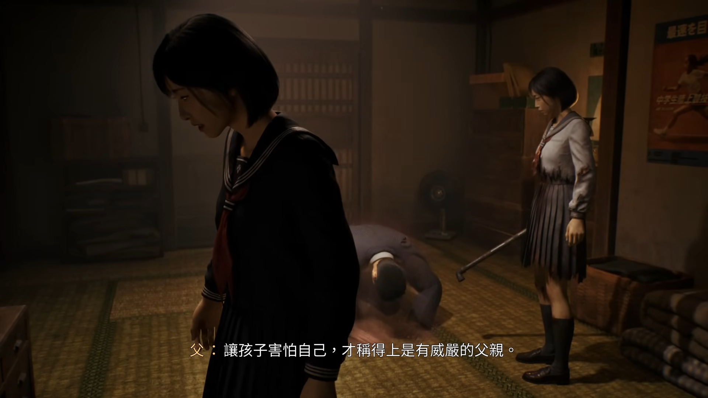

在真结局中「深水雏子」来到圣域见到润子，明白到幕后黑手在控制自己，分别拉向「结婚」和「不想结婚」。**雏子被分拆成两个自我，受到「稻荷神」和「九十九神」附身厮杀的代理斗争，「深水雏子」的背后有「九十九神」，而「狐之雏子」的背后则是「稻荷神」**。（两位神祇会取代了两个雏子的声音。）

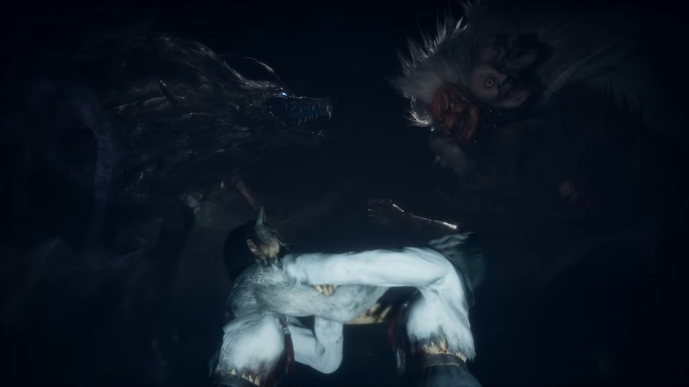

附身在寿幸上的「稻荷神」坦白，「戎之丘」偶然会诞下血液蕴藏神力的女婴，「稻荷神」会对家族的继承人下诅咒，让他想要娶那个女孩为妻，每代都会成功诱骗目标成婚。只有这一代的继承人寿幸是个例外，寿幸是真心喜欢和关心雏子，希望与雏子结婚而独自奋斗。另一方面，「九十九神」附身的其实是赛璐珞人偶，所以才会一直阻止雏子嫁给寿幸。

**最终「狐之雏子」打败了「九尾狐」（稻荷神），「深水雏子」打败了「九十九神」**。寿幸带着两个雏子离开圣域，并决定延后与雏子的婚礼，确定自己的爱没有受到诅咒影响。深水雏子回到现实世界，寿幸则回到了外面的常喜家，继续与雏子保持书信来往，并且开始去体验属于自己的人生，回归童心，审视自己的爱。「深水雏子」和「狐之雏子」没有融合为一体，最后在「戎之丘」和解，「深水雏子」想寻找自己真正的目标，「狐之雏子」想找到与寿幸比肩的爱，她们在神社鸟居上眺望被浓雾包围的小镇，感受着宁静的世界。

「戎之丘」的「表世界」就像历代《Silent Hill》一样，反映着各人的内心世界，当两个人格已经和解，慢慢步出阴影，「表世界」变成一个没有怪物，心境宁静的地方。这个结局可以说是「雏鸟开始拍动自己的翅膀」。

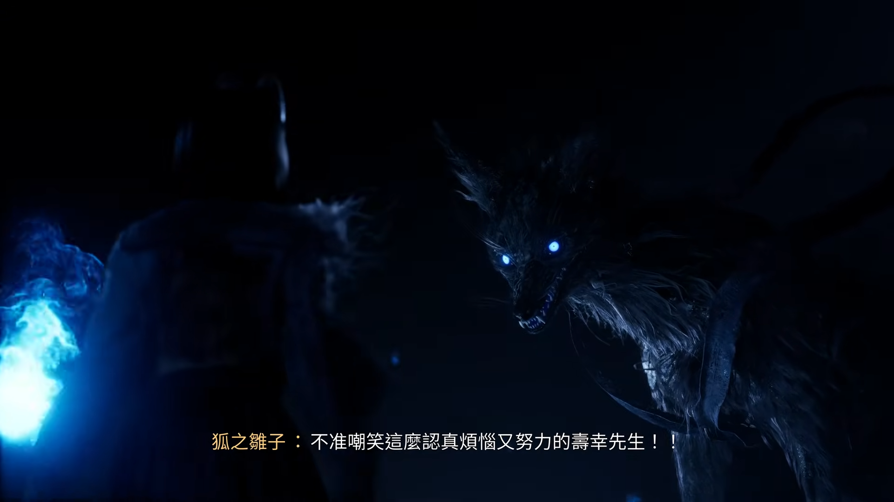

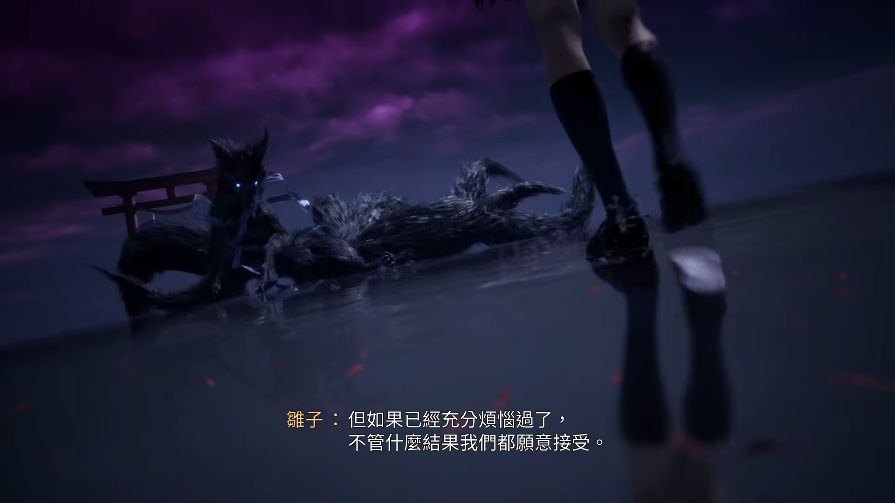

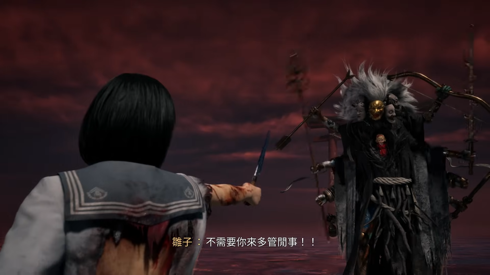

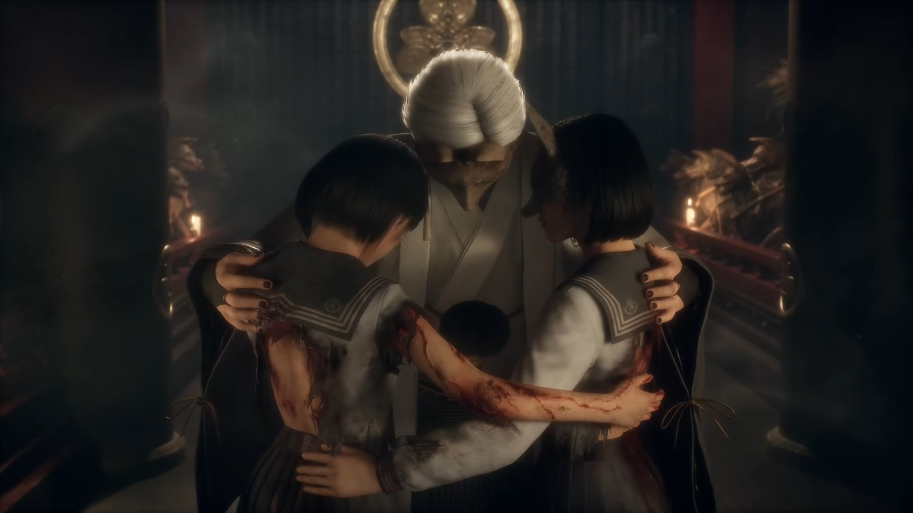

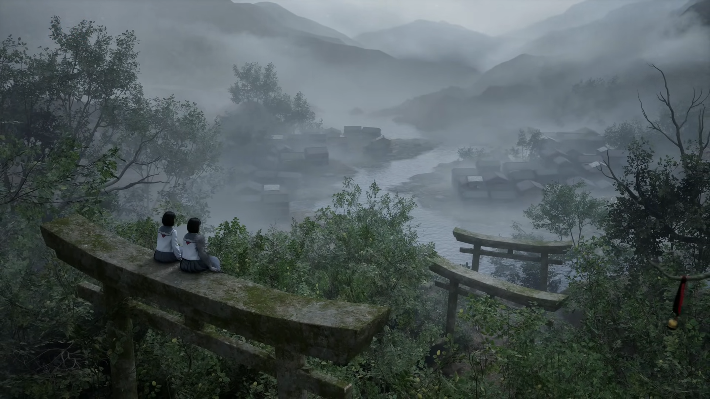

## 个人感悟

*一篇关于龙骑士07笔下昭和少女如何与自我和解的游评*

《寂静岭 f》是系列首次将舞台从美国小镇迁至日本的地方小镇「戎之丘」。龙骑士07执笔的剧本并未简单地套用西方心理恐怖的公式（当然，如果你观看过龙骑士07执笔的《寒蝉鸣泣之时》，在游玩的时候应该会有很多有意思的共同感XD），而是将本土的神道信仰、付丧神传说与昭和时代的社会结构织入其中。游戏的表层是怪物与迷雾，内核则是关于身份、传统与个体意志的一场漫长对话。

:::note

龙骑士07（ Ryukishi07）以《寒蝉鸣泣之时》中对「集体心理」与「乡村封闭性」的刻画著称。其作品擅长在悬疑氛围中渗入「异物」——怪谈、神秘、凶案——通过逐步透露线索与不断添加谜题，营造令人如坐针毡的预感。在民俗与乡土题材方面，他善于将日常与怪异结合，通过祭典、传说与习俗将悬疑融为一体。

《寂静岭 f》延续了龙骑士07的多周目叙事结构：玩家需完成至少三至四周目方能拼出故事全貌。雏子被设定为「不可靠叙述者」（unreliable narrator），其视角被焦虑与药物扭曲，现实与幻觉的界限不断塌陷。随着后续周目中停止使用含有违禁成分的「红色胶囊」，真相才逐步浮出水面——这种设计将「阅读的劳动」与「认知的修正」嵌入游戏机制本身。

:::

### 寂静岭：缺陷打造的舞台

#### 崭新的空间叙事

在《寂静岭 f》中，经典的「表世界/里世界」结构被重写。雾与血的世界不再是现实与幻觉的交替，而是完全折叠进人物的精神内部。空间成为一场自我拆解的心理手术，药物、焦虑与人格分裂共同构成了新的「他界」。

游戏前半段通过错位的叙事结构制造了「世界切换」的错觉：玩家被引导相信雏子在两个时空之间穿梭，触发切换的契机似乎是昏迷与梦境。但随着剧情展开，玩家逐渐意识到——**这一切并非时空往返，而是精神分裂**。雏子的意识被药物引发的幻觉撕裂成两部分：

- **「小镇雏子」**：主导表世界，属于记忆与日常，代表尚未屈从社会规范的自我；
- **「神社雏子」**：主导里世界「闇之社殿」，是仪式与牺牲的舞台，象征她在婚姻与传统面前的服从。

两个世界向玩家呈现的都不是「事实」，而是雏子两个人格在不同叙事视角下扭曲的故事。这种设计延续了系列擅长的碎片信息拼贴传统——玩家在残缺线索之间自行拼贴意义，构成独特的叙事体验。

#### 心理退行与校园执念

从设定来看，雏子在现实中已是约二十岁的成年女性，即将出嫁；但在表世界小镇中，她始终以身穿校服的学生形象出现。这种形象投射可被解读为**心理退行（regression）**——当个体面对无法承受的焦虑时，精神分析意义上的防御机制会促使其退回到较为安全的心理阶段，以逃避现实冲突。

对雏子而言，婚姻象征死亡，而校园则是「尚未被要求成为女人」的最后净土。校园生活成为重度焦虑状态下被动防御机制的触发：友情是雏子生命中重要的课题，重返校园的幻觉将对婚姻与母职的恐惧转化为对「成长」本身的抗拒。婚姻在此不仅是个人情感的选择，更是社会强加的「成人仪式」——女性被要求从「女孩」转变为「妻子」「母亲」，并在这一过程中面临主体性消解。

### 面具：虚假自我与真实自我的博弈

面具在游戏中反复出现：狐面男的脸具、能乐面具、婚礼前的白无垢——它们共同指向同一命题：**在他人期待中，我们究竟在扮演谁？**

深水雏子面临的是双重挤压。来自父亲的暴力与母亲的顺从，构成了一套「女人就该如此」的模板；来自常喜家的婚约，则是将这一模板具象化为社会契约。当雏子戴上学姐润子的「乌天狗」面具出现在婚礼现场时，她在提醒玩家：润子已经完成了从「深水家的女儿」到「某姓氏的妻子」的转换。那张面具，是出嫁的符号，也是 人格(identity) 被替换的隐喻。

狐面男的真实身份揭露后，玩家会意识到：寿幸同样活在面具之下。常喜家的继承人身份、狐狸一族的契约、世俗对「好丈夫」的期待，层层叠加成他必须扮演的角色。只有独处时，他才会脱下狐面，承认自己对雏子的情感。**面具在此成为双向的囚笼——戴上面具的人被困住，摘下面具的人则被视为异类。**

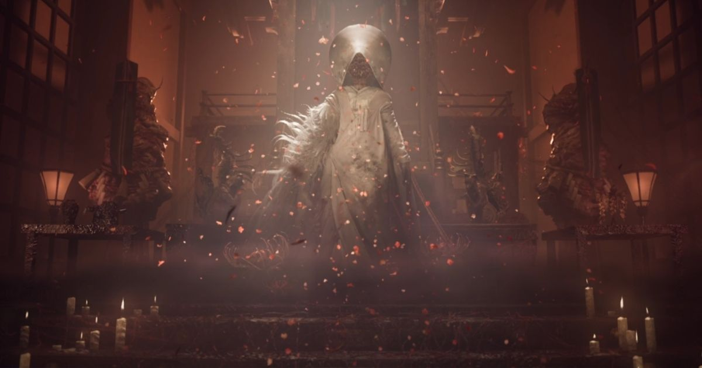

游戏中的白无垢 Boss 直接取材于日本神道婚礼的传统白色嫁衣。Shiromuku 被视为一等正装，纯白配色寓意新娘「吸收」夫家与丈夫的色彩；游戏中白无垢怪物还头戴「角隐」（wataboshi），这一头饰在民俗中既有遮阳避蚊的实用功能，也隐喻遮蔽新娘的「嫉妒之角」，以展示贞德与顺从。

无貌的新娘——白无垢 Boss 没有面孔——成为「抹杀自我以融入夫家」的极端化呈现。击败白无垢，本质上是雏子与「必须成为他人所有物」的命运进行对峙。

### 狐狸：传统信仰与个体选择的寓言

本作被制片人冈本基定性为「100% 日式恐怖」，神道元素贯穿始终。稻荷大神（Oinari-sama）作为司掌丰饶、稻作与繁育的神祇，其信仰在日本遍布三万余座神社；狐狸（kitsune）在神话中既是形变惑人的灵物，也是稻荷的使役与眷属，常以石像形貌守护神社，持稻仓之匙。

游戏中寿幸的姓氏「常喜」（Tsuneki）被指为「狐」（kitsune）字母的重新排列，形成文本层面的文字游戏。狐面男、狐狸族、九尾狐与七尾狐等 Boss，均与稻荷信仰及日本狐灵传说形成互文。

狐狸在《寂静岭 f》中承担了多重意指。稻荷神信仰、善狐一族、狐之雏子的蜕变——狐狸既是庇护者，也是索取者。它许诺封印水龙、维持秩序，代价却是世代选出一位「特殊血统」的女性，以婚姻的形式献祭给狐狸族。

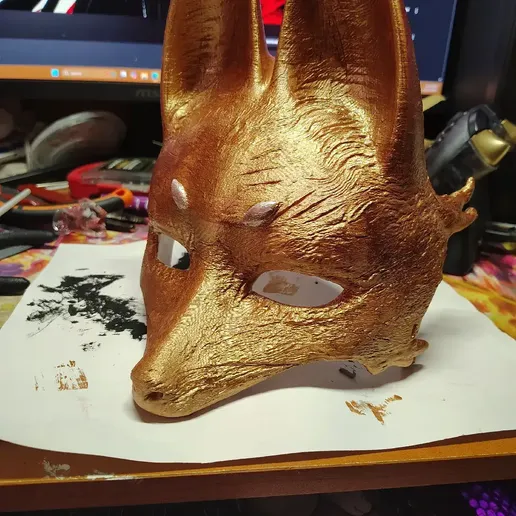

神道中的「污秽」（kegare）观念——涵盖身体、心灵与灵性的不净——在游戏中具象化为被驱逐的咲子被称为「kegare」，狐面男称她为「困扰你的不净已除」。净化仪式（temizu）在游戏中以狐面男带领雏子于石盆前洗手、漱口的场景再现，雏子却在幻觉中将清水视为熔岩——认知与感官的错位，强化了仪式的压迫感与不可逆性。

狐狸常被视为沟通人神的中介，既能赐福也能降灾；嫁入狐狸族，既可以是「得道成仙」的想象，也可以是「被异类吞噬」的恐惧。**游戏巧妙地将这种暧昧性转化为叙事张力：嫁给寿幸，究竟是雏子主动的选择，还是被稻荷神诅咒操纵的结果？**

真结局「寂静戎之丘」揭晓了答案：寿幸是历代继承人中唯一真心爱着雏子的例外。稻荷神坦白，历代都会对继承人下咒，唯独寿幸的感情不受操控。这一转折将「狐狸」从纯粹的压迫符号中解放出来，使之成为「传统中仍有例外」的注脚。狐狸族需要雏子的血统来封印水龙，但寿幸选择延后婚礼，等待雏子厘清自我——**传统可以绑架人，也可以被个体的诚实所松动。**

九十九神与稻荷神的信仰战争，则可读作「旧物信仰」与「动物信仰」的角力。付丧神代表被抛弃之物的怨念，稻荷神代表对自然灵性的崇拜。两者争夺戎之丘的话语权，而雏子站在交汇处：她是被旧秩序定义的女人，也是有能力改写定义的主体。

### 婚姻：恐惧的根源与和解的可能

《寂静岭 f》对婚姻的书写极其克制，却足以构成全作的情感锚点。雏子的婚前恐惧症并非无源之水——父亲的菜刀、母亲的隐忍、润子出嫁后的消瘦、农田里那封逃离家暴丈夫的妻子的信，共同拼出一幅昭和女性生存图景。

《寂静岭 f》最锋利的矛盾点在于：令雏子焦虑到身心崩溃的结婚对象并非冷酷暴君，而是真心爱她、温柔体贴的「天降竹马」常喜寿幸。**悲剧的根源并非「缺乏爱情」，而在于当真爱进入制度，它就被结构化为压迫媒介。**

雏子恐惧的并非寿幸本人，而是「成为寿幸的妻子」这一身份所附带的规训机制。善良的丈夫无法抵消压迫性的婚姻，因为**制度性暴力并不依赖施暴者的恶意**。

游戏并未将婚姻简单斥为「压迫」或「传统糟粕」。第二结局「狐狸娶亲」中，雏子选择嫁给寿幸，修接受「暂时」放手——这是一个妥协的结局，雏鸟失去翅膀，但未必是彻底的悲剧。第四结局则提供了另一条路：父母坦白各自的软弱与局限，父亲下跪道歉，母亲承认曾用「污水混茶」迫使丈夫服软。**家庭内部的暴力与和解被并置，没有非黑即白的道德审判。**

游戏中雏子的手帐记录了与姐姐润子的对话：「姐姐说，女人之所以被要求遵守女人的本分，是因为那是通往幸福的捷径。如果捷径并不是必选项，那也就意味着还存在其他通往幸福的道路。还记得小时候，当我玩迷宫玩具时，姐姐把正确的路线告诉了我。那的确是通往终点的捷径。可是当我抵达终点时，所收获的喜悦远比我独立完成时要少得多。」

这段文字近乎元叙事。润子把婚姻视作女性的捷径——上一代女性的普遍经验；雏子则以「迷宫玩具」的比喻戳破：**所谓捷径，本质就是用许诺的「稳定结局」，剥夺了你「走自己路」的乐趣与可能性**。真结局中雏子选择「暂缓婚事、先厘清自己的心意」，对应《JOJO 的奇妙冒险》第七部杰洛的台词——「我的捷径就是绕远路」——一种尼采与加缪式的反目的论：真正的意义不在结果，而在过程。

游戏描绘的母亲、润子、雏子构成女性在家庭与制度夹缝中的谱系：

- **母亲**：忍耐的一代，以「家庭智慧」缝补破碎的婚姻，象征传统女性的被动适应；
- **润子**：痛苦的一代，拥有初步的独立人格却无法避免被卷入婚姻，戴上面具后成为肤色惨白的「活死人」，象征介于觉醒与无力之间的撕裂；
- **雏子**：以理解和倾听完成救赎的一代，拒绝重复前辈的命运，也拒绝否定她们的人生体验。

真结局的题眼在于「雏子之影」与「深水雏子」的并立。两者未曾融合为一，而是达成和解：一个想寻找真正的目标，一个想找到与寿幸比肩的爱。迷雾散去后，两人站在神社鸟居上眺望宁静的戎之丘——**自我可以不必统一，分裂的两面也可以共存。**

达成所谓的真结局需要雏子直面前辈的声音——倾听母亲的告白，与家人达成和解。**跨代和解是自由的起点**：自由并非彻底对抗的结果，而是理解与延宕的产物。雏子的和解同时发生在两个层面：外在的与母亲、姐姐的代际和解；内在的两个人格之间的自我和解——她与另一个自我共存而不再自相残杀。

对于以残酷、绝望与精神瓦解著称的寂静岭系列而言，这一真结局显得「不可思议的温柔」。在婚姻保守化、性别角色再规训的时代氛围下，游戏承认爱与制度的缠绕，同时坚持留一个空间给「未来」。**这种「把一切交给未来」的姿态，本身即是一种叛逆——是对「确定答案」的拒绝**。无论是「精神永远停留在少女时期」还是「彻底屈服婚姻」，都可能变成另一种僵化的面具。

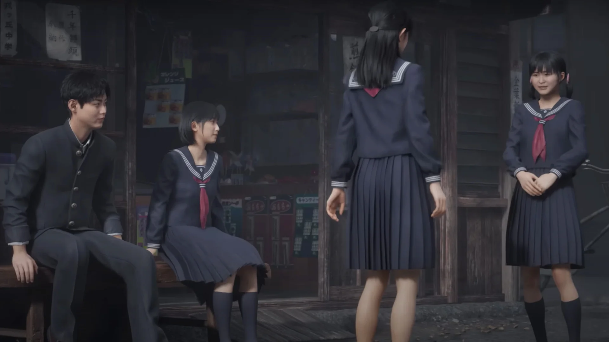

在神社雏子的剧情线中，雏子与狐面男（寿幸）经历了三场隐喻为「结婚」的仪式，以极端超现实的象征手法展演了女性进入婚姻时所经历的「自我消解」与「身体化规训」：

| 仪式                   | 象征意义                                                             | 社会对应                               |
| ---------------------- | -------------------------------------------------------------------- | -------------------------------------- |
| **断臂与换狐臂** | 行动力的剥夺与替换——身体依旧运作，却不再属于自我，而服从于家族意志 | 独立性丧失、夫家对女性行动范围的规训   |
| **背上家纹烙印** | 家族性的吞没，将个人嵌入集体秩序                                     | 日本夫妇同姓制度、家纹与血脉的符号暴力 |
| **剥脸与换狐面** | 人格的彻底消解，最直观的「自我面貌」被剥离                           |                                        |

值得注意的是：每一次仪式过后，神社雏子都会变得更强。这种「力量的代价」正是游戏最残酷的真相——**制度性压迫并非单向的枷锁，它往往也会带来世俗意义上的收益**。婚姻既是创伤性暴力，也是功利性资源分配；女性因失去独立人格、被纳入「妻子/母亲」角色，而获得社会认可、家庭支持甚至阶层提升。力量是真实的，但它不是她本来的力量，而是制度赋予的「替代力量」——正如那只不属于她的狐狸手臂。

婚姻在游戏中既是叙事动力，也是隐喻载体。嫁人 = 冠夫姓 = 不再是「深水雏子」= 成为「狐之雏子」。里世界的仪式（砍下右臀、移植狐臂、替换脸皮）对应现实中的婚礼流程：切断与娘家的连结、接纳夫家的规矩、戴上新的社会身份。玩家在表世界与怪物战斗，在里世界与过去的友人告别，最终面对的是同一个问题：**我愿意以怎样的代价，成为怎样的自己？**

### 红色胶囊：幻觉与真实的边界

第一结局「诅咒如雏鸟般归来」将全篇重新解读为药物致幻。修调制的止痛药含有科库罗麻科库罗成分，雏子长期服用后产生清醒梦与幻觉，最终在婚礼现场持刀伤人。若玩家在最终 Boss 战落败，会进入无限复活与无尽战斗的循环——**幻觉没有出口，只有重复。**

这一设计将游戏的「真实性」悬置。表世界与里世界究竟是超自然现象，还是雏子颅内投射？龙骑士07并未给出确定答案。第二至第四结局中，玩家不再服用红色胶囊，神怪事件被呈现为「真实发生」——但这种「真实」是否仍是一种叙事选择，而非客观真相？

开场动画中，雏子与洋娃娃玩着「过家家」，既想与男孩玩宇宙飞船大战，也想与女孩玩洋娃娃——她本可同时拥有这两种乐趣。但在严格的性别二元框架里，这种「跨界」被视为怪异。雏子因不符合「女生应当如何玩」的准则而被群体排除，被迫丢弃洋娃娃。

**洋娃娃划定了「被接受的女孩」与「被排斥的他者」**，象征雏子生命中第一次「身份排斥」。女性气质在此被呈现为非天生，而是一套由同龄群体早早启动的相互监督与表演机制。

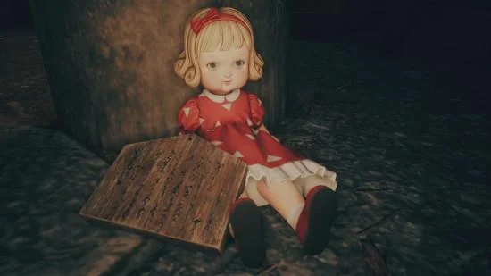

红色胶囊成为**认知边界**的喻体。服用它，世界变为可操控的幻梦；戒断它，世界变得残酷而不可逆。无论哪种路径，雏子都必须面对某种「真实」：要么是药物无法掩盖的内心创伤，要么是狐狸族与水龙、稻荷神与九十九神交缠的现世。

### 所以，寂静岭的F，是什么？

Konami 从未官方确认「Silent Hill ƒ」中「ƒ」的含义，这种刻意的模糊催生了多种解读：

- **Fox**：狐狸在剧情与民俗中的核心地位，使部分玩家将 ƒ 视为「fox」的变体；
- **Fate / Fear / Freedom**：更隐喻的读法将其视为故事核心的开敞符码——命运（束缚雏子的神圣诅咒）、恐惧（心理恐怖）、自由（真结局中的胜利）；
- **Flora / Fungus**：游戏充斥红花（彼岸花）、根系与霉菌意象，有玩家将 ƒ 与植物世代（F1、F2）或「fungus」联系；
- **Forte**：音乐记号中 ƒ 表示强奏，可能暗示游戏的情感强度或音高 F 的核心地位。

这些解读彼此并不互斥。如同游戏本身的暧昧性，标题成为邀请玩家投射自身意义的谜题。

### 结语：在传统与解放之间

《寂静岭 f》没有提供「逃离传统」或「拥抱传统」的简单答案。真结局中，寿幸延后婚礼，雏子回到现实，两人保持书信往来；深水雏子与狐之雏子没有合为一体，而是在戎之丘和解。**和解不等于妥协，共存不等于放弃。**

游戏的艺术内核，或许可以概括为：**在戴上面具的时代，承认面具的存在，并追问面具之下是谁。** 雏子的旅程不是「打破枷锁」的英雄叙事，而是「与枷锁共处并厘清自我」的日常史诗。昭和的血雾、彼岸花的侵蚀、狐狸族的契约——这些超自然元素，最终都服务于一个极其现实的主题：一个人如何在他人期待与自我意志之间，找到属于自己的站立方式。

戎之丘的雾会散，表世界在真结局中变为没有怪物、心境宁静之处。但沉默不会消失——它只是换了另一种形态，留在每个曾与自我对峙过的玩家心里。

## 参考文献与延伸阅读

- 张成，《游戏论｜「f是female？」：《寂静岭f》中的爱情、婚姻与女性主体》，澎湃新闻，2025年10月
- Kristeva, J., *Powers of Horror: An Essay on Abjection*
- Foucault, M., *Discipline and Punish*
- Beauvoir, S. de, *The Second Sex*
- Butler, J., *Gender Trouble*
- Tokyo Weekender, "Shinto Motifs in Silent Hill F"
- J-Horror Blog, "Silent Hill f | an analysis", September 2025
- Konami, Silent Hill Transmission 2024, Producer Motoi Okamoto 访谈
