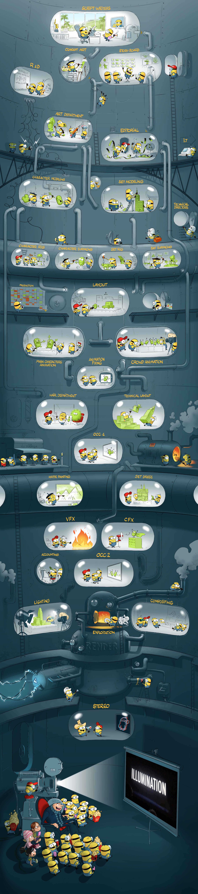
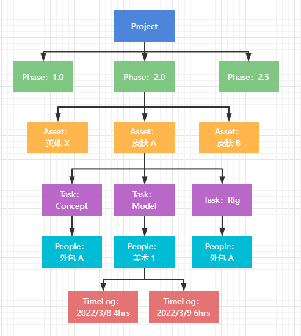
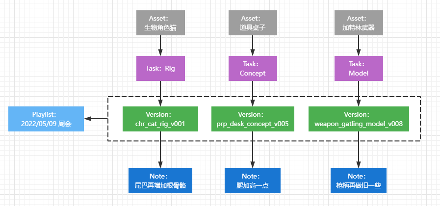
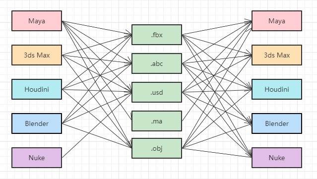
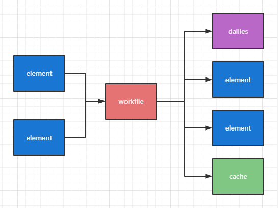
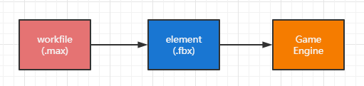

最近读了[Muyanru大佬](https://www.muyanru.com/pipeline/article/industrialize_02.html)的一篇关于在游戏开发中使用影视开发Pipeline的博客。

虽然UE5现在已经开始慢慢集成这种Pipeline管理数字资产和游戏资产，不过还是单开一篇博客来记录一下学习的结果吧。

# 基本概念

什么是Pipeline？

> Pipeline 是管理项目的信息和数据的流动。
>
> * 信息被高效、正确、及时地传达到位
> * 数据的来龙去脉、前世今生、脉络关系管理的清清楚楚明明白白

这张图非常形象地描述了pipeline上的每一位工人：

而常规情况下，`Pipeline` 要管理的范畴，分为三大类：

* 项目管理
* `Review`
* 资产管理（文件和 `metadata` 的管理）

## 项目管理

这里的内容主要包含：

* 任务分配、排期
* 任务的上下游关联
* 任务的资产关联
* 跟踪资产完成度、发行版本、项目进度等

这里涉及到的数据类型：

* Project（最顶层的，游戏项目、电影项目，或者因为某些原因拆分出来“子”项目）
* Phase（或者叫Sprint，指一段时间，加很多个 milestone，用来做阶段性排期，比如游戏要上线的6.0 版本等）
* Asset（包括影视的 Sequence/Shot、游戏的美术资产、关卡等）
* Task（将 Asset的制作拆分出来的最小级别的、可以分配到具体人的任务，并且有期望起止时间和预计时长）
* People（干活儿的，可以是个具体的美术人员，也可以是家外包公司）
* TimeLog（记录每个 Task 的制作实际制作时长，用来衡量工作效率或者是任务预算是否合适）

大概的关系是：

需要提供多样的 filter，协助项目每个人查看他感兴趣的部分，比如：

* 列出所有动画任务
* 列出所有两周内要过期的任务
* 列出包含在xxx版本要上线的任务

除此之外，

该系统必须可以应对变化，大到比如外部环境变化导致的延期（疫情啊版号啊什么的）、比如老板突然要调整游戏上线日期，小到人员离职，多增加美术、多外包、系统可以快速调整和更新排期，确保每个人都知道自己该做什么、该什么时候做、先做哪个后做哪个。

与常规的项目管理工具（例如Git等）相比，Pipeline的主要精力放在了：

* 将生产数据进行各种角度的可视化，帮助PM 精细化管理项目周期和人力安排，把控项目风险，避免空转/过载
* 开发各种自动化监听脚本，比如 当A任务完成80%就把 B任务状态改为“可以开始”，减少 PM 手动、重复工作量，减少人为出错
* 开发各种RTX 通知机器人，比如提醒美术临期任务。及时提醒，避免遗漏
* 开发各种小工具，包括并不限于浏览器插件、基于管理系统的菜单拓展等，减少PM 操作步骤
* 生成产能报告，展示进度、落后的部分、资源闲置等等状况

另外，它必须提供二次开发接口，还因为这里的信息，是要出现在美术的工作环境中的，比如DCC、引擎里的。

再次，还需要强调的是，该系统的数据库支持一定程度的自定义：可以多增加表（Table）；已有的Table 或者新增的Table 可多增加 column 。

## Review

主要包含两方面：

* review 工具（如何更好地review）
* 管理和跟踪反馈

这里涉及的有：

* Task（上个部分中的Task）
* Version（内容一般是图片或视频，美术的一次迭代）
* Playlist（将多个 Version 放在一起的播放列表，方便开 review 会议时查看）
* Note（反馈，一般有文字描述、示意图片、或者其他文件作为附件）
* People（这里指上传 Version的美术/外包公司，和负责 review 的组长或总监）

大概的关系是：

Review 工具需要具备的功能

* 可以写文字描述
* 有各种画笔功能，可以直接在画面上涂鸦
* 可以录音、录屏、截图
* Ghost and Hold Annotations（可以把视频其他帧画图的涂鸦半透明显示，适合动画环节 review）
* Live review（多人在线协作 review ）
* 多版本对比看：并排着对比、叠在一起对比
* 可以查看历史 Note 反馈
* 可以切换历史Version 版本
* 可以切换其他环节的Version 版本
* 影视：可以看到前后shot，串起来看
* ... ...

同样的，该部门的软件或者系统**必须**支持二次开发，我们 Pipeline 在这个部分的主要精力放在了

* 让美术及时看到反馈，可以是发邮件、发即时消息
* 甚至让美术直接在自己的 DCC 里面看到，把反馈图片贴在场景里
* 根据新的Note 反馈，自动创建 Task，方便追踪后续是否解决了该反馈
* 美术可以更方便的上传 Version
* 批量上传 Version
* 视频标准化：画面水印、文件分辨率、文件编码、色彩空间、规范命名......
* 统计：task 有多少个 version、多少个 note，跟task 的bid 比，滞后了还是超前了，反向修正排期，让排期更合理。
* 增加更多格式支持，比如支持 3d文件预览

# 数据管理

## Data

在影视行业，`Data` 文件的存储，基本采用 `NAS` 。

而游戏这边，美术资产分为：

* 进引擎之前的，就是 `.max`  `.fbx`  `.mb` `.spp` 等等文件。这跟影视的没有任何区别。
* 进引擎之后的，就是游戏引擎项目工程了。

### 进引擎之前的数字资产

进引擎之前的文件存储方式，建议使用

* `NAS` ，推荐指数，五颗星，下面一个段落专门讲一下。
* `P4V` ，推荐指数，三颗星。专门给游戏行业设计的。尤其是，如果引擎工程也使用 `P4V` 了的话，我不清楚它的收费模式，但从美术角度讲，可以减少一个需要理解的系统。如果有人能说服我游戏公司真的不能用 `NAS` ，那么 `P4V` 可以提升到四颗星。

### 进引擎之后的游戏项目工程

游戏项目工程，**必须必须必须**选择一个**有版本管理功能**的软件，如 `P4V`  `SVN`  `Git`

## MetaData

`Matadata` 则存在两种方式，以 `json` 或者 `xml` 文件形式，一般存放在它要描述的 `Data` 旁边。

另一种方式，则是将 `Metadata` 存入数据库里面。

|                | 优点                                                                                                                           | 缺点                                                                                                                                                   |
| -------------- | ------------------------------------------------------------------------------------------------------------------------------ | ------------------------------------------------------------------------------------------------------------------------------------------------------ |
| 存放在文件中   | 易用；渲染农场访问不会拥挤；                                                                                                   | 要么是海量小文件（每个资产的每个版本对应一个文件）；要么是少量的巨大文件（一个资产一个文件）。造成访问和查询非常慢，而且风险大，有文件编辑占用等等问题 |
| 存放在数据库中 | 支持数据量大；查询超快；可以校验质检，确保数据有效性；什么冷备热备灾备的，一直可用；随时应对用户量的变化，横向竖向扩展都没问题 | 比文本文件复杂；要是挂了，信息可就丢失了；部署啊，服务器啊，这些工作都需要做；如果外网能访问，还要做账号权限管理；还得提供 UI，或者API；               |

Unity的工程采用的是第一种方式，直接打开项目就可以看到。

# 资产管理

数字资产一般有三类文件：

* 工程文件，我们取个代号叫 `workfile`：美术工作的文件，通常是 DCC 的 project file，比如 ma、mb、max、hip、 psd、spp
* 图片或视频文件，我们取个代号叫 `dailies`：可以通过review 系统进行查看的文件，比如 mp4、mov、avi、png、jpg，如果 review 系统支持3d 资产查看，那么也可能是fbx、obj 等格式
* 上下游交接文件，我们取个代号叫 `element`：比较“干净的”，通常是第三方格式，比如三维资产的 obj、fbx、abc、usd等，二维资产的 png、jpg、tga、exr

## 工程文件Workfile

通常是 `DCC` 的 `project file`，是美术制作的文件。

这里 `Pipeline` 主要就是解决：

* 标准命名：美术仅提供文件命名的描述部分 `descriptor`，命名的其他部分则由 `Pipeline` 系统来完成。比如 goblin 的某个动画文件，美术需要提供类似 `walk`这样的描述，则该文件会被自动命名为 `char_goblin_ani_walk_v001.ma`，文件命名规范需要根据项目资产特点来制定。
* `Publish`（升级）：将 `workspace`文件进行升级，并上传到文件管理系统中。此处也需要上传适当的 metadata 到 Pipeline 数据库里，比如它的上个版本是谁，比如它依赖引用了哪些文件。
* `Checkout`（下载）：从文件管理系统中下载指定版本文件到 `workspace`下，原因可能是自己 `workspace`删除了，或者是A的任务交给B做了，B需要从文件管理系统中下载A提交的文件。
* 版本回退：把文件回退到某个之前的版本，基于之前的版本继续制作。
* 质检：文件在 `publish`之前，需要做一些检查，以防文件有垃圾节点之类的，造成文件打不开。

此部分的工作，跟用哪个 `DCC`，相关度很小，主要是跟文件管理系统有关，基本就使用了 `DCC` 的  **new** 、 **open** 、 **save** 、**save_as** 这几个 `API`。

所以，我们可以得出结论，`workfile`类型的文件，跟行业、公司、项目类型、环节， **基本无关** ，`Pipeline` 系统可以轻松管理。

## 媒体文件Dialies

通常是视频或图片，体现工作内容，用于给导演、总监、主美、组长等进行 Review/监修/审查。

这里 `Pipeline` 主要就是解决：

* 标准命名：一般跟对应的 `workfile` 名字一致。
* 标准化图片、视频：统一的水印、分辨率、色彩转换、编码方式等等
* 最好附带辅助工具，如三维软件拍屏工具、截图工具、录屏工具、拼图工具......
* publish 到 Review 系统中，并且记录该文件依赖的 `workfile` 信息到 `Pipeline` 数据库中。

此部分的工作，跟用哪个 `DCC`，相关度很小，主要是跟 Review 系统有关。

所以，我们可以得出结论，dailies 类型的文件 ，跟行业、公司、项目类型、环节， **基本无关** ，Pipeline 系统可以轻松管理。

## 交换文件Element

通常是第三方格式，用于不同DCC之间、不同人员、不同环节之间进行资产交换。

这个同时也是流程千变万化的主力部队，是跟行业、公司、项目类型、环节， **大大相关** 。

影视的 DCC 除此之外还有：Hiero、Clarisse、Katana、Mari、ZBrush、Modo、SP、SD、Photoshop、Pftrack、SynthEye... ...

这里 `Pipeline` 主要就是解决：

* 导出：不同 `DCC`的不同环节导出不同的第三方格式文件。记得要记录 `workfile` 的信息。
* 质检：很容易理解，我们不能把有问题的资产引入系统中。
* 导入：不同DCC的不同环节导入不同的第三方格式文件。
* 更新通知：当有新版本 `element`导出时，可以通知到使用了此 `element` 的 `workfile`（的拥有者）
* 更新：有新版本 `element`时，用户可以更新，最好是一键，同时用户也可以切换到任意旧版本 `element`。
* 导入、导出的脚本是一对，最好也有版本控制，这样制作中途 `element`有变动，比如参数不同了，旧版本导出脚本导出的 `element`，可以使用旧版本的导入脚本进行导入，减少了脚本要各种兼容历史遗留的问题。

## 缓存文件Cache

在影视，一般是一种自产自用的文件，比如把 houdini 一大堆的节点，解算出缓存，然后再导入回houdini 中，用结果继续进行节点连接。这种文件的特点是占用空间大，删除可再次生成，在项目结束进行打包的时候，完全不需要备份。

游戏还有一种 cache，中间转换文件，例如 fbx 导入八猴进行烘焙，再把烘焙出来的文件导入到 sp 等进行其他贴图绘制。

八猴文件我们可以直接通过其 python api 动态生成，这个八猴文件可以考虑到底留不留下，留下的话方便万一标准参数下烘焙效果不理想，可以手动调整。推荐根据实际情况。

和影视不同的地方：

游戏行业制作环节大大缩减，一个人需要负责多个环节，比如有些项目动画师也得做绑定。需要我们帮助美术减少修改操作步骤，跨软件 Live Link 进行数据实时传递。

其次，各环节资产最终都是要在引擎里看效果的，所以要尽可能拉近美术和引擎的距离，依旧需要各种 Live Link。

## 关系与约定

`element`、`dailies` 都是从 `workfile`产生的，那么有一个原则，只要有 `dailies/element` 一个版本，就必须保存产生该文件的 `workfile`，因为 `dailies`会被别人（总监）看到，`element` 会被别人（其他美术）用到，但凡涉及到文件被其他人“观察”了，就要保存其源文件，以便“还是觉得半个月前看到的那个版本更好”“我用的xxx版本是没问题的”时，可以找到源文件，branch 出去继续做。

还有一点：

当：只是导入engine 时，参数设置需要更新，那么 `element`不用重新出，只需重新导入engine 即可，如果导入时已经记录过了 `引擎资产<->element`的关系，那么此时就可以对涉及到的引擎资产，自动化批量重新导入。

当：`element`内容不够了（虽然已经尽最大可能确保内容无损了），`workfile`不用变，美术无需打开文件修改，只需重新导出 `element`，再导入engine，这两步，大概率也可以自动化批量处理。

## 资产浏览器

这个在Unity或者UE上做过GamePlay的应该都比较熟悉了，也就是可以独立运行版的，不打开任何DCC、不开游戏引擎、暂时不用下载任何资产文件，就可以浏览资产的 `Asset Browser`！

这个浏览器，它必须具备花式条件搜索、模糊搜索、收藏、打tag等常见资产库的功能。

可以根据用户的需求，有多种浏览方式：

* 阵营 -> 种族 -> 性别 -> 资产
* 发布版本 -> 英雄 -> 皮肤 -> 资产
* 地图 -> 区域 -> 城市 -> 兴趣点 -> 建筑 -> 资产
* ...

当定位到具体的资产后，我们要展示这个资产方方面面的信息：

* 查看它的原画设计
* 它的模型、模型的工程文件最新是哪个版本
* 总共提交过多少次 `Review`
* 绑定是哪个美术做的，什么时间完成的
* 它有多少面、有无骨骼、贴图几张
* 它被放置在了哪些关卡，哪些位置，被放置了多少次，能在游戏地图中标识出来
* 可以用DCC打开它的任意环节的工程文件（此时才需要下载该文件）
* ......

# 后续

鬼佬虽然说期待下一篇，但是好像后面就没有继续更新了，留下的只有这几篇。

也希望大家去本人的博客看看，写的真心通俗接地气！
