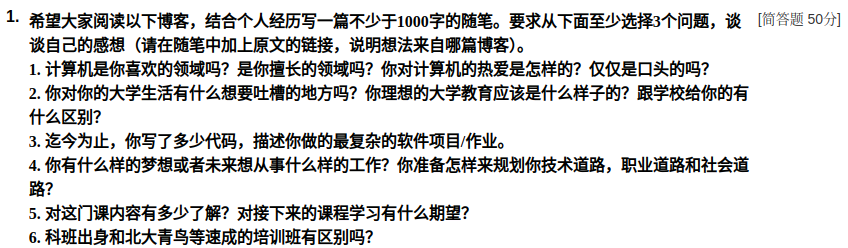
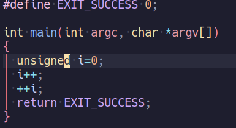
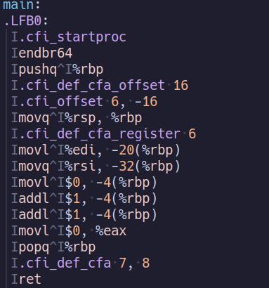
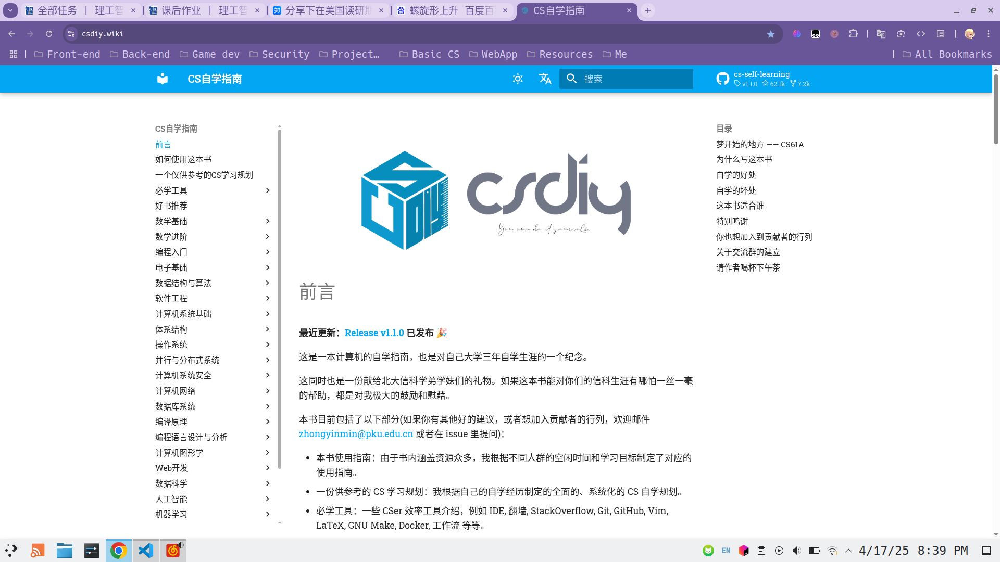
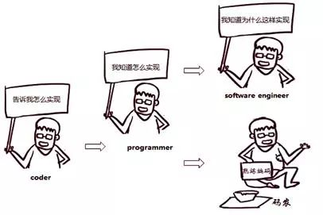
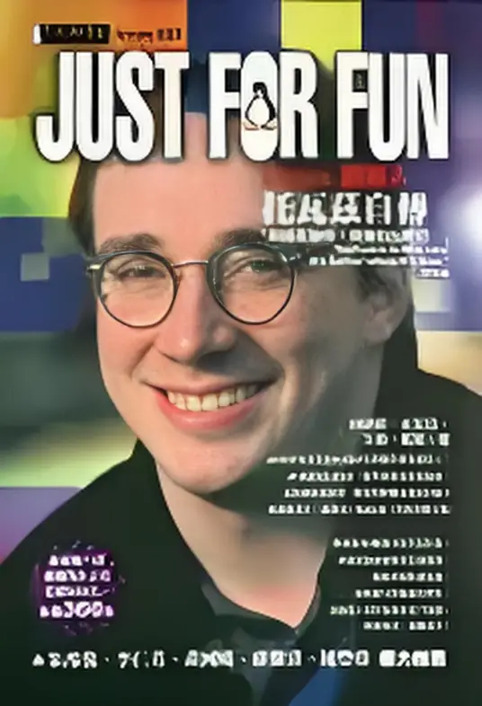
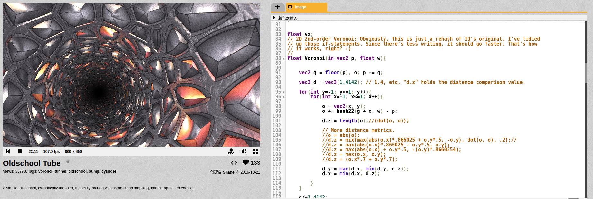

说来惭愧，这篇文章原本只是学校软件工程基础课的作业，头些时日忙里忙外竟不知不觉搁置了下来。今天偶然想起，也不管作业还能不能提交，干脆就把这些天的"有感而发"记录下来了。

笔者认知粗浅，就2，6，1三点随便聊聊吧。

## Code In China

国内外Coding社区的氛围，总有一种微妙而独特的差异。在Github上观摩了各路开源大师分享自己的思路，回到CSDN上却只能看到底质量的机翻博客，不免让人呜呼哀哉，更不必提LinkedIn上健康积极的求职氛围和国内牛客、BOSS上的哀鸿遍野。

似乎从一开始我们便被烙下了"工人"的印记，写代码从来不会是一件开心的事，只是一件赚钱的事。

回到大学，也是如此。我庆幸自己早在高中就对输入式的教学嗤之以鼻，让我早早接触到了GAMES , CSAPP , CSWIKI诸如此类的优质课程，而非深陷国内读书笔记式教科书的泥沼。研究"`i++`"和"`++i`"的最好方式应该是用 `gcc -S main.c -o exec.S`编译研究汇编代码，而不是在白纸黑字上做重复的习题形成肌肉记忆。研究 `strcpy()`为什么在VisualStudio中无法编译的方法，应该是从GNU C库中学习前辈的设计失误，而非简单使用**ALT + ENTER**自动修复。

这是一种教学设计的失误，也是一种教学目的的模糊。

> “发展似乎是在重复以往的阶段，但它是以另一种方式重复，是在更高的基础上重复。”
>
> ——列宁（彭漪涟·逻辑学大辞典：上海辞书出版社，2004年12月）)

螺旋上升式的发展是一切自然逻辑的底层代码，而在自然逻辑之上构筑的人类社会乃至应用科学（当然，包括CS），自然不会脱离这一层抽象。时至今日，大学教育的底层逻辑竟还未脱离传统的"师者，传到授业解惑者也"的理念。

我并非否定传统理念的价值，只是在高度数字化，信息透明化的今日，尤其是对于一个**开源盛行**，**在互联网上接受的教育不亚于任何一所高等学府水平**的计算机科学专业，这样的师徒式教育是否同样高效？我认为不然。在如此丰富的资源面前，一个力求上进的大学生真正缺少的是**对资源和信息的筛选**，而非某位教授大脑里的思想和知识。学生所担心的不是我不知道怎么学，而是不知道从哪里开始学，应该学什么。

螺旋上升式的迭代，似乎才应该是学习的真实逻辑。一个游戏开发的idea突然出现，为此会学习不同的实现方式，我们会因此了解到游戏引擎，进而在此之上开发。开发期间的Bug频现，为此又会研究游戏引擎的源码，寻找更有效的方案，力求无限精进的优化。打包发布时的部署环境错误，为此又会研究Runtime上层的应用实现，学会调用不同平台的接口完成同样的功能。

这个螺旋式迭代的过程，是开发的过程，也是学习的过程。它没有架空于理论层面，也没有深陷于工程细节，整个过程就是一个不断的学习成长的过程，是开发者和个人项目的共同成长，不失是一种迭代。

## 程序员(Programmer)和码农(Coding Peasant)

根据百科释义， **码农是一个依靠写代码为生的群体，表现在：低收入，工作时间长，这种职位只能强化职业者在单方面的技术领域技能。** 如果按照从业者们将自己自嘲为码农的表现，那么码农的程序员分级中理应只属于初级程序员，是属于依靠复制粘贴将各类代码链接的IT从业者。

这个群体的数量有多少呢?大学计算机相关专业的同学们、大中专软件专业学习者、毕业不久的程序员、广大编程初级爱好者。这一群体庞大的数量，让码农很难在IT世界中拥有不可替代的价值。

Cursor智能体横空出世，似乎给编程这一行笼罩上了一层恐怖的失业阴影。大家每天担惊受怕，似乎第二天就会成为提包走人的那位。

然而，对于真正的程序员(非初级程序员，也即码农)而言，他们不仅是枚资深的码农，还熟悉与客户沟通的技巧，在帮助用户解决问题的时候了解用户的需求，进而迭代产品;他们可以深谙获取用户需求的技巧，也懂得市场分析、技术执行分析、价值分析估算项目的风险;他们能独立完成项目使用文档的能力，甚至都可以独立完成一个项目。他们与纯粹的码农有一个非常显著的差异：码农靠体力为生，真正的程序员不仅体力行，其也靠脑力，靠思维逻辑上的突破、靠团队管理赢得个人魅力。

**自动写代码颠覆的是码农，而不是程序员。**

所谓的科班出身与培训班速成的差距也在于此。短期内似乎看不出很大差异，甚至培训班的毕业生在代码功力方面似乎更胜一筹。然而长期来看，缺乏必要的程序设计思路和计算机底层基础，很难走远。

IT时代的膨胀已经让编码工作如同文艺复兴时的印刷匠一样，编码门槛越来越低，遍地《一周XX速成》、《20天XX精通》，仿佛会写代码就成了程序员，这让很多人认为从事编码工作就是码农。其实，印刷匠很多，成为大师的不多； **码农很多，但程序员并不多。** **程序员不是码农，码农也不是真正的程序员。**

## 编码的艺术

前些时日有幸拜读了Linus的自传《Just For Fun》，对于这种Geek天才，编程已然成为一种艺术。当然，我本人也是Linus的粉丝，作为与互联网大爆发同年代的人，我对计算机的热爱正源于早年那一台Windows XP。

编程是一种技术，也是一种艺术，更是一种生活方式。

编程教会你从更加抽象的层面去解构世界，抽象万物，把事物运行的逻辑用一种无限模板化的方式理解。

跟写作、绘画、作曲一样，编码也是一种创造性的工作。只要有一台计算机，掌握了基本技能后，你便拥有了无限的超能，便能随心所欲地创造出新的东西。

编码更是一种品味孤独的生活方式，我自认为能够选择编码作为工作的人，大部分都是喜欢为人处世简简单单的人。这群Geeks有着天真烂漫的好奇心，虽不苟言笑，但却内心火热，善于分享，乐于助人，甚至有时为了解决问题、**宁愿不眠不休，却深以为乐，跟这样一群简单纯粹的人在一起，我觉得世界上最好的工作氛围，也不过如此**。

0和1构筑的世界拥有最简单有效的规则，粗暴而完美。

后疫情时代，计算机似乎也不再像过去那样火热。生活的重压和身体的疲惫让许多人难免对这一行逐渐心生厌倦。金钱渐欲迷人眼的当下，坚持走在这条路上的人，都值得敬佩。

或许未来的某一天，再次回忆起人生第一行 `"Hello, World!"`的时候，我会庆幸自己正在努力做自己喜欢的事。

2025.4.17日夜。
