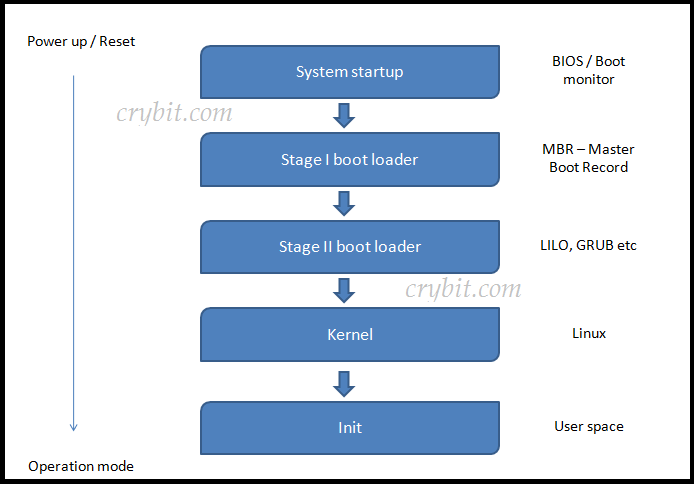
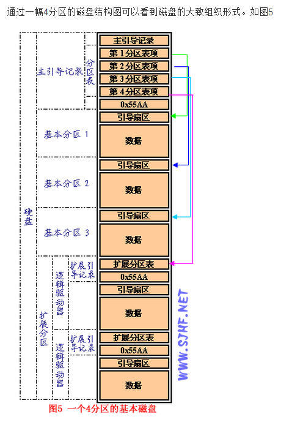
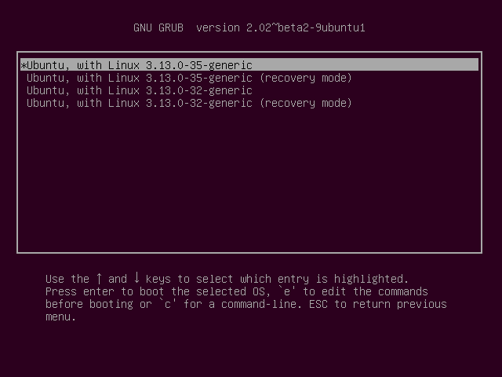

在当前Debian，Redhat这些Linux发行版的天下，Linux 的 BootLoader似乎已经成为一个遥远的概念。当然，如果你喜欢折腾Arch Linux这些需要手动设置Boot顺序的发行版，对Linux的启动流程肯定不会陌生。

近些时日，笔者读了一些关于Linux启动的文章，这篇博客就作为一篇学习笔记，分享一下从Linux0.11内核到现代Linux的启动。

## 现代Linux的Boot流程

如果你只是想了解现代Linux启动流程，阅读这一部分就足够了。

从PC通电到Linux完全挂载根文件系统运行，我们可以大致把整个流程分为5个部分：

BIOS启动, MBR加载，内核加载，内核启动和初始化。



### BIOS启动

随着时间推移，UEFI相较于BIOS占据了越来越高的地位。然而，作为一篇学习型的文章，我们在此不会讨论过于前沿的技术，随着IBM PC而流行的BIOS仍然是我们论述的重点。

BIOS预装在主板上（过去常烧录在ROM中，现在则存储在闪存中，便于更新BIOS），在通电时进行**硬件初始化**和**POST硬件自检**。POST测试(Power On Self Test)主要是检查一些硬件的读写是否正常。POST 主要不是用来做硬件诊断，它只是检查系统硬件是否存在并且加载一个BootLoader。POST过程中主要有两类错误：

1. 致命错误，主要是硬件原因；
2. 非致命错误，主要是软件原因。

**POST的主要职责**包括：

1. 检查CPU寄存器
2. 检查BIOS代码的完整性
3. 检查基本组件如DMA，计时器，中断控制器
4. 搜寻，确定系统主存大小
5. 初始化BIOS
6. 识别，组织，选择出哪些设备是可以启动的

### MBR加载

MBR(主引导记录，Master Boot Record)加载，是BootLoader工作的第一阶段。

MBR指的是磁盘上的第一个扇区，它存在于每一个硬盘上。按照C/H/S地址描述，即0柱面0磁头1扇区；按照LBA地址描述即0扇区。



在总共512字节的MBR扇区中，一般由三部分结构组成：

1. 主引导程序代码，占446字节
2. （可选部分）Windows磁盘标记，在Linux系统下不存在
3. 硬盘分区表DPT，占64字节
4. 主引导扇区结束标志AA55H

具体分布如下：

| 0000-0088 | Master Boot Record主引导程序 | 主引导程序                    |
| :-------- | ---------------------------- | :---------------------------- |
| 0089-01BD | 出错信息数据区               | 数据区<br />认为是MBR的一部分 |
| 01BE-01CD | 分区项1（16字节）            | 分区表                        |
| 01CE-01DD | 分区项2（16字节）            |                               |
| 01DE-01ED | 分区项3（16字节）            |                               |
| 01EE-01FD | 分区项4（16字节）            |                               |
| 01FE      | 55                           | 结束标志                      |
| 01FF      | AA                           |                               |

当我们从硬盘开始启动时，BIOS开始加载并执行boot loader里面的代码，MBR容量太小，有时候没法执行完整的boot loader代码，所以启动要转移到另外的阶段进行。这些阶段在不同的boot loader上不一样，是时候转移到boot loader的第二阶段了。

### 内核加载

也叫内核加载阶段，这个阶段的主要任务是加载Linux 内核。

在早期的Linux0.11中，这个流程通过将bootsect.S和setup.S代码加载到内存中执行。现代Linux支持了多种BootLoader，例如：

* LILO: Linux Loader
* GRUB: Grand Unified Boot Loader

主要使用的是GRUB，因为LILO有些缺点。GRUB的一个好处是它能识别Linux文件系统，GRUB能从格式为ext2/ext3的文件系统中加载内核。除此之外，Linux还可以通过将权限转接给ntldr实现Windows系统的启动。

GRUB会从一个已知的路径加载进来，通常是/boot/grub，同时会把必要的驱动和内核模块加载进来。之后读取该目录下自动生成的grub.conf，按照配置执行这个程序，也就是显示我们经常见到的GRUB菜单。



在这里就可以选择我们想要启动的内核咯，当然也可以把权限转接到windows或者BSD的启动程序上。

### 内核启动

内核镜像是压缩的，我们在/boot下可以找到这个vmlinuz压缩文件。当然如果从源码编译的话，得到的也会是这个vmlinuz文件。

我们可以从GRUB入口选择不同的内核，如果没有选择，GRUB会自动选择默认的那个去加载，我们当然也可以修改默认配置，然后生成新的grub.conf，自动加载内核。

选择的内核会先加载到内存中，然后是加载一个包含基本的根文件系统的镜像文件，最后内核的所有模块都会被加载到内存中。这个镜像文件的位置是/boot，也即我们所知道的initramfs，有的版本被命名为initrd。

initramfs，是”initial RAM file sytem”的简写，它的前身是initrd “initial ramdisk”. 这个镜像文件包含原始的文件系统。GRUB加载内核的时候会告诉内核这个镜像文件的内存地址，然后内核会挂载这个镜像文件到内存中作为Linux的根文件系统。

为什么我们需要这么一个看起来多余的操作？这是一个典型的先有鸡还是先有蛋的问题。加载Linux内核需要根文件系统，而加载根文件系统又需要内核的初始化，为了解决这个奇怪的矛盾，我们可以首先加载一个虚拟的根文件系统initramfs，然后等待真实的根文件系统被加载之后，再将它从内存中剔除。

之后内核会开始检测系统硬件。启动流程开始根据配置启动INIT(SYSTEMD)进程和对应的DAEMONS进程。这些内容会在下一个阶段完成。

### 内核初始化

内核一但加载到这一步，会自动执行sbin(sbin/init)下面的init程序。[在 RHEL/CENTOS 7中，/sbin/init被链接到 ../lib/systemd/systemd下]，当init进程启动，它就成为了你Linux机器的第一个进程，所有的新进程都是init的子进程，所有的孤儿进程都由init进程来回收和管理。

init进程做的第一件事是读取配置文件, /etc/inittab，这会指引init进程去读初始化配置脚本去配置环境、设置PATH，开启swapping，检查文件系统等等。从/etc/inittab里，系统会根据rc文件开启对应的服务。

当然，这里展开的话完全可以写一篇新的博客来讲解，在这里我们有一个大致的了解就可以了。

## Linux0.11内核Boot

诶，既然我们连最新的Linux内核的启动流程都了解了，为什么还要来学习Linux0.11这个半成品的版本？

事实上，即使是最新的Linux内核，启动流程的设计上也和最早的Linux有一定的共通之处，而且古早的Linux内核具备更少的源代码，在学习上更加容易理解，也更容易形成工程上的视野。

接下来的解析，需要一定的汇编语言和C语言能力，如果难以理解的话，可以看一些更加简单的解析，这里推荐《Linux内核源码完全注释》。

首先被从MBR中加载到内存里的是bootsect.s部分的代码。在BIOS开始执行启动代码之后，boot引导程序被加载到0x07c0部分，之后移动到0x9000处开始执行。然后system模块会被加载到0x1000处，最大不会超出0x9000部分，然后开始初始化init进程。

我们按顺序看看源码：

### bootsect.s

这里定义了所有的地址常量，用于加载和启动内核

```
SETUPLEN = 4				! nr of setup-sectors               
BOOTSEG  = 0x07c0			! original address of boot-sector  
INITSEG  = 0x9000			! we move boot here - out of the way 
SETUPSEG = 0x9020			! setup starts here              
SYSSEG   = 0x1000			! system loaded at 0x10000 (65536).  
ENDSEG   = SYSSEG + SYSSIZE		! where to stop loading  
                                                        
! ROOT_DEV:	0x000 - same type of floppy as boot.       
!		0x301 - first partition on first drive etc         
ROOT_DEV = 0x306                                        

```

然后会执行真正的启动流程，加载setup：

```
entry start                                        
start:                                             
	mov	ax,#BOOTSEG                                 
	mov	ds,ax                                       
	mov	ax,#INITSEG                                 
	mov	es,ax                                       
	mov	cx,#256                                     
	sub	si,si                                       
	sub	di,di                                       
	rep                                              
	movw                                             
	jmpi	go,INITSEG                                 
go:	mov	ax,cs                                    
	mov	ds,ax                                       
	mov	es,ax                                       
! put stack at 0x9ff00.                            
	mov	ss,ax                                       
	mov	sp,#0xFF00		! arbitrary value >>512       
                                                   
! load the setup-sectors directly after the bootblock. 
! Note that 'es' is already set up.                
                                                   
load_setup:                                        
	mov	dx,#0x0000		! drive 0, head 0             
	mov	cx,#0x0002		! sector 2, track 0           
	mov	bx,#0x0200		! address = 512, in INITSEG   
	mov	ax,#0x0200+SETUPLEN	! service 2, nr of sectors 
	int	0x13			! read it                         
	jnc	ok_load_setup		! ok - continue            
	mov	dx,#0x0000                                  
	mov	ax,#0x0000		! reset the diskette          
	int	0x13                                        
	j	load_setup                                    

```

接下来，成功加载setup后，我们继续把system模块加载进来：

```
ok_load_setup:                                            
                                                          
! Get disk drive parameters, specifically nr of sectors/track 
                                                          
	mov	dl,#0x00                                           
	mov	ax,#0x0800		! AH=8 is get drive parameters       
	int	0x13                                               
	mov	ch,#0x00                                           
	seg cs                                                  
	mov	sectors,cx                                         
	mov	ax,#INITSEG                                        
	mov	es,ax                                              
                                                          
! Print some inane message                                
                                                          
	mov	ah,#0x03		! read cursor pos                      
	xor	bh,bh                                              
	int	0x10                                               
	                                                        
	mov	cx,#24                                             
	mov	bx,#0x0007		! page 0, attribute 7 (normal)       
	mov	bp,#msg1                                           
	mov	ax,#0x1301		! write string, move cursor          
	int	0x10                                               
                                                          
! ok, we've written the message, now                      
! we want to load the system (at 0x10000)                 
                                                          
	mov	ax,#SYSSEG                                         
	mov	es,ax		! segment of 0x010000                     
	call	read_it                                           
	call	kill_motor                                        

```

这段代码会打印"Loading..."到界面上，在完成了所有的准备工作之后，我们跳转到SETUPSEG的内存处，控制权转接到setup.

### setup.s

setup程序会完成很多实模式的初始化。

```
entry start                                                            
start:                                                                 
                                                                       
! ok, the read went well so we get current cursor position and save it for 
! posterity.                                                           
                                                                       
	mov	ax,#INITSEG	! this is done in bootsect already, but...         
	mov	ds,ax                                                           
	mov	ah,#0x03	! read cursor pos                                     
	xor	bh,bh                                                           
	int	0x10		! save it in known place, con_init fetches              
	mov	[0],dx		! it from 0x90000.                                    
                                                                       
! Get memory size (extended mem, kB)                                   
                                                                       
	mov	ah,#0x88                                                        
	int	0x15                                                            
	mov	[2],ax                                                          
                                                                       
! Get video-card data:                                                 
                                                                       
	mov	ah,#0x0f                                                        
	int	0x10                                                            
	mov	[4],bx		! bh = display page                                   
	mov	[6],ax		! al = video mode, ah = window width                  
                                                                       
! check for EGA/VGA and some config parameters                         
                                                                       
	mov	ah,#0x12                                                        
	mov	bl,#0x10                                                        
	int	0x10                                                            
	mov	[8],ax                                                          
	mov	[10],bx                                                         
	mov	[12],cx                                                         
                                                                       
! Get hd0 data                                                         
                                                                       
	mov	ax,#0x0000                                                      
	mov	ds,ax                                                           
	lds	si,[4*0x41]                                                     
	mov	ax,#INITSEG                                                     
	mov	es,ax                                                           
	mov	di,#0x0080                                                      
	mov	cx,#0x10                                                        
	rep                                                                  
	movsb                                                                
                                                                       
! Get hd1 data                                                         
                                                                       
	mov	ax,#0x0000                                                      
	mov	ds,ax                                                           
	lds	si,[4*0x46]                                                     
	mov	ax,#INITSEG                                                     
	mov	es,ax                                                           
	mov	di,#0x0090                                                      
	mov	cx,#0x10                                                        
	rep                                                                  
	movsb                                                                
                                                                       
! Check that there IS a hd1 :-)                                        
                                                                       
	mov	ax,#0x01500                                                     
	mov	dl,#0x81                                                        
	int	0x13                                                            
	jc	no_disk1                                                         
	cmp	ah,#3                                                           
	je	is_disk1                                                         
no_disk1:                                                              
	mov	ax,#INITSEG                                                     
	mov	es,ax                                                           
	mov	di,#0x0090                                                      
	mov	cx,#0x10                                                        
	mov	ax,#0x00                                                        
	rep                                                                  
	stosb                                                                
is_disk1:                                                              
                                                                       
! now we want to move to protected mode ...                            
                                                                       
	cli			! no interrupts allowed !                                   
                                                                       
! first we move the system to it's rightful place                      
                                                                       
	mov	ax,#0x0000                                                      
	cld			! 'direction'=0, movs moves forward                         

```

setup.s部分的代码会首先检测所有的硬件，在完成检测之后，将0x1000处的system移动到0x0000，准备从当前的实模式进入保护模式。

接下来，通过head.s把idt,gdt在堆栈中设置为默认值，同时一些其他内容也会在这个部分设置，例如中断。

```
is_disk1:                                                       
                                                                
! now we want to move to protected mode ...                     
                                                                
	cli			! no interrupts allowed !                            
                                                                
! first we move the system to it's rightful place               
                                                                
	mov	ax,#0x0000                                               
	cld			! 'direction'=0, movs moves forward                  
do_move:                                                        
	mov	es,ax		! destination segment                           
	add	ax,#0x1000                                               
	cmp	ax,#0x9000                                               
	jz	end_move                                                  
	mov	ds,ax		! source segment                                
	sub	di,di                                                    
	sub	si,si                                                    
	mov 	cx,#0x8000                                              
	rep                                                           
	movsw                                                         
	jmp	do_move                                                  
                                                                
! then we load the segment descriptors                          
                                                                
end_move:                                                       
	mov	ax,#SETUPSEG	! right, forgot this at first. didn't work :-) 
	mov	ds,ax                                                    
	lidt	idt_48		! load idt with 0,0                           
	lgdt	gdt_48		! load gdt with whatever appropriate          
                                                                
! that was painless, now we enable A20                          
                                                                
	call	empty_8042                                              
	mov	al,#0xD1		! command write                              
	out	#0x64,al                                                 
	call	empty_8042                                              
	mov	al,#0xDF		! A20 on                                     
	out	#0x60,al                                                 
	call	empty_8042                                              

```

接下来是设置部分必须的中断:

```
	mov	al,#0x11		! initialization sequence      
	out	#0x20,al		! send it to 8259A-1           
	.word	0x00eb,0x00eb		! jmp $+2, jmp $+2      
	out	#0xA0,al		! and to 8259A-2               
	.word	0x00eb,0x00eb                            
	mov	al,#0x20		! start of hardware int's (0x20)   
	out	#0x21,al                                   
	.word	0x00eb,0x00eb                            
	mov	al,#0x28		! start of hardware int's 2 (0x28) 
	out	#0xA1,al                                   
	.word	0x00eb,0x00eb                            
	mov	al,#0x04		! 8259-1 is master             
	out	#0x21,al                                   
	.word	0x00eb,0x00eb                            
	mov	al,#0x02		! 8259-2 is slave              
	out	#0xA1,al                                   
	.word	0x00eb,0x00eb                            
	mov	al,#0x01		! 8086 mode for both           
	out	#0x21,al                                   
	.word	0x00eb,0x00eb                            
	out	#0xA1,al                                   
	.word	0x00eb,0x00eb                            
	mov	al,#0xFF		! mask off all interrupts for now  
	out	#0x21,al                                   
	.word	0x00eb,0x00eb                            
	out	#0xA1,al                                   

```

最后，我们会真正地跳转到保护模式，运行Linux在内核部分的启动和初始化：

```
	mov	ax,#0x0001	! protected mode (PE) bit  
	lmsw	ax		! This is it!                 
	jmpi	0,8		! jmp offset 0 of segment 8 (cs) 

```

在此之后，控制权便真正地转接到了main函数。

### main.c

main函数首先设置内存的布局，然后便开始执行一系列的初始化：

```c
void main(void) /* This really IS void, no error here. */                  
{               /* The startup routine assumes (well, ...) this */         
  /*                                                                       
   * Interrupts are still disabled. Do necessary setups, then              
   * enable them                                                           
   */                                                                      
  ROOT_DEV = ORIG_ROOT_DEV;                                                
  drive_info = DRIVE_INFO;                                                 
  // 计算实际物理内存大小：                                                
  memory_end = (1 << 20) + (EXT_MEM_K << 10);                              
  memory_end &= 0xfffff000; // 对齐到kb，使用一个4GB的mask来取KB之后的内存地址 
  // 限制内存大小不超过16MB                                                
  if (memory_end > 16 * 1024 * 1024)                                       
    memory_end = 16 * 1024 * 1024;                                         
  // 根据内存大小，设定缓冲区                                              
  if (memory_end > 12 * 1024 * 1024)                                       
    buffer_memory_end = 4 * 1024 * 1024;                                   
  else if (memory_end > 6 * 1024 * 1024)                                   
    buffer_memory_end = 2 * 1024 * 1024;                                   
  else                                                                     
    buffer_memory_end = 1 * 1024 * 1024;                                   
  // 主存起始地址 = 缓冲区结束地址                                         
  main_memory_start = buffer_memory_end;                                   
  // 最终的内存布局类似：                                                  
  // +------------------+ 0x1000000 (16MB)                                 
  // |                  |                                                  
  // |   主内存区        |                                                 
  // |                  |                                                  
  // +------------------+ main_memory_start                                
  // |                  |                                                  
  // |   缓冲区          |                                                 
  // |                  |                                                  
  // +------------------+ 0x100000 (1MB)                                   
  // |   系统ROM/BIOS    |                                                 
  // |   及其他          |                                                 
  // +------------------+ 0x0                                              
#ifdef RAMDISK                                                             
  main_memory_start += rd_init(main_memory_start, RAMDISK * 1024);         
#endif                                                                     

```

```c
  mem_init(main_memory_start, memory_end); 
  trap_init();                                     
  blk_dev_init();                                  
  chr_dev_init();                                  
  tty_init();                                      
  time_init();                                     
  sched_init();                                    
  buffer_init(buffer_memory_end);      
  hd_init();                                       
  floppy_init();                                   

```

最后，main函数陷入内核空间中的进程0，然后移动到用户空间，复制一份用户空间的进程1作为init进程后，结束初始化的所有任务。

```c
  sti();                                                          
  move_to_user_mode();                                            
  if (!fork()) { /* we count on this going ok */                  
    init();                                                       
  }                                                               
  /*                                                              
   *   NOTE!!   For any other task 'pause()' would mean we have to get a  
   * signal to awaken, but task0 is the sole exception (see 'schedule()') 
   * as task 0 gets activated at every idle moment (when no other tasks   
   * can run). For task0 'pause()' just means we go check if some other   
   * task can run, and if not we return here.                     
   */                                                             
  for (;;)                                                        
    pause();                                                      

```
