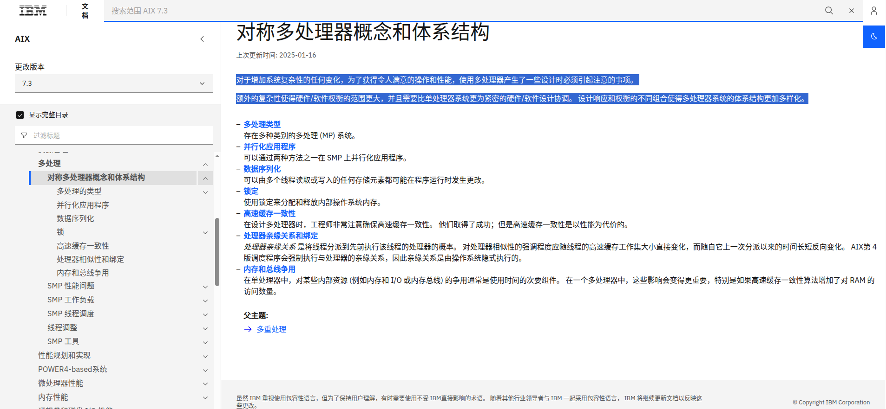
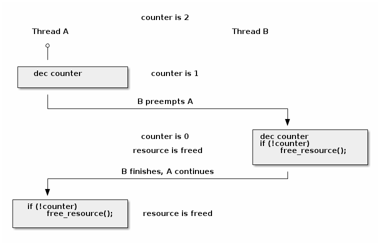
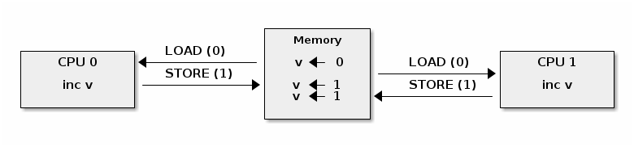
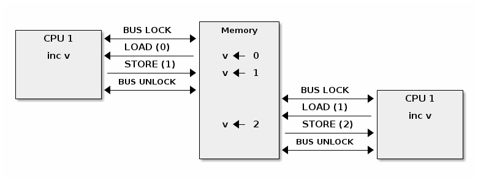
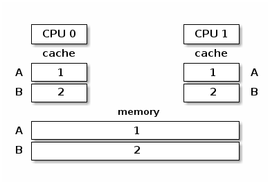
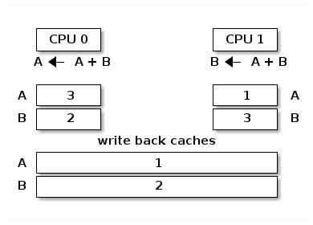
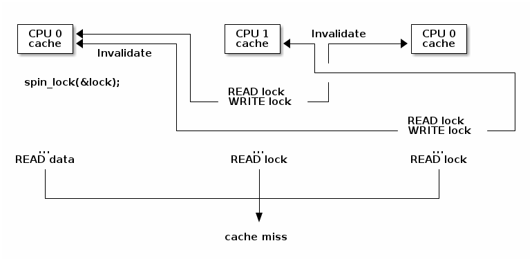
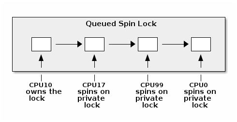
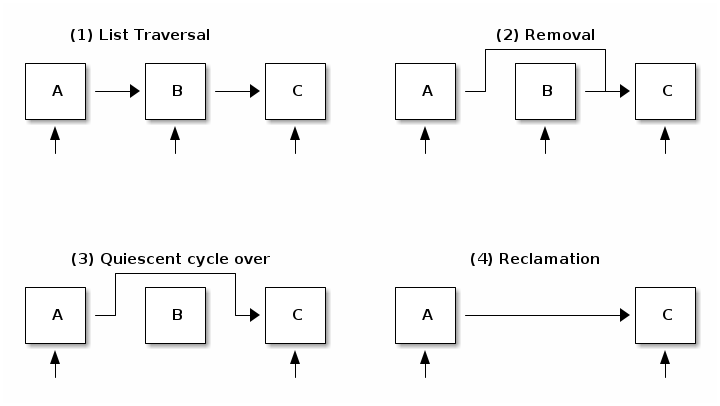

> 对于增加系统复杂性的任何变化，为了获得令人满意的操作和性能，使用多处理器产生了一些设计时必须引起注意的事项。
>
> 额外的复杂性使得硬件/软件权衡的范围更大，并且需要比单处理器系统更为紧密的硬件/软件设计协调。 设计响应和权衡的不同组合使得多处理器系统的体系结构更加多样化。

对称多处理是一个很深奥的部分，毕竟本人也不是专门搞操作系统开发的，这方面涉及了很多的软硬件的邪门技巧，在此只做一个宽泛的解读。

至于源码分析...呃，那还是算了吧，连硬件层面的理念都有点绕...（所以你在【源码】tag里是找不到这篇博客的hhh）

本篇会涉及到的内容：

* 内核并发
* 原子操作
* 自旋锁
* 缓存抖动
* 优化自旋锁
* 进程和中断上下文同步
* 互斥锁
* 每个 CPU 的数据
* 内存排序和屏障
* 读-拷贝 更新（RCU）

# 运维层面的对称多处理

## SMP

### 对称多处理

对称多处理就是**SMP** (Symmetric Multi Processing)。

我们来看看AI的解释：


详细来讲，对称多处理系统内有许多紧耦合多处理器，在这样的系统中，所有的CPU共享全部资源，如总线，内存和I/O系统等，然而操作系统或管理数据库的复本只有一个。

这种系统有一个最大的特点就是**共享所有资源**。多个CPU之间没有区别，平等地访问内存、外设、以及同一个操作系统。

同时，操作系统**管理着一个队列**，每个处理器依次处理队列中的进程。如果两个处理器同时请求访问一个资源（例如同一段内存地址），由硬件、软件的锁机制去解决资源争用问题。此外，对 RAM 的访问是序列化的。

### 对称多处理器

所谓**对称多处理器结构**，是指服务器中的多个 CPU 对称工作，无主次或从属关系。各 CPU 共享相同的物理内存，每个人 CPU 访问内存中的任何地址所需时间是相同的，因此 SMP 也被称为**一致存储器访问结构** (UMA ： Uniform Memory Access) 。

对 SMP 服务器进行扩展的方式包括增加内存、使用更快的 CPU 、增加 CPU 、扩充 I/O( 槽口数与总线数 ) 以及添加更多的外部设备 ( 通常是磁盘存储 ) 。

SMP 服务器的主要特征是共享，系统中的所有资源 (CPU 、内存、 I/O 等 ) 都是共享的。也正是由于这种特征，导致了 SMP 服务器的主要问题，那就是它的扩展能力非常有限。对于 SMP 对于服务器而言，每一个共享的环节都可能造成 SMP 服务器扩展时的瓶颈，而最受限制的则是内存。

由于每个 CPU 必须通过相同的内存总线访问相同的内存资源，因此随着 CPU 数量的增加，内存访问冲突将迅速增加，最终会造成 CPU 资源的浪费，使 CPU 性能的有效性大大降低。实验证明， SMP 服务器 CPU 利用率最好的情况是 2 至 4 个 CPU 。

## NUMA

由于 SMP 在扩展能力上的限制，人们开始探究如何进行有效地扩展从而构建大型系统的技术， **NUMA** 就是这种努力下的结果之一。利用 NUMA 技术，可以把几十个 CPU( 甚至上百个 CPU) 组合在一个服务器内。

NUMA 服务器的基本特征是具有**多个 CPU 模块**，每个 CPU 模块由多个 CPU( 如 4 个 ) 组成，并且具有独立的本地内存、 I/O 槽口等。由于其节点之间可以通过互联模块 ( 如称为 Crossbar Switch) 进行连接和信息交互，因此每个人都有 CPU 可以访问整个系统的内存 ( 这是 NUMA 系统与 MPP 系统的重要差别 ) 。

显然，访问本地内存的速度将远远高于访问远地内存 ( 系统内其它节点的内存 ) 的速度，这也是非一致存储访问 NUMA 的由来。由于这个特点，为了更好地发挥系统性能，开发应用程序时需要尽量减少不同 CPU 模块之间的信息交互。

利用 NUMA 技术，可以较好地解决原来 SMP 系统的扩展问题，在一个物理服务器内可以支持上百个 CPU 。比较典型的 NUMA 服务器的例子包括 HP 的Superdome 、SUN15K 、 IBMp690 等。

但 NUMA 技术同样有一定缺陷，由于访问原地内存的延时远远超过本地内存，因此当 CPU 数量增加时，系统性能无法线性增加。

如 HP 公司发布 Superdome 服务器时，曾公布了它与 HP 其它 UNIX 服务器的相对性能值，结果发现， 64 路 CPU 的 Superdome (NUMA 结构 ) 的相对性能值是 20 ，而 8 路 N4000( 共享的 SMP 结构 ) 的相对性能值是 6.3 。从这个结果可以看到， 8 倍数量的 CPU 换来的只是 3 倍性能的提升。

### 现代对称多处理

在IBM网页，我们可以看到现代化对称多处理的一些基本概念以及关键指标：



# Linux视角下的对称多处理

## 基本同步

由于 Linux 内核支持对称多处理（SMP），它必须使用一组**同步机制**来保证结果可预测，并避免**竟态条件**。

竟态条件在以下两个条件**同时**满足时可能会发生：

* 至少有**两个执行上下文**同时运行：
  * 真正并行运行（例如，在不同处理器上运行的两个系统调用）
  * 其中一个上下文可以任意抢占另一个上下文（例如，中断抢占了系统调用）
* 执行上下文**对共享内存进行读写**访问

竟态条件可能导致错误。这些错误结果很难调试，因为它们只在执行上下文以非常特定的顺序调度到 CPU 核心上时才会出现。

竟态条件的一个经典示例是资源计数器释放操作的不正确实现：

```c
void release_resource()
{
     counter--;

     if (!counter)
         free_resource();
}
```

资源计数器用于确保共享资源持续可用，直至所有用户都将其释放。但上述实现存在一个竟态条件，可能导致资源被释放两次：



在大多数情况下，`release_resource()`函数只会释放资源一次。然而，在上述情况中，如果线程 A 在递减 counter 后被立即抢占，而线程 B 调用了 release_resource()，导致资源被释放。当线程 A 恢复执行时，它也会释放资源，因为计数器的值为 0。

为了避免竞态条件，程序员首先必须**确定可能产生竞态条件的临界区**（critical section）。临界区是代码的一部分，它读取和写入共享内存，多个并行的上下文都可访问这段共享内存。

在上述示例中，最小的临界区从计数器递减开始，到检查计数器的值结束。

确定了临界区之后，可以使用以下方法之一避免竞态条件：

* 使临界区 **原子化** (例如使用原子指令)
* 在临界区期间 **禁用抢占** (例如禁用中断、后半部分处理程序或线程抢占)
* **序列化访问** 临界区 (例如使用自旋锁或互斥锁，同一时间只允许有一个上下文或线程进入临界区)

## Linux内核并发源

Linux 内核中存在多个并发源，具体多少个取决于内核配置和运行系统的类型：

* **单核系统** ,  **非抢占内核** ：当前进程可以被中断抢占
* **单核系统** ,  **抢占内核** ：上述情况 + 当前进程可以被其他进程抢占
* **多核系统** ：上述情况 + 当前进程可以与在另一个处理器上运行的另一个进程或中断并行运行

## 原子操作

在某些情况下，我们可以通过使用硬件提供的原子操作来避免竞态条件。Linux 提供了统一的 API，用来访问原子操作：

* 基于整数：
  * 简单操作: `atomic_inc()` (原子递增), `atomic_dec()` (原子递减), `atomic_add()` (原子加法), `atomic_sub()` (原子减法)
  * 条件操作: `atomic_dec_and_test()` (原子递减并测试), `atomic_sub_and_test()` (原子减法并测试)
* 基于位操作：
  * 简单操作: `test_bit()` (测试位), `set_bit()` (设置位), `change_bit()` (修改位)
  * 条件操作: `test_and_set_bit()` (测试并设置位), `test_and_clear_bit()` (测试并清除位), `test_and_change_bit()` (测试并修改位)

例如，我们可以使用 `atomic_dec_and_test()` 来实现资源计数器的递减和值检查的原子操作：

```c
void release_resource()
{
    if (atomic_dec_and_test(&counter))
         free_resource();
}
```

原子操作的挑战之一是，在多核系统中，**系统级别**上不再是原子的，尽管在**处理器核心级别**仍然是原子的。

为了理解这一点，我们需要**将原子操作分解为内存加载和存储操作**。然后，我们可以构造出在多个 CPU 之间交错执行加载和存储操作的竞态条件场景。就像下面的示例中，两个处理器对同一个值进行递增将产生意外的结果：



为了在 SMP 系统上提供原子操作，不同的体系结构采用不同的技术。例如，在 x86 上，使用 LOCK 前缀可以在执行带有前缀的操作时锁定系统总线。



在 ARM 上，LDREX 和 STREX 指令一起使用，来实现原子访问：LDREX 加载一个值并通知独占监视器正在进行原子操作。STREX 尝试存储一个新值，但只有在独占监视器未检测到其他独占操作时才成功。因此，为了实现原子操作，程序员不断重试操作（包括 LDREX 和 STREX），直到独占监视器发出成功的信号。

尽管它们经常被解释为“**轻量级**”或“**高效**”的同步机制（因为它们“不需要自旋或上下文切换”，或者因为它们“在硬件中实现，所以它们肯定更高效”，或者因为它们“只是指令，所以它们的效率应该与其他指令类似”），但从实现细节来看，**原子操作实际上资源消耗巨大**。

## 禁用抢占（中断）

在单核系统和非抢占内核中，唯一的并发来源是**通过中断抢占当前线程**。要想防止并发，只需要禁用中断。

这可以通过特定于体系结构的指令来实现，但 Linux 提供了与体系结构无关的 API 来禁用和启用中断：

```c
#define local_irq_disable() \
     asm volatile („cli” : : : „memory”)

#define local_irq_enable() \
    asm volatile („sti” : : : „memory”)

#define local_irq_save(flags) \
    asm volatile ("pushf ; pop %0" :"=g" (flags)
                  : /* no input */: "memory") \
    asm volatile("cli": : :"memory")

#define local_irq_restore(flags) \
    asm volatile ("push %0 ; popf"
                  : /* no output */
                  : "g" (flags) :"memory", "cc");
```

虽然中断可以通过 `local_irq_disable()` 和 `local_irq_enable()` 函数来显式禁用和启用，但这些 API 只应在当前状态和中断是已知的情况下使用。它们通常用于核心内核代码（如中断处理）。

如果是由于并发问题而希望避免中断的典型情况，建议使用 `local_irq_save()` 和 `local_irq_restore()` 变体。它们会保存和恢复中断状态，因此可以在重叠的临界区中自由调用它们，而无需担心因在临界区内意外启用中断而造成糟糕情况，只要调用是平衡的。

## 自旋锁

**自旋锁**用于实现对关键区域的串行访问。在多核系统中，可以实现真正的执行并行性，因此自旋锁是必需的。以下是典型的自旋锁实现：

```assembly
  spin_lock:
      lock bts [my_lock], 0
      jc spin_lock

  /* 临界区 */

  spin_unlock:
      mov [my_lock], 0

**bts dts, src**——位测试并设置；它将来自 dts 内存地址的第 src 位复制到进位标志位（carry flag），然后将其设置为 1：
```

```
CF <- dts[src]
dts[src] <- 1
```

可以看出，自旋锁使用原子指令来确保同一时间只有一个核心能进入临界区。**如果同时有多个核心试图进入，它们将不断地“自旋”，一直到锁被释放为止**。

虽然自旋锁避免了竟态条件，但**它可能对系统性能产生显著影响**，这是由于“锁争用”（lock contention）引起的：

* 当至少有一个核心在自旋尝试进入临界区时，就会发生锁争用
* 锁争用随着临界区大小、在临界区中花费的时间以及系统中处理器核心数量的增加而增加

自旋锁的另一个负面副作用是**高速缓存抖动**。

当多个处理器核心试图读写同一内存时，会发生高速缓存抖动，导致过多的高速缓存未命中。

由于自旋锁在锁争用期间不断访问内存，高速缓存抖动很常见，这是由高速缓存一致性的实现方式造成的。

## 多处理器系统中的缓存一致性

多处理器系统中的内存层次结构由本地 CPU 缓存（L1 缓存）、共享 CPU 缓存（L2 /L3缓存）和内存组成。为了解释缓存一致性，我们暂且忽略 L2 缓存，只考虑 L1 缓存和主存。

在下面的图中，我们展示了具有两个变量 A 和 B 的内存层次结构。两个变量位于不同的缓存行中，缓存和内存是同步的：



如果缓存和内存之间缺乏同步机制的话，当 CPU 0 执行 A = A + B，而 CPU 1 执行 B = A + B 时，会得到以下内存视图：



为了避免上述情况，多处理器系统使用了**缓存一致性**（cache coherence）协议。缓存一致性协议主要分为两种类型：

* 总线嗅探（Bus snooping）：缓存监视内存总线事务，并采取行动以保持一致性。
* 目录（Directory）协议：有一个单独的实体（目录）来维护缓存的状态；缓存与目录交互以保持一致性。

**缓存嗅探协议**较为简单，但当核心数超过 32-64 时性能表现较差。

**目录协议**的缓存一致性协议能够更好地扩展（可达数千个核心），非一致性存储访问（NUMA）系统中通常使用的就是目录协议。

实际应用中常用的简单缓存一致性协议是 MESI（根据缓存行状态的首字母缩写命名:  **Modified（已修改）** ,  **Exclusive（独占）** , **Shared（共享）** 和  **Invalid（已失效）** ）。其主要特点包括：

* 缓存策略：写回（write back）
* 缓存行状态
  * 已修改：由单个核心拥有且为脏数据
  * 独占：由单个核心拥有且为干净数据
  * 共享：由多个核心共享且为干净数据
  * 已失效：该行未被缓存

**CPU 核心发出读取或写入请求将触发状态转换**，如下所示：

* 已失效 -> 独占：读取请求，所有其他核心中的该行处于已失效状态；从内存加载该行
* 已失效 -> 共享 ：读取请求，至少一个核心中的该行处于共享或独占状态；从兄弟缓存加载该行
* 已失效/共享/独占 -> 已修改：写入请求; **所有其他** 核心 **将自身的该行状态设为已失效**
* 已修改 -> 已失效 ：来自其他核心的写入请求；将该行刷新到内存

:::note

MESI 协议最重要的特性是它是一种写失效（write-invalidate）的缓存协议。当对共享位置进行写操作时，所有其他缓存都会失效。

:::

这对于某些访问模式具有重要的性能影响，其中一个模式是争用简单的自旋锁，就像我们上面讨论的那样。

为了说明这个问题，让我们假设某个三核系统，其中第一个核心已经获取了自旋锁，并且正在运行临界区，而其他两个核心正在自旋等待进入临界区：



上图中可以看到，由于在锁上自旋的核心发出的写操作，我们会看到频繁的缓存行失效操作，这意味着两个等待的核心将在等待锁时刷新和加载缓存行，从而在内存总线上创建不必要的流量并减慢第一个核心的内存访问速度。

另一个问题是，很有可能由第一个 CPU 在临界区访问的数据存储在与锁相同的缓存行中（在获取锁后将数据准备在缓存中是一种常见优化）。这意味着两个自旋核心触发的缓存失效将减慢临界区的执行，从而触发更多的缓存失效操作。

## 优化的自旋锁

由于缓存抖动，简单的自旋锁实现可能会出现性能问题，且随着核心数量的增加问题会不断加剧。要避免这个问题，有两种可行的策略：

* 减少写操作的次数，从而减少缓存失效操作的次数
* 避免其他处理器在相同的缓存行上自旋，从而避免缓存失效操作

下面是使用第一种方法的优化自旋锁实现：

```assembly
spin_lock:
    rep ; nop
    test lock_addr, 1
    jnz spin_lock
    lock bts lock_addr
    jc spin_lock
```

* 我们首先只测试（读）锁，并且使用非原子指令来操作，以避免写入进而导致在自旋时产生失效操作
* 仅当锁 *可能* 是空闲的时候，我们才尝试获取它

该实现还使用 **PAUSE** 指令来避免由于（错误的）内存顺序违规而引起的流水线刷新，并添加一个小延迟（与内存总线频率成比例）以降低功耗。

在许多体系结构版本的 Linux 内核中，还使用了类似的实现，其实现支持公平性（基于到达时间判断允许哪个 CPU 内核进入临界区），这种实现的名称是 [票据自旋锁（ticket spin lock）](https://lwn.net/Articles/267968/)。

然而，当前 x86 体系结构使用自旋锁队列来实现自旋锁，CPU 核心在不同的锁上旋转（如果分布在不同的缓存行中那最好），以避免缓存失效操作。



理论上，当一个 CPU 核心尝试获取锁并失败时，它会将自己的私有锁添加到等待 CPU 核心的列表中。当锁的持有者退出临界区时，它会解除列表中的下一个锁（如果有的话）。

即使使用读取自旋优化的自旋锁，也无法完全避免缓存失效操作。因为锁的持有者在修改与锁同一缓存行中的其他数据结构时，仍然会产生缓存失效操作。这反过来会在自旋核心的后续读取中产生内存流量。

因此，如果有大量核心（如 NUMA 系统），队列自旋锁由于其更好的扩展性因此更适合。由于它们具有与 ticket 锁类似的公平性属性，因此在 x86 架构上是首选的实现。

## 进程和中断上下文同步

同时从进程和中断上下文访问共享数据是相对常见的场景。在单核系统中，我们可以通过禁用中断来解决这一问题，但在多核系统中，这种方法行不通，因为进程和中断上下文可能在不同的 CPU 核心上运行。

使用为多处理器系统设计的自旋锁似乎是正确的解决方案，但这样做可能会产生常见的死锁条件，下面的场景详述这一问题：

* 在进程上下文中，我们获取自旋锁
* 发生中断，并在同一 CPU 核心上调度
* 中断处理程序运行并尝试获取自旋锁
* 当前 CPU 将发生死锁

要避免这个问题，可以双管齐下：

* 在进程上下文中：禁用中断并获取自旋锁；这将保护免受中断或其他 CPU 核心竟态条件的影响（`spin_lock_irqsave()` 和 `spin_lock_restore()` 结合了这两个操作）
* 在中断上下文中：获取自旋锁；这将保护免受运行在不同处理器上的其他中断处理程序或进程上下文的竟态条件的影响

对于其他中断上下文处理程序（如 softirqs、tasklets 或定时器），我们也面临相同的问题，尽管禁用中断可能会起作用，但建议使用专用的 API：

* 在进程上下文中使用 `spin_lock_bh()` (将 `local_bh_disable()` 和 `spin_lock()` 结合起来) 和 `spin_unlock_bh()` (将 `spin_unlock()` 和 `local_bh_enable()` 结合起来)
* 在软中断上下文中使用：`spin_lock()` 和 `spin_unlock()` (如果与中断处理程序共享数据，则使用 `spin_lock_irqsave()` 和 `spin_lock_irqrestore()`)

如前所述，考虑到抢占，Linux 内核中的并发源还可以是其他进程。

抢占是可配置的：如果激活，它提供更低的延迟和响应时间，而如果停用，它提供更好的吞吐量。

抢占被自旋锁和互斥锁禁用，但也可以手动禁用（通过核心内核代码）。

至于本地中断启用和禁用的 API，软中断和抢占 API 允许它们在嵌套的临界区中使用。计数器用来跟踪软中断和抢占的状态。事实上，它们使用同一个计数器，但是增量不同：

```c
#define PREEMPT_BITS      8
#define SOFTIRQ_BITS      8
#define HARDIRQ_BITS      4
#define NMI_BITS          1

#define preempt_disable() preempt_count_inc()

#define local_bh_disable() add_preempt_count(SOFTIRQ_OFFSET)

#define local_bh_enable() sub_preempt_count(SOFTIRQ_OFFSET)

#define irq_count() (preempt_count() & (HARDIRQ_MASK | SOFTIRQ_MASK))

#define in_interrupt() irq_count()

asmlinkage void do_softirq(void)
{
    if (in_interrupt()) return;
    ...
```

## 互斥锁（Mutexes）

互斥锁用于防止其他 CPU 核心的竟态条件，但它们只能在 **进程上下文** 中使用。与自旋锁相反，如果一个线程等待进入临界区，它不会占用 CPU 时间，而是会被添加到一个等待队列中，直到临界区被释放。

由于互斥锁和自旋锁的使用存在交集，因此在此比较一下它们：

* 如果上下文切换开销低于自旋时间平均值，则系统吞吐量比自旋锁好，因为它们不会"浪费" CPU 周期
* 不能在中断上下文中使用
* 比起自旋锁具有更高的延迟

从概念上讲, [:c:`mutex_lock`](https://linux-kernel-labs-zh.xyz/so2/lec5-smp.html#system-message-1) 操作相对简单：如果互斥锁未被获取，我们可以通过原子交换操作走捷径：

```c
void __sched mutex_lock(struct mutex *lock)
{
  might_sleep();

  if (!__mutex_trylock_fast(lock))
    __mutex_lock_slowpath(lock);
}

static __always_inline bool __mutex_trylock_fast(struct mutex *lock)
{
  unsigned long curr = (unsigned long)current;

  if (!atomic_long_cmpxchg_acquire(&lock->owner, 0UL, curr))
    return true;

  return false;
}
```

否则，我们将采取缓慢的路径，将自己添加到互斥锁的等待列表中并进入睡眠状态。

```c
...
  spin_lock(&lock->wait_lock);
...
  /* 添加等待的任务到等待队列尾部 (FIFO): */
  list_add_tail(&waiter.list, &lock->wait_list);
...
  waiter.task = current;
...
  for (;;) {
    if (__mutex_trylock(lock))
      goto acquired;
  ...
    spin_unlock(&lock->wait_lock);
  ...
    set_current_state(state);
    spin_lock(&lock->wait_lock);
  }
  spin_lock(&lock->wait_lock);
acquired:
  __set_current_state(TASK_RUNNING);
  mutex_remove_waiter(lock, &waiter, current);
  spin_lock(&lock->wait_lock);
...
```

完整的实现稍微复杂一些：它不会立即进入睡眠状态，而是在检测到锁的拥有者当前在不同的 CPU 上运行时进行乐观自旋，因为很有可能拥有者很快就会释放锁。它还检查信号并处理锁依赖引擎调试功能的互斥调试。

`mutex_unlock()` 操作是对称的：如果互斥锁没有等待者，我们可以通过原子交换操作走快速路径：

```c
void __sched mutex_unlock(struct mutex *lock)
{
  if (__mutex_unlock_fast(lock))
    return;
  __mutex_unlock_slowpath(lock, _RET_IP_);
}

static __always_inline bool __mutex_unlock_fast(struct mutex *lock)
{
  unsigned long curr = (unsigned long)current;

  if (atomic_long_cmpxchg_release(&lock->owner, curr, 0UL) == curr)
    return true;

  return false;
}

void __mutex_lock_slowpath(struct mutex *lock)
{
...
  if (__mutex_waiter_is_first(lock, &waiter))
          __mutex_set_flag(lock, MUTEX_FLAG_WAITERS);
...
```

:::tip

由于 `struct<span> task_struct` 被缓存对齐，owner 字段的低 7 位可用于各种标志，例如 `MUTEX_FLAG_WAITERS`。

:::

否则，我们会选择从列表中选取第一个等待者并唤醒它的慢速路径：

```c
...
spin_lock(&lock->wait_lock);
if (!list_empty(&lock->wait_list)) {
  /* 获得等待队列的第一个条目 */
  struct mutex_waiter *waiter;
  waiter = list_first_entry(&lock->wait_list, struct mutex_waiter,
                            list);
  next = waiter->task;
  wake_q_add(&wake_q, next);
}
...
spin_unlock(&lock->wait_lock);
...
wake_up_q(&wake_q);
```

## CPU 独占数据

每个 CPU 独占数据通过避免使用共享数据来避免竟态条件。相反，使用一个大小为最大可能的 CPU 核心数的数组，并且每个核心将使用自己的数组条目来读取和写入数据。这种方法当然有优势：

* 无需同步即可访问数据
* 没有争用，没有性能影响
* 非常适合分布式处理，其中只偶尔需要聚合（例如统计计数器）

## 内存顺序和屏障

现代处理器和编译器采用乱序执行来提高性能。例如，处理器可以在等待当前指令数据从内存中获取时执行“未来”指令。

类似这样的C代码：

```c
a = 1;
b = 2;
```

经过乱序编译器生成的代码，会变成这样：

```assembly
MOV R10, 1
MOV R11, 2
STORE R11, b
STORE R10, a
```

:::important

当执行乱序指令时，处理器会确保数据依赖关系，即不会执行那些输入依赖于尚未执行的先前指令的输出的指令。

:::

在大多数情况下，**乱序执行**不是一个问题。然而，在某些情况下（例如，在处理器之间或处理器与硬件之间通过共享内存进行通信），我们必须在没有数据依赖关系的情况下执行一些指令之前执行另一些指令。

为此，我们可以**使用屏障**来对内存操作进行排序：

* 读屏障 (`rmb()`，`smp_rmb()`) 用于确保没有读操作越过屏障；也就是说，在执行屏障之后的第一条指令之前，所有的读操作都已经完成
* 写屏障 (`wmb()`，`smp_wmb()`) 用于确保没有写操作越过屏障
* 简单屏障（`mb()`，`smp_mb()`）用于确保没有读操作或写操作越过屏障

## 读-复制-更新（Read Copy Update，RCU）

读-复制-更新是一种特殊的同步机制，类似于读写锁，但在某些方面有显著的改进（以及一些限制）：

* **只读** ：同时进行无锁访问和写访问
* 写访问仍然需要锁，以避免写者之间的竞争
* 需要读者进行单向遍历

实际上，在 Linux 内核中，读写锁已经被弃用并移除，取而代之的是 RCU。

为新的数据结构实现 RCU 是困难的，但是一些常见的数据结构（如列表、队列、树）具有可以使用的 RCU API。

RCU 将数据结构的删除更新分为两个阶段：

* **移除** ：删除对元素的引用。一些旧的读者仍然可以看到旧的引用，因此我们不能释放该元素。
* **消除** ：释放元素。此操作被推迟直到所有现有的读者完成遍历（静默周期）。新的读者不会影响静默周期。

例如，让我们看一下如何使用 RCU 从列表中删除一个元素的示例：



在第一步中，可以看到在读者遍历列表时，所有元素都被引用。在第二步中，写者移除了元素 B。由于仍然有读者持有对其的引用，回收被推迟。在第三步中，静默周期刚刚过去，可以注意到没有对元素 B 的引用了。其他元素仍然有来自在元素被移除后开始列表遍历的读者的引用。在第四步中，我们最终执行回收（释放元素）。

现在我们已经介绍了 RCU 在高层次上的工作原理，让我们看一下用于遍历列表以及向列表中添加和删除元素的 API：

```c
/* 列表遍历 */
rcu_read_lock();
list_for_each_entry_rcu(i, head) {
  /* 不允许休眠、阻塞调用或上下文切换 */
}
rcu_read_unlock();


/* 列表元素删除  */
spin_lock(&lock);
list_del_rcu(&node->list);
spin_unlock(&lock);
synchronize_rcu();
kfree(node);

/* 列表元素添加  */
spin_lock(&lock);
list_add_rcu(head, &node->list);
spin_unlock(&lock);
```
