上一篇关于进程和线程的讨论写的又臭又长，后续应该会拆分成几篇更加精简而有逻辑的文章。这次换个口味，咱们聊聊中断。

## 什么是中断

**中断** 是为了解决外部设备完成某些工作后通知CPU的一种机制（譬如硬盘完成读写操作后通过中断告知CPU已经完成）。

CPU 通过时分复用来处理很多任务，这其中包括一些硬件任务，例如磁盘读写、键盘输入，也包括一些软件任务，例如网络包处理。 在任意时刻，一个 CPU 只能处理一个任务。 当某个硬件或软件任务此刻没有执行，但它希望 CPU 来立即处理时，就会**给 CPU 发送一个中断请求——希望 CPU 停下手头的工作，优先服务“我”** 。

早期没有中断机制的计算机就不得不通过**轮询**（是的，就是用一个 `while`循环在每一个时间步长检测）来查询外部设备的状态，由于轮询是试探查询的（也就是说设备不一定是就绪状态），所以往往要做很多无用的查询，从而导致效率非常低下。

中断是由外部设备主动通知CPU的，所以不需要CPU进行轮询去查询，效率大大提升。

### 不同视角

从物理学的角度看，中断是一种**电信号**，由硬件设备产生，并直接送入中断控制器（如 8259A）的输入引脚上，然后再由中断控制器向处理器发送相应的信号。处理器一经检测到该信号，便中断自己当前正在处理的工作，转而去处理中断。此后，处理器会通知 OS 已经产生中断。这样，OS 就可以对这个中断进行适当的处理。不同的设备对应的中断不同，而每个中断都通过一个唯一的数字标识，这些值通常被称为**中断请求线**。

从操作系统的抽象视角来看，中断是一种**特殊的事件**，它会打断程序的正常执行流程。中断可以由硬件设备甚至 CPU 自身触发。当发生中断时，当前程序的执行流程被暂停，然后运行中断处理程序。中断处理程序运行完毕后，之前程序的执行流程会被恢复。

## CS体系中的中断

### 硬件体系

中断可以分为两类：

* **同步中断** ，由执行指令触发
* **异步中断** ，由外部事件触发

同步中断通常被称为**异常**（exceptions），用于处理处理器在执行指令过程中检测到的条件。除以零和系统调用都是异常的例子。

异步中断通常被称为**中断**，是由输入/输出设备产生的外部事件。例如，网络卡会触发中断来通知有一个数据包到达。

根据是否可以推迟或临时禁用中断，中断也可以分为另外两类：

* **可屏蔽（maskable）中断**
  * 可以被忽略
  * 通过 INT 引脚（pin）发出信号
* **非可屏蔽中断**
  * 无法被忽略
  * 通过 NMI 引脚发出信号

可屏蔽中断占了中断的大多数，它们允许我们暂时禁用中断，推迟中断处理程序的运行，直到我们重新开启中断。但是，也有一些重要的中断是不能被禁用或推迟的。

### 软件体系

广义上，异常可以分为四类： **中断** （interrupt）， **陷阱** （trap）、 **故障** （fault）和 **终止** （abort）。

| 类别 | 原因                | 异步/同步 | 返回行为             |
| ---- | ------------------- | --------- | -------------------- |
| 中断 | 来自 I/O 设备的信号 | 异步      | 总是返回到下一个指令 |
| 陷阱 | 有意的异常          | 同步      | 总是返回到下一个指令 |
| 故障 | 潜在可恢复的错误    | 同步      | 可能返回到当前指令   |
| 终止 | 不可恢复的错误      | 同步      | 不会返回             |

（这里把中断也算作异常，是参考了CSAPP的知识结构，便于在OS软件层分析，而上面提到的分类，是参考了intel官方资料的硬件层面划分）

按照来源，异常有两种来源：

* 处理器检测到的异常
  * **故障（fault）**
  * **陷阱（trap）**
  * **中止（abort）**
* 程序编程
  * **int n**

当执行指令时，如果检测到异常情况，就会引发处理器检测到的异常。

故障是一种在指令执行之前报告的异常。故障通常可以被修正。保存的 EIP 是导致故障的指令的地址，因此在故障修正后，程序可以重新执行有问题的指令（例如页面故障）。如果故障不可修复，就会陷入终止，强制结束程序并保留数据。

陷阱是一种特殊类型的异常，它在计算机执行了产生异常的指令之后才被报告出来。所保存的 EIP（即指令指针寄存器）是引发陷阱的那条指令之后的那条指令的地址。举个例子，调试陷阱（断点）就是这样一种情况。

## 硬件概念

### 可编程中断控制器（PIC）

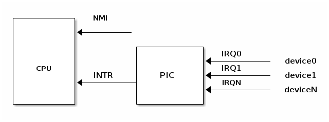

支持中断的设备具有用于发出**中断请求**（Interrupt ReQuest，IRQ）的**输出引脚**。IRQ 引脚连接到名为**可编程中断控制器**（Programmable Interrupt Controller，PIC）的设备上，而 PIC 则连接到 CPU 的 INTR 引脚。

PIC 通常配备了一组端口，用于与 CPU 进行信息交换。当某一个连接到 PIC 的 IRQ 引脚所属的设备需要引起 CPU 的注意时，会启动以下流程：

> * 设备在相应的 IRQn 引脚上触发中断
> * PIC 将 IRQ 转换为向量号（一种位掩码），并将其写入 CPU 读取的端口
> * PIC 在 CPU INTR 引脚上触发中断
> * PIC 在触发另一个中断之前应**等待** CPU 确认此中断
> * CPU 确认中断后，开始处理中断

:::important

按设计，PIC在CPU确认当前中断之前不会触发另一个中断。

而CPU 在确认中断后，不管之前的中断是否处理完毕，中断控制器都能发出新的中断请求。因此，根据操作系统如何控制 CPU，可能会出现嵌套中断的情况。

:::

上述PIC属于传统的 PIC，由两片 **8259A** 风格的外部芯片以“级联”的方式连接在一起。每个芯片可处理多达 8 个不同的 IRQ。因为从 PIC 的 INT 输出线连接到主 PIC 的 IRQ2 引脚，所以可用 IRQ 线的个数达到 15 个，如图下所示。

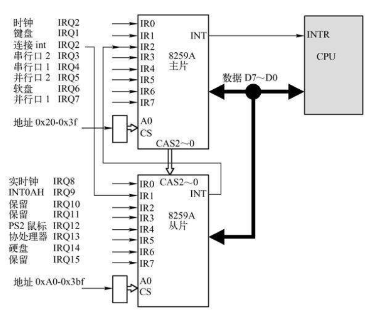

### 高级可编程中断控制器（APIC）

8259A 只适合单 CPU 的情况，为了充分挖掘 SMP 体系结构的并行性，能够把中断传递给系统中的每个 CPU 至关重要。基于此理由，Intel 引入了一种名为 **I/O 高级可编程控制器**的新组件，来替代老式的 8259A 可编程中断控制器。

该组件包含两大组成部分：

一是**本地 APIC**，主要负责传递中断信号到指定的处理器；举例来说，一台具有三个处理器的机器，则它必须相对的要有三个本地 APIC。

另外一个重要的部分是 **I/O APIC**，主要是收集来自 I/O 装置的 Interrupt 信号且在当那些装置需要中断时发送信号到本地 APIC，系统中最多可拥有 8 个 I/O APIC。

例如，在 x86 架构中，每个核心（core）都有一个本地 APIC 用于处理来自本地连接设备（如定时器或温度传感器）的中断。此外，还有一个 I/O APIC 用于将来自外部设备的中断请求分发给 CPU 核心。

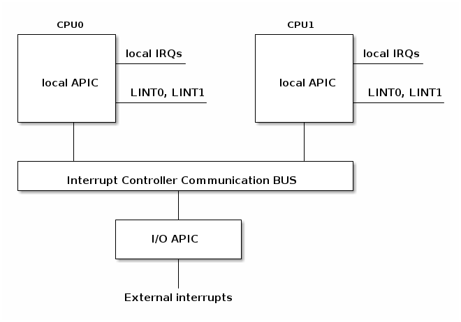

目前大部分单处理器系统都包含一个 I/O APIC 芯片，可以通过以下两种方式来对这种芯片进行配置：

* 作为一种标准的 8259A 工作方式。本地 APIC 被禁止，外部 I/O APIC 连接到 CPU，两条 LINT0 和 LINT1 分别连接到 INTR 和 NMI 引脚。
* 作为一种标准外部 I/O APIC。本地 APIC 被激活，且所有的外部中断都通过 I/O APIC 接收。

辨别一个系统是否正在使用 I/O APIC，可以在命令行输入 `cat /proc/interrupts`：

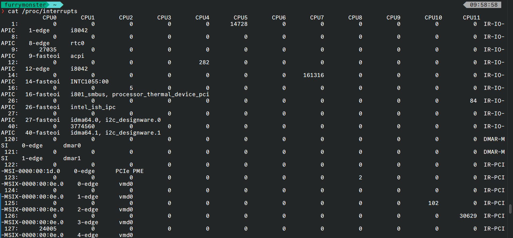

### 中断优先级（Optional）

大多数体系结构还支持中断优先级。启用中断优先级机制后，只有比当前优先级高的中断才允许嵌套当前中断。

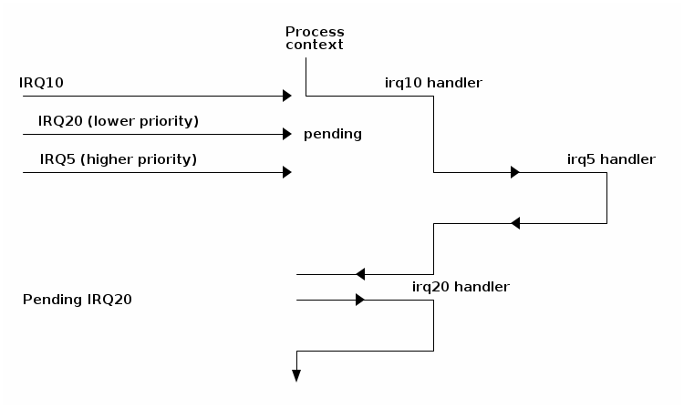

中断优先级并不是所有架构都支持的功能。对于通用的操作系统来说，要设计一个通用的中断优先级方案非常困难，所以一些内核（比如 Linux）就没有采用中断优先级。但是，大多数实时操作系统（RTOS）都使用了中断优先级，因为它们的应用场景更加有限，中断优先级的定义也更加简单。

本文不对中断优先级作考虑。

## x86 架构上的中断处理

### 中断描述符表

**中断描述符表**（IDT）将每个中断或异常标识符与处理相关事件的指令的描述符关联起来。我们将标识符称为向量号，并将相关指令称为中断/异常处理程序。

IDT 具有以下特点：

* 当触发给定向量时，CPU 将中断描述符表用作跳转表
* 它是由 256 个 8 字节条目组成的数组
* 可以位于物理内存中的任何位置
* 处理器通过 IDTR 来定位 IDT

下面是 Linux IRQ 向量布局。前 32 个条目保留用于异常，向量号 128 用于系统调用接口，其余大多用于硬件中断处理程序。

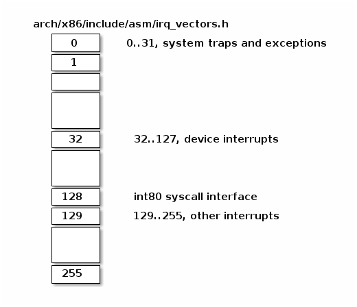

在 x86 架构中，每个 IDT 条目占据 8 个字节，被称为“**门**（gate）”。IDT 条目可以分为三种类型的门：

> * 中断门（Interrupt Gate）：保存中断或异常处理程序的地址。跳转到处理程序时，会禁用可屏蔽中断（IF 标志被清除）
> * 陷阱门（Trap Gate）：与中断门类似，但在跳转到中断/异常处理程序时不会禁用可屏蔽中断
> * 任务门（Task Gate）：Linux 中不使用

让我们看一下 IDT 条目的几个字段：

> * 段选择符（Segment Selector）：用于索引全局描述符表（GDT）或者本地描述符表（LDT），以找到中断处理程序所在的代码段的起始位置
> * 偏移量（Offset）：代码段内的偏移量
> * T：表示门的类型
> * DPL：使用段内容所需的最低特权级

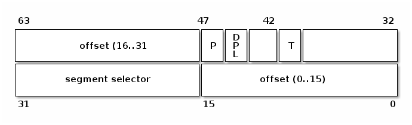

### 中断处理程序地址

要找到中断处理程序的地址，我们首先需要确定中断处理程序所在代码段的起始地址。我们可以通过使用段选择符来索引 **GDT/LDT**，以找到对应的段描述符。段描述符会提供存储在“base”字段中的起始地址。现在，**结合基地址和偏移量，我们就可以定位到中断处理程序的起始位置**。

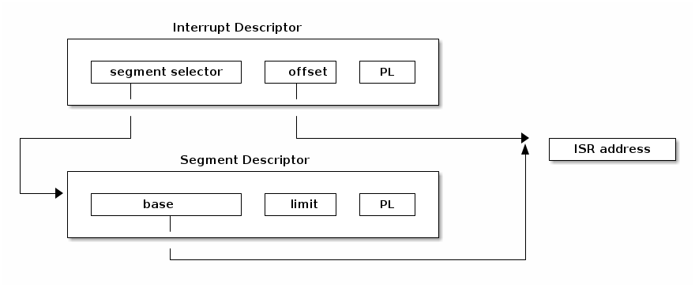

### 中断处理程序的栈

与控制转移到普通函数类似，控制转移到中断或异常处理程序也使用栈来存储返回到被中断代码所需的信息。

如下图所示，中断在保存被中断指令的地址之前，会将 **EFLAGS 寄存器**压入栈中。某些类型的异常还会在栈上压入产生错误的代码，以帮助调试异常。

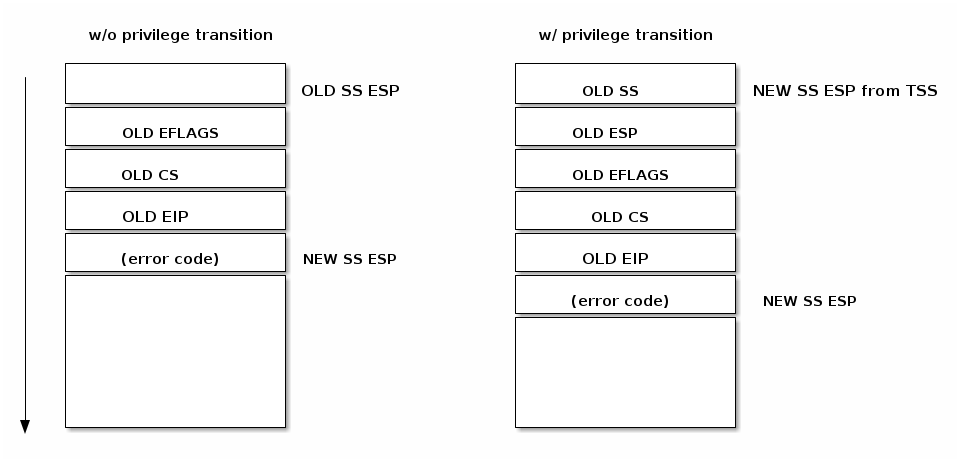

### 处理中断请求

在生成中断请求后，处理器会运行一系列事件，最终执行**内核中断处理程序**：

处理中断请求的步骤如下：

* CPU 检查当前特权级别
* 如果需要更改特权级别

  * 使用与新特权级别相关联的堆栈
  * 在新堆栈上保存旧堆栈信息
* 在堆栈上保存 EFLAGS，CS，EIP
* 在发生程序中止时，在堆栈上保存错误代码
* 执行内核中断处理程序

### 从中断处理程序返回

大多数体系架构都提供了特殊的指令，用来在执行中断处理程序后清理堆栈并恢复被中断程序执行。在 x86 架构中，使用 **IRET 指令**从中断处理程序返回。IRET 类似于 RET 指令，但 IRET 会将 ESP 增加额外的四个字节（因为堆栈上有标志位），并将保存的标志位移动到 **EFLAGS** 寄存器。

在中断处理程序执行后恢复执行的过程如下（x86 架构）：

* 弹出错误代码（如果发生中止）
* 调用 IRET 指令
  * 从堆栈弹出值并恢复以下寄存器的值：CS，EIP，EFLAGS
  * 如果特权级别发生了更改，则返回到旧堆栈和旧特权级别

## Linux 上的中断

现在，到了最重要的部分！

但是在此之前，先让我们来看看一些Misc知识。

### Linux 中断阶段

在 Linux 中，中断处理分为三个阶段：**关键阶段、立即阶段和延迟阶段**。

在第一阶段，内核将运行通用中断处理程序，确定中断号、处理该特定中断的中断处理程序以及中断控制器。此时还会执行任何时间紧迫的关键操作（例如，在中断控制器级别上确认中断）。在该阶段，本地处理器中断被禁用，并在下一个阶段继续禁用。

在第二阶段，将执行与该中断相关联的所有设备驱动程序处理程序。在该阶段结束时，将调用中断控制器的“中断结束”方法，以允许中断控制器重新断开此中断。此时，对本地处理器中断的禁用将解除。

:::tip

一个中断可能与多个设备相关联，在这种情况下，该中断被称为共享中断。通常，在使用共享中断时，由设备驱动程序负责确定中断是否针对其设备。

:::

在中断处理的最后阶段，将运行中断上下文可延迟操作。我们有时也将其称为中断的“下半部分”（上半部分是在禁用中断的情况下运行的中断处理部分）。此时，可以进行本地处理器上的中断。

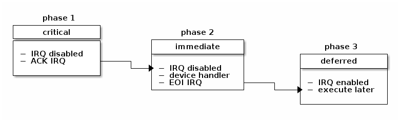

### 硬中断

#### 处理流程

中断随时可能发生，发生之后必须马上得到处理。收到中断事件后的处理流程：

1. **抢占当前任务** ：内核必须暂停正在执行的进程；
2. **执行中断处理函数** （ISR）：找到对应的中断处理函数，将 CPU 交给它（执行）；
   ISR 位于 Interrupt Vector table，这个 table 位于内存中的固定地址。
3. **中断处理完成之后** ：第 1 步被抢占的进程恢复执行。在中断处理完成之后，处理器恢复执行被中断的进程（resume the interrupted process）。

#### 中断类型

在内核中，发生异常（exception）之后一般是给被中断的进程发送一个 Unix 信号，以此来唤醒它，这也是为什么内核能如此迅速地处理异常的原因。

但对于外部硬件中断，这种方式是不行的，**外部中断处理取决于中断的类型**：

1. I/O interrupts（ **IO 中断** ）;
   例如 PCI 总线架构，多个设备共享相同的 IRQ line。必须处理非常快。内核典型处理过程：
   1. 将 IRQ 值和寄存器状态保存到内核栈上（kernel stack）；
   2. 给负责这个 IRQ line 的硬件控制器发送一个确认通知；
   3. 执行与这个设备相关的中断服务例程（ISR）；
   4. 恢复寄存器状态，从中断中返回。
2. Timer interrupts（ **定时器中断** ）;
3. Interprocessor interrupts（IPI， **进程间中断** ）

我们可以输入 `sudo dmesg | grep NR_IRQS`来看看系统支持的 **最大硬中断数量** （与内核编译参数 `CONFIG_X86_IO_APIC` 有关）：

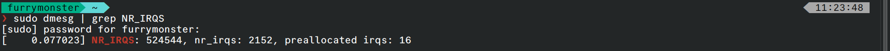

其中有 16 个是预分配的 IRQs。

#### MSI（Message Signaled Interrupts）/ MSI-X

除了预分配中断， 还有另一种称为 [Message Signaled Interrupts](https://en.wikipedia.org/wiki/Message_Signaled_Interrupts) 的中断，位于 **PCI 系统**中。

相比于分配一个固定的中断号，它允许设备在特定的内存地址（particular address of RAM, in fact, the display on the Local APIC）记录消息（message）。

* MSI 支持每个设备能分配 1, 2, 4, 8, 16 or 32 个中断，
* MSI-X 支持每个设备分配多达 2048 个中断。

内核函数 **`request_irq()`** 注册一个中断处理函数，并启用给定的中断线（enables a given interrupt line）。

#### 可关闭和不可关闭中断

Maskable interrupts 在 x64_64 上可以用 **`sti/cli`** 两个指令来屏蔽（关闭）和恢复：

```c
static inline void native_irq_disable(void) {
        asm volatile("cli": : :"memory"); // 清除 IF 标志位
}
```

```c
static inline void native_irq_enable(void) {
        asm volatile("sti": : :"memory"); // 设置 IF 标志位
}
```

在屏蔽期间，Maskable的中断不会再触发新的中断事件。  **大部分 IRQ 都属于这种类型，例如网卡的收发包硬件中断。**

**Non-maskable interrupts** 不可屏蔽，所以在效果上属于 **更紧急的类型** 。

### 软中断

#### 软中断子系统

软中断是一个内核子系统。

每个 CPU 上会初始化一个 `ksoftirqd` 内核线程，负责处理各种类型的 softirq 中断事件；
用 cgroup ls 或者 `ps -ef` 都能看到。

软中断事件的 handler 提前注册到 softirq 子系统， 注册方式是  **`open_softirq(softirq_id, handler)`** 。
例如，注册网卡收发包（RX/TX）软中断处理函数：

```c
 // net/core/dev.c

 open_softirq(NET_TX_SOFTIRQ, net_tx_action);
 open_softirq(NET_RX_SOFTIRQ, net_rx_action);
```

#### 处理

[kernel/smpboot.c](https://github.com/torvalds/linux/blob/v5.10/kernel/smpboot.c) 类似于一个 **事件驱动的循环** ，里面会调度到 `ksoftirqd` 线程，执行 pending 的软中断。`ksoftirqd` 里面会进一步调用到 `__do_softirq`。

软中断方式的潜在影响在于，推迟执行部分（比如 softirq）可能会占用较长的时间，在这个时间段内， 用户空间线程只能等待。

反映在 `top` 里面，就是 `si` 占比。

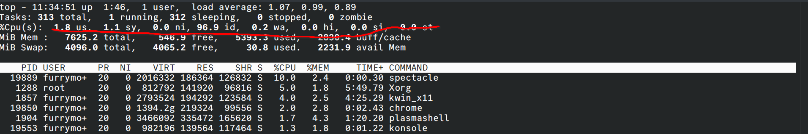

不过 softirq 调度循环对此也有改进，通过 budget 机制来避免 softirq 占用过久的 CPU 时间。

```c
    unsigned long end = jiffies + MAX_SOFTIRQ_TIME;
    ...
    restart:
    while ((softirq_bit = ffs(pending))) {
        ...
        h->action(h);   // 这里面其实也有机制，避免 softirq 占用太多 CPU
        ...
    }
    ...
    pending = local_softirq_pending();
    if (pending) {
        if (time_before(jiffies, end) && !need_resched() && --max_restart) // 避免 softirq 占用太多 CPU
            goto restart;
    }
    ...
```

#### 从硬中断到软中断

softirq 是一种推迟中断处理机制，将 IRQ 的大部分处理逻辑推迟到了这里执行。 **两条路径**都会执行到 softirq 主处理逻辑 `__do_softirq()`，

1. CPU 调度到 `ksoftirqd` 线程时，会执行到 `__do_softirq()`；
2. 每次硬中断（IRQ）handler 退出时： `do_IRQ() -> ...`。
   `do_IRQ()` 是内核中最主要的 IRQ 处理方式。它执行结束时，会调用 `exiting_irq()`，这会展开成 `irq_exit()`。后者会检查是否有 pending 的 softirq，有的话就唤醒：

   ```c
    // arch/x86/kernel/irq.c

    if (!in_interrupt() && local_softirq_pending())
        invoke_softirq();
   ```

   进而会使 CPU 执行到 `__do_softirq()`。

#### 软中断触发步骤

每个软中断会经过下面几个阶段：

1. 通过 `open_softirq()` 注册软中断处理函数；
2. 通过 **`raise_softirq()`** 将一个软中断  标记为 deferred interrupt ，这会 **唤醒该软中断（但还没有开始处理）**；
3. 内核调度器**调度到 `ksoftirqd` 内核线程**时，会将所有等待处理的 deferred interrupt （也就是 softirq）拿出来，执行对应的处理方法（softirq handler）；

以收包软中断为例，

* **IRQ handler 并不执行 NAPI，只是触发它** ，在里面会执行到 `raise NET_RX_SOFTIRQ`；
* 真正的执行在 softirq，里面会调用网卡的 poll() 方法收包；
* IRQ handler 中会调用 napi_schedule()，然后启动 NAPI poll()。

这里需要注意，虽然 IRQ handler 做的事情非常少，但是接下来  **处理这个包的 softirq 和 IRQ 在同一个 CPU 运行** 。 这就是说，如果大量的包都放到了同一个 RX queue，那虽然 IRQ 的开销可能并不多， 但这个 CPU 仍然会非常繁忙，都花在 softirq 上了。 解决方式：RPS。它并不会降低延迟，只是将包重新分发： RXQ -> CPU。

### 嵌套中断和异常

Linux 曾经支持嵌套中断，但由于解决堆栈溢出问题的方案变得越来越复杂（例如，允许一级嵌套、允许多级嵌套，级数由内核堆栈深度决定等），这一功能在一段时间前被取消了。

然而，在异常和中断之间仍然可以实现嵌套，但规则相当严格：

* 异常（如页错误、系统调用）不能抢占中断；如果发生这种情况，则被视为漏洞（bug）
* 中断可以抢占异常
* 中断不能抢占另一个中断（以前是可能的）

以下图表展示了嵌套的可能情景：

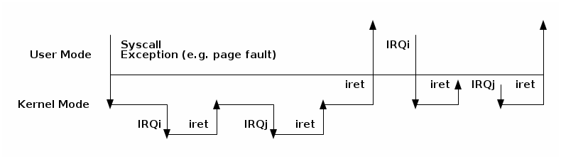

### 中断延迟机制

前面提到，Linux 中的三种推迟中断执行的方式：

* softirq
* tasklet
* workqueue

其中，

1. softirq 和 tasklet 依赖软中断子系统， **=运行在软中断上下文中=** ；
2. workqueue 不依赖软中断子系统， **=运行在内核进程上下文中=** 。

#### `softirq`：静态机制，内核编译时确定

前面已经看到， Linux 在每个 CPU 上会创建一个 ksoftirqd 内核线程。

 **softirqs 是在 Linux 内核编译时就确定好的**，例如网络收包对应的 `NET_RX_SOFTIRQ` 软中断。 因此是一种 **静态机制** 。如果想加一种新 softirq 类型，就需要修改并重新编译内核。

在内部是用一个数组（或称向量）来管理的，每个软中断号对应一个 softirq handler。 数组和注册：

```c
// kernel/softirq.c

// NR_SOFTIRQS 是 enum softirq type 的最大值，在 5.10 中是 10，见下面
static struct softirq_action softirq_vec[NR_SOFTIRQS] __cacheline_aligned_in_smp;

void open_softirq(int nr, void (*action)(struct softirq_action *)) {
    softirq_vec[nr].action = action;
}
```

部分类型的 softirq：

```c
// include/linux/interrupt.h

enum {
    HI_SOFTIRQ=0,          // tasklet
    TIMER_SOFTIRQ,         // timer
    NET_TX_SOFTIRQ,        // networking
    NET_RX_SOFTIRQ,        // networking
    BLOCK_SOFTIRQ,         // IO
    IRQ_POLL_SOFTIRQ,
    TASKLET_SOFTIRQ,       // tasklet
    SCHED_SOFTIRQ,         // schedule
    HRTIMER_SOFTIRQ,       // timer
    RCU_SOFTIRQ,           // lock
    NR_SOFTIRQS
};
```

也就是在 **`cat /proc/softirqs`** 看到的那些，

```shell
$ cat /proc/softirqs
                  CPU0     CPU1  ...    CPU46    CPU47
          HI:        2        0  ...        0        1
       TIMER:   443727   467971  ...   313696   270110
      NET_TX:    57919    65998  ...    42287    54840
      NET_RX:    28728  5262341  ...    81106    55244
       BLOCK:      261     1564  ...   268986   463918
    IRQ_POLL:        0        0  ...        0        0
     TASKLET:       98      207  ...      129      122
       SCHED:  1854427  1124268  ...  5154804  5332269
     HRTIMER:    12224    68926  ...    25497    24272
         RCU:  1469356   972856  ...  5961737  5917455
```

触发（唤醒）softirq 的部分如下：

```c
void raise_softirq(unsigned int nr) {
        local_irq_save(flags);    // 关闭 IRQ
        raise_softirq_irqoff(nr); // 唤醒 ksoftirqd 线程（但执行不在这里，在 ksoftirqd 线程中）
        local_irq_restore(flags); // 打开 IRQ
}
```

```c
if (!in_interrupt())
    wakeup_softirqd();

static void wakeup_softirqd(void) {
    struct task_struct *tsk = __this_cpu_read(ksoftirqd);

    if (tsk && tsk->state != TASK_RUNNING)
        wake_up_process(tsk);
}
```

以收包软中断为例， IRQ handler 并不执行 NAPI，只是触发它，在里面会执行到 raise NET_RX_SOFTIRQ；真正的执行在 softirq，里面会调用网卡的 poll() 方法收包。 IRQ handler 中会调用 napi_schedule()，然后启动 NAPI poll()。

#### `tasklet`：动态机制，基于 `softirq`

如果对内核源码有一定了解就会发现， **softirq 用到的地方非常少** ，原因之一就是上面提到的，它是静态编译的， 靠内置的 ksoftirqd 线程来调度内置的那 9 种 softirq。如果想新加一种，就得修改并重新编译内核， 所以开发成本非常高。

实际上，实现推迟执行的 **更常用方式 tasklet** 。它 构建在 softirq 机制之上 ， 具体来说就是使用了上面提到的两种 softirq：

* **`HI_SOFTIRQ`**
* **`TASKLET_SOFTIRQ`**

换句话说，tasklet 是可以 **在运行时（runtime）创建和初始化的 softirq** ，

```c
void __init softirq_init(void) {
    for_each_possible_cpu(cpu) {
        per_cpu(tasklet_vec, cpu).tail    = &per_cpu(tasklet_vec, cpu).head;
        per_cpu(tasklet_hi_vec, cpu).tail = &per_cpu(tasklet_hi_vec, cpu).head;
    }

    open_softirq(TASKLET_SOFTIRQ, tasklet_action);
    open_softirq(HI_SOFTIRQ, tasklet_hi_action);
}
```

内核软中断子系统初始化了两个 per-cpu 变量：

* tasklet_vec： **普通 tasklet** ，回调 tasklet_action()
* tasklet_hi_vec： **高优先级 tasklet**，回调 tasklet_hi_action()

```c
struct tasklet_struct {
        struct tasklet_struct *next;
        unsigned long state;
        atomic_t count;
        void (*func)(unsigned long);
        unsigned long data;
};
```

tasklet 再执行针对 list 的循环：

```c
static void tasklet_action(struct softirq_action *a)
{
    local_irq_disable();
    list = __this_cpu_read(tasklet_vec.head);
    __this_cpu_write(tasklet_vec.head, NULL);
    __this_cpu_write(tasklet_vec.tail, this_cpu_ptr(&tasklet_vec.head));
    local_irq_enable();

    while (list) {
        if (tasklet_trylock(t)) {
            t->func(t->data);
            tasklet_unlock(t);
        }
        ...
    }
}
```

tasklet 在内核中的使用非常广泛。 不过，后面又出现了第三种方式：workqueue。

#### `workqueue`：动态机制，运行在内核进程上下文

这也是一种推迟执行机制，与 tasklet 有点类似，但也有很大不同。

* tasklet 是运行在 softirq 上下文中；
* workqueue 运行在内核 **进程上下文中** ； 这意味着 wq 不能像 tasklet 那样是原子的；
* tasklet  **永远运行在指定 CPU** ，这是初始化时就确定了的；
* workqueue 默认行为也是这样，但是可以通过配置修改这种行为。

这种机制的使用场景如下：

```plaintext
// Documentation/core-api/workqueue.rst：

There are many cases where an asynchronous process execution context
is needed and the workqueue (wq) API is the most commonly used
mechanism for such cases.

When such an asynchronous execution context is needed, a work item
describing which function to execute is put on a queue.  An
independent thread serves as the asynchronous execution context.  The
queue is called workqueue and the thread is called worker.

While there are work items on the workqueue the worker executes the
functions associated with the work items one after the other.  When
there is no work item left on the workqueue the worker becomes idle.
When a new work item gets queued, the worker begins executing again.
```

简单来说，workqueue 子系统提供了一个接口，通过这个接口可以 **创建内核线程来处理从其他地方 enqueue 过来的任务** 。 这些内核线程就称为 worker threads， 内置的 per-cpu worker threads ：

```shell
$ systemd-cgls -k | grep kworker
├─    5 [kworker/0:0H]
├─   15 [kworker/1:0H]
├─   20 [kworker/2:0H]
├─   25 [kworker/3:0H]
```

对应的结构体如下：

```c
// include/linux/workqueue.h

struct worker_pool {
    spinlock_t              lock;
    int                     cpu;
    int                     node;
    int                     id;
    unsigned int            flags;

    struct list_head        worklist;
    int                     nr_workers;
    ...

struct work_struct {
    atomic_long_t data;
    struct list_head entry;
    work_func_t func;
    struct lockdep_map lockdep_map;
};
```

**kworker 线程调度 workqueues，原理与 ksoftirqd 线程调度 softirqs 一样** 。 但可以为 workqueue 创建新的线程，而 softirq 则不行。

## 后记

写到这里，逻辑已经有些混乱了。可见内核源码的每一个部分，都是一门学问。

后面大概会重新汇总一下代码，开一篇新的博客了。
