## 大道至简的mmap函数

分配内存，其实就是分配一个从虚拟内存到物理内存的map映射：

```c
#include <unistd.h>
#include <sys/mman.h>
void  *mmap(void *start, size_t length, int prot, int flags,
            int fd, off_t offset);
// Returns: pointer to mapped area if OK, MAP_FAILED (−1) on error
```

`mmap`函数请求内核创建一个起始地址为参数 `start`的虚拟内存区域，该区域映射到文件描述符 `fd`所指定的对象。连续对象的长度为参数 `length`，其首部在文件中的偏移量为参数 `offset`：

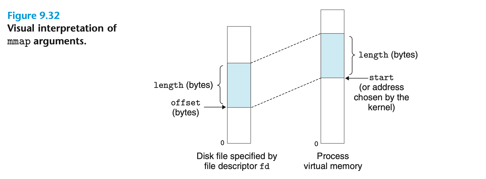

参数 `prot`中包含了描述虚拟内存区域访问权限的位，即 `vm_area_structs`中的 `vm_prot`：

* `PROT_EXEC`：该区域中的页面包含可执行指令；
* `PROT_READ`：可以阅读该区域中的页面；
* `PROT_WRITE`：可以写入该区域中的页面；
* `PROT_NONE`：无法访问该区域中的页面。

参数 `flag`中包含了描述了映射对象类型的位：

* `MAP_SHARED`：共享对象；
* `MAP_PRIVATE`：私有写时复制对象；
* `MAP_ANON`：匿名对象，对应的虚拟页面是零需求页面。

`munmap`函数删除起始于虚拟地址 `start`、长度为 `length`的区域，后续对已删除区域的引用会引发分段故障。

```c
#include <unistd.h>
#include <sys/mman.h>
int munmap(void *start, size_t length);
// Returns: 0 if OK, −1 on error
```

## 动态内存分配

相比于低级别的 `mmap`函数，C 程序员更倾向于在运行时调用动态内存分配器（Dynamic Memory Allocator）来创建虚拟内存区域。动态内存分配器为进程维护的虚拟内存区域被称为堆（Heap），其一般结构为：

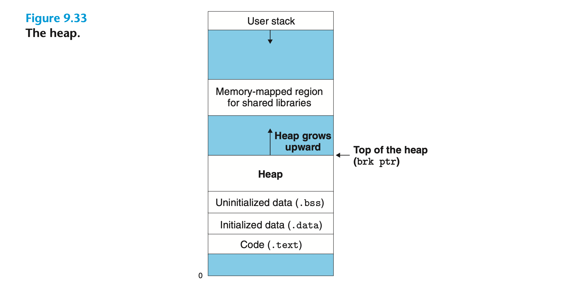

堆向上增长，内核为每个进程都维护了一个指向堆顶的变量 `brk`。分配器将堆看作一个包含不同尺寸 Block 的集合，每个 Block 都是一个连续的虚拟内存块。Block 有两种状态，已分配（Allocated）和空闲（Free）。所有分配器均显式地为应用程序分配 Block，但负责释放已分配 Block 的实体可能有所不同：

* 显式分配器：应用程序显式地释放已分配的 Block。C 和 C++ 程序分别调用 `malloc`和 `new`函数请求 Block，调用 `free`和 `delete`函数释放 Block；
* 隐式分配器：分配器自行释放程序不再使用的已分配 Block，该过程被称为**垃圾回收**（Garbage Collection）。Lisp、ML 和 C# 等高级语言均采用这种方法。

### malloc和free函数

```c
#include <stdlib.h>
void *malloc(size_t size);
// Returns: pointer to allocated block if OK, NULL on error
```

`malloc`函数请求堆中的一块 Block 并返回指向该 Block 的指针。Block 的大小至少为参数 `size`，并可能根据其保存的数据对象类型进行适当对齐。在 32 位编译模式下，Block 的地址始终为 8 的倍数，而在 64 位中则为 16 的倍数。如果执行 `malloc`遇到问题，如程序请求的 Block 大小超过了可用的虚拟内存，则函数返回 `NULL`并设置 [`errno`](https://man7.org/linux/man-pages/man3/errno.3.html)。我们还可以使用 `malloc`的包装函数 `calloc`，它会将分配的内存初始化为零。类似地，`realloc`函数可以更改已分配 Block 的大小。

```c
#include <unistd.h>
void *sbrk(intptr_t incr);
// Returns: old brk pointer on success, −1 on error
```

`sbrk`函数将参数 `incr`与内核中的 `brk`指针相加以增大或缩小堆。若执行成功，则返回 `brk`的旧值，否则将返回 -1 并将 `errno`设置为 `ENOMEM`。

```c
#include <stdlib.h>
void free(void *ptr);
// Returns: nothing
```

`free`函数将参数 `ptr`指向的 Block 释放，而这些 Block 必须是由 `malloc`、`calloc`或 `realloc`分配的。该函数没有返回值，因此很容易产生一些令人费解的运行时错误。

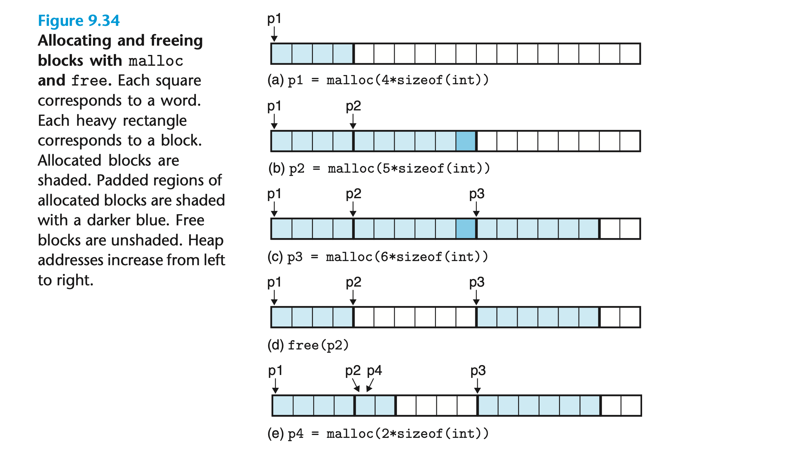

上图展示了 C 程序如何使用 `malloc`和 `free`管理一个大小为 16 字（字长为 4 字节）的堆。图中的每个方框代表一个字，每个被粗线分隔的矩形代表一个 Block。有阴影的 Block 代表已分配，无阴影的 Block 则代表空闲。

如上图 (a) 所示，程序请求一个 4 字的 Block，`malloc`从空闲块中切出一个 4 字的 Block 并返回指向该 Block 中第一个字的指针 `p1`；如上图 (b) 所示，程序请求一个 5 字的 Block，`malloc`从空闲块中切出一个 6 字的 Block 以实现双字对齐；如上图 (c) 所示，程序请求一个 6 字的 Block，`malloc`从空闲块中切出一个 6 字的 Block；如上图 (d) 所示，程序释放图 (b) 中分配的 Block。`free`返回后，指针 `p2`依然指向已释放的 Block，因此程序不应在重新初始化 `p2`前继续使用它；如上图 (e) 所示，程序请求一个 2 字的 Block。`malloc`从上一步释放的 Block 中切出一部分并返回指向新 Block 的指针 `p4`。

## 分配器

### 为什么需要分配器

程序实际运行之前，我们可能并不知道某些数据结构的大小。示例 C 程序将 `n`个 ASCII 整型从标准输入读取到数组 `array[MAXN]`中：

```c
#include "csapp.h"
#define MAXN 15213

int array[MAXN];

int main()
{
    int i, n;
    scanf("%d", &n);
    if (n > MAXN)
        app_error("Input file too big");
    for (i = 0; i < n; i++)
        scanf("%d", &array[i]);
    exit(0);
}
```

由于我们无法预测 `n`的值，因此只能将数组大小写死为 `MAXN`。`MAXN`的值是任意的，可能超出系统可用的虚拟内存量。另外，一旦程序想要读取一个比 `MAXN`还大的文件，唯一的办法就是增大 `MAXN`的值并重新编译程序。如果我们在运行时根据 `n`的大小动态分配内存，以上问题便迎刃而解：

```c
#include "csapp.h"

int main()
{
    int *array, i, n;
    scanf("%d", &n);
    array = (int *)Malloc(n * sizeof(int));
    for (i = 0; i < n; i++)
        scanf("%d", &array[i]);
    free(array);
    exit(0);
}
```

### 分配器的要求和目标

对于一个显式分配器，其必须在若干限制条件下运行：

* 处理任意顺序的请求：分配器不能对 `malloc`和 `free`的请求顺序作出假设。例如，分配器不能假设所有的 `malloc`都紧跟一个与之匹配的 `free`；
* 立即响应请求：分配器不可以对请求重新排序或缓冲（Buffer）以提高性能；
* 仅使用堆：分配器使用的数据结构必须存储在堆中；
* 对齐 Block：分配器必须对齐 Block 以使其能够容纳任何类型的数据对象；
* 不修改已分配的 Block：分配器无法修改、移动或压缩已分配的 Block。

衡量分配器性能的指标有：

* 吞吐量（Throughput）：单位时间内完成的请求数；
* 内存利用率（Memory Utilization）：即堆内存的使用率。

最大化吞吐量和最大化内存利用率之间存在矛盾，因此我们在设计分配器时需要找到二者的平衡。

## 分配器面临的难点

### 内存碎片

我们将空闲堆内存无法满足分配请求的现象称为碎片（Fragmentation），它是内存利用率低的主要原因。碎片有两种形式：

* 内部碎片（Internal Fragmentation）：已分配的 Block 比进程请求的 Block（即 Payload）大，通常因分配器为满足对齐要求而产生；
* 外部碎片（External Fragmentation）：空闲内存充足但却没有空闲的 Block 能够满足分配请求。例如堆中有 4 个空闲的字且分布在两个不相邻的 Block 上，此时若进程申请一个 4 字的 Block 就会出现外部碎片。

内部碎片很容易量化，因为它只是已分配 Block 与 Payload 之间大小差异的总和，其数量仅取决于先前的请求模式和分配器的实现方式；外部碎片则难以量化，因为它还要受到未来请求模式的影响。为了减少外部碎片的产生，分配器力求维护少量较大的空闲 Block 而非大量较小的空闲 Block。

### 实现难点

我们可以想象一个简单的分配器，它将堆看作一个大型的字节数组，指针 `p`指向该数组的第一个字节。当进程请求 `size`大小的 Block 时，`malloc`先把 `p`的当前值保存在栈中，然后将其加上 `size`，最后返回 `p`的旧值。当进程想要释放 Block 时，`free`则只是简单地返回给调用者而不做任何事情。

由于 `malloc`和 `free`仅由少量指令组成，这种分配器的吞吐量很大。然而 `malloc`不会重用任何 Block，因此堆内存的利用率非常低。能够在吞吐量和内存利用率之间取得良好平衡的分配器必须考虑以下问题：

* 组织（Organization）：如何跟踪空闲的 Block？
* 放置（Placement）：如何从空闲的 Block 中选择合适的来放置新分配的 Block？
* 分割（Splitting）：完成放置后，如何处理剩余的空闲 Block？
* 合并（Coalescing）：如何处理刚刚被释放的 Block？

## 设计一个内存分配器

### 隐式空闲链表

大多数分配器通过将一些数据结构嵌入到 Block 中以分辨其边界和状态，例如：

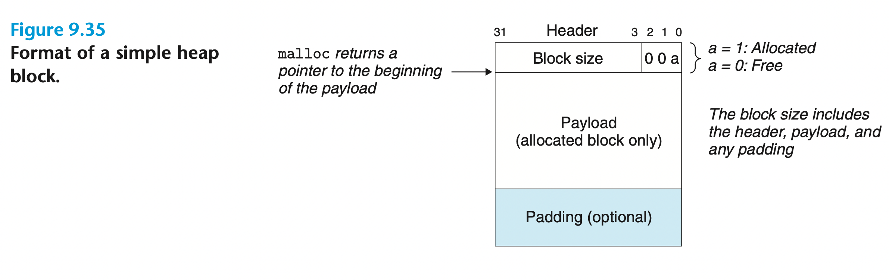

如上图所示，**Block** 由一个单字（四字节）的**头部**（Header）、**有效负载**（Payload）和一些**额外填充**（Padding）组成，头部中包含了 Block 的大小（Block Size）和状态信息（Allocated or Free）。如果系统采用双字对齐策略，那么每个 Block 的大小始终为 8 的倍数，其二进制表达的后 3 位始终为 0。因此我们可以仅在头部中存储该字段的前 29 位，剩余 3 位用来存储其他信息。上图中的位“a”便指示了此 Block 是已分配的还是空闲的。填充的大小是任意的，它可能是分配器为了避免外部碎片产生而设置的，也可能是为了满足对齐要求而存在的。

基于这种 Block 格式，我们可以将堆组织成一系列连续的**已分配** Block 和**空闲** Block：

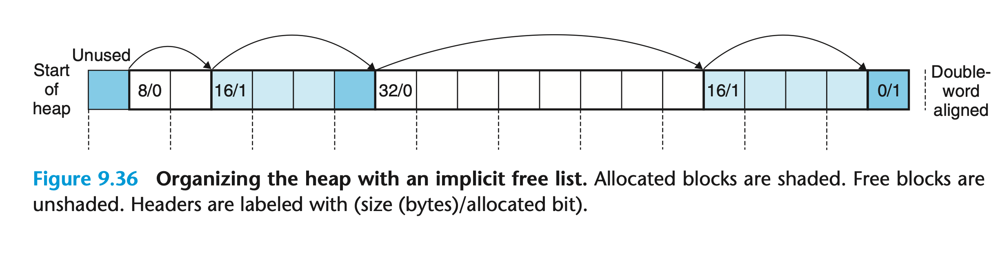

Block 通过其头部中的大小字段隐式地链接起来（addr(next_block) = addr(current_block) + block_size），因此我们将这种堆组织方式称为隐式空闲链表（Implicit Free List），分配器必须遍历堆中所有的 Block 才能得到全部空闲的 Block。我们还需要一个特殊的 Block 以标记堆的结尾，如上图中的 “0/1”。隐式空闲链表的优点是简单，但任何搜索空闲 Block 的操作（如放置新分配的 Block）的成本都与堆中 Block 的总数成正比。

### 放置新分配的 Block

当应用程序请求一个 Block 时，分配器需要在空闲链表中选取一个足够大的 Block 以响应。分配器搜索空闲 Block 的方式由放置策略（Placement Policy）所决定：

* 第一次拟合（First Fit）：从头开始遍历空闲链表并选择第一个满足条件的 Block；
* 下一次拟合（Next Fit）：从上一次搜索停止的地方开始遍历空闲链表并选择第一个满足条件的 Block；
* 最佳拟合（Best Fit）：遍历所有 Block 并选择满足条件且最小的 Block。

第一次拟合的优点是较大的 Block 通常存留在链表末尾，但一些较小的 Block 也会散落在链表开头，这将增加搜索较大 Block 的时间。如果链表开头存在大量较小的 Block，下一次拟合就比第一次拟合快很多。然而研究表明，下一次拟合的内存利用率比第一次拟合低。最佳拟合的内存利用率通常比其他两种策略高，但对隐式空闲链表来说，其搜索时间显然要比它们慢很多。

### 分割空闲 Block

如果分配器找到了合适的 Block 并将整个 Block 分配给程序，就有可能产生内部碎片。为了避免这一问题，分配器可以将选取的 Block 分成一个已分配的 Block 和一个新的空闲 Block：

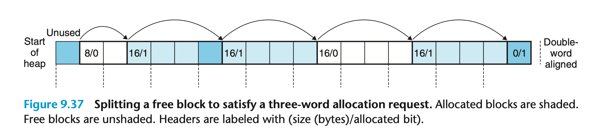

图 9.37 所示，程序请求一个 3 字的 Block，于是分配器将图 9.36 中 8 字的空闲 Block 拆分为两个 4 字的 Block 并将其中之一分配给它。

### 获取额外的堆

如果分配器无法找到合适的 Block，它可以尝试将相邻的空闲 Block 合并以获取更大的 Block。但如果仍然无法满足请求，分配器便会调用 `sbrk`函数向内核请求额外的堆内存并将其转换为一个新的空闲 Block。

#### 合并空闲Block

来看看合并，分配器释放 Block 后，可能会有其他空闲的 Block 与之相邻。此时内存中将产生一种特殊的外部碎片现象，我们称其为虚假碎片（False Fagmentation）。

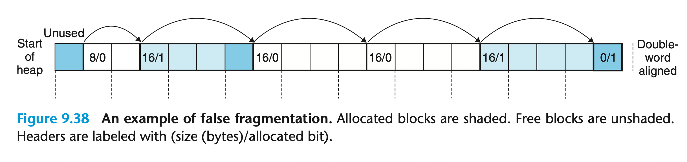

如图 9.38 所示，分配器将图 9.37 中第二个 4 字 Block 释放。尽管两个连续空闲 Block 中均有 3 字的有效负载，它们也无法满足一个 4 字的分配请求。因此，分配器必须将相邻空闲的 Block 合并。

分配器可以在每次释放 Block 后立即合并 Block，也可以等到某个时刻，比如分配请求失败时才合并堆中所有空闲的 Block。立即合并很简单，但它也有可能造成“颠簸”，即某个 Block 在短时间内被多次合并和分割。

#### 使用边界标记的合并

我们把即将释放的 Block 称为当前（Current）Block，其头部指向下一个 Block 的头部（addr(next_block) = addr(current_block) + block_size）。因此我们很容易判断下一个 Block 是否空闲，并且只需将当前 Block 头部中的大小字段与之相加即可完成合并。

但若要合并上一个 Block，我们只能遍历整个链表，并在到达当前 Block 前不断记下上一个 Block 的位置。因此对于隐式空闲链表，合并上一个 Block 的时间与堆内存的大小成正比。

我们可以在每个 Block 末尾都添加一个头部的副本以使合并 Block 的时间变为常数，这种技术被称为边界标记（Boundary Tags）：

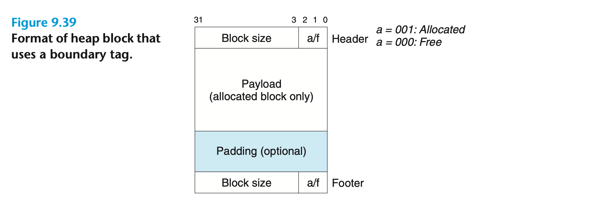

上一个 Block 的尾部始终与当前 Block 的头部相距一个字长，因此分配器可以通过检查上一个 Block 的尾部来确定其位置和状态。下图展示了分配器是如何使用边界标记合并 Block 的：

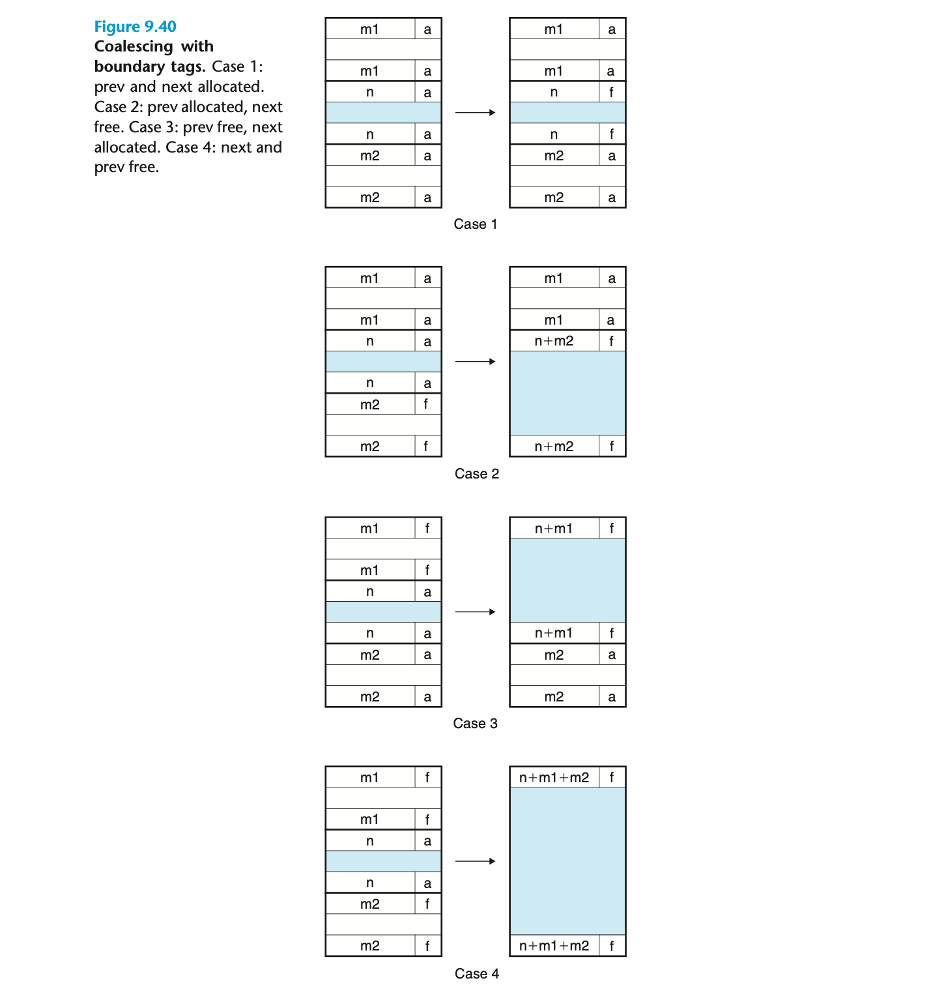

由于每个 Block 都包含头部和尾部，当 Block 数量较多时，边界标记显著地增加了内存的开销。考虑到分配器只有在上一个 Block 空闲时才需要获取其尾部内的 Block 大小，因此我们可以将上一个 Block 的状态存储在当前 Block 头部的多余低位中，这样已分配的 Block 便不需要尾部了。

### 显式空闲链表

由于分配 Block 的时间与 Block 的总数成正比，隐式空闲链表不适用于通用分配器。我们可以在每个空闲 Block 中加入一个指向上一个空闲 Block 的前驱（Predecessor）指针和一个指向下一个空闲 Block 的后继（Successor）指针，这样堆的组织结构就变成了一个双向链表，我们称其为显式空闲链表（Explicit Free List）。

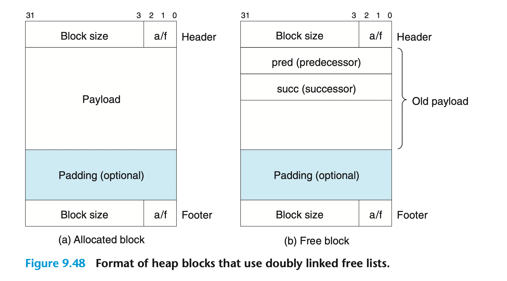

如果采用第一次拟合策略，显式空闲链表分配 Block 的时间与空闲 Block 的数量成正比，而释放 Block 的时间则取决于空闲 Block 的排序方式：

* 后进先出（Last-in First-out，LIFO）：将刚被释放的 Block 插入到链表开头，因此释放 Block 的时间为常数，并且可以通过边界标记使合并 Block 的时间也为常数；
* 按地址顺序（Address Order）：使链表中每个 Block 的地址均小于其后继 Block 的地址。在这种情况下，释放 Block 需要一定的时间来寻找合适的位置，但堆内存的利用率比后进先出高。

显式空闲链表的缺点在于指针的引入增加了空闲 Block 的大小，这将增大内部碎片发生的可能性。

### 分离式空闲链表

我们可以将堆组织成多个空闲链表，每个链表中 Block 的大小都大致相同，这种结构被称为分离式空闲链表（Segregated Free List）。为了实现这一结构，我们需要把 Block 的大小划分为多个大小类（Size Class），如：

**{**1**}**,**{**2**}**,**{**3**,**4**}**,**{**5–8**}**,**…**,**{**1025–2048**}**,**{**2049–4096**}**,**{**4097–∞**}**

也可以让每个较小的 Block 独自成为一个大小类，较大的 Block 依然按 2 的幂划分：

**{**1**}**,**{**2**}**,**{**3**}**,**…**,**{**1024**}**,**{**1025–2048**}**,**{**2049–4096**}**,**{**4097–∞**}**

每个空闲链表都属于某个大小类，因此我们可以将堆看成一个按大小类递增的空闲链表数组。当进程请求一个 Block 时，分配器会根据其大小在适当的空闲链表中搜索。如果找不到满足要求的 Block，它便会继续搜索下一个链表。

不同的分离式空闲链表在定义大小类的方式、合并 Block 的时机以及是否允许分割 Block 等方面有所不同，其中最基本的两种类型为简单分离存储（Simple Segregated Storage）和分离拟合（Segregated Fits）。

在简单分离存储中，空闲链表内每个 Block 的大小均等于其所属大小类中最大的元素。如某个大小类为 {17-32}，则其对应的空闲链表中 Block 的大小都是 32。

当进程请求一个 Block 时，分配器选取满足请求的空闲链表并分配其中第一个 Block；当某个 Block 被释放后，分配器将其插入到合适的空闲链表前面。因此，简单分离存储分配和释放 Block 的时间均为常量。

使用分离式空闲链表的分配器只会在堆中某个特定部分搜索空闲 Block，因此其吞吐量较大；对分离式空闲链表使用第一次拟合的内存利用率与对整个堆使用最佳拟合的内存利用率近似，因此其内存利用率较高。大多数高性能的分配器均采用分离式空闲链表，如 C 标准库提供的 GNU `malloc`。

## 垃圾回收

垃圾回收器（Garbage Collector）是一种动态存储分配器，它会自动释放程序不再需要的 Block（垃圾）。

垃圾回收器将内存看作一个有向可达性图：

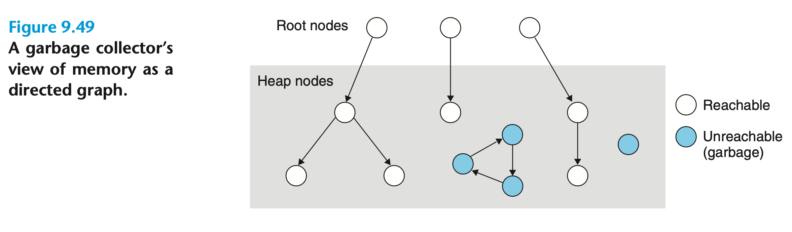

图中的节点被分为一组根节点（Root Nodes）和一组堆节点（Heap Nodes），每个堆节点都对应于一个堆中已分配的 Block。有向边 **p**→**q** 表示 Block **p** 中的某个位置指向 Block **q** 中的某个位置。根节点对应于不在堆中却包含了指向堆的指针的位置，这些位置可以是寄存器、栈中的变量或可读写数据区域中的全局变量。

如果根节点与堆节点之间存在一条有向路径，我们就称该堆节点是可达的（Reachable）。在任何时刻，不可达的节点都与程序不再使用的 Block 对应。垃圾回收器定期释放不可达节点并将其返回到空闲链表。

ML 和 Java 等语言的垃圾回收器对应用程序使用指针的方式进行了严格的限制，因此它可以维护一个精确的可达性图，从而回收所有的垃圾。而 C 和 C++ 等语言的垃圾回收器则无法保证可达性图的精确性，一些不可达的节点可能被错误地识别为可达的，我们称其为保守垃圾回收器（Conservative Garbage Collector）。

垃圾回收器可以按需提供服务，也可以作为单独的进程与应用程序并行运行，不断更新可达性图并回收垃圾：

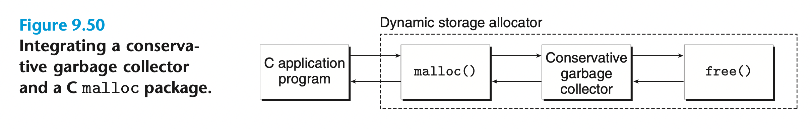

### Mark & Sweep 算法

Mark&Sweep 是常用的垃圾回收算法之一，它分为两个阶段：

* 标记（Mark）阶段：标记所有可达的根节点后代。通常我们将 Block 头部的多余低位之一用于指示该 Block 是否被标记；
* 清除（Sweep）阶段：释放所有未标记且已分配的 Block。

为了更好地理解 Mark&Sweep 算法，我们作出以下假设：

* `ptr`：由 `typedef void *ptr`定义的类型；
* `ptr isPtr(ptr p)`：若 `p`指向已分配 Block 中的某个字，则返回指向该 Block 起始位置的指针 `b`，否则返回 `NULL`；
* `int blockMarked(ptr b)`：如果该 Block 已被标记则返回 `true`；
* `int blockAllocated(ptr b)`：如果该 Block 已分配则返回 `true`；
* `void markBlock(ptr b)`：标记 Block；
* `int length(ptr b)`：返回 Block 除头部外的字长；
* `void unmarkBlock(ptr b)`：将 Block 的状态从已标记转换为未标记；
* `ptr nextBlock(ptr b)`：返回指向下一个 Block 的指针。

那么此算法就可以用下图中的伪码表示：

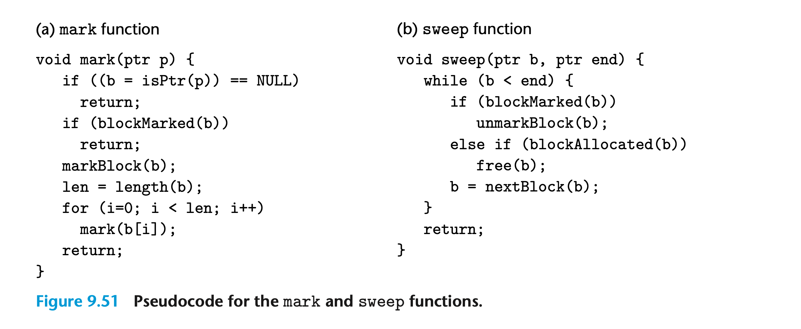

在标记阶段，垃圾回收器为每个根节点调用一次 `mark`函数。若 `p`未指向已分配且未标记的 Block，则该函数直接返回。否则，它标记该 Block 并将其中的每个字作为参数递归地调用自身（`mark(b[i])`）。此阶段结束时，任何未标记且已分配的 Block 都是不可达的；在扫描阶段，垃圾回收器只调用一次 `sweep`函数。该函数遍历堆中的每一个 Block，释放所有已分配且未标记的 Block。

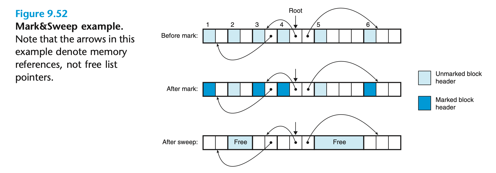

上图中的每个方框代表一个字，每个被粗线分隔的矩形代表一个 Block，而每个 Block 都有一个单字的头部。最初，堆中有 6 个已分配且未标记的 Block。Block 3 中包含指向 Block 1 的指针，Block 4 中包含指向 Block 3 和 6 的指针。根节点指向 Block 4，因此 Block 1、3、4 和 6 从根节点可达，它们会被垃圾回收器标记。在扫描阶段完成后，剩余不可达的 Block 2 和 5 将被释放。
