终于到了Linux另一个精彩的部分——内存，之后的两篇博客应该都是关于内存管理和内存寻址的内容了。

笔记本的内置键盘坏了，昨天折腾一天没能修好，无奈之下只有用老键盘写写文章了...

这一篇的大部分内容应该都是按照CSAPP第九章的内存寻址部分来组织的，有机会有兴趣的bro一定要去读读原文！

## x86 MMU

x86 **内存管理单元**（MMU，Memory Managing Unit）包括分段单元和分页单元。分段单元可用于定义由逻辑（虚拟）起始地址、基本线性（映射）地址和大小定义的逻辑内存段。段也可以根据访问类型（读取、执行、写入）或特权级别（例如，我们可以定义一些只能由内核访问的段）来限制访问。

当 CPU 进行内存访问时，它将使用分段单元根据段描述符中的信息将逻辑地址转换为线性地址。

如果启用了分页，线性地址将使用页表中的信息进一步转换为物理地址。

请注意，分段单元无法禁用，因此如果启用了 MMU，将始终使用分段。

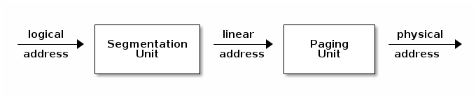

## x86架构的地址

X86架构中，存在着3种地址概念：

* **逻辑地址**：由 段寄存器+offset 组成，也是我们代码中地址存在的形式
* **线性地址**（虚拟地址）：X86 分段模块（物理硬件）将 段寄存器+offset 组合起来后得到的地址
* **物理地址**：CPU 访问物理内存所使用的地址

这三者的关系如下图所示：


这个3个地址中间通过分段单元和分页单元2个物理电路完成自动的转换。对于内存的虚拟化，只要有一个将虚拟地址转换为物理地址的分页单元就够了。

X86 的分段机制是从软件的角度出发，对虚拟地址的一个扩展和隔离手段，对内存的虚拟化并没有作用。

尤其是在 32/64 位机器大行其道的现代，虚拟地址有着绝对的富余，核心矛盾是多进程运行时导致的物理内存紧缺的问题。

使用虚拟寻址，CPU 通过生成一个 **虚拟地址** （Virtual Address，VA）来访问主存，这个虚拟地址在被送到内存之前先转换成适当的物理地址。将一个虚拟地址转换为物理地址的任务叫做 **地址翻译** （address translation）。

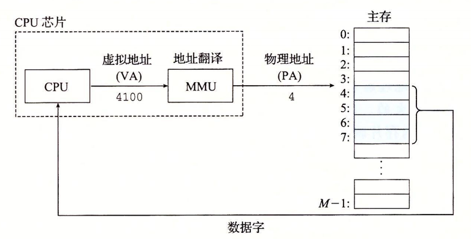

## 前提知识

### 分页（Paging）

所谓**分页**Paging，就是将内存按照以页为单位进行管理，通过一个表格将虚拟地址与物理地址建立映射关系，MMU 通过表格寻找到虚拟地址所对应的物理地址，也就是物理页的所在位置。整个查表转换的过程都是 MMU 硬件电路实现，程序运行时不需要管这个转换过程。

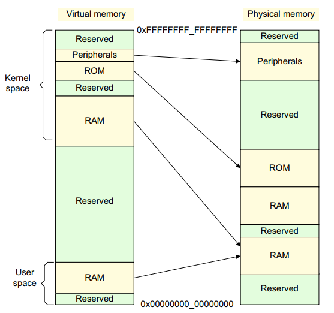

如上图所示，通过地址映射，可以让软件使用的地址空间结构固定，同时它们又能被放在任意的物理内存之中。

### 页表指针寄存器

在 X86 中，存放页表指针的寄存器是 **cr3**。

ARM64 中，具有 **TTBR0 & TTBR1** 2个页表指针寄存器（EL2 & EL3 状态下只有 TTBR0）。其中，当虚拟地址的高位为0的时候，采用 TTBR0，而当高位地址为1的时候，采用 TTBR1。

对于 ARM64 而言，它的虚拟地址为64位，不过它的地址线只有 48 位，所以它实际能使用的地址范围也就是这48位的地址范围。

而虚拟地址为 64 位范围，所以 Linux 中的地址分布采用高 16 位都为 1 的地址作为内核空间，高16位都为 0 的地址作为用户空间。

这样，当处于内核空间的时候，采用 TTBR1 指向的页表；而处于用户空间的时候，则使用 TTBR0 指向的页表。内核空间和用户空间的页表就可以彻底分割开。

### 页表项结构

页表项最主要的作用就是将虚拟地址映射到物理地址，除了这个意外，它还能用来管理内存 page 的权限和特性。如下图所示，是 ARM32 一个二级页表项的结构图：

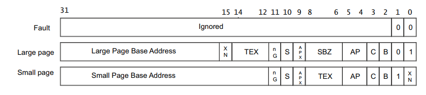

对于 4kB 的 page 大小而言，用来寻找 page 地址的有效位只需要 12-31bit 就可以了，剩下的 12bit 就可以用来作为 page 页的权限和特性控制。比如 APX & AP 组成对访问权限的控制，TEX & C & B 则标示内存的类型以及 cache 策略。

由于 Linux 中对于内存页的管理是**以X86 架构的硬件机制为模版的**，所以对于 ARM 而言，软件层面对内存页这12bit 的使用与物理页表项中的 12bit 无法一一对应，所以 ARM-Linux 为了软件的兼容，页表中除了给硬件使用的页表项外，还复刻了一个给软件用于权限管理的页表项，具体的说明，可以查看 [Linux ARM 页表](https://wushifublog.com/2020/05/25/%E6%B7%B1%E5%85%A5%E7%90%86%E8%A7%A3Linux%E5%86%85%E6%A0%B8%E2%80%94%E2%80%94Memory-Addressing/[https://wushifublog.com/2020/02/05/Linux-ARM-%E9%A1%B5%E8%A1%A8/](https://wushifublog.com/2020/02/05/Linux-ARM-%E9%A1%B5%E8%A1%A8/))。

## 地址翻译

我们以一个理想情景来看看地址翻译，不过在此之前，我们先来说明一下符号定义：

### 符号表

> 基本参数

| 符号    | 描述                     |
| ------- | ------------------------ |
| N = 2^n | 虚拟地址空间中的地址数量 |
| M = 2^m | 物理地址空间中的地址数量 |
| P = 2^p | 页的大小（字节）         |

> 虚拟地址（VA）的组成部分

| 符号 | 描述                   |
| ---- | ---------------------- |
| VPO  | 虚拟页面偏移量（字节） |
| VPN  | 虚拟页号               |
| TLBI | TLB（快表）索引        |
| TLBT | TLB（快表）标记        |

> 物理地址（PA）的组成部分

| 符号 | 描述                   |
| ---- | ---------------------- |
| PPO  | 物理页面偏移量（字节） |
| PPN  | 物理页号               |
| CO   | 缓冲块字节偏移量       |
| CI   | 高速缓存索引           |
| CT   | 高速缓存标记           |

形式上来说，地址翻译是一个 N 元素的虚拟地址空间（VAS）中的元素和一个 M 元素的物理地址空间（PAS）中元素之间的映射，

> mMAP : VAS -> PAS ∪ Ø

### 最简单的翻译逻辑

MMU 如何利用页表来实现这种映射？

首先要明确，CPU 中的一个控制寄存器， **页表基址寄存器** （Page Table Base Register，PTBR）指向当前页表。

n 位的虚拟地址包含两个部分：一个 p 位的 **虚拟页面偏移** （Virtual Page Offset，VPO）和一个(n−p)位的 **虚拟页号** （Virtual Page Number，VPN）。MMU 利用 VPN 来选择适当的 PTE。例如，VPN 0 选择 PTE 0，VPN 1 选择 PTE 1，以此类推。

将页表条目中 **物理页号** （Physical Page Number，PPN）和虚拟地址中的 VPO 串联起来，就得到相应的物理地址。注意，因为物理和虚拟页面都是 P 字节的，所以 **物理页面偏移** （Physical Page Offset，PPO）和 VPO 是相同的。

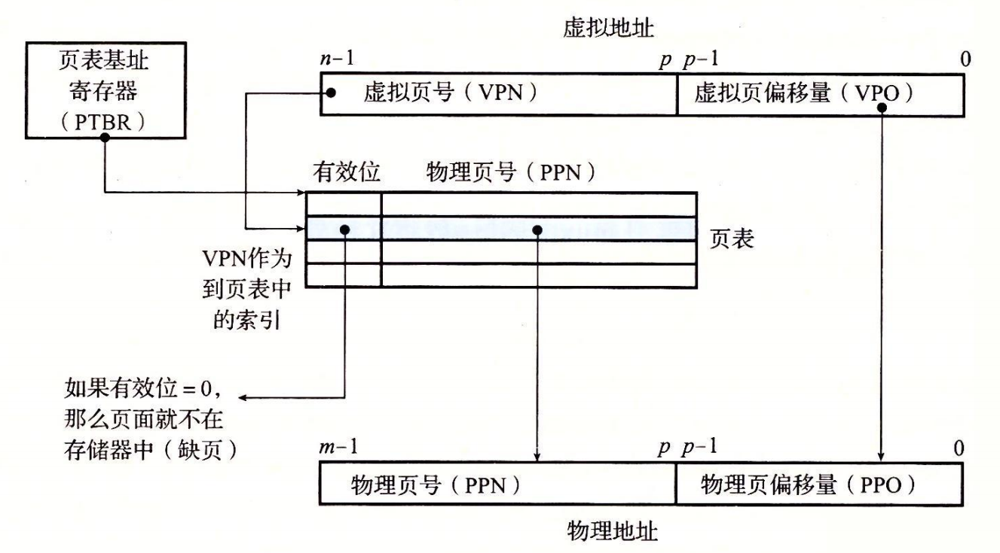

下面图 a) 展示了当页面命中时，CPU 硬件执行的步骤。

* **第 1 步：**处理器生成一个虚拟地址，并把它传送给 MMU。
* **第 2 步：**MMU 生成 PTE 地址，并从高速缓存/主存请求得到它。
* **第 3 步：**高速缓存/主存向 MMU 返回 PTE。
* **第 4 步：**MMU 构造物理地址，并把它传送给高速缓存/主存。
* **第 5 步：**高速缓存/主存返回所请求的数据字给处理器。

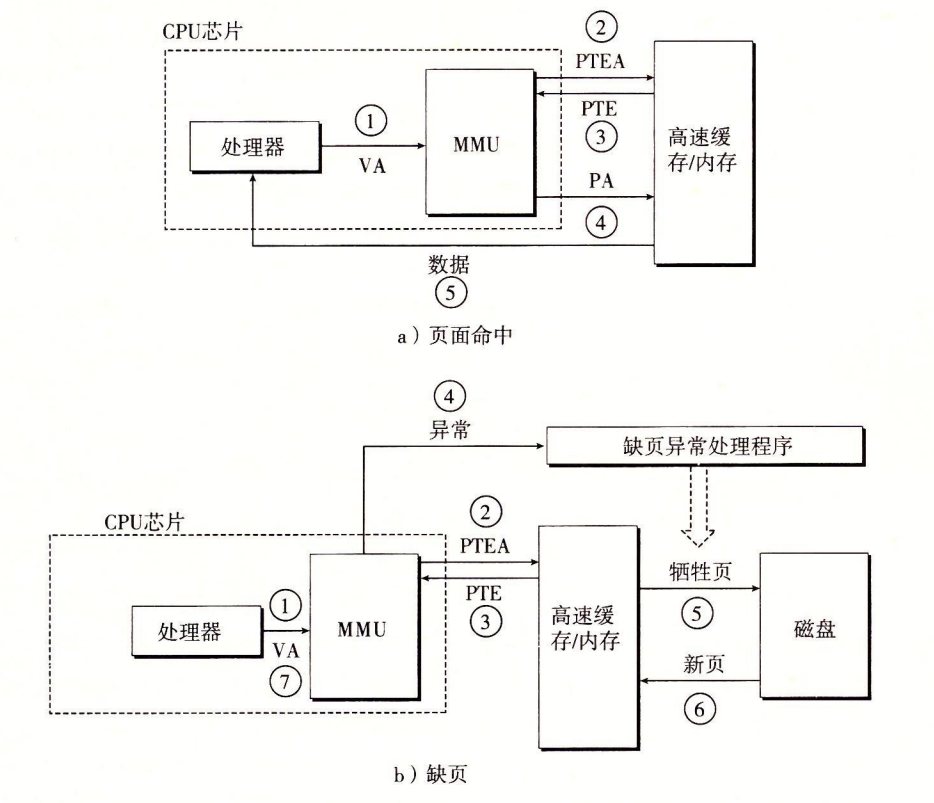

页面命中完全是由硬件来处理的，与之不同的是，处理缺页要求硬件和操作系统内核协作完成，如图 b) 所示。

* **第 1 步到第 3 步：**和图 9-13a 中的第 1 步到第 3 步相同。
* **第 4 步：**PTE 中的有效位是零，所以 MMU 触发了一次异常，传递 CPU 中的控制到操作系统内核中的缺页异常处理程序。
* **第 5 步：**缺页处理程序确定出物理内存中的牺牲页，如果这个页面已经被修改了，则把它换出到磁盘。
* **第 6 步：**缺页处理程序页面调入新的页面，并更新内存中的 PTE。
* **第 7 步：**缺页处理程序返回到原来的进程，再次执行导致缺页的指令。CPU 将引起缺页的虚拟地址重新发送给 MMU。因为虚拟页面现在缓存在物理内存中，所以就会命中，在 MMU 执行了图 9-13b 中的步骤之后，主存就会将所请求字返回给处理器。

### 加上高速缓存

> 在任何既使用虚拟内存又使用 SRAM 高速缓存的系统中，都有应该使用虚拟地址还是使用物理地址来访问 SRAM 高速缓存的问题。尽管关于这个折中的详细讨论已经超出了我们的讨论范围，但是大多数系统是选择物理寻址的。使用物理寻址，多个进程同时在高速缓存中有存储块和共享来自相同虚拟页面的块成为很简单的事情。而且，高速缓存无需处理保护问题，因为访问权限的检査是地址翻译过程的一部分。

下图展示了一个物理寻址的高速缓存如何和虚拟内存结合起来。主要的思路是地址翻译发生在高速缓存查找之前。注意，页表条目可以缓存，就像其他的数据字一样。

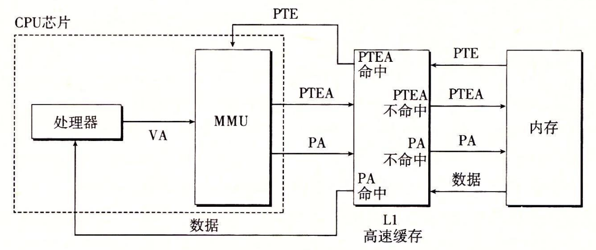

### TLB快表加速

正如我们看到的，每次 CPU 产生一个虚拟地址，MMU 就必须查阅一个 PTE，以便将虚拟地址翻译为物理地址。在最糟糕的情况下，这会要求从内存多取一次数据，代价是几十到几百个周期。如果 PTE 碰巧缓存在 L1 中，那么开销就下降到 1 个或 2 个周期。然而，许多系统都试图消除即使是这样的开销，它们在 MMU 中包括了一个关于 PTE 的小的缓存，称为 **翻译后备缓冲器** （Translation Lookaside Buffer，TLB）。

TLB 是一个小的、虚拟寻址的缓存，其中每一行都保存着一个由单个 PTE 组成的块。TLB 通常有高度的相联度。如图 9-15 所示，用于组选择和行匹配的索引和标记字段是从虚拟地址中的虚拟页号中提取出来的。如果 TLB 有T=2^t个组，那么  **TLB 索引** （TLBI）是由 VPN 的 t 个最低位组成的，而  **TLB 标记** （TLBT）是由 VPN 中剩余的位组成的。

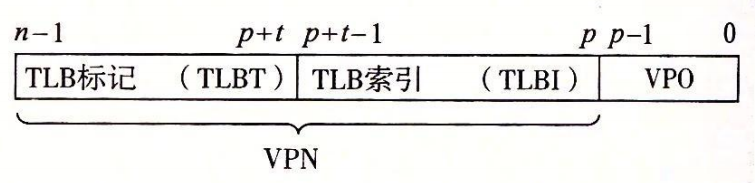

当 TLB 命中时（通常情况）所包括的步骤。这里的关键点是，所有的地址翻译步骤都是在芯片上的 MMU 中执行的，因此非常快。

* **第 1 步：**CPU 产生一个虚拟地址。
* **第 2 步和第 3 步：**MMU 从 TLB 中取出相应的 PTE。
* **第 4 步：**MMU 将这个虚拟地址翻译成一个物理地址，并且将它发送到高速缓存/主存。
* **第 5 步：**高速缓存/主存将所请求的数据字返回给 CPU。

当 TLB 不命中时，MMU 必须从 L1 缓存中取出相应的 PTE，如下图b）所示。新取出的 PTE 存放在 TLB 中，可能会覆盖一个已经存在的条目。

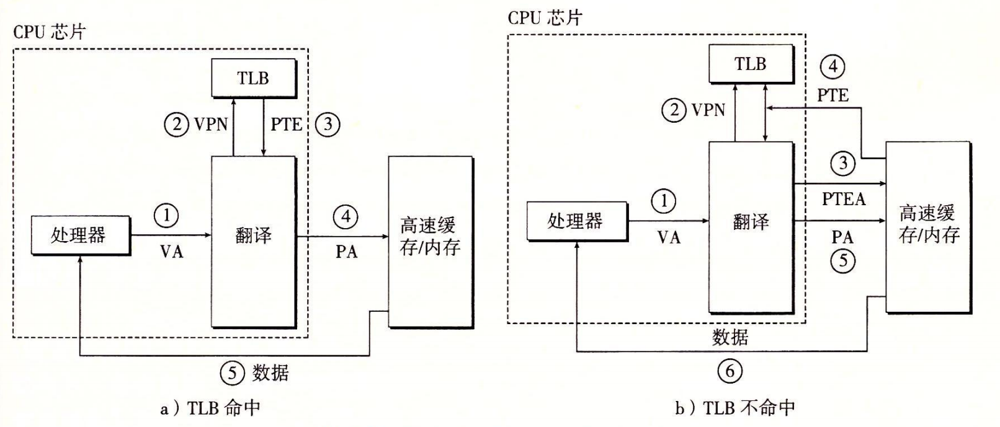

### 加上多级页表（表中表）

到目前为止，我们一直假设系统只用一个单独的页表来进行地址翻译。但是如果我们有一个 32 位的地址空间、4KB 的页面和一个 4 字节的 PTE，那么即使应用所引用的只是虚拟地址空间中很小的一部分，也总是需要一个 4MB 的页表驻留在内存中。对于地址空间为 64 位的系统来说，问题将变得更复杂。

用来压缩页表的常用方法是使用层次结构的页表。用一个具体的示例是最容易理解这个思想的。假设 32 位虚拟地址空间被分为 4KB 的页，而每个页表条目都是 4 字节。还假设在这一时刻，虚拟地址空间有如下形式：内存的前 2K 个页面分配给了代码和数据，接下来的 6K 个页面还未分配，再接下来的 1023 个页面也未分配，接下来的 1 个页面分配给了用户栈。

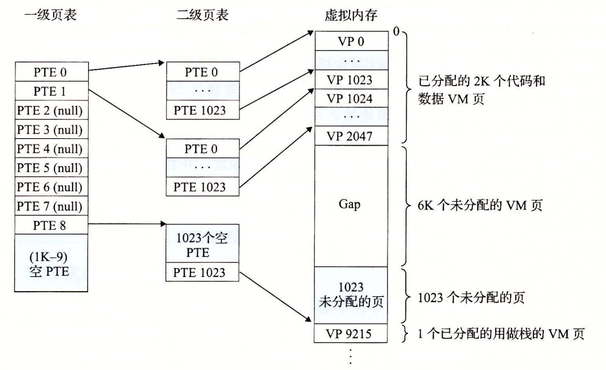

一级页表中的每个 PTE 负责映射虚拟地址空间中一个 4MB 的 **片** （chunk），这里每一片都是由 1024 个连续的页面组成的。比如，PTE 0 映射第一片，PTE 1 映射接下来的一片，以此类推。假设地址空间是 4GB，1024 个 PTE 已经足够覆盖整个空间了。

如果片 i 中的每个页面都未被分配，那么一级 PTE i 就为空。例如，图 9-17 中，片 2 ~ 7 是未被分配的。然而，如果在片 i 中至少有一个页是分配了的，那么一级 PTE i 就指向一个二级页表的基址。例如，在图 9-17 中，片 0、1 和 8 的所有或者部分已被分配，所以它们的一级 PTE 就指向二级页表。

二级页表中的每个 PTE 都负责映射一个 4KB 的虚拟内存页面，就像我们查看只有一级的页表一样。注意，使用 4 字节的 PTE，每个一级和二级页表都是 4KB 字节，这刚好和一个页面的大小是一样的。

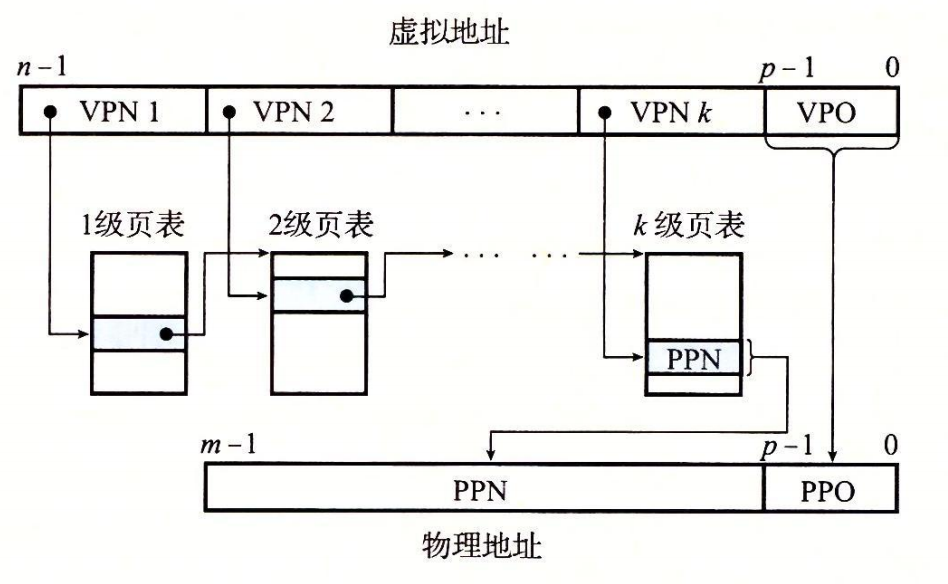

访问 k 个 PTE，第一眼看上去昂贵而不切实际。然而，这里 TLB 能够起作用，正是通过将不同层次上页表的 PTE 缓存起来。实际上，带多级页表的地址翻译并不比单级页表慢很多。

### 综合到一起

我们现在可以用一张图在Intel Core i7背景下，完整地描述VA翻译到PA的全过程：

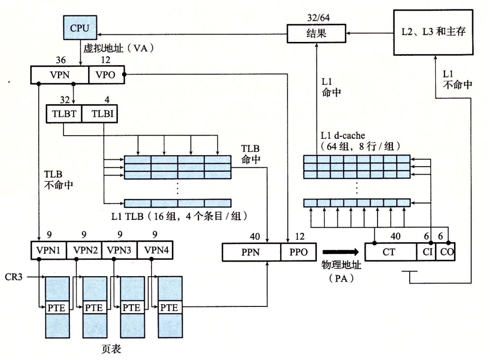

(其中，CR3 的值是每个进程上下文的一部分，每次上下文切换时，CR3 的值都会被恢复。)

而在此过程中，这个进程会用到四张页表。

第一级、第二级或第三级页表中条目的格式中，当 P=1时（Linux 中就总是如此），地址字段包含一个 40 位物理页号（PPN），它指向适当的页表的开始处。注意，这强加了一个要求，要求物理页表 4 KB 对齐。

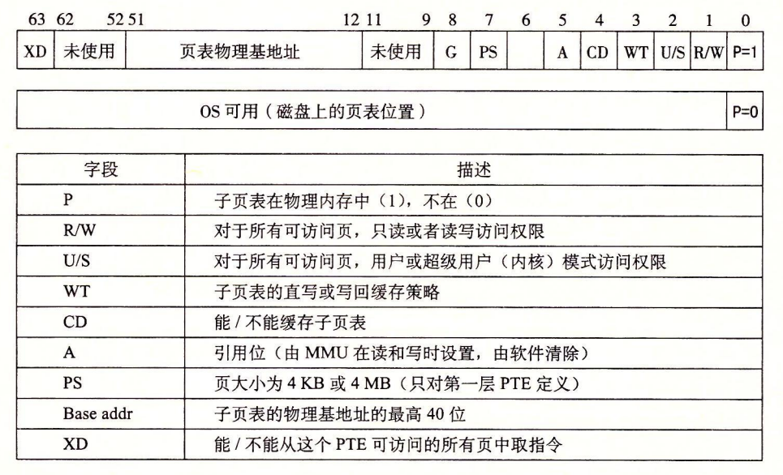

而对于第四级页表中条目的格式，当P=1，地址字段包括一个 40 位 PPN，它指向物理内存中某一页的基地址。这又强加了一个要求，要求物理页 4 KB 对齐。

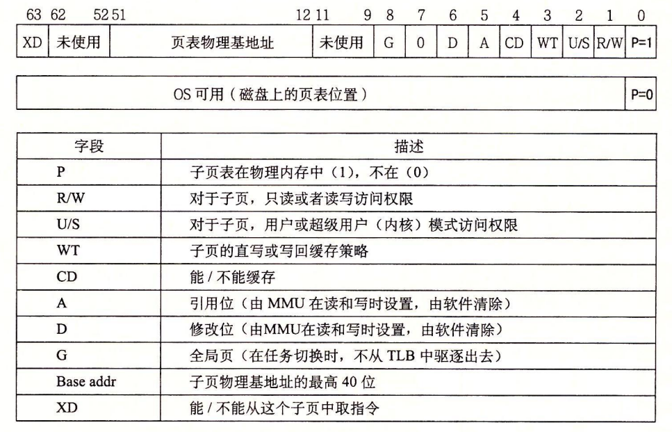

PTE 有三个权限位，控制对页的访问。**R/W 位**确定页的内容是可以读写的还是只读的。**U/S 位**确定是否能够在用户模式中访问该页，从而保护操作系统内核中的代码和数据不被用户程序访问。**XD（禁止执行）位**是在 64 位系统中引入的，可以用来禁止从某些内存页取指令。这是一个重要的新特性，通过限制只能执行只读代码段，使得操作系统内核降低了缓冲区溢出攻击的风险。

当 MMU 翻译每一个虚拟地址时，它还会更新另外两个内核缺页处理程序会用到的位。每次访问一个页时，MMU 都会设置 A 位，称为 **引用位** （reference bit）。内核可以用这个引用位来实现它的页替换算法。每次对一个页进行了写之后，MMU 都会设置 D 位，又称**修改位**或**脏位（dirty bit）**。修改位告诉内核在复制替换页之前是否必须写回牺牲页。内核可以通过调用一条特殊的内核模式指令来清除引用位或修改位。

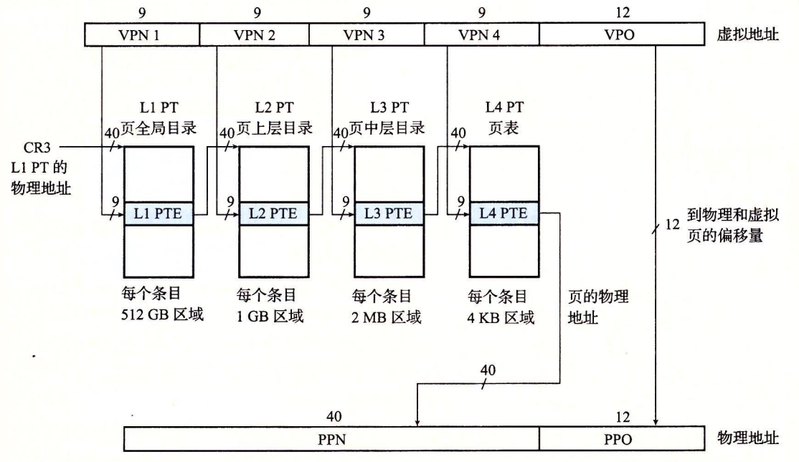

## 再谈Linux虚拟内存

在了解了地址翻译的全貌之后，我们继续在Intel Core i7背景下，看看Linux的虚拟内存的设计。

### Linux虚拟内存逻辑

内核为系统中的每个进程维护一个单独的**任务结构**（源代码中的 task_struct）。任务结构中的元素包含或者指向内核运行该进程所需要的所有信息（例如，PID、指向用户栈的指针、可执行目标文件的名字，以及程序计数器）。

任务结构中的一个条目指向 mm_struct，它描述了虚拟内存的当前状态。我们感兴趣的两个字段是 pgd 和 mmap，其中 pgd 指向第一级页表（页全局目录）的基址，而 mmap 指向一个 vm_area_structs（区域结构）的链表，其中每个 vm_area_structs 都描述了当前虚拟地址空间的一个区域。当内核运行这个进程时，就将 pgd 存放在 CR3 控制寄存器中。

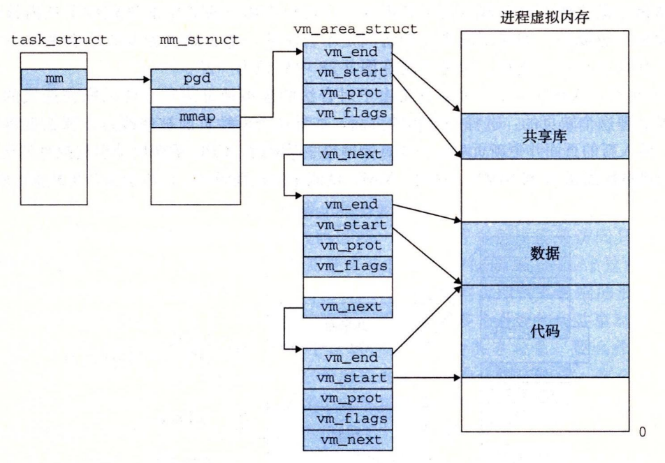

### Linux缺页异常

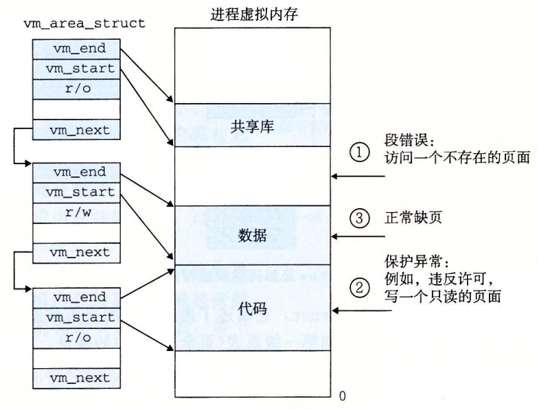

### 分段

在 Linux 中，段不用于定义堆栈、代码或数据。这些将使用分页单元进行设置，因为它允许更好的粒度，并且更重要的是，它允许 Linux 使用通用的方法，使得其在其他（不支持分段）的体系架构上也能工作。

然而，由于分段单元无法禁用，Linux 必须创建 4 个通用的 0-4GB 段，分别用于内核代码、内核数据、用户代码和用户数据。

除此之外，Linux 还使用段与 set_thread_area 系统调用一起来实现线程本地存储（TLS）。

它还使用 TSS 段来定义内核堆栈，以备在特权级别变化时（例如，在用户空间运行时的系统调用、中断发生时）使用。

```assmeble
/*
 * Linux 中每个 CPU 的 GDT 布局：
 *
 *   0——空（null）                                            <=== 缓存行 #1
 *   1——保留
 *   2——保留
 *   3——保留
 *
 *   4——未使用                                                <=== 缓存行 #2
 *   5——未使用
 *
 *  ------- TLS（线程本地存储）段的开始：
 *
 *   6——TLS 段 #1                   [ glibc 的 TLS 段 ]
 *   7——TLS 段 #2                   [ Wine 的 %fs Win32 段 ]
 *   8——TLS 段 #3                                             <=== 缓存行 #3
 *   9——保留
 *  10——保留
 *  11——保留
 *
 *  ------- 内核段的开始：
 *
 *  12——内核代码段                                             <=== 缓存行 #4
 *  13——内核数据段
 *  14——默认用户 CS
 *  15——默认用户 DS
 *  16——TSS                                                   <=== 缓存行 #5
 *  17——LDT
 *  18——PNPBIOS 支持（16->32 门）
 *  19——PNPBIOS 支持
 *  20——PNPBIOS 支持                                          <=== 缓存行 #6
 *  21——PNPBIOS 支持
 *  22——PNPBIOS 支持
 *  23——APM BIOS 支持
 *  24——APM BIOS 支持                                         <=== 缓存行 #7
 *  25——APM BIOS 支持
 *
 *  26——ESPFIX 小型 SS
 *  27——每个 CPU                 [ 指向每个 CPU 数据区的偏移量 ]
 *  28——stack_canary-20          [ 用于栈保护 ]                <=== 缓存行 #8
 *  29——未使用
 *  30——未使用
 *  31——用于双重故障处理的 TSS
 */

 DEFINE_PER_CPU_PAGE_ALIGNED(struct gdt_page, gdt_page) = { .gdt = {
 #ifdef CONFIG_X86_64
         /*
          * 在长模式下，我们也需要有效的内核数据和代码段
          * IRET 将检查段类型  kkeil 2000/10/28
          * 同样，sysret 需要特殊的 GDT 布局
          *
          * 目前，TLS 描述符与 i386 上的位置不同。
          * 希望没有人期望它们位置固定（Wine？）
          */
         [GDT_ENTRY_KERNEL32_CS]         = GDT_ENTRY_INIT(0xc09b, 0, 0xfffff),
         [GDT_ENTRY_KERNEL_CS]           = GDT_ENTRY_INIT(0xa09b, 0, 0xfffff),
         [GDT_ENTRY_KERNEL_DS]           = GDT_ENTRY_INIT(0xc093, 0, 0xfffff),
         [GDT_ENTRY_DEFAULT_USER32_CS]   = GDT_ENTRY_INIT(0xc0fb, 0, 0xfffff),
         [GDT_ENTRY_DEFAULT_USER_DS]     = GDT_ENTRY_INIT(0xc0f3, 0, 0xfffff),
         [GDT_ENTRY_DEFAULT_USER_CS]     = GDT_ENTRY_INIT(0xa0fb, 0, 0xfffff),
 #else
         [GDT_ENTRY_KERNEL_CS]           = GDT_ENTRY_INIT(0xc09a, 0, 0xfffff),
         [GDT_ENTRY_KERNEL_DS]           = GDT_ENTRY_INIT(0xc092, 0, 0xfffff),
         [GDT_ENTRY_DEFAULT_USER_CS]     = GDT_ENTRY_INIT(0xc0fa, 0, 0xfffff),
         [GDT_ENTRY_DEFAULT_USER_DS]     = GDT_ENTRY_INIT(0xc0f2, 0, 0xfffff),
         /*
          * 用于调用 PnPBIOS 的段具有字节粒度。
          * 代码段和数据段具有固定的 64K 限制，
          * 传输段的大小在运行时设置。
          */
         /* 32 位代码 */
         [GDT_ENTRY_PNPBIOS_CS32]        = GDT_ENTRY_INIT(0x409a, 0, 0xffff),
         /* 16 位代码 */
         [GDT_ENTRY_PNPBIOS_CS16]        = GDT_ENTRY_INIT(0x009a, 0, 0xffff),
         /* 16 位数据 */
         [GDT_ENTRY_PNPBIOS_DS]          = GDT_ENTRY_INIT(0x0092, 0, 0xffff),
         /* 16 位数据 */
         [GDT_ENTRY_PNPBIOS_TS1]         = GDT_ENTRY_INIT(0x0092, 0, 0),
         /* 16 位数据 */
         [GDT_ENTRY_PNPBIOS_TS2]         = GDT_ENTRY_INIT(0x0092, 0, 0),
         /*
          * APM 段具有字节粒度，并且它们的基址在运行时设置。
          * 所有段的限制都是 64K。
          */
         /* 32 位代码 */
         [GDT_ENTRY_APMBIOS_BASE]        = GDT_ENTRY_INIT(0x409a, 0, 0xffff),
         /* 16 位代码 */
         [GDT_ENTRY_APMBIOS_BASE+1]      = GDT_ENTRY_INIT(0x009a, 0, 0xffff),
         /* 数据 */
         [GDT_ENTRY_APMBIOS_BASE+2]      = GDT_ENTRY_INIT(0x4092, 0, 0xffff),

         [GDT_ENTRY_ESPFIX_SS]           = GDT_ENTRY_INIT(0xc092, 0, 0xfffff),
         [GDT_ENTRY_PERCPU]              = GDT_ENTRY_INIT(0xc092, 0, 0xfffff),
         GDT_STACK_CANARY_INIT
 #endif
 } };
 EXPORT_PER_CPU_SYMBOL_GPL(gdt_page);
```

### 分页

Linux 具有用于创建和遍历页表的通用 API。借助于此我们可以实现使用相同的通用代码来创建和修改内核和进程的地址空间，该代码依赖于宏和函数，将这些通用操作转换为在不同体系结构上运行的代码。

以下是使用 Linux 页表 API 将虚拟地址转换为物理地址的示例：

```c
struct * page;
pgd_t pgd;
pmd_t pmd;
pud_t pud;
pte_t pte;
void *laddr, *paddr;

pgd = pgd_offset(mm, vaddr);
pud = pud_offet(pgd, vaddr);
pmd = pmd_offset(pud, vaddr);
pte = pte_offset(pmd, vaddr);
page = pte_page(pte);
laddr = page_address(page);
paddr = virt_to_phys(laddr);
```

为了支持具有少于 4 级分页的体系结构（例如32位 x86），某些宏和/或函数可以为 0/空：

```c
static inline pud_t * pud_offset(pgd_t * pgd,unsigned long address)
{
    return (pud_t *)pgd;
}

static inline pmd_t * pmd_offset(pud_t * pud,unsigned long address)
{
    return (pmd_t *)pud;
}
```

### 高内存

高内存，也就是我们平时常说的，存放**内核**的内存空间。

虚拟地址空间中的“高内存”部分用于创建任意映射（与低内存中的线性映射相对）。在 32 位系统中，高内存区域绝对是必需的，以便访问低内存以外的物理内存。然而，高内存在 64 位系统上也被使用，但主要用于允许内核空间中的任意映射。

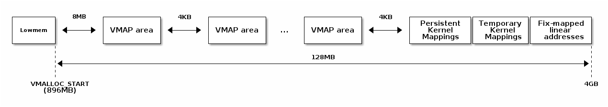

高内存区域有多种类型的映射：

* 多页面永久映射（vmalloc、ioremap）
* 临时的单页面映射（atomic_kmap）
* 永久的单页面映射（kmap、固定映射的线性地址）

多页面映射允许将物理内存范围映射到高内存区域。每个这样的映射都由一个不可访问的页面保护，以捕获缓冲区溢出和下溢错误。

将多个页面映射到高内存的 API 包括：

```c
void* vmalloc(unsigned long size);
void vfree(void * addr);

void *ioremap(unsigned long offset, unsigned size);
void iounmap(void * addr);
```

`vmalloc()` 用于在内核虚拟地址空间中分配非连续的系统内存页面作为连续段。它在分配大型缓冲区时非常有用，因为由于碎片化，很难找到连续的大块物理内存空闲。

`ioremap()` 用于将内核地址空间映射到设备内存或设备寄存器。它将连续的物理内存范围映射到高内存，并禁用页面缓存。

### 固定映射的线性地址

**固定映射的线性地址**是一类特殊的**单页面映射**，用于访问常用**外设**（如 APIC 或 IO APIC）的寄存器。

典型的外设 I/O 访问方式是使用基址（内核虚拟地址空间中映射外设寄存器的位置）+ 不同寄存器的偏移量。

为了优化访问速度，基址在编译时被预留（例如，0xFFFFF000）。由于基址是常量，形如 base + register offset 的寄存器访问也是常量，因此编译器会避免生成额外的指令。

总结一下，固定映射的线性地址是：

* 预留的虚拟地址（常量）
* 在引导（boot）过程中映射到物理地址

这些地址是由**体系结构**定义的，以 x86 为例，以下是其映射表：

```c
/*
 * 这里定义了所有在编译时“特殊”的虚拟地址。
 * 目的是在编译时有一个常量地址，但物理地址只在引导过程中设置。
 * 对于 x86_32：我们从虚拟内存的末尾（0xfffff000）开始分配这些特殊地址。
 * 这样还可以保证安全的 vmalloc()，可以确保这些特殊地址和 vmalloc() 的地址不重叠。
 *
 * 这些“编译时分配”的内存缓冲区是固定大小的 4k 页（如果使用的增量大于 1，则可以更大）。
 * 使用 set_fixmap(idx,phys) 将物理内存与 fixmap 索引关联起来。
 *
 * 这些缓冲区的 TLB 条目在任务切换时不会被刷新。
 */

enum fixed_addresses {
#ifdef CONFIG_X86_32
    FIX_HOLE,
#else
#ifdef CONFIG_X86_VSYSCALL_EMULATION
    VSYSCALL_PAGE = (FIXADDR_TOP - VSYSCALL_ADDR) >> PAGE_SHIFT,
#endif
#endif
    FIX_DBGP_BASE,
    FIX_EARLYCON_MEM_BASE,
#ifdef CONFIG_PROVIDE_OHCI1394_DMA_INIT
    FIX_OHCI1394_BASE,
#endif
#ifdef CONFIG_X86_LOCAL_APIC
    FIX_APIC_BASE,        /* 本地（CPU）APIC - 对 SMP 有要求或无要求 */
#endif
#ifdef CONFIG_X86_IO_APIC
    FIX_IO_APIC_BASE_0,
    FIX_IO_APIC_BASE_END = FIX_IO_APIC_BASE_0 + MAX_IO_APICS - 1,
#endif
#ifdef CONFIG_X86_32
    FIX_KMAP_BEGIN,       /* 用于临时内核映射的保留 pte */
    FIX_KMAP_END = FIX_KMAP_BEGIN+(KM_TYPE_NR*NR_CPUS)-1,
#ifdef CONFIG_PCI_MMCONFIG
    FIX_PCIE_MCFG,
#endif
```

虚拟地址和固定地址索引之间的转换也很容易：

```c
#define __fix_to_virt(x)  (FIXADDR_TOP - ((x) << PAGE_SHIFT))
#define __virt_to_fix(x)  ((FIXADDR_TOP - ((x)&PAGE_MASK)) >> PAGE_SHIFT)

#ifndef __ASSEMBLY__
/*
 * ‘索引到地址’转换。如果有人直接使用索引而没有进行转换，我们会通过一个空指针解引用内核崩溃来捕捉该错误。我们还会捕捉到非法的索引范围。
 */
static __always_inline unsigned long fix_to_virt(const unsigned int idx)
{
    BUILD_BUG_ON(idx >= __end_of_fixed_addresses);
    return __fix_to_virt(idx);
}

static inline unsigned long virt_to_fix(const unsigned long vaddr)
{
    BUG_ON(vaddr >= FIXADDR_TOP || vaddr < FIXADDR_START);
    return __virt_to_fix(vaddr);
}


inline long fix_to_virt(const unsigned int idx)
{
    if (idx >= __end_of_fixed_addresses)
        __this_fixmap_does_not_exist();
    return (0xffffe000UL - (idx << PAGE_SHIFT));
}
```

### 临时映射

临时映射可用于在内核空间中**快速映射单个物理页面**。它可以在中断上下文中使用，但是原子 kmap 部分在 `kmap_atomic()` 和 `kunmap_atomic()` 之间定义，不能被抢占。这就是为什么它们被称为临时映射，因为它们只能短暂使用。

临时映射非常快速，因为**不需要锁定或搜索**，并且不需要**完全无效化 TLB**，只需无效化特定的虚拟页。

以下是一些展示临时映射实现的代码片段：

```c
#define kmap_atomic(page) kmap_atomic_prot(page, kmap_prot)

void *kmap_atomic_high_prot(struct page *page, pgprot_t prot)
{
   unsigned long vaddr;
   int idx, type;

   type = kmap_atomic_idx_push();
   idx = type + KM_TYPE_NR*smp_processor_id();
   vaddr = __fix_to_virt(FIX_KMAP_BEGIN + idx);
   BUG_ON(!pte_none(*(kmap_pte-idx)));
   set_pte(kmap_pte-idx, mk_pte(page, prot));
   arch_flush_lazy_mmu_mode();

   return (void *)vaddr;
      }
      EXPORT_SYMBOL(kmap_atomic_high_prot);

      static inline int kmap_atomic_idx_push(void)
      {
   int idx = __this_cpu_inc_return(__kmap_atomic_idx) - 1;

      #ifdef CONFIG_DEBUG_HIGHMEM
   WARN_ON_ONCE(in_irq() && !irqs_disabled());
   BUG_ON(idx >= KM_TYPE_NR);
      #endif
   return idx;
}
```

请注意，这里使用了固定映射的线性地址和类似堆栈的方法：每个 CPU 都有 KM_TYPE_NR 个保留条目，按照先入先出的顺序使用。这允许同时使用多个临时映射，例如在进程上下文中使用一个，在中断处理程序中使用一个，以及在任务队列或软中断中使用几个。

### 永久映射

永久映射允许用户在**长时间**（未定义的）期间保持映射，这意味着在映射之后和释放之前可以进行上下文切换。

然而，这种灵活性是有代价的。需要执行搜索操作来找到一个空闲条目，并且它们不能在中断上下文中使用——尝试找到一个空闲的虚拟地址页面的操作可能会阻塞。永久映射的可用数量是有限的（通常保留一页用于永久映射）。
