Linux中，系统中的内存除了用来存放内核的代码和静态分配的数据外，剩下的内存都交由内存管理模块进行动态分配。

系统中的动态内存除了要分配给用户使用外，还要提供给内核本身使用。事实上，系统整体的性能都依赖于动态内存分配和回收的效率。因此，目前所有的多任务操作系统都在优化内存的管理。

本文内存地址部分理论内容基于《CSAPP》，剩余部分基于其他互联网资料。

这一部分可以分为3个模块讲解，内存页管理、内存块管理（slab分配器）、非连续内存页管理（vmalloc分配器）。

当然关于 Linux 的内存管理，更好的书籍是 Mel Gorman 的 [《Understanding the Linux Virtual Memory Manager》](https://www.kernel.org/doc/gorman/html/understand/)

## Introduction

笔者今天在写个人项目的时候，就被一个strdup给困住了，因为它最后分配的内存空间是自动malloc的，所以当缺少 `_GNU_SOURCE`和 `_DEFAULT_SOURCE`宏的时候，会出现分配返回int 地址，而非char*的问题，最后自然而然就是触发了保护错误了...

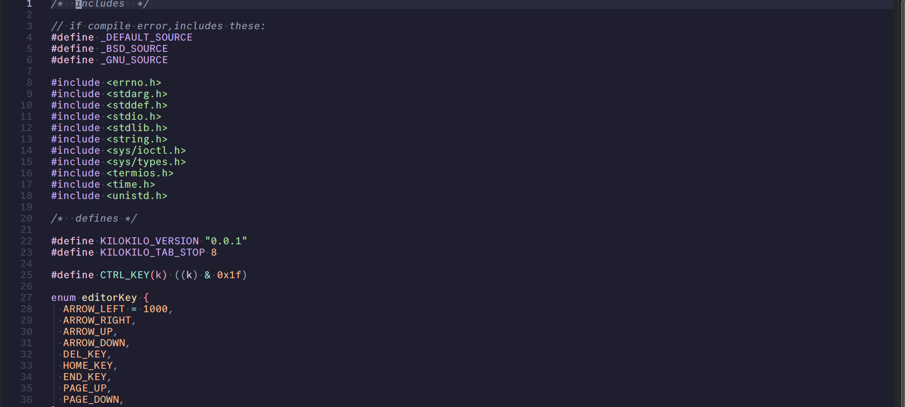

所以不由得想到一件事：平时程序运行起来就变成了进程，这些数据结构的引用在进程的视角里全部都是虚拟内存地址，无论是在用户态还是内核态，能被看到的，一定是虚拟内存空间，那么到底这些内存的管理和各个内存模型是如何被管理的，就得来仔细研究一下内存管理的Linux源代码了。

## 物理内存管理

### 上集回顾

上一节中，我们已经基于内存地址，介绍了Linux的内存子系统。

为了防止多线程运行造成的内存地址冲突，内核引入了虚拟内存地址，为每个进程提供了一个独立的虚拟内存空间。这段空间的分布遵循这样的原则（图片来源小林coding）：


分别为：

- 存放进程二进制文件中机器指令的 **代码段**
- 存放程序二进制文件中定义的全部变量和静态变量的 **数据段** 和**BSS段**
- 在程序运行过程中动态申请内存的**堆**
- 存放动态链接库以及内存映射区域的**文件映射与匿名映射区**
- 存放函数调用过程中局部变量和函数参数的**栈**
- 以及提供系统调用和其他基本功能的**内核空间**

### 物理内存结构

物理内存管理的特点在于：

* 跟踪物理内存页面的算法和数据结构
* 独立于虚拟内存管理
* 完整的内存管理同时需要虚拟内存管理和物理内存管理
* 物理页面使用特殊的数据结构进行跟踪：`struct page`
* 每个物理页面都在 `mem_map` 向量中保留有一个条目
* 物理页面的状态可能包括：页面使用计数器，位于交换区（swap）或文件中的位置，该页面的缓冲区，页面缓存（page cache）中的位置等。

我们知道对于物理内存管理是按照 page 为单位进行的，出于不同系统中，物理内存的差异和软件上的管理方便，在 page 之上还有 node 和 zone 这2个结构概念。如下图所示：

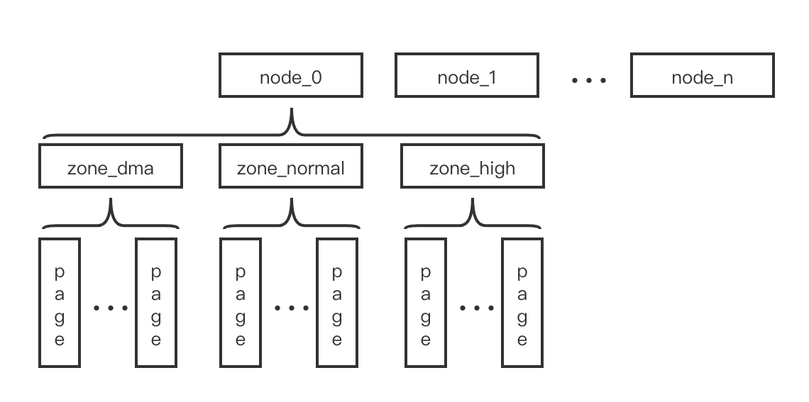

在一些系统中，可能会有多个 bank 的内存，它们连接在系统中，具有不同的访问延迟，或者不同的 bank 之间地址不连续。我们称这样的系统为 **NUMA**(Non-Uniform Memory Access)，并且对每个不同的 bank 在软件上称之为一个 node，内核中记录一个 node 的数据结构是 `pglist_data` 。

> 在 ARM64 架构中，node 存放在一个名为 `node_data` 的数组中，数组的长度通过 `CONFIG_NODES_SHIFT` 配置。如果系统中只有一个访问一致的内存块，这样的系统称之为 UMA，那么它也就只有一个 node。

每一个 node 由被划分为不同的 zone，内核中记录一个 zone 的数据结构是 `zone`。

一个 node 中包含哪些 zone 根据不同的架构具有的 `zone_type` 而确定的。主要有这些类型的：ZONE_DMA、ZONE_DMA32、ZONE_NORMAL、ZONE_HIGHMEM。

不同的 zone 内存在系统中具有不同的用途。ZONE_DMA 和 ZONE_DMA32 是给系统中存在某些外设在使用 DMA 的时候无法访问全部的内存时划分出来的，也就是划分出一个 DMA zone 给处理这些外设 DMA 的时候使用。ZONE_DMA 主要是 X86 架构中遗留的16MB空间给 ISA 设备使用。ZONE_HIGHMEM 则是给超过 896MB 空间的内存使用，因为它们无法被32位的内核直接映射。

然后就是内存管理中最重要的数据结构 `page` ，它是内核中用于记录一个内存页的数据结构，目前一个 node 中所有的 page 指针都存放在 `node_mem_map` 数组中。

在目前的代码中，page 结构除了 flags、_refcount、virtual 三个固定的数据外，其他的根据 page 的不同用途则有不同的含义。采用的是2个 union 数据，其中一个长度为 5个 words（20/40Bytes），另一个则为 4Bytes 长的 union。page 的 flags 有很多，它们定义在 `enum pageflags` 类型中。同时为了节省空间，page 所属的 node & zone 的信息也被存放在了 flags 变量中，通过宏 `NODES_PGSHIFT` & `ZONES_PGSHIFT` 中定义的 bit 位来分割。

:::note

DMA，全称Direct Memory Access，即直接存储器访问。

DMA传输将数据从一个地址空间复制到另一个地址空间，**提供在外设和存储器之间或者存储器和存储器之间的高速数据传输**。当CPU初始化这个传输动作，传输动作本身是由**DMA控制器**来实现和完成的。DMA传输方式无需CPU直接控制传输，也没有中断处理方式那样保留现场和恢复现场过程，通过硬件为RAM和IO设备开辟一条直接传输数据的通道，使得CPU的效率大大提高。

:::

总结一下就是，物理内存区域(zone)包括这些部分：

* DMA 区域
* DMA32 区域
* 正常区域（LowMem）
* 高内存区域（HighMem）
* 可移动区域（Movable Zone）

同时，内存的访问是非均匀的，按照这样的逻辑来进行：

* 物理内存被分割成多个节点（node），每个 CPU 对应一个节点
* 每个节点都可以访问单个物理地址空间
* 访问本地内存更快
* 每个节点维护自己的内存区域（例如 DMA、NORMAL、HIGHMEM 等）

### 物理內存管理初始化

Linux源代码中，zone 初始化按照如下流程：

> `bootmem_init()` —> `zone_sizes_init()` —> `free_area_init_nodes()` —> `free_area_init_node()` —> `free_area_init_core()`

在Linux 5.x内核下，流程类似：

```c
start_kernel()           // init/main.c
  -> setup_arch()        // arch/*/kernel/setup.c
  -> mm_init()           // mm/mm_init.c
    -> mem_init()        // mm/mm_init.c
    -> free_area_init()  // mm/page_alloc.c
      -> free_area_init_node()  // mm/page_alloc.c
        -> zone_init_free_lists()  // mm/page_alloc.c
```

### 内存回收

物理内存回收依赖于Zone Watermark。

随着动态内存地不断使用，可用的物理内存会不断减少，这时就需要对内存进行回收。回收的不及时，就会导致内存分配请求失败，回收地太过频繁则有浪费资源，降低性能的缺点。所以在每个 zone 中通过3个阈值来进行内存回收的控制，如下图所示：

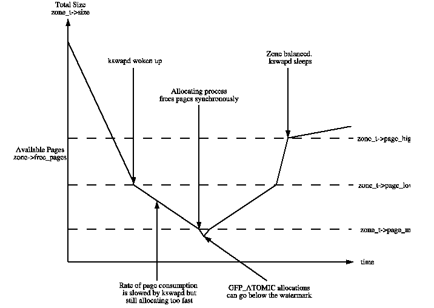

这3个阈值存放在 zone 的 `_watermark` 数组里，通过三个不同的宏进行访问：

* min_wmark_pages(z)：当 zone 中可用的 page 数量低于这个值时，将开启同步回收动作，获取 page 的进程会被阻塞（如果可以阻塞的话）
* low_wmark_pages(z)：当 zone 中可用的 page 数量低于这个值时，将唤醒 kswapd 内核线程（每个 node 对应一个 swapd ）进行异步回收
* high_wmark_pages(z)：当 zone 中可用的 page 数量高于这个值时，kswapd 会休眠，停止回收

### 页面分配

```c
/* 分配 2^order 个连续页面，并返回指针，指针指向第一个页面的描述符 */
struct page *alloc_pages(gfp_mask, order);

/* 分配单个页面 */
struct page *alloc_page(gfp_mask);


/* 返回内核虚拟地址的辅助函数 */
void *__get_free_pages(gfp_mask, order);
void *__get_free_page(gfp_mask);
void *__get_zero_page(gfp_mask);
void *__get_dma_pages(gfp_mask, order);
```

内核中获取和释放连续 page 的函数有：

| Function                     | Discription                                                                |
| ---------------------------- | -------------------------------------------------------------------------- |
| alloc_pages(gfp_mask, order) | 获取多个 page ，其中 order 表示 2 的幂个数目，返回是指向 page 结构体的指针 |
| alloc_page(gfp_mask)         | 获取一个 page                                                              |
| __get_free_pages(gfp_mask)   | 获取多个 page，返回的是这块内存区域的起始虚拟地址                          |
| __get_free_page(gfp_mask)    | 获取一个 page                                                              |
| __free_pages(page, order)    | 释放多个 page，输入参数是 page 结构体指针                                  |
| __free_page(page)            | 释放一个 page                                                              |
| free_pages(addr, order)      | 释放多个 page，输入参数是虚拟地址的起始地址                                |
| free_page(adds)              | 释放一个 page                                                              |

在内存管理中，如果总是不断地分配和释放不同尺寸大小的内存空间，就会带来名为 **外部碎片** 的问题。也就是长时间的进行分配和释放动作后，会导致内存被切分为许多尺寸小的模块，这样就会导致即使存在许多的空闲空间，但是找不到一个尺寸较大的连续空间，就会导致大块连续内存的分配请求失败。

Linux 内核中对于连续内存页的分配采用了 buddy system 进行管理，以减少碎片化的问题。

Buddy allocator 的思想就是把 page 按照 1，2，4……1024 这样的2的幂指数划分，每次获取空间只能按照 2 的幂指数进行，也即是 alloc_pages 函数中的 order 参数。这样做的好处就是，当小块的空间不够用的时候，把大块的掰开就可以得到2个小块的，回收的时候，就可以把2个空闲的小块合并为一个大块的。能够非常方便地进行内存块的切分与合并。

体现 buddy allocator 处理过程的函数是 `__alloc_pages_nodemask`，用代码里的注视来说，这是 buddy allocator 的 heart。下面是这个函数的调用过程：


`get_page_from_freelist` 函数中遍历 node 中的各个 zone，寻找最合适分配此次内存的 zone，然后就调用 `rmqueue` 从这个 zone 中的空闲内存块链表中获取对应大小的内存块。在 struct zone 中，free_area 是一个按照 order 为序号的数组，它的结构如下：

```c
struct free_area {
    struct list_head    free_list[MIGRATE_TYPES];
    unsigned long        nr_free;
};
```

内部是当前这个 order 大小的内存块数量计数和按照迁移类型链接的一个链表数组。`rmqueue` 在 zone 中寻找到合适的内存块，然后把它从空闲链表中移除。`__rmqueue_smallest` 就是寻找到能够提供当前请求大小块的 order 序号，然后从它的链表中移除来一块内存节点。

最好的情况就是请求的大小与当前的 order 值刚好匹配，如果存在不匹配的情况，那么就需要把大块掰开成2块，一块用来满足请求，另一块则需要添加到对应大小的空闲链表中，其中 `expand` 的工作就是把大块掰成小块的处理过程。通过它，我们看到 buddy 的关键，下面是简化后的代码：

```c
static inline void expand(struct zone *zone, struct page *page,
    int low, int high, struct free_area *area,
    int migratetype)
{
    unsigned long size = 1 << high;

    while (high > low) {
        area--;
        high--;
        size >>= 1;
        add_to_free_area(&page[size], area, migratetype);
        set_page_order(&page[size], high);
    }
}

static inline void add_to_free_area(struct page *page, struct free_area *area,
                 int migratetype)
{
    list_add(&page->lru, &area->free_list[migratetype]);
    area->nr_free++;
}

static inline void set_page_order(struct page *page, unsigned int order)
{
    set_page_private(page, order);
    __SetPageBuddy(page);
}
```

`__SetPageBuddy` 的定义在 `include/linux/page-flags.h` 文件中通过宏 `PAGE_TYPE_OPS(Buddy, buddy)` 生成，表示对 page->page_type 设置 `PG_buddy` 标志。

假设这样一个例子：请求一个 order=1 的内存块，在 free_area 中找到的最小块是 order=3，这个时候，就需要掰2次才能得到我们所请求的内存块，整个过程的示意图如下所示：

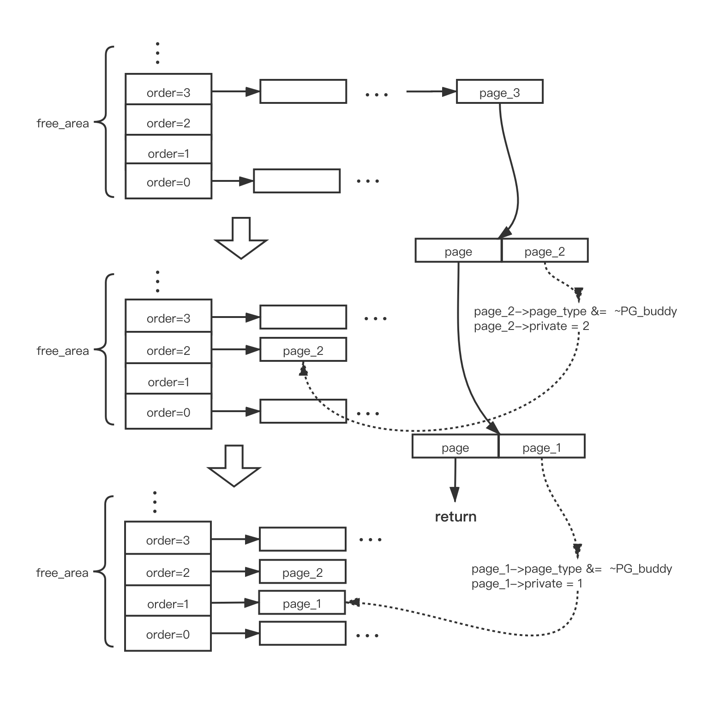

释放内存块的主要函数是 `__free_pages` ，下面是它的调用关系图：

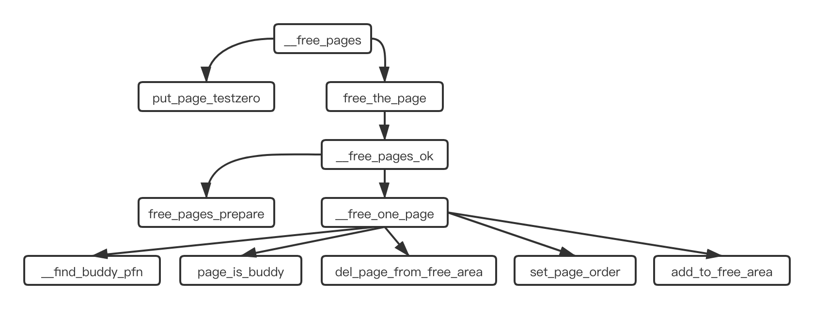

`__free_one_page` 函数中，是之前分配内存块中 expand 的反过程，也就是循环尝试把小块的内存合并为大块的内存。

首先通过 `__find_buddy_pfn` 找到当前这个 page 块对应的伙伴，然后通过 `page_is_buddy` 来检查它的伙伴是否跟当前的内存块是一样的大小，并且还属于空闲状态，如果是则满足合并的条件。

如果发现当前内存块和它的伙伴满足合并的条件，那么就把它的伙伴从它所在的空闲链表中删除 `del_page_from_free_area`，然后一起合并成一个大的内存块 `set_page_order`，添加到大一级 order 的链表中 `add_to_free_area`。

这也就是我们说的页面分配中的**伙伴系统**。

### SLAB架构

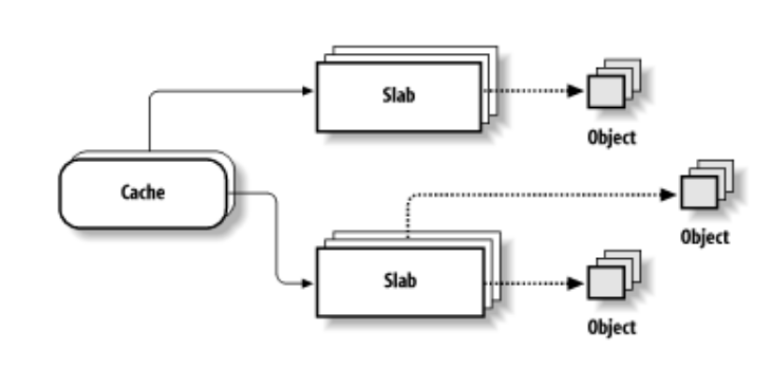

一个 object 就是表示一个特定数据类型的存储空间，一个 slab 则是包含着多个 object 的内存块，通常它的大小是一个 page，而用于分配同样数据类型的 slab 一起组成了一种 cache。

每个 cache 通过一个 `kmem_cache` 数据类型进行描述，目前的代码中，slab 的相关描述数据则放到了 page 结构数据中的联合体中，相比较将 slab 描述符也放到 slab page 中的老版本的做法，节省出不少空间。下图是一个 slab 的结构示意图：


### SLAB着色

首先，我们看一下 CPU 的硬件 cache 的结构：

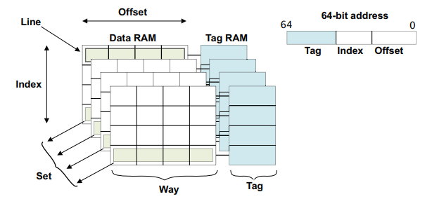

cache 的匹配是先以高位的 tag 进行匹配，然后是中间的 index，如果2个 slab object 的地址的 index 是一样的，那么它们能够存放的 cache line 就只能在一个 set 中选择，如上图就是 4个坑位。

如果这2个 index 不一样的话，那么它们之间就不会发生竞争的情况。所以为了将 slab 中空余的空间“废物利用”，就在每个 slab 的前面选择不同的空余空间，这样就将 slab 中有效空间的起始地址进行了错开，减少了 cache line 的竞争情形，提升了 slab 的访问性能。

内核中把这个过程称之为 **slab 的染色**，非常地形象，同一个 slab cache 下不同的 slab 具有不同的起始地址，把 slab 分成了不同的形态。很显然，这个 color 的大小是以 cache line 为单位的。

### 内存池MemPool

这个 mempool 跟 slab 的关系不是太大，它是内核提供的一个特性。就是建立的一个内存池子作为一些特定的用途，以避免在系统内存不足的时候，它们还能够从这个小池子里获得稀缺的内存资源。看了一下当前的代码，如书中所言，目前是还是只有在块设备的代码中有使用，并没有大范围地被应用。毕竟这种偷摸地保存着一块“自留地”的行为在系统中还是不值得提倡吧。

`mempool_create` 用于创建池子，它通过传入不同的内存块分配函数来创建不同类型的池子。比如 `mempool_alloc_slab` 用来创建对象为 slab object 的池子，用 `mempool_alloc_pages` 来创建对象为 page 的池子。在使用的时候，则通过 `mempool_alloc` & `mempool_free` 进行内存的分配和释放。

在分配对象的时候，首先通过对象的本身的分配函数获取内存，比如 slab 的话，就调用 kmem_cache_alloc 进行分配。如果分配失败，那么就调用 `remove_element` 从它预先保留的池子中进行分配。如果池子里的空间也用完了，那么当前进程就会被挂起，添加到这个池子的等待队列 pool->wait 中。直到 `mempool_free` 释放的空间达到池子要求的最小值 pool->min_nr ，这些被挂起在等待队列中的进程就会被唤醒。特定的对象通过这样一个池子，相当于在内存的分配过程中添加了一个缓冲区域，使得调用对象相比较系统中的其他对象有着更强的“抗旱”性能。所以反过来而言，如果大家都这么干，那就没有优先可言了。

## 进程虚拟内存管理

### 区域划分

32位下划分如图：

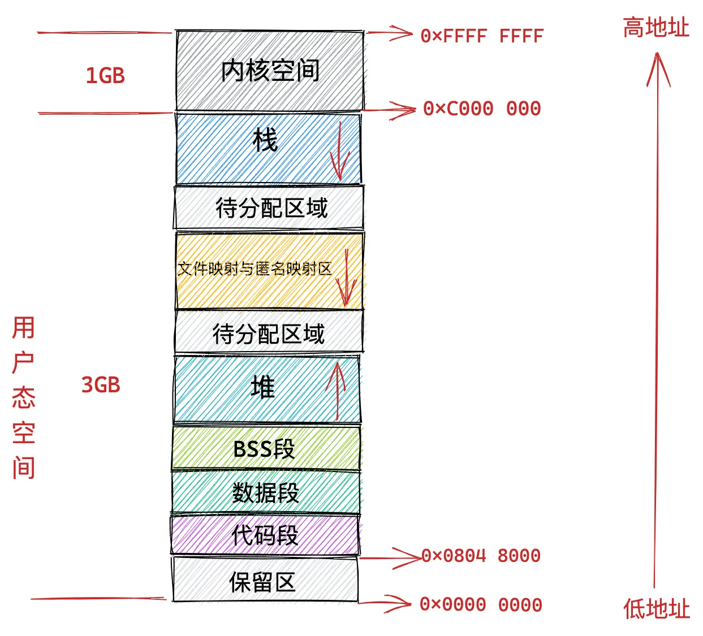

来看看**/arch/x86/include/asm/page_32_types.h**中关于TASK_SIZE的定义：

```c
/*
 * User space process size: 3GB (default).
 */
#define TASK_SIZE	__PAGE_OFFSET
```

32位下，__PAGE_OFFSET的值为0xC000000

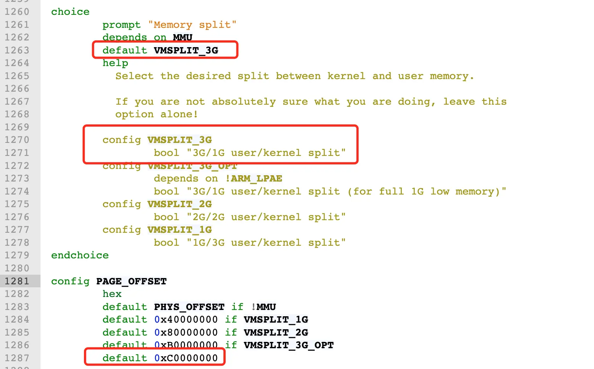

而在 64 位系统中，只使用了其中的低 48 位来表示虚拟内存地址。其中用户态虚拟内存空间为低 128 T，虚拟内存地址范围为：0x0000 0000 0000 0000 - 0x0000 7FFF FFFF F000 。

内核态虚拟内存空间为高 128 T，虚拟内存地址范围为：0xFFFF 8000 0000 0000 - 0xFFFF FFFF FFFF FFFF 。

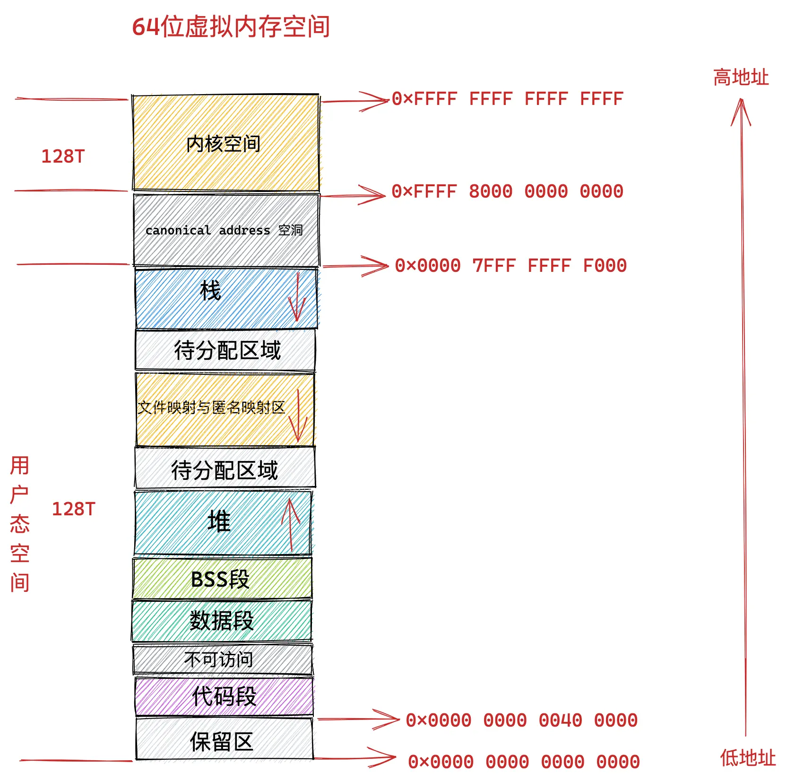

我们来看下内核在 /arch/x86/include/asm/page_64_types.h 文件中关于 TASK_SIZE 的定义。

```c
#define TASK_SIZE	(test_thread_flag(TIF_ADDR32) ? \ 
		IA32_PAGE_OFFSET : TASK_SIZE_MAX) 
#define	TASK_SIZE_MAX	task_size_max() 
#define task_size_max()	((_AC(1,UL) << __VIRTUAL_MASK_SHIFT) - PAGE_SIZE) #define __VIRTUAL_MASK_SHIFT	47
```

内核中采用了一个叫做内存描述符的 mm_struct 结构体来表示进程虚拟内存空间的全部信息。这个描述符提供了用户空间区域的划分：

```c
struct mm_struct { 
    unsigned long task_size; /* size of task vm space */ 
    unsigned long start_code, end_code, start_data, end_data; 
    unsigned long start_brk, brk, start_stack; 
    unsigned long arg_start, arg_end, env_start, env_end;
    unsigned long mmap_base; /* base of mmap area */ 
    unsigned long total_vm; /* Total pages mapped */ 
    unsigned long locked_vm; /* Pages that have PG_mlocked set */ 
    unsigned long pinned_vm; /* Refcount permanently increased */ 
    unsigned long data_vm; /* VM_WRITE & ~VM_SHARED & ~VM_STACK */ 
    unsigned long exec_vm; /* VM_EXEC & ~VM_WRITE & ~VM_STACK */ 
    unsigned long stack_vm; /* VM_STACK */ .
    ..... 省略 ........ 
}
```

最后的映射是这样的：


### 虚拟内存区域(VMA)管理

在经过划分之后，vm_area_struct提供了虚拟内存区域(Virtual Memory Area，VMA)的管理与访问：

```c
struct vm_area_struct {
        struct mm_struct * vm_mm;       /* VM area parameters */
        unsigned long vm_start;
        unsigned long vm_end;
        pgprot_t vm_page_prot;
        unsigned short vm_flags;
/* AVL tree of VM areas per task, sorted by address */
        short vm_avl_height;
        struct vm_area_struct * vm_avl_left;
        struct vm_area_struct * vm_avl_right;
/* linked list of VM areas per task, sorted by address */
        struct vm_area_struct * vm_next;
/* for areas with inode, the circular list inode->i_mmap */
/* for shm areas, the circular list of attaches */
/* otherwise unused */
        struct vm_area_struct * vm_next_share;
        struct vm_area_struct * vm_prev_share;
/* more */
        struct vm_operations_struct * vm_ops;
        unsigned long vm_offset;
        struct inode * vm_inode;
        unsigned long vm_pte;                   /* shared mem */
};
```

每个 ` vm_area_struct` 结构对应于虚拟内存空间中的唯一虚拟内存区域 VMA，`vm_start `指向了这块虚拟内存区域的起始地址（最低地址），`vm_start` 本身包含在这块虚拟内存区域内。`vm_end `指向了这块虚拟内存区域的结束地址（最高地址），而 `vm_end`本身包含在这块虚拟内存区域之外，所以 `vm_area_struct` 结构描述的是 [vm_start，vm_end) 这样一段**左闭右开**的虚拟内存区域。

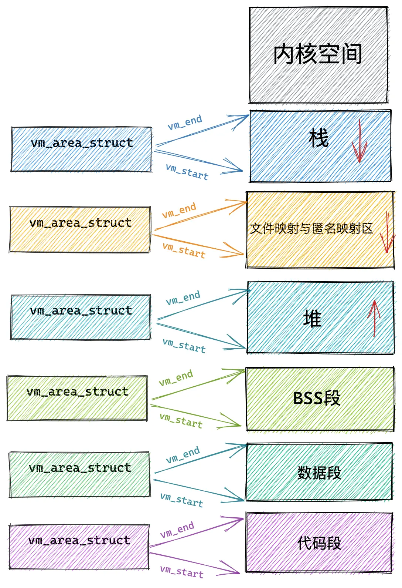

### 虚拟内存访问权限

`vm_page_prot` 和 `vm_flags` 都是用来标记 `vm_area_struct` 结构表示的这块虚拟内存区域的访问权限和行为规范。

前文我们提到，内核会将整块物理内存划分为一页一页大小的区域，以页为单位来管理这些物理内存，每页大小默认 4K 。`vm_page_prot` 偏向于定义底层内存管理架构中页这一级别的访问控制权限，它可以直接应用在底层页表中，它是一个具体的概念。

```c
/*
 * vm_flags..
 */
#define VM_READ         0x0001  /* currently active flags */
#define VM_WRITE        0x0002
#define VM_EXEC         0x0004
#define VM_SHARED       0x0008

#define VM_MAYREAD      0x0010  /* limits for mprotect() etc */
#define VM_MAYWRITE     0x0020
#define VM_MAYEXEC      0x0040
#define VM_MAYSHARE     0x0080

#define VM_GROWSDOWN    0x0100  /* general info on the segment */
#define VM_GROWSUP      0x0200
#define VM_SHM          0x0400  /* shared memory area, don't swap out */
#define VM_DENYWRITE    0x0800  /* ETXTBSY on write attempts.. */

#define VM_EXECUTABLE   0x1000
#define VM_LOCKED       0x2000

#define VM_STACK_FLAGS  0x0177

/*
 * mapping from the currently active vm_flags protection bits (the
 * low four bits) to a page protection mask..
 */
extern pgprot_t protection_map[16];

```

对于下图中例子：

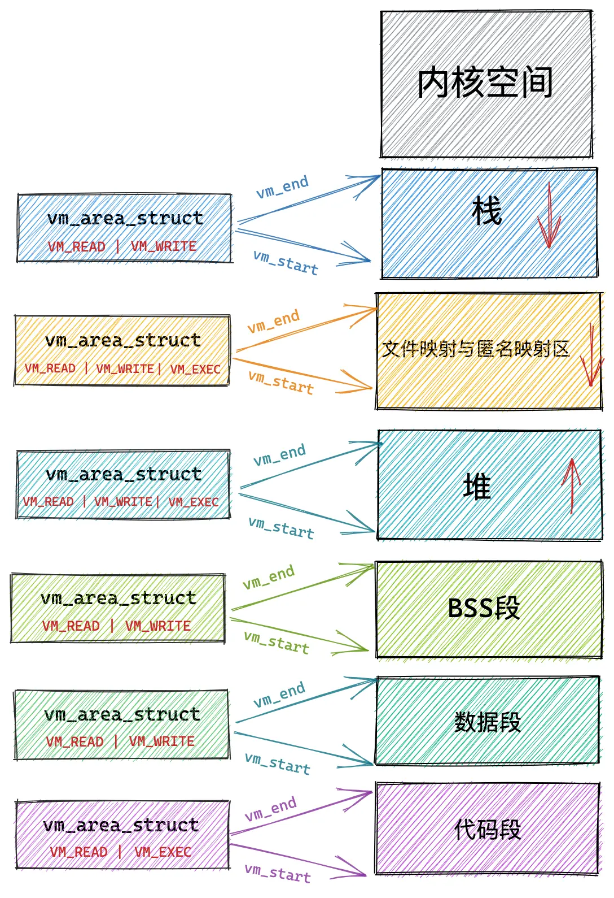

VM_SHARD 用于指定这块虚拟内存区域映射的物理内存是否可以在多进程之间共享，以便完成进程间通讯。

VM_IO 的设置表示这块虚拟内存区域可以映射至设备 IO 空间中。通常在设备驱动程序执行 mmap 进行 IO 空间映射时才会被设置。

VM_RESERVED 的设置表示在内存紧张的时候，这块虚拟内存区域非常重要，不能被换出到磁盘中。

VM_SEQ_READ 的设置用来暗示内核，应用程序对这块虚拟内存区域的读取是会采用顺序读的方式进行，内核会根据实际情况决定预读后续的内存页数，以便加快下次顺序访问速度。

VM_RAND_READ 的设置会暗示内核，应用程序会对这块虚拟内存区域进行随机读取，内核则会根据实际情况减少预读的内存页数甚至停止预读。

### 关联内存映射中的映射关系

接下来的三个属性 `anon_vma`，`vm_file`，`vm_pgoff` 分别和虚拟内存映射相关，虚拟内存区域可以映射到物理内存上，也可以映射到文件中，映射到物理内存上我们称之为匿名映射，映射到文件中我们称之为文件映射。

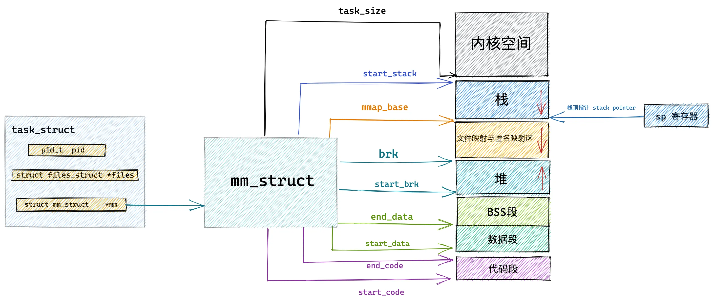

当我们调用 malloc 申请内存时，如果申请的是**小块内存**（低于 128K）则会使用 `do_brk()` 系统调用通过调整堆中的 brk 指针大小来增加或者回收堆内存。

如果申请的是比较**大块的内存**（超过 128K）时，则会调用 mmap 在上图虚拟内存空间中的文件映射与匿名映射区创建出一块 VMA 内存区域（这里是匿名映射）。这块匿名映射区域就用 `struct anon_vma` 结构表示。

当调用 mmap 进行文件映射时，`vm_file` 属性就用来关联被映射的文件。这样一来虚拟内存区域就与映射文件关联了起来。`vm_pgoff` 则表示映射进虚拟内存中的文件内容，在文件中的偏移。

### 虚拟内存中的操作

`vm_ops` 用来指向针对虚拟内存区域 VMA 的相关操作的函数指针。

```c
/*
 * These are the virtual MM functions - opening of an area, closing and
 * unmapping it (needed to keep files on disk up-to-date etc), pointer
 * to the functions called when a no-page or a wp-page exception occurs. 
 */
struct vm_operations_struct {
        void (*open)(struct vm_area_struct * area);
        void (*close)(struct vm_area_struct * area);
        void (*unmap)(struct vm_area_struct *area, unsigned long, size_t);
        void (*protect)(struct vm_area_struct *area, unsigned long, size_t, unsigned int newprot);
        int (*sync)(struct vm_area_struct *area, unsigned long, size_t, unsigned int flags);
        void (*advise)(struct vm_area_struct *area, unsigned long, size_t, unsigned int advise);
        unsigned long (*nopage)(struct vm_area_struct * area, unsigned long address, int write_access);
        unsigned long (*wppage)(struct vm_area_struct * area, unsigned long address,
                unsigned long page);
        int (*swapout)(struct vm_area_struct *,  unsigned long, pte_t *);
        pte_t (*swapin)(struct vm_area_struct *, unsigned long, unsigned long);
};
```

`struct vm_operations_struct` 结构中定义的都是对虚拟内存区域 VMA 的相关操作函数指针。

### 虚拟内存区域在内核中的组织

参考 `vm_area_struct`的源码，在内核中其实是通过一个 `struct vm_area_struct `结构的双向链表将虚拟内存空间中的这些虚拟内存区域 VMA 串联起来的。

`vm_area_struct` 结构中的 `vm_next`，`vm_prev` 指针分别指向 VMA 节点所在双向链表中的后继节点和前驱节点，内核中的这个 VMA 双向链表是有顺序的，所有 VMA 节点按照低地址到高地址的增长方向排序。

双向链表中的最后一个 VMA 节点的 `vm_next` 指针指向 NULL，双向链表的头指针存储在内存描述符 `struct mm_struct` 结构中的 mmap 中，正是这个 mmap 串联起了整个虚拟内存空间中的虚拟内存区域。

```c
struct mm_struct {
	struct vm_area_struct *mmap;	/* list of VMAs */
}
```

在每个虚拟内存区域 VMA 中又通过 `struct vm_area_struct` 中的 `vm_mm`指针指向了所属的虚拟内存空间 `mm_struct`。

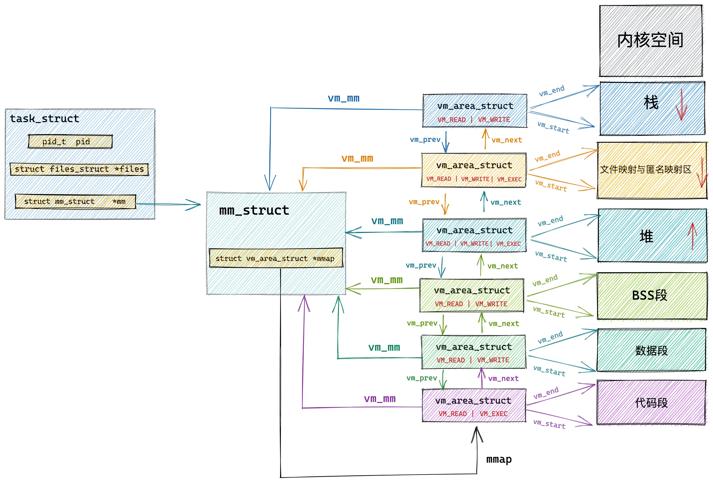

我们可以通过 cat /proc/pid/maps 或者 pmap pid 查看进程的虚拟内存空间布局以及其中包含的所有内存区域。这两个命令背后的实现原理就是通过遍历内核中的这个 `vm_area_struct` 双向链表获取的。

内核中关于这些虚拟内存区域的操作除了遍历之外还有许多需要根据特定虚拟内存地址在虚拟内存空间中查找特定的虚拟内存区域。

 尤其在进程虚拟内存空间中包含的内存区域 VMA 比较多的情况下，使用红黑树查找特定虚拟内存区域的时间复杂度是 O( logN ) ，可以显著减少查找所需的时间。

 所以在内核中，同样的内存区域 `vm_area_struct `会有两种组织形式，一种是双向链表用于高效的遍历，另一种就是红黑树用于高效的查找。

每个 VMA 区域都是红黑树中的一个节点，通过 `struct vm_area_struct` 结构中的 `vm_rb `将自己连接到红黑树中。

而红黑树中的根节点存储在内存描述符 `struct mm_struct `中的 `mm_rb` 中：

```c
struct mm_stuct {
	struct rb_root mm_rb;
}
```

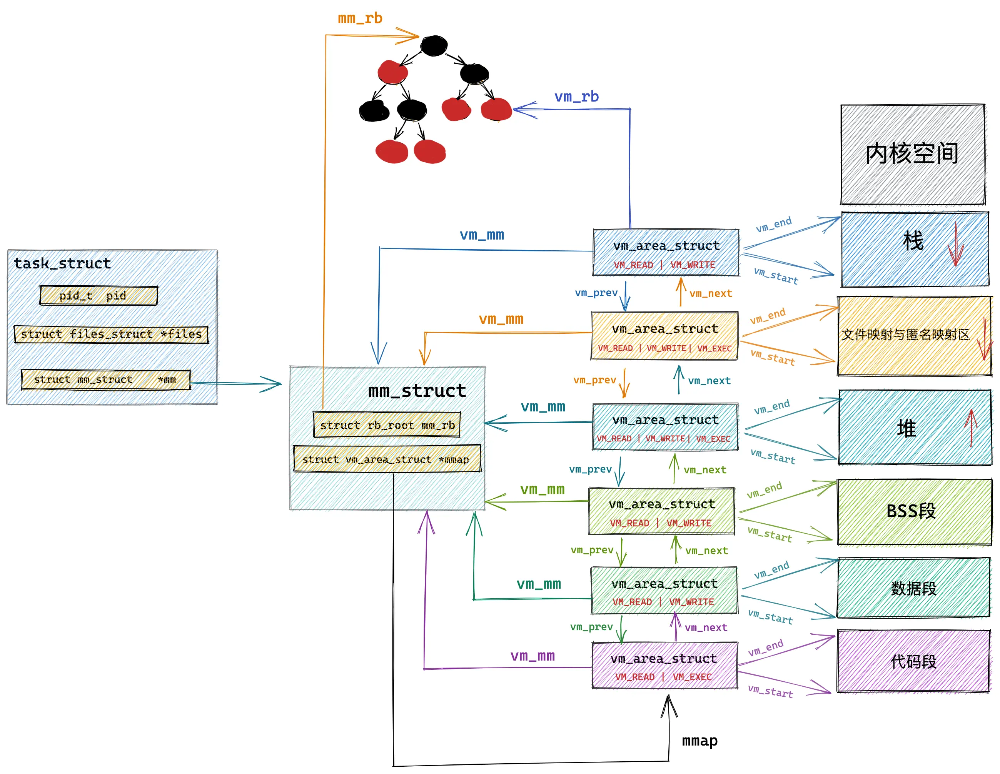

### 虚拟内存映射

程序代码编译之后会生成一个 **ELF 格式**的二进制文件，这个二进制文件中包含了程序运行时所需要的元信息，比如程序的机器码，程序中的全局变量以及静态变量等。

这个 ELF 格式的二进制文件中的布局和我们前边讲的虚拟内存空间中的布局类似，也是一段一段的，每一段包含了不同的元数据。

:::note

磁盘文件中的段我们叫做 **Section**，内存中的段我们叫做 **Segment**，也就是内存区域。

:::

磁盘文件中的这些 Section 会在进程运行之前加载到内存中并映射到内存中的 Segment。通常是多个 Section 映射到一个 Segment。

比如磁盘文件中的 .text，.rodata 等一些只读的 Section，会被映射到内存的一个只读可执行的 Segment 里（代码段）。而 .data，.bss 等一些可读写的 Section，则会被映射到内存的一个具有读写权限的 Segment 里（数据段，BSS 段）。

内核中完成这个映射过程的函数是 `load_elf_binary()` ，这个函数的作用很大，**加载内核的是它，启动第一个用户态进程 init 的是它，fork 完了以后，调用 exec 运行一个二进制程序的也是它**。

当 exec 运行一个二进制程序的时候，除了解析 ELF 的格式之外，另外一个重要的事情就是建立上述提到的内存映射。

```c
static int load_elf_binary(struct linux_binprm *bprm)
{
      ...... 省略 ........
  // 设置虚拟内存空间中的内存映射区域起始地址 mmap_base
  setup_new_exec(bprm);
 
     ...... 省略 ........
  // 创建并初始化栈对应的 vm_area_struct 结构。
  // 设置 mm->start_stack 就是栈的起始地址也就是栈底，并将 mm->arg_start 是指向栈底的。
  retval = setup_arg_pages(bprm, randomize_stack_top(STACK_TOP),
         executable_stack);
 
     ...... 省略 ........
  // 将二进制文件中的代码部分映射到虚拟内存空间中
  error = elf_map(bprm->file, load_bias + vaddr, elf_ppnt,
        elf_prot, elf_flags, total_size);
 
     ...... 省略 ........
 // 创建并初始化堆对应的的 vm_area_struct 结构
 // 设置 current->mm->start_brk = current->mm->brk，设置堆的起始地址 start_brk，结束地址 brk。 起初两者相等表示堆是空的
  retval = set_brk(elf_bss, elf_brk, bss_prot);
 
     ...... 省略 ........
  // 将进程依赖的动态链接库 .so 文件映射到虚拟内存空间中的内存映射区域
  elf_entry = load_elf_interp(&loc->interp_elf_ex,
              interpreter,
              &interp_map_addr,
              load_bias, interp_elf_phdata);
 
     ...... 省略 ........
  // 初始化内存描述符 mm_struct
  current->mm->end_code = end_code;
  current->mm->start_code = start_code;
  current->mm->start_data = start_data;
  current->mm->end_data = end_data;
  current->mm->start_stack = bprm->p;
 
     ...... 省略 ........
}
```

- `setup_new_exec` 设置虚拟内存空间中的内存映射区域起始地址 mmap_base
- `setup_arg_pages` 创建并初始化栈对应的 `vm_area_struct` 结构。置 mm->start_stack 就是栈的起始地址也就是栈底，并将 mm->arg_start 是指向栈底的。
- `elf_map` 将 ELF 格式的二进制文件中.text ，.data，.bss 部分映射到虚拟内存空间中的代码段，数据段，BSS 段中。
- `set_brk` 创建并初始化堆对应的的 vm_area_struct 结构，设置 `current->mm->start_brk = current->mm->brk`，设置堆的起始地址 start_brk，结束地址 brk。 起初两者相等表示堆是空的。
- `load_elf_interp` 将进程依赖的动态链接库 .so 文件映射到虚拟内存空间中的内存映射区域
- 初始化内存描述符 mm_struct

## 内核虚拟内存管理

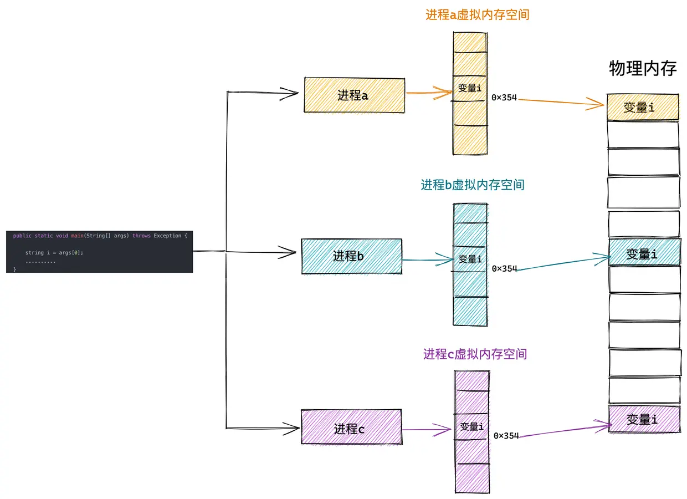

而内核态虚拟内存空间是所有进程共享的，不同进程进入内核态之后看到的虚拟内存空间全部是一样的。

例如，上图中的进程 a，进程 b，进程 c 分别在各自的**用户态虚拟内存空间**中访问虚拟地址 x 。由于进程之间的用户态虚拟内存空间是相互隔离相互独立的，虽然在进程a，进程b，进程c 访问的都是虚拟地址 x 但是看到的内容却是不一样的（**映射到不同的物理内存中**）。

但是当进程 a，进程 b，进程 c 进入到内核态之后，由于内核虚拟内存空间是各个进程共享的，所以它们在内核空间中看到的内容全部是一样的，比如进程 a，进程 b，进程 c 在内核态都去访问虚拟地址 y。这时它们看到的内容就是一样的了。

### 32位内核虚拟内存空间布局

在 32 位体系结构下进程用户态虚拟内存空间为 3 GB，虚拟内存地址范围为：0x0000 0000 - 0xC000 000 。内核态虚拟内存空间为 1 GB，虚拟内存地址范围为：0xC000 000 - 0xFFFF FFFF。

本小节我们主要关注 0xC000 000 - 0xFFFF FFFF 这段虚拟内存地址区域也就是内核虚拟内存空间的布局情况。

#### 直接映射区

在总共大小 1G 的内核虚拟内存空间中，位于最前边有一块 896M 大小的区域，我们称之为**直接映射区**或者**线性映射区**，地址范围为 3G -- 3G + 896m 。

 之所以这块 896M 大小的区域称为直接映射区或者线性映射区，是因为这块连续的虚拟内存地址会映射到 0 - 896M 这块连续的物理内存上。

也就是说 3G -- 3G + 896m 这块 896M 大小的虚拟内存会直接映射到 0 - 896M 这块 896M 大小的物理内存上，这块区域中的虚拟内存地址直接减去 0xC000 0000 (3G) 就得到了物理内存地址。所以我们称这块区域为直接映射区。

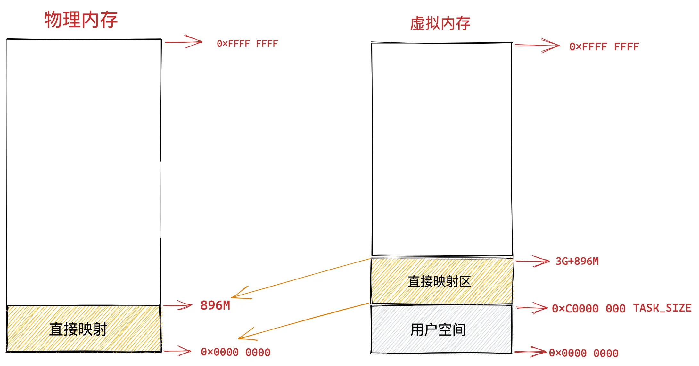

在这段 896M 大小的物理内存中，前 1M 已经在系统启动的时候被系统占用，1M 之后的物理内存存放的是**内核代码段，数据段，BSS 段**（这些信息起初存放在 ELF格式的二进制文件中，在系统启动的时候被加载进内存）。

进程相关的数据结构也会存放在物理内存前 896M 的这段区域中，当然也会被直接映射至内核态虚拟内存空间中的 3G -- 3G + 896m 这段直接映射区域中。例如，task_struct，mm_struct，vm_area_struct等。

在 X86 体系结构下，ISA 总线的 DMA （直接内存存取）控制器，只能对内存的前16M 进行寻址，这就导致了 ISA 设备不能在整个 32 位地址空间中执行 DMA，只能使用物理内存的前 16M 进行 DMA 操作。

因此直接映射区的前 16M 专门让内核用来为 DMA 分配内存，这块 16M 大小的内存区域我们称之为 ZONE_DMA。

而直接映射区中剩下的部分也就是从 16M 到 896M（不包含 896M）这段区域，我们称之为 ZONE_NORMAL。从字面意义上我们可以了解到，这块区域包含的就是正常的页框（使用没有任何限制）。

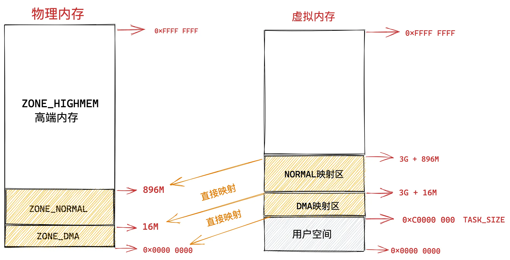

#### 高内存区

物理内存 896M 以上的区域被内核划分为 ZONE_HIGHMEM 区域，我们称之为**高端内存**。

由于内核虚拟内存空间中的前 896M 虚拟内存已经被直接映射区所占用，而在 32 体系结构下内核虚拟内存空间总共也就 1G 的大小，这样一来内核剩余可用的虚拟内存空间就变为了 1G - 896M = 128M。

显然物理内存中 3200M 大小的 ZONE_HIGHMEM 区域无法继续通过直接映射的方式映射到这 128M 大小的虚拟内存空间中。

这样一来物理内存中的 ZONE_HIGHMEM 区域就只能采用**动态映射**的方式映射到 128M 大小的内核虚拟内存空间中，也就是说只能动态的**一部分一部分的分批映射**，先映射正在使用的这部分，使用完毕解除映射，接着映射其他部分。

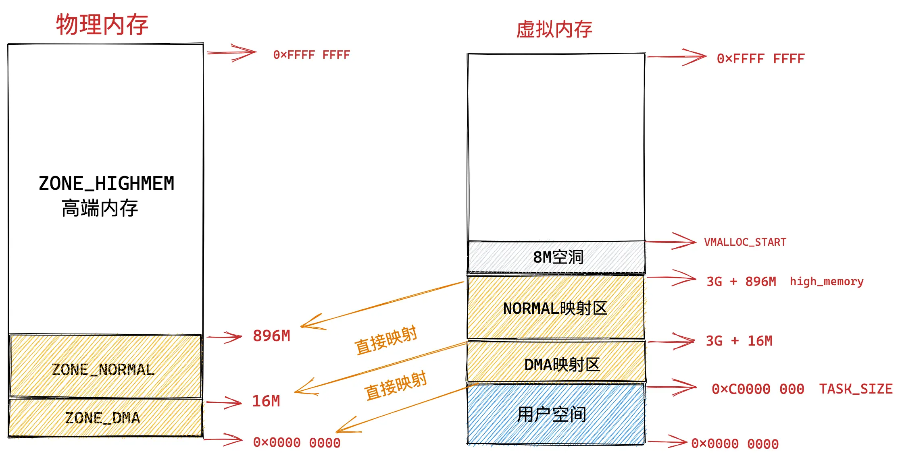

内核虚拟内存空间中的 3G + 896M 这块地址在内核中定义为 high_memory，high_memory 往上有一段 8M 大小的内存空洞。空洞范围为：high_memory 到  VMALLOC_START 。

VMALLOC_START 定义在内核源码 `/arch/x86/include/asm/pgtable_32_areas.h`

```c
/*
 * Just any arbitrary offset to the start of the vmalloc VM area: the
 * current 8MB value just means that there will be a 8MB "hole" after the
 * physical memory until the kernel virtual memory starts.  That means that
 * any out-of-bounds memory accesses will hopefully be caught.
 * The vmalloc() routines leaves a hole of 4kB between each vmalloced
 * area for the same reason. ;)
 */
#define VMALLOC_OFFSET	(8 * 1024 * 1024)

#ifndef __ASSEMBLY__
externbool __vmalloc_start_set; /* set once high_memory is set */
#endif

#define VMALLOC_START	((unsigned long)high_memory + VMALLOC_OFFSET)
```

#### VMalloc动态映射区

接下来 VMALLOC_START 到 VMALLOC_END 之间的这块区域成为**动态映射区**。采用动态映射的方式映射物理内存中的高端内存。

```c
#ifdef CONFIG_HIGHMEM
# define VMALLOC_END	(PKMAP_BASE - 2 * PAGE_SIZE)
#else
# define VMALLOC_END	(LDT_BASE_ADDR - 2 * PAGE_SIZE)
#endif

```

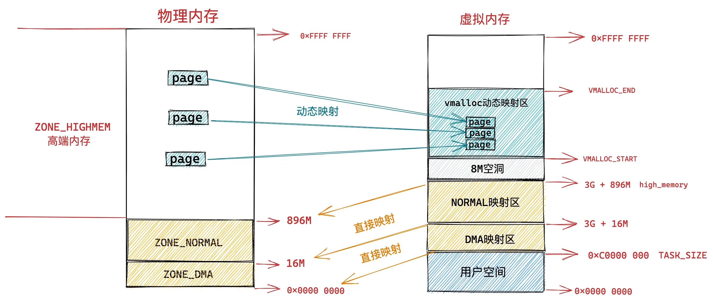

和用户态进程使用 `malloc` 申请内存一样，在这块动态映射区内核是使用 `vmalloc` 进行内存分配。由于之前介绍的动态映射的原因，`vmalloc` 分配的内存**在虚拟内存上是连续的**，但是**物理内存是不连续的**。通过页表来建立物理内存与虚拟内存之间的映射关系，从而可以将不连续的物理内存映射到连续的虚拟内存上。

#### 永久映射区

而在 PKMAP_BASE 到 FIXADDR_START 之间的这段空间称为**永久映射区**。在内核的这段虚拟地址空间中允许建立**与物理高端内存的长期映射关系**。比如内核通过 `alloc_pages()` 函数在物理内存的高端内存中申请获取到的物理内存页，这些物理内存页可以通过调用 `kmap `映射到永久映射区中。

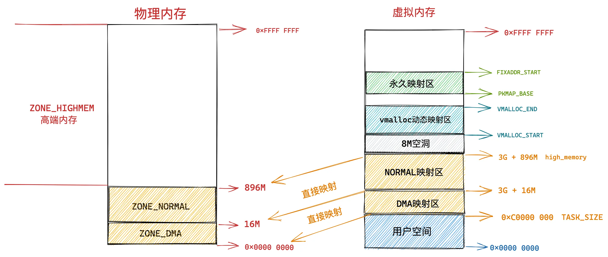

:::important

`LAST_PKMAP` 表示永久映射区可以映射的页数限制。

:::

```c
#ifdef CONFIG_X86_PAE
#define LAST_PKMAP 512
#else
#define LAST_PKMAP 1024
#endif
```

#### 固定映射区

内核虚拟内存空间中的下一个区域为**固定映射区**，区域范围为：FIXADDR_START 到 FIXADDR_TOP。

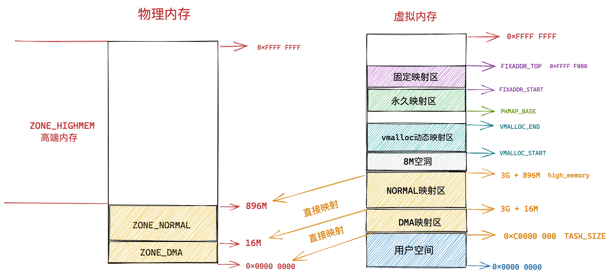

FIXADDR_START 和 FIXADDR_TOP 定义在内核源码 `/arch/x86/include/asm/fixmap.h`

```c
/*
 * We can't declare FIXADDR_TOP as variable for x86_64 because vsyscall
 * uses fixmaps that relies on FIXADDR_TOP for proper address calculation.
 * Because of this, FIXADDR_TOP x86 integration was left as later work.
 */
#ifdef CONFIG_X86_32
/* used by vmalloc.c, vsyscall.lds.S.
 *
 * Leave one empty page between vmalloc'ed areas and
 * the start of the fixmap.
 */
extern unsigned long __FIXADDR_TOP;
#define FIXADDR_TOP	((unsigned long)__FIXADDR_TOP)

#define FIXADDR_USER_START     __fix_to_virt(FIX_VDSO)
#define FIXADDR_USER_END       __fix_to_virt(FIX_VDSO - 1)
#else
#define FIXADDR_TOP	(VSYSCALL_END-PAGE_SIZE)

/* Only covers 32bit vsyscalls currently. Need another set for 64bit. */
#define FIXADDR_USER_START	((unsigned long)VSYSCALL32_VSYSCALL)
#define FIXADDR_USER_END	(FIXADDR_USER_START + PAGE_SIZE)
#endif
```

在内核虚拟内存空间的直接映射区中，直接映射区中的虚拟内存地址与物理内存前 896M 的空间的映射关系都是预设好的，**一比一映射**。

在固定映射区中的虚拟内存地址可以**自由映射**到物理内存的高端地址上，但是与动态映射区以及永久映射区不同的是，在固定映射区中虚拟地址是固定的，而被映射的物理地址是可以改变的。也就是说，有些虚拟地址在编译的时候就固定下来了，是在内核启动过程中被确定的，而这些虚拟地址对应的物理地址不是固定的。采用固定虚拟地址的好处是**它相当于一个指针常量（常量的值在编译时确定），指向物理地址，如果虚拟地址不固定，则相当于一个指针变量**。

那为什么会有固定映射这个概念呢 ?

 一个应用是：在内核的启动过程中，有些模块需要使用虚拟内存并映射到指定的物理地址上，而且这些模块也没有办法等待完整的内存管理模块初始化之后再进行地址映射。因此，内核固定分配了一些虚拟地址，**这些地址有固定的用途**，使用该地址的模块在初始化的时候，将这些固定分配的虚拟地址映射到指定的物理地址上去。

#### 临时映射区

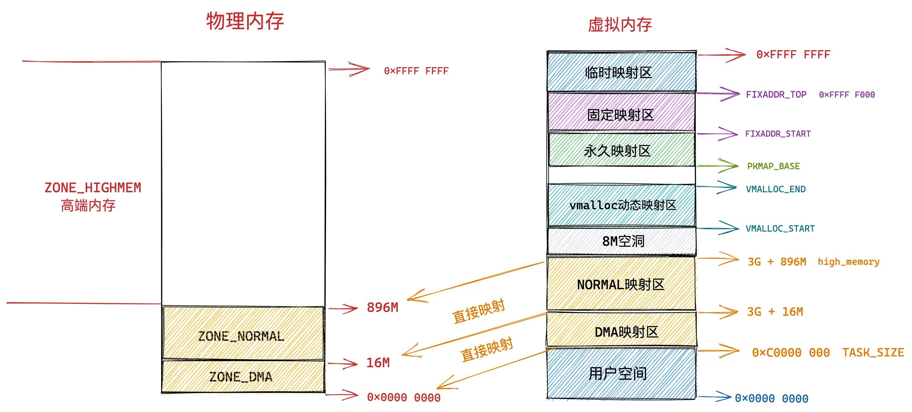

这段地址就只是其他地址的中转站，在此不多作介绍了。

#### 32位总结

结合上面介绍的内容：

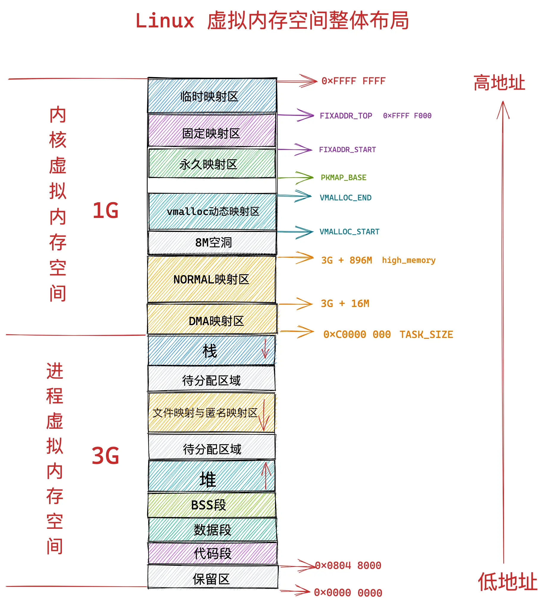

### 64位内核虚拟内存映射

到了 64 位体系下，内核虚拟内存空间的布局和管理就变得容易多了，因为进程虚拟内存空间和内核虚拟内存空间各自占用 128T 的虚拟内存，实在是太大了，我们可以在这里边随意翱翔，随意挥霍。

因此在 64 位体系下的内核虚拟内存空间与物理内存的映射就变得非常简单，由于虚拟内存空间足够的大，即便是内核要访问全部的物理内存，直接映射就可以了，不在需要用到前面介绍的**高端内存**那种**动态映射**方式。

在 64 位系统中，只使用了其中的低 48 位来表示虚拟内存地址。其中用户态虚拟内存空间为低 128 T，虚拟内存地址范围为：0x0000 0000 0000 0000 - 0x0000 7FFF FFFF F000 。

内核态虚拟内存空间为高 128 T，虚拟内存地址范围为：0xFFFF 8000 0000 0000 - 0xFFFF FFFF FFFF FFFF 。

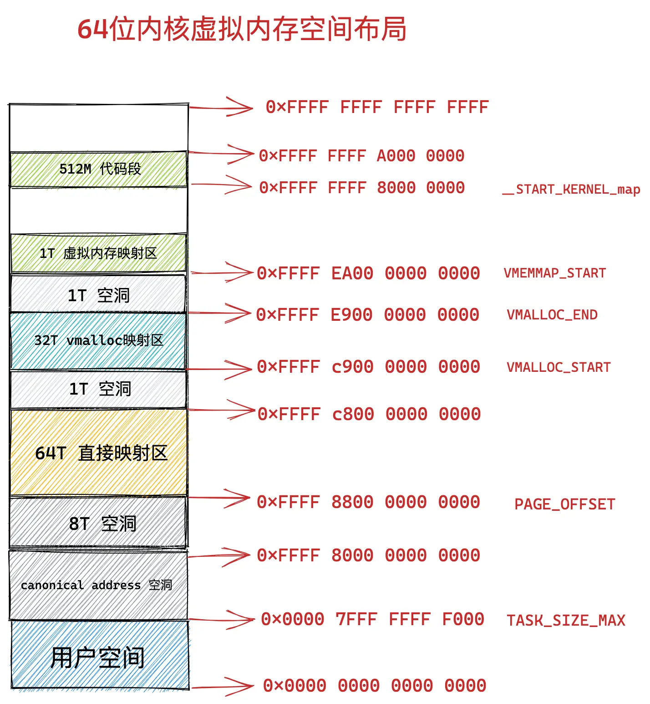

64 位内核虚拟内存空间从 0xFFFF 8000 0000 0000 开始到 0xFFFF 8800 0000 0000 这段地址空间是一个 8T 大小的内存空洞区域。

紧着着 8T 大小的内存空洞下一个区域就是 64T 大小的直接映射区。这个区域中的虚拟内存地址减去 PAGE_OFFSET 就直接得到了物理内存地址。

```c
#define __PAGE_OFFSET_BASE	_AC(0xffff880000000000,UL)
#define __PAGE_OFFSET		__PAGE_OFFSET_BASE
```

从图中 VMALLOC_START 到 VMALLOC_END 的这段区域是 32T 大小的 vmalloc 映射区，这里类似用户空间中的堆，内核在这里使用 vmalloc 系统调用申请内存。

```c
#define __VMALLOC_BASE_L4	0xffffc90000000000UL

#define VMEMMAP_START		__VMALLOC_BASE_L4

#define VMEMMAP_END		(VMALLOC_START + (VMALLOC_SIZE_TB << 40) - 1)
```

从 VMEMMAP_START 开始是 1T 大小的虚拟内存映射区，用于存放物理页面的描述符 struct page 结构用来表示物理内存页。

```c
#define __VMEMMAP_BASE_L4	0xffffea0000000000UL

#define VMEMMAP_START		__VMEMMAP_BASE_L4
```

从 __START_KERNEL_map 开始是大小为 512M 的区域用于存放内核代码段、全局变量、BSS 等。这里对应到物理内存开始的位置，减去 __START_KERNEL_map 就能得到物理内存的地址。这里和直接映射区有点像，但是不矛盾，因为直接映射区之前有 8T 的空洞区域，早就过了内核代码在物理内存中加载的位置。

```c
#define __START_KERNEL_map	_AC(0xffffffff80000000,UL)
```

至此，我们已经看到了64位虚拟内存布局的全貌：

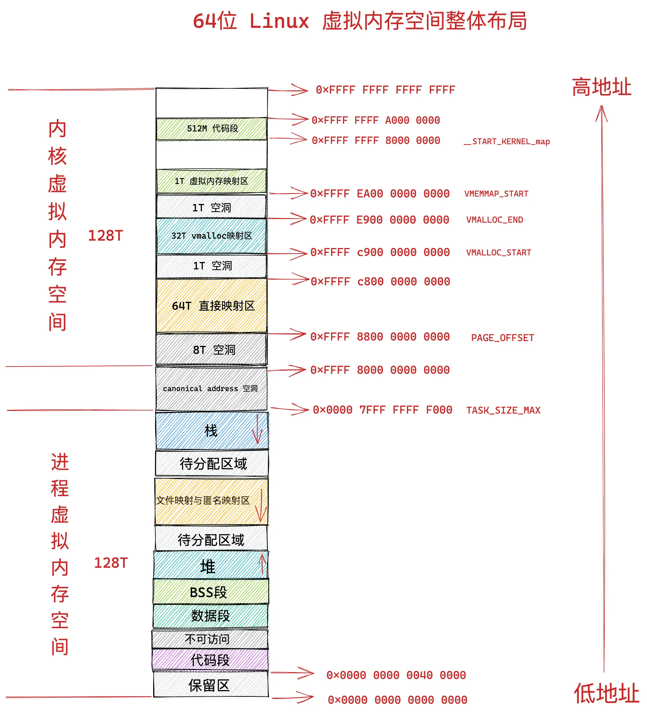

## 总结

本文参考：

[小林Coding](https://xiaolincoding.com/)

[bootlin](https://elixir.bootlin.com/)

太多了这篇...
