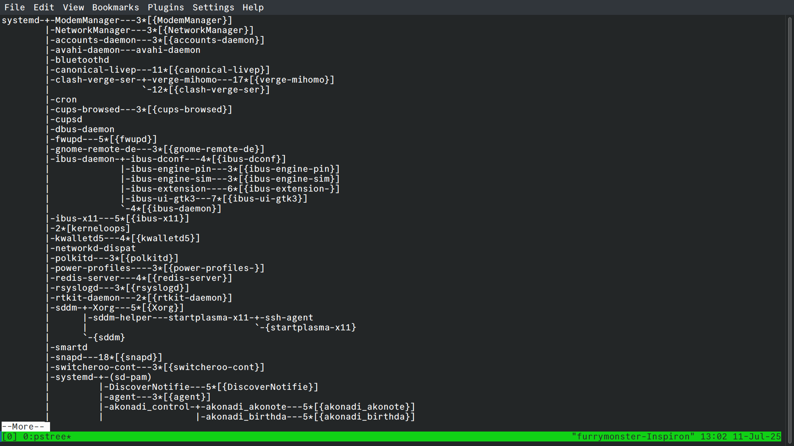
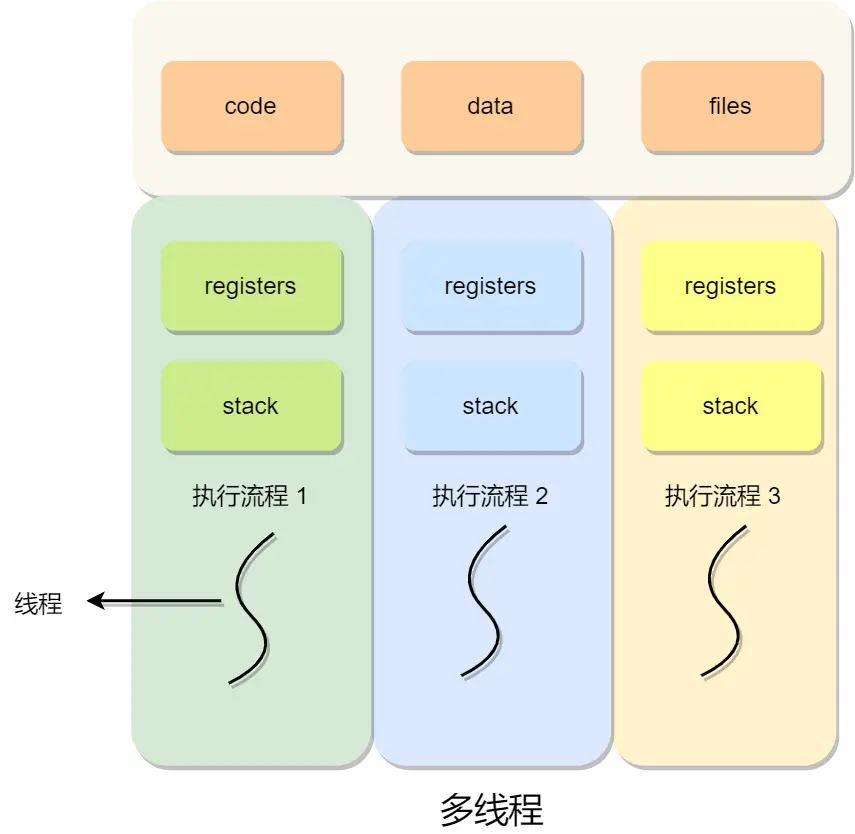
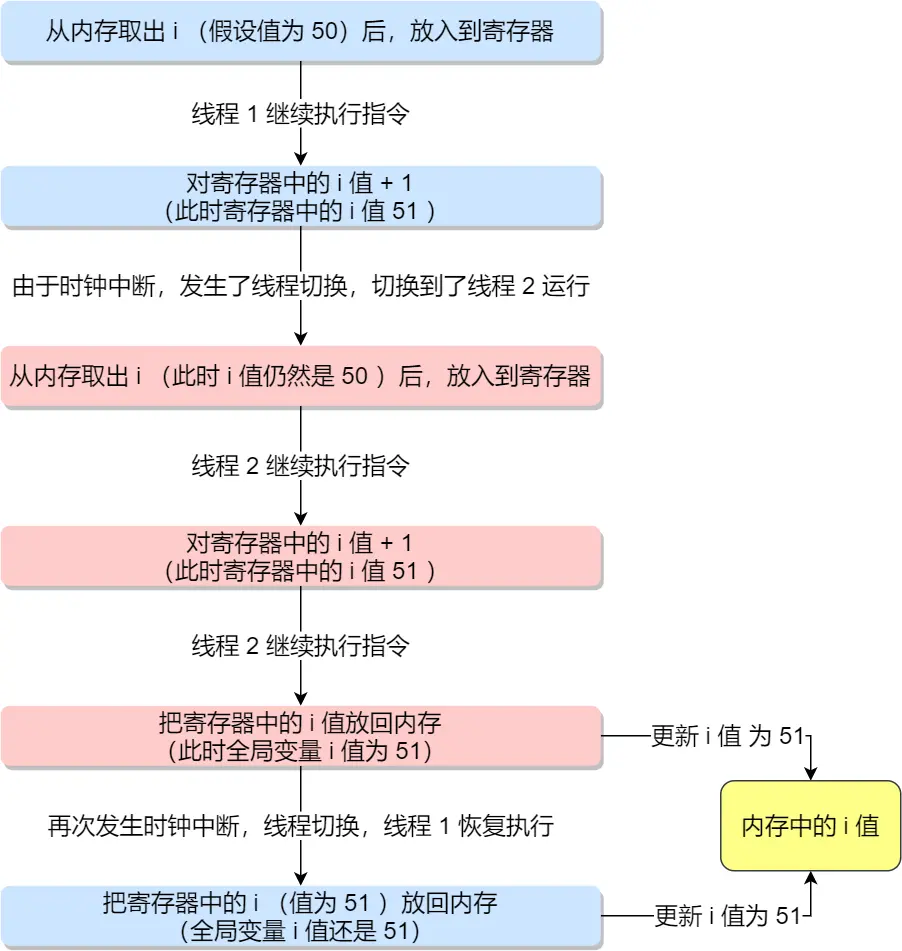
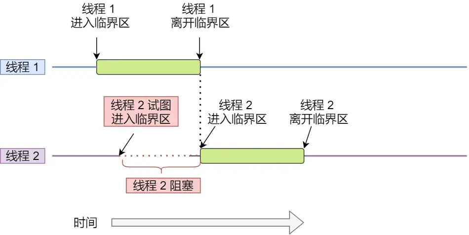
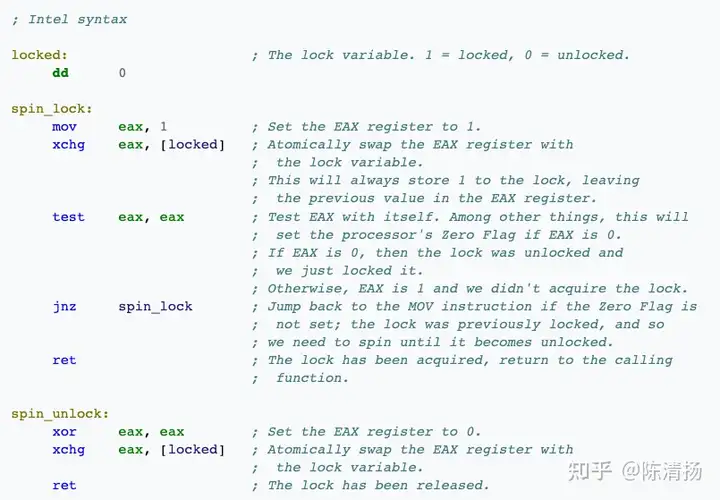
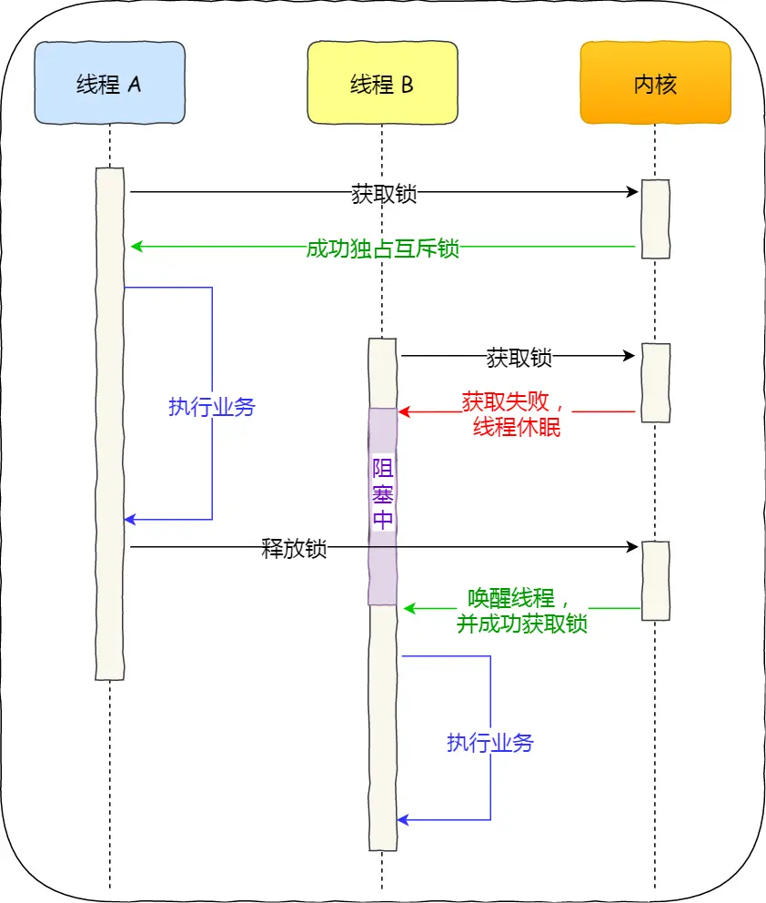
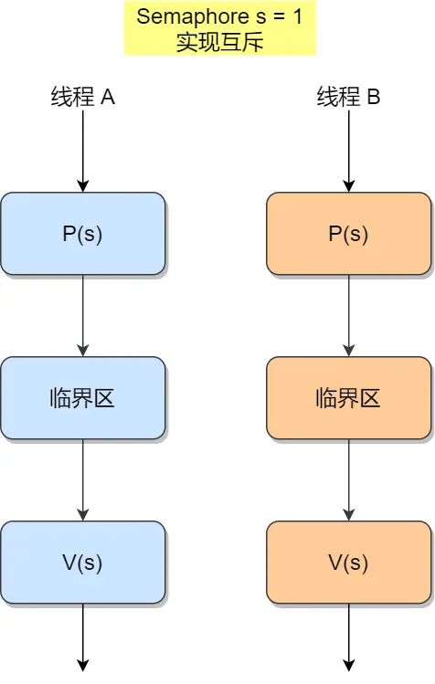

2005年3月，C++大师Herb Sutter在Dr.Dobb’s Journal上发表了一篇名为《免费的午餐已经结束》的文章指出：

> 现在的程序员对效率、伸缩性、吞吐量等一系列性能指标相当忽视，很多性能问题都依仗越来越快的CPU来解决。但CPU的速度很快将偏离摩尔定律的轨迹，并达到一定的极限。所以，越来越多的应用程序将不得不直面性能问题。而解决这些问题的办法就是采用并发编程技术。

当你读到这里的时候，第一感觉可能就是“不敢苟同”，觉得作者在危言耸听，妖言惑众，过分渲染并发编程的重要性。

其实不然，正如Herb Sutter所说，由于串行处理速度的限制已经把**并发编程**推到了聚光灯下，串行化技术在程序设计中的砥柱地位在未来必将被取代，一个多核与并发编程的时代必将到来。

由于当今大多数程序员对并发编程还是一片空白，因此深入了解和学习并发编程已经刻不容缓。甚至，还有人提出了“不懂并发编程的程序员，不是一个合格的程序员”的观点。不管愿意接受与否，**免费的午餐**的确已经结束。

## 软件并发与线程冲突

并发总体上可分为三个层次：**软件级**的并发、**操作系统级**的并发和**硬件级**的并发。一般来讲，硬件级的并发和操作系统级的并发都会支持软件级的并发，由于操作系统级并发和硬件级的并发不是我们普通程序员所能支配的，所以我们着重关注**软件级的并发**。

**并行**和**分布式编程**是达到软件级并发的两种基本途径。它们是两种不同的，但有时又相互交叉的编程方法。

并行编程技术是将程序分配给单个或多个处理器运行，这些处理器通常在某一个物理或虚拟的计算机内；

而分布式编程技术是将程序分配给两个或多个处理器运行，这些处理器可能在也可能不在同一个计算机中。

不过，今天我们的主题不是软件工程，对于并发这个概念，只需要知道CPU同时轮切多个程序，每次执行一个很短的时间片，从而产生了"并发"的假象就可以了。

另外，操作系统也为每个进程创建巨大、私有的虚拟内存的假象，这种地址空间的抽象让每个程序好像拥有自己的内存，而实际上操作系统在背后秘密地让多个地址空间「复用」物理内存或者磁盘。

一个程序（这里特指一个进程，许多类似音乐软件的程序或许会在后台启动很多音频编解码的服务）常常会包含多个线程，使用 `pstree`指令可以清晰地看到进程背后管理的多个线程：



以ibus输入法为例，它管理了5个不同的线程。

线程是Linux环境下调度的基本单位，而进程则是资源分配的基本单位，所有线程在创建时会共用相同的进程资源。也就是说，线程之间的代码段，堆空间，数据段，文件都是共享的，唯一的不同就是每个线程会拥有自己单独的栈空间。



那么这个时候问题就来了，如果多个线程的执行逻辑出现冲突了怎么办？

我们用这样一段代码来模拟并发：

```cpp
#include <iostream>
#include <thread>

int i=0;

void mock_conflict(){
  // add one by one for global var i for 10000 times
  int num = 10000;

  for (int i=0; i<num; i++) {
    i = i+1;
  }
}

int main (int argc, char *argv[]) {
  std::cout << "Start All Threads." << std::endl;

  // create threads
  std::thread thread_1(mock_conflict);
  std::thread thread_2(mock_conflict);

  // waiting for completion of all threads
  thread_1.join();
  thread_2.join();

  std::cout << "All threads joined." << std::endl;

  std::cout << "now the value of i is : " << i << std::endl;

  return 0;
}
```

最后得到的结果可能并不是我们预估的20000，而是一个0到20000之间的随机数。造成这种情况的正是时钟中断。

线程一执行的中途，从内存取i值得到50，加法器得到结果51，但并没有保存到内存，此时发生时钟中断，保存寄存器状态后，切换到线程2，它把上面的过程又进行了一次，得到51，然后存到内存里，继续执行。

当线程二执行一段时间得到类似11451的值之后，线程一又被切换回来，重新执行当时被中断的保存操作，又把51存回去了，这个时候就发生了线程冲突，内存里的i值就乱套了。



## 互斥与同步

上面我们介绍的"线程冲突"的情况称为**竞争条件(race condition)**，当多个线程共享相同资源的时候，会出现不可预知的小概率错误，例如在执行中途发生了上下文切换，最后得到了错误的结果，甚至是出现了错误的行为。这样的输出存在**不确定性**，我们当然不允许出现这样的情况。

多线程操作共享资源可能会导致竞争状态，我们能把多线程执行的这段代码称作**临界区**。

我们总是希望临界区的这段代码是**互斥的**，这样就可以避免很多不必要的可能性，换句话说，我们总是希望临界区只有一个线程在工作。



除了保证临界区的互斥，我们更希望，让两个线程分别执行不同的工作。例如让线程1来执行数据读入，线程2来进行数据计算，那么显然，线程2是以来线程1的结果的，这两个线程是相互依赖的，我们需要让线程2**等待**线程1完成他的工作（或者说完成到某一个阶段，之后线程1的行为不再影响线程2），这种相互制约的等待与相互通信就是进程/线程的**同步**。

互斥决定了线程之间的独立性，而同步决定了线程之间的顺序性，如果实现了同步，那么实现互斥我们只需要让它从线程代码的一开始就等待就可以了。

为了实现进程/线程之间的协作，操作系统本身就实现了一套完整的机制，当然这里我们只讨论较为简单的两种机制：

- 锁：加锁和解锁
- 信号量：P、V操作

## 锁机制

锁（Lock）是一种同步机制，用于限制对共享资源的访问，确保在同一时间只有一个线程或进程能够访问或修改该资源。

### 锁的核心作用

1. **互斥性** ：确保在任意时刻，只有一个线程/进程可以访问共享资源，防止并发访问导致的数据不一致。
2. **同步性** ：协调线程/进程的执行顺序，避免资源竞争或死锁问题。
3. **原子性** ：保证某些关键操作不可被中断，维护数据完整性。

### 锁的基本工作原理

1. **获取锁（Lock）** ：线程在访问共享资源前，尝试获取锁。如果锁可用，线程获得锁并继续执行；如果锁已被占用，线程可能被阻塞或进入自旋等待。
2. **释放锁（Unlock）** ：线程完成对共享资源的操作后，释放锁，允许其他线程获取锁。
3. **竞争与等待** ：当多个线程同时尝试获取锁时，锁机制会通过调度策略（如队列或优先级）决定哪个线程获得锁。

上面这些内容，只是对于锁的概括性描述，现在让我们走得更深入一些（以下是陈清扬教授的文章）：

### 锁的本质

 **所谓的锁，在计算机里本质上就是一块内存空间。** 当这个空间被赋值为1的时候表示加锁了，被赋值为0的时候表示解锁了，仅此而已。多个线程抢一个锁，就是抢着要把这块内存赋值为1。在一个多核环境里，内存空间是共享的。每个核上各跑一个线程，那如何保证一次只有一个线程成功抢到锁呢？你或许已经猜到了，这必须要硬件的支持，譬如提供某种特殊指令。

#### 硬件层

CPU如果提供一些用来构建锁的atomic指令，譬如x86的XCHG或CMPXCHG（加上LOCK prefix），能够完成atomic的compare-and-swap （CAS），用这样的硬件指令就能实现spin lock。本质上LOCK前缀的作用是锁定系统总线（或者锁定某一块cache line）来实现atomicity，可以了解下基础的缓存一致协议譬如MSEI。简单来说就是，如果指令前加了LOCK前缀，就是告诉其他核，一旦我开始执行这个指令了，在我结束这个指令之前，谁也不许动。缓存一致协议在这里面扮演了重要角色，这里先不赘述。这样便实现了一次只能有一个核对同一个内存地址赋值。

#### 操作系统层

但CPU提供了特殊硬件来保证内存操作的原子性的时候，再通过一种简单的逻辑，我们就可以构建出一个简单的锁来了。这个逻辑很简单，我们让多个线程持续地抢着将某块内存地址的值赋为1（原始为0），谁先抢到了谁就可以进入critical section，没抢到的线程继续在一个循环里面反复读取这块内存地址的值，看看自己的机会是不是到了。当抢到锁的线程在它的critical section结束以后，就可以把该内存地址的值赋为0，表示现在其他人可以抢锁了。这个算法可以用如下的X86汇编来表示（使用XCHG原子操作）:



用这种方式构建出来的锁也被称为spinlock（自旋锁），自旋的意思就是没有拿到锁的线程就在那儿自己转儿。

这样我们就通过CPU的atomic指令来实现的一个基本的锁，我们有锁啦！

有了这个锁以后我们其实还可以做一点点性能优化，为什么需要优化呢？如果我们上面所说，没有拿到锁的线程就得在那儿自个儿转，反复的读取那块内存空间，看看自己的机会是不是到了。如果说我们明知道这个等待时间是很长的，那就没有必要在那儿反复刷了。我们可以通过操作系统的介入，来实现一个线程向操作系统申请把自己挂起，就是先不刷了，还是把自己挂起，将CPU让出来，这样或许其他的线程能做点更有用的事情。通过这样一种机制构建出来的锁，常常被称为mutex，相当于是在长等待时间上对于自旋锁的一种优化。当然OS切换线程也需要一些开销，所以是否选择被挂起，取决于大概是否需要等很长时间。

在Linux中，这样的一种锁实现被称为**futex**（Fast Userlevel Mutex），宏观来讲，OS需要一些全局的数据结构来记录一个被挂起线程和对应的锁的映射关系，这样一个数据结构天然是全局的，因为多个OS线程可能同时操作它。所以， **实现高效的锁本身也需要锁。有没有一环套一环的感觉？** futex的巧妙之处就在于，它知道访问这个全局数据结构不会太耗时，于是futex里面的锁就是spin lock。linux上pthread mutex的实现就是用的futex。

具体的实现可以看以下文章：

[A futex overview and update](https://lwn.net/Articles/360699/)

### 互斥锁与自旋锁

最底层的两种就是会「互斥锁和自旋锁」，有很多高级的锁都是基于它们实现的，你可以认为它们是各种锁的地基，所以我们必须清楚它俩之间的区别和应用。

加锁的目的就是保证共享资源在任意时间里，只有一个线程访问，这样就可以避免多线程导致共享数据错乱的问题。

当已经有一个线程加锁后，其他线程加锁则就会失败，互斥锁和自旋锁对于加锁失败后的处理方式是不一样的：

- 互斥锁在加锁失败后，线程会自动释放CPU，把重要的工作交给其他线程
- 自旋锁在加锁失败后，线程会忙等待，直到它拿到锁

互斥锁是一种「独占锁」，比如当线程 A 加锁成功后，此时互斥锁已经被线程 A 独占了，只要线程 A 没有释放手中的锁，线程 B 加锁就会失败，于是就会释放 CPU 让给其他线程，既然线程 B 释放掉了 CPU，自然线程 B 加锁的代码就会被阻塞。

**对于互斥锁加锁失败而阻塞的现象，是由操作系统内核实现的**。当加锁失败时，内核会将线程置为「睡眠」状态，等到锁被释放后，内核会在合适的时机唤醒线程，当这个线程成功获取到锁后，于是就可以继续执行。如下图：



所以，互斥锁加锁失败时，会从用户态陷入到内核态，让内核帮我们切换线程，虽然简化了使用锁的难度，但是存在一定的性能开销成本，也就是会进行两次上下文切换：

- 第一次，当线程加锁失败时，内核会把线程的状态从「运行」状态设置为「睡眠」状态，然后把 CPU 切换给其他线程运行；
- 第二次，当锁被释放时，之前「睡眠」状态的线程会变为「就绪」状态，然后内核会在合适的时间，把 CPU 切换给该线程运行。

上下切换的耗时有大佬统计过，大概在几十纳秒到几微秒之间，如果你锁住的代码执行时间比较短，那可能上下文切换的时间都比你锁住的代码执行时间还要长。

所以，如果你能确定被锁住的代码执行时间很短，就不应该用互斥锁，而应该选用自旋锁，否则使用互斥锁。

自旋锁是通过 CPU 提供的CAS 指令实现的，在「用户态」完成加锁和解锁操作，不会主动产生线程上下文切换，所以相比互斥锁来说，会快一些，开销也小一些。

一般加锁的过程，包含两个步骤：

- 第一步，查看锁的状态，如果锁是空闲的，则执行第二步；
- 第二步，将锁设置为当前线程持有；

CAS 函数就把这两个步骤合并成一条硬件级指令，形成**原子指令**，这样就保证了这两个步骤是不可分割的，要么一次性执行完两个步骤，要么两个步骤都不执行。

比如，设锁为变量 lock，整数 0 表示锁是空闲状态，整数 pid 表示线程 ID，那么 CAS(lock, 0, pid) 就表示自旋锁的加锁操作，CAS(lock, pid, 0) 则表示解锁操作。

使用自旋锁的时候，当发生多线程竞争锁的情况，加锁失败的线程会「忙等待」，直到它拿到锁。这里的「忙等待」可以用 while 循环实现等待，例如这样：

```cpp
while(CAS(lock,0,pid)!=true){
	// 没有操作，自旋获取锁
}
// 开始操作
dosomething();
```

自旋锁开销少，在多核系统下一般不会主动产生线程切换，适合异步、协程等在用户态切换请求的编程方式，但如果被锁住的代码执行时间过长，自旋的线程会长时间占用 CPU 资源，所以自旋的时间和被锁住的代码执行的时间是成「正比」的关系，我们需要清楚的知道这一点。

**它俩是锁的最基本处理方式，更高级的锁都会选择其中一个来实现**，比如读写锁既可以选择互斥锁实现，也可以基于自旋锁实现。这些内容，再次就不作分析了。

## 信号量

信号量是一个带有计数的同步原语，用于控制对共享资源的访问或协调线程/进程的执行顺序。它由Edsger Dijkstra在1960年代提出，最初用于操作系统中的进程同步。信号量通过维护一个整数值（计数），允许一定数量的线程/进程同时访问资源。

这个机制最关键的部分就是两个操作和一个数据量：

**计数（Value）** ：信号量维护一个非负整数，表示可用资源的数量或允许访问的线程/进程数。例如，计数为3表示最多3个线程可以同时访问资源。

**操作** ：

- P操作（Wait/Decrement） ：尝试获取资源，计数减1。如果计数小于0，线程被阻塞，直到资源可用。

- V操作（Signal/Increment） ：释放资源，计数加1。如果有线程在等待，唤醒一个或多个线程。

在不同语言中，P和V操作可能有别名，如acquire/release（Java）、wait/signal（POSIX）。

P 操作是用在进入临界区之前，V 操作是用在离开临界区之后，这两个操作是必须成对出现的。

### 互斥实现

PV既可以实现互斥，也可以实现同步，为了实现互斥，我们可以这样做：



此时，任何想进入临界区的线程，必先在互斥信号量上执行 P 操作，在完成对临界资源的访问后再执行 V 操作。由于互斥信号量的初始值为 1，故在第一个线程执行 P 操作后 s 值变为 0，表示临界资源为空闲，可分配给该线程，使之进入临界区。

若此时又有第二个线程想进入临界区，也应先执行 P 操作，结果使 s 变为负值，这就意味着临界资源已被占用，因此，第二个线程被阻塞。

并且，直到第一个线程执行 V 操作，释放临界资源而恢复 s 值为 0 后，才唤醒第二个线程，使之进入临界区，待它完成临界资源的访问后，又执行 V 操作，使 s 恢复到初始值 1。

对于两个并发线程，互斥信号量的值仅取 1、0 和 -1 三个值，分别表示：

- 如果互斥信号量为 1，表示没有线程进入临界区；
- 如果互斥信号量为 0，表示有一个线程进入临界区；
- 如果互斥信号量为 -1，表示一个线程进入临界区，另一个线程等待进入。

通过互斥信号量的方式，就能保证临界区任何时刻只有一个线程在执行，就达到了互斥的效果。

### 同步实现

对于事件同步，我们可以这样实现：

我们假设有一个事件是"火车发车"，另一个事件是"火车停车"。

我们坐到火车上之后，就会通知乘务员发车，而在我们上车之前，车是不会自己逃走的（当然，实际上是我们赶车，并不会出现车等我们...）

然后在火车实际到站之后，我们又会被乘务员通知下车。

这就是分别由我们触发了"火车发车"事件和乘务员触发了"火车停车"事件。

我们可以用一个信号量sem1注册火车发车，另一个信号量sem2注册火车停车，两者初值都被设置为0，然后写下这样的代码：

```cpp
int sem1 = 0; // 火车发车
int sem2 = 0; // 火车停车

void onBoard(){
  while(true){
    // ...做发车前的事
    V(sem1); // 催促火车发车
    P(sem2); // 等待火车停车
    // ...做停车后的事
  }
}

void onArrival(){
  while(true){
    P(sem1); // 等待（被催促）发车
    // ...做在车上要做的事
    V(sem2); // 已经停车到站，通知乘客下车
  }
}
```

这种条件下，P操作用来注册对事件的监听，而V操作被用来触发事件，也就类似我们通常会用到的事件监听与触发的模型，当然，这样就实现了进程代码的同步。

至于条件变量、协程以及各种各样的异步编程模型，在这里就不做赘述，或许之后会另开一个坑？
